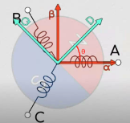

# dengFOC学习

参考资料：

* DENG FOC文档：`http://dengfoc.com/#/`

* 淘宝店：`https://shop564514875.taobao.com/`
* DengFOC 软件：`https://github.com/ToanTech/DengFOC_Lib`
* DengFOC 硬件：`https://github.com/ToanTech/DengFOC_Lib`
* 视频学习：`https://www.bilibili.com/video/BV1dy4y1X7yx`

## 1. 无刷电机概念与控制原理

### 1.1 无刷电机的基本结构


基本的航模无刷电机结构图如上图所示，分为前盖，中盖，后盖，磁铁，硅钢片，漆包线、轴承和转轴组成。

更加宏观上分，可以直接把电机分为。

- **定子**：就是有线圈绕组，固定不动的部分；
- **转子**：就是电机旋转的部分，用于输出电机的转动和扭矩。

进一步的，无刷电机可以分为：

- **内转子无刷电机：**就是转子在内部。
- **外转子无刷电机：**就是转子在外面，我们常见的无刷电机。比如航模无刷电机，就是外转子无刷电机。

**直流无刷电机的驱动**，就是依靠改变电机定子线圈的电流交变频率和波形, 在定子周围形成磁场, 驱动转子永磁体转动, 进而带动电机转起来。所以，想要让电机成功驱动，研究如何改变定子线圈的电流交变频率和波形就是我们的工作重点。

这个重点就可以进一步的分为两部分进行研究：

* 硬件电路部分

* 软件控制部分

### 1.2 无刷电机硬件控制原理

<font color=blue>无刷电机跟有刷电机的区别：</font>顾名思义就是无刷电机没有了有刷电机里的电刷。因此它不能够如同有刷电机那样采用机械结构就可以进行电流的换向， 而是必须通过采用如MOS这样的器件实现电子换向。


MOS本质上就是可以理解为一种开关，可以像水龙头控制水流通断一样控制电流通断。

就像上面这张图, 通过控制不同MOS管的通断组合, 电机线圈电流大小和方向就能够被改变。图中的Q0-Q5就是MOS管的代号，而右边的这个带有三个线圈的就是星形无刷电机的连结方式。

**电机转动原理**


当打开Q1管和Q2管, 电流的方向由A相流到B相, 再流出到负极，根据右手螺旋定则，此时电机定子的磁场分布就如上图所示。因此，此时定子线圈就会吸引转子的磁铁转动。但是这时，你会发现当转子磁铁旋转一定角度之后，磁铁此时就停止不动了，因此必须得改变现在的电磁场状态才能够让转子继续转动。


如上图所示，我们只需要接下来把Q1管和Q4管打开, 此时磁场的方向进一步发生改变，转子磁极发生进一步旋转。因此，只需要交替的开关不同的MOS管，就可以实现电机磁极的交替运动，这就是**无刷电机旋转运动的原理**。


上面的这张图，就是总结了转子磁铁旋转一周时各个相的通电情况，那么只要交替的开关这些各个相的MOS管，实现电机的转动。当MOS管开关的速度变快，那么就可以加速转子的转动；当MOS管开关的速度变慢，那么转子的转动速度减慢。

<font color=blue>总结：</font>

对电机的控制实际上就是对MOS管开关规律的控制。而MOS管的开关规律是需要用到单片机程序进行控制的，因此这就引出了我们的FOC控制算法，FOC控制就是一种对电机运动模型进行抽象化和简化，进而有规律控制各个MOS管开关和通断的过程。

## 2. FOC软件控制原理

FOC算法（磁场定向控制算法）：通过一个电机运行模型，实现交替开关各个MOS管的算法。

FOC算法的两个核心：

* 克拉克变换
* 帕克变换

### 2.1 克拉克变换

我们知道，交替开关的MOS管可以实现电机的转动，而这些交替开关的MOS管是以极其快的速度在周期性进行的，把这些周期性的开启和关断过程联系起来，并且对其各个相进行单独观察，就可以得到三个相A、B、C的电流随时间变换的曲线，如下图所示，他们之间存在120°的相位差。


换一个角度来思考此问题，实际上，我们只要能够<font color=blue>控制这个相位差为120°的sin状波形，就能够实现针对电机的控制</font>。而克拉克变换就是实现这个波形控制的第一步。

虽然说是要控制相位差120度的sin状型波形来实现电机控制，但是这个波形其实是极难控制和改变参数的。首先相与相之间是相互耦合的，MOS管一打开就会至少同时打开两个相，所以只想改变一相来实现电机控制是肯定不行的，必须得三相捷联起来一起改变，才能够实现电机的控制。所以，实现电机控制的问题就会变成很复杂。

因此，需要对这个问题进行降维，尽量把这个多变量耦合的问题降解为最好是单一变量的控制问题，克拉克变换就是想做这件事。

所谓<font color=blue>克拉克变换，实际上就是降维解耦的过程，把难以辨明和控制的三相相位差120°电机波形降维为两维矢量</font>。

<font color=red>克拉克变换步骤：</font>

* 第一就是把三相随时间变换的，相位差为120°的电流波形抽象化为三个间隔120°的矢量。

* 第二就是利用三角函数对矢量进行降维，降维到两个坐标轴，从复杂的三相变化问题降解为α-β坐标轴的坐标上的数值变化问题。


上图中，左边是我们把三相120度相位差的sin状波形抽象化为矢量之后的样子，而右边就是我们需要<font color=blue>把这三个矢量进行投影的坐标轴。只要我们把三个矢量都投影到坐标轴上，那么，一个三矢量问题就变成一个二维坐标平面问题</font>。

#### 投影过程的详细推导

求导过程就是在`α-β坐标系`进行三角函数的推导：


针对α-β坐标系中α轴，有：

​	$$I_\alpha = i_a - \sin30^\circ i_b - \cos60^\circ i_c$$

​	$$I_\alpha = i_a - \frac{1}{2} i_b - \frac{1}{2} i_c$$

针对α-β坐标系中β轴，有：

​	$$I_\beta = \cos30^\circ i_b - \cos30^\circ i_c$$

​	$$I_\beta = \frac{\sqrt{3}}{2} i_b - \frac{\sqrt{3}}{2} i_c$$

把上面的投影结果列成矩阵形式，有：
$$
\left[
\begin{matrix}
I_\alpha \\
I_\beta
\end{matrix}
\right]
=
\left[
\begin{matrix}
1 & -\frac{1}{2} & -\frac{1}{2} \\
0 & \frac{\sqrt{3}}{2} & -\frac{\sqrt{3}}{2}
\end{matrix}
\right]
\left[
\begin{matrix}
i_a \\
i_b \\
i_c
\end{matrix}
\right]
$$


这就是**克拉克变换的第一步，作投影**。

上面的推导较简单，但是最终论文和资料上克拉克变换的体现形式不是上面这样子，而是下面这两种方式：

* 等辐值变换方式，加上一个等辐值变换系数 $\frac{2}{3}$ ，公式如下：
  $$
  \left[
  \begin{matrix}
  I_\alpha \\
  I_\beta
  \end{matrix}
  \right]
  =
  \frac{2}{3}
  \left[
  \begin{matrix}
  1 & -\frac{1}{2} & -\frac{1}{2} \\
  0 & \frac{\sqrt{3}}{2} & -\frac{\sqrt{3}}{2}
  \end{matrix}
  \right]
  \left[
  \begin{matrix}
  i_a \\
  i_b \\
  i_c
  \end{matrix}
  \right]
  $$

* 等功率变换方式，加上一个等功率变换系数 $\sqrt{\frac{2}{3}}$ ，公式如下：
  $$
  \left[
  \begin{matrix}
  I_\alpha \\
  I_\beta
  \end{matrix}
  \right]
  =
  \sqrt{\frac{2}{3}}
  \left[
  \begin{matrix}
  1 & -\frac{1}{2} & -\frac{1}{2} \\
  0 & \frac{\sqrt{3}}{2} & -\frac{\sqrt{3}}{2}
  \end{matrix}
  \right]
  \left[
  \begin{matrix}
  i_a \\
  i_b \\
  i_c
  \end{matrix}
  \right]
  $$

<font color=blue>下面只讨论等辐值变换方式</font>

#### 克拉克变换的等辐值形式

何为等幅值变换？用α相电流输入1A电流的特例来举例：

用a相电流输入1A电流的特例来举例，当电流输入时候，根据基尔霍夫电流定律（电路中任一个节点上，在任意时刻，流入节点的电流之和等于流出节点的电流之和，如下图），有：
$$
i_a + i_b + i_c = 0
$$


设定$i_a$为-1，则根据上面的式子，有$i_b$和$i_c$为$\frac{1}{2}$，列成矩阵形式后，如下所示：
$$
\left[
\begin{matrix}
i_a \\
i_b \\
i_c
\end{matrix}
\right]
=
\left[
\begin{matrix}
-1 \\
\frac{1}{2} \\
\frac{1}{2}
\end{matrix}
\right]
$$
将这个$i_a$ $i_b$ $i_c$的参数带入到我们上面的直接投影式子中，得到：
$$
\left[
\begin{matrix}
I_\alpha \\
I_\beta
\end{matrix}
\right]
=

\left[
\begin{matrix}
1 & -\frac{1}{2} & -\frac{1}{2} \\
0 & \frac{\sqrt{3}}{2} & -\frac{\sqrt{3}}{2}
\end{matrix}
\right]
\left[
\begin{matrix}
i_a \\
i_b \\
i_c
\end{matrix}
\right] \\
\quad\quad\quad
=
\left[
\begin{matrix}
1 & -\frac{1}{2} & -\frac{1}{2} \\
0 & \frac{\sqrt{3}}{2} & -\frac{\sqrt{3}}{2}
\end{matrix}
\right]
\left[
\begin{matrix}
-1 \\
\frac{1}{2} \\
\frac{1}{2}
\end{matrix}
\right] \\
= 
\left[
\begin{matrix}
-\frac{3}{2} \\
0
\end{matrix}
\right] \quad\quad\quad\quad
$$
这就看出问题了，显然，尽管矢量a与$\alpha$轴重合，但是由于b,c相电流投影的存在，导致在a相输入1A电流，反应在$\alpha$轴上的电流并不是等辐值的1A，而是$-\frac{2}{3}$。

因此，<font color=blue>为了让式子等辐值，即使得a相1A时，反应在α轴上的电流也是1A，</font>我们就得乘上系数$\frac{2}{3}$，针对上面的投影式乘上$\frac{2}{3}$后，式子变换为：
$$
\left[
\begin{matrix}
I_\alpha \\
I_\beta
\end{matrix}
\right]
=
\frac{2}{3}
\left[
\begin{matrix}
1 & -\frac{1}{2} & -\frac{1}{2} \\
0 & \frac{\sqrt{3}}{2} & -\frac{\sqrt{3}}{2}
\end{matrix}
\right]
\left[
\begin{matrix}
-1 \\
\frac{1}{2} \\
\frac{1}{2}
\end{matrix}
\right] \\
= 
\frac{2}{3}
\left[
\begin{matrix}
-\frac{3}{2} \\
0
\end{matrix}
\right] \quad\quad\quad\quad \\
= 
\left[
\begin{matrix}
-1 \\
0
\end{matrix}
\right] \quad\quad\quad\quad
$$
这就是**克拉克变换的等幅值表现形式**。

#### 基于等辐值变换进一步推导

基于等辐值变换，我们就能够得到$\alpha$、$\beta$相位与$i_a$、$i_b$、$i_c$的关系，已知等辐值变换式：
$$
\left[
\begin{matrix}
I_\alpha \\
I_\beta
\end{matrix}
\right]
=
\frac{2}{3}
\left[
\begin{matrix}
1 & -\frac{1}{2} & -\frac{1}{2} \\
0 & \frac{\sqrt{3}}{2} & -\frac{\sqrt{3}}{2}
\end{matrix}
\right]
\left[
\begin{matrix}
i_a \\
i_b \\
i_c
\end{matrix}
\right]
$$
移项：
$$
I_\alpha = \frac{2}{3}(i_a - \frac{1}{2}i_b - \frac{1}{2}i_c) \\
I_\alpha = \frac{2}{3}[i_a - \frac{1}{2}(i_b + i_c)]
$$
又根据上面所提到的基尔霍夫电流定律：
$$
i_a + i_b + i_c = 0 \\
\frac{1}{2} i_a = -\frac{1}{2}(i_b + i_c) \\
I_\alpha = \frac{2}{3}[i_a + \frac{1}{2}i_a] \\
I_\alpha = \frac{2}{3}*\frac{3}{2} i_a \\
I_\alpha = i_a
$$
通过上述步骤，成功推导$I_\alpha = i_a$。

进一步，可求$I_\beta$，已知：
$$
I_\beta = \frac{2}{3}(\frac{\sqrt{3}}{2}i_b - \frac{\sqrt{3}}{2}i_c) \\
= \frac{\sqrt{3}}{3}(i_b - i_c) \quad \\
= \frac{1}{\sqrt{3}}(i_b - i_c) \quad
$$
又根据上面所提到的基尔霍夫电流定律：
$$
i_a + i_b + i_c = 0 \\ 
i_c = -(i_a + i_b) \\
I_\beta = \frac{1}{\sqrt{3}}*(i_b-i_c) \\
\quad \quad \quad= \frac{1}{\sqrt{3}}*(i_b+i_a+i_b) \\
\quad \quad= \frac{1}{\sqrt{3}}*(2i_b+i_a)
$$
综合上述步骤，我们已经得到了列出<font color=blue>$i_a$、$i_b$、$i_c$电流与$I\alpha$、$I_\beta$电流的关键关系式</font>，总结如下：
$$
\left\{
\begin{array} \\
	I_\alpha = i_a \\
    I_\beta = \frac{1}{\sqrt{3}}*(2i_b+i_a)
\end{array}
\right.
$$
<font color=blue>在式子中，我们消去了变量$i_c$，</font>这是因为由于基尔霍夫电流定律的存在，我们并不需要知道所有三相电流，我们只需要知道两相电流就能够求解得到另外一相的电流，反映在硬件上，<font color=blue>我们就可以省去一路的电流传感器，节省了成本。</font>

### 2.2 克拉克逆变换

上节课，我们用矢量来表示一个三相时域上的复杂问题，并且用克拉克变换对它进行了降维，得到了降维后的简化表达式。

**克拉克逆变换：**能够发过来把降维后的形式重新升维，变回原来的$i_a$、$i_b$、$i_c$三相电流波形。

根据上一节，我们得到了如下公式：
$$
\left\{
\begin{array} \\
	I_\alpha = i_a \\
    I_\beta = \frac{1}{\sqrt{3}}*(2i_b+i_a)
\end{array}
\right.
$$
推导逆变换$i_b$：
$$
I_\beta = \frac{1}{\sqrt{3}}*(2i_b+i_a) \\
I_\beta = \frac{1}{\sqrt{3}}*(2i_b+I_\alpha) \\
\sqrt{3} I_\beta = 2i_b+I_\alpha \\
2i_b = \sqrt{3} I_\beta - I_\alpha \\
i_b = \frac{\sqrt{3}I_\beta-I_\alpha}{2}
$$
根据`基尔霍夫电流定律`：$i_a + i_b + i_c = 0$，得到逆变换$i_c$：
$$
i_c = -(i_a+i_b) \\
= -I_\alpha - i_b \\
= -I_\alpha - \frac{\sqrt{3}I_\beta-I_\alpha}{2} \\
= \frac{-2I_\alpha - \sqrt{3}I_\beta+I_\alpha}{2} \\
= \frac{-I_\alpha - \sqrt{3}I_\beta}{2}
$$
则克拉克逆变换三个式子如下：
$$
\left\{
\begin{array} \\
	i_a = I_\alpha \\
    i_b = \frac{\sqrt{3}I_\beta-I_\alpha}{2} \\
    i_c = \frac{-I\alpha-\sqrt{3}I_\beta}{2}
\end{array}
\right.
$$
至此，我们就掌握了把三相电流波形进行降维（克拉克变换）的方法以及把降维后的结构还原回去的方法（克拉克逆变换）。

### 2.3 帕克变换

我们已经成功对电机的正弦驱动三相曲线进行降维，使之变为一个两轴坐标问题，并且得到其转换关系。但是只有它是不够的，我们还需要将这个理论和旋转电机对应起来，也就是**建立电机旋转时的数学模型**。

需要知道能够**使得电机旋转**的$I_\alpha$和$I_\beta$电流输入规律，然后就能通过克拉克逆变换，**把旋转情况下的$I_\alpha$和$I_\beta$逆变换为$i_a$、$i_b$、$i_c$三相电流波形**，从而实现了用$I_\alpha$和$I_\beta$来控制电机。

**帕克变换**就是能够帮助我们求得各种旋转情况下的$I_\alpha$和$I_\beta$。

帕克变化的思路，首先，我们在电机的定子线圈上固定一个$I_\alpha-I_\beta$ 坐标系，如下图左边的图所示，这时候在坐标系的右边放一个转子，如下图右边所示，如果此时转子被吸引且不动，那么在$I_\alpha-I_\beta$ 坐标系中就一定有一个$I_\alpha$和$I_\beta$值是能够对应转子现在的状态的。


但是在实际的应用中，转子是在不断的转动的，因此对应转子状态的$I_\alpha$和$I_\beta$值实际上是一直变化的，变化的东西总是不好描述，有没有办法能够用一个定值来描述无刷电机的旋转呢？也就是说，能不能对这个电机系统进行进一步的降维，使得我们甚至不用考虑变化的$I_\alpha$和$I_\beta$,只需要有一个定值就能够描述整个电机的转动状态呢？帕克变换就是想带我们做这件事。

在电机定子上新建一个$I_q-I_d$坐标系，这个坐标系可以随电机转子转动，它与电机转子固联，如下图所示：


这样我们就有了两个坐标系了，一个是固定在定子上的坐标系$I_\alpha-I_\beta$，一个是固定在转子上的坐标系$I_q-I_d$。

进一步，把两个坐标系画在一起，就有了如下图所示的坐标：



其中：

* $I_q-I_d$坐标系随转子转动。
* D轴指向电机的N级。
* $i_q-i_d$坐标系因转动而造成与$i_\alpha-i_\beta$坐标系的差角$\theta$，称为电角度。

利用三角函数构建出旋转矩阵，在知道电角度的前提下，把$I_q-I_d$坐标系上的值映射（旋转）到$I_\alpha-I_\beta$坐标系上，式子如下：
$$
\left[
\begin{matrix}
i_d \\
i_q
\end{matrix}
\right]
=
\left[
\begin{matrix}
cos\theta & sin\theta \\
-sin\theta & cos\theta\\
\end{matrix}
\right]
\left[
\begin{matrix}
i_\alpha \\
i_\beta \\
\end{matrix}
\right]
$$
因此在知道电角度的前提下，我们就可以用$i_q$、$i_d$坐标系上的定值来描述电机的旋转，这正是我们需要的**电机旋转数学模型**。

根据矩阵乘法，取逆，我们可进行帕克逆变换，也就是知道$i_q$和$i_d$值和电角度的前提下，反求$i_\alpha$和$i_\beta$，式子如下：
$$
\left[
\begin{matrix}
i_\alpha \\
i_\beta
\end{matrix}
\right]
=
\left[
\begin{matrix}
cos\theta & sin\theta \\
-sin\theta & cos\theta\\
\end{matrix}
\right]^\mathrm{-1}
\left[
\begin{matrix}
i_q \\
i_d \\
\end{matrix}
\right]
$$
写成等式：
$$
i_\alpha = i_dcos\theta - i_qsin\theta \\
i_\beta = i_qcos\theta + i_dsin\theta
$$
在实际的应用中，电角度是由编码器实时求出的，因此是已知的。$I_q$和$I_d$可以合成一个矢量，加上电角度（旋转）的存在，因此可以看成一个旋转的矢量。在通过$I_q$、$I_d$和电角度求得$I_\alpha$和$I_\beta$后，我们就可以通过前面提到的克拉克逆变换求得$i_a$、$i_b$、$i_c$的波形，这正是FOC的基本过程。

通常在简单的FOC的应用中，我们只需要控制$I_q$的电流大小，而把$I_d$设置为0。此时，$I_q$的大小间接就决定了三相电流的大小，进而决定了定子产生磁场的强度。进一步我们就可以说，它决定了电机产生的力矩大小。

而$I_q$是旋转的矢量；在前面说了，同时$I_q$又会间接影响磁场的强度，这正是FOC的名称**磁场定向控制**的由来。

### 2.4 FOC基础算法过程总结


所谓的FOC过程，其实就是输入需求的电机力矩，最后得到对应的真实世界电机输出力矩的过程，如上图所示。

其中最核心的就是帕克变换和克拉克逆变换。

* 帕克变化可以对用户输入的$I_q$进行变换，根据电角度算出$I_\alpha$和$I_\beta$。
* 接着通过克拉克逆变换，求出三相电流$i_a$、$i_b$、$i_c$。
* 最后这三个$i_a$、$i_b$、$i_c$能够用作控制指令输入到电机控制器硬件中，进行电机的控制。

## 3. FOC开环速度代码的撰写

### 3.1 三相电压矢量


电流矢量乘以相电阻R后可得到电压矢量，二者幅值不同但矢量关系相似。无刷电机的电流矢量和电压矢量区别仅在于幅值，推导过程一致。

### 3.2 整个FOC算法教学过程总结


- **电流矢量与电压矢量下的FOC算法**：克拉克变换和帕克变换在二者推导过程相同，仅符号不同。代码实现时更常用电压形式的公式，因电流控制较难，常见无刷电机控制芯片和电路只能接受电压控制信号。
- **电压形式FOC算法的起始**：撰写代码时，先从电压形式FOC算法开始。

### 3.3 开始写开环速度FOC代码


- **开发平台**：基于ESP32 Arduino平台的DengFOC。
- **函数设计**：
  - `setPhaseVoltage`函数：实现帕克逆变换和克拉克逆变换，计算电机控制所需的ua、ub、uc，并通过`setPWM`函数传递给电机驱动器硬件。帕克逆变换中Ud=0，代码中加入`voltage_power_supply/2`项将电压平移至供电电压中间，避免负电压。`_normalizeAngle`函数将电角度限制在`0-2π`。
  - `setPWM`函数：限制ua、ub、uc输出范围，求出对应的PWM占空比以调节ESP32输出电压，实现电机控制。PWM占空比控制输出电压原理：高电平占比不同，经阻容低通滤波得到不同平均电压。
  - `velocityOpenloop`函数：根据目标电机转速计算Uq和电角度，传递给`setPhaseVoltage`函数。需理解电角度和机械角度的关系：`电角度=机械角度×极对数`。

### 3.4 电角度和机械角度的关系


- **极对数影响**：以极对数为1的电机为例，转子磁极N转一圈，U相发电一个周期。若极对数为2，电机转一圈，U相会有两个发电周期。极对数越多，机械角度转一圈对应的发电周期越多。


- **公式**：电角度=机械角度×极对数。算法表示时希望相位周期数值一一对应，故有此公式。如极对数为11的电机，机械角度转一圈对应11个相位周期，电角度=11×机械角度。

如我们之前用DengFOC驱动的大航模电机5212，极对数为11,我们可以来看看它的发电周期是多少，我们把电机接上示波器，用手转示波器一圈，如下图所示。

我们可以看到，总共有11个波锋出现，代表有11个发电周期，恰好等于我们的极对数。而这个现象也正揭示了为什么电角度=机械角度x极对数，那是因为，如果只是刚刚的一级对电机，那么的机械角度转一圈，相位的一个周期是能够和机械角度一一对应的，此时电角度=机械角度；但是，如果是多级电机，那么机械角度转一圈，相位的周期可能是很多个。


### 3.5 实验

代码：`DengFOC_Lib_Lesson5_OpenLoop_Vel/DengFOC_Lib_Lesson5_OpenLoop_Vel.ino`

流程说明：

* Uq 为固定值，最大值可取供电电压的一半
* Ud 为0

* angle_el：由代码模拟生成（后面由编码器测得）。

  angle_el 模拟生成原理：设定一个目标速度（如5 rad/s），乘以时间得到需要转动的机械角度，再将机械角度转成电角度就是需要的角度值。

总结：

当Uq为大于0的值，且有个旋转的电角度，就可以使电机旋转起来。

## 4. FOC闭环位置代码撰写

### 4.1 复盘开环速度FOC算法过程


开环速度过程：输入希望电机转动的需求速度，代码通过一个Uq和电角度生成器，根据你设置的期望速度来生成不断旋转的电角度，最后，把电角度和你想让电机旋转的力矩Uq输入到FOC算法中进行计算，最后输出ua、ub、uc来驱动电机旋转。

<font color=red>总结：开环速度foc是Uq固定，利用旋转的电角度来驱动电机旋转；后面的其他实验，电角度都是通过编码器测得的，通过改变Uq来驱动电机旋转。</font>

### 4.2 闭环位置控制的本质


闭环位置控制的情况如上图：

* 假设给电机设定的期望角度为0度，此时电机蓝色箭头与alpha轴重合
* 用手逆时针旋转电机，把电机扭转到蓝色箭头与alpha轴形成45度的偏差
* 此时，若电机需要回到0度位置，那么电机就需要产生一个顺时针的力矩（如红色箭头所示），力矩在这里是和Uq等效的。

所谓的闭环位置控制的方法，就是要处理两个问题：

* 怎么检测偏差的角度

* 怎么产生合适的旋转力矩Uq

<font color=blue>偏差角度</font>

首先设定逆时针旋转方向为负方向，顺时针旋转方向为正方向。

设定电机的偏差位置采用e来进行表示，误差位置可以用下面这条公式进行计算：

```txt
误差位置e = 期望位置 - 偏差位置 = -45度
```

<font color=blue>根据偏差角度，产生合适的旋转力矩</font>


接下来的问题，就是如何根据-45度求出一个力矩Uq，使得电机转子回位的问题。

实际上，我们可以通过供电电压来计算出我们Uq能设定的最大值，以12v供电为例，实际上我们能够设定的Uq最大值仅有12v/2=±6V。

为什么要除以2呢？

* 因为在上一节课中，我们已经把ua、ub、uc曲线移动到供电电压中央，如下图代码所示：

  

* 在加上了供电电压变量voltage_power_supply/2后，实际上ua,ub,uc曲线的0点就由6v开始，而这个移动是必须的，因为不这么移动，ua,ub,uc的正弦波特性会使得驱动出现负电压，驱动器也没法产生负电压，这显然不可接受。
* 那么，移动后，显然ua,ub,uc的变化范围就只有±6了，这也影响到了uq,因此，uq的变化范围也会仅剩下±6

由此，我们就通过供电电压，确定了Uq的最大值Uqmax。

假设我们希望电机在偏差达到45度时，输出最大的回正力矩，也就是说此时电机在-45度时，需要输出最大的顺时针力矩Uq=-6V，来回正。

> 注：这里只是希望在45度时，可以输出最大的回正力矩，而不是说输出最大回正力矩就能让电机一把就从-45度回到0度，从45度回到0度过程中，随着偏差角度的变化，输出力矩也会变化，这是在一段时间内完成的。

此时我们可以得出P环系数Kp的计算公式：

```txt
系数Kp=|Uqmax| ÷ |±45| = 6 ÷ 45 = 0.133
```

在求出这个Kp后，我们就能够通过一个简单的乘法，列出偏差e和Uq的换算关系式：

```txt
Uq = Kp * e
```

对应我们的电机在e=-45度偏差的时候，会产生Uq产生接近-6v的值-5.985v。

这个Kp，正是我们常说的PID控制器中的p环系数，我们刚刚的推导，正是PID中p环的纠偏原理！

<font color=blue>PID控制器</font>


实际上PID控制器，还有I环和D环两环没有介绍，我们今天仅仅介绍了P环在无刷电机位置闭环上的纠偏实现！而I环和D环怎么应用在电机上，会在后面学习。

<font color=blue>闭环位置控制的本质：</font>

公式：

```txt
Uq = Kp * e
```

* Kp：通过最大力矩限制计算得到
* e：通过编码器测得电机转子角度


总结：

* 相比于开环的过程，我们增加了P控制器部分和电机转子角度的测量部分
* 开头先通过编码器的读数算出了e，然后将e输入到P控制器中，算出一个可以用于纠正偏差的Uq，将其输入给foc算法，计算出所需要的Ualpha和Ubeta，以及最后输出ua,ub,uc给无刷电机，驱动电机转动。通过这一波操作，我们就能够完成电机位置闭环。
* 需要额外注意的是：电机位置闭环控制中，帕克逆变换计算所需要用到的电角度，也是由编码器测出的。（当然需要转成电角度才能使用）

<font color=blue>注意事项：</font>


* 当前所讲述的位置闭环其实只是方式1 `位置-力闭环控制（也叫力位控制）`，实际上我们今天的控制并没有完整的实现位置-力控制，我们仅仅只是对位置进行了闭环而尚未对力矩进行闭环。

* 实现位置闭环的方式也不仅仅只有方式1这一种，实际上方式2也很常见，就是通过位置环偏差，先输出一个速度环期望，再输出一个力矩期望给力矩环，实现三环嵌套位置闭环控制。

### 4.3 实验：

<font color=blue>代码：</font>

教程上代码有两个版本：

* 分文件写（ESP32_V3P的例程和github上都有）

  `第六章a+b 闭环位置FOC代码-DengFOC库v0.1\DengFOC_Lib_lesson6`

* 全部写在一个文件（github上有）

  `第六章a+b 闭环位置FOC代码-DengFOC库v0.1/2 单文件实现闭环代码（6b课程前半部分）`

接下来只介绍分文件的版本，主控制ino文件代码如下：

```c
void loop() 
{
  //输出角度值
  //Serial.print("当前角度：");
  //Serial.println(DFOC_M0_Angle());
  //输出角度值
  float Kp=0.133;
  float Sensor_Angle=DFOC_M0_Angle();
  setTorque(Kp*(serial_motor_target()-Sensor_DIR*Sensor_Angle)*180/PI,_electricalAngle());   //位置闭环

    /*串口输入指令 target\n  10\n  */
  serialReceiveUserCommand();
}
```


<font color=blue>实验前猜测：电机在转到目标角度时，因为力矩精度的问题，可能会在目标角度之间震荡</font>

<font color=blue>验证：</font>

实验代码：

```c
void loop() 
{
  //输出角度值
  float Kp=0.133;
  float Sensor_Angle=DFOC_M0_Angle();
  float Uq = Kp*(serial_motor_target()-Sensor_DIR*Sensor_Angle)*180/PI;
  float ele_angle = _electricalAngle();
  static int count = 0;
  count += 1;
  if(count >= 10) {
    count = 0;
    Serial.printf("Uq:%f Sensor_Angle:%f ele_angle:%f\n", Uq, Sensor_Angle, ele_angle);
  }
  
  setTorque(Uq, ele_angle);   //位置闭环
    /*串口输入指令 target\n  10\n  */
  serialReceiveUserCommand();

}
```


烧写代码后，输入目标角度1，转动foc偏离目标角度后放开，确实会在目标角度之间震荡，后面就一直稳定在0.98xx的值内变化。


## 5. FOC闭环速度代码撰写

### 5.1 内容概述


复盘上一节课介绍的闭环位置FOC：通过编码器测出设定位置与当前位置的偏差，把这偏差输入给P控制器，再计算出纠偏所需要的电机力矩，最后输出给电机的过程。

接下来介绍速度闭环算法，它与位置闭环算法有很多相似之处


速度闭环算法和位置闭环算法的区别：

* 位置闭环的编码器反馈量是角度，而速度闭环的编码器反馈量是速度
* 速度闭环引入了其他程序：低通滤波以及PI控制器

本节课的内容：

* 通过编码器获取电机的转子速度。
* 滤波的作用：
  * 为什么要对速度值进行滤波？
  * 怎么通过低通滤波对获取的速度值进行过滤？
  * 不滤波会怎样？
* PI控制器的作用：
  * 为什么用PI控制器会有更好的控制效果？
  * 不用PI控制器会怎样？用了会怎样？

本节讲解的代码库版本：


在v0.2的代码库中，增加：

* 编码器的速度读取部分（AS5600编码器库）
* lowpass filter 库：低通滤波
* PID算法库

本节结束后，DengFOC库能实现下面的四个功能：

* 速度闭环功能
* 力-速度闭环功能（这就是上节课讲解的 角度闭环的方式2）

* 力位闭环功能（这就是上节课讲解的 电机闭环形式）
* 电压力矩控制（这个是上节课已经实现的功能）

### 5.2 速度获取

#### 5.2.1 更新编码器角度


这段代码通过比较当前角度和上一次角度之间的差值来判断是否发生了圈数的变化，如果发生圈数的变化，则更新圈数变量`full_rotations`，未超过的部分也会存储在`angle_prev`里。

#### 5.2.2 获取编码器角度


`getAngle()` 函数：利用上面`Sensor_update()`中得到的`full_rotations`圈数值换算成角度后，再加上现在没超过一圈情况下的角度。

#### 5.2.3 获取编码器速度


编码器物理上是只能获取到角度值的，因此速度值一定是只能被间接求出，这里求速度的原理：

`(本时刻的编码器值-上一时刻的编码器值)/ 时间 `

#### 5.2.4 滤波


我们还需要对速度值进行滤波才行，不然会有很多跳动，导致不能使用。

接下来我们使用低通滤波器来对速度进行滤波。

### 5.3 速度低通滤波

#### 5.3.1 速度闭环代码与位置闭环代码区别


速度闭环代码和位置闭环代码的区别：两个代码没有本质上的区别，无非就是速度闭环把位置闭环的`Sensor_angle`这个角度值变成了`Sensor_Velocity`这个速度值。

在速度闭环模式下，如果不对速度值进行滤波，电机就会发出"吱吱吱"的声音，这是由于速度值的波动引起的，要解决该问题就需要进行滤波处理。滤波有很多种方法，我们这边使用低通滤波。

#### 5.3.2 低通滤波器的作用


滤波器的作用：如上图所示，滤波器把左图有波动、有干扰的速度信号转换成右边平滑的速度信号。

#### 5.3.3 低通滤波器代码


该函数输入当前传感器测量值x，输出滤波后的值y。

代码讲解：

* 计算平滑因子的公式：`alpha = Tf / (Tf + dt) `，它基于指数衰减滤波器的原理。

  该公式的目的是根据时间常数和时间间隔的比例来控制 滤波器 对当前输入信号和前一次滤波结果的加权比例，具体解释如下：

  * 当时间间隔 dt 远小于时间常数 Tf 时，dt ≈ 0，alpha ≈ Tf / (Tf + 0) ≈ 1。这意味着滤波器主要依赖于前一次的滤波结果，当前输入信号的影响较小
  * 当时间间隔 dt 远大于时间常数 Tf 时，d t ≈ ∞，alpha ≈ Tf / (Tf + ∞) ≈ 0。这意味着滤波器主要依赖于当前的输入信号，前一次的滤波结果的影响较小。

总的来说，这段代码实现了一个低通滤波器，通过计算时间间隔和平滑因子来对输入信号进行平滑处理，并返回滤波结果。在滤波过程中，会考虑异常情况和较大时间间隔的处理。

### 5.4 速度PI控制器

#### 5.4.1 速度环只有P环的缺陷


如上图所示，只有P环的情况下，期望速度和真实速度的差值直接乘上一个P环系数Kp，通过调节这个系数，就可以实现强或者弱的稳态纠偏效果。<font color=red>在实际的应用中，会发现这个P只能对恒定的误差起作用，而不能对系统的特性起作用。</font>

下面的例子用来说明该问题：


如上图所示的电机调速底座有两个电机，左边的电机负载500g的重物，右边电机负载10g的重物，它们现在都顺时针旋转。假设目前两个电机的转动速度都只有5rad/s，我们的目标速度是10rad/s，假设kp=1，计算出来的输出力矩就是5，左右两边不同负载的电机获得一样的力矩。

这就导致了一个问题，两边的数据力矩一样，但是负载不一样，惯性就不一样，在输出力矩相同的情况下，左边的电机要比右边的电机难假设很多。这就揭示了一个问题：在不同负载的情况下，仅有P环调节会使得电机的稳定效果不一样，大负载时稳定速度会变慢，小负载时稳定速度会变快。

仅有P环只能起到一定的稳态作用，特别是不适用于交变负载的情况下。加入I环就可以帮我们处理该问题，I环可以使得电机能够根据负载自适应进行力矩输出，在负载大时，自动提高力矩输出。

#### 5.4.2 PI速度控制器


I环：由一个系数Ki和一个对误差在时间上进行不断积分的积分项组成的

* Ki：被称为I环的反馈系数
* 后面的积分：是在时间上对误差进行积分，也就是说，当误差存在的时间越长，这个积分值就会越来越大，直到e(tao)变为0位置。最后，这个积分会乘上系数Ki，进行一个Ki的比例缩放后叠加在电机力矩上。

在上面的例子中，当负载为500g时，电机要从5rad/s变成10rad/s时，设Kp=1,有了I环后，当这e(t)很久没有被p环调节过来时，I环的积分就会不断的积分这个e(t)，使得电机的输出力越来越大，最终让电机实现更快的纠偏。

#### 5.4.3 I环的代码实现


* 上图红色框圈着的代码：是计算积分部分的输出。使用Tustin变换的离散积分公式，将上一次的输出`integral_prev`加上积分系数I、采样时间Ts以及当前误差`error`和上一次误差`error_prev`的平均值的乘积，得到积分输出`integral`。

* 离散的积分：可以堪称很多个小矩形组合在一起求面积，就如上图右下角的图所示，因此，Ts就是相当于离散积分的`x`轴长度，`0,5f*(error+error_prev)`就是积分小矩形的高度，这个高度通过两次误差的平均值得到。

最后，把`integral`加上之前P环的输出值，就成了所谓的PI控制器。

#### 5.4.4 实验


## 参考资料

无刷电机和有刷电机的区别：`https://www.sumzi.com/new201509/news_info.aspx?id=9913`


# FOC平衡车

## 1. 测试环境搭建

### 1.1 软件开发环境

#### 1.1.1 安装库 `esp32 by Espressif Systems`

安装的版本：`2.0.4`

* 进入`BOARDS MANAGER`页面
* 输入`esp32`
* `esp32 by Espressif Systems`选择`2.0.4`版本进行安装 


### 1.2 硬件连接（简单测试FOC）

* 连接电源线
* 连接电机（三条线不区分顺序）
* 插上ESP32开发板


### 1.3 烧写测试代码

使用开环速度FOC代码进行测试，代码位置：

```txt
V3P资料包\3、V3P驱动板例程程序\ESP32_V3P例程\DengFOC_库例程\【手把手教些FOC算法】系列课程代码\第五章a+b 开环速度FOC代码\DengFOC_Lib_Lesson5_OpenLoop_Vel
```

打开该arduino工程：

* 配置开发板为 `ESP32 Dev Module`

  

* 选择端口号

  

点击烧录并下载程序：


接通电源，就可以看到电机旋转了。

> 电源为`12V2A`


## 其他

###1. 配置存储路径，避免占用C盘空间

* 配置项目位置：

  `File-->Preferences->Sketchbook location`

  

  

* 修改安装库的存储路径

  打开配置文件：`C:\Users\xxx\.arduinoIDE\arduino-cli.yaml`

  修改`libraries`和`data`到其他盘：

  这边选择到D盘：`D:\01.software\arduinoIDE\Arduino15`

  


