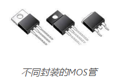
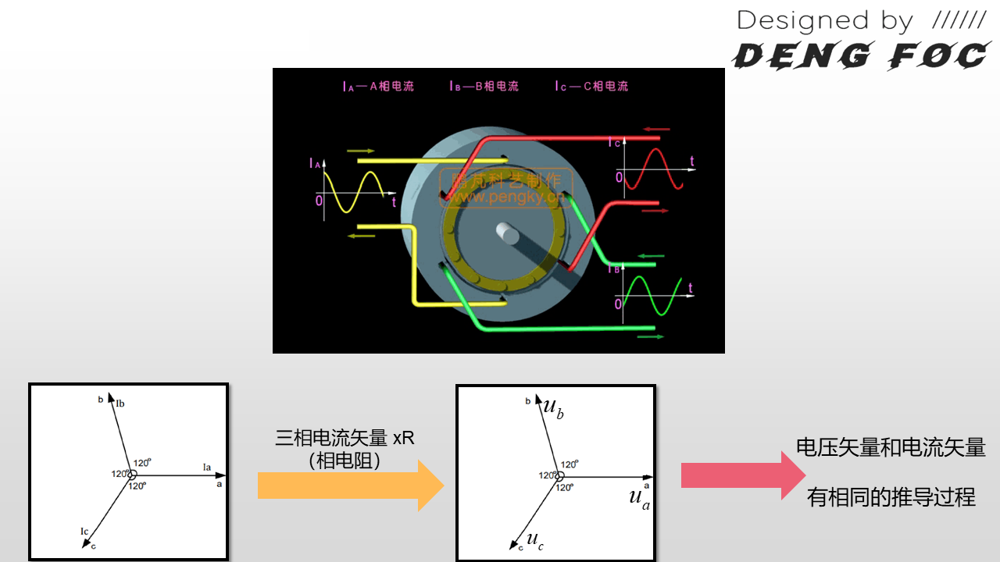

# dengFOC学习

参考资料：

* DENG FOC文档：`http://dengfoc.com/#/`

* 淘宝店：`https://shop564514875.taobao.com/`
* DengFOC 软件：`https://github.com/ToanTech/DengFOC_Lib`
* DengFOC 硬件：`https://github.com/ToanTech/DengFOC_Lib`
* 视频学习：`https://www.bilibili.com/video/BV1dy4y1X7yx`

## 1. 无刷电机概念与控制原理

### 1.1 无刷电机的基本结构

基本的航模无刷电机结构图如上图所示，分为前盖，中盖，后盖，磁铁，硅钢片，漆包线、轴承和转轴组成。

更加宏观上分，可以直接把电机分为。

- **定子**：就是有线圈绕组，固定不动的部分；
- **转子**：就是电机旋转的部分，用于输出电机的转动和扭矩。

进一步的，无刷电机可以分为：

- **内转子无刷电机：**就是转子在内部。
- **外转子无刷电机：**就是转子在外面，我们常见的无刷电机。比如航模无刷电机，就是外转子无刷电机。

**直流无刷电机的驱动**，就是依靠改变电机定子线圈的电流交变频率和波形, 在定子周围形成磁场, 驱动转子永磁体转动, 进而带动电机转起来。所以，想要让电机成功驱动，研究如何改变定子线圈的电流交变频率和波形就是我们的工作重点。

这个重点就可以进一步的分为两部分进行研究：

* 硬件电路部分

* 软件控制部分

### 1.2 无刷电机硬件控制原理

无刷电机跟有刷电机的区别：顾名思义就是无刷电机没有了有刷电机里的电刷。因此它不能够如同有刷电机那样采用机械结构就可以进行电流的换向， 而是必须通过采用如MOS这样的器件实现电子换向。

MOS本质上就是可以理解为一种开关，可以像水龙头控制水流通断一样控制电流通断。

就像上面这张图, 通过控制不同MOS管的通断组合, 电机线圈电流大小和方向就能够被改变。图中的Q0-Q5就是MOS管的代号，而右边的这个带有三个线圈的就是星形无刷电机的连结方式。

**电机转动原理**

当打开Q1管和Q2管, 电流的方向由A相流到B相, 再流出到负极，根据右手螺旋定则，此时电机定子的磁场分布就如上图所示。因此，此时定子线圈就会吸引转子的磁铁转动。但是这时，你会发现当转子磁铁旋转一定角度之后，磁铁此时就停止不动了，因此必须得改变现在的电磁场状态才能够让转子继续转动。

如上图所示，我们只需要接下来把Q1管和Q4管打开, 此时磁场的方向进一步发生改变，转子磁极发生进一步旋转。因此，只需要交替的开关不同的MOS管，就可以实现电机磁极的交替运动，这就是**无刷电机旋转运动的原理**。

上面的这张图，就是总结了转子磁铁旋转一周时各个相的通电情况，那么只要交替的开关这些各个相的MOS管，实现电机的转动。当MOS管开关的速度变快，那么就可以加速转子的转动；当MOS管开关的速度变慢，那么转子的转动速度减慢。

总结：

对电机的控制实际上就是对MOS管开关规律的控制。而MOS管的开关规律是需要用到单片机程序进行控制的，因此这就引出了我们的FOC控制算法，FOC控制就是一种对电机运动模型进行抽象化和简化，进而有规律控制各个MOS管开关和通断的过程。

## 2. FOC软件控制原理

FOC算法（磁场定向控制算法）：通过一个电机运行模型，实现交替开关各个MOS管的算法。

FOC算法的两个核心：

* 克拉克变换
* 帕克变换

### 2.1 克拉克变换

我们知道，交替开关的MOS管可以实现电机的转动，而这些交替开关的MOS管是以极其快的速度在周期性进行的，把这些周期性的开启和关断过程联系起来，并且对其各个相进行单独观察，就可以得到三个相A、B、C的电流随时间变换的曲线，如下图所示，他们之间存在120°的相位差。

换一个角度来思考此问题，实际上，我们只要能够控制这个相位差为120°的sin状波形，就能够实现针对电机的控制。而克拉克变换就是实现这个波形控制的第一步。

虽然说是要控制相位差120度的sin状型波形来实现电机控制，但是这个波形其实是极难控制和改变参数的。首先相与相之间是相互耦合的，MOS管一打开就会至少同时打开两个相，所以只想改变一相来实现电机控制是肯定不行的，必须得三相捷联起来一起改变，才能够实现电机的控制。所以，实现电机控制的问题就会变成很复杂。

因此，需要对这个问题进行降维，尽量把这个多变量耦合的问题降解为最好是单一变量的控制问题，克拉克变换就是想做这件事。

所谓克拉克变换，实际上就是降维解耦的过程，把难以辨明和控制的三相相位差120°电机波形降维为两维矢量。

克拉克变换步骤：

* 第一就是把三相随时间变换的，相位差为120°的电流波形抽象化为三个间隔120°的矢量。

* 第二就是利用三角函数对矢量进行降维，降维到两个坐标轴，从复杂的三相变化问题降解为α-β坐标轴的坐标上的数值变化问题。

上图中，左边是我们把三相120度相位差的sin状波形抽象化为矢量之后的样子，而右边就是我们需要把这三个矢量进行投影的坐标轴。只要我们把三个矢量都投影到坐标轴上，那么，一个三矢量问题就变成一个二维坐标平面问题。

#### 投影过程的详细推导

求导过程就是在`α-β坐标系`进行三角函数的推导：

针对α-β坐标系中α轴，有：

​	$$I_\alpha = i_a - \sin30^\circ i_b - \cos60^\circ i_c$$

​	$$I_\alpha = i_a - \frac{1}{2} i_b - \frac{1}{2} i_c$$

针对α-β坐标系中β轴，有：

​	$$I_\beta = \cos30^\circ i_b - \cos30^\circ i_c$$

​	$$I_\beta = \frac{\sqrt{3}}{2} i_b - \frac{\sqrt{3}}{2} i_c$$

把上面的投影结果列成矩阵形式，有：
$$
\left[
\begin{matrix}
I_\alpha \\
I_\beta
\end{matrix}
\right]
=
\left[
\begin{matrix}
1 & -\frac{1}{2} & -\frac{1}{2} \\
0 & \frac{\sqrt{3}}{2} & -\frac{\sqrt{3}}{2}
\end{matrix}
\right]
\left[
\begin{matrix}
i_a \\
i_b \\
i_c
\end{matrix}
\right]
$$

这就是**克拉克变换的第一步，作投影**。

上面的推导较简单，但是最终论文和资料上克拉克变换的体现形式不是上面这样子，而是下面这两种方式：

* 等辐值变换方式，加上一个等辐值变换系数 $\frac{2}{3}$ ，公式如下：
  $$
  \left[
  \begin{matrix}
  I_\alpha \\
  I_\beta
  \end{matrix}
  \right]
  =
  \frac{2}{3}
  \left[
  \begin{matrix}
  1 & -\frac{1}{2} & -\frac{1}{2} \\
  0 & \frac{\sqrt{3}}{2} & -\frac{\sqrt{3}}{2}
  \end{matrix}
  \right]
  \left[
  \begin{matrix}
  i_a \\
  i_b \\
  i_c
  \end{matrix}
  \right]
  $$

* 等功率变换方式，加上一个等功率变换系数 $\sqrt{\frac{2}{3}}$ ，公式如下：
  $$
  \left[
  \begin{matrix}
  I_\alpha \\
  I_\beta
  \end{matrix}
  \right]
  =
  \sqrt{\frac{2}{3}}
  \left[
  \begin{matrix}
  1 & -\frac{1}{2} & -\frac{1}{2} \\
  0 & \frac{\sqrt{3}}{2} & -\frac{\sqrt{3}}{2}
  \end{matrix}
  \right]
  \left[
  \begin{matrix}
  i_a \\
  i_b \\
  i_c
  \end{matrix}
  \right]
  $$

下面只讨论等辐值变换方式

#### 克拉克变换的等辐值形式

何为等幅值变换？用α相电流输入1A电流的特例来举例：

用a相电流输入1A电流的特例来举例，当电流输入时候，根据基尔霍夫电流定律（电路中任一个节点上，在任意时刻，流入节点的电流之和等于流出节点的电流之和，如下图），有：
$$
i_a + i_b + i_c = 0
$$

设定$i_a$为-1，则根据上面的式子，有$i_b$和$i_c$为$\frac{1}{2}$，列成矩阵形式后，如下所示：
$$
\left[
\begin{matrix}
i_a \\
i_b \\
i_c
\end{matrix}
\right]
=
\left[
\begin{matrix}
-1 \\
\frac{1}{2} \\
\frac{1}{2}
\end{matrix}
\right]
$$
将这个$i_a$ $i_b$ $i_c$的参数带入到我们上面的直接投影式子中，得到：
$$
\left[
\begin{matrix}
I_\alpha \\
I_\beta
\end{matrix}
\right]
=

\left[
\begin{matrix}
1 & -\frac{1}{2} & -\frac{1}{2} \\
0 & \frac{\sqrt{3}}{2} & -\frac{\sqrt{3}}{2}
\end{matrix}
\right]
\left[
\begin{matrix}
i_a \\
i_b \\
i_c
\end{matrix}
\right] \\
\quad\quad\quad
=
\left[
\begin{matrix}
1 & -\frac{1}{2} & -\frac{1}{2} \\
0 & \frac{\sqrt{3}}{2} & -\frac{\sqrt{3}}{2}
\end{matrix}
\right]
\left[
\begin{matrix}
-1 \\
\frac{1}{2} \\
\frac{1}{2}
\end{matrix}
\right] \\
= 
\left[
\begin{matrix}
-\frac{3}{2} \\
0
\end{matrix}
\right] \quad\quad\quad\quad
$$
这就看出问题了，显然，尽管矢量a与$\alpha$轴重合，但是由于b,c相电流投影的存在，导致在a相输入1A电流，反应在$\alpha$轴上的电流并不是等辐值的1A，而是$-\frac{2}{3}$。

因此，为了让式子等辐值，即使得a相1A时，反应在α轴上的电流也是1A，我们就得乘上系数$\frac{2}{3}$，针对上面的投影式乘上$\frac{2}{3}$后，式子变换为：
$$
\left[
\begin{matrix}
I_\alpha \\
I_\beta
\end{matrix}
\right]
=
\frac{2}{3}
\left[
\begin{matrix}
1 & -\frac{1}{2} & -\frac{1}{2} \\
0 & \frac{\sqrt{3}}{2} & -\frac{\sqrt{3}}{2}
\end{matrix}
\right]
\left[
\begin{matrix}
-1 \\
\frac{1}{2} \\
\frac{1}{2}
\end{matrix}
\right] \\
= 
\frac{2}{3}
\left[
\begin{matrix}
-\frac{3}{2} \\
0
\end{matrix}
\right] \quad\quad\quad\quad \\
= 
\left[
\begin{matrix}
-1 \\
0
\end{matrix}
\right] \quad\quad\quad\quad
$$
这就是**克拉克变换的等幅值表现形式**。

#### 基于等辐值变换进一步推导

基于等辐值变换，我们就能够得到$\alpha$、$\beta$相位与$i_a$、$i_b$、$i_c$的关系，已知等辐值变换式：
$$
\left[
\begin{matrix}
I_\alpha \\
I_\beta
\end{matrix}
\right]
=
\frac{2}{3}
\left[
\begin{matrix}
1 & -\frac{1}{2} & -\frac{1}{2} \\
0 & \frac{\sqrt{3}}{2} & -\frac{\sqrt{3}}{2}
\end{matrix}
\right]
\left[
\begin{matrix}
i_a \\
i_b \\
i_c
\end{matrix}
\right]
$$
移项：
$$
I_\alpha = \frac{2}{3}(i_a - \frac{1}{2}i_b - \frac{1}{2}i_c) \\
I_\alpha = \frac{2}{3}[i_a - \frac{1}{2}(i_b + i_c)]
$$
又根据上面所提到的基尔霍夫电流定律：
$$
i_a + i_b + i_c = 0 \\
\frac{1}{2} i_a = -\frac{1}{2}(i_b + i_c) \\
I_\alpha = \frac{2}{3}[i_a + \frac{1}{2}i_a] \\
I_\alpha = \frac{2}{3}*\frac{3}{2} i_a \\
I_\alpha = i_a
$$
通过上述步骤，成功推导$I_\alpha = i_a$。

进一步，可求$I_\beta$，已知：
$$
I_\beta = \frac{2}{3}(\frac{\sqrt{3}}{2}i_b - \frac{\sqrt{3}}{2}i_c) \\
= \frac{\sqrt{3}}{3}(i_b - i_c) \quad \\
= \frac{1}{\sqrt{3}}(i_b - i_c) \quad
$$
又根据上面所提到的基尔霍夫电流定律：
$$
i_a + i_b + i_c = 0 \\ 
i_c = -(i_a + i_b) \\
I_\beta = \frac{1}{\sqrt{3}}*(i_b-i_c) \\
\quad \quad \quad= \frac{1}{\sqrt{3}}*(i_b+i_a+i_b) \\
\quad \quad= \frac{1}{\sqrt{3}}*(2i_b+i_a)
$$
综合上述步骤，我们已经得到了列出$i_a$、$i_b$、$i_c$电流与$I\alpha$、$I_\beta$电流的关键关系式，总结如下：
$$
\left\{
\begin{array} \\
	I_\alpha = i_a \\
    I_\beta = \frac{1}{\sqrt{3}}*(2i_b+i_a)
\end{array}
\right.
$$
在式子中，我们消去了变量$i_c$，这是因为由于基尔霍夫电流定律的存在，我们并不需要知道所有三相电流，我们只需要知道两相电流就能够求解得到另外一相的电流，反映在硬件上，我们就可以省去一路的电流传感器，节省了成本。

### 2.2 克拉克逆变换

上节课，我们用矢量来表示一个三相时域上的复杂问题，并且用克拉克变换对它进行了降维，得到了降维后的简化表达式。

**克拉克逆变换：**能够发过来把降维后的形式重新升维，变回原来的$i_a$、$i_b$、$i_c$三相电流波形。

根据上一节，我们得到了如下公式：
$$
\left\{
\begin{array} \\
	I_\alpha = i_a \\
    I_\beta = \frac{1}{\sqrt{3}}*(2i_b+i_a)
\end{array}
\right.
$$
推导逆变换$i_b$：
$$
I_\beta = \frac{1}{\sqrt{3}}*(2i_b+i_a) \\
I_\beta = \frac{1}{\sqrt{3}}*(2i_b+I_\alpha) \\
\sqrt{3} I_\beta = 2i_b+I_\alpha \\
2i_b = \sqrt{3} I_\beta - I_\alpha \\
i_b = \frac{\sqrt{3}I_\beta-I_\alpha}{2}
$$
根据`基尔霍夫电流定律`：$i_a + i_b + i_c = 0$，得到逆变换$i_c$：
$$
i_c = -(i_a+i_b) \\
= -I_\alpha - i_b \\
= -I_\alpha - \frac{\sqrt{3}I_\beta-I_\alpha}{2} \\
= \frac{-2I_\alpha - \sqrt{3}I_\beta+I_\alpha}{2} \\
= \frac{-I_\alpha - \sqrt{3}I_\beta}{2}
$$
则克拉克逆变换三个式子如下：
$$
\left\{
\begin{array} \\
	i_a = I_\alpha \\
    i_b = \frac{\sqrt{3}I_\beta-I_\alpha}{2} \\
    i_c = \frac{-I\alpha-\sqrt{3}I_\beta}{2}
\end{array}
\right.
$$
至此，我们就掌握了把三相电流波形进行降维（克拉克变换）的方法以及把降维后的结构还原回去的方法（克拉克逆变换）。

### 2.3 帕克变换

我们已经成功对电机的正弦驱动三相曲线进行降维，使之变为一个两轴坐标问题，并且得到其转换关系。但是只有它是不够的，我们还需要将这个理论和旋转电机对应起来，也就是**建立电机旋转时的数学模型**。

需要知道能够**使得电机旋转**的$I_\alpha$和$I_\beta$电流输入规律，然后就能通过克拉克逆变换，**把旋转情况下的$I_\alpha$和$I_\beta$逆变换为$i_a$、$i_b$、$i_c$三相电流波形**，从而实现了用$I_\alpha$和$I_\beta$来控制电机。

**帕克变换**就是能够帮助我们求得各种旋转情况下的$I_\alpha$和$I_\beta$。

帕克变化的思路，首先，我们在电机的定子线圈上固定一个$I_\alpha-I_\beta$ 坐标系，如下图左边的图所示，这时候在坐标系的右边放一个转子，如下图右边所示，如果此时转子被吸引且不动，那么在$I_\alpha-I_\beta$ 坐标系中就一定有一个$I_\alpha$和$I_\beta$值是能够对应转子现在的状态的。

但是在实际的应用中，转子是在不断的转动的，因此对应转子状态的$I_\alpha$和$I_\beta$值实际上是一直变化的，变化的东西总是不好描述，有没有办法能够用一个定值来描述无刷电机的旋转呢？也就是说，能不能对这个电机系统进行进一步的降维，使得我们甚至不用考虑变化的$I_\alpha$和$I_\beta$,只需要有一个定值就能够描述整个电机的转动状态呢？帕克变换就是想带我们做这件事。

在电机定子上新建一个$I_q-I_d$坐标系，这个坐标系可以随电机转子转动，它与电机转子固联，如下图所示：

这样我们就有了两个坐标系了，一个是固定在定子上的坐标系$I_\alpha-I_\beta$，一个是固定在转子上的坐标系$I_q-I_d$。

进一步，把两个坐标系画在一起，就有了如下图所示的坐标：

其中：

* $I_q-I_d$坐标系随转子转动。
* D轴指向电机的N级。
* $i_q-i_d$坐标系因转动而造成与$i_\alpha-i_\beta$坐标系的差角$\theta$，称为电角度。

利用三角函数构建出旋转矩阵，在知道电角度的前提下，把$I_q-I_d$坐标系上的值映射（旋转）到$I_\alpha-I_\beta$坐标系上，式子如下：
$$
\left[
\begin{matrix}
i_d \\
i_q
\end{matrix}
\right]
=
\left[
\begin{matrix}
cos\theta & sin\theta \\
-sin\theta & cos\theta\\
\end{matrix}
\right]
\left[
\begin{matrix}
i_\alpha \\
i_\beta \\
\end{matrix}
\right]
$$
因此在知道电角度的前提下，我们就可以用$i_q$、$i_d$坐标系上的定值来描述电机的旋转，这正是我们需要的**电机旋转数学模型**。

根据矩阵乘法，取逆，我们可进行帕克逆变换，也就是知道$i_q$和$i_d$值和电角度的前提下，反求$i_\alpha$和$i_\beta$，式子如下：
$$
\left[
\begin{matrix}
i_\alpha \\
i_\beta
\end{matrix}
\right]
=
\left[
\begin{matrix}
cos\theta & sin\theta \\
-sin\theta & cos\theta\\
\end{matrix}
\right]^\mathrm{-1}
\left[
\begin{matrix}
i_q \\
i_d \\
\end{matrix}
\right]
$$
写成等式：
$$
i_\alpha = i_dcos\theta - i_qsin\theta \\
i_\beta = i_qcos\theta + i_dsin\theta
$$
在实际的应用中，电角度是由编码器实时求出的，因此是已知的。$I_q$和$I_d$可以合成一个矢量，加上电角度（旋转）的存在，因此可以看成一个旋转的矢量。在通过$I_q$、$I_d$和电角度求得$I_\alpha$和$I_\beta$后，我们就可以通过前面提到的克拉克逆变换求得$i_a$、$i_b$、$i_c$的波形，这正是FOC的基本过程。

通常在简单的FOC的应用中，我们只需要控制$I_q$的电流大小，而把$I_d$设置为0。此时，$I_q$的大小间接就决定了三相电流的大小，进而决定了定子产生磁场的强度。进一步我们就可以说，它决定了电机产生的力矩大小。

而$I_q$是旋转的矢量；在前面说了，同时$I_q$又会间接影响磁场的强度，这正是FOC的名称**磁场定向控制**的由来。

### 2.4 FOC基础算法过程总结

所谓的FOC过程，其实就是输入需求的电机力矩，最后得到对应的真实世界电机输出力矩的过程，如上图所示。

其中最核心的就是帕克变换和克拉克逆变换。

* 帕克变化可以对用户输入的$I_q$进行变换，根据电角度算出$I_\alpha$和$I_\beta$。
* 接着通过克拉克逆变换，求出三相电流$i_a$、$i_b$、$i_c$。
* 最后这三个$i_a$、$i_b$、$i_c$能够用作控制指令输入到电机控制器硬件中，进行电机的控制。

## 3. FOC开环速度代码的撰写

### 3.1 三相电压矢量

电流矢量乘以相电阻R后可得到电压矢量，二者幅值不同但矢量关系相似。无刷电机的电流矢量和电压矢量区别仅在于幅值，推导过程一致。

### 3.2 整个FOC算法教学过程总结

- **电流矢量与电压矢量下的FOC算法**：克拉克变换和帕克变换在二者推导过程相同，仅符号不同。代码实现时更常用电压形式的公式，因电流控制较难，常见无刷电机控制芯片和电路只能接受电压控制信号。
- **电压形式FOC算法的起始**：撰写代码时，先从电压形式FOC算法开始。

## 参考资料

无刷电机和有刷电机的区别：`https://www.sumzi.com/new201509/news_info.aspx?id=9913`

