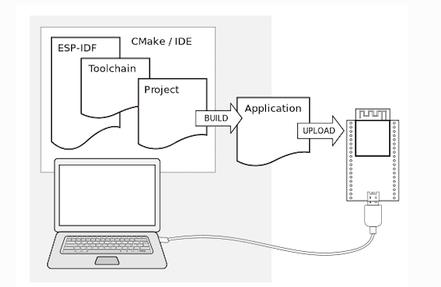
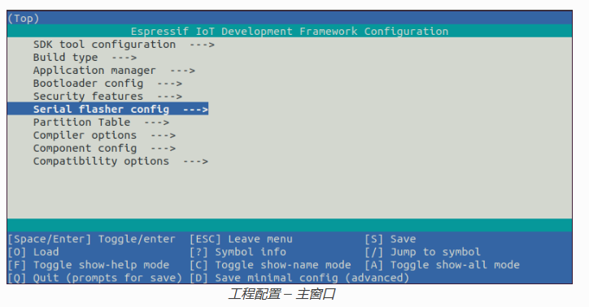
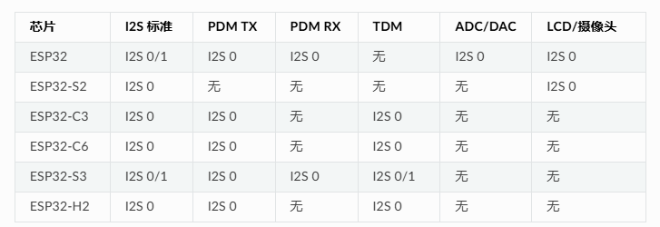
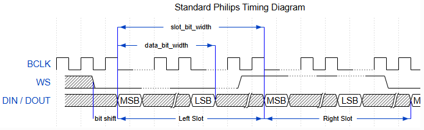
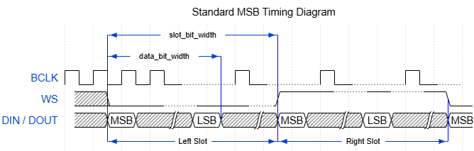
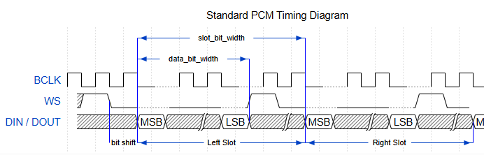
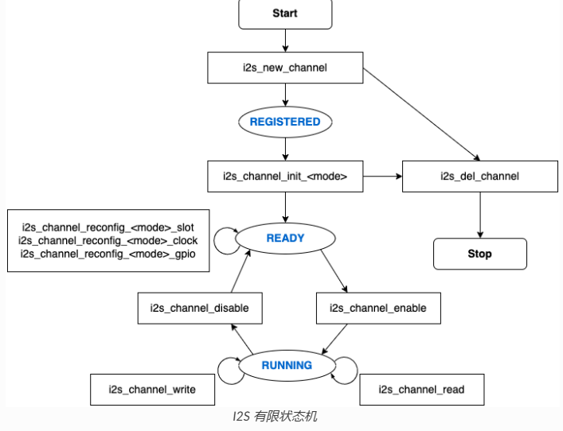
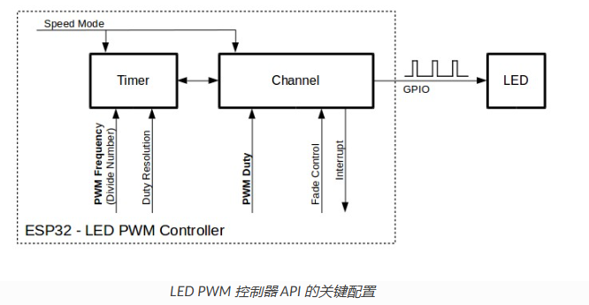

## esp32学习

参考资料：https://docs.espressif.com/projects/esp-idf/zh_CN/release-v5.1/esp32/get-started/index.html

## ESP-IDF V5.1

### 快速入门

#### 1. 目标

帮助用户：

- 安装 ESP-IDF 开发环境
- 编译并烧录第一个 Hello World 或 Blink 示例到 ESP32 开发板

#### 2. 所需硬件

* 一款 ESP32 开发板
* USB 数据线 (A 转 Micro-B)
* 电脑（Windows、Linux 或 macOS）

#### 3. 软件

在 ESP32 上使用 ESP-IDF，需安装以下软件：

* 设置 **工具链**，用于编译 ESP32 代码；
* **编译构建工具** —— CMake 和 Ninja 编译构建工具，用于编译 ESP32 **应用程序**；
* 获取 **ESP-IDF** 软件开发框架。该框架已经基本包含 ESP32 使用的 API（软件库和源代码）和运行 **工具链** 的脚本；



#### 4. 安装方式

- IDE 插件安装：
  - [Eclipse Plugin](https://github.com/espressif/idf-eclipse-plugin/blob/master/README.md)
  - [VSCode Extension](https://github.com/espressif/vscode-esp-idf-extension/blob/master/docs/tutorial/install.md)

* 手动安装：
  - [Windows Installer](https://docs.espressif.com/projects/esp-idf/zh_CN/release-v5.1/esp32/get-started/windows-setup.html)
  - [Linux and macOS](https://docs.espressif.com/projects/esp-idf/zh_CN/release-v5.1/esp32/get-started/linux-macos-setup.html)

> 这边选择手动安装windows installer，然后再安装vscode的esp-idf插件，然后选择本地的已安装esp-idf环境

#### 5. 编译第一个工程

> 备注：
>
> 1. 这边使用命令行编译的方式
>
> 2. ESP-IDF 编译系统不支持 ESP-IDF 路径或其工程路径中带有空格。

1. 创建工程：

   将 [get-started/hello_world](https://github.com/espressif/esp-idf/tree/1e54adca6f9/examples/get-started/hello_world) 工程复制至您本地的 `~/esp` 目录下

   ```cmd
   cd %userprofile%\esp
   xcopy /e /i %IDF_PATH%\examples\get-started\hello_world hello_world
   ```

2. 连接设备：

   * 将 ESP32 开发板连接到 PC，并查看开发板使用的串口。

3. 配置工程：

   * 进入 `hello_world` 目录，设置 ESP32 为目标芯片，然后运行工程配置工具 `menuconfig`。

       ```cmd
       cd %userprofile%\esp\hello_world
       idf.py set-target esp32
       idf.py menuconfig
       ```

   * 正确操作上述步骤后，系统将显示以下菜单

     

     可以通过此菜单设置项目的具体变量，包括 Wi-Fi 网络名称、密码和处理器速度等。

4. 编译工程：

   * 使用以下命令，编译烧录工程：

       ```cmd
idf.py build
       ```
   
   * 运行以上命令可以编译应用程序和所有 ESP-IDF 组件，接着生成引导加载程序、分区表和应用程序二进制文件。
   
       ```cmd
       $ idf.py build
       Running cmake in directory /path/to/hello_world/build
       Executing "cmake -G Ninja --warn-uninitialized /path/to/hello_world"...
       Warn about uninitialized values.
       -- Found Git: /usr/bin/git (found version "2.17.0")
       -- Building empty aws_iot component due to configuration
       -- Component names: ...
       -- Component paths: ...
       
       ... (more lines of build system output)
       
       [527/527] Generating hello_world.bin
       esptool.py v2.3.1
       
       Project build complete. To flash, run this command:
       ../../../components/esptool_py/esptool/esptool.py -p (PORT) -b 921600 write_flash --flash_mode dio --flash_size detect --flash_freq 40m 0x10000 build/hello_world.bin  build 0x1000 build/bootloader/bootloader.bin 0x8000 build/partition_table/partition-table.bin
       or run 'idf.py -p PORT flash'
       ```
   
   * 如果一切正常，编译完成后将生成 .bin 文件
   
5. 烧录到设备

   * 使用如下命令：

     ```cmd
     idf.py -p PORT flash
     ```

     将 PORT 替换为 ESP32 开发板的串口名称

6. 监视输出

   ```cmd
   idf.py -p PORT monitor
   ```

7. 退出IDF监视器

   ```cmd
   Ctrl + ]
   ```

#### 6. 卸载ESP-IDF

略，参考链接：https://docs.espressif.com/projects/esp-idf/zh_CN/release-v5.1/esp32/api-guides/tools/idf-tools.html


### 时钟树

#### 1. 概述

ESP32的时钟子系统用于从一系列根时钟中提取并分配系统/模块时钟。时钟树驱动程序负责维护系统时钟的基本功能，并管理模块时钟间的复杂关系。

#### 2. 根时钟

ESP32支持的根时钟包括：

* 内部8MHz RC振荡器 (RC_FAST)
  * 产生约8.5 MHz时钟信号输出，标识为`RC_FAST_CLK`
  * 传入分频器，生成`RC_FAST_D256_CLK`（默认分频256倍）

* 外部2～40MHz晶振 (XTAL)

* 内部150kHz RC振荡器 (RC_SLOW)
  
* 产生约150 kHz时钟信号，标识为`RC_SLOW_CLK`
  
* 外部32kHz晶振 - 可选 (XTAL32K)

  `XTAL32K_CLK`的时钟源可以来自：

  * 连接到`32K_XP`和`32K_XN`管脚的32 KHz晶振。

  * 外部电路生成的32kHz时钟信号。

    > 如果使用外部电路生成的时钟信号，该信号必须连接到`32K_XN`管脚，并且在`32K_XP`管脚和地之间连接一个1nF的电容。此时，`32K_XP`管脚不能用作GPIO管脚。

与晶振产生的信号相比，从RC振荡器电路产生的信号通常精度较低，且容易受环境影响。

ESP32为`RTC_SLOW_CLK`提供了几种时钟源选项，可以根据对系统时间精度和对功耗的要求选择。更多详情，参阅 [RTC 定时器时钟源](https://docs.espressif.com/projects/esp-idf/zh_CN/release-v5.1/esp32/api-reference/system/system_time.html#rtc-clock-source-choice)。

#### 3. 模块时钟

ESP32 的可用模块时钟在 [`soc_module_clk_t`](https://docs.espressif.com/projects/esp-idf/zh_CN/release-v5.1/esp32/api-reference/peripherals/clk_tree.html#_CPPv416soc_module_clk_t) 中列出，ESP32支持的模块时钟包括：

- `SOC_MOD_CLK_CPU`：CPU时钟源（可从XTAL、PLL、RC_FAST或APLL获取）
- `SOC_MOD_CLK_RTC_FAST`：RTC快速时钟
- `SOC_MOD_CLK_RTC_SLOW`：RTC慢速时钟
- `SOC_MOD_CLK_APB`：APB总线时钟
- `SOC_MOD_CLK_PLL_D2`：PLL分频2倍的时钟
- `SOC_MOD_CLK_PLL_F160M`：固定160MHz的PLL时钟
- 其他外设专用时钟（如ADC、DAC、UART等）


### I2S

#### 1. I2S 基础概述

1. 核心定义I2S（Inter-IC Sound）是同步串行通信协议，用于数字音频设备间的音频数据传输，ESP32 内置 2 个 I2S 外设，支持输入和输出采样数据。

2. 总线线路
   * **标准 / TDM 模式**：
     * MCLK（可选主时钟）
     * BCLK（位时钟）
     * WS（声道选择线）
     * DIN/DOUT（数据输入/输出，同 GPIO 可内部回环）。
   * **PDM 模式**：
     * CLK（PDM 时钟）
     * DIN/DOUT（数据输入 / 输出）。

3. 核心功能
   * 支持主机 / 从机、发射器 / 接收器角色。
   * DMA 流数据采样，无需 CPU 逐帧复制。
   * 支持RX/TX单工通信；全双工需 RX/TX 的配置一致（共用时钟）。

#### 2. I2S文件结构


* 需要包含在I2S应用中的公共头文件：

  * `i2s.h`：提供原有 I2S API（用于使用原有驱动的应用）。
  * `i2s_std.h`：提供标准通信模式的 API（用于使用标准模式的新驱动程序的应用）。
  * `i2s_pdm.h`：提供 PDM 通信模式的 API（用于使用 PDM 模式的新驱动程序的应用）。
  * `i2s_tdm.h`：提供 TDM 通信模式的 API（用于使用 TDM 模式的新驱动的应用）。

  > 原有驱动与新驱动无法共存。包含 `i2s.h` 以使用原有驱动，或包含其他三个头文件以使用新驱动。原有驱动未来可能会被删除。

* 已包含在上述头文件中的公共头文件：
  * `i2s_types_legacy.h`：提供只在原有驱动中使用的原有公共类型。
  * `i2s_types.h`：提供公共类型。
  * `i2s_common.h`：提供所有通信模式通用的 API。

#### 3. I2S时钟

##### 3.1 时钟源

* `i2s_clock_src_t::I2S_CLK_SRC_DEFAULT`：默认 PLL 时钟。
* `i2s_clock_src_t::I2S_CLK_SRC_PLL_160M`：160 MHz PLL 时钟。
* `i2s_clock_src_t::I2S_CLK_SRC_APLL`：音频 PLL 时钟，高采样率更精准，可配置频率；若被占用则会尝试原有APLL频率，如果原有 APLL 频率无法满足 I2S 的需求，时钟配置将失败。

##### 3.2 时钟术语

* **采样率**：单声道每秒采样数据数量。
* **SCLK**：源时钟频率，即时钟源的频率。
* **MCLK**：主时钟频率，BCLK 由其产生。MCLK 信号通常作为参考时钟，用于同步 I2S 主机和从机之间的 BCLK 和 WS。
  * 默认设为 `I2S_MCLK_MULTIPLE_256`。
  * 若声道位宽为 24 位，需设为能被 3 整除的倍数（如 `I2S_MCLK_MULTIPLE_384`），否则 WS 不精准。

* **BCLK**：位时钟频率，一个 BCLK 时钟周期代表数据管脚上的一个数据位。通过 `i2s_std_slot_config_t::slot_bit_width` 配置的通道位宽即为一个声道中的 BCLK 时钟周期数量，因此一个声道中可以有 8/16/24/32 个 BCLK 时钟周期。

* **LRCK** / **WS**：左/右时钟或字选择时钟。在非 PDM 模式下，其频率等于采样率。

#### 4. I2S通信模式

##### 4.1 模式预览



| 模式       | 功能说明                         | 芯片支持                           |
| ---------- | -------------------------------- | ---------------------------------- |
| 标准模式   | Philips/MSB/PCM 格式，左右双声道 | 所有芯片（ESP32-S2 仅 I2S0）       |
| PDM TX     | PCM→PDM 转换（16位固定）         | ESP32/ESP32-C3/C6/S3/H2（仅 I2S0） |
| PDM RX     | PDM→PCM 转换（16位固定）         | ESP32/ESP32-S3（仅 I2S0）          |
| TDM        | 多声道时分复用                   | ESP32-C3/C6/S3                     |
| LCD/摄像头 | 并行总线模式（非音频）           | ESP32/ESP32-S2/S3（仅 I2S0）       |
| ADC/DAC    | 内部模数/数模转换直连            | 仅 ESP32（I2S0）                   |

>  **注意**：PDM 模式不支持全双工；ESP32 单工模式下 TX/RX 不能共存于同一 I2S 端口

##### 4.2 标准模式

标准模式中有且仅有左右两个声道，驱动中将声道称为 slot。这些声道可以支持 8/16/24/32 位宽的采样数据。

声道的通信格式主要包括以下几种：

* **Philips 格式**：数据信号与 WS 信号相比有一个位的位移。WS 信号的占空比为 50%

  

* **MSB 格式**：与 Philips 格式基本相同，但其数据没有位移。

  

* **PCM 帧同步**：数据有一个位的位移，同时 WS 信号变成脉冲，持续一个 BCLK 周期。

  

##### 4.3 PDM模式（TX）

PDM（Pulse-density Modulation，脉冲密度调制） TX 模式：

* TX 通道可以将 PCM 数据转换为 PDM 格式，该格式始终有左右两个声道。
* 只在 I2S0 中受支持，且只支持 16 位宽的采样数据。
* 至少需要一个 CLK 管脚用于时钟信号，一个 DOUT 管脚用于数据信号（即下图中的 WS 和 SD 信号。BCK 信号为内部位采样时钟，在 PDM 设备之间不需要）。

* 允许用户配置上采样参数 `i2s_pdm_tx_clk_config_t::up_sample_fp` 和 `i2s_pdm_tx_clk_config_t::up_sample_fs`
  
* 采样率计算公式：`up_sample_rate = fp / fs`
  
* 在 PDM TX 中有以下两种上采样模式：

  * 固定时钟频率模式：在这种模式下，上采样率将根据采样率的变化而变化。设置 `fp = 960`、 `fs = sample_rate / 100`，则 CLK 管脚上的时钟频率 (Fpdm) 将固定为 `128 * 48 KHz = 6.144 MHz`。注意此频率不等于采样率 (Fpcm)。
  * 固定上采样率模式：在这种模式下，上采样率固定为 2。设置 `fp = 960`、 `fs = 480`，则 CLK 管脚上的时钟频率 (Fpdm) 将为 `128 * sample_rate`。

  > 注：这边两个模式的采样率计算没看懂，先忽略


##### 4.4 PDM模式（RX）

PDM（Pulse-density Modulation，脉冲密度调制）RX 模式：

* RX 通道可以接收 PDM 格式的数据并将数据转换成 PCM 格式。
* 只在 I2S0 中受支持，且只支持 16 位宽的采样数据。
* 至少需要一个 CLK 管脚用于时钟信号，一个 DIN 管脚用于数据信号。
* 此模式允许用户配置下采样参数 `i2s_pdm_rx_clk_config_t::dn_sample_mode`
* 在 PDM RX 中有以下两种下采样模式：
  * `i2s_pdm_dsr_t::I2S_PDM_DSR_8S`：在这种模式下，WS 管脚的时钟频率 (Fpdm) 将为 `sample_rate (Fpcm) * 64`。
  * `i2s_pdm_dsr_t::I2S_PDM_DSR_16S`：在这种模式下，WS 管脚的时钟频率 (Fpdm) 将为 `sample_rate (Fpcm) * 128`。

##### 4.5 LCD/摄像头模式

略

##### 4.6 ADC/DAC模式

略

#### 5. 功能概览

##### 5.1 资源管理三级结构

1. **平台级**：所有 I2S 控制器资源（驱动自动管理，用户无需关心）
2. **控制器级**：单个 I2S 外设资源（驱动自动管理，用户无需关心）
3. **通道级**：TX/RX 通道（公开的API都为通道级）。用户通过 `i2s_new_channel()` 分配句柄，`i2s_del_channel()` 释放。

##### 5.2 电源管理

* 启用电源管理（CONFIG_PM_ENABLE）时，I2S 读写会自动获取电源锁：
  * APB 时钟源：锁类型 `ESP_PM_APB_FREQ_MAX`。
  * APLL 时钟源：锁类型 `ESP_PM_NO_LIGHT_SLEEP`。

* 读写完成后自动释放锁，避免 Light-sleep 影响时钟。

##### 5.3 有限状态机

I2S 通道有三种状态，分别为 `registered（已注册）`、 `ready（准备就绪）` 和 `running（运行中）`，它们的关系如下图所示：



##### 5.4 核心配置与使用流程

1. 分配通道：`i2s_new_channel()`（支持单工/全双工）
2. 初始化模式：
   - 标准模式：`i2s_channel_init_std_mode()`
   - PDM TX/RX：`i2s_channel_init_pdm_tx_mode()` / `..._rx_mode()`
3. 配置要素：
   - 时钟：采样率、MCLK 倍数（24位数据需设为 384 倍）
   - 声道：位宽（8/16/24/32）、单/立体声、掩码
   - GPIO：BCLK、WS、DOUT/DIN、MCLK（可选）
4. 启用通道：`i2s_channel_enable()`
5. 数据传输：
   - 阻塞式：`i2s_channel_write()` / `i2s_channel_read()`
   - 异步式：注册 ISR 回调（需注意 IRAM 安全）
6. 释放资源：先 `disable` → 再 `del_channel`

7. 其他：

   * 中断：

     * 发送或接收的数据达到 DMA 缓冲区的大小时，将触发 `I2S_OUT_EOF` 或 `I2S_IN_SUC_EOF` 中断。

   * DMA 缓冲区的大小：

     * DMA 缓冲区的大小不等于 `i2s_chan_config_t::dma_frame_num`。
     * 这里的一帧是指一个 WS 周期内的所有采样数据。
     * `dma_buffer_size = dma_frame_num * slot_num * slot_bit_width / 8`

   * 初始化后，如果要重新更新配置：

     * 必须先调用 `i2s_channel_disable()` 以确保通道已经停止运行
     * 再调用相应的 'reconfig' 函数：
       *  `i2s_channel_reconfig_std_slot()`
       * `i2s_channel_reconfig_std_clock()`
       *  `i2s_channel_reconfig_std_gpio()`

   * 读写函数

     * `i2s_channel_write()`：用来输入数据，并把数据从源缓冲区复制到 DMA TX 缓冲区等待传输完成。此过程将重复进行，直到发送的字节数达到配置的大小。
     * `i2s_channel_read()`：接收数据，等待接收包含 DMA 缓冲区地址的消息队列，从而将数据从 DMA RX 缓冲区复制到目标缓冲区。
     * `i2s_channel_write()`和 `i2s_channel_read()`都是阻塞函数，在源缓冲区的数据发送完毕前，或是整个目标缓冲区都被加载数据占用时，它们会一直保持等待状态。在等待时间达到最大阻塞时间时，返回 ESP_ERR_TIMEOUT 错误。

     * `i2s_channel_register_event_callback()`：可以注册回调，随即便可在回调函数中直接访问 DMA 缓冲区，无需通过这两个阻塞函数来发送或接收数据。但请注意，该回调是一个中断回调，不要在该回调中添加复杂的逻辑、进行浮点运算或调用不可重入函数。

#### 6. 应用实例

I2S 驱动例程请参考 [peripherals/i2s](https://github.com/espressif/esp-idf/tree/4b1ae715b8b/examples/peripherals/i2s) 目录。以下为每种模式的简单用法：

##### 6.1 标准TX/RX模式的应用

不同声道的通信格式可通过以下标准模式的辅助宏来生成。在标准模式下有三种格式，辅助宏分别为：

* `I2S_STD_PHILIPS_SLOT_DEFAULT_CONFIG`
* `I2S_STD_PCM_SLOT_DEFAULT_CONFIG`
* `I2S_STD_MSB_SLOT_DEFAULT_CONFIG`

时钟配置的辅助宏：

* `I2S_STD_CLK_DEFAULT_CONFIG`

###### 6.1.1 STD TX模式

数据在16位宽，不同声道模式，声道掩码下的数据排列方式，这边省略。

示例代码，配置标准发送模式：

```c
#include "driver/i2s_std.h"
#include "driver/gpio.h"

i2s_chan_handle_t tx_handle;
/* 通过辅助宏获取默认的通道配置
 * 这个辅助宏在 'i2s_common.h' 中定义，由所有 I2S 通信模式共享
 * 它可以帮助指定 I2S 角色和端口 ID */
i2s_chan_config_t chan_cfg = I2S_CHANNEL_DEFAULT_CONFIG(I2S_NUM_AUTO, I2S_ROLE_MASTER);
/* 分配新的 TX 通道并获取该通道的句柄 */
i2s_new_channel(&chan_cfg, &tx_handle, NULL);

/* 进行配置，可以通过宏生成声道配置和时钟配置
 * 这两个辅助宏在 'i2s_std.h' 中定义，只能用于 STD 模式
 * 它们可以帮助初始化或更新声道和时钟配置 */
i2s_std_config_t std_cfg = {
    .clk_cfg = I2S_STD_CLK_DEFAULT_CONFIG(48000),
    .slot_cfg = I2S_STD_MSB_SLOT_DEFAULT_CONFIG(I2S_DATA_BIT_WIDTH_32BIT, I2S_SLOT_MODE_STEREO),
    .gpio_cfg = {
        .mclk = I2S_GPIO_UNUSED,
        .bclk = GPIO_NUM_4,
        .ws = GPIO_NUM_5,
        .dout = GPIO_NUM_18,
        .din = I2S_GPIO_UNUSED,
        .invert_flags = {
            .mclk_inv = false,
            .bclk_inv = false,
            .ws_inv = false,
        },
    },
};
/* 初始化通道 */
i2s_channel_init_std_mode(tx_handle, &std_cfg);

/* 在写入数据之前，先启用 TX 通道 */
i2s_channel_enable(tx_handle);
i2s_channel_write(tx_handle, src_buf, bytes_to_write, bytes_written, ticks_to_wait);

/* 如果需要更新声道或时钟配置
 * 需要在更新前先禁用通道 */
// i2s_channel_disable(tx_handle);
// std_cfg.slot_cfg.slot_mode = I2S_SLOT_MODE_MONO; // 默认为立体声
// i2s_channel_reconfig_std_slot(tx_handle, &std_cfg.slot_cfg);
// std_cfg.clk_cfg.sample_rate_hz = 96000;
// i2s_channel_reconfig_std_clock(tx_handle, &std_cfg.clk_cfg);

/* 删除通道之前必须先禁用通道 */
i2s_channel_disable(tx_handle);
/* 如果不再需要句柄，删除该句柄以释放通道资源 */
i2s_del_channel(tx_handle);
```

###### 6.1.2 STD RX模式

数据在16位宽，不同声道模式，声道掩码下的数据排列方式，这边省略。

STD RX模式下的示例代码：

```c
#include "driver/i2s_std.h"
#include "driver/gpio.h"

i2s_chan_handle_t rx_handle;
/* 通过辅助宏获取默认的通道配置
 * 这个辅助宏在 'i2s_common.h' 中定义，由所有 I2S 通信模式共享
 * 它可以帮助指定 I2S 角色和端口 ID */
i2s_chan_config_t chan_cfg = I2S_CHANNEL_DEFAULT_CONFIG(I2S_NUM_AUTO, I2S_ROLE_MASTER);
/* 分配新的 TX 通道并获取该通道的句柄 */
i2s_new_channel(&chan_cfg, NULL, &rx_handle);

/* 进行配置，可以通过宏生成声道配置和时钟配置
 * 这两个辅助宏在 'i2s_std.h' 中定义，只能用于 STD 模式
 * 它们可以帮助初始化或更新声道和时钟配置 */
i2s_std_config_t std_cfg = {
    .clk_cfg = I2S_STD_CLK_DEFAULT_CONFIG(48000),
    .slot_cfg = I2S_STD_MSB_SLOT_DEFAULT_CONFIG(I2S_DATA_BIT_WIDTH_32BIT, I2S_SLOT_MODE_STEREO),
    .gpio_cfg = {
        .mclk = I2S_GPIO_UNUSED,
        .bclk = GPIO_NUM_4,
        .ws = GPIO_NUM_5,
        .dout = I2S_GPIO_UNUSED,
        .din = GPIO_NUM_19,
        .invert_flags = {
            .mclk_inv = false,
            .bclk_inv = false,
            .ws_inv = false,
        },
    },
};
/* 初始化通道 */
i2s_channel_init_std_mode(rx_handle, &std_cfg);

/* 在读取数据之前，先启动 RX 通道 */
i2s_channel_enable(rx_handle);
i2s_channel_read(rx_handle, desc_buf, bytes_to_read, bytes_read, ticks_to_wait);

/* 删除通道之前必须先禁用通道 */
i2s_channel_disable(rx_handle);
/* 如果不再需要句柄，删除该句柄以释放通道资源 */
i2s_del_channel(rx_handle);
```

##### 6.2 PDM TX模式的应用

PMD TX模式：

* 声道配置的辅助宏为：
  - `I2S_PDM_TX_SLOT_DEFAULT_CONFIG`
* 时钟配置的辅助宏为：
  * `I2S_PDM_TX_CLK_DEFAULT_CONFIG`

PDM数据位宽固定16位宽，不同声道模式，声道掩码下的数据排列方式，这边省略。

PDM TX模式 示例代码：

```c
#include "driver/i2s_pdm.h"
#include "driver/gpio.h"

/* 分配 I2S TX 通道 */
i2s_chan_config_t chan_cfg = I2S_CHANNEL_DEFAULT_CONFIG(I2S_NUM_0, I2S_ROLE_MASTER);
i2s_new_channel(&chan_cfg, &tx_handle, NULL);

/* 初始化通道为 PDM TX 模式 */
i2s_pdm_tx_config_t pdm_tx_cfg = {
    .clk_cfg = I2S_PDM_TX_CLK_DEFAULT_CONFIG(36000),
    .slot_cfg = I2S_PDM_TX_SLOT_DEFAULT_CONFIG(I2S_DATA_BIT_WIDTH_16BIT, I2S_SLOT_MODE_MONO),
    .gpio_cfg = {
        .clk = GPIO_NUM_5,
        .dout = GPIO_NUM_18,
        .invert_flags = {
            .clk_inv = false,
        },
    },
};
i2s_channel_init_pdm_tx_mode(tx_handle, &pdm_tx_cfg);

...
```

##### 6.3 PDM TX模式的应用

PMD RX模式：

* 声道配置的辅助宏为：
  - `I2S_PDM_RX_SLOT_DEFAULT_CONFIG`
* 时钟配置的辅助宏为：
  * `I2S_PDM_RX_CLK_DEFAULT_CONFIG`

PDM TX模式的示例代码：

```c
#include "driver/i2s_pdm.h"
#include "driver/gpio.h"

i2s_chan_handle_t rx_handle;

/* 分配 I2S RX 通道 */
i2s_chan_config_t chan_cfg = I2S_CHANNEL_DEFAULT_CONFIG(I2S_NUM_0, I2S_ROLE_MASTER);
i2s_new_channel(&chan_cfg, NULL, &rx_handle);

/* 初始化通道为 PDM RX 模式 */
i2s_pdm_rx_config_t pdm_rx_cfg = {
    .clk_cfg = I2S_PDM_RX_CLK_DEFAULT_CONFIG(36000),
    .slot_cfg = I2S_PDM_RX_SLOT_DEFAULT_CONFIG(I2S_DATA_BIT_WIDTH_16BIT, I2S_SLOT_MODE_MONO),
    .gpio_cfg = {
        .clk = GPIO_NUM_5,
        .din = GPIO_NUM_19,
        .invert_flags = {
            .clk_inv = false,
        },
    },
};
i2s_channel_init_pdm_rx_mode(rx_handle, &pdm_rx_cfg);

...
```

##### 6.4 全双工

全双工模式：

* 在 I2S 端口中同时注册 TX 和 RX 通道
* 同时通道共享 BCLK 和 WS 信号

支持情况：

* STD 和 TDM 通信模式支持全双工通信
* 不支持 PDM 全双工模式，因为 PDM 模式下 TX 和 RX 通道的时钟不同。

> 注意，一个句柄只能代表一个通道，因此仍然需要对 TX 和 RX 通道逐个进行声道和时钟配置。

驱动支持两种分配全双工通道的方法：

* 在调用 `i2s_new_channel() 函数时，同时分配 TX 和 RX 通道两个通道。

  ```c
  #include "driver/i2s_std.h"
  #include "driver/gpio.h"
  
  i2s_chan_handle_t tx_handle;
  i2s_chan_handle_t rx_handle;
  
  /* 分配两个 I2S 通道 */
  i2s_chan_config_t chan_cfg = I2S_CHANNEL_DEFAULT_CONFIG(I2S_NUM_AUTO, I2S_ROLE_MASTER);
  /* 同时分配给 TX 和 RX 通道，使其进入全双工模式。 */
  i2s_new_channel(&chan_cfg, &tx_handle, &rx_handle);
  
  /* 配置两个通道，因为在全双工模式下，TX 和 RX 通道必须相同。 */
  i2s_std_config_t std_cfg = {
      .clk_cfg = I2S_STD_CLK_DEFAULT_CONFIG(32000),
      .slot_cfg = I2S_STD_PHILIPS_SLOT_DEFAULT_CONFIG(I2S_DATA_BIT_WIDTH_16BIT, I2S_SLOT_MODE_STEREO),
      .gpio_cfg = {
          .mclk = I2S_GPIO_UNUSED,
          .bclk = GPIO_NUM_4,
          .ws = GPIO_NUM_5,
          .dout = GPIO_NUM_18,
          .din = GPIO_NUM_19,
          .invert_flags = {
              .mclk_inv = false,
              .bclk_inv = false,
              .ws_inv = false,
          },
      },
  };
  i2s_channel_init_std_mode(tx_handle, &std_cfg);
  i2s_channel_init_std_mode(rx_handle, &std_cfg);
  
  i2s_channel_enable(tx_handle);
  i2s_channel_enable(rx_handle);
  
  ...
  ```

* 调用两次 `i2s_new_channel()`函数分别分配 TX 和 RX 通道，但使用相同配置初始化 TX 和 RX 通道。

  ```c
  #include "driver/i2s_std.h"
  #include "driver/gpio.h"
  
  i2s_chan_handle_t tx_handle;
  i2s_chan_handle_t rx_handle;
  
  /* 分配两个 I2S 通道 */
  i2s_chan_config_t chan_cfg = I2S_CHANNEL_DEFAULT_CONFIG(I2S_NUM_0, I2S_ROLE_MASTER);
  /* 分别分配给 TX 和 RX 通道 */
  ESP_ERROR_CHECK(i2s_new_channel(&chan_cfg, &tx_handle, NULL));
  
  /* 为两个通道设置完全相同的配置，TX 和 RX 将自动组成全双工模式 */
  i2s_std_config_t std_cfg = {
      .clk_cfg = I2S_STD_CLK_DEFAULT_CONFIG(32000),
      .slot_cfg = I2S_STD_PHILIPS_SLOT_DEFAULT_CONFIG(I2S_DATA_BIT_WIDTH_16BIT, I2S_SLOT_MODE_STEREO),
      .gpio_cfg = {
          .mclk = I2S_GPIO_UNUSED,
          .bclk = GPIO_NUM_4,
          .ws = GPIO_NUM_5,
          .dout = GPIO_NUM_18,
          .din = GPIO_NUM_19,
          .invert_flags = {
              .mclk_inv = false,
              .bclk_inv = false,
              .ws_inv = false,
          },
      },
  };
  ESP_ERROR_CHECK(i2s_channel_init_std_mode(tx_handle, &std_cfg));
  ESP_ERROR_CHECK(i2s_channel_enable(tx_handle));
  // ...
  ESP_ERROR_CHECK(i2s_new_channel(&chan_cfg, NULL, &rx_handle));
  ESP_ERROR_CHECK(i2s_channel_init_std_mode(rx_handle, &std_cfg));
  ESP_ERROR_CHECK(i2s_channel_enable(rx_handle));
  
  ...
  ```

##### 6.5 单工模式

在单工模式下，应该为每个通道调用`i2s_new_channel()`。因为在 ESP32 上，TX/RX 通道的时钟和 GPIO 管脚不是相互独立的，因此在单工模式下，TX 和 RX 通道不能共存于同一个 I2S 端口中。

```c
#include "driver/i2s_std.h"
#include "driver/gpio.h"

i2s_chan_handle_t tx_handle;
i2s_chan_handle_t rx_handle;

i2s_chan_config_t chan_cfg = I2S_CHANNEL_DEFAULT_CONFIG(I2S_NUM_AUTO, I2S_ROLE_MASTER);
ESP_ERROR_CHECK(i2s_new_channel(&chan_cfg, &tx_handle, NULL));
i2s_std_config_t std_tx_cfg = {
    .clk_cfg = I2S_STD_CLK_DEFAULT_CONFIG(48000),
    .slot_cfg = I2S_STD_PHILIPS_SLOT_DEFAULT_CONFIG(I2S_DATA_BIT_WIDTH_16BIT, I2S_SLOT_MODE_STEREO),
    .gpio_cfg = {
        .mclk = GPIO_NUM_0,
        .bclk = GPIO_NUM_4,
        .ws = GPIO_NUM_5,
        .dout = GPIO_NUM_18,
        .din = I2S_GPIO_UNUSED,
        .invert_flags = {
            .mclk_inv = false,
            .bclk_inv = false,
            .ws_inv = false,
        },
    },
};
/* 初始化通道 */
ESP_ERROR_CHECK(i2s_channel_init_std_mode(tx_handle, &std_tx_cfg));
ESP_ERROR_CHECK(i2s_channel_enable(tx_handle));

/* 如果没有找到其他可用的 I2S 设备，RX 通道将被注册在另一个 I2S 上
 * 并返回 ESP_ERR_NOT_FOUND */
ESP_ERROR_CHECK(i2s_new_channel(&chan_cfg, NULL, &rx_handle));
i2s_std_config_t std_rx_cfg = {
    .clk_cfg = I2S_STD_CLK_DEFAULT_CONFIG(16000),
    .slot_cfg = I2S_STD_MSB_SLOT_DEFAULT_CONFIG(I2S_DATA_BIT_WIDTH_32BIT, I2S_SLOT_MODE_STEREO),
    .gpio_cfg = {
        .mclk = I2S_GPIO_UNUSED,
        .bclk = GPIO_NUM_6,
        .ws = GPIO_NUM_7,
        .dout = I2S_GPIO_UNUSED,
        .din = GPIO_NUM_19,
        .invert_flags = {
            .mclk_inv = false,
            .bclk_inv = false,
            .ws_inv = false,
        },
    },
};
ESP_ERROR_CHECK(i2s_channel_init_std_mode(rx_handle, &std_rx_cfg));
ESP_ERROR_CHECK(i2s_channel_enable(rx_handle));
```

#### 7. 注意事项

##### 7.1 防止数据丢失

略

### LED PWM 控制器

文档：https://docs.espressif.com/projects/esp-idf/zh_CN/release-v5.1/esp32/api-reference/peripherals/ledc.html

文档介绍了 ESP32 LED PWM 控制器 (LEDC) 的核心概念、配置流程及 API 参考，旨在帮助开发者快速掌握如何利用该外设控制 LED 亮度或生成 PWM 信号。

#### 1. 概述与核心功能：

- 基本定义：LED 控制器 (LEDC) 专为控制 LED 设计，也可用于生成通用 PWM 信号。
- 通道架构：
  - 共有 8 路通道（0-7），可产生独立波形（如驱动 RGB LED）。
  - 分为 **高速模式**（硬件实现，自动无干扰改变占空比）和 **低速模式**（软件驱动改变占空比）。
- 核心优势：支持硬件渐变（Fade），可在无需 CPU 干预的情况下自动改变占空比，实现平滑的亮度或颜色过渡。

#### 2. 功能概览

设置LEDC通道在高速模式或低速模式下运行，需要进行如下配置：

* 定时器配置：指定PWM信号的频率或占空比分辨率
* 通道配置：绑定定时器和输出PWM信号的GPIO
* 改变PWM信号：输出PWM信号来驱动LED。可通过软件控制或使用硬件渐变功能来改变LED的亮度。

另一个可选步骤：在渐变终端设置一个中断。



##### 2.1 定时器配置（ledc_timer_config_t）

负责设定 PWM 信号的基础时钟属性：

- 速度模式 (`ledc_mode_t`)：选择高速或低速模式。
- 定时器索引 (`ledc_timer_t`)：选择定时器 0-3。
- 频率 (`freq_hz`)：设定 PWM 信号频率。
- 占空比分辨率(duty_resolution)：设定分辨率（位数）。
- 时钟源 (clk_cfg)：
  - `APB_CLK` (80 MHz)：高速/低速通用。
  - `REF_TICK` (1 MHz)：支持动态调频。
  - `RC_FAST_CLK` (～8 MHz)：仅低速，支持 Light-sleep 模式。

> 频率和占空比的互斥关系：频率越高，支持的分辨率越低；反之亦然。

##### 2.2 通道配置（ledc_channel_config_t）

负责将定时器信号绑定到具体的 GPIO 引脚：

- GPIO 编号 (`gpio_num`)：指定输出引脚。
- 通道选择 (`channel`)：选择通道 0-7。
- 绑定定时器 (`timer_sel`)：关联上述配置的定时器。
- 中断类型(`intr_type`)：可选渐变结束中断。

停止输出：`ledc_stop()` 可禁用PWM输出并设置空闲电平。

##### 2.3 改变PWM信号

通道开始运行、生成具有恒定占空比和频率的 PWM 信号之后，有如下几种方式可以改变占空比：

* 软件改变占空比
* 硬件改变占空比
* 通过改变PWM频率也可以改变占空比

###### 2.3.1 使用软件改变PWM占空比

- 普通的设置占空比方式：
  - `ledc_set_duty()`：设置新的占空比数值。
  - `ledc_update_duty()`：必须调用此函数使新占空比生效（在下一个 PWM 周期生效）。
  - `ledc_get_duty()`：读取当前占空比。
- 配置通道时也可以设置占空比：
  * `ledc_channel_config()`

<font color=blue>占空比分辨率(duty_resolution)</font>

传递给函数的占空比数值范围取决于选定的`duty_resolution(占空比分辨率)`，应为`0~(2**duty_resolution)`，例如：如选定的占空比分辨率为 10，则占空比的数值范围为 0 至 1024。此时分辨率为` ~ 0.1%`。

> 在 ESP32 上，当通道绑定的定时器配置了其最大 PWM 占空比分辨率（ `MAX_DUTY_RES` ），通道的占空比不能被设置到 `(2 ** MAX_DUTY_RES)` 。否则，硬件内部占空比计数器会溢出，并导致占空比计算错误。

###### 2.3.2 使用硬件改变PWM占空比

LED PWM 控制器硬件可逐渐改变占空比的数值。

- 初始化：需先调用 `ledc_fade_func_install()` 安装渐变服务。
- 配置渐变，使用下面3个函数之一：
  - `ledc_set_fade_with_time()`：指定目标占空比和持续时间。
  - `ledc_set_fade_with_step()`：指定步长和周期数。
  - `ledc_set_fade()`
- 启动渐变：`ledc_fade_start()`，支持阻塞 (`LEDC_FADE_WAIT_DONE`) 或非阻塞模式。
- 回调机制：可通过 `ledc_cb_register()` 注册渐变结束回调函数。

* 关闭渐变：

  如不需要渐变和渐变中断，可用函数 `ledc_fade_func_uninstall()` 关闭

###### 2.3.3 改变PWM频率

有多种改变LED PWM频率的方式：

* 通过调用函数`ledc_set_freq()`设置频率。可用函数`ledc_get_freq()`查看当前频率。
* 通过调用函数`ledc_bind_channel_timer()`将其他定时器绑定到该通道来改变频率和占空比分辨率。
* 通过调用函数`ledc_channel_config()`改变通道的定时器。

###### 2.3.4 控制PWM的更多方式

有一些较独立的定时器特定函数可用于更改 PWM 输出：

* `ledc_timer_set()`
* `ledc_timer_rst()`
* `ledc_timer_pause()`
* `ledc_timer_resume()`

##### 2.4 使用中断

* 配置 LED PWM 控制器通道时，设置 `ledc_channel_config_t` 中的参数 `ledc_intr_type_t`，在渐变完成时触发中断。
* `ledc_isr_register()`用来注册中断函数。

#### 3. LED PWM控制器高速与低速模式

暂时略过

#### 4. 频率与占空比分辨率支持范围

暂时略过 

#### 5. 应用实例

* 使用 LEDC 基本实例请参照 [peripherals/ledc/ledc_basic](https://github.com/espressif/esp-idf/tree/b0f5707906b/examples/peripherals/ledc/ledc_basic)。

* 使用 LEDC 改变占空比和渐变控制的实例请参照 [peripherals/ledc/ledc_fade](https://github.com/espressif/esp-idf/tree/b0f5707906b/examples/peripherals/ledc/ledc_fade)。