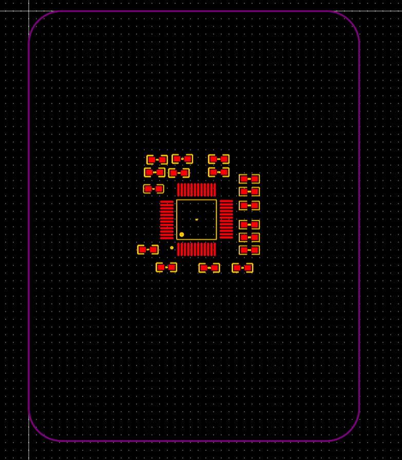

# 嘉立创EDA-PCB设计零基础入门课程

## 04-0 新建工程及LED灯模块电路原理图绘制

## 1. 新建工程

1. `文件-->新建-->工程 ` 工程名写 `GD32F103C8T6_最小系统`

2. 修改图纸大小：

**创建LED元件库**

1. 新建元件库：`文件-->新建-->元件库 `

   

2. 左下角可以看到创建的库：

   

3. 新建器件：`文件-->新建-->元件 `， 填写完名称和描述后，点击保存

   

4. 名称写R，描述去掉：

   

5. 调整网格尺寸：

   

6. 绘制矩形框

   

7. 绘制出相应的形状

   

用类似的方法创建LED灯

**绘制LED灯电路**

> 如果元器件的元件有更改，可以点击放置，会弹出是否更新的窗口，这时候点更新就可以把原理图里面旧的元器件更新过来了

## 04-7 原理图整理

## 04-8 原理图DRC检测

`设计 --> 检查DRC`

**设计规则**

设计规则可以更改检查DRC的相应规则

## 05-0 C0603封装绘制

### 0603封装绘制

0603的焊盘图

`文件-->新建-->封装`

设置画布属性：调成网格

放置单焊盘，并设置图层为顶层

设置焊盘形状与大小：

放置第二个焊盘

设置两个焊盘的坐标：

`中心X`分别为`-0.8`和`+0.8`

**绘制丝印**

* 选择丝印层

* 选择折线
* 圆弧90°
* 线宽0.2mm（图中绘制错）

绘制出图形：

**阻焊层**

下图紫色的就是阻焊层：（紫色在覆盖绿油时，会把紫色的部分扣掉，把焊盘裸漏出来）

点击焊盘可以设置阻焊层的大小（使用自定义即可）

至此，C0603的封装就画好了

### 封装管理器：设置对应的封装

选择封装管理器：

勾选上C01~C20 (C18、C19除外)，选择C0603封装，点击更新

## 06-0 从原理图转到PCB

`设计 --> 更新/转换原理图到PCB`

点击应用修改

飞线层：

蓝色的线就是飞线，代表器件的引脚是相连的

## 06-1 网络表概念解读

有些软件的原理图和PCB是分开的（不能一键转换），就需要先从原理图软件导出网络表（里面存储各个引脚的连接关系），然后再用PCB软件把网络关系导入进来。

其他略

## 06-2 板框绘制

`放置-->板框-->矩形`

从原点处放置一个矩形

点击画布，在`属性`中把单位切换成毫米

把宽高设置成 `50*60 mm`，圆角半径设置成`5 mm`

确认大小后锁定板框，避免误操作

## 06-3 模块化预布局

准备将各个模块进行预布局

> 在原理图中，款选某个模块后，右键点击交叉布局，就可以切换到PCB视图，并且该模块的元器件是被选中的状态。
>
> 原理图中选中，直接切换到PCB视图，选中的器件也都是选中状态。

### 更改丝印位置及大小

`右击某个丝印 --> 查找 --> 查找全部`

`布局-->属性位置 --> 属性位置选为中间`

所有器件的丝印就都在中间了

也可更改字体的线宽和高度 （视频中改为`线宽2mil 高度10mil`）

> 后面为了方便焊接，应该把丝印改回来（个人觉得）

### 放置MCU

MCU通常放在中间

### 晶振

晶振要靠近MCU

