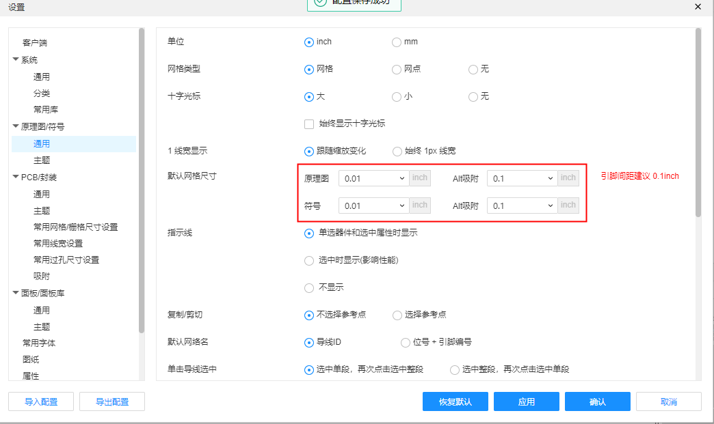

# 嘉立创EDA-PCB设计零基础入门课程

## 04-0 新建工程及LED灯模块电路原理图绘制

## 1. 新建工程

1. `文件-->新建-->工程 ` 工程名写 `GD32F103C8T6_最小系统`

2. 修改图纸大小：

**创建LED元件库**

1. 新建元件库：`文件-->新建-->元件库 `

   

2. 左下角可以看到创建的库：

   

3. 新建器件：`文件-->新建-->器件 `， 填写完名称和描述后，点击保存

   

4. 名称写R，描述去掉：

   

5. 调整网格尺寸：

   

6. 绘制矩形框

   

