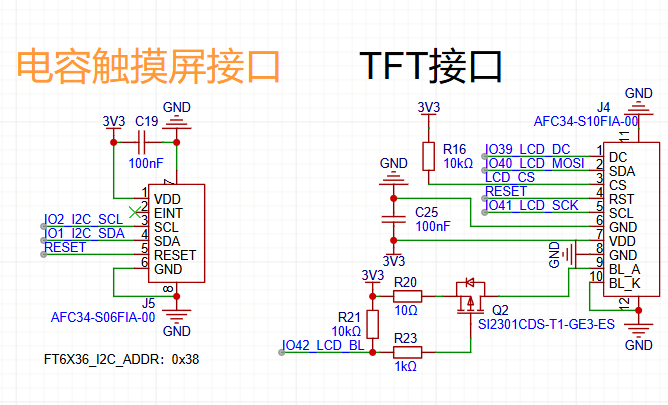

# 实战派 ESP32S3

参考资料：

* https://wiki.lckfb.com/zh-hans/szpi-esp32s3/

  

## 第1章 开发板介绍

## 第2章 安装开发环境

使用`vs code`配合`ESP-IDF`进行开发

> 安装参考：https://lceda001.feishu.cn/wiki/Xqx3wH8wMi3BrrkmeTXcgLL7nQk

`ESP-IDF`安装的版本是`5.1.4`

下载路径：`https://dl.espressif.cn/dl/esp-idf`

### 安装问题：

安装后可能会遇到找不到`idf_version.txt`的问题


在对应的路径下：`C:\Espressif\python_env\idf5.1_py3.11_env`创建一个`idf-version.txt`文件，里面的内容为 `5.1`

参考：`https://esp32.com/viewtopic.php?t=40343`

## 第3章 开发流程详解

### 1. `vs code`的 `esp-idf`工具栏介绍


* 第1个图标 文件夹：

  是工程文件夹路径，默认会自动配置好，不用修改，把鼠标放上去就可以看到当前工程路径。

* 第2个图标 版本号配置：

  可以配置需要使用的 IDF 版本号，点击图标，在 VSCode 软件中间最上方会出现可选的 IDF 版本号。如果你只安装了一个版本，就不用配置了。

* 第3个图标 下载方式的选择：

  我们选择 UART

  

  ​	

* 第4个图标 串口号选择：

  把开发板连接到电脑，点击该图标可以选择对应串口

* 第5个图标 目标芯片的选择：

  * 点击图标，在 VSCode 软件中间最上方，首先会出现工程路径，点击选择，然后就会出现可选的芯片型号，我们选择 esp32s3。

    

  * 点击 esp32s3 之后，又会弹出下载方式的选择，这里出现三种方式，第一种是使用 ESP-PROG，第二种是使用内置 USB-JTAG，第三种是选择 USB 转串口，这里我们选择第三种：via ESP USB Bridge。

    

  * 这时候，我们看到在工程中出现了.vscode和build文件夹，以及一个sdfconfig文件。如下图所示。.vscode 放配置文件，build 放编译过程中形成的文件，编译完以后，整个工程中，build 文件夹占的空间最大。

    

    * `.vscode`：放配置文件
    * `build ` ：放编译过程中形成的文件，编译完以后，整个工程中，build 文件夹占的空间最大
    * `sdfconfig`：是 menuconfig 的默认配置，可以点击查看里面的内容

* 第6个图标 menuconfig 图标

  点击图标会打开 menuconfig，如下图所示。配置 FLASH 芯片大小为 16MB 后（开发板上使用的 FLASH 大小是 16MB），点击“保存”图标保存，最后点击“X”退出。

  

* 第7个图标 垃圾桶形象图标：

  用来删除编译过程中形成的文件，也就是删除 build 文件夹。

* 第 8 个扳手图标是编译按钮：

  点击这个按钮，就可以开始编译。

* 第 9 个闪电图标是下载按钮：

  点击这个按钮，可以下载编译好的程序到 ESP32 开发板。

* 第 10 个显示器图标是终端观察窗口：

  下载完程序以后，我们可以点击这个按钮，观察单片机的运行状态，这个其实就是一个串口终端，程序运行过程中，会使用串口发送一些信息，在这个终端就可以看到。

* 第 11 个三角形图标是调试按钮，我们暂时用不到
* 第 12 个火焰图标是编译、下载、终端的综合按钮，相当于是依次点击了上面讲的扳手、闪电、显示器按钮，我们也称这个按钮为“一键三联”按钮。点击一下，会按照顺序完成编译、下载、打开终端。

### 2. 下载过程分析


从上图中我们可以看到：

* 串口号选择 COM19，波特率是 460800。

* Flash mode 是 DIO，Flash freq 是 80M，也就是 SPI SPEED。

* 0x0 位置下载 bootloader.bin 文件，0x10000 位置下载 hello_world.bin 文件，0x8000 位置下载 partition-table.bin 文件。

  * bootloader.bin 是启动文件，位于 bulid\bootloader 文件夹中。
  * hello_world.bin 是我们的应用程序文件，位于 bulid 文件夹中。
  * partition-table.bin 是分区表文件，位于 build\partition_table 文件夹中。分区表用于给 flash 划定分区，类似于 Windows 电脑的 C 盘 D 盘等分区。这里使用的是默认的分区表，默认的分区表在 menuconfig 中已经配置好，在之后的例程中，我们还会定义自己的分区表，在分区表中，还可以建立文件系统，下载 AI 模型。

* 除了上面的终端过程可以看到这些信息，在 build 文件夹下的 flash_args 文件中也可以看到，如下图所示。

  

### 3. flash_download_tool 下载工具

flash_download_tool 软件是乐鑫提供的下载软件，可以用于乐鑫所有型号芯片的程序下载。

下载地址：`https://www.espressif.com.cn/zh-hans/support/download/other-tools`

详细使用参考：`https://wiki.lckfb.com/zh-hans/szpi-esp32s3/beginner/design-flow.html`

## 第4章 BOOT-KEY 按键

功能：按下按键时，可以打印输出日志

原理图：


从参考代码中构建本章节代码，参考代码为：

* `get-started\hello_world`
* `peripherals\gpio\generic_gpio`

实现代码：`01-boot_key`

```c
#include <stdio.h>
#include <string.h>
#include <stdlib.h>
#include <inttypes.h>
#include "freertos/FreeRTOS.h"
#include "freertos/task.h"
#include "freertos/queue.h"
#include "driver/gpio.h"

// #define GPIO_OUTPUT_IO_0    CONFIG_GPIO_OUTPUT_0
// #define GPIO_INPUT_IO_0     CONFIG_GPIO_INPUT_0
#define ESP_INTR_FLAG_DEFAULT 0

static QueueHandle_t gpio_evt_queue = NULL;

static void IRAM_ATTR gpio_isr_handler(void* arg)
{
    uint32_t gpio_num = (uint32_t) arg;
    xQueueSendFromISR(gpio_evt_queue, &gpio_num, NULL);
}

static void gpio_task_example(void* arg)
{
    uint32_t io_num;
    for(;;) {
        if(xQueueReceive(gpio_evt_queue, &io_num, portMAX_DELAY)) {
            printf("GPIO[%"PRIu32"] intr, val: %d\n", io_num, gpio_get_level(io_num));
        }
    }
}

void app_main(void)
{
    // 定义GPIO的使用方式
    #if 0 // 方式1 
    //zero-initialize the config structure.
    gpio_config_t io_conf = {};
    //falling edge interrupt
    io_conf.intr_type = GPIO_INTR_NEGEDGE;
    //set as output mode
    io_conf.mode = GPIO_MODE_INPUT;
    //bit mask of the pins GPIO0
    io_conf.pin_bit_mask = 1 << GPIO_NUM_0;
    //disable pull-down mode
    io_conf.pull_down_en = 0;
    //enable pull-up mode
    io_conf.pull_up_en = 1;
    //configure GPIO with the given settings
    gpio_config(&io_conf);

    #else // 方式2
    gpio_config_t io_conf = {
        .intr_type = GPIO_INTR_NEGEDGE, //falling edge interrupt
        .mode = GPIO_MODE_INPUT, //set as input mode
        .pin_bit_mask = 1<<GPIO_NUM_0, //bit mask of the pins GPIO0
        .pull_down_en = 0, //disable pull-down mode
        .pull_up_en = 1 //enable pull-up mode
    };
    //configure GPIO with the given settings
    gpio_config(&io_conf);
    #endif

        //create a queue to handle gpio event from isr
    gpio_evt_queue = xQueueCreate(10, sizeof(uint32_t));
    //start gpio task
    xTaskCreate(gpio_task_example, "gpio_task_example", 2048, NULL, 10, NULL);

    //install gpio isr service
    gpio_install_isr_service(ESP_INTR_FLAG_DEFAULT);
    //hook isr handler for specific gpio pin
    gpio_isr_handler_add(GPIO_NUM_0, gpio_isr_handler, (void*) GPIO_NUM_0);

}

```


## 第5章 姿态传感器


### 1. 硬件原理图


## 第9章 液晶显示

* 开发板上的液晶屏是 2.0 寸的 IPS 高清液晶屏，分辨率 240320
* 液晶屏驱动芯片 ST7789，采用 SPI 通信方式与 ESP32-S3 连接。
* 本例实现了液晶屏的驱动、整屏显示一个颜色、以及显示图片。

### 1. 硬件原理图



液晶屏驱动芯片ST7789使用SPI与ESP32进行通讯：

* 正常的SPI通讯引脚：

  ```txt
  SPI：
      SCK
      MOSI
      MISO
      SS_n
  ```

* 本例使用的SPI引脚：

  ```txt
  SCL(SCK)
  SDA(MOSI)
  CS(SS_n)
  DC
  ```

### 2. 例程讲解

下载例程观察效果：看到显示一张图片

main函数：

```c
void app_main(void)
{
    bsp_i2c_init();  // I2C初始化
    pca9557_init();  // IO扩展芯片初始化
    bsp_lcd_init();  // 液晶屏初始化
    //lcd_draw_pictrue(0, 0, 240, 240, logo_en_240x240_lcd); // 显示乐鑫logo图片
    lcd_draw_pictrue(0, 0, 320, 240, gImage_yingwu); // 显示3只鹦鹉图片
}
```

* `LCD_CS `液晶屏片选引脚：

  液晶屏的`LCD_CS`引脚由 IO 扩展芯片 `pca9557` 控制，所以需要先初始化 `pca9557`，而 `pca9557` 是 `i2c` 通信芯片，所以又需要先初始化 `i2c`。

* `bsp_lcd_init()` 液晶屏的初始化

* `lcd_draw_pictrue()` 显示图片

<font color=blue>`bsp_lcd_init()`液晶屏初始化函数</font>

```c
esp_err_t bsp_lcd_init(void)
{
    esp_err_t ret = ESP_OK;


    ret = bsp_display_new(); // 液晶屏驱动初始化
    app_lcd_set_color(0x0000); // 设置整屏背景色
    ret = esp_lcd_panel_disp_on_off(panel_handle, true); // 打开液晶屏显示
    ret = bsp_display_backlight_on(); // 打开背光显示

    return  ret;
}
```

* `bsp_display_new()` 液晶屏驱动初始化

* `app_lcd_set_color(0x0000)` 设置整屏背景色

* `esp_lcd_panel_disp_on_off()` 用来控制的是液晶屏的驱动芯片 ST7789 中的寄存器，这个寄存器控制液晶屏显示与否。

* `bsp_display_backlight_on()` 用来控制液晶屏 LED 背光，通过调节 PWM 占空比调节亮度，使用的是 LEDC 外设产生的 PWM 信号。

  这两个都打开，才能看到液晶屏显示的内容。

<font color=blue>bsp_display_new() 液晶屏驱动初始化</font>

```c
// 液晶屏初始化
esp_err_t bsp_display_new(void)
{
    esp_lcd_panel_io_handle_t io_handle = NULL;
    esp_err_t ret = ESP_OK;
    // 背光初始化
    ESP_RETURN_ON_ERROR(bsp_display_brightness_init(), TAG, "Brightness init failed");
    // 初始化SPI总线
    ESP_LOGD(TAG, "Initialize SPI bus");
    const spi_bus_config_t buscfg = {
        .sclk_io_num = BSP_LCD_SPI_CLK,
        .mosi_io_num = BSP_LCD_SPI_MOSI,
        .miso_io_num = GPIO_NUM_NC,
        .quadwp_io_num = GPIO_NUM_NC,
        .quadhd_io_num = GPIO_NUM_NC,
        .max_transfer_sz = BSP_LCD_H_RES * BSP_LCD_V_RES * sizeof(uint16_t),
    };
    ESP_RETURN_ON_ERROR(spi_bus_initialize(BSP_LCD_SPI_NUM, &buscfg, SPI_DMA_CH_AUTO), TAG, "SPI init failed");
    // 液晶屏控制IO初始化
    ESP_LOGD(TAG, "Install panel IO");
    const esp_lcd_panel_io_spi_config_t io_config = {
        .dc_gpio_num = BSP_LCD_DC,
        .cs_gpio_num = BSP_LCD_SPI_CS,
        .pclk_hz = BSP_LCD_PIXEL_CLOCK_HZ,
        .lcd_cmd_bits = LCD_CMD_BITS,
        .lcd_param_bits = LCD_PARAM_BITS,
        .spi_mode = 2,
        .trans_queue_depth = 10,
    };
    ESP_GOTO_ON_ERROR(esp_lcd_new_panel_io_spi((esp_lcd_spi_bus_handle_t)BSP_LCD_SPI_NUM, &io_config, &io_handle), err, TAG, "New panel IO failed");
    // 初始化液晶屏驱动芯片ST7789
    ESP_LOGD(TAG, "Install LCD driver");
    const esp_lcd_panel_dev_config_t panel_config = {
        .reset_gpio_num = BSP_LCD_RST,
        .rgb_ele_order = LCD_RGB_ELEMENT_ORDER_RGB,
        .bits_per_pixel = BSP_LCD_BITS_PER_PIXEL,
    };
    ESP_GOTO_ON_ERROR(esp_lcd_new_panel_st7789(io_handle, &panel_config, &panel_handle), err, TAG, "New panel failed");

    esp_lcd_panel_reset(panel_handle);  // 液晶屏复位
    lcd_cs(0);  // 拉低CS引脚
    esp_lcd_panel_init(panel_handle);  // 初始化配置寄存器
    esp_lcd_panel_invert_color(panel_handle, true); // 颜色反转
    esp_lcd_panel_swap_xy(panel_handle, true);  // xy坐标翻转
    esp_lcd_panel_mirror(panel_handle, true, false); // 镜像

    return ret;

err:
    if (panel_handle) {
        esp_lcd_panel_del(panel_handle);
    }
    if (io_handle) {
        esp_lcd_panel_io_del(io_handle);
    }
    spi_bus_free(BSP_LCD_SPI_NUM);
    return ret;
}
```

* 先初始化背光
* 初始化SPI总线，液晶屏与ESP32采用SPI通讯
* 初始化其他控制引脚以及配置参数
* 控制液晶屏显示方式

<font color=blue>`void lcd_set_color(uint16_t color)`显示背景色的函数</font>

<font color=blue>`void lcd_draw_pictrue(int x_start, int y_start, int x_end, int y_end, const unsigned char *gImage)`显示一张图片</font>


## 第10章 摄像头

### 1. 硬件原理图

### 2. 例程讲解


<font color=blue>添加`esp32-camera`组件</font>

在`esp32_s3_szp.h`文件中，包含`esp_camera`头文件

```c
#include "esp_camera.h"
```

这个头文件，是`esp32-camera`组件的头文件。

步骤：

* 打开乐鑫组件官网：

  `https://components.espressif.com/`

* 搜索`esp32-camera`，复制旁边的添加组件命令：

  

    ```cmd
    idf.py add-dependency "espressif/esp32-camera^2.1.0"
    ```

* 回到例程中，点击"终端"按钮，进入终端，执行该命令

  

* 在main文件夹下，会添加一个`idf_component.yml`文件

  

<font color=blue>menuconfig 配置</font>

* flash 大小为16M

  

* PSRAM 设置为8线，80MHz

  

* 设置数据缓存指令

  

* CPU频率设置为240MHz

  


## 问题解决

### 内部文件编译问题

报错：

```txt
C:/Espressif/frameworks/esp-idf-v5.1.4/components/esp_lcd/src/esp_lcd_panel_rgb.c:756:1: internal compiler error: Segmentation fault
  756 | }
```


解决：


