# 桌面小屏幕

学习资料：

* 小智学长的视频教程：https://www.bilibili.com/video/BV1wV4y1G7Vk

* 飞书文档：https://x509p6c8to.feishu.cn/docx/NQCTdjUFJoYoZ1xYHS9cIlbwnxh

## P2 学习建议&工具准备

多种学习路径：

* 快速路径--PCB全贴片（SMT）
  * 硬件部分：无
  * 软件部分：资料包（公众号-资料下载）、USB数据线
* 快速路径--自行焊接
  * 硬件部分：电烙铁、焊锡、镊子、针筒锡膏、吸锡带（如果焊接基础不好，建议购买用于FPC端子焊接）
  * 软件部分：资料包、USB数据线

* 精学路径
  * 硬件部分：电烙铁、焊锡、镊子、针筒锡膏、吸锡带（如果焊接基础不好，建议购买用于FPC端子焊接）
  * 软件部分：资料包、USB数据线
  * 入门基本要求：
    * 对于C基础的学习：了解常量、变量、函数、结构体使用
    * 对于单片机基础的学习：了解定时器、中断、IO、I2C、SPI使用

## P3 快速上手--硬件生产

1. 直接下单PCB+SMT, 烧录&验证
2. 自行下单PCB+元器件，自己使用电烙铁、锡、镊子焊接，烧录&验证
3. 购买开发板卡，烧录&验证

介绍立创下单pcb的流程，这里略过

## P4 快速上手--烧录固件

收到工程加工完成的PCB后，我们接上屏幕、TP，然后就可以进行固件烧录了。

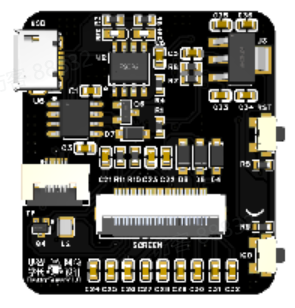

### 一、 烧录工具下载

[工具|乐鑫科技](https://www.espressif.com.cn/zh-hans/support/download/other-tools)

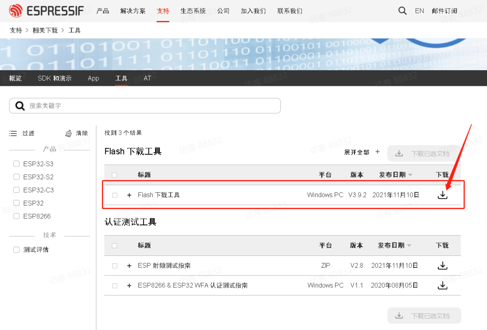

`资料/桌面小屏幕/flash_download_tool_3.9.2_0.zip`

### 固件下载

墨水屏幕版本GDEW15D67（现在新版本只有D67的屏幕可以买了，所以一般选这个固件）

firmware_V4.0.3.zip

```txt
V1.0.4 蜂鸣器版本（适配墨水屏GDEW15T8）
V3.0.0 蜂鸣器版本（适配墨水屏GDEW15M09）
V4.0.0 蜂鸣器版本（适配墨水屏GDEW15D67）
V4.0.1 蜂鸣器版本，修复番茄时钟不准、休眠计时问题（适配墨水屏GDEW15D67）
V4.0.2 蜂鸣器版本，修复文件系统格式化失败问题（适配墨水屏GDEW15D67）
V4.0.3 蜂鸣器版本，修复B站接口变动导致频繁重启问题（适配墨水屏GDEW15D67）
建议使用最新版本
```

内容：

**bootloader.bin 引导加载**

**partition-table.bin 分区表**

**DesktopScreen.bin 应用固件**

**DesktopScreenFont.bin 字体库**

### 三、固件烧录

**1. 把板卡与电脑通过USB连接，打开设备管理器，记住端口填到第三步的COM中，如果接好线电脑没出现COM口，请检查ESP32 TX RX、CH340芯片和外围焊接问题，如果确认焊接没问题，更好USB线试下（部分USB线只供电，不通信）**

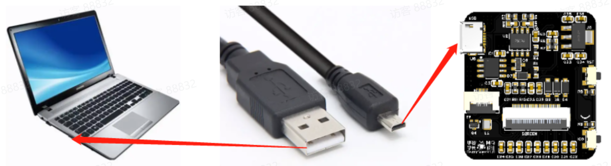

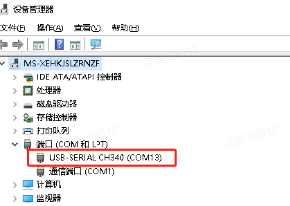

**2、打开ESP FLASH TOOL，选择ESP32**

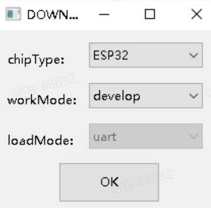

**3、选择固件和对应的烧录地址，配置烧录参数**

需配置晶振频率、SPI SPEED、SPI MODE、Flash Size、串口端口号和波特率等，此处波特率可以尽量选大一些（选择230400或460800），以节省时间，若提示ERROR，请降低波特率：

**注意：固件名称和地址要完全对应起来，否则会出现点不亮屏幕。**

```txt
partition-table.bin 0x8000 
bootloader.bin 0x1000 
DesktopScreen.bin 0x10000 
DesktopScreenFont.bin 0x15D000
```

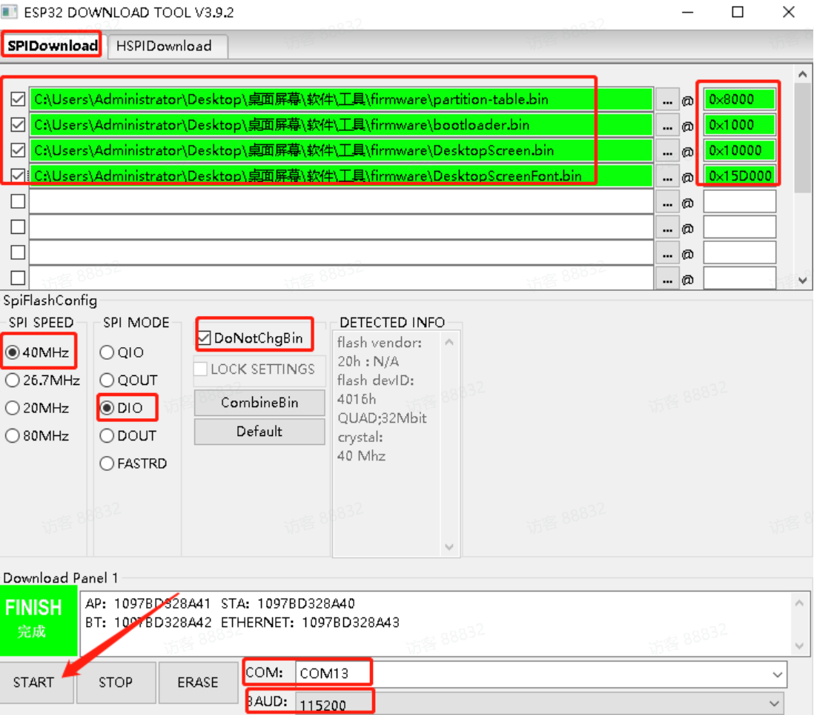

> 注：
>
> 1、注意下载固件前面的√要选上
>
> 2、注意选择的固件和地址要逐一对好
>
> 3、下载前把电池和USB都接上

**4、配置完毕后，进行烧录**

按住IO0，点击RST按键，使其进入下载模式，再点击【START】开始烧录，直到烧录完成

- 出现烧录失败时，可以降低波特率测试。
- 烧录完成，如果屏幕没显示，但是触摸有声音，查看是否烧录错不同版本的固件。
- 烧录完成，如果屏幕一直闪烁，可以先擦除再重新烧录。

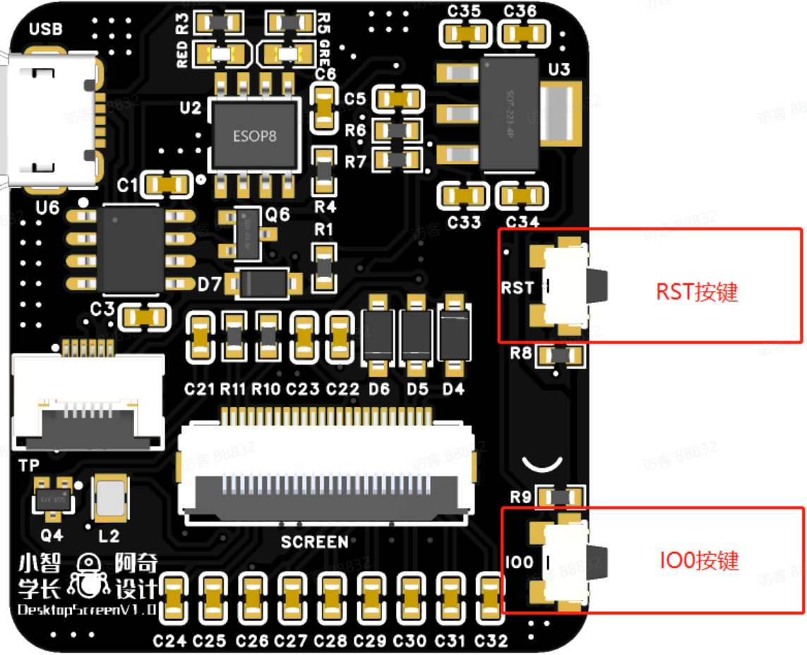

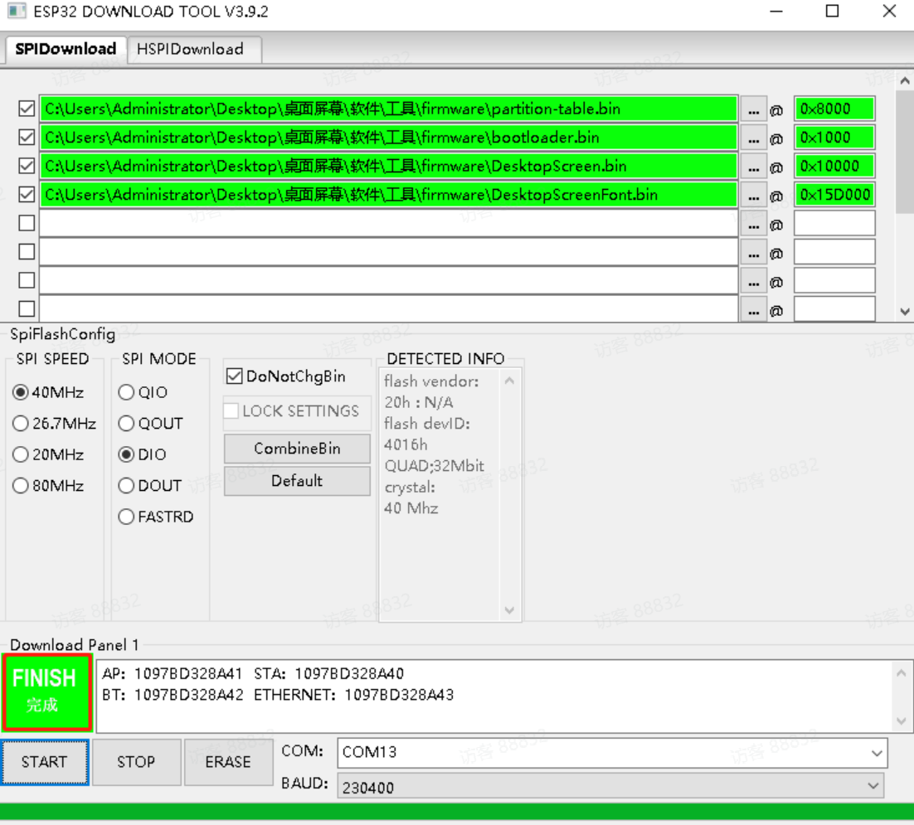

**Linux环境烧录固件：**

`esptool.py`

```cmd
## 环境安装
sudo apt-get install git wget flex bison gperf python3 python3-pip python3-setuptools cmake ninja-build ccache libffi-dev libssl-dev dfu-util

## 固件下载
python esptool.py -p /dev/ttyUSB0 -b 460800 --before default_reset --after hard_reset --chip esp32 write_flash --flash_mode dio --flash_freq 40m --flash_size 4MB 0x8000 partition_table/partition-table.bin 0x1000 bootloader/bootloader.bin 0x10000 DesktopScreen.bin

## 字体库下载
python esptool.py --chip esp32 --port /dev/ttyUSB0 --baud 460800 write_flash -z 0x15D000 DesktopScreenFont.bin
```


## P5 快速上手--安装&使用

略

## P6 开始精学--需求分析

需求

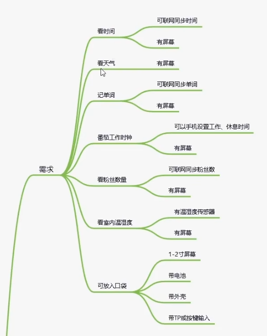

需求细化

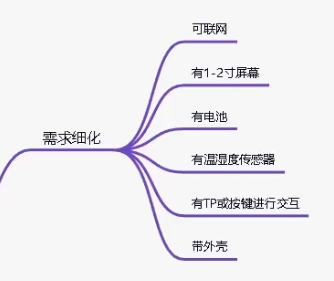

流程化

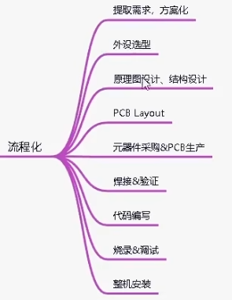

外设方案

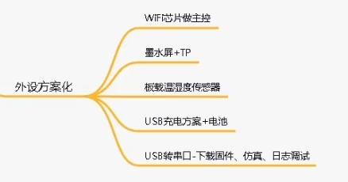

软硬件接口梳理


## P7 方案选型

### 推荐网站

**1. 方案类网站**

* [硬创社](https://x.jlc.com/platform/categoryPreview?projectType=all)
* [电路城](https://www.cirmall.com/circuits/)
* [方案拆解类网站](https://www.52audio.com/archives/category/teardowns)

**2. 电商平台**

淘宝、立创、华秋

**3. 论坛**

电子发烧友、21ic、博客园、CSDN

**4. 芯片官网**

ST、TI、乐鑫、NXP

### 外设选项应该注意什么

**1. 封装（是否好设计？尺寸是否合适？是否好焊接）**

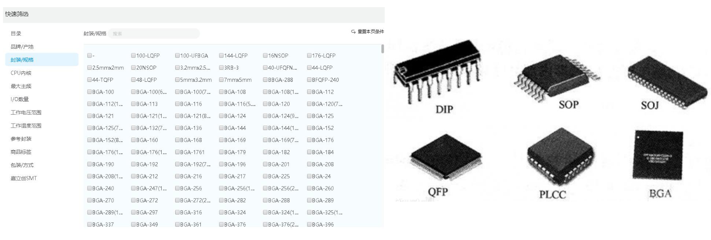

**2. 方案通用性、稳定性（是否是通用方案？是否方便采购？）**

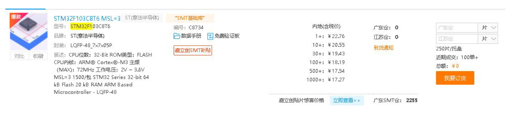

**3. 电池（容量？是否带充放电保护？）**

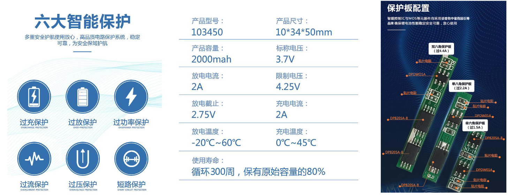

**4. 主控（主频、RAM、ROM、IO资源是否够？）**

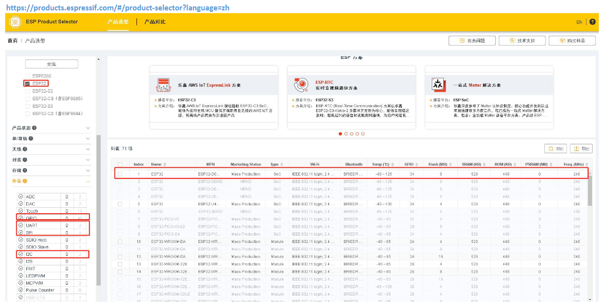

### 选出硬件方案

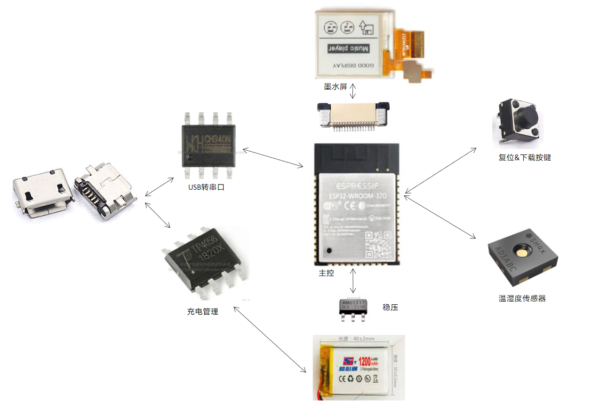

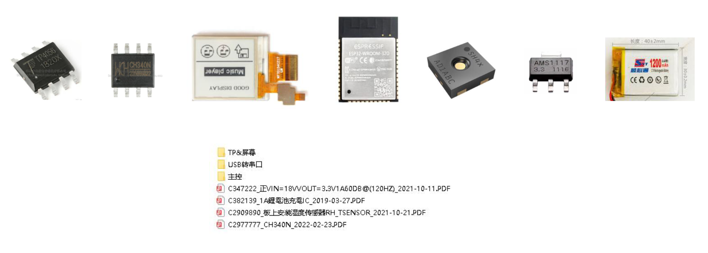

## P11 原理图绘制

> 目前最新版本把温湿度传感器改为了蜂鸣器

1. 最小系统确定
2. 外设接口IO确定
    功能可用
    布线方便

### 1. 最小系统确定

到乐鑫官网找到esp32的技术规格书，查看里面的`外围设计原理图`

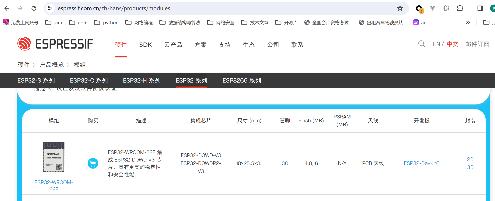

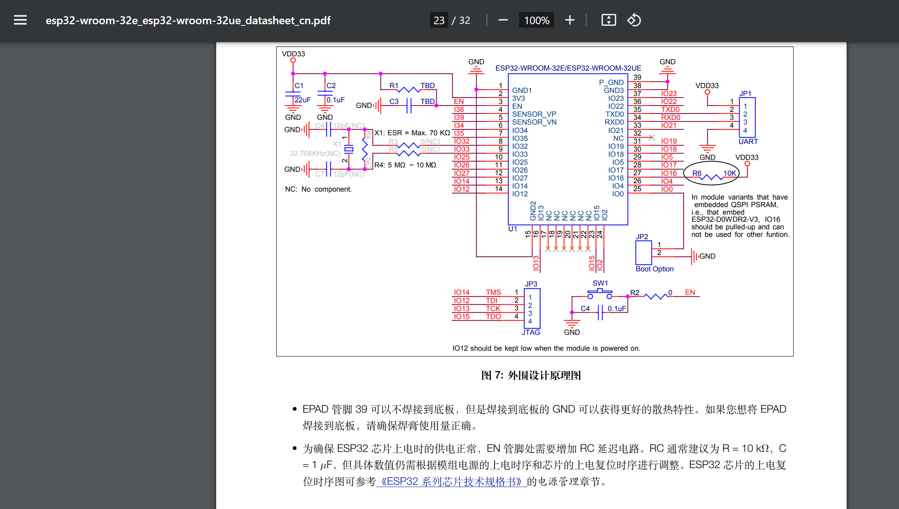

确定具体的引脚功能可用查看`ESP32技术规格书`

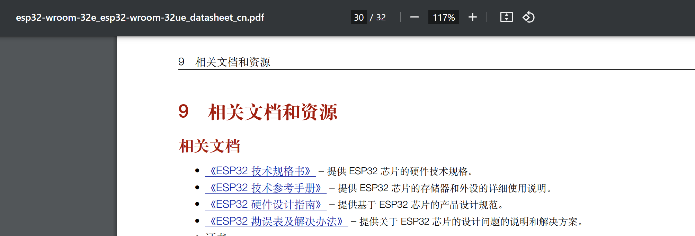

#### 确定I2C引脚

根据技术规格数可以看到I2C可以使用任意引脚

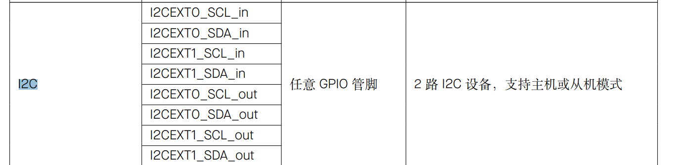

根据管脚位置，选择距离接线端子比较近的`IO32`和`IO33`。

中断引脚`INT`和复位引脚`RST`分别选择为`IO4`和`IO5`。

为什么不选择`IO34`和`IO35`：因为34和35两个引脚只支持输入，不支持输出。

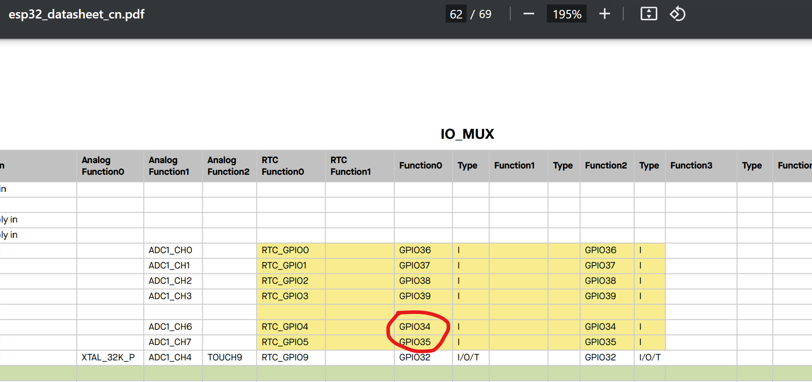


## P22 SPI驱动墨水屏

相关文档：

* 墨水屏：`GDEH0154D67.pdf`
* 墨水屏显示控制芯片：`UC8151C.pdf`

墨水屏使用spi协议来驱动。

本节通过3部分来接受：

* spi协议
* 墨水屏接口
* 代码

### spi协议

spi引脚：

* CS：片选引脚
* SCLK：时钟引脚
* MOSI：主机输出从机输入
* MISO：主机输入从机输出

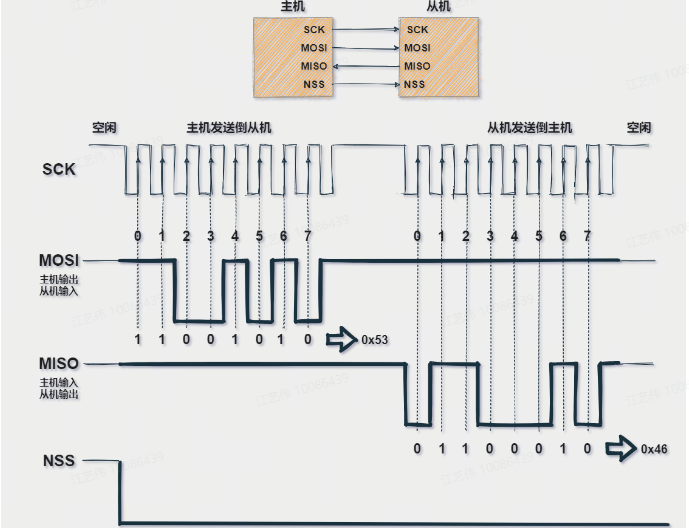

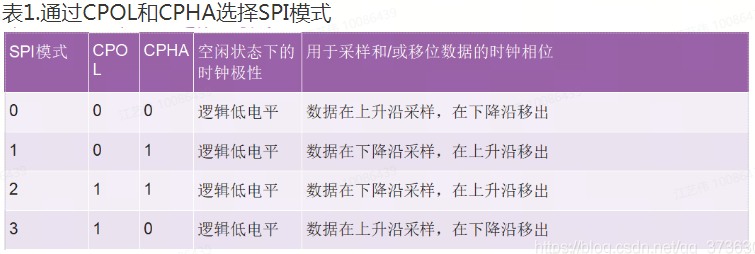

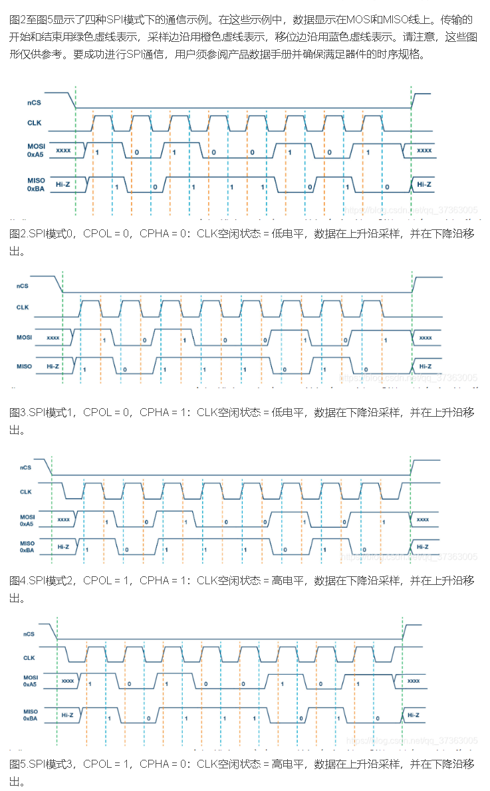

### 墨水屏接口

墨水屏接口：

* SCLK：IO25 SPI 串口通信时钟信号线。
* SDI：IO26 SPI 串口通信数据信号线。 
* CS：IO27 片选，低电平有效。
* D/C：IO14 数据/命令 读写选择，高电平为数据，低电平为命令。
* RES：IO12 电子纸复位信号，低电平有效。
* BUSY：IO13 电子纸刷新时，BUSY 引脚发出忙信号给主 MCU，此时 MCU 无法对电子纸驱动 IC 进行读写操作；电子纸刷新完成后，BUSY 引脚发出闲置状态信号，此时 MCU 可以对 电子纸驱动 IC 进行读写操作。GDEW 系列电子纸 BUSY 引脚忙状态为高电平（GDEH 系列为低电平），BUSY 引脚空闲状态反之。

> 注：墨水屏只用到了SPI协议中的MOSI（主机输出从机输入），并未使用MISO主机输入从机输出的引脚。

### 代码

参考代码：

`DesktopScreenV4.0.3 branch dev8`

说明：该代码适配的屏幕不一样，并不能直接驱动买到的屏幕，需参考`DesktopScreenV4.0.3`最新的代码。

* `main\src\hal\ds_spi.c`

  墨水屏spi相关函数

  * `screen_spi_init()`：spi控制器初始化。
  * `spi_send_cmd(const uint8_t cmd)`：使用spi给墨水屏发送命令。
  * `spi_send_data(const uint8_t data)`：使用spi给墨水屏发送数据。

* `main\src\hal\ds_gpio.c`

  * `ds_screen_gpio_init()`：墨水屏相关引脚的初始化。

* `main\src\driver\ds_screen.c`
  * `init_screen_interface()`：屏幕接口初始化，主要是调用上面的引脚初始化和spi控制器初始化。
  * `init_display()`：屏幕初始化，给屏幕发送相关初始化命令。
  * `lcd_chkstatus()`：状态检测，主要是检测忙信号引脚。
  * `deep_sleep()`：进入休眠模式
  * `refresh()`：刷新函数，貌似调用完显示函数后都要调用该函数。
  * `refresh_part()`：刷新部分。
  * `ds_screen_partial_display()`：局部刷，不带数据。
  * `ds_screen_partial_display_bydata()`：局部刷，带数据。
  * `ds_screen_full_display()`：全刷，不带数据
  * `ds_screen_full_display_bydata()`：全刷，带数据
  * `ds_screen_full_display_data()`：图片全刷-数据函数，目前尚不清楚用途


## P26 使用文件系统

### 1. SPIFFS 文件系统

参考文章：`https://docs.espressif.com/projects/esp-idf/zh_CN/release-v4.1/api-reference/storage/spiffs.html`

#### SPIFFS 文件系统概述

- **功能特点**：SPIFFS 是一个用于 SPI NOR flash 设备的嵌入式文件系统，支持磨损均衡和文件系统一致性检查等功能。
- **限制**：目前不支持目录，只能生成扁平结构；不是实时栈，写操作耗时不等；不支持检测或处理已损坏的块。

#### 工具介绍

- **spiffsgen.py**

  - **功能**：用于生成 SPIFFS 映像文件。

  - **命令格式**：

    ```bash
    python spiffsgen.py <image_size> <base_dir> <output_file>
    ```

    - **必选参数**：
    - `image_size`：分区大小。
      - `base_dir`：创建 SPIFFS 映像的目录。
      - `output_file`：SPIFFS 映像输出文件。
    - **可选参数**：可通过 `python spiffsgen.py --help` 查看，用于控制映像生成的具体配置。

  - **使用方式**：

    - 可手动在命令行或脚本中调用。
    - 可从构建系统调用 `spiffs_create_partition_image` 使用。
      - 在 Make 构建系统中：
    
        ```makefile
        SPIFFS_IMAGE_FLASH_IN_PROJECT := ...
        SPIFFS_IMAGE_DEPENDS := ...
        $(eval $(call spiffs_create_partition_image,<partition>,<base_dir>))
        ```
    
      - 在 CMake 构建系统中：
    
        ```cmake
        spiffs_create_partition_image(<partition> <base_dir> [FLASH_IN_PROJECT] [DEPENDS dep dep dep...])
        ```
    - 可指定 `FLASH_IN_PROJECT`，使用 `idf.py flash` 或 `make flash` 自动烧录映像，如果不指定也可以生成映像，但须使用 `esptool.py`、`parttool.py` 或自定义构建系统目标手动烧录。
    - 若基本目录内容需要在构建时生成，可通过 `DEPENDS` 或 `SPIFFS_IMAGE_DEPENDS` 指定目标，确保在生成映像前执行。

- **mkspiffs**

  - **功能**：也可用于创建 SPIFFS 分区映像。
  - **参数**：
    - Block Size：4096（SPI flash 标准）。
    - Page Size：256（SPI flash 标准）。
    - Image Size：分区大小（可从分区表获取）。
    - Partition Offset：分区起始地址（可从分区表获取）。
  - **使用示例**：
    - 打包文件夹为 1MB 大小的映像：
    
      ```bash
      mkspiffs -c [src_folder] -b 4096 -p 256 -s 0x100000 spiffs.bin
      ```
    
    - 烧录映像到 ESP32（偏移量 0x110000）：
    
      ```bash
      python esptool.py --chip esp32 --port [port] --baud [baud] write_flash -z 0x110000 spiffs.bin
      ```
  
- 工具选择策略
  1. **优先选 spiffsgen.py 的情况**：仅在构建时生成 SPIFFS 映像；主机无可用的 C/C++ 编译器。
  2. **优先选 mkspiffs 的情况**：除生成映像外还需拆包 SPIFFS 映像；当前环境 Python 解释器不可用，但主机编译器可用或有预编译的 mkspiffs 二进制文件。

#### 应用示例

- **位置**：在 `storage/spiffs` 目录下提供。
- **功能**：初始化并挂载 SPIFFS 分区，使用 POSIX 和 C 库 API 写入和读取数据。
- **详细信息**：可参考 `example` 目录下的 `README.md` 文件。

#### 高级 API 参考

- **函数**
  - `esp_vfs_spiffs_register`：将 SPIFFS 注册并挂载到 VFS，返回值包括成功、内存不足、状态无效、未找到分区、挂载或格式化失败等。
  - `esp_vfs_spiffs_unregister`：注销并卸载 SPIFFS，返回值包括成功、已注销等。
  - `esp_spiffs_mounted`：检查 SPIFFS 是否已挂载，返回值为布尔值。
  - `esp_spiffs_format`：格式化 SPIFFS 分区，返回值包括成功、失败等。
  - `esp_spiffs_info`：获取 SPIFFS 信息，返回值包括成功、未挂载等。
- **结构体**
  - `esp_vfs_spiffs_conf_t`：SPIFFS 配置结构体，包含以下成员：
    - `base_path`：与文件系统关联的文件路径前缀。
    - `partition_label`：SPIFFS 分区的标签（可选），若为 NULL，则使用第一个子类型为 spiffs 的分区。
    - `max_files`：同时可打开的最大文件数。
    - `format_if_mount_failed`：若挂载失败，是否格式化文件系统。

### 2. 分区表

参考文章：`https://docs.espressif.com/projects/esp-idf/zh_CN/release-v4.1/api-guides/partition-tables.html`

#### 分区表概述

- **作用**：ESP32 的 flash 可以包含多个应用程序和多种不同类型的数据（如校准数据、文件系统数据、参数存储器数据等），分区表用于管理这些分区。
- **位置**：分区表位于 flash 的默认偏移地址 0x8000 处，长度为 0xC00 字节（最多可保存 95 条分区表条目），分区表数据后还保存着该表的 MD5 校验和用于验证完整性。
- **安全启动**：如果芯片使能了安全启动功能，分区表后还会保存签名信息。

- **分区表中每个条目的内容**

  ```txt
  Name（标签）、Type（app、data 等）、SubType 以及在 flash 中的偏移量（分区的加载地址）。
  ```

#### 内置分区表

在使用分区表时，最简单的方法就是打开项目配置菜单（`idf.py menuconfig`），并在 [CONFIG_PARTITION_TABLE_TYPE](https://docs.espressif.com/projects/esp-idf/zh_CN/release-v4.1/api-reference/kconfig.html#config-partition-table-type) 下选择一张预定义的分区表：

- “Single factory app, no OTA”
- “Factory app, two OTA definitions”

在以上两种选项中，出厂应用程序均将被烧录至 flash 的 0x10000 偏移地址处。

运行 idf.py partition_table ，即可以打印当前使用分区表的信息摘要。

**两张预定义分区表：**

- **Single factory app, no OTA**：仅包含一个出厂应用程序，无 OTA 功能。

  - 分区表信息：

    复制

    ```
    nvs, data, nvs, 0x9000, 0x6000,
    phy_init, data, phy, 0xf000, 0x1000,
    factory, app, factory, 0x10000, 1M,
    ```

- **Factory app, two OTA definitions**：包含一个出厂应用程序和两个 OTA 应用程序分区。

  - 分区表信息：

    复制

    ```
    nvs, data, nvs, 0x9000, 0x4000,
    otadata, data, ota, 0xd000, 0x2000,
    phy_init, data, phy, 0xf000, 0x1000,
    factory, app, factory, 0x10000, 1M,
    ota_0, app, ota_0, 0x110000, 1M,
    ota_1, app, ota_1, 0x210000, 1M,
    ```

#### 创建自定义分区表

- **方法**：通过 `menuconfig` 选择 “Custom partition table CSV” 并输入 CSV 文件路径。

- **CSV 文件格式**：

  - 每行定义一个分区，字段包括：Name、Type、SubType、Offset、Size、Flags。

  - 示例：

    ```
nvs, data, nvs, 0x9000, 0x4000
    otadata, data, ota, 0xd000, 0x2000
    phy_init, data, phy, 0xf000, 0x1000
    factory, app, factory, 0x10000, 1M
    ota_0, app, ota_0, , 1M
    ota_1, app, ota_1, , 1M
    nvs_key, data, nvs_keys, , 0x1000
    ```
  
- **字段说明**：

  - **Name**：分区名称，不超过 16 个字符。
  - **Type**：分区类型，可以是 `app` 或 `data`，也可以是自定义类型（0x40-0xFE），0x00-0x3F 不得使用（预留给 esp-idf 的核心功能）
  - **SubType**：分区子类型，与 Type 相关。例如：
    - 对于 `app` 类型，可以是`factory (0)`，`ota_0 (0x10) … ota_15 (0x1F) `或者 `test (0x20)`。
    - 对于 `data` 类型，可以是 `ota(0)`、`phy(1)`、`nvs(2)`、`nvs_keys(4)` 等。
  - **Offset**：分区偏移地址，若未指定则自动计算。
  - **Size**：分区大小，支持十进制、十六进制及 K/M 单位。
  - **Flags**：分区标志，目前仅支持 `encrypted`，设置该标志时，且已启用 [Flash Encryption](https://docs.espressif.com/projects/esp-idf/zh_CN/release-v4.1/security/flash-encryption.html) 功能，则该分区将会被加密。`app`分区始终加密

#### 生成二进制分区表

- **工具**：`gen_esp32part.py` 用于将 CSV 文件转换为二进制文件。
- **命令**：
  - CSV 转二进制：
  
    ```bash
    python gen_esp32part.py input_partitions.csv binary_partitions.bin
    ```
  
  - 二进制转 CSV：
  
    ```bash
    python gen_esp32part.py binary_partitions.bin input_partitions.csv
    ```
  
  - 打印分区表内容：
  
    ```bash
    python gen_esp32part.py binary_partitions.bin
    ```
- **MD5 校验和**：二进制分区表包含 MD5 校验和，用于验证完整性。可通过 `--disable-md5sum` 禁用。

#### 烧写分区表

- **命令**：
  - `idf.py partition_table-flash`：仅烧写分区表。
  - `idf.py flash`：烧写所有内容，包括分区表。
- **注意**：分区表更新不会擦除之前存储的数据。可使用 `idf.py erase_flash` 或 `esptool.py erase_flash` 擦除 flash 内容。


# 外观

软件设置

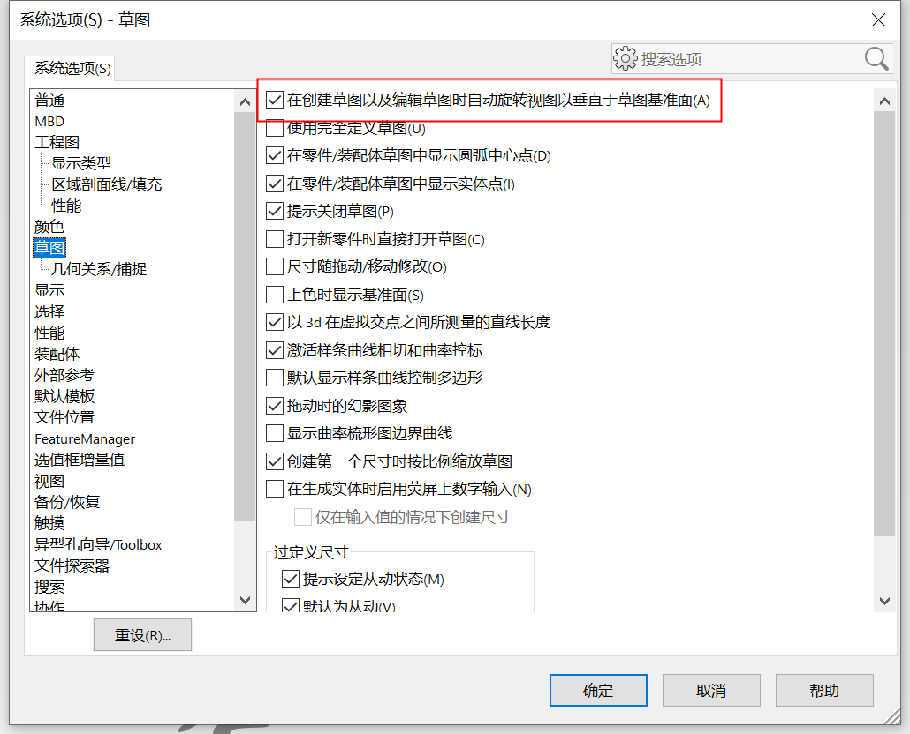

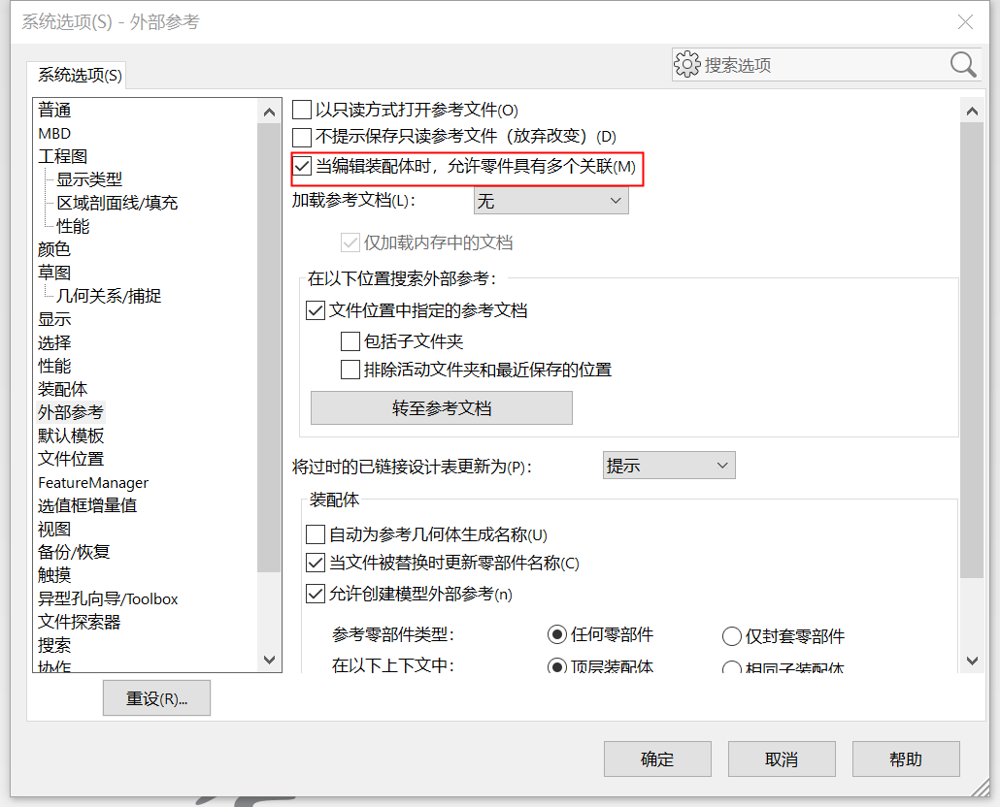