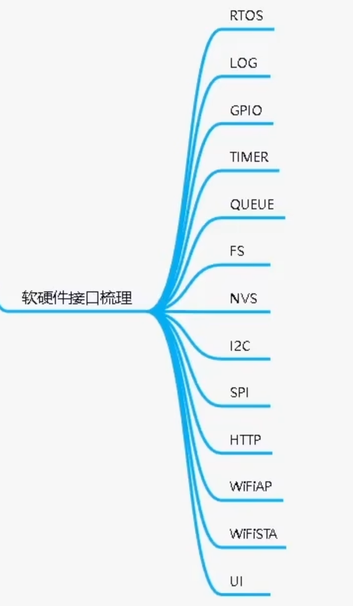

# 桌面小屏幕

学习资料：

* 小智学长的视频教程：https://www.bilibili.com/video/BV1wV4y1G7Vk

* 飞书文档：https://x509p6c8to.feishu.cn/docx/NQCTdjUFJoYoZ1xYHS9cIlbwnxh

## P2 学习建议&工具准备

多种学习路径：

* 快速路径--PCB全贴片（SMT）
  * 硬件部分：无
  * 软件部分：资料包（公众号-资料下载）、USB数据线
* 快速路径--自行焊接
  * 硬件部分：电烙铁、焊锡、镊子、针筒锡膏、吸锡带（如果焊接基础不好，建议购买用于FPC端子焊接）
  * 软件部分：资料包、USB数据线

* 精学路径
  * 硬件部分：电烙铁、焊锡、镊子、针筒锡膏、吸锡带（如果焊接基础不好，建议购买用于FPC端子焊接）
  * 软件部分：资料包、USB数据线
  * 入门基本要求：
    * 对于C基础的学习：了解常量、变量、函数、结构体使用
    * 对于单片机基础的学习：了解定时器、中断、IO、I2C、SPI使用

## P3 快速上手--硬件生产

1. 直接下单PCB+SMT, 烧录&验证
2. 自行下单PCB+元器件，自己使用电烙铁、锡、镊子焊接，烧录&验证
3. 购买开发板卡，烧录&验证

介绍立创下单pcb的流程，这里略过

## P4 快速上手--烧录固件

收到工程加工完成的PCB后，我们接上屏幕、TP，然后就可以进行固件烧录了。


### 一、 烧录工具下载

[工具|乐鑫科技](https://www.espressif.com.cn/zh-hans/support/download/other-tools)


`资料/桌面小屏幕/flash_download_tool_3.9.2_0.zip`

### 固件下载

墨水屏幕版本GDEW15D67（现在新版本只有D67的屏幕可以买了，所以一般选这个固件）

firmware_V4.0.3.zip

```txt
V1.0.4 蜂鸣器版本（适配墨水屏GDEW15T8）
V3.0.0 蜂鸣器版本（适配墨水屏GDEW15M09）
V4.0.0 蜂鸣器版本（适配墨水屏GDEW15D67）
V4.0.1 蜂鸣器版本，修复番茄时钟不准、休眠计时问题（适配墨水屏GDEW15D67）
V4.0.2 蜂鸣器版本，修复文件系统格式化失败问题（适配墨水屏GDEW15D67）
V4.0.3 蜂鸣器版本，修复B站接口变动导致频繁重启问题（适配墨水屏GDEW15D67）
建议使用最新版本
```

内容：

**bootloader.bin 引导加载**

**partition-table.bin 分区表**

**DesktopScreen.bin 应用固件**

**DesktopScreenFont.bin 字体库**

### 三、固件烧录

**1. 把板卡与电脑通过USB连接，打开设备管理器，记住端口填到第三步的COM中，如果接好线电脑没出现COM口，请检查ESP32 TX RX、CH340芯片和外围焊接问题，如果确认焊接没问题，更好USB线试下（部分USB线只供电，不通信）**


**2、打开ESP FLASH TOOL，选择ESP32**


**3、选择固件和对应的烧录地址，配置烧录参数**

需配置晶振频率、SPI SPEED、SPI MODE、Flash Size、串口端口号和波特率等，此处波特率可以尽量选大一些（选择230400或460800），以节省时间，若提示ERROR，请降低波特率：

**注意：固件名称和地址要完全对应起来，否则会出现点不亮屏幕。**

```txt
partition-table.bin 0x8000 
bootloader.bin 0x1000 
DesktopScreen.bin 0x10000 
DesktopScreenFont.bin 0x15D000
```


> 注：
>
> 1、注意下载固件前面的√要选上
>
> 2、注意选择的固件和地址要逐一对好
>
> 3、下载前把电池和USB都接上

**4、配置完毕后，进行烧录**

按住IO0，点击RST按键，使其进入下载模式，再点击【START】开始烧录，直到烧录完成

- 出现烧录失败时，可以降低波特率测试。
- 烧录完成，如果屏幕没显示，但是触摸有声音，查看是否烧录错不同版本的固件。
- 烧录完成，如果屏幕一直闪烁，可以先擦除再重新烧录。


**Linux环境烧录固件：**

`esptool.py`

```cmd
## 环境安装
sudo apt-get install git wget flex bison gperf python3 python3-pip python3-setuptools cmake ninja-build ccache libffi-dev libssl-dev dfu-util

## 固件下载
python esptool.py -p /dev/ttyUSB0 -b 460800 --before default_reset --after hard_reset --chip esp32 write_flash --flash_mode dio --flash_freq 40m --flash_size 4MB 0x8000 partition_table/partition-table.bin 0x1000 bootloader/bootloader.bin 0x10000 DesktopScreen.bin

## 字体库下载
python esptool.py --chip esp32 --port /dev/ttyUSB0 --baud 460800 write_flash -z 0x15D000 DesktopScreenFont.bin
```


## P5 快速上手--安装&使用

略

## P6 开始精学--需求分析

需求


需求细化


流程化


外设方案


软硬件接口梳理



## P7 方案选型

### 推荐网站

**1. 方案类网站**

* [硬创社](https://x.jlc.com/platform/categoryPreview?projectType=all)
* [电路城](https://www.cirmall.com/circuits/)
* [方案拆解类网站](https://www.52audio.com/archives/category/teardowns)

**2. 电商平台**

淘宝、立创、华秋

**3. 论坛**

电子发烧友、21ic、博客园、CSDN

**4. 芯片官网**

ST、TI、乐鑫、NXP

### 外设选项应该注意什么

**1. 封装（是否好设计？尺寸是否合适？是否好焊接）**


**2. 方案通用性、稳定性（是否是通用方案？是否方便采购？）**


**3. 电池（容量？是否带充放电保护？）**


**4. 主控（主频、RAM、ROM、IO资源是否够？）**


### 选出硬件方案


