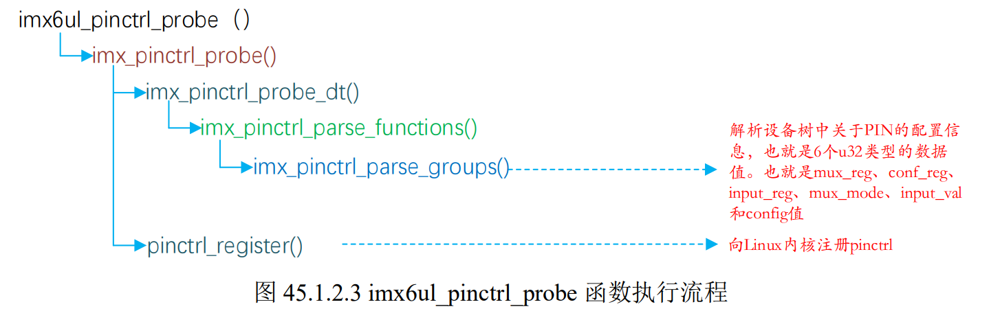
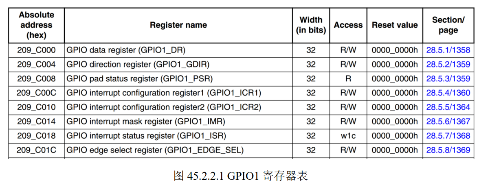
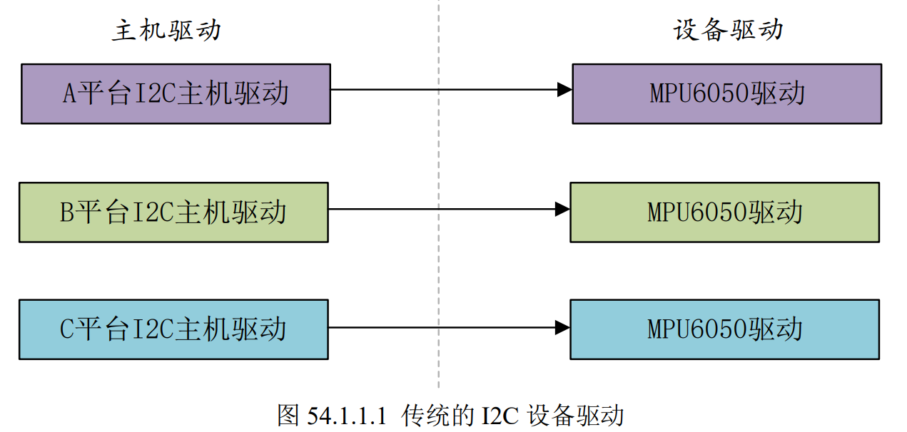
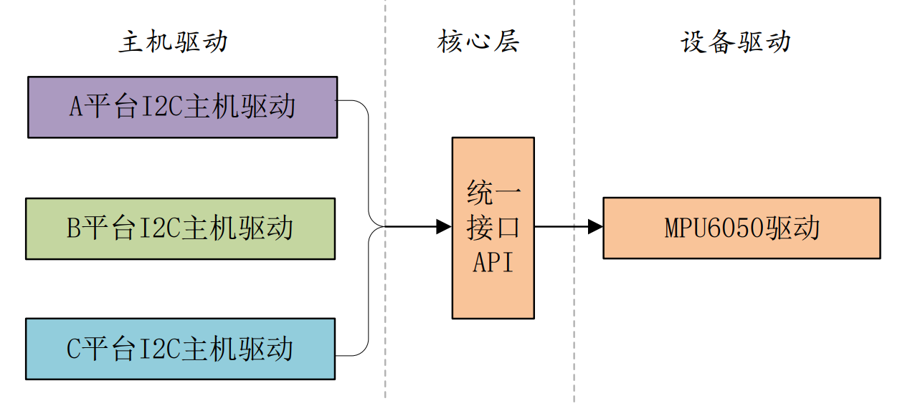
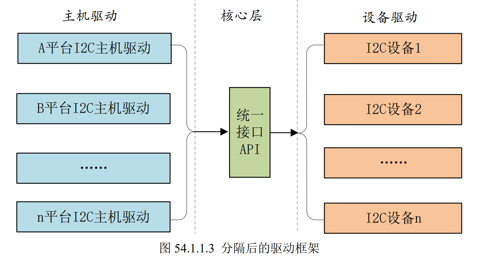
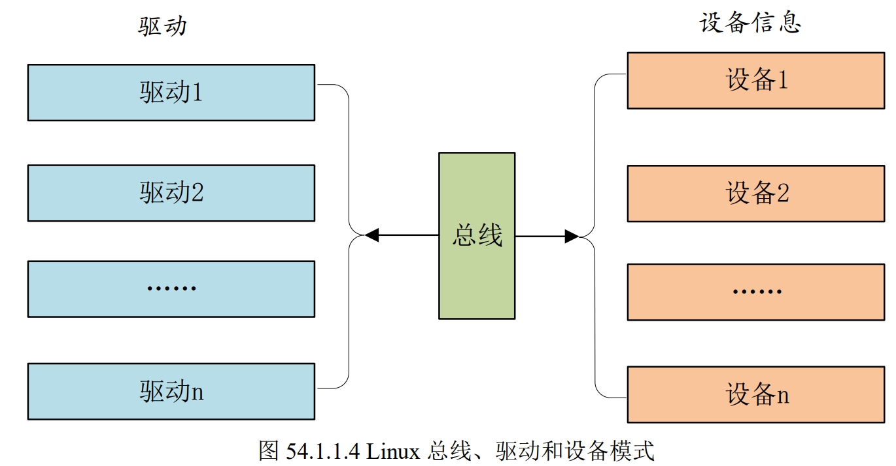

# 正点原子-Linux驱动学习

学习资料：

* `i.MX6ULL Linux阿尔法开发板 `：http://www.openedv.com/docs/boards/arm-linux/zdyz-i.mx6ull.html

* 网盘资料：
  - 配套 `Linux之Ubuntu入门篇 `视频链接： [https://pan.baidu.com/s/1uTu9-Fy2gVWSUxhoUsqZCQ ](https://pan.baidu.com/s/1uTu9-Fy2gVWSUxhoUsqZCQ)提取码：jmoz
  - 配套 `Linux之ARM裸机篇 `视频链接： [https://pan.baidu.com/s/1TjaQSuRZK0OiUCqc6S0SiQ ](https://pan.baidu.com/s/1TjaQSuRZK0OiUCqc6S0SiQ)提取码：r27n
  - 配套 `Linux之系统移植和文件系统构建篇 `视频链接： [https://pan.baidu.com/s/1vdUOu0uF8VXoLN51boJyHw ](https://pan.baidu.com/s/1vdUOu0uF8VXoLN51boJyHw)提取码：d2rz
  - 配套 `Linux之驱动开发篇 `视频链接： [https://pan.baidu.com/s/1JU95JHG-v7MKvkvXsMNhdw ](https://pan.baidu.com/s/1JU95JHG-v7MKvkvXsMNhdw)提取码：n3ju
  - 配套 `Linux之网络环境搭建篇 `视频链接： [https://pan.baidu.com/s/1K_cwr2Trq2lvWlXju8bq8Q ](https://pan.baidu.com/s/1K_cwr2Trq2lvWlXju8bq8Q)提取码：5sfw
  - 配套 `Linux之Qt5（C++）篇 `视频链接： [https://pan.baidu.com/s/1Z_AlP2M1H8R_TjIWN-Pk0g ](https://pan.baidu.com/s/1Z_AlP2M1H8R_TjIWN-Pk0g)提取码：2df1
  - 配套 `Linux之C应用开发篇 `视频链接： [https://pan.baidu.com/s/19fOMRvPaPbCokOj5vkYsxA ](https://pan.baidu.com/s/19fOMRvPaPbCokOj5vkYsxA)提取码：j5dj

## 第1讲 Linux驱动开发与裸机开发区别

## 第2讲 字符设备驱动开发基础实验

略

## 第3讲 字符设备驱动框架

### 1. 字符设备驱动框架

字符设备驱动的编写主要就是驱动对应的open、close、read等函数，其实就是file_operations结构体的成员变量的实现。

### 2. 驱动模块的加载与卸载

Linux驱动程序可以编译到kernel里面，也就是zImage，也可以编译为模块`.ko`。

编写驱动的基本流程：

* 编译驱动的时候需要用到Linux内核源码，因此需要解压缩Linux内核源码，编译Linux内核源码，得到zImage和`.dtb`。需要使用编译后得到的zImage和dtb启动系统。

* 从SD卡启动，SD卡烧写了uboot。uboot通过tftp从ubuntu里面获取zimage和dtb，rootfs也是通过nfs挂载。

* 设置bootcmd和bootargs

  ```txt
  bootargs=console=ttymxc0,115200rw root=/dev/nfs nfsroot=192.168.1.66:/home/zzk/linux/nfs/rootfs ip=192.168.1.50:192.168.1.66:192.168.1.1:255.255.255.0::eth0:off
  
  bootcmd=tftp 80800000 zImage;tftp 83000000 imx6ull-alientek emmc.dtb;bootz 80800000 - 83000000;
  ```

* 将编译出来的`.ko`文件放到根文件系统里面。加载驱动会用到加载命令；insmod、modprobe

  > 对于新的模块，使用modprobe加载的时候需要先调用一下depmo命令。

* 驱动模块加载成功后，可以使用lsmod查看一下
* 卸载模块使用rmmod命令

### 3. 字符设备的注册与注销

1. 我们需要向系统注册一个字符设备，使用函数`register_chrdev`
2. 卸载驱动的时候需要注销掉前面注册的字符设备，使用函数`unregister_chrdeb`

### 4. 设备号

1. Linux内核使用`dev_t`表示设备号

   ```c
   typedef __kernel_dev_t dev_t;
   typedef __u32 __kernel_dev_t;
   typedef unsigned int __u32;
   ```

2. Linux内核将设备号分为两部分：主设备号（前12位）和次设备号（后20位）。

3. 设备号的相关操作：

   * 获取主设备号：`MAJOR(dev_t)`
   * 获取次设备号：`MAJOR(dev_t)`
   * 构造设备号：`MKDEV(major,minor)`

### 5. `file_operations`的具体实现

`file_operations`结构体

### 6. 字符设备驱动框架搭建

### 7. 应用程序编写

Linux下一切皆文件，使用open、read、write文件操作驱动设备文件

### 8. 测试

1. 把新的驱动拷贝的开发板并加载驱动

   `modprobe chrdevbase.ko`

2. 进入/dev查看设备文件`/dev/chrdevbase`。需要先创建设备节点`mkmod /dev/chrdevbase c 200 0`

3. 测试

   `./chrdevbaseAPP /dev/chrdevbase`

### 9. chrdevbase 设备驱动的完善

添加对驱动设备的读写操作，从驱动里面读取字符串，向驱动里面写数据。

* 驱动给应用传递数据：`copy_to_user`函数
* 应用给驱动传递数据：`copy_from_user`函数

### 3. 实验

#### 实验1：第一个字符设备驱动

* 创建工程目录：

    ```txt
    cd ~/linux/IMX6ULL/Linux_Drivers
    mkdir 1_chrdevbase
    cd 1_chrdevbase
    ```

* 创建`chrdevbase.c`文件

  ​	参考代码：`linux/linux-imx-rel_imx_4.1.15_2.1.0_ga_alientek`

  ​	`TODO:4:05`

* 设置vscode的头文件路径：`TODO:19:28`

    ```txt
    {内核位置}/include
    {内核位置}/arch/arm/include
    {内核位置}/arch/arm/include/generated
    ```

	> 内核源码的位置：`第3期 系统移植和根文件系统\第3期 程序源码.rar`

* 编译：
  * `make`
  * 确认是否有生成`chrdevbase.ko`
* 测试：使用`modprobe`加载驱动

#### 实验2：添加设备号和file_operation操作

* 查看未使用的主设备号：

  ```base
  # 查看已使用的主设备号
  cat /proc/devices
  Character devices底下
  # 使用一个未在这边出现的号码
  ```

* 完善`chrdevbase.c`代码

  * 填写设备号
  * 添加`file_operations`代码
  * 添加设备的注册与注销函数

* 添加调用代码`chrdevbaseAPP.c`

  编译：

  ```base
  arm-linux-gnueabihf-gcc chrdevbaseAPP.c -o chrdevbaseAPP
  ```

#### 实验3：用户对驱动的读写

## 第4讲 嵌入式Linux LED驱动开发实验

### 1. 地址映射

1. 裸机LED灯实验就是操作6ULL的寄存器
2. Linux驱动开发也是操作寄存器，Linux不能直接对寄存器物理地址进行读写操作，因为Linux会使用MMU内存管理单元，需要获得物理地址对应的虚拟地址，然后再进行操作。
   * ioremap函数：将物理地址映射到虚拟地址。
   * iounmap函数：释放掉ioremap函数所作的映射。

### 2. 驱动程序编写

创建`2_led/led.c`文件：

1. 初始化时钟、GPIO等
2. 注册字符设备驱动
3. 注销字符设备驱动等

> 如果你烧写的是正点原子提供的linux内核，这个时候LED默认被配置为心跳灯，必须关闭心跳灯才能测试该程序。具体参考书籍：P1093

### 3. 应用程序编写

编写测试驱动的程序：`ledApp.c`

### 4. 测试

1. 加载驱动

   ```shell
   depmod	//第一次加载驱动的时候需要运行此命令
   modprobe led.ko	//加载驱动
   ```

2. 创建设备节点：

   ```shell
   mknod /dev/led c 200 0
   ```

3. 运行测试程序：

   ```shell
   ./ledApp /dev/led 1	//打开LED灯
   ./ledApp /dev/led 0	//关闭LED灯
   ```

4. 卸载命令：

   ```shell
   rmmod led.ko
   ```

## 第5讲 新字符设备驱动实验

### 1. 新的字符设备注册方法

#### 1.1 新的设备号申请和释放函数

register_chrdev 和 unregister_chrdev 这两个函数是老版本驱动使用的函数
register_chrdev 两个问题：
    a. 需要我们事先确定好哪些主设备号没有使用。
    b. 会将一个主设备号下的所有次设备号都使用掉

新的申请和释放设备号函数：

* 申请设备号：

  * 如果没有指定设备号的话就使用如下函数来申请设备号：

    ```c
    int alloc_chrdev_region(dev_t *dev, unsigned baseminor, unsigned count, const char *name)
    ```

  * 如果给定了设备的主设备号和次设备号就使用如下所示函数来注册设备号即可：

    ```c
    int register_chrdev_region(dev_t from, unsigned count, const char *name)
    ```

  * 释放设备号

    ```c
    void unregister_chrdev_region(dev_t from, unsigned count)
    ```

使用示例：

```c
/* 申请设备号 */
int major; /* 主设备号 */
int minor; /* 次设备号 */
dev_t devid; /* 设备号 */

if (major) { /* 定义了主设备号 */
    devid = MKDEV(major, 0); /* 大部分驱动次设备号都选择 0*/
    register_chrdev_region(devid, 1, "test");
} else { /* 没有定义设备号 */
    alloc_chrdev_region(&devid, 0, 1, "test"); /* 申请设备号 */
    major = MAJOR(devid); /* 获取分配号的主设备号 */
    minor = MINOR(devid); /* 获取分配号的次设备号 */
}

/*************************************************/
/* 注销设备号 */
unregister_chrdev_region(devid, 1); /* 注销设备号 */
```

#### 1.2 新的字符设备注册方法

<font color=blue>1. 字符设备结构</font>

在 Linux 中使用 cdev 结构体表示一个字符设备，cdev 结构体在 include/linux/cdev.h 文件中：

```c
struct cdev {
    struct kobject kobj;
    struct module *owner;
    const struct file_operations *ops;
    struct list_head list;
    dev_t dev;
    unsigned int count;
};
```

两个重要的成员变量：

* ops：字符设备文件操作集合函数
* dev：设备号

<font color=blue>cdev_init 函数 </font>

定义好 cdev 变量以后就要使用 cdev_init 函数对其进行初始化，cdev_init 函数原型如下：

```c
void cdev_init(struct cdev *cdev, const struct file_operations *fops)
```

<font color=blue>cdev_add 函数 </font>

cdev_add 函数用于向 Linux 系统添加字符设备(cdev 结构体变量)，首先使用 cdev_init 函数完成对 cdev 结构体变量的初始化，然后使用 cdev_add 函数向 Linux 系统添加这个字符设备。

cdev_add 函数原型如下：

```c
int cdev_add(struct cdev *p, dev_t dev, unsigned count)
```

* p：指向要添加的字符设备（cdev结构体变量）
* dev：设备所使用的设备号
* count：要添加的设备数量 

示例代码：

```c
struct cdev testcdev;

/* 设备操作函数 */
static struct file_operations test_fops = {
    .owner = THIS_MODULE,
    /* 其他具体的初始项 */
};

testcdev.owner = THIS_MODULE;
cdev_init(&testcdev, &test_fops); /* 初始化 cdev 结构体变量 */
cdev_add(&testcdev, devid, 1); /* 添加字符设备 */
```

上面就是新的注册字符设备代码段，Linux 内核中大量的字符设备驱动都是采用这种方法向 Linux 内核添加字符设备。如果在刚才分配设备号的程序，那么就它们一起实现的就是函数 register_chrdev 的功能。

<font color=blue>cdev_del 函数 </font>

卸载驱动的时候一定要使用 cdev_del 函数从 Linux 内核中删除相应的字符设备，cdev_del 函数原型如下：

```c
void cdev_del(struct cdev *p)
```

cdev_del 和 unregister_chrdev_region 这两个函数合起来的功能相当于 unregister_chrdev 函数。

### 2. 自动创建设备节点

前面的实验中，modprobe加载驱动后还需要使用命令mkmod手动创建设备节点，本节讲解驱动中实现自动创建设备节点的功能，在modprobe加载驱动时自动创建设备节点（即在/dev目录下自动创建对应的设备文件）

#### 2.1 **mdev** 机制

udev 是一个用户程序，在 Linux 下通过 udev 来实现设备文件的创建与删除，udev 可以检测系统中硬件设备状态，可以根据系统中硬件设备状态来创建或者删除设备文件。比如使用modprobe 命令成功加载驱动模块以后就自动在/dev 目录下创建对应的设备节点文件,使用rmmod 命令卸载驱动模块以后就删除掉/dev 目录下的设备节点文件。

使用 busybox 构建根文件系统的时候，busybox 会创建一个 udev 的简化版本—mdev，所以在嵌入式 Linux 中我们使用 mdev 来实现设备节点文件的自动创建与删除，Linux 系统中的热插拔事件也由 mdev 管理，在/etc/init.d/rcS 文件中如下语句：

```shell
echo /sbin/mdev > /proc/sys/kernel/hotplug
```

#### 2.2 创建和删除类

自动创建设备节点的工作是在驱动程序的入口函数中完成的，一般在 cdev_add 函数后面添加自动创建设备节点相关代码。

创建class结构体对象

```c
struct class *class_create (struct module *owner, const char *name)
```

* owner：一般为`THIS_MODULE`
* name：类的名字
* 返回值：指向结构体 class 的指针，也就是创建的类

卸载驱动程序的时候需要删除掉类，类删除函数为 class_destroy：

```c
void class_destroy(struct class *cls);
```

#### 2.3 创建设备

创建类后还需要在类下创建一个设备，device_create函数就是在类下面创建设备：

```c
struct device *device_create(struct class *class, 
						     struct device *parent,
						     dev_t devt, 
						     void *drvdata, 
						     const char *fmt, ...)
```

* class：设备要创建在哪个类下面
* parent：父设备，一般为NULL
* devt：设备号
* drvdata：设备可能会使用的一些数据，一般为NULL
* fmt：设备名字，如果设置 fmt=xxx 的话，就会生成/dev/xxx这个设备文件。
* 返回值：创建好的设备。

卸载驱动的时候需要删除掉创建的设备，设备删除函数为 device_destroy：

```c
void device_destroy(struct class *class, dev_t devt)
```

#### 2.4 示例代码

`创建/删除类和创建设备`

```c
struct class *class; /* 类 */ 
struct device *device; /* 设备 */
dev_t devid; /* 设备号 */ 

/* 驱动入口函数 */
static int __init led_init(void)
{
    /* 创建类 */
    class = class_create(THIS_MODULE, "xxx");
    /* 创建设备 */
    device = device_create(class, NULL, devid, NULL, "xxx");
    return 0;
}

/* 驱动出口函数 */
static void __exit led_exit(void)
{
    /* 删除设备 */
    device_destroy(newchrled.class, newchrled.devid);
    /* 删除类 */
    class_destroy(newchrled.class);
}

module_init(led_init);
module_exit(led_exit);
```

### 3. 设置文件私有数据

每个硬件设备都有一些属性，比如主设备号(dev_t)，类(class)、设备(device)、开关状态(state)等等，在编写驱动的时候你可以将这些属性全部写成变量的形式，如下所示：

```c
dev_t devid; /* 设备号 */
struct cdev cdev; /* cdev */
struct class *class; /* 类 */
struct device *device; /* 设备 */
int major; /* 主设备号 */
int minor; /* 次设备号 */
```

这样比较杂乱，最好写成结构体更整洁，并且编写驱动 open 函数的时候将设备结构体作为私有数据添加到设备文件中。

在 open 函数里面设置好私有数据以后，在 write、read、close 等函数中直接读取 private_data即可得到设备结构体。

示例代码：`设备结构体作为私有数据`

```c
struct test_dev{
    dev_t devid; /* 设备号 */
    struct cdev cdev; /* cdev */
    struct class *class; /* 类 */
    struct device *device; /* 设备 */
    int major; /* 主设备号 */
    int minor; /* 次设备号 */
};

struct test_dev testdev;

/* open 函数 */
static int test_open(struct inode *inode, struct file *filp)
{
    filp->private_data = &testdev; /* 设置私有数据 */
    return 0;
}
```

### 4. 实验：使用新的字符设备驱动

参考示例代码：`3_newchrled`

三个文件：

* `newchrled.c`
* `ledApp.c`
* `Makefile`

测试：

把编译出来的`newchrled.ko`和`ledApp`拷贝到开发板

加载驱动模块：

```shell
depmod	//第一次加载驱动的时候需要运行此命令
modprobe newchrled.ko //加载驱动
```

驱动加载成功以后会输出申请到的主设备号和次设备号

驱动加载成功以后会自动在/dev 目录下创建设备节点文件/dev/newchrdev

测试开关灯：

```shell
./ledApp /dev/newchrled 1 //打开 LED 灯
./ledApp /dev/newchrled 0 //关闭 LED 灯
```

卸载驱动：

```shell
rmmod newchrled.ko
```


## 第45章 pinctrl和gpio子系统实验

linux内核提供了pinctrl和gpio子系统用于GPIO驱动

### 45.1 pinctrl 子系统

pinctrl子系统主要工作内容：
1. 获取设备树中pin信息
2. 根据获取到的pin信息来设置pin的复用功能
3. 根据获取到的pin信息来设置pin的电气特性，比如上/下拉、速度、驱动能力等

#### 45.1.1 I.MX6ULL 的pinctrl 子系统驱动

##### 1. PIN 配置信息详解

一般会在设备树里面创建一个节点来描述PIN的配置信息。

打开`imx6ull.dsi`文件，找到一个iomuxc的节点：

```c
iomuxc: iomuxc@020e0000 {
    compatible = "fsl,imx6ul-iomuxc";
    reg = <0x020e0000 0x4000>;
};
```

打开`imx6ull-alientek-emmc.dts`，里面有对`iomuxc`节点追加的数据：

```c
&iomuxc {
pinctrl-names = "default";
pinctrl-0 = <&pinctrl_hog_1>;
imx6ul-evk {
        pinctrl_hog_1: hoggrp-1 {
            fsl,pins = <
            MX6UL_PAD_UART1_RTS_B__GPIO1_IO19 0x17059
            MX6UL_PAD_GPIO1_IO05__USDHC1_VSELECT 0x17059
            MX6UL_PAD_GPIO1_IO09__GPIO1_IO09 0x17059
            MX6UL_PAD_GPIO1_IO00__ANATOP_OTG1_ID 0x13058
            >;
        };
        ..
        pinctrl_flexcan1: flexcan1grp{
            fsl,pins = <
            MX6UL_PAD_UART3_RTS_B__FLEXCAN1_RX 0x1b020
            MX6UL_PAD_UART3_CTS_B__FLEXCAN1_TX 0x1b020
            >;
        };
        ..
        pinctrl_wdog: wdoggrp {
            fsl,pins = <
            MX6UL_PAD_LCD_RESET__WDOG1_WDOG_ANY 0x30b0
            >;
        };
    };
};
```

* `pinctrl_hog_1` 子节点是和热插拔有关的 PIN 集合
* `pinctrl_flexcan1` 子节点是flexcan1这个外设所使用的PIN

* `pinctrl_wdog` 子节点是wdog外设所使用的PIN

<font color=blue>如何添加PIN的配置信息：</font>

以`pinctrl_hog_1`子节点的PIN配置信息为例

```c
MX6UL_PAD_UART1_RTS_B__GPIO1_IO19 0x17059
```

`UART1_RTS_B`这个PIN是SD卡是否插入的检测引脚。

* `MX6UL_PAD_UART1_RTS_B__GPIO1_IO19`的宏定义在`arch/arm/boot/dts/imx6ul-pinfunc.h`

  ```c
  #define MX6UL_PAD_UART1_RTS_B__GPIO1_IO19 0x0090 0x031C 0x0000 0x5 0x0
  ```

  这5个值代标的意思是 `mux_reg conf_reg input_reg mux_mode input_val`

* `0x17059`：对应`config_reg`寄存器值，此值由用户自行设置，通过此值来设置IO的上/下拉、驱动能力和速度等。

##### 2. PIN驱动程序讲解

寄存器和寄存器值配置好后，Linux内核的驱动文件就会根据这些值来做相应的初始化。

通过iomuxc节点的compatible属性的值找到对应的驱动文件`drivers/pinctrl/freescale/pinctrl-imx6ul.c`

下面列出`probe`函数（设备和驱动匹配成功后会执行的函数）

```c
static int imx6ul_pinctrl_probe(struct platform_device *pdev)
{
	const struct of_device_id *match;
	struct imx_pinctrl_soc_info *pinctrl_info;

	match = of_match_device(imx6ul_pinctrl_of_match, &pdev->dev);

	if (!match)
		return -ENODEV;

	pinctrl_info = (struct imx_pinctrl_soc_info *) match->data;

	return imx_pinctrl_probe(pdev, pinctrl_info);
}
```

该函数是`I.MX6ULL`这个SOC的PIN配置入口函数。以此为入口的函数调用路径：



<font color=blue>`imx_pinctrl_parse_groups`函数：</font>

该函数负责获取设备树中关于PIN的配置信息，也就是前面分析的6个u32类型的值。

```c
static int imx_pinctrl_parse_groups(struct device_node *np,
							struct imx_pin_group *grp,
							struct imx_pinctrl_soc_info *info,
							u32 index)
{
	int size, pin_size;
	const __be32 *list;
	int i;
	u32 config;
	......
	
	for (i = 0; i < grp->npins; i++) {
		u32 mux_reg = be32_to_cpu(*list++);
		u32 conf_reg;
		unsigned int pin_id;
		struct imx_pin_reg *pin_reg;
		struct imx_pin *pin = &grp->pins[i];
		
		......
		
		pin_id = (mux_reg != -1) ? mux_reg / 4 : conf_reg / 4;
		pin_reg = &info->pin_regs[pin_id];
		pin->pin = pin_id;
		grp->pin_ids[i] = pin_id;
		pin_reg->mux_reg = mux_reg;
		pin_reg->conf_reg = conf_reg;
		pin->input_reg = be32_to_cpu(*list++);
		pin->mux_mode = be32_to_cpu(*list++);
		pin->input_val = be32_to_cpu(*list++);
		
		/* SION bit is in mux register */
		config = be32_to_cpu(*list++);
		if (config & IMX_PAD_SION)
		pin->mux_mode |= IOMUXC_CONFIG_SION;
		pin->config = config & ~IMX_PAD_SION;
		......
	}
	
	return 0;
} 
```

设备树中的 mux_reg 和 conf_reg 值会保存在 info 参数中，input_reg、 mux_mode、input_val 和 config 值会保存在 grp 参数中。

<font color=blue>`pinctrl_register`函数</font>

```c
struct pinctrl_dev *pinctrl_register(struct pinctrl_desc *pctldesc,
 		struct device *dev,
		void *driver_data)
```

pctldesc参数是要注册的PIN控制器，用于配置SOC的PIN复用功能和电气特性。

```c
struct pinctrl_desc {
	const char *name;
	struct pinctrl_pin_desc const *pins;
	unsigned int npins;
	const struct pinctrl_ops *pctlops;
	const struct pinmux_ops *pmxops;
	const struct pinconf_ops *confops;
	struct module *owner;
	#ifdef CONFIG_GENERIC_PINCONF
	unsigned int num_custom_params;
	const struct pinconf_generic_params *custom_params;
	const struct pin_config_item *custom_conf_items;
	#endif
};
```

三个`_ops`结构体指针非常重要，因为这三个结构体就是 PIN 控制器的工具，这三个结构体里面包含了很多操作函数，通过这些操作函数就可以完成对某一个PIN 的配置。

`pinctrl_desc`结构体由半导体厂商提供。

该结构体在`imx_pinctrl_probe`函数中的使用：

```c
int imx_pinctrl_probe(struct platform_device *pdev,
struct imx_pinctrl_soc_info *info)
{
	struct device_node *dev_np = pdev->dev.of_node;
	struct device_node *np;
	struct imx_pinctrl *ipctl;
	struct resource *res;
	struct pinctrl_desc *imx_pinctrl_desc;
	......
	imx_pinctrl_desc = devm_kzalloc(&pdev->dev,
	sizeof(*imx_pinctrl_desc),
	GFP_KERNEL);
	if (!imx_pinctrl_desc)
		return -ENOMEM;
	......
	
	imx_pinctrl_desc->name = dev_name(&pdev->dev);
	imx_pinctrl_desc->pins = info->pins;
	imx_pinctrl_desc->npins = info->npins;
	imx_pinctrl_desc->pctlops = &imx_pctrl_ops;
	imx_pinctrl_desc->pmxops = &imx_pmx_ops;
	imx_pinctrl_desc->confops = &imx_pinconf_ops;
	imx_pinctrl_desc->owner = THIS_MODULE;
	......
	ipctl->pctl = pinctrl_register(imx_pinctrl_desc, &pdev->dev,
	ipctl);
	......
}
```

调用函数`pinctrl_register`向Linux内核注册`imx_pinctrl_desc`，注册以后Linux内核就有了对`I.MX6ULL`的PIN进行配置的工具。

`imx_pctrl_ops`、`imx_pmx_ops` 和 `imx_pinconf_ops` 这三个结构体定义如下

```c
static const struct pinctrl_ops imx_pctrl_ops = {
	.get_groups_count = imx_get_groups_count,
	.get_group_name = imx_get_group_name,
	.get_group_pins = imx_get_group_pins,
	.pin_dbg_show = imx_pin_dbg_show,
	.dt_node_to_map = imx_dt_node_to_map,
	.dt_free_map = imx_dt_free_map,
	
};
......
static const struct pinmux_ops imx_pmx_ops = {
	.get_functions_count = imx_pmx_get_funcs_count,
	.get_function_name = imx_pmx_get_func_name,
	.get_function_groups = imx_pmx_get_groups,
	.set_mux = imx_pmx_set,
	.gpio_request_enable = imx_pmx_gpio_request_enable,
	.gpio_set_direction = imx_pmx_gpio_set_direction,
};
......
static const struct pinconf_ops imx_pinconf_ops = {
	.pin_config_get = imx_pinconf_get,
	.pin_config_set = imx_pinconf_set,
	.pin_config_dbg_show = imx_pinconf_dbg_show,
	.pin_config_group_dbg_show = imx_pinconf_group_dbg_show,
};
```

这三个结构体下的所有函数就是`I.MX6ULL`的PIN配置函数。

#### 45.1.2 设备树中添加pinctrl节点模板

示例：在设备树中添加某个外设的PIN信息。

关于`I.MX`系列SOC的pinctrl设备树绑定信息可用参考文档`Documentation/devicetree/bindings/pinctrl/fsl,imx-pinctrl.txt`

虚拟一个名为“test”的设 备，test 使用了 `GPIO1_IO00` 这个 PIN 的 GPIO 功能，pinctrl 节点添加过程如下：

打开 `imx6ull-alientek-emmc.dts`，在 iomuxc 节点中的`imx6ul-evk`子节点下添加`pinctrl_test`节点：

步骤：

1. 添加`pinctrl_test`节点
2. 添加`fsl,pins`属性
3. 在`fsl.pins`属性中添加PIN配置信息

```c
pinctrl_test: testgrp {
	fsl,pins = <
		MX6UL_PAD_GPIO1_IO00__GPIO1_IO00 config /*config 是具体设置值*/
	>;
};
```

### 45.2 GPIO子系统

如果pinctrl子系统将一个PIN复用为GPIO的话，那么接下来就要用到gpio子系统了。

gpio 子系统: 

* 用于初始化 GPIO 并且提供相应的 API 函数
* gpio 子系统的主要目的就是方便驱动开发者使用 gpio，驱动开发者在设备树中添加 gpio 相关信息，然后就可以在驱动程序中使用 gpio 子系统提供的 API函数来操作 GPIO

#### 45.2.1 `I.MX6ULL`的gpio子系统驱动

##### 1. 设备树中的gpio信息

上一小节已经使用pinctrl子系统把`UART_RST_B`这个PIN复用为`GPIO_IO19`，并且设置了电气属性。

那么SD卡驱动怎么知道CD引脚（SD卡插入检测引脚）连接的`GPIO_IO19`呢？这个需要设备树来告诉驱动。

SD 卡连接在 `I.MX6ULL` 的 usdhc1 接口上，在 `imx6ull-alientek-emmc.dts` 中找到名为“usdhc1”的节点，这个节点就是SD卡设备节点，如下所示：

```c
						示例代码 45.2.2.2 设备树中 SD 卡节点
&usdhc1 {
	pinctrl-names = "default", "state_100mhz", "state_200mhz";
	pinctrl-0 = <&pinctrl_usdhc1>;
	pinctrl-1 = <&pinctrl_usdhc1_100mhz>;
	pinctrl-2 = <&pinctrl_usdhc1_200mhz>;
	/* pinctrl-3 = <&pinctrl_hog_1>; */
	cd-gpios = <&gpio1 19 GPIO_ACTIVE_LOW>;
	keep-power-in-suspend;
	enable-sdio-wakeup;
	vmmc-supply = <&reg_sd1_vmmc>;
	status = "okay";
};
```

* usbhc1节点作为SD卡设备总结点，需要描述SD卡所有的信息，因为驱动需要使用。
* `/* pinctrl-3 = <&pinctrl_hog_1>; */`
  * 该行是作者添加的，本行描述SD卡的CD引脚pinctrl信息所在的子节点。
  * 本行被注释掉了，说明我们没有在这边描述CD引脚的pinctrl信息，因为我们已经在`iomuxc`节点下引用了`pinctrl_hog_1`这个节点，所以 Linux 内核中的 iomuxc 驱动就会自动初始化 pinctrl_hog_1 节点下的所有 PIN。
  * 属性`cd-gpios`：描述了SD卡的CD引脚使用的哪个IO。该属性值一共有3个：
    * `&gpio1`：表示CD引脚所使用的IO属于GPIO1组
    * `19`：表示GPIO1组的第19号IO
    * `GPIO_ACTIVE_LOW`：表示低电平有效

根据上面这些信息，SD 卡驱动程序就可以使用 `GPIO1_IO19` 来检测 SD 卡的 CD 信号了。

打开`imx6ull.dtsi`，找到里面的内容：

```c
gpio1: gpio@0209c000 {
	compatible = "fsl,imx6ul-gpio", "fsl,imx35-gpio";
	reg = <0x0209c000 0x4000>;
	interrupts = <GIC_SPI 66 IRQ_TYPE_LEVEL_HIGH>,
	<GIC_SPI 67 IRQ_TYPE_LEVEL_HIGH>;
	gpio-controller;
	#gpio-cells = <2>;
	interrupt-controller;
	#interrupt-cells = <2>;
};
```

* gpio1节点信息描述了GPIO1控制器的所有信息，重点就是GPIO1外设寄存器基地址以及兼容属性。关于I.MX系列SOC的GPIO控制器绑定信息请查看文档`Documentation/devicetree/bindings/gpio/fsl-imx-gpio.txt`。

* reg属性：

  reg 属性设置了GPIO1控制器的寄存器基地址为`0X0209C000`。

  打开参考手册可用找到对应的寄存器地址表：

  

* `gpio-controller`表示 gpio1 节点是个 GPIO 控制器

* `#gpio-cells`属性和`#address-cells`类似，`#gpio-cells`应该为 2，表示一共有两个cell：

  * 第一个cell为GPIO编号，比如`&gpio1 3`就表示`GPIO1_IO03`。
  * 第二个cell表示GPIO极性，如果为`0(GPIO_ACTIVE_HIGH)`的话表示高电平有效，如果为`1(GPIO_ACTIVE_LOW)`的话表示低电平有效。

##### 2. GPIO驱动程序简介

通过gpio1节点的compatible属性找到对应GPIO的驱动文件`drivers/gpio/gpio-mxc.c`

重点查看`mxc_gpio_probe`这个函数

```c
				示例代码 45.2.2.5 mxc_gpio_probe 函数
static int mxc_gpio_probe(struct platform_device *pdev)
{
	struct device_node *np = pdev->dev.of_node;
	struct mxc_gpio_port *port;
	struct resource *iores;
	int irq_base;
	int err;

	mxc_gpio_get_hw(pdev);

	port = devm_kzalloc(&pdev->dev, sizeof(*port), GFP_KERNEL);
	if (!port)
		return -ENOMEM;

	iores = platform_get_resource(pdev, IORESOURCE_MEM, 0);
	port->base = devm_ioremap_resource(&pdev->dev, iores);
	if (IS_ERR(port->base))
	return PTR_ERR(port->base);

	port->irq_high = platform_get_irq(pdev, 1);
	port->irq = platform_get_irq(pdev, 0);
	if (port->irq < 0)
		return port->irq;

	/* disable the interrupt and clear the status */
	writel(0, port->base + GPIO_IMR);
	writel(~0, port->base + GPIO_ISR);

	if (mxc_gpio_hwtype == IMX21_GPIO) {
		/*
		* Setup one handler for all GPIO interrupts. Actually
		* setting the handler is needed only once, but doing it for
		* every port is more robust and easier.
		*/
		irq_set_chained_handler(port->irq, mx2_gpio_irq_handler);
	} else {
		/* setup one handler for each entry */
		irq_set_chained_handler(port->irq, mx3_gpio_irq_handler);
		irq_set_handler_data(port->irq, port);
		if (port->irq_high > 0) {
			/* setup handler for GPIO 16 to 31 */
			irq_set_chained_handler(port->irq_high,
			mx3_gpio_irq_handler);
			irq_set_handler_data(port->irq_high, port);
		}
	}

	err = bgpio_init(&port->bgc, &pdev->dev, 4,
	port->base + GPIO_PSR,
	port->base + GPIO_DR, NULL,
	port->base + GPIO_GDIR, NULL, 0);
	if (err)
	goto out_bgio;

	port->bgc.gc.to_irq = mxc_gpio_to_irq;
	port->bgc.gc.base = (pdev->id < 0) ? of_alias_get_id(np, "gpio")
	* 32 : pdev->id * 32;

	err = gpiochip_add(&port->bgc.gc);
	if (err)
	goto out_bgpio_remove;

	irq_base = irq_alloc_descs(-1, 0, 32, numa_node_id());
	if (irq_base < 0) {
		err = irq_base;
		goto out_gpiochip_remove;
	}

	port->domain = irq_domain_add_legacy(np, 32, irq_base, 0,
	&irq_domain_simple_ops, NULL);
	if (!port->domain) {
		err = -ENODEV;
		goto out_irqdesc_free;
	}

	/* gpio-mxc can be a generic irq chip */
	mxc_gpio_init_gc(port, irq_base);

	list_add_tail(&port->node, &mxc_gpio_ports);

	return 0;
	......
}
```

* `struct mxc_gpio_port *port;`

  * 结构体类型`mxc_gpio_port`就是对`I.MX6ULL` GPIO的抽象

    ```c
    			示例代码 45.2.2.6 mxc_gpio_port 结构体
    struct mxc_gpio_port {
    	struct list_head node;
    	void __iomem *base;
    	int irq;
    	int irq_high;
    	struct irq_domain *domain;
    	struct bgpio_chip bgc;
    	u32 both_edges;
    };
    ```

* `mxc_gpio_get_hw(pdev);`函数获取gpio的硬件相关数据，其实就是gpio的寄存器组。

  ```c
  			示例代码 45.2.2.7 mxc_gpio_get_hw 函数
  static void mxc_gpio_get_hw(struct platform_device *pdev)
  {
  	const struct of_device_id *of_id =
  	of_match_device(mxc_gpio_dt_ids, &pdev->dev);
  	enum mxc_gpio_hwtype hwtype;
  	......
  	if (hwtype == IMX35_GPIO)
  		mxc_gpio_hwdata = &imx35_gpio_hwdata;
  	else if (hwtype == IMX31_GPIO)
  		mxc_gpio_hwdata = &imx31_gpio_hwdata;
  	else
  		mxc_gpio_hwdata = &imx1_imx21_gpio_hwdata;
  
  	mxc_gpio_hwtype = hwtype;
  }
  ```

  `imx35_gpio_hwdata`结构体变量

  ```c
  static struct mxc_gpio_hwdata imx35_gpio_hwdata = {
  	.dr_reg = 0x00,
  	.gdir_reg = 0x04,
  	.psr_reg = 0x08,
  	.icr1_reg = 0x0c,
  	.icr2_reg = 0x10,
  	.imr_reg = 0x14,
  	.isr_reg = 0x18,
  	.edge_sel_reg = 0x1c,
  	.low_level = 0x00,
  	.high_level = 0x01,
  	.rise_edge = 0x02,
  	.fall_edge = 0x03,
  };
  ```

  `mxc_gpio_hwdata`是个全局变量，配合GPIO1控制器里面的寄存器基地址，就可用访问相应的寄存器了。

* `bgc_init`函数第一个参数为bgc，是`bgpio_chip`结构体指针。该结构体有个类型为`gpio_chip`的gc成员变量，`gpio_chip`是抽象出来的GPIO控制器，该结构体如下：

  ```c
  struct gpio_chip {
  	const char *label;
  	struct device *dev;
  	struct module *owner;
  	struct list_head list;
  
  	int (*request)(struct gpio_chip *chip,
  	unsigned offset);
  	void (*free)(struct gpio_chip *chip,
  	unsigned offset);
  	int (*get_direction)(struct gpio_chip *chip,
  	unsigned offset);
  	int (*direction_input)(struct gpio_chip *chip,
  	unsigned offset);
  	int (*direction_output)(struct gpio_chip *chip,
  	unsigned offset, int value);
  	int (*get)(struct gpio_chip *chip,
  	unsigned offset);
  	void (*set)(struct gpio_chip *chip,
  	unsigned offset, int value);
  	......
  };
  ```

  `bgpio_init` 函数主要任务就是初始化`bgc->gc`。`bgpio_init`里面有三个setup函数：`bgpio_setup_io`、`bgpio_setup_accessors`、`bgpio_setup_direction`，这三个函数就是用来初始化`bgc->gc`的各种有关gpio的操作，比如输入输出等。`GPIO_PSR`、`GPIO_DR` 和 `GPIO_GDIR` 都是 `I.MX6ULL` 的GPIO寄存器。这些寄存器地址会赋值给bgc参数的`reg_dat`、`reg_set`、`reg_clr`和`reg_dir`这些成员变量。

  至此，bgc既有了对GPIO的操作函数，又有了`I.MX6ULL`有关GPIO的寄存器，那么只要得到bgc就可以对 `I.MX6ULL`的GPIO进行操作。

* 函数`gpiochip_add`向Linux内核注册`gpio_chip`， 也就是`port->bgc.gc`。注册完成以后我们就可以在驱动中使用`gpiolib`提供的各个API函数。

#### 45.2.2 gpio子系统API函数

对于驱动开发人员，设置好设备树以后就可以使用gpio子系统提供的API函数来操作指定的GPIO。

1、`gpio_request` 函数

2、`gpio_free` 函数

3、`gpio_direction_input` 函数

4、`gpio_direction_output` 函数

5、`gpio_get_value` 函数

6、`gpio_set_value` 函数

#### 45.2.3 设备树中添加gpio节点模板

继续完成上一节的test设备，上一节我们已经讲解了如何创建test设备的pinctrl节点。

```c
pinctrl_test: testgrp {
    fsl,pins = <
    MX6UL_PAD_GPIO1_IO00__GPIO1_IO00 config /*config 是具体设置值*/
    >;
};
```

本节来学习如何创建test设备的GPIO节点。

在test节点中添加GPIO属性信息，表面test所使用的GPIO是哪个引脚：

```c
test {
	pinctrl-names = "default";
	pinctrl-0 = <&pinctrl_test>;
	gpio = <&gpio1 0 GPIO_ACTIVE_LOW>;
};
```

#### 45.2.4 与gpio相关的OF函数

前面我们定义了一个名为“gpio”的属性，gpio 属性描述了 test 这个设备所使用的 GPIO。在驱动程序中需要读取 gpio 属性内容，Linux 内核提供了几个与 GPIO 有关的 OF 函数，常用的几个 OF 函数如下所示：

1、`of_gpio_named_count` 函数

2、`of_gpio_count` 函数

3、`of_get_named_gpio` 函数

## 第54章 platform 设备驱动实验

linux系统考虑到驱动的可重用性，提出了驱动的分离与分层的软件设计思路，在这个思路下诞生了platform设备驱动（平台设备驱动）。

本章学习：

* Linux下的驱动分离与分层
* platform框架下的设备驱动如何编写

### 54.1 linux 驱动的分隔与分离

#### 54.1.1 驱动的分离与分隔

假如现在有三个平台A、B和C，这三个平台（平台指SOC）上都有MPU6050这个I2C接口的六轴传感器，按照平常写裸机I2C驱动的思路，每个平台都有一个MPU6050的驱动，因此编写出来最简单的驱动框架如下所示：



如上图所示，每种平台下都有一个主机驱动和设备驱动，主机驱动是必须要的，毕竟不同的平台其I2C控制器不同，但是右侧的设备驱动就没必要每个平台都写一个，因为不管对于哪个SOC来说，MPU6050都是一样通过I2C接口来读写，只需要一个MPU6050的驱动程序即可。

如果再来几个I2C设备，比如AT24C2、FT5206（电容触摸屏）等，如果按照上图的写法，那么设备端的驱动要重复写好几次，显然这种做法是不推荐的。

最好的做法是：每个平台的I2C控制器都提供一个统一的接口（也叫做主机驱动），每个设备的话也只提供一个驱动程序（设备驱动），每个设备通过统一的I2C接口驱动来访问，这样就可以大大简化驱动文件，改进后的设备驱动框架如下图所示：



实际的I2C驱动设备肯定有很多种，不止MPU6050这一个，那么实际的驱动框架如下图所示：



这个就是驱动的分隔，也就是将主机驱动和设备驱动分隔开来，比如I2C、SPI等等都会采用驱动分隔的方式来简化驱动的开发。

在实际的开发中：

* 一般I2C主机驱动已经由半导体厂家编写好了
* 设备驱动一般由设备器件的厂家编写好了
* 我们只需要提供设备信息即可，比如I2C设备的话，提供设备连接到哪个I2C接口上，I2C的速度是多少等等。

相当于将设备信息从设备驱动中剥离开来，驱动使用标准方法去获取到设备信息（比如从设备树中获取到设备信息），然后根据获取到的设备信息来初始化设备。这样就相当于驱动只负责驱动，设备只负责设备，想办法将两者进行匹配即可。

这个就是Linux中的总线（bus）、驱动（driver）和设备（device）模型，也就是常说的驱动分离。总线就是驱动和设备信息的月老，负责给两者牵线搭桥，如下图所示：



当我们向系统注册一个驱动的时候，总线会在右侧的设备中查找有没有与之匹配的设备，如果有的话就将两者联系起来。同样的，当向总线注册一个设备的时候，总线会在左侧的驱动中查找有没有与之匹配的设备，有的话也联系起来。

#### 54.1.2 驱动的分层

Linux下的驱动往往也是分层的，目的是为了在不同的层处理不同的内容。

以input（输入子系统）为例，简单介绍下驱动的分层：

* input子系统负责管理所有跟输入有关的驱动，包括键盘、鼠标、触摸等，最底层的就是设备原始驱动，负责获取输入设备的原始值，获取到的输入事件上报给input核心层。
* input核心层会处理各种IO模型，并提供`file_operators`操作集合。
* 我们在编写输入设备驱动的时候只需要处理好输入事件的上报即可，至于如何这些上报的输入事件是上层考虑的事情，我们不需要管。

可以看出借助分层模型可以极大的简化驱动的编写。

### 54.2 platform 平台驱动模型简介

为了设备驱动的分离，引出了总线、驱动和设备模型，像I2C、SPI、USB有总线的概念，但是有些外设是没有总线这个概念的，但是又要使用总线、驱动和设备模型该怎么办？为了解决该问题，Linux提出了platform这个虚拟总线，相应的就有`platform_driver`和`platform_device`。

#### 54.2.1 platform 总线

Linux系统内核使用`bus_type`结构体表示总线，该结构体定义在`include/linux/device.h`中

```c
			示例代码 54.2.1.1 bus_type 结构体代码段
struct bus_type {
    const char *name; /* 总线名字 */
    const char *dev_name; 
    struct device *dev_root;
    struct device_attribute *dev_attrs;
    const struct attribute_group **bus_groups; /* 总线属性 */
    const struct attribute_group **dev_groups; /* 设备属性 */
    const struct attribute_group **drv_groups; /* 驱动属性 */

    int (*match)(struct device *dev, struct device_driver *drv);
    int (*uevent)(struct device *dev, struct kobj_uevent_env *env);
    int (*probe)(struct device *dev);
    int (*remove)(struct device *dev);
    void (*shutdown)(struct device *dev);

    int (*online)(struct device *dev);
    int (*offline)(struct device *dev);
    int (*suspend)(struct device *dev, pm_message_t state);
    int (*resume)(struct device *dev);
    const struct dev_pm_ops *pm;
    const struct iommu_ops *iommu_ops;
    struct subsys_private *p;
    struct lock_class_key lock_key;
};
```

match函数用来完成设备和驱动之间的匹配，每一条总线都必须实现此函数。

platform总线是`bus_type`的一个具体实例，定义在`drivers/base/platform.c`中

```c
        示例代码 54.2.1.2 platform 总线实例
struct bus_type platform_bus_type = {
    .name = "platform",
    .dev_groups = platform_dev_groups,
    .match = platform_match,
    .uevent = platform_uevent,
    .pm = &platform_dev_pm_ops,
};
```

`platform_bus_type` 就是 platform 平台总线
`platform_match` 就是匹配函数，定义在文件 `drivers/base/platform.c`

```c
    	示例代码 54.2.1.3 platform_match 匹配函数
static int platform_match(struct device *dev,
  struct device_driver *drv)
{
    struct platform_device *pdev = to_platform_device(dev);
    struct platform_driver *pdrv = to_platform_driver(drv);

    /*When driver_override is set,only bind to the matching driver*/
    if (pdev->driver_override)
    return !strcmp(pdev->driver_override, drv->name);

    /* Attempt an OF style match first */
    if (of_driver_match_device(dev, drv))
    return 1;

    /* Then try ACPI style match */
    if (acpi_driver_match_device(dev, drv))
    return 1;
    /* Then try to match against the id table */
    if (pdrv->id_table)
    return platform_match_id(pdrv->id_table, pdev) != NULL;

    /* fall-back to driver name match */
    return (strcmp(pdev->name, drv->name) == 0);
}
```

#### 54.2.2 platform 驱动

##### 1. `platform_driver`结构体

`platform_driver` 结构体表示 platform 驱动 `include/linux/platform_device.h`

```c
		示例代码 54.2.2.1 platform_driver 结构体
struct platform_driver {
	int (*probe)(struct platform_device *);
	int (*remove)(struct platform_device *);
	void (*shutdown)(struct platform_device *);
	int (*suspend)(struct platform_device *, pm_message_t state);
	int (*resume)(struct platform_device *);
	struct device_driver driver;
	const struct platform_device_id *id_table;
	bool prevent_deferred_probe;
 };
```

* `probe`函数：当驱动与设备匹配成功以后`probe`函数就会执行，一般驱动的提供者会编写，如果自己要实现一个全新的驱动，那么该函数要自己实现。
* `driver`成员：为`device_driver`结构体变量，`device_driver`相当于基类，提供了最基础的驱动框架，`platform_deriver`继承了这个基类，然后在次基础上又添加了一些特有的成员变量。
* `id_table`表：总线中match函数匹配驱动和设备的时候采用的第三种方法。

##### 2. `deivce_driver`结构体

`device_driver`结构体定义在`include/linux/device.h`中：

```c
	示例代码 54.2.2.3 device_driver 结构体
struct device_driver {
	const char *name;
	struct bus_type *bus;

	struct module *owner;
	const char *mod_name; /* used for built-in modules */

	bool suppress_bind_attrs; /* disables bind/unbind via sysfs */

	const struct of_device_id *of_match_table;
	const struct acpi_device_id *acpi_match_table;

	int (*probe) (struct device *dev);
	int (*remove) (struct device *dev);
	void (*shutdown) (struct device *dev);
	int (*suspend) (struct device *dev, pm_message_t state);
	int (*resume) (struct device *dev);
	const struct attribute_group **groups;

	const struct dev_pm_ops *pm;

	struct driver_private *p;
};
```

* `of_match_table`：就是采用设备树的时候驱动使用的匹配表，是个数组，每个匹配项都为`of_device_id`结构体类型，定义在`include/linux/mod_devicetable.h`中

  ```c
  示例代码 54.2.2.4 of_device_id 结构体
  struct of_device_id {
  	char name[32];
  	char type[32];
  	char compatible[128];
  	const void *data;
  };
  ```

  *  compatible 非常重要，因为对于设备树而言，就是通过设备节点的 compatible 属性值和`of_match_table` 中每个项目的compatible成员变量进行比较，如果有相等的就表示设备和此驱动匹配成功。

##### 3. platform 驱动的编写流程

在编写platform驱动的时候：

* 首先定义一个`platform_driver`结构体变量，然后实现结构体中的各个成员变量，重点是实现匹配方法以及probe函数。
* 当驱动和设备匹配成功以后`probe`函数就会执行，具体的驱动程序在probe函数里面编写，比如字符设备驱动等等。
* 定义好并初始化`platform_driver`结构体变量以后，需要在驱动入口函数里面调用`platform_driver_register`函数向Linux内核注册一个platform驱动。
* 驱动卸载函数使用`platform_driver_unregister`

```c
int platform_driver_register (struct platform_driver *driver)
```

* driver：要注册的 platform 驱动。 
* 返回值：负数，失败；0，成功。

```c
void platform_driver_unregister(struct platform_driver *drv)
```

* drv：要卸载的 platform 驱动。
*  返回值：无。

##### 4. platform 驱动框架

```c
		示例代码 54.2.2.5 platform 驱动框架
/* 设备结构体 */
struct xxx_dev{
	struct cdev cdev;
	/* 设备结构体其他具体内容 */
};

struct xxx_dev xxxdev; /* 定义个设备结构体变量 */

static int xxx_open(struct inode *inode, struct file *filp)
{
	/* 函数具体内容 */
	return 0;
}

static ssize_t xxx_write(struct file *filp, const char __user *buf,
	e_t cnt, loff_t *offt)
{
	/* 函数具体内容 */
	return 0;
}

/*
* 字符设备驱动操作集
*/
static struct file_operations xxx_fops = {
	.owner = THIS_MODULE,
	.open = xxx_open,
	.write = xxx_write,
};

/*
* platform 驱动的 probe 函数
* 驱动与设备匹配成功以后此函数就会执行
*/
static int xxx_probe(struct platform_device *dev)
{
	......
	cdev_init(&xxxdev.cdev, &xxx_fops); /* 注册字符设备驱动 */
	/* 函数具体内容 */
	return 0;
}

static int xxx_remove(struct platform_device *dev)
{
	......
	cdev_del(&xxxdev.cdev);/* 删除 cdev */
	/* 函数具体内容 */
	return 0;
}

/* 匹配列表 */
static const struct of_device_id xxx_of_match[] = {
	{ .compatible = "xxx-gpio" },
	{ /* Sentinel */ }
};

/*
* platform 平台驱动结构体
*/
static struct platform_driver xxx_driver = {
	.driver = {
	.name = "xxx",
	.of_match_table = xxx_of_match,
	},
	.probe = xxx_probe,
	.remove = xxx_remove,
};

/* 驱动模块加载 */
static int __init xxxdriver_init(void)
{
	return platform_driver_register(&xxx_driver);
}

/* 驱动模块卸载 */
static void __exit xxxdriver_exit(void)
{
	platform_driver_unregister(&xxx_driver);
}

module_init(xxxdriver_init);
module_exit(xxxdriver_exit);
MODULE_LICENSE("GPL");
MODULE_AUTHOR("zuozhongkai");
```

总体来说，platform 驱动还是传统的字符设备驱动、块设备驱动或网络设备驱动，只是套上了一张“platform”的皮，目的是为了使用总线、驱动和设备这个驱动模型来实现驱动的分离与分层。

#### 54.2.3 platform 设备

##### 1. `platform_device`结构体

`platform_device` 这个结构体表示 platform 设备，这里要注意的是，如果内核支持设备树的话就不需要再使用`platform_device`来描述设备，因为改用设备树来描述了。当然了，如果一定要用`platform_device`来描述的话也是可以的。

`platform_device`结构体定义在`include/linux/platform_device.h`中

```c
	示例代码 54.2.3.1 platform_device 结构体代码段
struct platform_device {
	const char *name;
	int id;
	bool id_auto;
	struct device dev;
	u32 num_resources;
	struct resource *resource;

	const struct platform_device_id *id_entry;
	char *driver_override; /* Driver name to force a match */

	/* MFD cell pointer */
	struct mfd_cell *mfd_cell;

	/* arch specific additions */
	struct pdev_archdata archdata;
};
```

* name：表示设备名字，要和所使用的 platform 驱动的 name 字段相同，否则的话设备就无法匹配到对应的驱动。比如对应的 platform 驱动的 name 字段为“xxx-gpio”，那么此 name 字段也要设置为“xxx-gpio”。

* `num_resources` 表示资源数量，一般为resource资源的大小。

* resource 表示资源，也就是设备信息，比如外设寄存器等。Linux 内核使用 resource 结构体表示资源，resource 结构体内容如下：

  ```c
  	示例代码 54.2.3.2 resource 结构体代码段
  struct resource {
  	resource_size_t start;
  	resource_size_t end;
  	const char *name;
  	unsigned long flags;
  	struct resource *parent, *sibling, *child;
  };
  ```

  * start 和 end 分别表示资源的起始和终止信息，对于内存类的资源，就表示内存起始和终止地址

  * name 表示资源名字

  * flags 表示资源类型

    可选的资源类型都定义在`include/linux/ioport.h`里面

    ```c
    		示例代码 54.2.3.3 资源类型
    #define IORESOURCE_BITS 0x000000ff /* Bus-specific bits */
    
    #define IORESOURCE_TYPE_BITS 0x00001f00 /* Resource type */
    #define IORESOURCE_IO 0x00000100 /* PCI/ISA I/O ports */
    #define IORESOURCE_MEM 0x00000200
    #define IORESOURCE_REG 0x00000300 /* Register offsets */
    #define IORESOURCE_IRQ 0x00000400
    #define IORESOURCE_DMA 0x00000800
    #define IORESOURCE_BUS 0x00001000
    ......
    /* PCI control bits. Shares IORESOURCE_BITS with above PCI ROM. */
    #define IORESOURCE_PCI_FIXED (1<<4) /* Do not move resource */
    ```

##### 2. platform 设备的编写流程

在以前不支持设备树的Linux版本中，用户需要编写`platform_device`变量来描述设备信息， 然后使用 `platform_device_register` 函数将设备信息注册到 Linux 内核中，使用`platform_device_unregister`来注销设备

```c
int platform_device_register(struct platform_device *pdev)
```

* pdev：要注册的 platform 设备。

* 返回值：负数，失败；0，成功。

```c
void platform_device_unregister(struct platform_device *pdev)
```

* pdev：要注销的 platform 设备。 
* 返回值：无。

##### 3. platform 设备框架

```c
			示例代码 54.2.3.4 platform 设备框架
/* 寄存器地址定义*/
#define PERIPH1_REGISTER_BASE (0X20000000) /* 外设 1 寄存器首地址 */
#define PERIPH2_REGISTER_BASE (0X020E0068) /* 外设 2 寄存器首地址 */
#define REGISTER_LENGTH 4

/* 资源 */
static struct resource xxx_resources[] = {
	[0] = {
	.start = PERIPH1_REGISTER_BASE,
	.end = (PERIPH1_REGISTER_BASE + REGISTER_LENGTH - 1),
	.flags = IORESOURCE_MEM,
	},
	[1] = {
	.start = PERIPH2_REGISTER_BASE,
	.end = (PERIPH2_REGISTER_BASE + REGISTER_LENGTH - 1),
	.flags = IORESOURCE_MEM,
	},
};

/* platform 设备结构体 */
static struct platform_device xxxdevice = {
	.name = "xxx-gpio",
	.id = -1,
	.num_resources = ARRAY_SIZE(xxx_resources),
	.resource = xxx_resources,
};

/* 设备模块加载 */
static int __init xxxdevice_init(void)
{
	return platform_device_register(&xxxdevice);
}

/* 设备模块注销 */
static void __exit xxx_resourcesdevice_exit(void)
{
	platform_device_unregister(&xxxdevice);
}

module_init(xxxdevice_init);
module_exit(xxxdevice_exit);
MODULE_LICENSE("GPL");
MODULE_AUTHOR("zuozhongkai");
```

示例代码 `54.2.3.4` 主要是在不支持设备树的 Linux 版本中使用的，当 Linux 内核支持了设备树以后就不需要用户手动去注册 platform 设备了。因为设备信息都放到了设备树中去描述， Linux 内核启动的时候会从设备树中读取设备信息，然后将其组织成 `platform_device` 形式。

### 54.3 platform 驱动框架实验

使用 platform 驱动框架来编写一个 LED 灯驱动，本章我们不使用设备树来描述设备信息，我们采用自定义 `platform_device`这种“古老”方式来编写LED的设备信息。下一章我们来编写设备树下的platform 驱动，这样我们就掌握了无设备树和有设备树这两种 platform 驱动的开发方式。

本章实验我们需要编写一个驱动模块和一个设备模块，其中驱动模块是 platform 驱动程序， 设备模块是 platform 的设备信息。当这两个模块都加载成功以后就会匹配成功，然后 platform 驱动模块中的 probe 函数就会执行，probe 函数中就是传统的字符设备驱动那一套。

