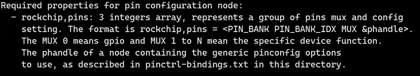
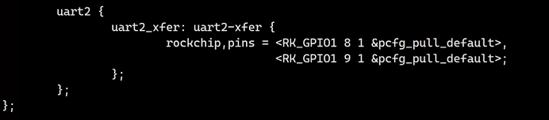
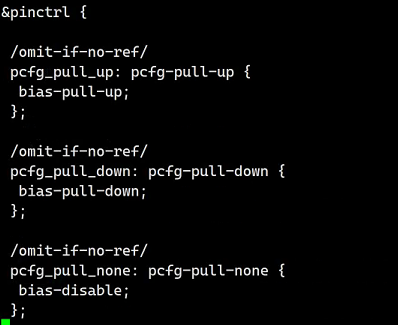
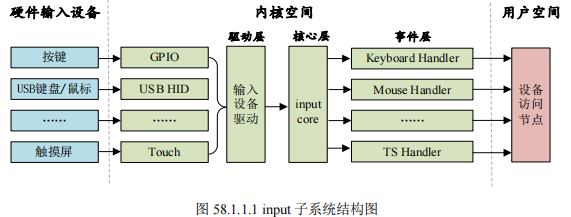
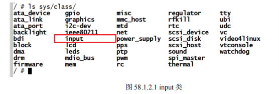
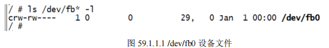

# 正点原子-Linux驱动学习

学习资料：

* `i.MX6ULL Linux阿尔法开发板 `：http://www.openedv.com/docs/boards/arm-linux/zdyz-i.mx6ull.html

* 网盘资料：
  - 配套 `Linux之Ubuntu入门篇 `视频链接： [https://pan.baidu.com/s/1uTu9-Fy2gVWSUxhoUsqZCQ ](https://pan.baidu.com/s/1uTu9-Fy2gVWSUxhoUsqZCQ)提取码：jmoz
  - 配套 `Linux之ARM裸机篇 `视频链接： [https://pan.baidu.com/s/1TjaQSuRZK0OiUCqc6S0SiQ ](https://pan.baidu.com/s/1TjaQSuRZK0OiUCqc6S0SiQ)提取码：r27n
  - 配套 `Linux之系统移植和文件系统构建篇 `视频链接： [https://pan.baidu.com/s/1vdUOu0uF8VXoLN51boJyHw ](https://pan.baidu.com/s/1vdUOu0uF8VXoLN51boJyHw)提取码：d2rz
  - 配套 `Linux之驱动开发篇 `视频链接： [https://pan.baidu.com/s/1JU95JHG-v7MKvkvXsMNhdw ](https://pan.baidu.com/s/1JU95JHG-v7MKvkvXsMNhdw)提取码：n3ju
  - 配套 `Linux之网络环境搭建篇 `视频链接： [https://pan.baidu.com/s/1K_cwr2Trq2lvWlXju8bq8Q ](https://pan.baidu.com/s/1K_cwr2Trq2lvWlXju8bq8Q)提取码：5sfw
  - 配套 `Linux之Qt5（C++）篇 `视频链接： [https://pan.baidu.com/s/1Z_AlP2M1H8R_TjIWN-Pk0g ](https://pan.baidu.com/s/1Z_AlP2M1H8R_TjIWN-Pk0g)提取码：2df1
  - 配套 `Linux之C应用开发篇 `视频链接： [https://pan.baidu.com/s/19fOMRvPaPbCokOj5vkYsxA ](https://pan.baidu.com/s/19fOMRvPaPbCokOj5vkYsxA)提取码：j5dj

## 第1讲 Linux驱动开发与裸机开发区别

## 第2讲 字符设备驱动开发基础实验

略

## 第3讲 字符设备驱动框架

### 1. 字符设备驱动框架

字符设备驱动的编写主要就是驱动对应的open、close、read等函数，其实就是file_operations结构体的成员变量的实现。

### 2. 驱动模块的加载与卸载

Linux驱动程序可以编译到kernel里面，也就是zImage，也可以编译为模块`.ko`。

编写驱动的基本流程：

* 编译驱动的时候需要用到Linux内核源码，因此需要解压缩Linux内核源码，编译Linux内核源码，得到zImage和`.dtb`。需要使用编译后得到的zImage和dtb启动系统。

* 从SD卡启动，SD卡烧写了uboot。uboot通过tftp从ubuntu里面获取zimage和dtb，rootfs也是通过nfs挂载。

* 设置bootcmd和bootargs

  ```txt
  bootargs=console=ttymxc0,115200rw root=/dev/nfs nfsroot=192.168.1.66:/home/zzk/linux/nfs/rootfs ip=192.168.1.50:192.168.1.66:192.168.1.1:255.255.255.0::eth0:off
  
  bootcmd=tftp 80800000 zImage;tftp 83000000 imx6ull-alientek emmc.dtb;bootz 80800000 - 83000000;
  ```

* 将编译出来的`.ko`文件放到根文件系统里面。加载驱动会用到加载命令；insmod、modprobe

  > 对于新的模块，使用modprobe加载的时候需要先调用一下depmo命令。

* 驱动模块加载成功后，可以使用lsmod查看一下
* 卸载模块使用rmmod命令

### 3. 字符设备的注册与注销

1. 我们需要向系统注册一个字符设备，使用函数`register_chrdev`
2. 卸载驱动的时候需要注销掉前面注册的字符设备，使用函数`unregister_chrdeb`

### 4. 设备号

1. Linux内核使用`dev_t`表示设备号

   ```c
   typedef __kernel_dev_t dev_t;
   typedef __u32 __kernel_dev_t;
   typedef unsigned int __u32;
   ```

2. Linux内核将设备号分为两部分：主设备号（前12位）和次设备号（后20位）。

3. 设备号的相关操作：

   * 获取主设备号：`MAJOR(dev_t)`
   * 获取次设备号：`MAJOR(dev_t)`
   * 构造设备号：`MKDEV(major,minor)`

### 5. `file_operations`的具体实现

`file_operations`结构体

### 6. 字符设备驱动框架搭建

### 7. 应用程序编写

Linux下一切皆文件，使用open、read、write文件操作驱动设备文件

### 8. 测试

1. 把新的驱动拷贝的开发板并加载驱动

   `modprobe chrdevbase.ko`

2. 进入/dev查看设备文件`/dev/chrdevbase`。需要先创建设备节点`mkmod /dev/chrdevbase c 200 0`

3. 测试

   `./chrdevbaseAPP /dev/chrdevbase`

### 9. chrdevbase 设备驱动的完善

添加对驱动设备的读写操作，从驱动里面读取字符串，向驱动里面写数据。

* 驱动给应用传递数据：`copy_to_user`函数
* 应用给驱动传递数据：`copy_from_user`函数

### 3. 实验

#### 实验1：第一个字符设备驱动

* 创建工程目录：

    ```txt
    cd ~/linux/IMX6ULL/Linux_Drivers
    mkdir 1_chrdevbase
    cd 1_chrdevbase
    ```

* 创建`chrdevbase.c`文件

  ​	参考代码：`linux/linux-imx-rel_imx_4.1.15_2.1.0_ga_alientek`

  ​	`TODO:4:05`

* 设置vscode的头文件路径：`TODO:19:28`

    ```txt
    {内核位置}/include
    {内核位置}/arch/arm/include
    {内核位置}/arch/arm/include/generated
    ```

	> 内核源码的位置：`第3期 系统移植和根文件系统\第3期 程序源码.rar`

* 编译：
  * `make`
  * 确认是否有生成`chrdevbase.ko`
* 测试：使用`modprobe`加载驱动

#### 实验2：添加设备号和file_operation操作

* 查看未使用的主设备号：

  ```base
  # 查看已使用的主设备号
  cat /proc/devices
  Character devices底下
  # 使用一个未在这边出现的号码
  ```

* 完善`chrdevbase.c`代码

  * 填写设备号
  * 添加`file_operations`代码
  * 添加设备的注册与注销函数

* 添加调用代码`chrdevbaseAPP.c`

  编译：

  ```base
  arm-linux-gnueabihf-gcc chrdevbaseAPP.c -o chrdevbaseAPP
  ```

#### 实验3：用户对驱动的读写

## 第4讲 嵌入式Linux LED驱动开发实验

### 1. 地址映射

1. 裸机LED灯实验就是操作6ULL的寄存器
2. Linux驱动开发也是操作寄存器，Linux不能直接对寄存器物理地址进行读写操作，因为Linux会使用MMU内存管理单元，需要获得物理地址对应的虚拟地址，然后再进行操作。
   * ioremap函数：将物理地址映射到虚拟地址。
   * iounmap函数：释放掉ioremap函数所作的映射。

### 2. 驱动程序编写

创建`2_led/led.c`文件：

1. 初始化时钟、GPIO等
2. 注册字符设备驱动
3. 注销字符设备驱动等

> 如果你烧写的是正点原子提供的linux内核，这个时候LED默认被配置为心跳灯，必须关闭心跳灯才能测试该程序。具体参考书籍：P1093

### 3. 应用程序编写

编写测试驱动的程序：`ledApp.c`

### 4. 测试

1. 加载驱动

   ```shell
   depmod	//第一次加载驱动的时候需要运行此命令
   modprobe led.ko	//加载驱动
   ```

2. 创建设备节点：

   ```shell
   mknod /dev/led c 200 0
   ```

3. 运行测试程序：

   ```shell
   ./ledApp /dev/led 1	//打开LED灯
   ./ledApp /dev/led 0	//关闭LED灯
   ```

4. 卸载命令：

   ```shell
   rmmod led.ko
   ```

## 第5讲 新字符设备驱动实验

### 1. 新的字符设备注册方法

#### 1.1 新的设备号申请和释放函数

register_chrdev 和 unregister_chrdev 这两个函数是老版本驱动使用的函数
register_chrdev 两个问题：
    a. 需要我们事先确定好哪些主设备号没有使用。
    b. 会将一个主设备号下的所有次设备号都使用掉

新的申请和释放设备号函数：

* 申请设备号：

  * 如果没有指定设备号的话就使用如下函数来申请设备号：

    ```c
    int alloc_chrdev_region(dev_t *dev, unsigned baseminor, unsigned count, const char *name)
    ```

  * 如果给定了设备的主设备号和次设备号就使用如下所示函数来注册设备号即可：

    ```c
    int register_chrdev_region(dev_t from, unsigned count, const char *name)
    ```

  * 释放设备号

    ```c
    void unregister_chrdev_region(dev_t from, unsigned count)
    ```

使用示例：

```c
/* 申请设备号 */
int major; /* 主设备号 */
int minor; /* 次设备号 */
dev_t devid; /* 设备号 */

if (major) { /* 定义了主设备号 */
    devid = MKDEV(major, 0); /* 大部分驱动次设备号都选择 0*/
    register_chrdev_region(devid, 1, "test");
} else { /* 没有定义设备号 */
    alloc_chrdev_region(&devid, 0, 1, "test"); /* 申请设备号 */
    major = MAJOR(devid); /* 获取分配号的主设备号 */
    minor = MINOR(devid); /* 获取分配号的次设备号 */
}

/*************************************************/
/* 注销设备号 */
unregister_chrdev_region(devid, 1); /* 注销设备号 */
```

#### 1.2 新的字符设备注册方法

<font color=blue>1. 字符设备结构</font>

在 Linux 中使用 cdev 结构体表示一个字符设备，cdev 结构体在 include/linux/cdev.h 文件中：

```c
struct cdev {
    struct kobject kobj;
    struct module *owner;
    const struct file_operations *ops;
    struct list_head list;
    dev_t dev;
    unsigned int count;
};
```

两个重要的成员变量：

* ops：字符设备文件操作集合函数
* dev：设备号

<font color=blue>cdev_init 函数 </font>

定义好 cdev 变量以后就要使用 cdev_init 函数对其进行初始化，cdev_init 函数原型如下：

```c
void cdev_init(struct cdev *cdev, const struct file_operations *fops)
```

<font color=blue>cdev_add 函数 </font>

cdev_add 函数用于向 Linux 系统添加字符设备(cdev 结构体变量)，首先使用 cdev_init 函数完成对 cdev 结构体变量的初始化，然后使用 cdev_add 函数向 Linux 系统添加这个字符设备。

cdev_add 函数原型如下：

```c
int cdev_add(struct cdev *p, dev_t dev, unsigned count)
```

* p：指向要添加的字符设备（cdev结构体变量）
* dev：设备所使用的设备号
* count：要添加的设备数量 

示例代码：

```c
struct cdev testcdev;

/* 设备操作函数 */
static struct file_operations test_fops = {
    .owner = THIS_MODULE,
    /* 其他具体的初始项 */
};

testcdev.owner = THIS_MODULE;
cdev_init(&testcdev, &test_fops); /* 初始化 cdev 结构体变量 */
cdev_add(&testcdev, devid, 1); /* 添加字符设备 */
```

上面就是新的注册字符设备代码段，Linux 内核中大量的字符设备驱动都是采用这种方法向 Linux 内核添加字符设备。如果在刚才分配设备号的程序，那么就它们一起实现的就是函数 register_chrdev 的功能。

<font color=blue>cdev_del 函数 </font>

卸载驱动的时候一定要使用 cdev_del 函数从 Linux 内核中删除相应的字符设备，cdev_del 函数原型如下：

```c
void cdev_del(struct cdev *p)
```

cdev_del 和 unregister_chrdev_region 这两个函数合起来的功能相当于 unregister_chrdev 函数。

### 2. 自动创建设备节点

前面的实验中，modprobe加载驱动后还需要使用命令mkmod手动创建设备节点，本节讲解驱动中实现自动创建设备节点的功能，在modprobe加载驱动时自动创建设备节点（即在/dev目录下自动创建对应的设备文件）

#### 2.1 **mdev** 机制

udev 是一个用户程序，在 Linux 下通过 udev 来实现设备文件的创建与删除，udev 可以检测系统中硬件设备状态，可以根据系统中硬件设备状态来创建或者删除设备文件。比如使用modprobe 命令成功加载驱动模块以后就自动在/dev 目录下创建对应的设备节点文件,使用rmmod 命令卸载驱动模块以后就删除掉/dev 目录下的设备节点文件。

使用 busybox 构建根文件系统的时候，busybox 会创建一个 udev 的简化版本—mdev，所以在嵌入式 Linux 中我们使用 mdev 来实现设备节点文件的自动创建与删除，Linux 系统中的热插拔事件也由 mdev 管理，在/etc/init.d/rcS 文件中如下语句：

```shell
echo /sbin/mdev > /proc/sys/kernel/hotplug
```

#### 2.2 创建和删除类

自动创建设备节点的工作是在驱动程序的入口函数中完成的，一般在 cdev_add 函数后面添加自动创建设备节点相关代码。

创建class结构体对象

```c
struct class *class_create (struct module *owner, const char *name)
```

* owner：一般为`THIS_MODULE`
* name：类的名字
* 返回值：指向结构体 class 的指针，也就是创建的类

卸载驱动程序的时候需要删除掉类，类删除函数为 class_destroy：

```c
void class_destroy(struct class *cls);
```

#### 2.3 创建设备

创建类后还需要在类下创建一个设备，device_create函数就是在类下面创建设备：

```c
struct device *device_create(struct class *class, 
						     struct device *parent,
						     dev_t devt, 
						     void *drvdata, 
						     const char *fmt, ...)
```

* class：设备要创建在哪个类下面
* parent：父设备，一般为NULL
* devt：设备号
* drvdata：设备可能会使用的一些数据，一般为NULL
* fmt：设备名字，如果设置 fmt=xxx 的话，就会生成/dev/xxx这个设备文件。
* 返回值：创建好的设备。

卸载驱动的时候需要删除掉创建的设备，设备删除函数为 device_destroy：

```c
void device_destroy(struct class *class, dev_t devt)
```

#### 2.4 示例代码

`创建/删除类和创建设备`

```c
struct class *class; /* 类 */ 
struct device *device; /* 设备 */
dev_t devid; /* 设备号 */ 

/* 驱动入口函数 */
static int __init led_init(void)
{
    /* 创建类 */
    class = class_create(THIS_MODULE, "xxx");
    /* 创建设备 */
    device = device_create(class, NULL, devid, NULL, "xxx");
    return 0;
}

/* 驱动出口函数 */
static void __exit led_exit(void)
{
    /* 删除设备 */
    device_destroy(newchrled.class, newchrled.devid);
    /* 删除类 */
    class_destroy(newchrled.class);
}

module_init(led_init);
module_exit(led_exit);
```

### 3. 设置文件私有数据

每个硬件设备都有一些属性，比如主设备号(dev_t)，类(class)、设备(device)、开关状态(state)等等，在编写驱动的时候你可以将这些属性全部写成变量的形式，如下所示：

```c
dev_t devid; /* 设备号 */
struct cdev cdev; /* cdev */
struct class *class; /* 类 */
struct device *device; /* 设备 */
int major; /* 主设备号 */
int minor; /* 次设备号 */
```

这样比较杂乱，最好写成结构体更整洁，并且编写驱动 open 函数的时候将设备结构体作为私有数据添加到设备文件中。

在 open 函数里面设置好私有数据以后，在 write、read、close 等函数中直接读取 private_data即可得到设备结构体。

示例代码：`设备结构体作为私有数据`

```c
struct test_dev{
    dev_t devid; /* 设备号 */
    struct cdev cdev; /* cdev */
    struct class *class; /* 类 */
    struct device *device; /* 设备 */
    int major; /* 主设备号 */
    int minor; /* 次设备号 */
};

struct test_dev testdev;

/* open 函数 */
static int test_open(struct inode *inode, struct file *filp)
{
    filp->private_data = &testdev; /* 设置私有数据 */
    return 0;
}
```

### 4. 实验：使用新的字符设备驱动

参考示例代码：`3_newchrled`

三个文件：

* `newchrled.c`
* `ledApp.c`
* `Makefile`

测试：

把编译出来的`newchrled.ko`和`ledApp`拷贝到开发板

加载驱动模块：

```shell
depmod	//第一次加载驱动的时候需要运行此命令
modprobe newchrled.ko //加载驱动
```

驱动加载成功以后会输出申请到的主设备号和次设备号

驱动加载成功以后会自动在/dev 目录下创建设备节点文件/dev/newchrdev

测试开关灯：

```shell
./ledApp /dev/newchrled 1 //打开 LED 灯
./ledApp /dev/newchrled 0 //关闭 LED 灯
```

卸载驱动：

```shell
rmmod newchrled.ko
```


## 第45章 pinctrl和gpio子系统实验

linux内核提供了pinctrl和gpio子系统用于GPIO驱动

### 45.1 pinctrl 子系统

pinctrl子系统主要工作内容：
1. 获取设备树中pin信息
2. 根据获取到的pin信息来设置pin的复用功能
3. 根据获取到的pin信息来设置pin的电气特性，比如上/下拉、速度、驱动能力等

#### 45.1.1 I.MX6ULL 的pinctrl 子系统驱动

##### 1. PIN 配置信息详解

一般会在设备树里面创建一个节点来描述PIN的配置信息。

打开`imx6ull.dsi`文件，找到一个iomuxc的节点：

```c
iomuxc: iomuxc@020e0000 {
    compatible = "fsl,imx6ul-iomuxc";
    reg = <0x020e0000 0x4000>;
};
```

打开`imx6ull-alientek-emmc.dts`，里面有对`iomuxc`节点追加的数据：

```c
&iomuxc {
pinctrl-names = "default";
pinctrl-0 = <&pinctrl_hog_1>;
imx6ul-evk {
        pinctrl_hog_1: hoggrp-1 {
            fsl,pins = <
            MX6UL_PAD_UART1_RTS_B__GPIO1_IO19 0x17059
            MX6UL_PAD_GPIO1_IO05__USDHC1_VSELECT 0x17059
            MX6UL_PAD_GPIO1_IO09__GPIO1_IO09 0x17059
            MX6UL_PAD_GPIO1_IO00__ANATOP_OTG1_ID 0x13058
            >;
        };
        ..
        pinctrl_flexcan1: flexcan1grp{
            fsl,pins = <
            MX6UL_PAD_UART3_RTS_B__FLEXCAN1_RX 0x1b020
            MX6UL_PAD_UART3_CTS_B__FLEXCAN1_TX 0x1b020
            >;
        };
        ..
        pinctrl_wdog: wdoggrp {
            fsl,pins = <
            MX6UL_PAD_LCD_RESET__WDOG1_WDOG_ANY 0x30b0
            >;
        };
    };
};
```

* `pinctrl_hog_1` 子节点是和热插拔有关的 PIN 集合
* `pinctrl_flexcan1` 子节点是flexcan1这个外设所使用的PIN

* `pinctrl_wdog` 子节点是wdog外设所使用的PIN

<font color=blue>如何添加PIN的配置信息：</font>

以`pinctrl_hog_1`子节点的PIN配置信息为例

```c
MX6UL_PAD_UART1_RTS_B__GPIO1_IO19 0x17059
```

`UART1_RTS_B`这个PIN是SD卡是否插入的检测引脚。

* `MX6UL_PAD_UART1_RTS_B__GPIO1_IO19`的宏定义在`arch/arm/boot/dts/imx6ul-pinfunc.h`

  ```c
  #define MX6UL_PAD_UART1_RTS_B__GPIO1_IO19 0x0090 0x031C 0x0000 0x5 0x0
  ```

  这5个值代标的意思是 `mux_reg conf_reg input_reg mux_mode input_val`

* `0x17059`：对应`config_reg`寄存器值，此值由用户自行设置，通过此值来设置IO的上/下拉、驱动能力和速度等。

##### 2. PIN驱动程序讲解

寄存器和寄存器值配置好后，Linux内核的驱动文件就会根据这些值来做相应的初始化。

通过iomuxc节点的compatible属性的值找到对应的驱动文件`drivers/pinctrl/freescale/pinctrl-imx6ul.c`

下面列出`probe`函数（设备和驱动匹配成功后会执行的函数）

```c
static int imx6ul_pinctrl_probe(struct platform_device *pdev)
{
	const struct of_device_id *match;
	struct imx_pinctrl_soc_info *pinctrl_info;

	match = of_match_device(imx6ul_pinctrl_of_match, &pdev->dev);

	if (!match)
		return -ENODEV;

	pinctrl_info = (struct imx_pinctrl_soc_info *) match->data;

	return imx_pinctrl_probe(pdev, pinctrl_info);
}
```

该函数是`I.MX6ULL`这个SOC的PIN配置入口函数。以此为入口的函数调用路径：


<font color=blue>`imx_pinctrl_parse_groups`函数：</font>

该函数负责获取设备树中关于PIN的配置信息，也就是前面分析的6个u32类型的值。

```c
static int imx_pinctrl_parse_groups(struct device_node *np,
							struct imx_pin_group *grp,
							struct imx_pinctrl_soc_info *info,
							u32 index)
{
	int size, pin_size;
	const __be32 *list;
	int i;
	u32 config;
	......
	
	for (i = 0; i < grp->npins; i++) {
		u32 mux_reg = be32_to_cpu(*list++);
		u32 conf_reg;
		unsigned int pin_id;
		struct imx_pin_reg *pin_reg;
		struct imx_pin *pin = &grp->pins[i];
		
		......
		
		pin_id = (mux_reg != -1) ? mux_reg / 4 : conf_reg / 4;
		pin_reg = &info->pin_regs[pin_id];
		pin->pin = pin_id;
		grp->pin_ids[i] = pin_id;
		pin_reg->mux_reg = mux_reg;
		pin_reg->conf_reg = conf_reg;
		pin->input_reg = be32_to_cpu(*list++);
		pin->mux_mode = be32_to_cpu(*list++);
		pin->input_val = be32_to_cpu(*list++);
		
		/* SION bit is in mux register */
		config = be32_to_cpu(*list++);
		if (config & IMX_PAD_SION)
		pin->mux_mode |= IOMUXC_CONFIG_SION;
		pin->config = config & ~IMX_PAD_SION;
		......
	}
	
	return 0;
} 
```

设备树中的 mux_reg 和 conf_reg 值会保存在 info 参数中，input_reg、 mux_mode、input_val 和 config 值会保存在 grp 参数中。

<font color=blue>`pinctrl_register`函数</font>

```c
struct pinctrl_dev *pinctrl_register(struct pinctrl_desc *pctldesc,
 		struct device *dev,
		void *driver_data)
```

pctldesc参数是要注册的PIN控制器，用于配置SOC的PIN复用功能和电气特性。

```c
struct pinctrl_desc {
	const char *name;
	struct pinctrl_pin_desc const *pins;
	unsigned int npins;
	const struct pinctrl_ops *pctlops;
	const struct pinmux_ops *pmxops;
	const struct pinconf_ops *confops;
	struct module *owner;
	#ifdef CONFIG_GENERIC_PINCONF
	unsigned int num_custom_params;
	const struct pinconf_generic_params *custom_params;
	const struct pin_config_item *custom_conf_items;
	#endif
};
```

三个`_ops`结构体指针非常重要，因为这三个结构体就是 PIN 控制器的工具，这三个结构体里面包含了很多操作函数，通过这些操作函数就可以完成对某一个PIN 的配置。

`pinctrl_desc`结构体由半导体厂商提供。

该结构体在`imx_pinctrl_probe`函数中的使用：

```c
int imx_pinctrl_probe(struct platform_device *pdev,
struct imx_pinctrl_soc_info *info)
{
	struct device_node *dev_np = pdev->dev.of_node;
	struct device_node *np;
	struct imx_pinctrl *ipctl;
	struct resource *res;
	struct pinctrl_desc *imx_pinctrl_desc;
	......
	imx_pinctrl_desc = devm_kzalloc(&pdev->dev,
	sizeof(*imx_pinctrl_desc),
	GFP_KERNEL);
	if (!imx_pinctrl_desc)
		return -ENOMEM;
	......
	
	imx_pinctrl_desc->name = dev_name(&pdev->dev);
	imx_pinctrl_desc->pins = info->pins;
	imx_pinctrl_desc->npins = info->npins;
	imx_pinctrl_desc->pctlops = &imx_pctrl_ops;
	imx_pinctrl_desc->pmxops = &imx_pmx_ops;
	imx_pinctrl_desc->confops = &imx_pinconf_ops;
	imx_pinctrl_desc->owner = THIS_MODULE;
	......
	ipctl->pctl = pinctrl_register(imx_pinctrl_desc, &pdev->dev,
	ipctl);
	......
}
```

调用函数`pinctrl_register`向Linux内核注册`imx_pinctrl_desc`，注册以后Linux内核就有了对`I.MX6ULL`的PIN进行配置的工具。

`imx_pctrl_ops`、`imx_pmx_ops` 和 `imx_pinconf_ops` 这三个结构体定义如下

```c
static const struct pinctrl_ops imx_pctrl_ops = {
	.get_groups_count = imx_get_groups_count,
	.get_group_name = imx_get_group_name,
	.get_group_pins = imx_get_group_pins,
	.pin_dbg_show = imx_pin_dbg_show,
	.dt_node_to_map = imx_dt_node_to_map,
	.dt_free_map = imx_dt_free_map,
	
};
......
static const struct pinmux_ops imx_pmx_ops = {
	.get_functions_count = imx_pmx_get_funcs_count,
	.get_function_name = imx_pmx_get_func_name,
	.get_function_groups = imx_pmx_get_groups,
	.set_mux = imx_pmx_set,
	.gpio_request_enable = imx_pmx_gpio_request_enable,
	.gpio_set_direction = imx_pmx_gpio_set_direction,
};
......
static const struct pinconf_ops imx_pinconf_ops = {
	.pin_config_get = imx_pinconf_get,
	.pin_config_set = imx_pinconf_set,
	.pin_config_dbg_show = imx_pinconf_dbg_show,
	.pin_config_group_dbg_show = imx_pinconf_group_dbg_show,
};
```

这三个结构体下的所有函数就是`I.MX6ULL`的PIN配置函数。

#### 45.1.2 设备树中添加pinctrl节点模板

示例：在设备树中添加某个外设的PIN信息。

关于`I.MX`系列SOC的pinctrl设备树绑定信息可用参考文档`Documentation/devicetree/bindings/pinctrl/fsl,imx-pinctrl.txt`

虚拟一个名为“test”的设 备，test 使用了 `GPIO1_IO00` 这个 PIN 的 GPIO 功能，pinctrl 节点添加过程如下：

打开 `imx6ull-alientek-emmc.dts`，在 iomuxc 节点中的`imx6ul-evk`子节点下添加`pinctrl_test`节点：

步骤：

1. 添加`pinctrl_test`节点
2. 添加`fsl,pins`属性
3. 在`fsl.pins`属性中添加PIN配置信息

```c
pinctrl_test: testgrp {
	fsl,pins = <
		MX6UL_PAD_GPIO1_IO00__GPIO1_IO00 config /*config 是具体设置值*/
	>;
};
```

### 45.2 GPIO子系统

如果pinctrl子系统将一个PIN复用为GPIO的话，那么接下来就要用到gpio子系统了。

gpio 子系统: 

* 用于初始化 GPIO 并且提供相应的 API 函数
* gpio 子系统的主要目的就是方便驱动开发者使用 gpio，驱动开发者在设备树中添加 gpio 相关信息，然后就可以在驱动程序中使用 gpio 子系统提供的 API函数来操作 GPIO

#### 45.2.1 `I.MX6ULL`的gpio子系统驱动

##### 1. 设备树中的gpio信息

上一小节已经使用pinctrl子系统把`UART_RST_B`这个PIN复用为`GPIO_IO19`，并且设置了电气属性。

那么SD卡驱动怎么知道CD引脚（SD卡插入检测引脚）连接的`GPIO_IO19`呢？这个需要设备树来告诉驱动。

SD 卡连接在 `I.MX6ULL` 的 usdhc1 接口上，在 `imx6ull-alientek-emmc.dts` 中找到名为“usdhc1”的节点，这个节点就是SD卡设备节点，如下所示：

```c
						示例代码 45.2.2.2 设备树中 SD 卡节点
&usdhc1 {
	pinctrl-names = "default", "state_100mhz", "state_200mhz";
	pinctrl-0 = <&pinctrl_usdhc1>;
	pinctrl-1 = <&pinctrl_usdhc1_100mhz>;
	pinctrl-2 = <&pinctrl_usdhc1_200mhz>;
	/* pinctrl-3 = <&pinctrl_hog_1>; */
	cd-gpios = <&gpio1 19 GPIO_ACTIVE_LOW>;
	keep-power-in-suspend;
	enable-sdio-wakeup;
	vmmc-supply = <&reg_sd1_vmmc>;
	status = "okay";
};
```

* usbhc1节点作为SD卡设备总结点，需要描述SD卡所有的信息，因为驱动需要使用。
* `/* pinctrl-3 = <&pinctrl_hog_1>; */`
  * 该行是作者添加的，本行描述SD卡的CD引脚pinctrl信息所在的子节点。
  * 本行被注释掉了，说明我们没有在这边描述CD引脚的pinctrl信息，因为我们已经在`iomuxc`节点下引用了`pinctrl_hog_1`这个节点，所以 Linux 内核中的 iomuxc 驱动就会自动初始化 pinctrl_hog_1 节点下的所有 PIN。
  * 属性`cd-gpios`：描述了SD卡的CD引脚使用的哪个IO。该属性值一共有3个：
    * `&gpio1`：表示CD引脚所使用的IO属于GPIO1组
    * `19`：表示GPIO1组的第19号IO
    * `GPIO_ACTIVE_LOW`：表示低电平有效

根据上面这些信息，SD 卡驱动程序就可以使用 `GPIO1_IO19` 来检测 SD 卡的 CD 信号了。

打开`imx6ull.dtsi`，找到里面的内容：

```c
gpio1: gpio@0209c000 {
	compatible = "fsl,imx6ul-gpio", "fsl,imx35-gpio";
	reg = <0x0209c000 0x4000>;
	interrupts = <GIC_SPI 66 IRQ_TYPE_LEVEL_HIGH>,
	<GIC_SPI 67 IRQ_TYPE_LEVEL_HIGH>;
	gpio-controller;
	#gpio-cells = <2>;
	interrupt-controller;
	#interrupt-cells = <2>;
};
```

* gpio1节点信息描述了GPIO1控制器的所有信息，重点就是GPIO1外设寄存器基地址以及兼容属性。关于I.MX系列SOC的GPIO控制器绑定信息请查看文档`Documentation/devicetree/bindings/gpio/fsl-imx-gpio.txt`。

* reg属性：

  reg 属性设置了GPIO1控制器的寄存器基地址为`0X0209C000`。

  打开参考手册可用找到对应的寄存器地址表：

  

* `gpio-controller`表示 gpio1 节点是个 GPIO 控制器

* `#gpio-cells`属性和`#address-cells`类似，`#gpio-cells`应该为 2，表示一共有两个cell：

  * 第一个cell为GPIO编号，比如`&gpio1 3`就表示`GPIO1_IO03`。
  * 第二个cell表示GPIO极性，如果为`0(GPIO_ACTIVE_HIGH)`的话表示高电平有效，如果为`1(GPIO_ACTIVE_LOW)`的话表示低电平有效。

##### 2. GPIO驱动程序简介

通过gpio1节点的compatible属性找到对应GPIO的驱动文件`drivers/gpio/gpio-mxc.c`

重点查看`mxc_gpio_probe`这个函数

```c
				示例代码 45.2.2.5 mxc_gpio_probe 函数
static int mxc_gpio_probe(struct platform_device *pdev)
{
	struct device_node *np = pdev->dev.of_node;
	struct mxc_gpio_port *port;
	struct resource *iores;
	int irq_base;
	int err;

	mxc_gpio_get_hw(pdev);

	port = devm_kzalloc(&pdev->dev, sizeof(*port), GFP_KERNEL);
	if (!port)
		return -ENOMEM;

	iores = platform_get_resource(pdev, IORESOURCE_MEM, 0);
	port->base = devm_ioremap_resource(&pdev->dev, iores);
	if (IS_ERR(port->base))
	return PTR_ERR(port->base);

	port->irq_high = platform_get_irq(pdev, 1);
	port->irq = platform_get_irq(pdev, 0);
	if (port->irq < 0)
		return port->irq;

	/* disable the interrupt and clear the status */
	writel(0, port->base + GPIO_IMR);
	writel(~0, port->base + GPIO_ISR);

	if (mxc_gpio_hwtype == IMX21_GPIO) {
		/*
		* Setup one handler for all GPIO interrupts. Actually
		* setting the handler is needed only once, but doing it for
		* every port is more robust and easier.
		*/
		irq_set_chained_handler(port->irq, mx2_gpio_irq_handler);
	} else {
		/* setup one handler for each entry */
		irq_set_chained_handler(port->irq, mx3_gpio_irq_handler);
		irq_set_handler_data(port->irq, port);
		if (port->irq_high > 0) {
			/* setup handler for GPIO 16 to 31 */
			irq_set_chained_handler(port->irq_high,
			mx3_gpio_irq_handler);
			irq_set_handler_data(port->irq_high, port);
		}
	}

	err = bgpio_init(&port->bgc, &pdev->dev, 4,
	port->base + GPIO_PSR,
	port->base + GPIO_DR, NULL,
	port->base + GPIO_GDIR, NULL, 0);
	if (err)
	goto out_bgio;

	port->bgc.gc.to_irq = mxc_gpio_to_irq;
	port->bgc.gc.base = (pdev->id < 0) ? of_alias_get_id(np, "gpio")
	* 32 : pdev->id * 32;

	err = gpiochip_add(&port->bgc.gc);
	if (err)
	goto out_bgpio_remove;

	irq_base = irq_alloc_descs(-1, 0, 32, numa_node_id());
	if (irq_base < 0) {
		err = irq_base;
		goto out_gpiochip_remove;
	}

	port->domain = irq_domain_add_legacy(np, 32, irq_base, 0,
	&irq_domain_simple_ops, NULL);
	if (!port->domain) {
		err = -ENODEV;
		goto out_irqdesc_free;
	}

	/* gpio-mxc can be a generic irq chip */
	mxc_gpio_init_gc(port, irq_base);

	list_add_tail(&port->node, &mxc_gpio_ports);

	return 0;
	......
}
```

* `struct mxc_gpio_port *port;`

  * 结构体类型`mxc_gpio_port`就是对`I.MX6ULL` GPIO的抽象

    ```c
    			示例代码 45.2.2.6 mxc_gpio_port 结构体
    struct mxc_gpio_port {
    	struct list_head node;
    	void __iomem *base;
    	int irq;
    	int irq_high;
    	struct irq_domain *domain;
    	struct bgpio_chip bgc;
    	u32 both_edges;
    };
    ```

* `mxc_gpio_get_hw(pdev);`函数获取gpio的硬件相关数据，其实就是gpio的寄存器组。

  ```c
  			示例代码 45.2.2.7 mxc_gpio_get_hw 函数
  static void mxc_gpio_get_hw(struct platform_device *pdev)
  {
  	const struct of_device_id *of_id =
  	of_match_device(mxc_gpio_dt_ids, &pdev->dev);
  	enum mxc_gpio_hwtype hwtype;
  	......
  	if (hwtype == IMX35_GPIO)
  		mxc_gpio_hwdata = &imx35_gpio_hwdata;
  	else if (hwtype == IMX31_GPIO)
  		mxc_gpio_hwdata = &imx31_gpio_hwdata;
  	else
  		mxc_gpio_hwdata = &imx1_imx21_gpio_hwdata;
  
  	mxc_gpio_hwtype = hwtype;
  }
  ```

  `imx35_gpio_hwdata`结构体变量

  ```c
  static struct mxc_gpio_hwdata imx35_gpio_hwdata = {
  	.dr_reg = 0x00,
  	.gdir_reg = 0x04,
  	.psr_reg = 0x08,
  	.icr1_reg = 0x0c,
  	.icr2_reg = 0x10,
  	.imr_reg = 0x14,
  	.isr_reg = 0x18,
  	.edge_sel_reg = 0x1c,
  	.low_level = 0x00,
  	.high_level = 0x01,
  	.rise_edge = 0x02,
  	.fall_edge = 0x03,
  };
  ```

  `mxc_gpio_hwdata`是个全局变量，配合GPIO1控制器里面的寄存器基地址，就可用访问相应的寄存器了。

* `bgc_init`函数第一个参数为bgc，是`bgpio_chip`结构体指针。该结构体有个类型为`gpio_chip`的gc成员变量，`gpio_chip`是抽象出来的GPIO控制器，该结构体如下：

  ```c
  struct gpio_chip {
  	const char *label;
  	struct device *dev;
  	struct module *owner;
  	struct list_head list;
  
  	int (*request)(struct gpio_chip *chip,
  	unsigned offset);
  	void (*free)(struct gpio_chip *chip,
  	unsigned offset);
  	int (*get_direction)(struct gpio_chip *chip,
  	unsigned offset);
  	int (*direction_input)(struct gpio_chip *chip,
  	unsigned offset);
  	int (*direction_output)(struct gpio_chip *chip,
  	unsigned offset, int value);
  	int (*get)(struct gpio_chip *chip,
  	unsigned offset);
  	void (*set)(struct gpio_chip *chip,
  	unsigned offset, int value);
  	......
  };
  ```

  `bgpio_init` 函数主要任务就是初始化`bgc->gc`。`bgpio_init`里面有三个setup函数：`bgpio_setup_io`、`bgpio_setup_accessors`、`bgpio_setup_direction`，这三个函数就是用来初始化`bgc->gc`的各种有关gpio的操作，比如输入输出等。`GPIO_PSR`、`GPIO_DR` 和 `GPIO_GDIR` 都是 `I.MX6ULL` 的GPIO寄存器。这些寄存器地址会赋值给bgc参数的`reg_dat`、`reg_set`、`reg_clr`和`reg_dir`这些成员变量。

  至此，bgc既有了对GPIO的操作函数，又有了`I.MX6ULL`有关GPIO的寄存器，那么只要得到bgc就可以对 `I.MX6ULL`的GPIO进行操作。

* 函数`gpiochip_add`向Linux内核注册`gpio_chip`， 也就是`port->bgc.gc`。注册完成以后我们就可以在驱动中使用`gpiolib`提供的各个API函数。

#### 45.2.2 gpio子系统API函数

对于驱动开发人员，设置好设备树以后就可以使用gpio子系统提供的API函数来操作指定的GPIO。

1、`gpio_request` 函数

2、`gpio_free` 函数

3、`gpio_direction_input` 函数

4、`gpio_direction_output` 函数

5、`gpio_get_value` 函数

6、`gpio_set_value` 函数

#### 45.2.3 设备树中添加gpio节点模板

继续完成上一节的test设备，上一节我们已经讲解了如何创建test设备的pinctrl节点。

```c
pinctrl_test: testgrp {
    fsl,pins = <
    MX6UL_PAD_GPIO1_IO00__GPIO1_IO00 config /*config 是具体设置值*/
    >;
};
```

本节来学习如何创建test设备的GPIO节点。

在test节点中添加GPIO属性信息，表面test所使用的GPIO是哪个引脚：

```c
test {
	pinctrl-names = "default";
	pinctrl-0 = <&pinctrl_test>;
	gpio = <&gpio1 0 GPIO_ACTIVE_LOW>;
};
```

#### 45.2.4 与gpio相关的OF函数

前面我们定义了一个名为“gpio”的属性，gpio 属性描述了 test 这个设备所使用的 GPIO。在驱动程序中需要读取 gpio 属性内容，Linux 内核提供了几个与 GPIO 有关的 OF 函数，常用的几个 OF 函数如下所示：

1、`of_gpio_named_count` 函数

2、`of_gpio_count` 函数

3、`of_get_named_gpio` 函数

### 45.3 泰山派说明

#### 1. pinctrl子系统配置

pinctrl子系统的配置可以参考说明：`kernel/Documentation/devicetree/bindings/pinctrl/rockchip\,pinctrl.txt`





> 引脚相关的宏定义在`kernel/include/dt-bindings/pinctrl/rockchip.h`中

* `PIN_BANK`：引脚所属的组，如：`RK_GPIO3`

* `PIN_BAK_IDX`：引脚的索引号，如：`RK_PB4`

* `MUX`：引脚的复用功能，如：`RK_FUNC_GPIO`

* `&phandle`：电器属性，如：`pcfg_pull_none`无上下拉，可在`kernel/arch/arm64/boot/dts/rockchip/.tspi-rk3566-user-v10-linux.dtb.dts.tmp`中查看

  

#### 2. 实验流程

实验内容：

通过引脚`GPIO3_B4`控制led灯的亮灭

1. 通过pinctrl子系统设置引脚复用为GPIO
2. 通过gpio子系统提供gpio操作函数
3. 在驱动中获取设备树上的gpio信息，控制led灯的亮灭

使用gpio前，先检查该引脚是否已经被使用，避免冲突：

* 检查pinctrl设置
* 如果这个PIN配置为了GPIO，检查这个GPIO有没有被其他外设使用

**实验流程：**

<font color=blue>1. 添加pinctrl信息</font>

在设备树的`&pinctrl`下追加节点`pinctrl_myled`

> 文件在`kernel/arch/arm64/boot/dts/rockchip/rk3568-pinctrl.dtsi`

```dtsi
&pinctrl {
    pinctrl_myled: pinctrl-myled{
        rockchip,pins = 
            <3 RK_PB4 RK_FUNC_GPIO &pcfg_pull_none>,
    };
};
```

<font color=blue>2. 添加gpio信息</font>

>  文件在`kernel/arch/arm64/boot/dts/rockchip/tsp-rk3566-user-v10-linux.dts`

```dts
/{
    myLed: myled {
        compatible = "big_m,led";
        #address-cells = <1>;
        #size-cells = <1>;
        pinctrl-names = "default";
        pinctrl-0 = <&pinctrl_myled>;
        myled-gpio = <&gpio3 RK_PB4 GPIO_ACTIVE_HIGH>;
        status = "okay";
    };
}
```

<font color=blue>3. 编译设备树，并烧写到开发板</font>

启动内核查看`/proc/device-tree`是否存在`myled`节点

<font color=blue>4. 编写驱动</font>

下面列出主要的流程：

1. 获取设备节点信息、申请gpio资源并设置gpio为输出低电平

    ```c
        /* 1. 获取设备节点 */
        dtsled.nd = of_find_node_by_path(LED_NODE_PATH);
        if(dtsled.nd == NULL) {
            printk("node can not found!\r\n");
            return -EINVAL;
        } else {
            printk("node has been found!\r\n");
        }

        /* 获取gpio编号 */
        gpionum = of_get_named_gpio(dtsled.nd, LED_NODE_PROPERTY_GPIO, 0);
        if(gpionum < 0) {
            printk("get property %s failed!\r\n", LED_NODE_PROPERTY_GPIO);
            return -EINVAL;
        }
        printk("gpionum:%d\r\n", gpionum);

        /* 初始化LED */
        /* 申请GPIO */
        if(gpio_request(gpionum, NULL)) {
            printk("request gpio failed!\r\n");
            return -EINVAL;
        }

        /* 设置GPIO为输出: 默认为低电平 led灯灭 */
        if(gpio_direction_output(gpionum, 0)) {
            printk("set gpio direction failed!\r\n");
            return -EINVAL;
        }
    ```

2. 通过`gpio_set_value`函数来设置gpio的输出电平

   ```c
   void led_switch(u8 sta)
   {
       // u32 val = 0;
       if(sta == LEDON) {
           gpio_set_value(gpionum, 1); //设置高电平
       } else if(sta == LEDOFF) {
           gpio_set_value(gpionum, 0); //设置低电平
       }
   }
   ```

   

## 第54章 platform 设备驱动实验

linux系统考虑到驱动的可重用性，提出了驱动的分离与分层的软件设计思路，在这个思路下诞生了platform设备驱动（平台设备驱动）。

本章学习：

* Linux下的驱动分离与分层
* platform框架下的设备驱动如何编写

### 54.1 linux 驱动的分隔与分离

#### 54.1.1 驱动的分离与分隔

假如现在有三个平台A、B和C，这三个平台（平台指SOC）上都有MPU6050这个I2C接口的六轴传感器，按照平常写裸机I2C驱动的思路，每个平台都有一个MPU6050的驱动，因此编写出来最简单的驱动框架如下所示：


如上图所示，每种平台下都有一个主机驱动和设备驱动，主机驱动是必须要的，毕竟不同的平台其I2C控制器不同，但是右侧的设备驱动就没必要每个平台都写一个，因为不管对于哪个SOC来说，MPU6050都是一样通过I2C接口来读写，只需要一个MPU6050的驱动程序即可。

如果再来几个I2C设备，比如AT24C2、FT5206（电容触摸屏）等，如果按照上图的写法，那么设备端的驱动要重复写好几次，显然这种做法是不推荐的。

最好的做法是：每个平台的I2C控制器都提供一个统一的接口（也叫做主机驱动），每个设备的话也只提供一个驱动程序（设备驱动），每个设备通过统一的I2C接口驱动来访问，这样就可以大大简化驱动文件，改进后的设备驱动框架如下图所示：


实际的I2C驱动设备肯定有很多种，不止MPU6050这一个，那么实际的驱动框架如下图所示：


这个就是驱动的分隔，也就是将主机驱动和设备驱动分隔开来，比如I2C、SPI等等都会采用驱动分隔的方式来简化驱动的开发。

在实际的开发中：

* 一般I2C主机驱动已经由半导体厂家编写好了
* 设备驱动一般由设备器件的厂家编写好了
* 我们只需要提供设备信息即可，比如I2C设备的话，提供设备连接到哪个I2C接口上，I2C的速度是多少等等。

相当于将设备信息从设备驱动中剥离开来，驱动使用标准方法去获取到设备信息（比如从设备树中获取到设备信息），然后根据获取到的设备信息来初始化设备。这样就相当于驱动只负责驱动，设备只负责设备，想办法将两者进行匹配即可。

这个就是Linux中的总线（bus）、驱动（driver）和设备（device）模型，也就是常说的驱动分离。总线就是驱动和设备信息的月老，负责给两者牵线搭桥，如下图所示：


当我们向系统注册一个驱动的时候，总线会在右侧的设备中查找有没有与之匹配的设备，如果有的话就将两者联系起来。同样的，当向总线注册一个设备的时候，总线会在左侧的驱动中查找有没有与之匹配的设备，有的话也联系起来。

#### 54.1.2 驱动的分层

Linux下的驱动往往也是分层的，目的是为了在不同的层处理不同的内容。

以input（输入子系统）为例，简单介绍下驱动的分层：

* input子系统负责管理所有跟输入有关的驱动，包括键盘、鼠标、触摸等，最底层的就是设备原始驱动，负责获取输入设备的原始值，获取到的输入事件上报给input核心层。
* input核心层会处理各种IO模型，并提供`file_operators`操作集合。
* 我们在编写输入设备驱动的时候只需要处理好输入事件的上报即可，至于如何这些上报的输入事件是上层考虑的事情，我们不需要管。

可以看出借助分层模型可以极大的简化驱动的编写。

### 54.2 platform 平台驱动模型简介

为了设备驱动的分离，引出了总线、驱动和设备模型，像I2C、SPI、USB有总线的概念，但是有些外设是没有总线这个概念的，但是又要使用总线、驱动和设备模型该怎么办？为了解决该问题，Linux提出了platform这个虚拟总线，相应的就有`platform_driver`和`platform_device`。

#### 54.2.1 platform 总线

Linux系统内核使用`bus_type`结构体表示总线，该结构体定义在`include/linux/device.h`中

```c
			示例代码 54.2.1.1 bus_type 结构体代码段
struct bus_type {
    const char *name; /* 总线名字 */
    const char *dev_name; 
    struct device *dev_root;
    struct device_attribute *dev_attrs;
    const struct attribute_group **bus_groups; /* 总线属性 */
    const struct attribute_group **dev_groups; /* 设备属性 */
    const struct attribute_group **drv_groups; /* 驱动属性 */

    int (*match)(struct device *dev, struct device_driver *drv);
    int (*uevent)(struct device *dev, struct kobj_uevent_env *env);
    int (*probe)(struct device *dev);
    int (*remove)(struct device *dev);
    void (*shutdown)(struct device *dev);

    int (*online)(struct device *dev);
    int (*offline)(struct device *dev);
    int (*suspend)(struct device *dev, pm_message_t state);
    int (*resume)(struct device *dev);
    const struct dev_pm_ops *pm;
    const struct iommu_ops *iommu_ops;
    struct subsys_private *p;
    struct lock_class_key lock_key;
};
```

match函数用来完成设备和驱动之间的匹配，每一条总线都必须实现此函数。

platform总线是`bus_type`的一个具体实例，定义在`drivers/base/platform.c`中

```c
        示例代码 54.2.1.2 platform 总线实例
struct bus_type platform_bus_type = {
    .name = "platform",
    .dev_groups = platform_dev_groups,
    .match = platform_match,
    .uevent = platform_uevent,
    .pm = &platform_dev_pm_ops,
};
```

`platform_bus_type` 就是 platform 平台总线
`platform_match` 就是匹配函数，定义在文件 `drivers/base/platform.c`

```c
    	示例代码 54.2.1.3 platform_match 匹配函数
static int platform_match(struct device *dev,
  struct device_driver *drv)
{
    struct platform_device *pdev = to_platform_device(dev);
    struct platform_driver *pdrv = to_platform_driver(drv);

    /*When driver_override is set,only bind to the matching driver*/
    if (pdev->driver_override)
    return !strcmp(pdev->driver_override, drv->name);

    /* Attempt an OF style match first */
    if (of_driver_match_device(dev, drv))
    return 1;

    /* Then try ACPI style match */
    if (acpi_driver_match_device(dev, drv))
    return 1;
    /* Then try to match against the id table */
    if (pdrv->id_table)
    return platform_match_id(pdrv->id_table, pdev) != NULL;

    /* fall-back to driver name match */
    return (strcmp(pdev->name, drv->name) == 0);
}
```

#### 54.2.2 platform 驱动

##### 1. `platform_driver`结构体

`platform_driver` 结构体表示 platform 驱动 `include/linux/platform_device.h`

```c
		示例代码 54.2.2.1 platform_driver 结构体
struct platform_driver {
	int (*probe)(struct platform_device *);
	int (*remove)(struct platform_device *);
	void (*shutdown)(struct platform_device *);
	int (*suspend)(struct platform_device *, pm_message_t state);
	int (*resume)(struct platform_device *);
	struct device_driver driver;
	const struct platform_device_id *id_table;
	bool prevent_deferred_probe;
 };
```

* `probe`函数：当驱动与设备匹配成功以后`probe`函数就会执行，一般驱动的提供者会编写，如果自己要实现一个全新的驱动，那么该函数要自己实现。
* `driver`成员：为`device_driver`结构体变量，`device_driver`相当于基类，提供了最基础的驱动框架，`platform_deriver`继承了这个基类，然后在次基础上又添加了一些特有的成员变量。
* `id_table`表：总线中match函数匹配驱动和设备的时候采用的第三种方法。

##### 2. `deivce_driver`结构体

`device_driver`结构体定义在`include/linux/device.h`中：

```c
	示例代码 54.2.2.3 device_driver 结构体
struct device_driver {
	const char *name;
	struct bus_type *bus;

	struct module *owner;
	const char *mod_name; /* used for built-in modules */

	bool suppress_bind_attrs; /* disables bind/unbind via sysfs */

	const struct of_device_id *of_match_table;
	const struct acpi_device_id *acpi_match_table;

	int (*probe) (struct device *dev);
	int (*remove) (struct device *dev);
	void (*shutdown) (struct device *dev);
	int (*suspend) (struct device *dev, pm_message_t state);
	int (*resume) (struct device *dev);
	const struct attribute_group **groups;

	const struct dev_pm_ops *pm;

	struct driver_private *p;
};
```

* `of_match_table`：就是采用设备树的时候驱动使用的匹配表，是个数组，每个匹配项都为`of_device_id`结构体类型，定义在`include/linux/mod_devicetable.h`中

  ```c
  示例代码 54.2.2.4 of_device_id 结构体
  struct of_device_id {
  	char name[32];
  	char type[32];
  	char compatible[128];
  	const void *data;
  };
  ```

  *  compatible 非常重要，因为对于设备树而言，就是通过设备节点的 compatible 属性值和`of_match_table` 中每个项目的compatible成员变量进行比较，如果有相等的就表示设备和此驱动匹配成功。

##### 3. platform 驱动的编写流程

在编写platform驱动的时候：

* 首先定义一个`platform_driver`结构体变量，然后实现结构体中的各个成员变量，重点是实现匹配方法以及probe函数。
* 当驱动和设备匹配成功以后`probe`函数就会执行，具体的驱动程序在probe函数里面编写，比如字符设备驱动等等。
* 定义好并初始化`platform_driver`结构体变量以后，需要在驱动入口函数里面调用`platform_driver_register`函数向Linux内核注册一个platform驱动。
* 驱动卸载函数使用`platform_driver_unregister`

```c
int platform_driver_register (struct platform_driver *driver)
```

* driver：要注册的 platform 驱动。 
* 返回值：负数，失败；0，成功。

```c
void platform_driver_unregister(struct platform_driver *drv)
```

* drv：要卸载的 platform 驱动。
*  返回值：无。

##### 4. platform 驱动框架

```c
		示例代码 54.2.2.5 platform 驱动框架
/* 设备结构体 */
struct xxx_dev{
	struct cdev cdev;
	/* 设备结构体其他具体内容 */
};

struct xxx_dev xxxdev; /* 定义个设备结构体变量 */

static int xxx_open(struct inode *inode, struct file *filp)
{
	/* 函数具体内容 */
	return 0;
}

static ssize_t xxx_write(struct file *filp, const char __user *buf,
	e_t cnt, loff_t *offt)
{
	/* 函数具体内容 */
	return 0;
}

/*
* 字符设备驱动操作集
*/
static struct file_operations xxx_fops = {
	.owner = THIS_MODULE,
	.open = xxx_open,
	.write = xxx_write,
};

/*
* platform 驱动的 probe 函数
* 驱动与设备匹配成功以后此函数就会执行
*/
static int xxx_probe(struct platform_device *dev)
{
	......
	cdev_init(&xxxdev.cdev, &xxx_fops); /* 注册字符设备驱动 */
	/* 函数具体内容 */
	return 0;
}

static int xxx_remove(struct platform_device *dev)
{
	......
	cdev_del(&xxxdev.cdev);/* 删除 cdev */
	/* 函数具体内容 */
	return 0;
}

/* 匹配列表 */
static const struct of_device_id xxx_of_match[] = {
	{ .compatible = "xxx-gpio" },
	{ /* Sentinel */ }
};

/*
* platform 平台驱动结构体
*/
static struct platform_driver xxx_driver = {
	.driver = {
	.name = "xxx",
	.of_match_table = xxx_of_match,
	},
	.probe = xxx_probe,
	.remove = xxx_remove,
};

/* 驱动模块加载 */
static int __init xxxdriver_init(void)
{
	return platform_driver_register(&xxx_driver);
}

/* 驱动模块卸载 */
static void __exit xxxdriver_exit(void)
{
	platform_driver_unregister(&xxx_driver);
}

module_init(xxxdriver_init);
module_exit(xxxdriver_exit);
MODULE_LICENSE("GPL");
MODULE_AUTHOR("zuozhongkai");
```

总体来说，platform 驱动还是传统的字符设备驱动、块设备驱动或网络设备驱动，只是套上了一张“platform”的皮，目的是为了使用总线、驱动和设备这个驱动模型来实现驱动的分离与分层。

#### 54.2.3 platform 设备

##### 1. `platform_device`结构体

`platform_device` 这个结构体表示 platform 设备，这里要注意的是，如果内核支持设备树的话就不需要再使用`platform_device`来描述设备，因为改用设备树来描述了。当然了，如果一定要用`platform_device`来描述的话也是可以的。

`platform_device`结构体定义在`include/linux/platform_device.h`中

```c
	示例代码 54.2.3.1 platform_device 结构体代码段
struct platform_device {
	const char *name;
	int id;
	bool id_auto;
	struct device dev;
	u32 num_resources;
	struct resource *resource;

	const struct platform_device_id *id_entry;
	char *driver_override; /* Driver name to force a match */

	/* MFD cell pointer */
	struct mfd_cell *mfd_cell;

	/* arch specific additions */
	struct pdev_archdata archdata;
};
```

* name：表示设备名字，要和所使用的 platform 驱动的 name 字段相同，否则的话设备就无法匹配到对应的驱动。比如对应的 platform 驱动的 name 字段为“xxx-gpio”，那么此 name 字段也要设置为“xxx-gpio”。

* `num_resources` 表示资源数量，一般为resource资源的大小。

* resource 表示资源，也就是设备信息，比如外设寄存器等。Linux 内核使用 resource 结构体表示资源，resource 结构体内容如下：

  ```c
  	示例代码 54.2.3.2 resource 结构体代码段
  struct resource {
  	resource_size_t start;
  	resource_size_t end;
  	const char *name;
  	unsigned long flags;
  	struct resource *parent, *sibling, *child;
  };
  ```

  * start 和 end 分别表示资源的起始和终止信息，对于内存类的资源，就表示内存起始和终止地址

  * name 表示资源名字

  * flags 表示资源类型

    可选的资源类型都定义在`include/linux/ioport.h`里面

    ```c
    		示例代码 54.2.3.3 资源类型
    #define IORESOURCE_BITS 0x000000ff /* Bus-specific bits */
    
    #define IORESOURCE_TYPE_BITS 0x00001f00 /* Resource type */
    #define IORESOURCE_IO 0x00000100 /* PCI/ISA I/O ports */
    #define IORESOURCE_MEM 0x00000200
    #define IORESOURCE_REG 0x00000300 /* Register offsets */
    #define IORESOURCE_IRQ 0x00000400
    #define IORESOURCE_DMA 0x00000800
    #define IORESOURCE_BUS 0x00001000
    ......
    /* PCI control bits. Shares IORESOURCE_BITS with above PCI ROM. */
    #define IORESOURCE_PCI_FIXED (1<<4) /* Do not move resource */
    ```

##### 2. platform 设备的编写流程

在以前不支持设备树的Linux版本中，用户需要编写`platform_device`变量来描述设备信息， 然后使用 `platform_device_register` 函数将设备信息注册到 Linux 内核中，使用`platform_device_unregister`来注销设备

```c
int platform_device_register(struct platform_device *pdev)
```

* pdev：要注册的 platform 设备。

* 返回值：负数，失败；0，成功。

```c
void platform_device_unregister(struct platform_device *pdev)
```

* pdev：要注销的 platform 设备。 
* 返回值：无。

##### 3. platform 设备框架

```c
			示例代码 54.2.3.4 platform 设备框架
/* 寄存器地址定义*/
#define PERIPH1_REGISTER_BASE (0X20000000) /* 外设 1 寄存器首地址 */
#define PERIPH2_REGISTER_BASE (0X020E0068) /* 外设 2 寄存器首地址 */
#define REGISTER_LENGTH 4

/* 资源 */
static struct resource xxx_resources[] = {
	[0] = {
	.start = PERIPH1_REGISTER_BASE,
	.end = (PERIPH1_REGISTER_BASE + REGISTER_LENGTH - 1),
	.flags = IORESOURCE_MEM,
	},
	[1] = {
	.start = PERIPH2_REGISTER_BASE,
	.end = (PERIPH2_REGISTER_BASE + REGISTER_LENGTH - 1),
	.flags = IORESOURCE_MEM,
	},
};

/* platform 设备结构体 */
static struct platform_device xxxdevice = {
	.name = "xxx-gpio",
	.id = -1,
	.num_resources = ARRAY_SIZE(xxx_resources),
	.resource = xxx_resources,
};

/* 设备模块加载 */
static int __init xxxdevice_init(void)
{
	return platform_device_register(&xxxdevice);
}

/* 设备模块注销 */
static void __exit xxx_resourcesdevice_exit(void)
{
	platform_device_unregister(&xxxdevice);
}

module_init(xxxdevice_init);
module_exit(xxxdevice_exit);
MODULE_LICENSE("GPL");
MODULE_AUTHOR("zuozhongkai");
```

示例代码 `54.2.3.4` 主要是在不支持设备树的 Linux 版本中使用的，当 Linux 内核支持了设备树以后就不需要用户手动去注册 platform 设备了。因为设备信息都放到了设备树中去描述， Linux 内核启动的时候会从设备树中读取设备信息，然后将其组织成 `platform_device` 形式。

### 54.3 platform 驱动框架实验

使用 platform 驱动框架来编写一个 LED 灯驱动，本章我们不使用设备树来描述设备信息，我们采用自定义 `platform_device`这种“古老”方式来编写LED的设备信息。下一章我们来编写设备树下的platform 驱动，这样我们就掌握了无设备树和有设备树这两种 platform 驱动的开发方式。

本章实验我们需要编写一个驱动模块和一个设备模块，其中驱动模块是 platform 驱动程序， 设备模块是 platform 的设备信息。当这两个模块都加载成功以后就会匹配成功，然后 platform 驱动模块中的 probe 函数就会执行，probe 函数中就是传统的字符设备驱动那一套。

## 第58章 Linux INPUT子系统实验

linux内核使用input子系统框架来处理输入事件。
输入设备本质上还是字符设备，只是在此基础上套上input框架，用户只需负责上报输入事件，如按键值、坐标等信息，input核心层负责处理这些事件。

### 58.1 input 子系统

#### 58.1.1 input子系统简介

input子系统：用于管理输入的子系统，和pinctrl、gpio子系统一样，都是linux内核针对某一类设备而创建的框架。
input子系统分为input驱动层、input核心层、input事件处理层，最终给用户框架提供可访问的设备节点



* 最左边就是最底层的具体设备
* 最右边是用户空间，所有的输入设备以文件的形式提供给用户应用程序使用
* 中间分为三层：
    * 驱动层：输入设备的具体驱动程序，比如按键驱动程序，向内核层报告输入内容。
    * 核心层：承上启下，为驱动层提供输入设备注册和操作接口。通知事件层对输入事件进行处理。
    * 事件层：主要和用户空间进行交互。

#### 58.1.2 input 驱动编写流程

大体流程：

1. input 核心层会向 Linux 内核注册一个字符设备
2. 在使用 input 子系统的时候我们只需要注册一个input设备即可 `input_dev`
3. 上报输入事件 `input_event`

##### 1. input 核心层注册字符设备

input 核心层会向 Linux 内核注册一个字符设备。

核心层代码：`drivers/input/input.c`

```c
        示例代码 58.1.2.1 input 核心层创建字符设备过程
1767 struct class input_class = {
1768    .name = "input",
1769    .devnode = input_devnode,
1770 };
......
2414 static int __init input_init(void)
2415 {
2416    int err;
2417
2418    err = class_register(&input_class);
2419    if (err) {
2420        pr_err("unable to register input_dev class\n");
2421        return err;
2422    }
2423
2424    err = input_proc_init();
2425    if (err)
2426        goto fail1;
2427
2428    err = register_chrdev_region(MKDEV(INPUT_MAJOR, 0),
2429    INPUT_MAX_CHAR_DEVICES, "input");
2430    if (err) {
2431        pr_err("unable to register char major %d", INPUT_MAJOR);
2432        goto fail2;
2433    }
2434
2435    return 0;
2436
2437    fail2: input_proc_exit();
2438    fail1: class_unregister(&input_class);
2439    return err;
2440 }
```

* 第2418行，注册一个 input 类，这样系统启动以后就会在`/sys/class`目录下有一个input子目录

  

* 第2428~2429行，注册一个字符设备，主设备号为`INPUT_MAJOR`，input子系统的所有设备主设备号都为13，我们在使用input子系统处理输入设备的时候就不需要去注册字符设备了，我们只需要向系统注册一个`input_device`即可。

##### 2. 注册`input_dev`

在使用 input 子系统的时候我们只需要注册一个 input 设备即可。

`input_dev` 结构体表示 input设备，此结构体定义在`include/linux/input.h`文件中：

```c
    			示例代码 58.1.2.2 input_dev 结构体
121 struct input_dev {
122     const char *name;
123     const char *phys;
124     const char *uniq;
125     struct input_id id;
126
127     unsigned long propbit[BITS_TO_LONGS(INPUT_PROP_CNT)];
128
129     unsigned long evbit[BITS_TO_LONGS(EV_CNT)]; /* 事件类型的位图 */
130     unsigned long keybit[BITS_TO_LONGS(KEY_CNT)]; /* 按键值的位图 */
131     unsigned long relbit[BITS_TO_LONGS(REL_CNT)]; /* 相对坐标的位图 */ 
132     unsigned long absbit[BITS_TO_LONGS(ABS_CNT)]; /* 绝对坐标的位图 */
133     unsigned long mscbit[BITS_TO_LONGS(MSC_CNT)]; /* 杂项事件的位图 */
134     unsigned long ledbit[BITS_TO_LONGS(LED_CNT)]; /*LED 相关的位图 */
135     unsigned long sndbit[BITS_TO_LONGS(SND_CNT)];/* sound 有关的位图 */
136     unsigned long ffbit[BITS_TO_LONGS(FF_CNT)]; /* 压力反馈的位图 */
137     unsigned long swbit[BITS_TO_LONGS(SW_CNT)]; /*开关状态的位图 */
......
189     bool devres_managed;
190 };
```

* 第 129 行，evbit 表示输入事件类型，可选的事件类型定义在 `include/uapi/linux/input.h` 文件中。比如本章我们要使用到按键，那么就需要注册`EV_KEY`事件，如果要使用连按功能的话还需要注册`EV_REP`事件。

  ```c
          示例代码 58.1.2.3 事件类型
  #define EV_SYN 0x00 /* 同步事件 */
  #define EV_KEY 0x01 /* 按键事件 */
  #define EV_REL 0x02 /* 相对坐标事件 */
  #define EV_ABS 0x03 /* 绝对坐标事件 */
  #define EV_MSC 0x04 /* 杂项(其他)事件 */
  #define EV_SW 0x05 /* 开关事件 */
  #define EV_LED 0x11 /* LED */
  #define EV_SND 0x12 /* sound(声音) */
  #define EV_REP 0x14 /* 重复事件 */
  #define EV_FF 0x15 /* 压力事件 */
  #define EV_PWR 0x16 /* 电源事件 */
  #define EV_FF_STATUS 0x17 /* 压力状态事件 */
  ```

* 第129行~137行的evbit、keybit、relbit等等都是存放不同事件对应的值。比如我们本章要使用按键事件，因此要用到keybit，keybit就是按键事件使用的位图，Linux 内核定义了很多按键值，这些按键值定义在`include/uapi/linux/input.h`文件中，按键值如下：

  ```c
  		示例代码 58.1.2.4 按键值
  #define KEY_RESERVED 0
  #define KEY_ESC 1
  #define KEY_1 2
  #define KEY_2 3
  ...
  ```

  可以将开发板上的KEY按键值设置成上面定义中的任意一个。

`input_dev` 注册过程如下：

1. 使用`input_allocate_device`函数申请一个`input_dev`。
2. 初始化`input_dev`的事件类型以及事件值。
3. 使用`input_register_device`函数向 Linux 系统注册前面初始化好的`input_dev`。
4. 卸载input驱动的时候需要先使用`input_unregister_device`函数注销掉注册的`input_dev`，然后使用`input_free_device`函数释放掉前面申请的`input_dev`。

函数原型：

```c
struct input_dev *input_allocate_device(void)
```

* 参数：无。

* 返回值：申请到的`input_dev`

```c
void input_free_device(struct input_dev *dev)
```

* dev：需要释放的`input_dev`
* 返回值：无

```c
int input_register_device(struct input_dev *dev)
```

* dev：要注册的`input_dev`
* 返回值：0，input_dev 注册成功；负值，input_dev 注册失败。

```c
void input_unregister_device(struct input_dev *dev)
```

* dev：要注销的`input_dev`
* 返回值：无

`input_dev`注册过程实例代码如下：

```c
示例代码 58.1.2.5 input_dev 注册流程
1 struct input_dev *inputdev; /* input 结构体变量 */
2 
3 /* 驱动入口函数 */
4 static int __init xxx_init(void)
5 {
6   ......
7   inputdev = input_allocate_device(); /* 申请 input_dev */
8   inputdev->name = "test_inputdev"; /* 设置 input_dev 名字 */
9 
10  /*********第一种设置事件和事件值的方法***********/
11  __set_bit(EV_KEY, inputdev->evbit); /* 设置产生按键事件 */
12  __set_bit(EV_REP, inputdev->evbit); /* 重复事件 */
13  __set_bit(KEY_0, inputdev->keybit); /*设置产生哪些按键值 */
14  /************************************************/
15 
16  /*********第二种设置事件和事件值的方法***********/
17  keyinputdev.inputdev->evbit[0] = BIT_MASK(EV_KEY) |
                                      BIT_MASK(EV_REP);
18  keyinputdev.inputdev->keybit[BIT_WORD(KEY_0)] |=
                                      BIT_MASK(KEY_0);
19  /************************************************/
20
21  /*********第三种设置事件和事件值的方法***********/
22  keyinputdev.inputdev->evbit[0] = BIT_MASK(EV_KEY) |
                                     BIT_MASK(EV_REP);
23  input_set_capability(keyinputdev.inputdev, EV_KEY, KEY_0);
24  /************************************************/
25 
26  /* 注册 input_dev */
27  input_register_device(inputdev);
28  ......
29  return 0;
30 }
31
32 /* 驱动出口函数 */
33 static void __exit xxx_exit(void)
34 {
35  input_unregister_device(inputdev); /* 注销 input_dev */
36  input_free_device(inputdev); /* 删除 input_dev */
37 }
```

##### 3. 上报输入事件

input设备都是具有输入功能的，我们需要获取到具体的输入值（或者说是输入事件），然后讲输入事件上报给linux内核。比如按键，我们需要在按键中断处理函数或者消抖定时器中将按键值上报给linux内核。

上报事件的API函数：

* `input_event`函数：可以上报所有的事件类型和事件值

  ```c
  void input_event(struct input_dev *dev, 
                   unsigned int type, 
                   unsigned int code, 
                   int value)
  ```

  * dev：需要上报的 `input_dev`
  * type: 上报的事件类型，比如`EV_KEY`
  * code: 事件码，也就是我们注册的按键值，比如`KEY_0`、`KEY_1`等等。
  * value: 事件值，比如1表示按键按下，0表示按键松开。
  * 返回值：无

* Linux 内核也提供了其他的针对具体事件的上报函数，这些函数其实都用到了`input_event`函数

  ```c
  static inline void input_report_key(struct input_dev *dev, unsigned int code, int value)
  void input_report_rel(struct input_dev *dev, unsigned int code, int value)
  void input_report_abs(struct input_dev *dev, unsigned int code, int value)
  void input_report_ff_status(struct input_dev *dev, unsigned int code, int value)
  void input_report_switch(struct input_dev *dev, unsigned int code, int value)
  void input_mt_sync(struct input_dev *dev)
  ```

上报事件后还需要使用`input_sync`函数来告诉linux内核input子系统上报结束，`input_sync`

```c
void input_sync(struct input_dev *dev)
```

* dev：需要上报同步事件的`input_dev`
* 返回值：无

上报事件的实例代码：

```c
                示例代码 58.1.2.7 事件上报参考代码
/* 用于按键消抖的定时器服务函数 */
void timer_function(unsigned long arg)
{
    unsigned char value;

    value = gpio_get_value(keydesc->gpio); /* 读取 IO 值 */
    if(value == 0){ /* 按下按键 */
        /* 上报按键值 */
        input_report_key(inputdev, KEY_0, 1); /* 最后一个参数 1，按下 */
        input_sync(inputdev); /* 同步事件 */
    } else { /* 按键松开 */
        input_report_key(inputdev, KEY_0, 0); /* 最后一个参数 0，松开 */
        input_sync(inputdev); /* 同步事件 */
    } 
}
```

**input_event结构体**

Linux 内核使用`input_event`这个结构体来表示所有的输入事件，`input_envent`结构体定义在`include/uapi/linux/input.h`文件中

```c
    	示例代码 58.1.3.1 input_event 结构体
struct input_event {
    struct timeval time;
    __u16 type;
    __u16 code;
    __s32 value;
};
```

* time：事件发生的时间，为timeval结构体类型，timeval结构体定义如下：

  ```c
  typedef long __kernel_long_t;
  typedef __kernel_long_t __kernel_time_t;
  typedef __kernel_long_t __kernel_suseconds_t;
  
  struct timeval {
      __kernel_time_t tv_sec; /* 秒 */
      __kernel_suseconds_t tv_usec; /* 微秒 */
  };
  ```

* type：事件类型，比如`EV_KEY`，表示此次事件为按键事件，此成员变量为16位。

* code：事件码，比如在`EV_KEY`事件中code就表示具体的按键码，如：`KEY_0`、`KEY_1`等等这些按键。此成员变量为16位。

* value：值，比如`EV_KEY`事件中value就是按键值，1表示按键按下，0表示按键没被按下或松开。

`input_event`这个结构体非常重要，因为所有的输入设备最终都是按照`input_event`结构体呈现给用户的，用户应用程序可以通过`input_event`来获取到具体的输入事件或相关的值。

### 58.2 实验

例程：`58_input`


## 第59章 Linux LCD驱动实验

### 59.1 Linux下LCD驱动简析

#### 59.1.1 Framebuffer设备

裸机LCD驱动编写流程：

* 初始化`I.MX6U`的eLCDIF控制器，重点就是LCD屏幕宽(with)、高(height)、hspw、hbp、hfp、vspw、vbp和vfp等信息。

* 初始化LCD像素时钟
* 设置RGBLCD显存
* 应用程序直接通过操作显存来操作LCD，实现在LCD上显示字符、图片等信息

linux系统和裸机操作LCD的区别：

* linux应用程序也是通过操作RGBLCD的显存来实现在LCD上显示信息的。
* 在裸机中，我们可以随意分配显存，但是在linux系统中内存的管理很严格，显存是需要申请的，因为虚拟内存的存在，驱动程序设置的显存和应用程序访问的显存需要对应到同一片内存中。

Framebuffer 帧缓冲，简称fb：

* fb是一种机制：将系统中所有跟显示有关的硬件及软件集合起来，虚拟出一个fb设备，当我们编写好LCD驱动后会生成一个名为`/dev/fbx(x=0~n)`的设备，应用程序通过访问`/dev/fbx`设备就可以访问LCD了。

* NXP官方的linux内核已经开启LCD驱动，查看对应的设备文件：

  

* `/dev/fb0`是个字符设备，有个对应的`file_operations`操作集：`drivers/video/fbdev/core/fbmem.c `

  ```c
              示例代码 59.1.1.1 fb 设备的操作集
  1495 static const struct file_operations fb_fops = {
  1496    .owner = THIS_MODULE,
  1497    .read = fb_read,
  1498    .write = fb_write,
  1499    .unlocked_ioctl = fb_ioctl,
  1500    #ifdef CONFIG_COMPAT
  1501    .compat_ioctl = fb_compat_ioctl,
  1502    #endif
  1503    .mmap = fb_mmap,
  1504    .open = fb_open,
  1505    .release = fb_release,
  1506    #ifdef HAVE_ARCH_FB_UNMAPPED_AREA
  1507    .get_unmapped_area = get_fb_unmapped_area,
  1508    #endif
  1509    #ifdef CONFIG_FB_DEFERRED_IO
  1510    .fsync = fb_deferred_io_fsync,
  1511    #endif
  1512    .llseek = default_llseek,
  1513 };
  ```

#### 59.1.2 LCD驱动简析

不同分辨率的LCD屏幕其`eLCDIF`控制器驱动代码都是一样的，只需通过设备树配置好对应的屏幕参数即可。

下面介绍NXP官方编写的LCD驱动：

1. `lcdif`节点，`imx6ull.dtsi`：

   ```c
               示例代码 59.1.2.1 imx6ull.dtsi 文件中 lcdif 节点内容
   1 lcdif: lcdif@021c8000 {
   2       compatible = "fsl,imx6ul-lcdif", "fsl,imx28-lcdif";
   3       reg = <0x021c8000 0x4000>;
   4       interrupts = <GIC_SPI 5 IRQ_TYPE_LEVEL_HIGH>;
   5       clocks = <&clks IMX6UL_CLK_LCDIF_PIX>,
   6       <&clks IMX6UL_CLK_LCDIF_APB>,
   7       <&clks IMX6UL_CLK_DUMMY>;
   8       clock-names = "pix", "axi", "disp_axi";
   9       status = "disabled";
   10 };
   ```

   * `lcdif`节点信息是所有使用`I.MX6ULL`芯片的板子所共有的，并不是完整的`lcdif`节点信息。像屏幕参数这些需要根据不同的硬件平台去添加，不能直接修改该文件，而是在`imx6ull alientek-emmc.dts`中，引用`lcdif`节点来添加信息。

2. linux下Frambuffer驱动的编写流程：

   * Linux 内核将所有的 Framebuffer 抽象为一个叫做`fb_info`的结构体，`fb_info`结构体包含了 Framebuffer 设备的完整属性和操作集合，因此每一个 Framebuffer 设备都必须有一个`fb_info`。

   * LCD 的驱动就是构建`fb_info`，并且向系统注册`fb_info`的过程。

   * `fb_info`结构体：定义在`include/linux/fb.h`

     ```c
     			示例代码 59.1.2.3 fb_info 结构体
     448 struct fb_info {
     449     atomic_t count;
     450     int node;
     451     int flags;
     452     struct mutex lock; /* 互斥锁 */
     453     struct mutex mm_lock; /* 互斥锁，用于 fb_mmap 和 smem_*域*/
     454     struct fb_var_screeninfo var; /* 当前可变参数 */
     455     struct fb_fix_screeninfo fix; /* 当前固定参数 */
     456     struct fb_monspecs monspecs; /* 当前显示器特性 */
     457     struct work_struct queue; /* 帧缓冲事件队列 */
     458     struct fb_pixmap pixmap; /* 图像硬件映射 */
     459     struct fb_pixmap sprite; /* 光标硬件映射 */
     460     struct fb_cmap cmap; /* 当前调色板 */
     461     struct list_head modelist; /* 当前模式列表 */
     462     struct fb_videomode *mode; /* 当前视频模式 */
     463 
     464     #ifdef CONFIG_FB_BACKLIGHT /* 如果 LCD 支持背光的话 */
     465     /* assigned backlight device */
     466     /* set before framebuffer registration, 
     467     remove after unregister */
     468     struct backlight_device *bl_dev; /* 背光设备 */
     469 
     470     /* Backlight level curve */
     471     struct mutex bl_curve_mutex; 
     472     u8 bl_curve[FB_BACKLIGHT_LEVELS];
     473     #endif
     ......
     479     struct fb_ops *fbops; /* 帧缓冲操作函数集 */ 
     480     struct device *device; /* 父设备 */
     481     struct device *dev; /* 当前 fb 设备 */
     482     int class_flag; /* 私有 sysfs 标志 */
     ......
     486     char __iomem *screen_base; /* 虚拟内存基地址(屏幕显存) */
     487     unsigned long screen_size; /* 虚拟内存大小(屏幕显存大小) */
     488     void *pseudo_palette; /* 伪 16 位调色板 */
     ......
     507 };
     ```

   * `fb_ops`操作集合：

     ```c
     					示例代码 59.1.2.5 mxsfb_ops 操作集合
     987 static struct fb_ops mxsfb_ops = {
     988     .owner = THIS_MODULE,
     989     .fb_check_var = mxsfb_check_var,
     990     .fb_set_par = mxsfb_set_par,
     991     .fb_setcolreg = mxsfb_setcolreg,
     992     .fb_ioctl = mxsfb_ioctl,
     993     .fb_blank = mxsfb_blank,
     994     .fb_pan_display = mxsfb_pan_display,
     995     .fb_mmap = mxsfb_mmap,
     996     .fb_fillrect = cfb_fillrect,
     997     .fb_copyarea = cfb_copyarea,
     998     .fb_imageblit = cfb_imageblit,
     999 };
     ```

3. LCD驱动文件`drivers/video/fbdev/mxsfb.c`

   ```c
   示例代码 59.1.2.2 platform 下的 LCD 驱动
   1362 static const struct of_device_id mxsfb_dt_ids[] = {
   1363    { .compatible = "fsl,imx23-lcdif", .data = &mxsfb_devtype[0], },
   1364    { .compatible = "fsl,imx28-lcdif", .data = &mxsfb_devtype[1], },
   1365    { /* sentinel */ }
   1366    };
   ......
   1625 static struct platform_driver mxsfb_driver = {
   1626    .probe = mxsfb_probe,
   1627    .remove = mxsfb_remove,
   1628    .shutdown = mxsfb_shutdown,
   1629    .id_table = mxsfb_devtype,
   1630    .driver = {
   1631    .name = DRIVER_NAME,
   1632    .of_match_table = mxsfb_dt_ids,
   1633    .pm = &mxsfb_pm_ops,
   1634    },
   1635 };
   1636
   1637 module_platform_driver(mxsfb_driver);
   ```

4. `mxsfb_probe `函数，主要内容：

   * 申请`fb_info`
   * 初始化`fb_info`结构体中的各个成员变量
   * 初始化`eLCDIF`控制器
   * 使用`register_framebuffer`函数向linux内核注册初始化好的`fb_info`
   * 函数内容 略

### 59.2 硬件原理图分析

### 59.3 LCD驱动程序编写

* 6ULL的`eLCDIF`接口驱动程序已经由NXP编写好了

* 我们需要做的就是按照所使用的LCD来修改设备树

  重点注意三个地方：

  * LCD所使用的IO配置
  * LCD屏幕节点修改：修改相应的属性值，换成我们所使用的LCD屏幕参数
  * LCD背光节点信息修改：根据实际所使用的背光IO来修改相应的设备节点信息。

#### 1. LCD屏幕IO配置

在`imx6ull-alientek-emmc.dts`文件中的`iomuxc`节点中找到如下内容：

```c
            示例代码 59.3.1 设备树 LCD IO 配置
1  pinctrl_lcdif_dat: lcdifdatgrp {
2       fsl,pins = <
3       MX6UL_PAD_LCD_DATA00__LCDIF_DATA00 0x79
4       MX6UL_PAD_LCD_DATA01__LCDIF_DATA01 0x79
5       MX6UL_PAD_LCD_DATA02__LCDIF_DATA02 0x79
6       MX6UL_PAD_LCD_DATA03__LCDIF_DATA03 0x79
7       MX6UL_PAD_LCD_DATA04__LCDIF_DATA04 0x79
8       MX6UL_PAD_LCD_DATA05__LCDIF_DATA05 0x79
9       MX6UL_PAD_LCD_DATA06__LCDIF_DATA06 0x79
10      MX6UL_PAD_LCD_DATA07__LCDIF_DATA07 0x79
11      MX6UL_PAD_LCD_DATA08__LCDIF_DATA08 0x79
12      MX6UL_PAD_LCD_DATA09__LCDIF_DATA09 0x79
13      MX6UL_PAD_LCD_DATA10__LCDIF_DATA10 0x79
14      MX6UL_PAD_LCD_DATA11__LCDIF_DATA11 0x79
15      MX6UL_PAD_LCD_DATA12__LCDIF_DATA12 0x79
16      MX6UL_PAD_LCD_DATA13__LCDIF_DATA13 0x79
17      MX6UL_PAD_LCD_DATA14__LCDIF_DATA14 0x79
18      MX6UL_PAD_LCD_DATA15__LCDIF_DATA15 0x79
19      MX6UL_PAD_LCD_DATA16__LCDIF_DATA16 0x79
20      MX6UL_PAD_LCD_DATA17__LCDIF_DATA17 0x79
21      MX6UL_PAD_LCD_DATA18__LCDIF_DATA18 0x79
22      MX6UL_PAD_LCD_DATA19__LCDIF_DATA19 0x79
23      MX6UL_PAD_LCD_DATA20__LCDIF_DATA20 0x79
24      MX6UL_PAD_LCD_DATA21__LCDIF_DATA21 0x79
25      MX6UL_PAD_LCD_DATA22__LCDIF_DATA22 0x79
26      MX6UL_PAD_LCD_DATA23__LCDIF_DATA23 0x79
27      >;
28 };
29
30 pinctrl_lcdif_ctrl: lcdifctrlgrp {
31      fsl,pins = <
32      MX6UL_PAD_LCD_CLK__LCDIF_CLK 0x79
33      MX6UL_PAD_LCD_ENABLE__LCDIF_ENABLE 0x79
34      MX6UL_PAD_LCD_HSYNC__LCDIF_HSYNC 0x79
35      MX6UL_PAD_LCD_VSYNC__LCDIF_VSYNC 0x79
36      >;
37 pinctrl_pwm1: pwm1grp {
38      fsl,pins = <
39      MX6UL_PAD_GPIO1_IO08__PWM1_OUT 0x110b0
40      >;
41 };
```

* 子节点`pinctrl_lcdif_dat`为RGB LCD的24根数据线配置项。
* 字节点`pinctrl_lcdif_ctrl`为RGB LCD的4根控制线配置项，包括CLK、ENABLE、VSYNC和HSYNC。
* 子节点`pinctrl_pwm1`为LCD 背光PWM引脚配置项。
* 上面的代码中默认将LCD的电气属性都设置为0x79，我们这里改成0x49，也就是将LCD相关IO的驱动能力改为`R0/1`，降低了IO的驱动能力，原因是：正点原子的ALPHA开发板上的LCD接口用了三个SGM3157模拟开关，为了防止模拟开关影响到网络，因此需要降低LCD数据线的驱动能力。

#### 2. LCD屏幕参数节点信息修改

继续在`imx6ull-alientek-emmc.dts`文件中找到lcd if节点：

```c
            示例代码 59.3.2 lcdif 节点默认信息
1 &lcdif {
2   pinctrl-names = "default";
3   pinctrl-0 = <&pinctrl_lcdif_dat /* 使用到的 IO */
4   &pinctrl_lcdif_ctrl
5   &pinctrl_lcdif_reset>;
6   display = <&display0>;
7   status = "okay";
8 
9   display0: display { /* LCD 属性信息 */
10  bits-per-pixel = <16>; /* 一个像素占用几个 bit */
11  bus-width = <24>; /* 总线宽度 */
12  
13  display-timings {
14      native-mode = <&timing0>; /* 时序信息 */
15      timing0: timing0 { 
16          clock-frequency = <9200000>; /* LCD 像素时钟，单位 Hz */
17          hactive = <480>; /* LCD X 轴像素个数 */
18          vactive = <272>; /* LCD Y 轴像素个数 */
19          hfront-porch = <8>; /* LCD hfp 参数 */
20          hback-porch = <4>; /* LCD hbp 参数 */
21          hsync-len = <41>; /* LCD hspw 参数 */
22          vback-porch = <2>; /* LCD vbp 参数 */
23          vfront-porch = <4>; /* LCD vfp 参数 */
24          vsync-len = <10>; /* LCD vspw 参数 */
25          
26          hsync-active = <0>; /* hsync 数据线极性 */
27          vsync-active = <0>; /* vsync 数据线极性 */
28          de-active = <1>; /* de 数据线极性 */
29          pixelclk-active = <0>; /* clk 数据线先极性 */
30      };
31  };
32  };
33 };
```

上面的代码就是向`imx6ull.dtsi`文件中的lcdif节点追加的内容。

* `pinctrl-0`属性：LCD所使用的IO信息：
  * `pinctrl_lcdif_dat`、`pinctrl_lcdif_ctrl`在前面的代码`59.3.1`中已讲解过。
  * `pinctrl_lcdif_reset`LCD复位IO信息节点，正点原子的`ALPHA`开发板的LCD没有用到复位IO，因此该节点可以删除。
  * `display`属性：指定LCD属性信息所在的子节点。
  * `display0`子节点：描述LCD的参数信息
    * `bits-per-pixel`属性：用于指明一个像素占用的bit数，默认为16bit。本教程将LCD配置为`RGB888`模式，因此一个像素点占用24bit，`bits-per-pixel`属性改为24。
    * `bus-width`属性：用于设置数据线宽度，因为要配置为`RGB888`模式，因此也要设置为 24。
  * `13~30`行 LCD的时许参数信息：重点要修改的地方，根据所使用的屏幕进行修改。

以正点原子的 `ATK7016(7 寸 1024*600)`屏幕为例，将`imx6ull-alientek-emmc.dts`文件中的`lcdif`节点改为如下内容：

```c
            示例代码 59.3.3 针对 ATK7016 LCD 修改后的 lcdif 节点信息
1 &lcdif {
2       pinctrl-names = "default";
3       pinctrl-0 = <&pinctrl_lcdif_dat /* 使用到的 IO */
4       &pinctrl_lcdif_ctrl>;
5       display = <&display0>;
6       status = "okay";
7       
8       display0: display { /* LCD 属性信息 */
9           bits-per-pixel = <24>; /* 一个像素占用 24bit */
10          bus-width = <24>; /* 总线宽度 */
11          
12          display-timings {
13              native-mode = <&timing0>; /* 时序信息 */
14              timing0: timing0 { 
15              clock-frequency = <51200000>;/* LCD 像素时钟，单位 Hz */
16              hactive = <1024>; /* LCD X 轴像素个数 */
17              vactive = <600>; /* LCD Y 轴像素个数 */
18              hfront-porch = <160>; /* LCD hfp 参数 */
19              hback-porch = <140>; /* LCD hbp 参数 */
20              hsync-len = <20>; /* LCD hspw 参数 */
21              vback-porch = <20>; /* LCD vbp 参数 */
22              vfront-porch = <12>; /* LCD vfp 参数 */
23              vsync-len = <3>; /* LCD vspw 参数 */
24              
25              hsync-active = <0>; /* hsync 数据线极性 */
26              vsync-active = <0>; /* vsync 数据线极性 */
27              de-active = <1>; /* de 数据线极性 */
28              pixelclk-active = <0>; /* clk 数据线先极性 */
29              };
30          };
31      };
32 };
```

#### 3. LCD屏幕背光节点信息

正点原子的LCD接口背光控制IO连接到了`I.MX6U`的`GPIO1_IO08`引脚上，`GPIO1_IO08`复用为`PWM1_OUT`，通过PWM信号来控制LCD屏幕背光的亮度。

> 正点原子的LCD背光引脚和NXP官方的EVK开发板背光引脚一样，所以背光的设备树节点是不需要修改的。

如何在设备树中添加背光节点信息：

1. `GPIO1_IO08`的IO配置，在`imx6ull-alientek-emmc.dts`中：

   ```c
           示例代码 59.3.4 GPIO1_IO08 引脚配置
   1 pinctrl_pwm1: pwm1grp {
   2   fsl,pins = <
   3       MX6UL_PAD_GPIO1_IO08__PWM1_OUT 0x110b0
   4   >;
   5 };
   ```

   * `GPIO1_IO08`这个IO复用为`PWM1_OUT`，并设置电气属性值为`0x110b0`

2. LCD背光需要用到PWM1，因此也需要配置该节点：

   * 在`imx6ull.dtsi`找到如下内容：

     ```c
                 示例代码 59.3.5 imx6ull.dtsi 文件中的 pwm1 节点
     1 pwm1: pwm@02080000 {
     2   compatible = "fsl,imx6ul-pwm", "fsl,imx27-pwm";
     3   reg = <0x02080000 0x4000>;
     4   interrupts = <GIC_SPI 83 IRQ_TYPE_LEVEL_HIGH>;
     5   clocks = <&clks IMX6UL_CLK_PWM1>,
     6           <&clks IMX6UL_CLK_PWM1>;
     7   clock-names = "ipg", "per";
     8   #pwm-cells = <2>;
     9 };
     ```

     该文件的内容不要修改，要修改pwm1的话在`imx6ull-alientek-emmc.dts`中修改

   * 在`imx6ull-alientek-emmc.dts`中向pwm1追加内容：

     ```c
             示例代码 59.3.6 向 pwm1 节点追加的内容
     1 &pwm1 {
     2   pinctrl-names = "default";
     3   pinctrl-0 = <&pinctrl_pwm1>;
     4   status = "okay";
     5 };
     ```

     * 第3行，设置pwm1所使用的IO为`pinctrl_pwm1`，也就是示例代码 59.3.4 所定义的`GPIO1_IO08`这个IO。
     * 第4行，将status设置为okay

3. 使用`blacklight`节点将LCD背光和`PWM1_OUT`引脚连接起来

   * backlight节点描述可以参考`Documentation/devicetree/indings/video/backlight/pwm-backlight.txt`这个文档，此文档详细讲解了backlight节点该如何去创建，这里大概总结一下

     * 节点名称要为“backlight”
     * 节点的 compatible 属性值要为“pwm-backlight”
     * pwms属性用于描述背光所使用的PWM以及PWM频率
     * brightness-levels 属性描述亮度级别，范围为0~255，0 表示PWM占空比为0%，也就是亮度最低，255表示100%占空比，也就是亮度最高。
     * `default-brightness-level`属性为默认亮度级别

   * `imx6ull-alientek-emmc.dts`中`backlight`节点的内容

     ```c
     		示例代码 59.3.7 backlight 节点内容
     1 backlight {
     2   compatible = "pwm-backlight";
     3   pwms = <&pwm1 0 5000000>;
     4   brightness-levels = <0 4 8 16 32 64 128 255>;
     5   default-brightness-level = <6>;
     6   status = "okay";
     7 };
     ```

### 59.4 运行测试


