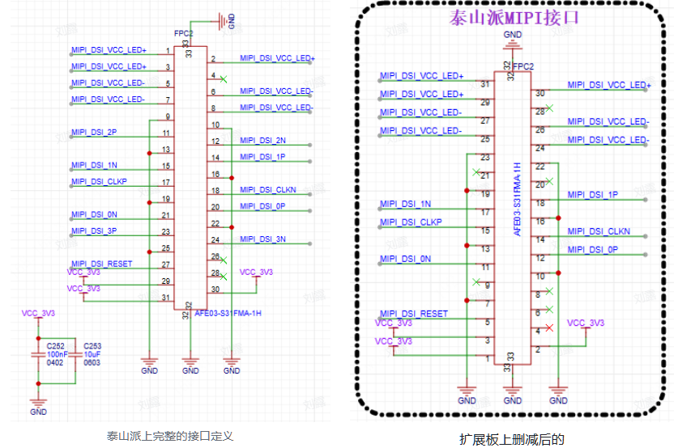
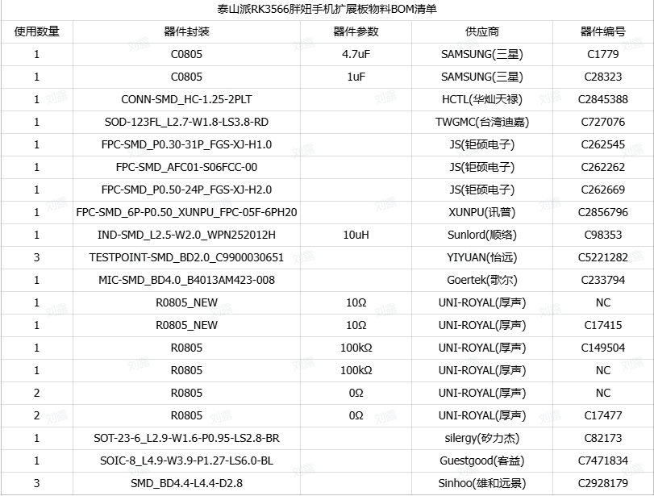

## 资料

## 相关文档

官方文档：`https://wiki.lckfb.com/zh-hans/tspi-rk3566/`

资料下载：

* 百度网盘：`https://pan.baidu.com/s/1HtnpytCBBqBOqZi8mfV4VQ?pwd=qcxx`

  提取码：qcxx

### 开源硬件

* 泰山派开发板项目工程：

  `https://oshwhub.com/li-chuang-kai-fa-ban/li-chuang-tai-shan-pai-kai-fa-ban`

* 泰山派开发板-电源小板：

  ```txt
  百度网盘->第02章.【立创·泰山派】开源硬件->立创·泰山派开发板电源PD诱骗小板文件夹中
  ```

* 泰山派开发板-音频小板：

  ```txt
  百度网盘->第02章.【立创·泰山派】开源硬件->立创·泰山派开发板音频小板文件夹中。
  ```

* 泰山派开发板-CNC外壳A版本

  ```txt
  百度网盘->第02章.【立创·泰山派】开源硬件->立创·泰山派开发板CNC外壳A版文件夹中
  ```

* 泰山派开发板-39Pin-Hub2.0-以太网扩展板

  ```txt
  百度网盘->第02章.【立创·泰山派】开源硬件->立创·泰山派开发板39Pin_Hub2.0_以太网扩展板文件夹中。
  ```

## 系统使用

### 镜像烧录教程

### Android系统使用文档

### Buildroot系统使用文档

## 固件编译

### Linux系统编译

https://wiki.lckfb.com/zh-hans/tspi-rk3566/sdk-compilation/linux-compilation.html

## 项目案例

### 胖妞手机

#### 一、前言

* 项目开源地址：`https://oshwhub.com/li-chuang-kai-fa-ban/tai-shan-pai-pang-niu-shou-ji-kuo-zhan-ban`

* 资料：

  ```txt
   在 下载中心->百度网盘（立创·泰山派开发板资料）->第09章.【立创·泰山派】项目案例->【智能小手机】项目资料中。
  ```

#### 二、硬件设计

胖妞手机硬件主要由泰山派以及一个屏幕扩展板构成，这里主要分析这个扩展板的设计原理以及思路。

##### 1. 电路原理分析

扩展板主要模块：

* 接口转换电路
* 背光电路
* 音频电路

###### 1.1 接口转换电路

为什么需要接口转换电路：我们选的3.1寸屏幕它的mipi接口和触摸接口和我们泰山派的mipi和触摸接口都不一样，所以需要转换电路使信号线对应起来。

3.1寸屏幕：

* 购买：`https://item.taobao.com/item.htm?abbucket=9&id=602291522189&ns=1&skuId=4647073176206&spm=a21n57.1.item.4.5dee523cydFHkZ`

* 数据手册：

  ```txt
  在 下载中心->百度网盘（立创·泰山派开发板资料）->第09章.【立创·泰山派】项目案例->【智能小手机】项目资料->7.手机综合项目->数据手册->3.1寸屏幕资料->D310T9362V1 SPEC->D310T9362V1 SPEC.pdf。
  ```

<font color=blue>1.1.1 3.1寸屏MIPI接口 </font>

3.1寸屏幕的分辨率为480x800，使用的是MIPI DSI接口，屏幕排线为24个引脚，其中4、5、9脚为空不需要接。


<font color=blue>1.1.2 泰山派MIPI屏接口 </font>

* 泰山派的`MIPI接口`是`标准31PIN`的，在扩展板上有些引脚并没有用上，所以做了删减，这里泰山派上同网络标签和3.1寸屏幕的FPC接口直接相连。
* 需要注意的是`MIPI_DSI_VCC_LED+`和`MIPI_DSI_VCC_LED-`背光引脚，此背光是由泰山派上的板载背光电路输出，他的输出电流是`110mA`我们3.1寸屏幕最大能承受的驱动电流是`25mA`，所以不适合直接接到3.1寸屏幕的`FPC`上。



<font color=blue>1.1.3 3.1寸屏触摸接口 </font>

* 3.1寸触摸屏接口使用的是i2C协议与泰山派进行通讯
* 除了i2C外还有两个比较重要的引脚分别是触摸复位引脚和触摸中断触发引脚


<font color=blue>1.1.4 泰山派触摸接口 </font>

泰山派触摸接口以及功能如下所示，同名的标签和上面3.1寸触摸FPC链接。


###### 1.2 背光电路

背光电路主要由以下三部分构成：

* 背光选择电路
* 背光驱动电路
* 背光调节电路

<font color=blue>1.2.1 背光选择电路 </font>

背光电路分为两路：

* 第一路：由泰山派输出
* 第二路：转接板的板载背光驱动输出

通过4个0欧姆电阻进行选择，如果贴（R103和R104）不贴（R105和R106）则由泰山派背光电路供电，不贴（R103和R104）贴（R105和R106）则由板载背光驱动电路供电。


<font color=blue>1.2.2 板载背光电路 </font>

背光驱动电路主要由SY7201ABC实现，SY7201ABC是一款高效率的LED驱动器，主要用于控制和调节LED灯的亮度。SY7201ABC通过提供恒定电流来确保LED发光的一致性和稳定性，从而提高了LED使用的寿命和效能。

SY7201ABC数据手册：`https://atta.szlcsc.com/upload/public/pdf/source/20160903/1472896628181.pdf`

封装与引脚功能说明：


L15 D7 C255 与SY7201ABC组成 BOOST升压电路（主要是利用电感电容的储能特性 进行升压 （电感电流不能突变，与电容电压不能突变））

R99 R100 为采样电阻与参考电压进行对比恒定输出电流，输出电流的计算公式IOUT=0.2V/R，这里问了使R能够匹配更加精准的值我们并联了两个电阻R99和R100，其中R99为NC不贴，最终的IOUT=0.2V/10Ω=20mA

R102 R101为上下拉电阻，默认下拉贴R101，这里两个电阻的作用Linux系统启动到背光驱动加载需要一些时间，也就意味着驱动加载之前这个IO口是不确定的，我们根据需要在没有驱动控制的时候通过上拉或者下拉电阻来决定屏幕背光关闭还是打开。


<font color=blue>1.2.3 背光调节电路 </font>

因为我们泰山派没有PWM引脚引到3.1寸扩展板，但触摸接口有I2C1引到3.1寸扩展屏幕上，I2C是可以挂在多个设备的，所以为了能够实现背光调节功能，我们通过GP7101一颗I2C转PWM的芯片来实现PWM的调节，GP7101和触摸一起挂到I2C1下。


###### 1.3 音频电路 

<font color=blue>1.3.1 喇叭 </font>

通过两个弹簧顶针(POGO PIN)与泰山派SPKP和SPKN连接，音频驱动电路由泰山派上的RK809-5实现。


<font color=blue>1.3.2 麦克风 </font>

通过一个弹簧顶针(POGO PIN)与泰山派MIC连接，MIC相关的驱动电路集成在了泰山派上。


##### 2. 原理图与PCB设计

###### 2.1 原理图设计

创建工程：`【泰山派RK3566】胖妞手机扩展板设计`

BOM表清单：



原理图绘制：


###### 2.2 PCB设计

<font color=blue>2.2.1 原理图生成PCB </font>


<font color=blue>2.2.2 结构设计 </font>

在公司实际的项目中结构工程师会先输出结构图给我们，我们在基于结构工程师的结构要求来设计PCB的板框形状以及器件布局等，最后在和结构工程师共同敲定最终的布局。当然自己DIY的话就没这么多要求了。

<font color=green>2.2.2.1 板框结构文件</font>

结构图我们已经根据外壳和装配情况提前设计好了大家直接下载导入就行，如果你不想使用我做好的结构你也可以自己手动去调整，比如装配3.1寸屏幕的时候FPC放在什么位置合适，定位孔放在什么位置刚好可以和泰山对上，这些需要你自己去测量。

```txt
【胖妞手机3.1寸扩展板结构图.dxf】下载
在 下载中心->百度网盘（立创·泰山派开发板资料）->第09章.【立创·泰山派】项目案例->【智能小手机】项目资料->7.手机综合项目->结构文件->胖妞手机3.1寸扩展板结构图.dxf。
```

<font color=green>2.2.2.2 导入板框结构</font>

在PCB界面中`选择文件->导入->DXF`，选择我们上面下载的`胖妞手机3.1寸扩展板结构图.dxf`文件，一定要在PCB界面如果在原理图界面导入DXF是不一样的。


预览一下看是否有问题，没有的话参数选择默认直接导入


把导入的结构文件放置到原点，这里导入以后默认是放在顶层走线层的。我们需要把其他器件调整到文档层板框设计成板框层。


通过属性面板把DXF文件中的板框改成板框层，把其他元器件改成文档层，修改完成以后全选并锁定结构文件。


<font color=blue>2.2.3 叠层阻抗设计 </font>

做叠层阻抗匹配主要的目的是让信号完整性更好，一般当我们设计的板子上有高速信号存在的时候我们就需要去考虑信号的完整性。
我们3.1寸扩展屏幕上面有MIPI信号，MIPI属于高速信号，但又因为我们这个屏幕尺寸很小，速率也不高其实不做也没有关系，这里出于教学目的所以设计中会去考虑信号完整性，但实际打板测试的时候我会忽略并用2层板免费工艺进行打样测试。

<font color=green>2.2.3.1 阻抗要求</font>

单端走线我们一般是`50ohm ±10%`加上我们3.1寸扩展板上面没有什么重要的单端信号所以调节可以放宽，这里比较重要的是MIPI DSI信号


<font color=green>2.2.3.2 阻抗计算</font>

嘉立创阻抗计算：`https://tools.jlc.com/jlcTools/#/impedanceCalculateNew`

我们的板子比较简单，走线在顶层和底层就够了，内部两层直接设为GND，给到顶层走线层和底层走线层参考，所以我们计算阻抗的时候各层参考。最终得到单端6.16mil，mipi差分4.88mil，线间距8mil。


<font color=blue>2.2.4 规则设置 </font>

则的作用很多也很实用，设计复杂的板子必须要有完善的规则，更多的规则相关内容需要大家在后续的学习中去进阶，可以参考泰山派的设计里面有定义了大量的规则去辅助设计。

生产的时候会根据板子工艺复杂度来收费，比如你使用了特殊线宽和过孔等，所以在设计规则的时候尽量选择满足自己并且性价比高的工艺规则。


<font color=green>2.2.4.1 距离规则</font>

上面阻抗匹配计算的时候线距离选择的是8mil，所以我们在规则中也把线到线距离设置为8mil


<font color=green>2.2.4.2 创建导线规则</font>

通常我们会根据网络来设置走线规则，假如我们板子上信号线以及电源有N种我们需要评估这些线并给出合适的线宽规则，我们这只有两种情况，所以我们就创建两种走线规则，第一种是单端走线，第二种是电源线因为电流都不大我们就统一宽度。
单端走线就是普通的线比如GPIO这种，我们前面已经计算出了单端走线线宽为6.16mil，所有直接基于默认的修改就行。


电源走线规则，扩展板上的器件都是几十毫安非常小，所有我们统一创建一个名为pwr的规则，线宽设置为15mil给到所有的电源网络使用。


<font color=green>2.2.4.3 创建差分规则</font>

前面计算出来的差分对线宽4.88mil所有我们这里设为4.9mil线宽，间距设置为8mil，需要注意的是差分对长度误差理论上是一样长最好，但不可能做到所以我们给设计的误差为10mil。


<font color=green>2.2.4.4 创建过孔规则</font>

但大家在设计的时候尽量减少过孔的种类，理论上我们PCB上就一种尺寸的过孔规格是最好的，因为这样生产的时候机器不用换转头，一个转头就把所有的过孔搞定了。所有我们这里就直接使用默认的过孔规则。


<font color=blue>2.2.5 规则生效 </font>

前面我们只是设置了规则，但是有些规则并不会生效，要让规则生效我们还需要在网络规则中去应用到指定的规则。

<font color=green>2.2.5.1 导线规则应用</font>

把电源相关的网络都应用成PWR规则，其他的使用默认的单端网络规则。


<font color=green>2.2.5.2 差分对规则应用</font>

网络类中选择差分对，按住ctrl+鼠标左键选择差分对，然后右键新建差分对。


弹出差分对管理器，创建差分对，总共有三对差分线都使用这种方法完成创建。


创建完成，可以看到规则这里就是应用了我们的差分对规则，点击应用生效。


#### 三、软件开发

##### 1. 驱动开发

需要修改的代码：`00.转接板\code\00.修改点`

###### 1.1 打开mipi设备树驱动

<font color=blue>修改文件：`tspi-rk3566-user-v10.dts`</font>

设备树驱动位置：

mipi 显示屏幕配置的头文件为`tspi-rk3566-dsi-v10.dtsi`，通过`tspi-rk3566-user-v10.dts`对该头文件的引用来控制是否引入mipi配置。


###### 1.2 GP7101 背光驱动


**使用板载背光驱动而不使用泰山派背光引脚的原因**

由于使用的3.1寸屏幕背光电流最大只支持25mA（和泰山派默认的背光引脚输出电流(110mA)不匹配），所以使用转接板的背光电路来提供背光电流。

`板载背光电路`模块可以提供稳定的20mA电流，并且通过`板载背光调节`模块的PWM引脚来调节背光（应该是通过控制`GP710_LCD_BL`输出的PWM控制`I2C_DSI_VCC_LED+`引脚的输出电压，从而调节背光）。

PWM脚是通过GP7101 I2C转PWM芯片来实现的，所以我们需要编写一个GP7101驱动。

###### 1.2.1 配置I2C1设备树

* GP7101和触摸共同挂载在I2C下

* GP7101的I2C地址：

  * 从数据手册可知，GP7101的I2C地址为`0XB0`

    

  * `0XB0`包含了读写位，实际填写在设备树的地址还需要右移一位，最终地址为`0X58`

<font color=blue>在`tspi-rk3566-dsi-v10.dtsi`中添加GP7101相关设备树驱动：</font>

```c
&i2c1 {              // 引用名为i2c1的节点
    status = "okay"; // 状态为"okay"，表示此节点是可用和配置正确的
    GP7101@58 {      // 定义一个子节点，名字为GP7101，地址为58
        compatible = "gp7101-backlight";   // 该节点与"gp7101-backlight"兼容，
        reg = <0x58>;                      // GP7101的I2C地址0x58
        max-brightness-levels = <255>;     // 背光亮度的最大级别是255
        default-brightness-level = <100>;  // 默认的背光亮度级别是100
    };
};
```

###### 1.2.2 创建驱动相关文件

一般背光驱动放在`kernel/drivers/video/backlight`目录下

在该路径下，<font color=blue>创建`my_gp7101_bl`目录，并在`my_gp7101_bl`目录底下创建两个文件：</font>

* `Makefile`
* `gp7101_bl.c`

###### 1.2.3 编写Makefile

* <font color=blue>`backlight/my_gp7101_bl/Makefile`：把`gp7101_bl.c`编译到内核中：</font>

  ```makefile
  obj-y   += gp7101_bl.o
  ```

  > 当然也可以选择`obj-m`编译成模块

* <font color=blue>`backlight/Makefile`：使`my_gp7101_bl`的`Makefile`生效</font>

  ```makefile
  obj-y += my_gp7101_bl/
  ```

###### 1.2.4 编写`gp7101_bl.c`驱动

<font color=blue>编写`gp7101_bl.c`</font>，步骤：

1. 拷贝`I2C`驱动框架过来
2. 添加背光控制器结构体`gp7101_backlight_data`
3. 编写`gp7101_bl_probe()`函数
4. 关注函数`devm_backlight_device_register`：用来动态注册背光设备
5. `gp7101_backlight_ops`结构体中的`update_status`成员指向背光更新函数
6. `gp7101_backlight_set()`更新背光的核心函数
7. `i2c_write()` `I2C`写函数
8. 注释`backlight`：为了不去修改上层，我们自己写的驱动也是用的`backlight`节点，所以要注释掉原来的`backlight`节点

###### 1.3 屏幕参数调试

屏幕相关的大多数配置已经在`tspi-rk3566-dsi-v10.dtsi`配置好了，这次适配3.1寸触摸屏只需要修改以下几个参数，其他保持默认即可：

* 修改lanes数
* 配置初始化序列
* 配置屏幕序列

###### 1.3.1 修改lanes数

<font color=blue>修改文件`tspi-rk3566-dsi-v10.dtsi`</font>

3.1寸屏幕硬件上只用了2lanes的差分对

```c
dsi,lanes  = <4>;
改为
dsi,lanes  = <2>;
```

###### 1.3.2 配置初始化序列

根据厂商给的参数修改：

<font color=blue>修改文件`tspi-rk3566-dsi-v10.dtsi`</font>

```c
panel-init-sequence = [
    // init code
    05 78 01 01
    05 78 01 11
    39 00 06 FF 77 01 00 00 11
    15 00 02 D1 11
    15 00 02 55 B0 // 80 90 b0
    39 00 06 FF 77 01 00 00 10
    39 00 03 C0 63 00
    39 00 03 C1 09 02
    39 00 03 C2 37 08
    15 00 02 C7 00 // x-dir rotate 0:0x00,rotate 180:0x04
    15 00 02 CC 38
    39 00 11 B0 00 11 19 0C 10 06 07 0A 09 22 04 10 0E 28 30 1C
    39 00 11 B1 00 12 19 0D 10 04 06 07 08 23 04 12 11 28 30 1C
    39 00 06 FF 77 01 00 00 11 // enable  bk fun of  command 2  BK1
    15 00 02 B0 4D
    15 00 02 B1 60 // 0x56  0x4a  0x5b
    15 00 02 B2 07
    15 00 02 B3 80
    15 00 02 B5 47
    15 00 02 B7 8A
    15 00 02 B8 21
    15 00 02 C1 78
    15 00 02 C2 78
    15 64 02 D0 88
    39 00 04 E0 00 00 02
    39 00 0C E1 01 A0 03 A0 02 A0 04 A0 00 44 44
    39 00 0D E2 00 00 00 00 00 00 00 00 00 00 00 00
    39 00 05 E3 00 00 33 33
    39 00 03 E4 44 44
    39 00 11 E5 01 26 A0 A0 03 28 A0 A0 05 2A A0 A0 07 2C A0 A0
    39 00 05 E6 00 00 33 33
    39 00 03 E7 44 44
    39 00 11 E8 02 26 A0 A0 04 28 A0 A0 06 2A A0 A0 08 2C A0 A0
    39 00 08 EB 00 01 E4 E4 44 00 40
    39 00 11 ED FF F7 65 4F 0B A1 CF FF FF FC 1A B0 F4 56 7F FF
    39 00 06 FF 77 01 00 00 00
    15 00 02 36 00 //U&D  Y-DIR rotate 0:0x00,rotate 180:0x10
    15 00 02 3A 55
    05 78 01 11
    05 14 01 29
];
```

###### 1.3.3 配置屏幕时序

<font color=blue>修改文件`tspi-rk3566-dsi-v10.dtsi`</font>

```c
disp_timings1: display-timings {
    native-mode = <&dsi1_timing0>;
    dsi1_timing0: timing0 {
        clock-frequency = <27000000>;
        hactive = <480>;       //与 LCDTiming.LCDH 对应
        vactive = <800>;       //与 LCDTiming.LCDV 对应
        hfront-porch = <32>;   //与 LCDTiming.HFPD 对应
        hsync-len = <4>;       //与 LCDTiming.HSPW 对应
        hback-porch = <32>;    //与 LCDTiming.HBPD 对应
        vfront-porch = <9>;    //与 LCDTiming.VEPD 对应
        vsync-len = <4>;       //与 LCDTiming.VsPW 对应
        vback-porch = <3>;     //与 LCDTiming.VBPD 对应
        hsync-active = <0>;
        vsync-active = <0>;
        de-active = <0>;
        pixelclk-active = <0>;
    };
};
```


###### 1.4 触摸驱动

###### 1.4.1 配置I2C1设备树

触摸和`GP7101`挂载在同一个`I2C`下，在`&i2c1`下添加我们自己定义的触摸节点`myts@38`

<font color=blue>修改文件`/arch/arm64/boot/dts/rockchip/tspi-rk3566-dsi-v10.dtsi`</font>

```c
&i2c1 {
    status = "okay";             // 表示这个i2c1设备是可用的
    clock-frequency = <400000>;  // 设置i2c1的时钟频率为400kHz
    myts@38 {                    // 定义一个i2c设备，设备地址为0x38，设备名称为myts
        compatible = "my,touch"; // 表示这个设备是触摸屏设备，驱动名称为my,touch
        reg = <0x38>;            // i2c设备地址
        tp-size = <89>;          // 触摸屏的大小
        max-x = <480>;           // 触摸屏支持的最大X坐标值
        max-y = <800>;           // 触摸屏支持的最大Y坐标值
        touch-gpio = <&gpio1 RK_PA0 IRQ_TYPE_LEVEL_LOW>; // 触摸屏的触摸中断引脚，连接到gpio1的第0个引脚，触发方式为低电平触发
        reset-gpio = <&gpio1 RK_PA1 GPIO_ACTIVE_HIGH>;   // 触摸屏的复位引脚，连接到gpio1的第1个引脚，有效电平为高电平
    };
   /****省略****/
};
```

###### 1.4.2 创建驱动相关文件

一般触摸都放在`kernel/drivers/input/touchscreen`目录下

<font color=blue>在此目录下创建`my_touch`，并在`my_touch`目录下创建文件：</font>

* `Makefile`
* `my_touch.c`

###### 1.4.3 编写Makefile

<font color=blue>`input/touchscreen/Makefile`</font>

```makefile
obj-y   += my_touch.o
```

> 也可以选择`obj-m`编译成模块

###### 1.4.4 编写`my_touch.c`驱动

<font color=blue>编写`my_touch.c`流程：</font>

1. 拷贝`I2C`驱动框架
2. 表示触摸设备的结构体`my_touch_dev`
3. 编写`my_touch_ts_probe()`函数
4. 申请中断的函数 `devm_request_threaded_irq()`
5. 编写中断线程服务函数 `my_touch_irq_handler()`
6. 触摸相关寄存器及数据格式：
   * `TD_STATUS`
   * `TOUCHn_X`寄存器
   * `TOUCHn_Y`寄存器
7. 上报数据：调用input接口函数进行数据上报，详细查看代码注释

###### 1.5 开机logo更换


