# 立创-实战派ESP32-C3

相关资料：

```txt
购买：https://item.szlcsc.com/23859220.html
技术群：https://lceda002.feishu.cn/wiki/Yb3ewdGwDiamHOkSGrVcDSV0nLh
开源资料：https://lceda001.feishu.cn/wiki/L5Qhw037viVW5MkyFXPcRLhznbe
开源硬件：https://oshwhub.com/li-chuang-kai-fa-ban/xd-esp32c3-aiot-v1_3_2
```

## 第一部分 准备工作

### 第2章 安装开发环境

`ESP-IDF`开发环境可以安装在windows、Linux和macOS上，具体参考：乐鑫《ESP-IDF编程指南》在线文档，链接：`https://docs.espressif.com/projects/esp-idf/zh_CN`

下面介绍windows的离线安装方式：`VSCode + esp-idf`

#### `ESP-IDF`安装

> ESP-IDF 下载地址链接：https://dl.espressif.cn/dl/esp-idf/?idf=4.4

下载离线版本，教程下载的是`ESP-IDF v5.1.3-Offline Installer`

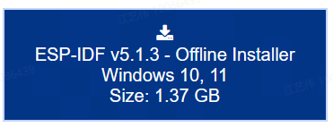

下载完后安装，假设安装到D盘：`D:\Espressif`

安装完后会有两个工具：`ESP-IDF 5.1 CMD和ESP-IDF 5.1 PowerShell`

通过双击这两个图标其中的一个，就可以进入IDE开发环境，这两个工具，都是命令行工具，其中CMD支持Windows命令，PowerShell支持Linux命令，就和安装了一个虚拟机+Linux系统的效果差不多。

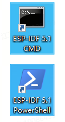

#### 安装`VSCode`开发环境

安装两个插件：

* `Espressif IDF`
* `C/C++`

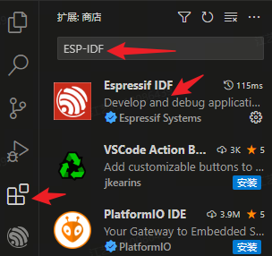

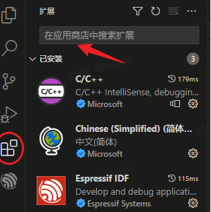

<font color=blue>配置Espressif IDF插件</font>

在VSCode菜单栏中选择“查看”->“命令面板”，在命令行输入`ESP-IDF`，选择“配置`ESP-IDF`插件”

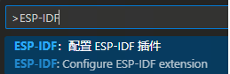

如下图所示，第一步选择Global，第二步选择USE EXISTING SETUP，也就是“使用已安装”的意思。

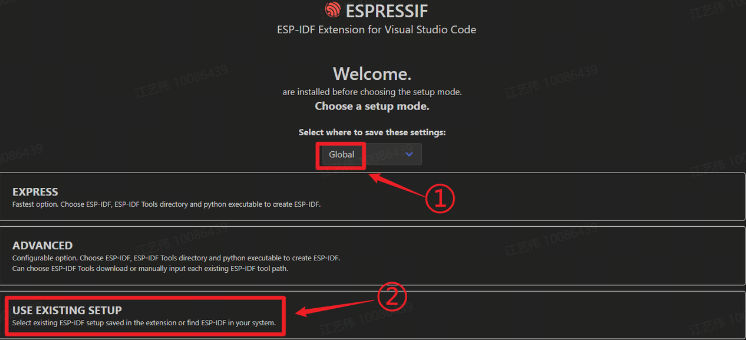

然后出现两个菜单，如下图所示，第一个是在系统中搜索`ESP-IDF`，第二个是它自动发现的，就是我们在上一节安装`ESP-IDF`的安装路径，我们点击这个菜单。

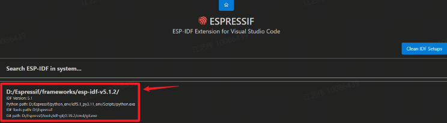

稍微等待一会儿后，就会出现下面这个画面，表示安装成功。

## 第二部分：基础外设例程

### 第3章 Hello World例程

#### 3.1 准备例程

本章目的：通过拷贝`ESP-IDF`的例程进行编译，验证编译流程并下载到开发板进行串口日志打印。

本工程的现象是：在串口终端输出hello world，然后经过10秒钟后重启，如此往复。

复制`esp-idf-v5.1.3\examples\get-started\hello_world`到实验文件夹`D:\esp32c3\hello_world`。

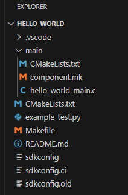

<font color=blue>目录说明：</font>

函数入口为：`main/hello_world_main.c:app_main()`

两个`CMakeLists.txt`：

* `hello_world/CMakeLists.txt`:

  ```txt
  # The following lines of boilerplate have to be in your project's
  # CMakeLists in this exact order for cmake to work correctly
  cmake_minimum_required(VERSION 3.5)
  
  include($ENV{IDF_PATH}/tools/cmake/project.cmake)
  project(hello_world)
  ```

  最后一行`project(hello_world)`的`hello_world`是工程名称，编译后的bin文件名称为`hello_world.bin`

* `hello_world/main/CMakeLists.txt`

  ```txt
  idf_component_register(SRCS "hello_world_main.c"
                      INCLUDE_DIRS "")
  ```

  这个里面是用来添加源文件路径的，本工程里面只有一个c文件，所以只有一个hello_world_main.c。如果工程中需要再添加一个c文件，就可以在这里添加路径。一般情况下，当你在工程中新建一个c文件后，这里会自动把你新建的c文件添加进入，如果没有自动添加进入，手动添加即可。

#### 3.2 编译和下载

vscode左下角的工具和配置说明：

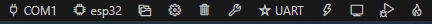

* 第1个配置图标是串口号的选择。点击图标，在VSCode软件中间最上方会出现可选的串口号，选择对应的串口即可。

* 第2个配置图标是目标芯片的选择。点击图标，在VSCode软件中间最上方，首先会出现工程路径，点击选择，然后就会出现可选的芯片型号。

  

  选完芯片后，又会弹出下载方式的选择，这边选择USB转串口 `via ESP USB Bridge`

  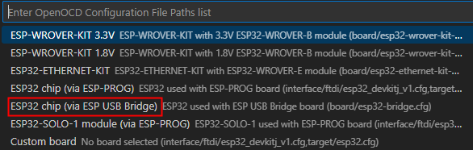

  > 需要注意的是，选择目标芯片的过程需要10秒左右，等右下角的进度条状态完成之后再进行下一步。

* 第3个配置图标是工程文件夹路径，默认会自动配置好，不用修改。把鼠标放上去就可以看到路径。如果你把工程又复制到别的地方了，这里可能就需要修改一下。

* 第4个配置图标是menuconfig图标，点击图标会打开menuconfig，如下图所示。

  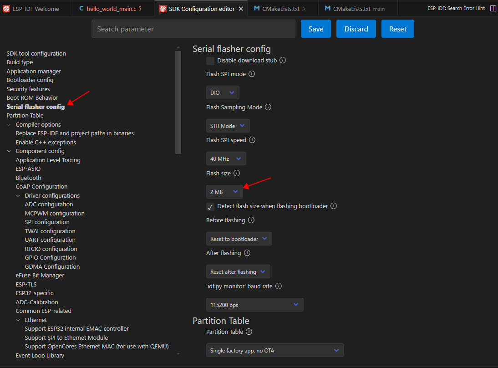

  点击左侧的`Serial flasher config`，在右侧出现的配置选项里面，`Flash size`默认是2MB，选择对应的大小即可。

* 第5个图标是一个垃圾桶形象，用来删除编译过程中形成的文件

* 第6个图标是编译按钮，点击这个按钮，就可以开始编译

* 第7个图标是下载方式的选择，我们选择UART。

  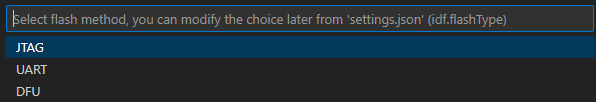

* 第8个图标是下载按钮，点击这个按钮，可以下载编译好的程序到ESP32开发板。
* 第9个图标是终端观察窗口，下载完程序以后，我们可以点击这个按钮，观察单片机的运行状态，这个其实就是一个串口终端，程序运行过程中，会使用串口发送一些信息，在终端就可以看到。
* 第10个图标是编译、下载、终端的综合按钮，相当于是依次点击了上面讲的3个按钮，点击一下，会按照顺序完成编译、下载、打开终端。

现在，我们可以点击这个按钮，执行编译下载和打开终端。第一次编译，需要的时间比较长，之后如果稍微修改一下程序再编译，编译时间就没有第一次那么长了。在编译的过程中，会在终端窗口看到编译进度信息。等到程序下载完毕，然后自动打开终端，我们会在终端中看到如下信息：

```
Hello world!
This is esp32c3 chip with 1 CPU core(s), WiFi/BLE, silicon revision v0.4, 8MB external flash
Minimum free heap size: 330660 bytes
Restarting in 10 seconds...
Restarting in 9 seconds...
Restarting in 8 seconds...
Restarting in 7 seconds...
Restarting in 6 seconds...
Restarting in 5 seconds...
```

#### 3.3 程序源码分析

略


