# 前言

STM32F4家族目前拥有：STM32F40x、STM32F41x、STM32F42x和STM32F43x等几个系列，数十个产品型号，不同型号之间软件和引脚具有良好的兼容性，可方便客户迅速升级产品。

学习STM32F4有几分资料经常用到：

* 《STM32F4xx中文参考手册》

  最常用的是《STM32F4xx中文参考手册》，该文档是ST官方针对STM32的一份通用参考资料，内容翔实，但是没有实例，也没有对Cortex-M4架构进行多少介绍，读者只能根据之间对书本的理解来编写相关代码，该文档目前已经有中文的版本。

* 《STM32F3与F4系列Cortex M4内核编程手册》英文版

  该文档重点介绍了Cortex M4内核的汇编指令及其使用，以及内核相关寄存器（比如：SCB、NVIC、SYSTICK等寄存器），是《STM32F4xx中文参考手册》的重要补充，很多在《STM32F4xx中文参考手册》无法找到的内容，都可以在这里找到答案，不过目前该文档只有英文版。

* 《Cortex M3与M4权威指南》英文版

  该文档详细介绍了Cortex M3和Cortex M4内核的体系架构，并配有简单实例，目前该文档只有英文版。CM3和CM4很多地方都是通用的，可以参考《Cortex M3权威指南(中文)》。

# 第一篇 硬件篇

本篇学习STM32F4的硬件平台。

本篇将分为如下两章：

1. 实验平台简介
2. 实验平台硬件资源详解

## 第一章 实验平台简介

本章分为如下两节：

1.1 ALIENTEK探索者STM43F4开发板资源初探

1.2 ALIENTEK探索者STM43F4开发板资源说明

### 1.1 ALIENTEK探索者STM32F4开发资源初探


ALIENTEK探索者STM32F4开发板板载资源如下：

* CPU:STM32F407ZGT6，LQFP144，FLASH：1024K，SRAM：192K
* 外扩SRAM：IS62WV51216，1M字节
* 外壳SPI FLASH：W25Q128，16M字节
* 1个电源指示灯（蓝色）
* 2个状态指示灯（DS0：红色，DS1：绿色）
* 1个红外接收头，并配备一款小巧的红外遥控器
* 1个EEPROM芯片，24C202，容量236字节
* 1个六轴（陀螺仪+加速度）传感器芯片，MPU6050
* 1个高性能音频编解码，WM8978
* 1个2.4G无限模块接口，支持NRF24L01无线模块
* 1路CAN接口，采用TJA1050芯片
* 1路485接口，采用SP3485芯片
* 2路RS232串口（一公一母）接口，采用SP3232芯片
* 1路单总线接口，支持DS18B20/DHT11等单总线传感器
* 1个ATK模块接口，支持ALIENTEK 蓝牙/GPS模块
* 1个光敏传感器
* 1个标准的2.4/2.8/3.5/4.3/7寸LCD接口，支持电阻/电容触摸屏
* 1个摄像头模块接口
* 1个OLED模块接口
* 1个USB串口，可用于程序下载和代码调试（USMART调试）
* 1个USB SLAVE接口，用于USB从机通信
* 1个USB HOST(OTG)接口，用于USB主机通信
* 1个有源蜂鸣器
* 1个RS232/RS485选择接口
* 1个RS232/模块选择接口
* 1个CAN/USB选择接口
* 1个串口选择接口
* 1个SD卡接口（在板子背面）
* 1个百兆以太网接口（RJ45）
* 1个标准的JTAG/SWD调试下载口
* 1个录音头（MIC/咪头）
* 1路立体声音音频输出接口
* 1路立体声录音输入接口
* 1路扬声器输出接口，可接1W左右小喇叭
* 1组多功能端口（DAC/ADC/PWM DAC/AUDIO IN/TPAD）
* 1组5V电源供应/接入口
* 1组3.3V电源供应/接入口
* 1个参考电压设置接口
* 1个直流电源输入接口（输入电压范围：DC6~16V）
* 1个启动模式选择配置接口
* 1个RTC后背电池座，并带电池
* 1个复位按钮，可用于复位MCU和LCD
* 4个功能按钮，其中KEY_UP(即WK_UP)兼具呼唤功能
* 1个电容触摸按键
* 独创的一键下载功能
* 除晶振占用的IO口外，其余所有IO口全部引出

> 主控芯片自带1M字节FLASH的STM32F407ZGT6，并外扩1M字节SRAM和16M字节FLASH，满足大内存需求和大数据存储。

### 1.2 ALIENTEK探索者STM32F4开发板资源说明

#### 1.2.1 硬件资源说明

##### 1. NRF24L01模块接口

这是开发板板载的NRF24L01模块接口（U6），只要插入模块，就可以实现无线通信，从而使得板子具备了无线功能，但是这里需要2个模块和2个开发板同时工作才可以。如果只有1个开发或1个模块，是没办法实现无线通信的。

##### 2. W25Q128 128M FLASH

这是开发板外扩的SPI FLASH芯片（U11），容量位128Mbit，也就是16M字节，可用于存储字库和其他用户数据，满足大容量数据存储要求。当然如果觉得16字节还不够，可以把数据存放在外部SD卡。

##### 3. SD卡接口


#### 1.2.2 资源软件说明


# 第二篇 软件篇

## 第3章 `MDK5`软件入门

### 3.4.2 `JLINK`下载与调试程序

串口只能下载代码，并不能实时跟踪调试，而利用调试工具，比如`JLINK`、`ULINK`、`SLINK`等就可以实时跟踪程序。

这里以`JLINK V8`为例，介绍`STM32F4`程序下载和在线调试

两种调试方式：

* `JTAG`

  占用的I/O线比较多

* `SWD`

  占用的I/O线比较少，只需两根即可

**使用`JLINK V8`进行下载和调试**

* 硬件连接：把`JLINK`用USB线连接到计算机USB和板子的`JTAG`接口上

* 驱动安装：安装`JLINK V8`的驱动程序`Setup_JLinkARM_V415e.exe`

* 单击打开`Options for Target`对话框

* 在`Debug`栏选择仿真工具为`J-LINK/J-TRACE Cortex`；选中`Run to main()`。如下图所示

  选中`Run to main()`选项的作用：

  * 选中了该选项后，只要单机仿真就会运行到main函数
  * 如果没有选择该选项，则先执行`startup_stm32f40_41xxx.s`文件的`Reset_Handler`，再跳到`main`函数。

  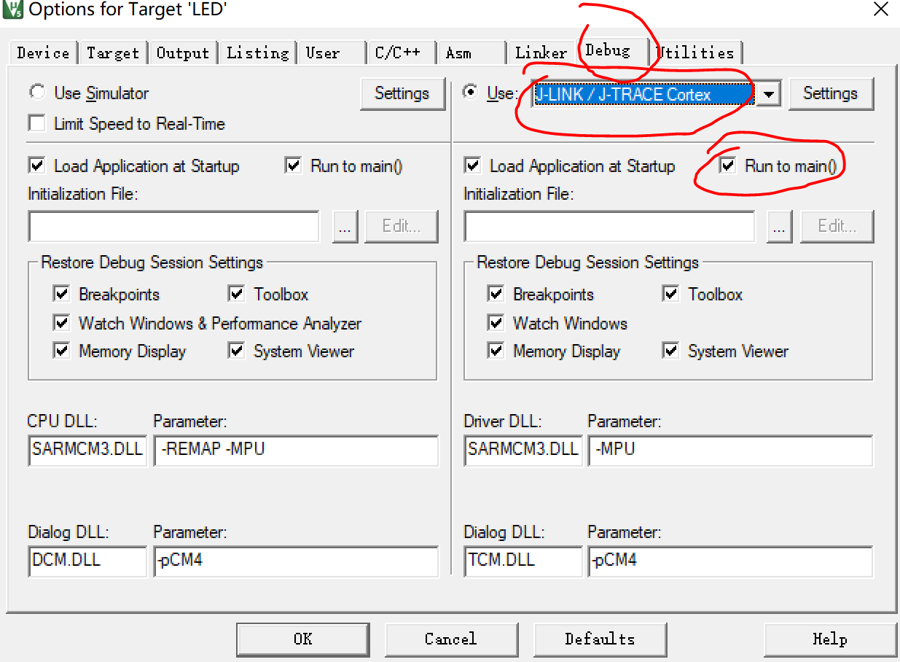

* 单击`Settings`设置`J-Link`的一些参数：

  * 使用`SW`调试模式

    因为`JTAG`需要占用比`SW`模式多很多的I/O口，而再`ALIENTEK miniSTM32`开发板上这些I/O口可能被其他外设用到，于是造成部分外设无法使用

  * `Max Clock`项可以单击`Auto CLK`自动设置，如果你的USB数据线比较差，那么可能会出问题，此时可以通过降低速率试试。

  * 单机`OK`完成这部分设置

  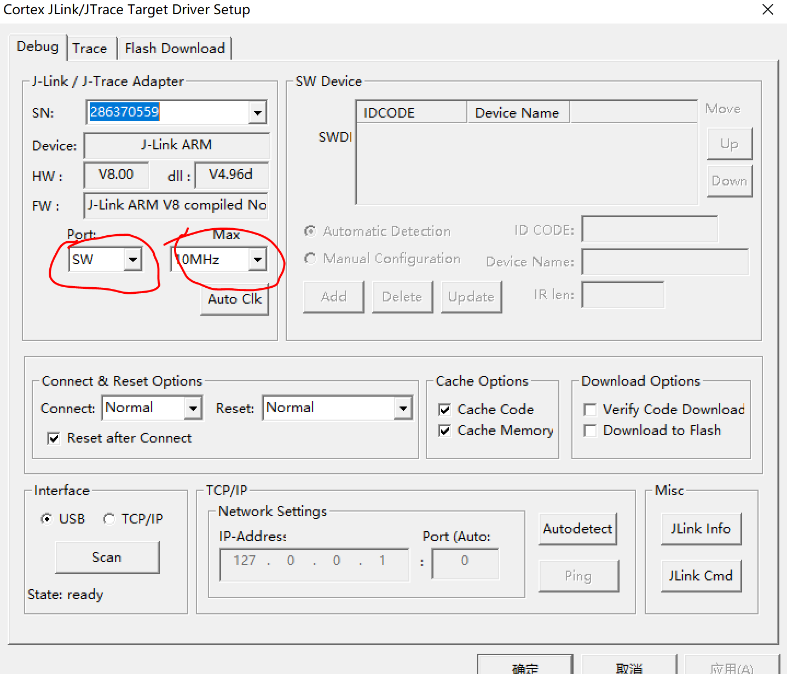

* 点击`Utilities`选项卡

  用来设置下载时的目标编程器

  * 勾选`Use Debug Driver`

    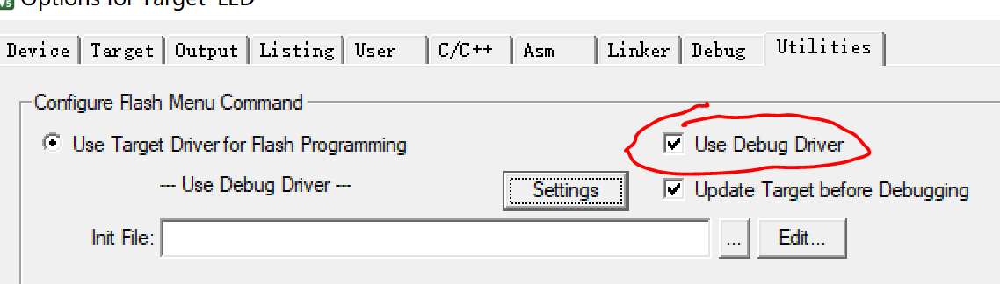

  * 点击`Seggings`，设置如下所示：

    * `MDK5`会根据我们新建工程时选择的目标器件自动设置`FLASH`算法。我们这里用的是`STM32F407ZGT6`，FLASH容量为`1MB`，所以`Programming Algorithm`里面默认会有`1MB`型号的`STM32F4xx FLASH`算法。特别提醒：这里`1MB FLASH`算法不仅仅针对`1 MB`容量的`STM32F4`，对于小于`1 MB FLASH`的型号，也是采用这个`FLASH`算法的。
    * 选中`Reset and Run`选项，从而实现编程后自动运行，其他默认设置即可。

    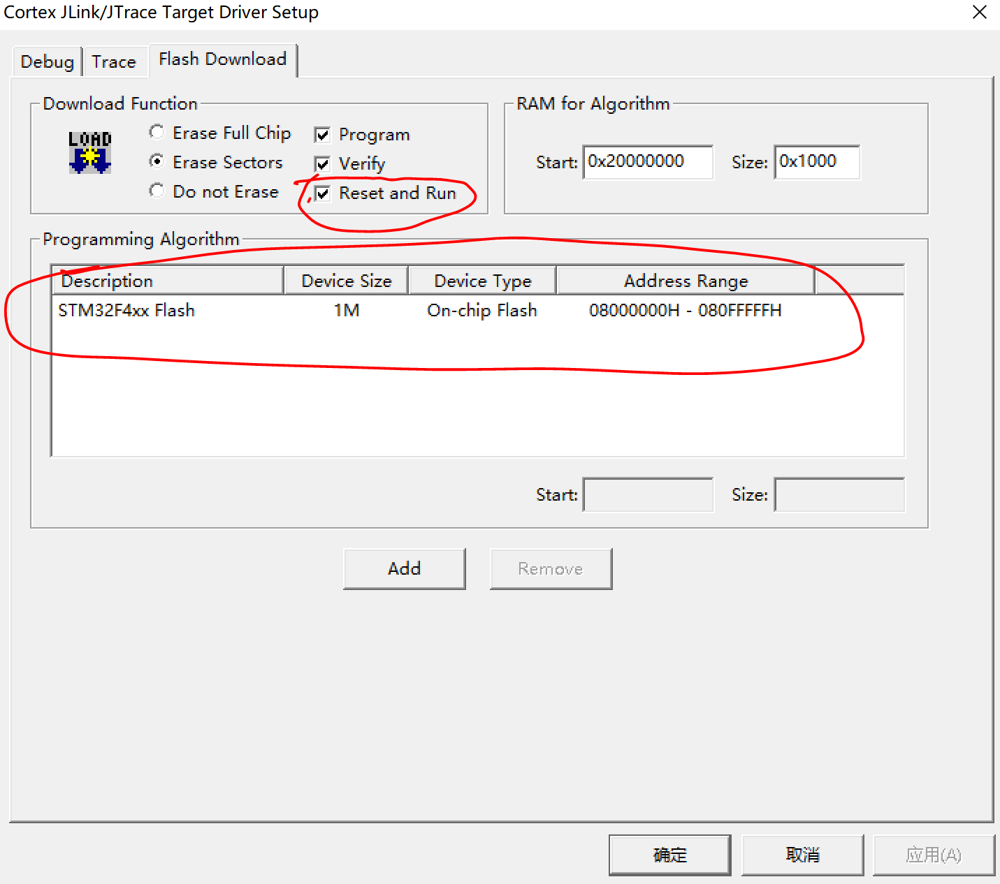

* 设置玩之后连续点击`OK`回到IDE界面
* 编译工程
* 此时`JLINK`已经配置好了，单击`LOAD`按钮就可以下载程序了

**debug部分**

略

## 第4章 STM32F4开发基础知识入门


### 4.4 I/O引脚复用器和映射

### 4.5 STM32 NVIC中断优先级管理

### 4.6 MDK中寄存器地址名称映射分析

### 4.7 MDK固件库快速组织代码技巧

## 第5章 SYSTEM文件夹介绍

### 5.2 sys文件夹代码介绍

**位带操作**

位带操作：把每个比特膨胀为一个32的字，当访问这些字的时候就达到了访问比特的目的。比如说`GPIO`的`ODR`寄存器有32位，那么可以映射到32个地址上，访问这32个地址就达到访问32个比特的目的。

位带操作的详细说明参考`《ARM Cortex-M3权威指南》 78页 ~ 92页`


## 第6章 跑马灯实验

### 6.1 STM32F4的I/O简介

本章将实现的是控制两个LED实现一个类似跑马灯的效果，关键在于如何控制STM32F4的I/O口输出。

**1. 工程目录结构**

**2. GPIO相关知识**

GPIO端口操作对应的库函数以及相关定义在文件stm32f4xx_gpio.h和stm32f4xx_gpio.c中。

**STM32F4的寄存器**

STM32F4每组通用I/O端口有10个32位寄存器控制，如下：

* 4个32位配置寄存器（常用）
  * MODER
  * OTYPER
  * OSPEEDR
  * PUPDR
* 2个32位数据寄存器（常用）
  * IDR
  * ODR
* 1个32位置位/复位寄存器
  * BSRR
* 1个32位锁定寄存器
  * LCKR
* 2个32位复用功能选择寄存器（常用）
  * AFRH
  * AFRL

**STM32F4 I/O的8种模式**

STM32F4的I/O可以由软件配置如下8种模式中的任何一种：

* 输入浮空
* 输入上拉
* 输入下拉
* 模拟输入
* 开漏输出
* 推挽输出
* 推挽式复用功能
* 开漏式复用功能

这些模式的详细介绍`http://www.openedv.com/posts/list/32730.html`

**I/O配置常用的8个寄存器**

**1） 4个重要的配置寄存器介绍与配置**

* MODER寄存器

  GPIO端口模式控制寄存器，用于控制GPIOx(STM32F4最多有9组I/O，分别用大写字母表示，即X=A、B、C、D、E、F、G、H、I)的工作模式

* OTYPER寄存器

  用于控制GPIOx的输出类型（仅用于输出模式，输入模式下不起作用）

* OSPEEDR寄存器

  用于控制GPIOx的输出速度（仅用于输出模式，输入模式下不起作用）

* PUPDR寄存器

  用于控制GPIOx的上拉/下拉

使用库函数初始化GPIO的配置寄存器


**2）GPIO输入输出电平控制相关的寄存器**

* ODR寄存器

  用于控制GPIOx的输出（仅用于输出模式，输入模式下不起作用）

* IDR寄存器

  用于读取GPIOx的输入

* BSRR寄存器

  置位/复位寄存器，这个寄存器用来置位或者复位I/O口
  
  * 该寄存器ODR寄存器具有类似的作用，都可以用来设置GPIO端口的输出位是1还是0
  * ODR寄存器要设置某个I/O电平，只需要将相关位设置为1即可。而对于ODR寄存器，要设置某个I/O口电平，需要读出来ODR寄存器的值，然后对整个ODR寄存器重新赋值来达到设置某个或者某些I/O口的目的（不过ODR可以通过位带操作来操作具体某一位），而BSRR寄存器就不需要先读取，而是直接设置。

**3） 2个复用功能选择寄存器**

* AFRH
* AFRL

**I/O操作步骤总结：**

* 使能I/O口时钟。调用函数为`RCC_AHB1PeriphClockCmd()`
* 初始化I/O参数。调用函数`GPIO_Init()`
* 操作I/O。操作I/O的方法是上面讲解的方法。

### 6.2 硬件设计

### 6.3 软件设计

介绍了从`Template`工程构建出`led`工程的过程，详细见书本P125页，这边就不详细记了。

**1. LED的初始化代码**

`led.c`

```c
#include "led.h" 

//初始化PF9和PF10为输出口.并使能这两个口的时钟		    
//LED IO初始化
void LED_Init(void)
{    	 
  GPIO_InitTypeDef  GPIO_InitStructure;

  RCC_AHB1PeriphClockCmd(RCC_AHB1Periph_GPIOF, ENABLE);//使能GPIOF时钟

  //GPIOF9,F10初始化设置
  GPIO_InitStructure.GPIO_Pin = GPIO_Pin_9 | GPIO_Pin_10;//LED0和LED1对应IO口
  GPIO_InitStructure.GPIO_Mode = GPIO_Mode_OUT;//普通输出模式
  GPIO_InitStructure.GPIO_OType = GPIO_OType_PP;//推挽输出
  GPIO_InitStructure.GPIO_Speed = GPIO_Speed_100MHz;//100MHz
  GPIO_InitStructure.GPIO_PuPd = GPIO_PuPd_UP;//上拉
  GPIO_Init(GPIOF, &GPIO_InitStructure);//初始化GPIO
	
	GPIO_SetBits(GPIOF,GPIO_Pin_9 | GPIO_Pin_10);//GPIOF9,F10设置高，灯灭

}
```

操作IO点亮led灯的三种操作:

* 直接操作库函数的方式
* 位带操作的方式
* 直接操作寄存器的方式

```c
#include "sys.h"
#include "delay.h"
#include "usart.h"
#include "led.h"


int main(void)
{ 
 
	delay_init(168);		  //初始化延时函数
	LED_Init();		        //初始化LED端口
	
  /**下面是通过直接操作库函数的方式实现IO控制**/	
	
	while(1)
	{
	GPIO_ResetBits(GPIOF,GPIO_Pin_9);  //LED0对应引脚GPIOF.9拉低，亮  等同LED0=0;
	GPIO_SetBits(GPIOF,GPIO_Pin_10);   //LED1对应引脚GPIOF.10拉高，灭 等同LED1=1;
	delay_ms(500);  		   //延时300ms
	GPIO_SetBits(GPIOF,GPIO_Pin_9);	   //LED0对应引脚GPIOF.0拉高，灭  等同LED0=1;
	GPIO_ResetBits(GPIOF,GPIO_Pin_10); //LED1对应引脚GPIOF.10拉低，亮 等同LED1=0;
	delay_ms(500);                     //延时300ms
	}
}


/**
*******************下面注释掉的代码是通过 位带 操作实现IO口控制**************************************
	
int main(void)
{ 
 
	delay_init(168);		  //初始化延时函数
	LED_Init();		        //初始化LED端口
  while(1)
	{
     LED0=0;			  //LED0亮
	   LED1=1;				//LED1灭
		 delay_ms(500);
		 LED0=1;				//LED0灭
		 LED1=0;				//LED1亮
		 delay_ms(500);
	 }
}
**************************************************************************************************
 **/	
	
/**
*******************下面注释掉的代码是通过 直接操作寄存器 方式实现IO口控制**************************************
int main(void)
{ 
 
	delay_init(168);		  //初始化延时函数
	LED_Init();		        //初始化LED端口
	while(1)
	{
     GPIOF->BSRRH=GPIO_Pin_9;//LED0亮
	   GPIOF->BSRRL=GPIO_Pin_10;//LED1灭
		 delay_ms(500);
     GPIOF->BSRRL=GPIO_Pin_9;//LED0灭
	   GPIOF->BSRRH=GPIO_Pin_10;//LED1亮
		 delay_ms(500);

	 }
 }	 
**************************************************************************************************
**/	
```


## 第7章 按键输入实验

### 7.1 STM32F4的I/O口简介

通过函数`GPIO_ReadInputDataBit()`来读取I/O状态的。

本章实现的功能：使用开发板上的按键来分别控制led灯和蜂鸣器

* `KEY_UP`控制蜂鸣器，按一次叫，再按一次停
* `KEY2`控制`DS0`，按一次亮，再按一次灭
* `KEY1`控制`DS1`，效果同`KEY2`
* `KEY0`同时控制`DS0`和`DS1`，按一次，它们的状态就翻转一次

### 7.2 硬件设计

本实验用到的硬件资源有：

* 指示灯`DS0` `DS1`

* 蜂鸣器

* 4个按键：

  * `KEY0`（连接在`PE4`）
  *  `KEY1`（连接在`PE3`）
  *  `KEY2`（连接在`PE2`）
  *  `KEY_UP`（连接在`PA0`）

  注意：`KEY0` `KEY1`和`KEY2`是低电平有效的，而`KEY_UP`是高电平有效的，并且外部都没有上下拉电阻，所以，需要在STM32F4内设置上下拉

按键与STM32F4的连接原理图如下：

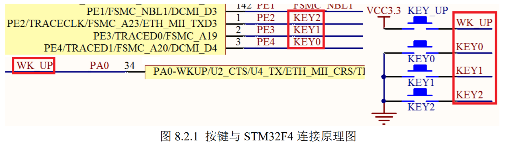

### 7.3 软件设计

略

### 7.4 下载验证

略


# 视频学习

## 第2讲 开发板入门

**参考资料**

* 探索者`STM32F407`开发板：A盘资料
* 网络资源
  * 开源电子网：`http://www.openedv.com/`
  * ST官方社区：`http://www.stmcu.org/`
  * 百度、谷歌搜索

### 1. 开发板如何验收

根据验收的文档进行验收，文档位置：

`探索者F4 资料盘(A盘)\1，ALIENTEK探索者STM32F4开发板入门资料\探索者 STM32F407开发板常见问题汇总.pdf`

### 2. 如何从光盘查找资料

主要介绍如何从A盘查找资料

* **1. 联想法：**

  A盘的资料都是按类型存放的，熟悉目录结构后，可以根据需要的资料类型去各个目录查找

* **2. 索引法**

  从光盘结构的`txt`里面搜索:`探索者F4 资料盘(A盘)\01探索者STM32F4开发板光盘结构(必读).txt`

* **3. 直接法**

  直接搜目录的名字

### 3. 如何查看原理图

常见的问题：

**1. 开发板原理图找不到**

原理图位置：`探索者F4 资料盘(A盘)\3，ALIENTEK探索者STM32F4开发板原理图\Explorer STM32F4_V2.2_SCH.pdf`

**2. 我的外设时`5V`的，可以直接接`STM32`IO么？**

`STM32`的IO口，绝大部分都是兼容`5V`的，至于到底哪些兼容，可以查看`STM32`的数据手册（注意不是参考手册），里面的引脚描述表（pin definitions）有详细的标注，凡是带FT标志的IO口，都是兼容`5V`，凡是带有ADC字样的IO，都不兼容5V。

* 参考手册

  `探索者F4 资料盘(A盘)\8，STM32参考资料\STM32F4xx中文参考手册.pdf`

* 数据手册

  `探索者F4 资料盘(A盘)\7，硬件资料\3，芯片资料\STM32F407ZGT6.pdf`

**3. 想用xxx外设（比如：ADC/SPI/PWM等），应该用哪几个IO？**

正点原子的所有开发板的原理图，都提供了详细的IO功能标注，每个IO的复用，都已经体现在原理图上，所以，可以根据原理图找到某个外设所用的IO。

**4. 有哪些空闲的IO口**

如果有一个应用需要十几个IO口，开发板哪些IO口可以拿来用

根据所需要的IO口的特性来选择。有两种情况：

* 要完全独立的IO（即不能有任何外设连接的IO）
* 允许IO口挂其他外设，但是必须可以单独做输入/输出使用

如果使用第2种情况，则可供使用的IO会多很多，如果指只能第1种情况，那么，可供选择的IO会少一些，这个要根据自己的实际情况去分析，到底需要哪种IO口。

可以根据`探索者F4 资料盘(A盘)\3，ALIENTEK探索者STM32F4开发板原理图\探索者IO引脚分配表.xlsx`来查看哪些IO可用。

### 4. 使用时有哪些注意事项

主要注意事项：

**1. 供电注意事项**

* `DC005`接口，供电范围时`6~24V`，请不要违规供电
* `VOUT2(2*3排针)`可以做`5V`输出/输入
* 当开发板外接负载较重（电流大）时，请提供足够电源
* 开发板不支持`JLINK`等仿真供电，请不要尝试。
* 正常供电后，蓝色电源指示必须灯亮着，才可使用开发板。

**2. 例程测试注意事项**

开发板例程测试的时候，有如下注意事项：

* 下载正确的例程测试（不要张冠李戴）
* 每个例程都有`readme.txt`，阅读里面的内容
* 例程都有教程（开发指南/不完全手册等），根据教程测试
* 例程测试时，请确保开发板`B0`，`B1`都接在`GND`

**3. IO使用注意事项**

* IO口不一定要接超过`5V`的电压
* 不要用IO口直接驱动感性负载（电机/电磁阀/继电器等）
* 外接其他外设时，先做好IO选型，选择适合的IO口
* 注意防经典

### 5. 使用过程中遇到问题怎么办

略


## 第3讲 `STM32`学习方法

### 1. 网络学习资源介绍

* 推荐学习网站：

  `www.openedv.com`开源电子网

  `www.stmcu.org`ST中国官方技术网站，ST官方文档发布网站

* 微信公众平台：`正点原子`
* 淘宝店铺

### 2. 拿到开发板怎么入手

如何开启学习之旅

* 先看光盘目录，了解提供的资料情况
* 找到核心学习资料，大致了解开发板硬件资源
* 查看资料，安装开发环境
* 开启学习之旅，先学基础的，基础要多学多问
* 学习过程中不懂的，先找资料，然后提问
* 高级的知识，可以慢慢来学

### 3. 学习开发板要参考哪些资料

参考资料：

* 最底层（了解）：`CM3权威指南`/`CM4权威指南`（ARM提供）

* 芯片参考手册（芯片功能寄存器描述特性等，详细）（了解）：

  `STM32F10x中文参考手册`/`STM32F4xx`中文参考手册（ST提供）

* 芯片数据手册（`datasheet`, `ds`）（了解）

  `STM32F103xCDE_DS_CH_V5.pdf`（芯片电气参考，引脚说明等）

* 官方其他资源和教程（了解）

  固件库包（含参考源码），一些官方培训PPT

  ST官方资料下载地址：`www.stmcu.org`

* 特定开发板学习教程（手册，视频，源码）（理解）

  针对开发板的源码、教程、视频等

### 4. 要掌握哪些基本技能

* 熟练掌握C语言
* 熟练掌握一种开发环境
  * 掌握一种开发环境：`Keil uVision5`
  * 掌握一个调试工具：`JTAG`必备
  * 多使用`JTAG`调试代码，深入理解代码执行流程。
  * 库函数和寄存器对比学习
    * 不止学习会用库函数，还要了解寄存器配置原理
    * 尤其前面几个章节实验，最好了解寄存器配置，加深对STM32本质的理解
* 深入学习基本外设，选择性学习高级功能
  * 基本外设
    * `GPIO`输入输出，外部中断，定时器，串口
    * 理解了这四个外设，基本就入门了一款`MCU`
  * 基本外设接口
    * `SPI`、`IIC`、`WDG`、`FSMC`、`ADC/DAC`、`SDIO`等
    * 这些外设接口功能原理对每个芯片几乎都是一样。对芯片而已就是加减法而已。
  * 高级功能
    * `UCOS`、`FATFS`、`WMWIN`等，以及一些应用。

### 5. 总结

* 找到`STM32F4`中文参考手册：
  * 全面系统的介绍`STM32`各类知识，非常全面
* 找到要学习芯片的数据手册（`datasheet`，英文）
  * `datasheet`一般包含了引脚功能定义，各种电器参数，功能描述
* 开发的论坛：多交流互动
* ST中文官方网站

推荐学习方法：

* 视频 + 开发板配套教程 + 开发板配套源码 + 芯片官方手册搭配学习

视频介绍

* 准备篇：背景知识准备
* 初级篇：基本入门`STM32`
* 中级篇：提升`STM32`
* 高级篇：摄像头/文件系统等
* 系统：`UCOS`/`LWIP`/`EMWIN`

## 第4讲 开发板资源描述

参考资料：

* `《STM32F4开发指南-库函数版本》第1，2章`

* 探索者原理图：`Explorer STM32F4_Vx.x_SCH`

开发板外观说明：

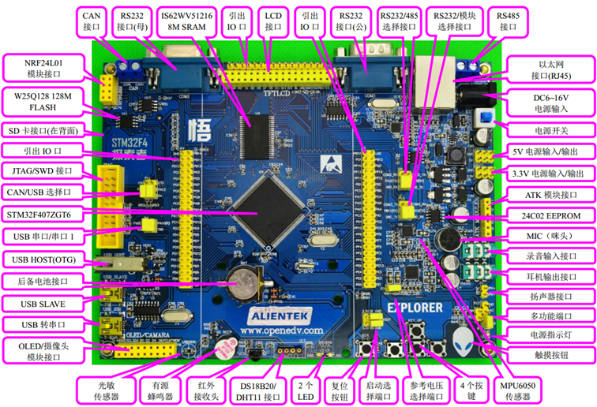

供电：

* 可以使用`DC6~16V`进行供电
* 在功耗不是很高的情况下，也可以使用`USB SLAVE`或`USB转串口`进行供电

## 第5讲 STM32初探-M4

### 1. M4特点：内核，低功耗，外设

#### 1.1 什么是STM32

* 新的基于ARM内核的32位MCU系列
  * 内核为`Cortex-M`内核
  * 标准的ARM架构
* 超强的体系结构
  * 高性能
  * 低电压
  * 低功耗
  * 创新的内核以及外设
* 简单易用、自由、低风险
* `Cortex-M4`采用`ARMv7-ME`架构
  * `ARMv7`架构定义了三大分工明确的系列
    * “A”系列：面向尖端的基于虚拟内存的操作系统和用户应用
    * “R”系列：针对实时系统
    * “M”系列：对微控制器
* `Cortex-M3`采用`ARMv7-M`架构，`Cortex-M0`采用`ARMv6-M`架构，`Cortex-A5/A8`采用`ARMv7-A`架构，传统的`ARM7`系列采用的是`ARMv4T`架构

#### 1.2 Cortex内核

##### 1.2.1 STM32和ARM的发展：


##### 1.2.2 `Cortex-M4`内核的介绍

略

#### 1.3 `Cortex-M`内核对比

略

#### 1.4 `Cortex-M4`低功耗设计

略

#### 1.5 `Cortex-M4`更高级的外设

略

### 2. STM32芯片家族

#### 2.4 STM32命名规则

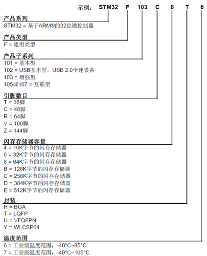

### 3. 总结

略

## 第6讲 STM32芯片解读

参考资料

* `STM32F4数据手册`：`STM32F407ZGT6.pdf`
* `STM32F4中文手册`：`STM32F4xx中文参考手册.pdf`
* `开发板原理图`：`Explorer STM32F4_Vxx_SCH.pdf`

### 1. 芯片的资源

#### 1.1 芯片内部资源

通过`芯片选型手册`可查看芯片的内部资源

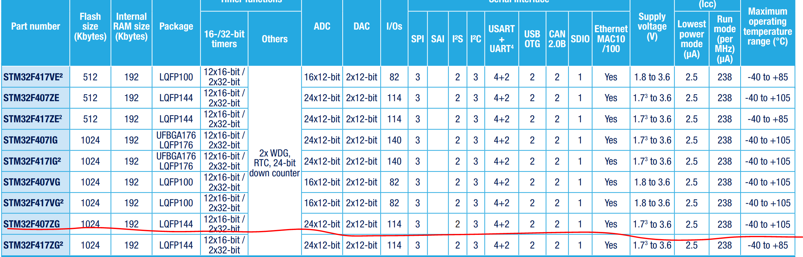

`STM32F407ZGT6`资源描述

* 内核
  * 32位高性能`ARM Cortex-M4`处理器
  * 时钟：高达`168M`，实际还可以超频一点点
  * 支持FPU(浮点运算)和DSP指令
* IO口：
  * `STM32F407ZGT6`:144引脚 114个IO
    * 大部分IO口都耐5V(模块通道除外)
    * 支持调试：SWD和JTAG，SWD只要2根数据线
* 存储容量器：1024k FLASH，192K SRAM
* 时钟、复位和电源管理：
  * 1.8~3.6V电源和电压
  * 上电复位，掉电复位和可编程的电压监控
  * 强大的时钟系统
    * 4~26M的外部高速晶振
    * 内部16MHz的高速RC震荡器
    * 内部32KHz低速RC振荡器，看门狗时钟
    * 内部锁相环（PLL，倍频），一般系统时钟都是外部或者内部高速时钟经过PLL倍频后得到
    * 外部低速32.768K的晶振，主要做RTC时钟源
* 低功耗：
  * 睡眠、停止和待机三种低功耗模式
  * 可用电池为RTC和备份寄存器供电
* AD:
  * 3个12为AD(多达24个外部测量通道)
  * 内部通道可用于内部温度测量
  * 内部参考电压
* DA:
  * 2个12为DA
* DMA:
  * 16个DMA通道，带FIFO和突发支持
  * 支持外设：定时器、ADC、DAC、SDIO、I2S、SPI、I2C和USART

* 定时器：多达17个定时器
  * 10个通用定时器（TIM2和TIM5是32位）
  * 2个基本定时器
  * 2个高级定时器
  * 1个系统定时器
  * 2个看门狗定时器
* 通信接口：多达17个通信接口
  * 3个I2C接口
  * 6个串口
  * 3个SPI接口
  * 2个CAN 2.0
  * 2个USB OTG
  * 1个SDIO

### 2. 芯片的内部结构

参考资料：数据手册`STM32F40ZGT6.pdf`第17页

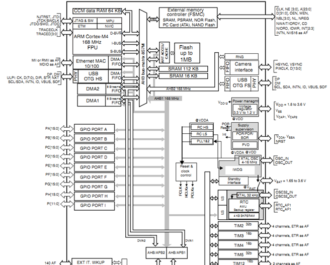

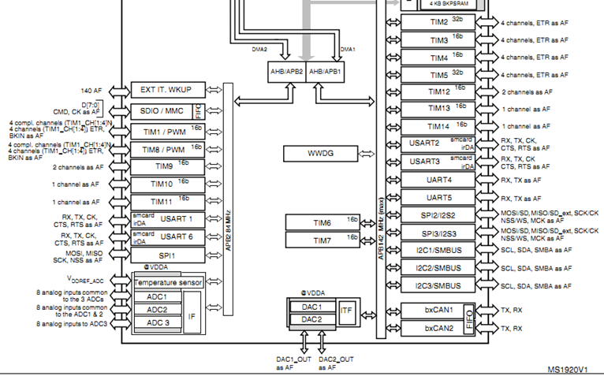

### 3. 芯片引脚和功能怎么对应

查看数据手册引脚功能表，可以知道引脚的对应功能：

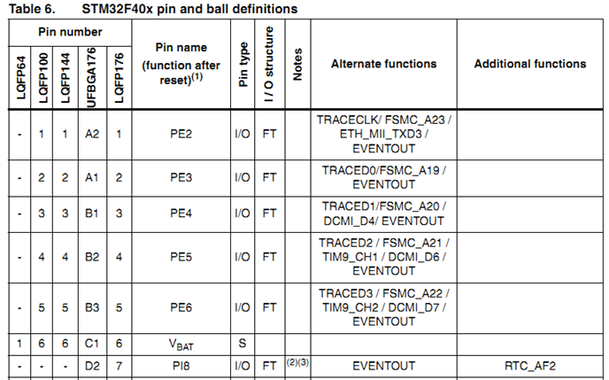

### 4.`STM32F4`最小系统设计

* STM32最小系统--看原理图
  * 供电
  * 复位
  * 时钟：外部晶振（2个）
  * Boot启动模式选择
  * 下载电路（串口/JTAG/SWD）
  * 后背电池

## 第7讲 开发环境搭建

### 1 MDK软件安装

### 2. USB串口驱动安装

`探索者F4 资料盘(A盘)\6，软件资料\1，软件\CH340驱动(USB串口驱动)_XP_WIN7共用\SETUP.EXE`

### 3.  JLINK驱动安装 

`探索者F4 资料盘(A盘)\6，软件资料\1，软件\JLINK驱动\Setup_JLinkARM_V415e.exe`

## 第8讲 程序下载方法1：ISP串口下载

### 1. 硬件连接

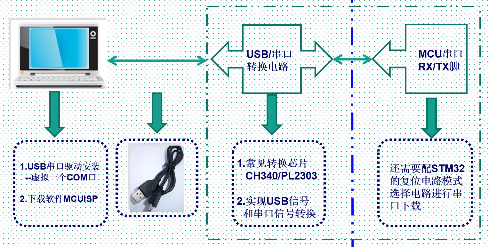

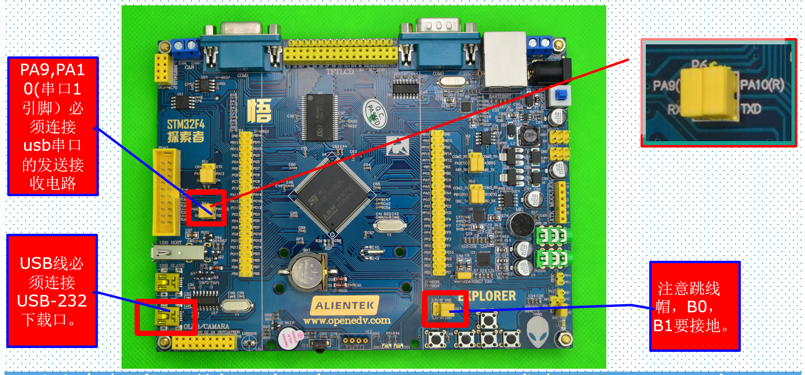

特别注意：

STM32的ISP下载，只能使用串口1，也就是对应串口发送接收引脚PA9、PA10。不能使用其他串口（例如串口2：PA2、PA3）来进行ISP下载。

 ### 2. 一键下载方法

环境准备：CH340驱动安装（参考环境准备视频）

下载工具配置：mcuips(FlyMcu)

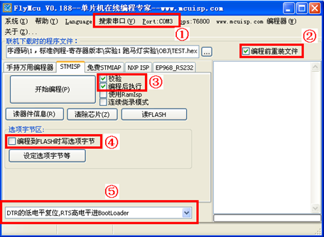

1. 搜索串口，选择虚拟出来的USB串口：

   `COMx:空闲USB-SERIAL CH340`

2. 勾选上“编程前重装文件”

3. 勾选上：“校验”以及“编程后执行”

4. 选项字节的“编程到FLASH时写选项字节” 不要勾选

5. 左下方：选择第四个

   DTR的低电平复位，TRS高电平进bootloader

注意：波特率不要选太高，不能超过76800

### 3. STM32启动模式

#### 3.1 STM32启动模式

STM32直接通过两个引脚Boot0和Boot1设置启动模式：

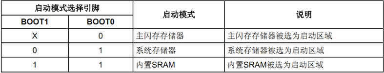

参考资料：

* M3 《STM32中文参考手册V10》2.4小节 表6

* M4《STM32F4中文参考手册》2.4小节 表3

#### 3.2 ISP下载一般步骤：

* Boot0接3.3V，Boot1接GND
* 按复位按键，实现下载

#### 3.3 程序执行的一般步骤：

* mcuisp/flymuc勾选“编程后执行 ”，发送命令直接从FLASH启动
* Boot0接GND，Boot1接任意，按一次复位

#### 3.4 一键下载原理：

一键下载电路，则利用串口的DTR和RTS信号，分别控制STM32的复位和B0，配合上位机软件（mcuisp），设置：DTR的低电平复位，RTS高电平进BootLoader，这样，B0和STM32的复位，完全可以由下载软件自动控制，从而实现一键下载。

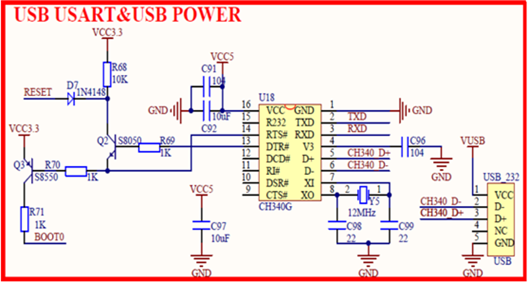

#### 3.5 不使用一键下载，CH340参考电路

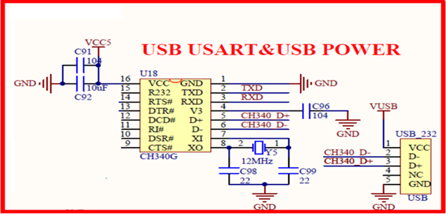


## 第9讲 程序下载方法2：JLINK程序下载

参考资料：

* 《STM32F4开发指南--库函数版本》 3.4.2小节 JLINK下载与调试
* `1，ALIENTEK XX开发板入门资料/JLINK问题汇总_Vxx.pdf`

### 1. JLINK与开发板硬件连接

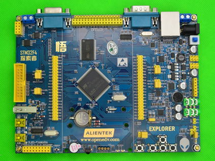

### 2. JLINK下载配置过程

下载环境：

* JLINK驱动
* MDK5安装

MDK软件上配置JLINK

### 3. 下载常见问题

参考：`JLINK问题汇总_Vxx.pdf`

## 第10讲 新建基于固件库的工程模板

### 1. 新建STM32F4工程模板

#### 1.1 库函数和寄存器的区别：

本质上是一样的。

* 可以在库函数模板里面，直接操作寄存器，因为官方库相关头文件有寄存器定义。
* 但是不能在寄存器模板调用库函数，因为没有引入库函数相关定义。

必须对寄存器有一定的了解，才能找到问题，因为调试代码，底层只能查看寄存器相关配置。

#### 1.2 新建工程模板

* 开发环境：MDK5

* 固件库版本：V1.4(F4专用)

  `探索者F4 资料盘(A盘)\8，STM32参考资料\1，STM32F4xx固件库\stm32f4_dsp_stdperiph_lib\STM32F4xx_DSP_StdPeriph_Lib_V1.4.0`

* 参考资料：`STM32F4开发指南-库函数版本_V1.1.pdf` `第3.3.2节 新建工程模板`

**新建工程模板**

**1. 在Template目录下新建5个文件夹**

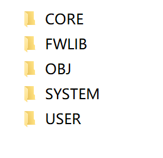

**2. 打开Keil，新建工程**

* 点击Keil的菜单：`Project –>New Uvision Project`
* 将目录定位到刚才建立的文件夹Template之下的USER子目录
* 工程取名为Template之后点击保存，我们的工程文件就都保存在USER文件夹下

**3. 选择对应的固件库**

接下来会出现一个选择Device的界面，来选择芯片的型号，定位到`STMicroelectronics->STM32F4 Series->STM32F407->STM32F407ZG`（一定要安装对应的器件包才会显示这些内容）

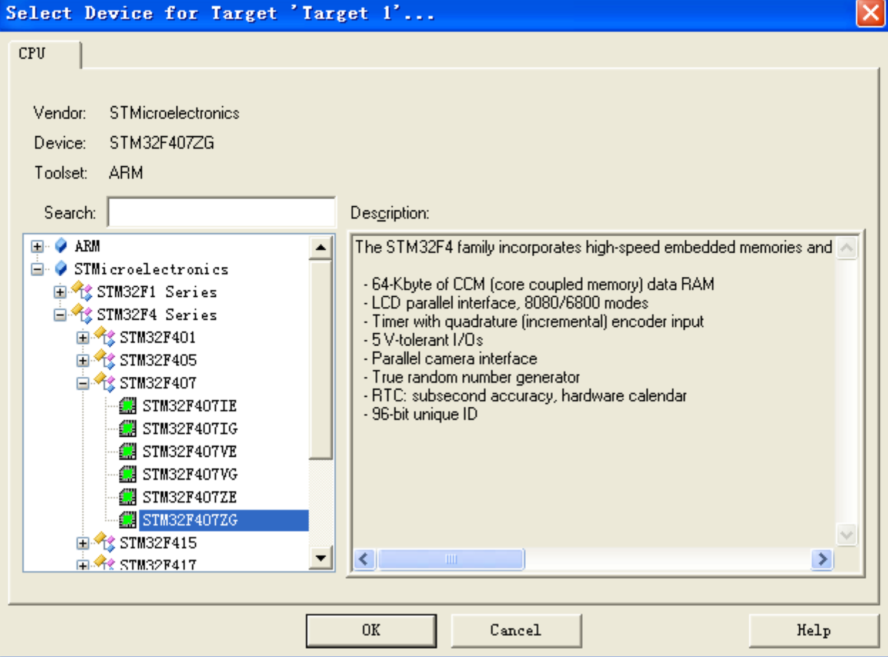

弹出的界面cancel就可以了

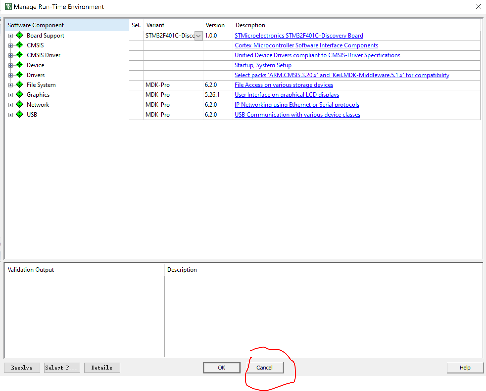

**4. 观察USER目录**

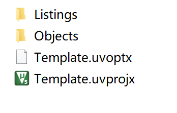

* `Template.uvprojx`

  是工程文件，不能删除

* `Listings`和`Objects`

  是MDK自动生成的文件夹，用于存放编译过程产生的中间目录。这里，我们把两个文件夹删除，我们会在下一步骤中新建一个OBJ文件夹，来存放编译中间文件。（不删除这两个文件夹也没关系，只是我们不用它而已）

**5. 将官方固件包里的源码文件复制到工程目录FWLib文件夹下面**

将固件库包目录`stm32f4_dsp_stdperiph_lib\STM32F4xx_DSP_StdPeriph_Lib_V1.4.0\Libraries\STM32F4xx_StdPeriph_Driver`下的`src`、`inc`文件夹拷贝到我们刚才建立的`FWLib`文件夹下面


**6. 将固件库包里面相关的启动文件复制到工程目录CORE之下**

* 打开固件库包目录`stm32f4_dsp_stdperiph_lib\STM32F4xx_DSP_StdPeriph_Lib_V1.4.0\Libraries\CMSIS\Device\ST\STM32F4xx\Source\Templates\arm`，将文件`startup_stm32f40_41xxx.s`复制到CORE目录下面，然后定位到

* 定位到目录`stm32f4_dsp_stdperiph_lib\STM32F4xx_DSP_StdPeriph_Lib_V1.4.0\Libraries\CMSIS\Include`,将4个头文件复制到CORE目录下：

  * `core_cm4.h`
  * `core_cm4_simd.h`
  * `core_cmFunc.h`
  * `core_cmInstr.h`

  复制完后的CORE目录如下：

  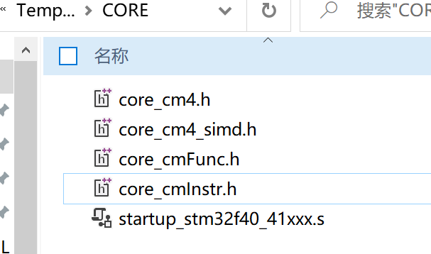

**7. 复制工程模板需要的一些其他头文件和源文件到工程中**

* 复制目录`stm32f4_dsp_stdperiph_lib\STM32F4xx_DSP_StdPeriph_Lib_V1.4.0\Libraries\CMSIS\Device\ST\STM32F4xx\Include`下的2个头文件到USER目录下

  * `stm32f4xx.h`
  * `system_stm32f4xx.h`

  这两个头文件是`STM32F3`工程非常关键的两个头文件（后续课程会讲解）

* 复制目录`stm32f4_dsp_stdperiph_lib\STM32F4xx_DSP_StdPeriph_Lib_V1.4.0\Project\STM32F4xx_StdPeriph_Templates`下的5个文件到USER目录下：

  * `main.c`
  * `stm32f4xx_conf.h`
  * `stm32f4xx_it.c`
  * `stm32f4xx_it.h`
  * `system_stm32f4xx.c`

* 相关文件复制完之后的USER目录入下图所示

  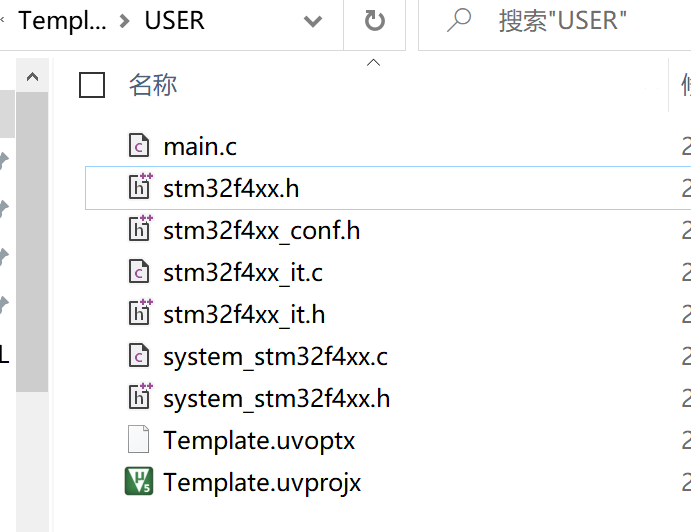

**8. 将前面复制的固件库相关文件加入到我们的工程中**

右击Target1，选择`Manage Project Items`，如下图所示：

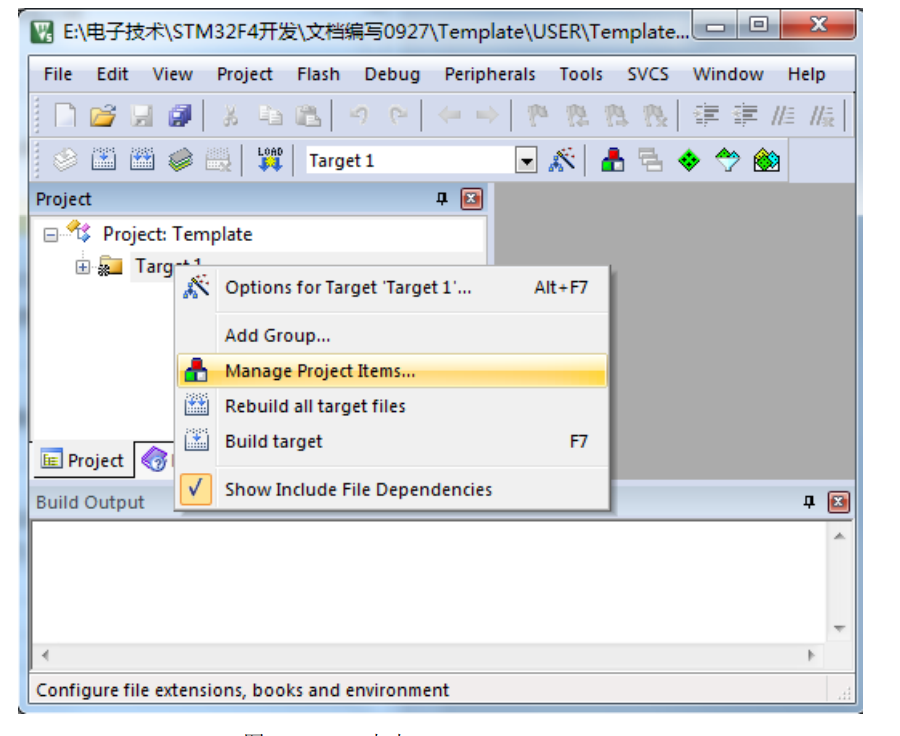

**9. 修改工程名并建立分组**

* `Project Targets`一栏：将Target名字修改为Template

* `Groups`一栏：

  * 将`Source Group1`删除
  * 建立三个`Groups`:
    * USER
    * CORE
    * FWLIB
  * 点击OK

  修改完如下图所示：

  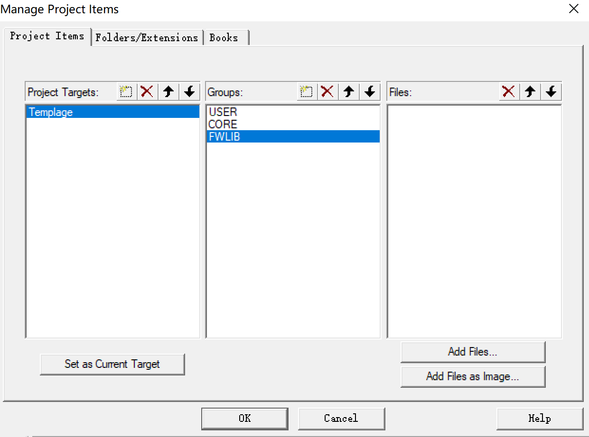

**10. 往Group里面添加需要的文件**

右击`Template --> Manage Project Items --> 选择需要添加文件的Groups`

* `FWLIB`

  * 操作：`选择FWLIB --> Add Files --> 定位目录\FWLIB\src --> 全选（Ctrl+A） -->Add --> Close`

    操作完之后，可以看到如下图所示

    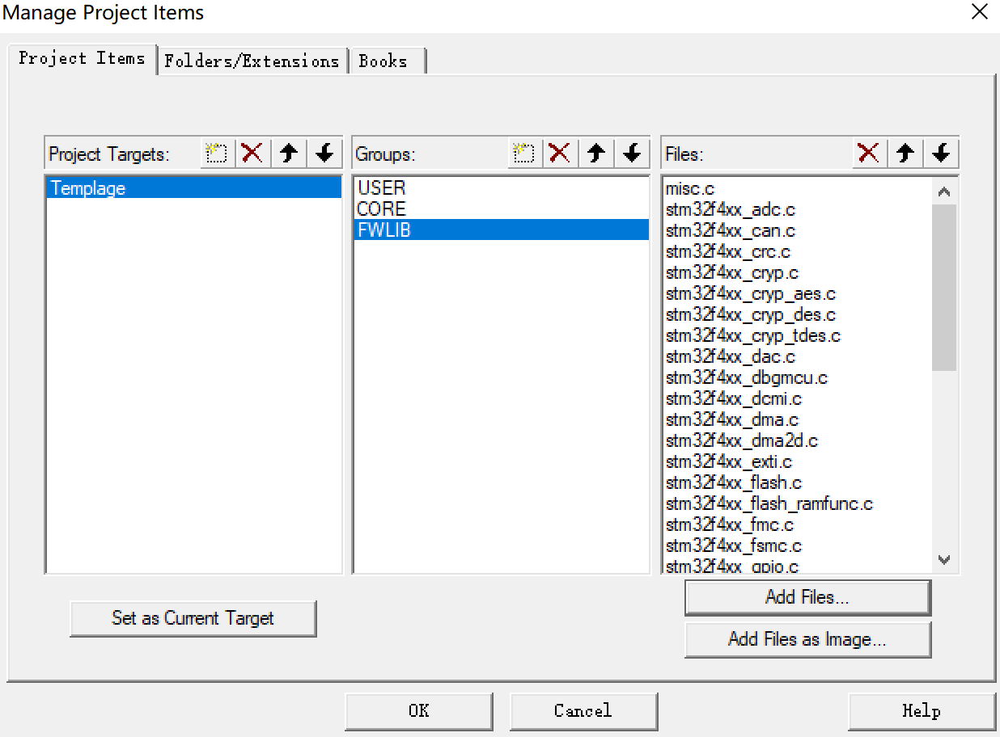

  * 删除`stm32f4xx_fmc.c`

    这个文件比较特殊，它时STM32F42和STM32F43系列才用到。

  * 说明：如果只用到了其中的某个外设，可以不添加其他外设的库文件。例如只用到`GPIO`就可以只添加`stm32fxx_gpio.c`而其他的可以不用添加。这里我们选择全部添加进来时为了后面方便，不用每次添加（坏处时编译起来较慢）。

* `CORE`

  `CORE`需要添加的文件为：

  * `startup_stm32f40_41xxx.s`（默认添加的文件类型为`.c`，需要选择文件类型为`All files`才能看到这个文件）

    添加完之后如下图所示

    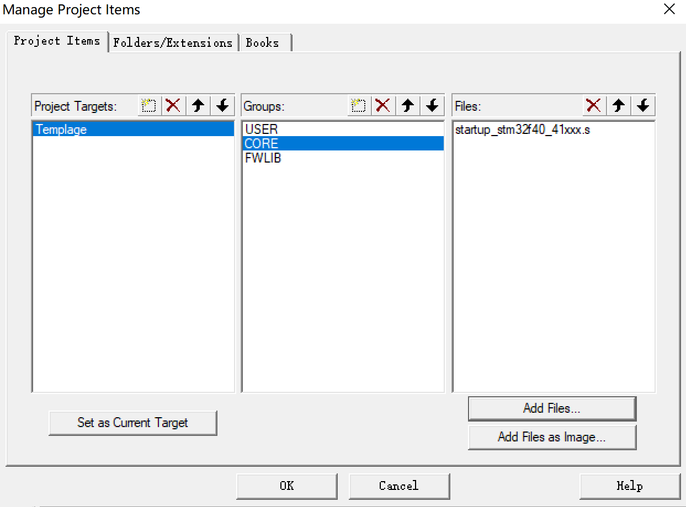

* `USER`

  `USER`需要添加的文件为

  * `main.c`

  * `stm32f4xx_it.c`

  * `system_stm32f4xx.c`

    添加完之后如下图所示：

    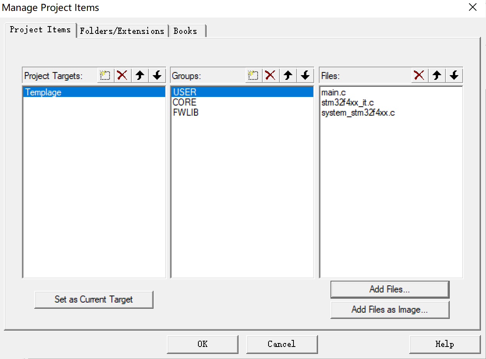

**12. 设置头文件存放路径**

操作如下图所示：

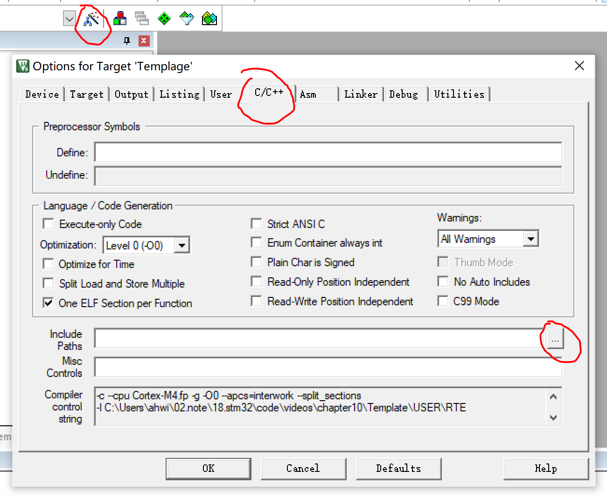

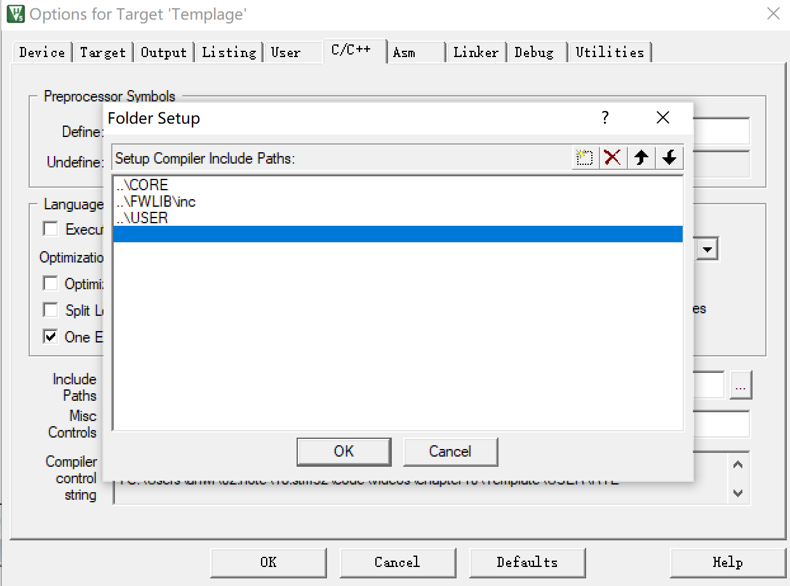

**13. 添加全局宏定义标识符**

添加`STM32F40_41xxx,USE_STDPERIPH_DRIVER`到选项`Define`中

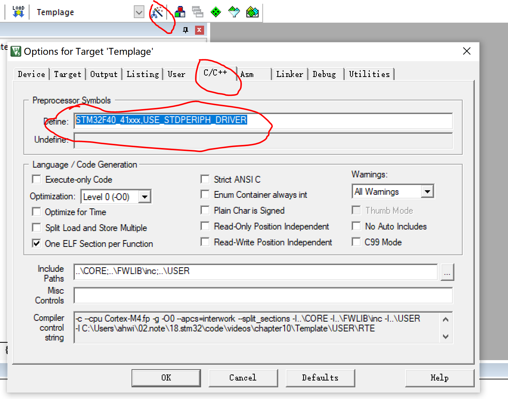

**14. 选择编译中间文件的存放目录**

* 步骤：`选择魔术棒-->选择Output-->点击Select Folder for Objects... --> 选择OBJ目录`。
* 勾选如下的下个选项。
  * `Debug Information`
  * `Create HEX File`：选项要求编译之后生成HEX文件
  * `Browse Information`：选项方便查看工程中的一些函数变量定义

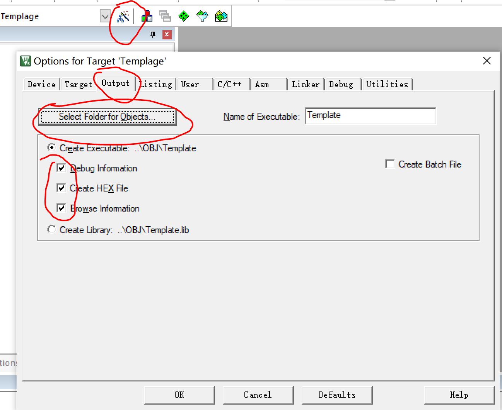

**15. 往工程里面添加代码**

* 往`main.c`里面添加代码（可以从`实验0 Template工程模板中拷贝`）：

  ```c
  #include "stm32f4xx.h"
  
  void Delay(__IO uint32_t nCount);
  
  void Delay(__IO uint32_t nCount)
  {
    while(nCount--){}
  }
  
  int main(void)
  {
  
    GPIO_InitTypeDef  GPIO_InitStructure;
    RCC_AHB1PeriphClockCmd(RCC_AHB1Periph_GPIOF, ENABLE);
  
    GPIO_InitStructure.GPIO_Pin = GPIO_Pin_9 | GPIO_Pin_10;
    GPIO_InitStructure.GPIO_Mode = GPIO_Mode_OUT;
    GPIO_InitStructure.GPIO_OType = GPIO_OType_PP;
    GPIO_InitStructure.GPIO_Speed = GPIO_Speed_100MHz;
    GPIO_InitStructure.GPIO_PuPd = GPIO_PuPd_UP;
    GPIO_Init(GPIOF, &GPIO_InitStructure);
  
    while(1){
  		GPIO_SetBits(GPIOF,GPIO_Pin_9|GPIO_Pin_10);
  		Delay(0x7FFFFF);
  		GPIO_ResetBits(GPIOF,GPIO_Pin_9|GPIO_Pin_10);
  		Delay(0x7FFFFF);
  	
  	}
  }
  ```

* 将`USER`分组下面的`stm32f4xx_it.c`文件内容清空。

  或者删除其中的32行对应的`main.h`头文件的引入，以及144行`SysTick_Handler`函数内容，如下图所示：

  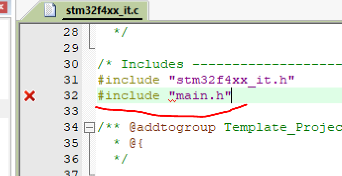

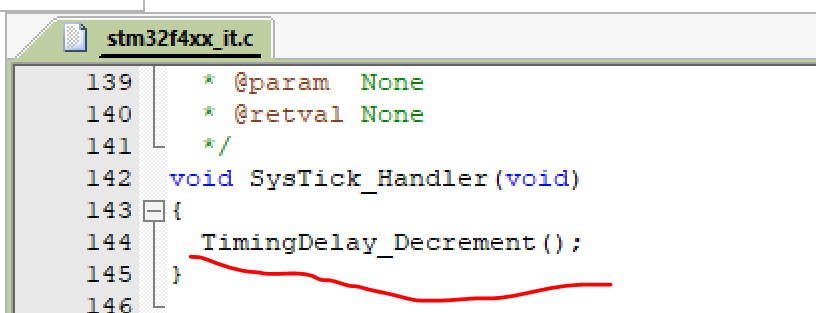

**16 编译工程**

可以看到无编译错误和警告

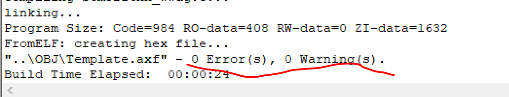

**17. 烧录hex文件**

可以参考`3.4小节`的内容，将hex文件下载到开发板，会发现两个led灯不停的闪烁

**18. 修改系统时钟的配置**

* 修改`System_stm32f4xx.c`文件，把PLL第一级分帧系数M修改为8，这样达到主时钟频率168MHz。(详细原因会在4.3小节讲解)

  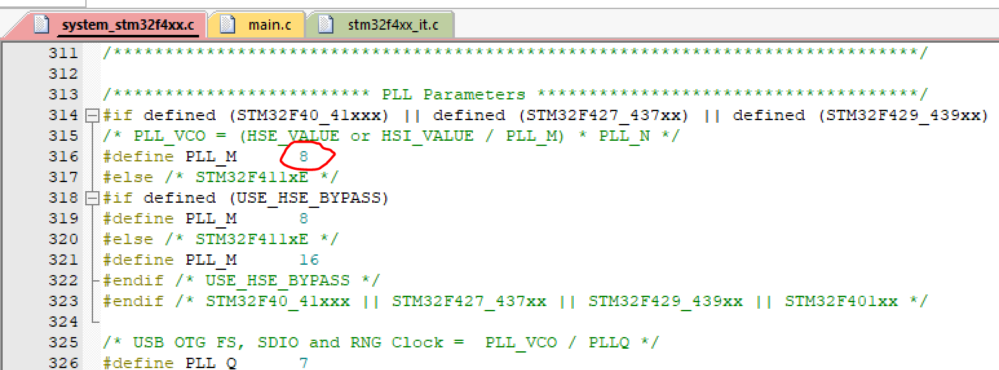

* 修改`stm32f4xx.h`的外部时钟`HSE_VALUE`值为`8MHz`，因为我们的外部高速时钟用的晶振为`8M`，修改方法如下图：

  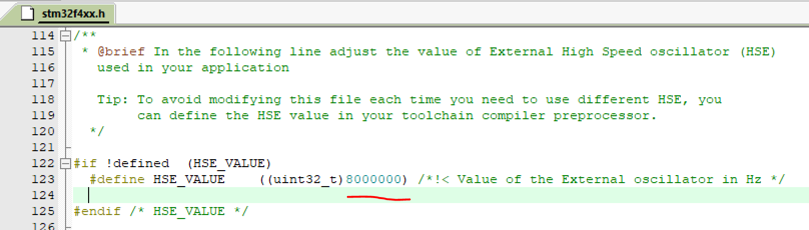

**19. 添加正点原子编写的公共库**

经过上面的步骤，工程模板已经建立完成，但在`ALIENTEK`提供的实验中都有一个`SYSTEM`文件夹，下面有3个子目录分别为`sys`、`usart`、`delay`，存放的时每个实验要用到的公共库，该代码由`ALIENTEK`编写（在第5章STSTEM文件夹会有详细的讲解）。下面将其引入到工程中：

* 拷贝`实验0 Template工程模板\SYSTEM`下的文件夹到`SYSTEM`目录下

* 将这`SYSTEM`文件夹里面的三个子目录下的源文件加入到工程中，同时将头文件加入到PATH中

  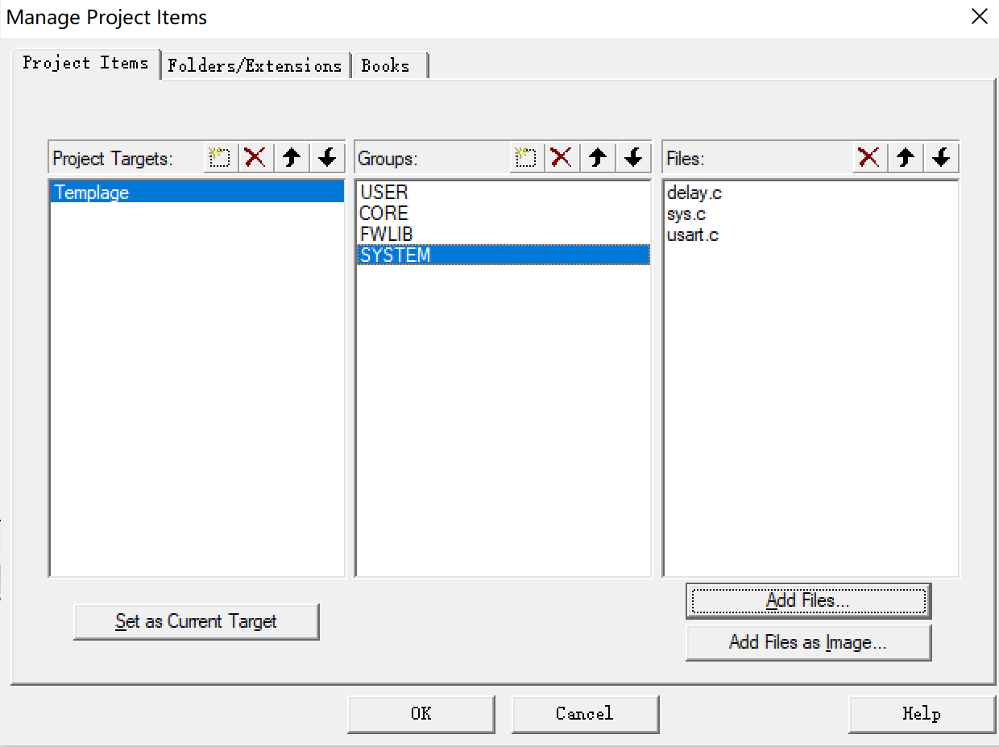

  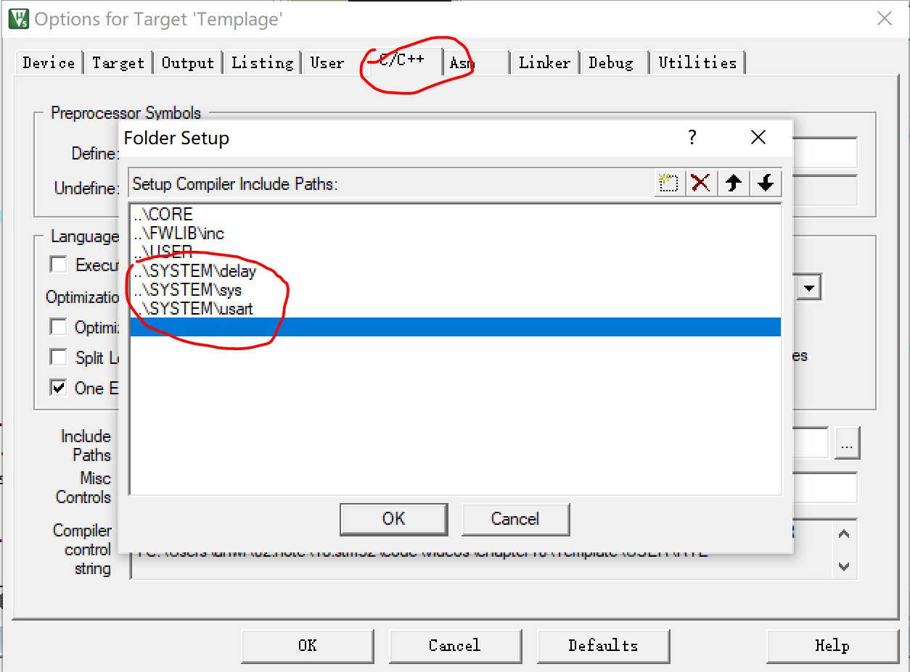

**20. 测试`SYSTEM`文件夹里面的函数**

修改`main.c`的内容，测试`SYSTEM`文件夹里面的一些头文件和函数

修改后`main.c`的内容如下：

```c
#include "stm32f4xx.h"
#include "usart.h"
#include "delay.h"

int main(void)
{
	u32 t=0;
	uart_init(115200);
	delay_init(84);
	
  while(1){
    printf("t:%d\r\n",t);
		delay_ms(500);
		t++;
	}
}
```


### 2. STM32F4固件库包简介

视频没讲

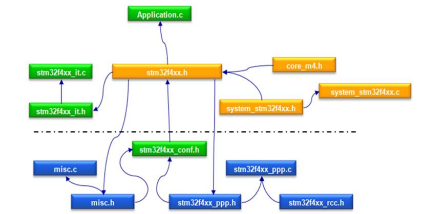

## 第11讲 新建工程模板--基于寄存器

略过

## 第12讲 GPIO工作原理

### 1. GPIO基本结构和工作方式

#### 1.1 GPIO基本结构

**参考资料**

* 探索者STM32F4开发板：

  《STM32F4开发指南-库函数版本》-第六章 跑马灯实验6.1小节

* STM32F4xx官方资料：

  《STM32F4xx中文参考手册》-第7章 通用IO

  芯片数据手册

**引脚说明**

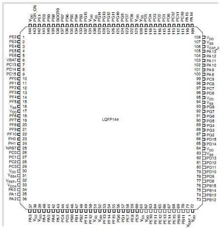

STM32F407ZGT6的引脚：

* 一共有7组IO口，每组IO口有16个IO，一共16*7=112个IO （GPIOA,GPIOB）
* 外加2个PH0和PH1一共114个IO口

**引脚复用**

STM32的大部分引脚除了当GPIO使用外，还可以复用为外设功能引脚（比如串口），这部分知识会在后面说明。

#### 1.2 GPIO工作方式

* 4种输入模式
  * 输入浮空
  * 输入上拉
  * 输入下拉
  * 模拟输入
* 4种输出模式
  * 开漏输出（带上拉或者下拉）
  * 开漏复用功能（带上拉或者带下拉）
  * 推挽式输出（带上拉或者下拉）
  * 推挽式复用功能（带上拉或者下拉）
* 4种最大输出速度
  * 2MHZ
  * 25MHZ
  * 50MHZ
  * 100MHZ

8种工作模式的区别：`STM32八种IO口模式区别.pdf`


### 2. GPIO寄存器说明

### 3. STM32F4xx GPIO引脚说明


# 洋桃补习班（为0基础的初学者补足基础知识）

## 第1讲 ARM内核、RISC、32位

### ARM内核

介绍ARM系列

### RISC

RISC：精简指令集

### 32位

ARM处理器本身是32位的处理器
