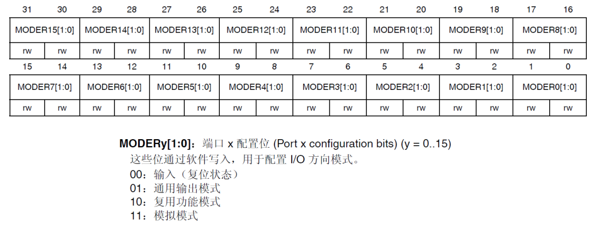
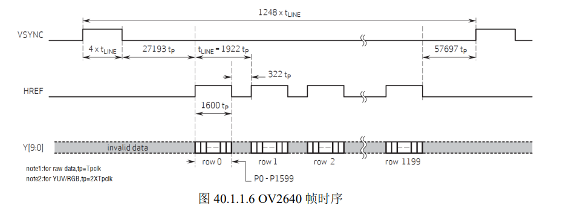

# 前言

STM32F4家族目前拥有：STM32F40x、STM32F41x、STM32F42x和STM32F43x等几个系列，数十个产品型号，不同型号之间软件和引脚具有良好的兼容性，可方便客户迅速升级产品。

学习STM32F4有几分资料经常用到：

* 《STM32F4xx中文参考手册》

  最常用的是《STM32F4xx中文参考手册》，该文档是ST官方针对STM32的一份通用参考资料，内容翔实，但是没有实例，也没有对Cortex-M4架构进行多少介绍，读者只能根据之间对书本的理解来编写相关代码，该文档目前已经有中文的版本。

* 《STM32F3与F4系列Cortex M4内核编程手册》英文版

  该文档重点介绍了Cortex M4内核的汇编指令及其使用，以及内核相关寄存器（比如：SCB、NVIC、SYSTICK等寄存器），是《STM32F4xx中文参考手册》的重要补充，很多在《STM32F4xx中文参考手册》无法找到的内容，都可以在这里找到答案，不过目前该文档只有英文版。

* 《Cortex M3与M4权威指南》英文版

  该文档详细介绍了Cortex M3和Cortex M4内核的体系架构，并配有简单实例，目前该文档只有英文版。CM3和CM4很多地方都是通用的，可以参考《Cortex M3权威指南(中文)》。

# 第一篇 硬件篇

本篇学习STM32F4的硬件平台。

本篇将分为如下两章：

1. 实验平台简介
2. 实验平台硬件资源详解

## 第1章 实验平台简介

本章分为如下两节：

1.1 ALIENTEK探索者STM43F4开发板资源初探

1.2 ALIENTEK探索者STM43F4开发板资源说明

### 1.1 ALIENTEK探索者STM32F4开发资源初探


ALIENTEK探索者STM32F4开发板板载资源如下：

* CPU:STM32F407ZGT6，LQFP144，FLASH：1024K，SRAM：192K
* 外扩SRAM：IS62WV51216，1M字节
* 外壳SPI FLASH：W25Q128，16M字节
* 1个电源指示灯（蓝色）
* 2个状态指示灯（DS0：红色，DS1：绿色）
* 1个红外接收头，并配备一款小巧的红外遥控器
* 1个EEPROM芯片，24C202，容量236字节
* 1个六轴（陀螺仪+加速度）传感器芯片，MPU6050
* 1个高性能音频编解码，WM8978
* 1个2.4G无限模块接口，支持NRF24L01无线模块
* 1路CAN接口，采用TJA1050芯片
* 1路485接口，采用SP3485芯片
* 2路RS232串口（一公一母）接口，采用SP3232芯片
* 1路单总线接口，支持DS18B20/DHT11等单总线传感器
* 1个ATK模块接口，支持ALIENTEK 蓝牙/GPS模块
* 1个光敏传感器
* 1个标准的2.4/2.8/3.5/4.3/7寸LCD接口，支持电阻/电容触摸屏
* 1个摄像头模块接口
* 1个OLED模块接口
* 1个USB串口，可用于程序下载和代码调试（USMART调试）
* 1个USB SLAVE接口，用于USB从机通信
* 1个USB HOST(OTG)接口，用于USB主机通信
* 1个有源蜂鸣器
* 1个RS232/RS485选择接口
* 1个RS232/模块选择接口
* 1个CAN/USB选择接口
* 1个串口选择接口
* 1个SD卡接口（在板子背面）
* 1个百兆以太网接口（RJ45）
* 1个标准的JTAG/SWD调试下载口
* 1个录音头（MIC/咪头）
* 1路立体声音音频输出接口
* 1路立体声录音输入接口
* 1路扬声器输出接口，可接1W左右小喇叭
* 1组多功能端口（DAC/ADC/PWM DAC/AUDIO IN/TPAD）
* 1组5V电源供应/接入口
* 1组3.3V电源供应/接入口
* 1个参考电压设置接口
* 1个直流电源输入接口（输入电压范围：DC6~16V）
* 1个启动模式选择配置接口
* 1个RTC后背电池座，并带电池
* 1个复位按钮，可用于复位MCU和LCD
* 4个功能按钮，其中KEY_UP(即WK_UP)兼具呼唤功能
* 1个电容触摸按键
* 独创的一键下载功能
* 除晶振占用的IO口外，其余所有IO口全部引出

> 主控芯片自带1M字节FLASH的STM32F407ZGT6，并外扩1M字节SRAM和16M字节FLASH，满足大内存需求和大数据存储。

### 1.2 ALIENTEK探索者STM32F4开发板资源说明

#### 1.2.1 硬件资源说明

##### 1. NRF24L01模块接口

这是开发板板载的NRF24L01模块接口（U6），只要插入模块，就可以实现无线通信，从而使得板子具备了无线功能，但是这里需要2个模块和2个开发板同时工作才可以。如果只有1个开发或1个模块，是没办法实现无线通信的。

##### 2. W25Q128 128M FLASH

这是开发板外扩的SPI FLASH芯片（U11），容量位128Mbit，也就是16M字节，可用于存储字库和其他用户数据，满足大容量数据存储要求。当然如果觉得16字节还不够，可以把数据存放在外部SD卡。

##### 3. SD卡接口


#### 1.2.2 资源软件说明

略

#### 1.2.3 探索者IO引脚分配

略

## 第2章 实验平台硬件资源详解

略

# 第二篇 软件篇

## 第3章 `MDK5`软件入门

### 3.1 STM32官方标准固件库简介

ST为了方便用户开发程序,提供了一套丰富的STM32F4固件库.

固件库包路径为:

`8，STM32参考资料\1，STM32F4xx固件库\stm32f4_dsp_stdperiph_lib.zip`

#### 3.1.1 库开发与寄存器开发的关系

固件库就是函数的集合,固件库函数的作用就是向下负责与寄存器直接打交道,向上提供用户函数调用的接口.

两种调用方式:

* 直接操作寄存器

  ```c
  GPIOF->BSRRL = 0x0001;//这里是针对STM32F4系列
  ```

  这种方法的劣势是你需要掌握每个寄存器的用法,你才能正确使用STM32.

* 库函数的方式:

  官方封装了一个函数

  ```c
  void GPIO_SetBits(GPIO_TypeDef * GPIOx, uint16_t GPIO_Pin)
  {
      GPIOx->BSRRL = GPIO_Pin;
  }
  ```

#### 3.1.2 STM32固件库与CMSIS标准详解

STM32和ARM的关系

* ARM是一个做芯片标准的公司，它负责的是芯片内核的架构设计
* TI、ST这样的公司并不做标准，他们是根据ARM公司提供的芯片内核标准设计自己的芯片。

所以任何一个做`Cortex-M4`芯片，他们的内核结构都一样的，不同的是他们的存储器容量，片上外设，IO以及其他模块的区别。

为了让不同的芯片公司生产的`Cortex-M4`芯片能在软件上基本兼容，ARM公司和芯片生产商共同提出了一套标准CMSIS标准（Cortext Microcontroller Software Interface Standard），翻译过来就是"ARM Cortex 微控制器软件接口标准"。

CMSIS应用程序基本结构如下图3.1.2.2所示：


从图中可以看出，CMSIS层在整个系统中是处于中间层，向下负责与内核和各个外设直接打交道，向上提供实时操作系统用户程序调用的函数接口。

CMSIS分为3层：

* 核内外设访问层：ARM公司提供的访问，定义处理器内部寄存器地址以及功能函数
* 中间件访问层：定义访问中间件的通用API。由ARM提供，芯片厂商根据需要更新。
* 外设访问层：定义硬件寄存器的地址以及外设的访问函数

一个简单的例子：我们使用STM32芯片的时候首先要进行系统初始化，CMSIS就规定系统初始化函数名字必须为`SystemInit`，所以各个芯片公司写直接的库函数的时候就必须用`SystemInit`对系统进行初始化。CMSIS还对各个外设驱动文件的文件名规范化，以及函数名规范化等等一系列规定。

#### 3.1.3 STM32F4官方库介绍

官方库目录列表


**文件夹介绍：**

* Libraries文件夹

  该文件夹下面有两个目录CMSIS和STM32F4xx_StdPeriph_Driver两个目录，这两个目录包含固件库核心的所有子文件夹和文件。

  * CMSIS文件夹

    存放的是符合CMSIS规范的一些文件，包括STM32F4核内外设访问层代码、DSP软件层、RTOS API、以及STM32F4片上外设访问层代码等。

    > 后面新建工程的时候会从这个文件夹复制一些文件到我们的工程。

  * STM32F4xx_StdPeriph_Driver文件夹

    放的是STM32F4标准外设固件库源码文件和对应的头文件。每一组`.c/.h`对应一个外设文件。

  > Libraries文件夹里面的文件在我们新建工程的时候会用到

* Project文件夹下面有两个文件夹

  * STM32F4xx_StdPeriph_Examples文件夹：存放的是ST官方提供的固件实例源码，在以后的开发过程中，可以参考修改这个官方提供的实例来快速驱动自己的外设，很多开发板的实例都参考了官方提供的例程源码，这些源码对以后的学习非常重要。
  * STM32F4xx_StdPeriph_Template文件夹下面存放的是工程模板

* Utilities文件下就是官方评估板的一些对应源码，这个对于本手册的学习可忽略不看。

* 根目录下的`stm32f4xx_dsp_stdperiph_lib_um.chm`文件，是一个固件库的帮助文档，这个文档非常有用，开发过程中经常被使用到。

**关键文件介绍：**

STM32F4标准外设固件库文件关系图


* `core_cm4.h`
  * 文件位于`\STM32F4xx_DSP_StdPeriph_Lib_V1.4.0\Libraries\CMSIS\Include`目录
  * 这个是CMSIS核心文件，提供进入M4内核接口，由ARM公司提供，对所有CM4内核的芯片都一样，你永远都不用修改这个文件。

* `stm32f3xx.h`和`system_stm32f4xx.h`

  * 文件位于`\STM32F4xx_DSP_StdPeriph_Lib_V1.4.0\Libraries\CMSIS\Device\ST\STM32F4xx\Include`

  * `system_stm32f4xx.h`

    * 是片上外设接入层系统头文件，主要是申明设置系统及总线时钟相关的函数
    * 对应的源文件`system_stm32f4xx.c`在目录`\STM32F4xx_DSP_StdPeriph_Lib_V1.4.0\Project\STM32F4xx_StdPeriph_Templates`
    * 这里面一个重要的函数`SystemInit()`函数，这个函数在我们系统启动的时候会调用，用来设置整个系统和总线时钟。

  * `stm32f3xx.h`

    * 是STM32F4片上外设访问层头文件。

    * 主要是系统寄存器定义申明以及包装内存操作。同时还包含一些时钟相关的定义，FPU和MPU单元开启定义、中断相关定义等等

      > 4.6 MDK中寄存器地址名称映射分析  中会讲到是怎样申明以及怎样将内存封装起来

    * 这个文件相当重要，经常需要看这个文件里面的相关定义

* `stm32f4xx_it.c`和`stm32f4xx_it.h`以及`stm32xx_conf.h`等文件

  * 文件位于`\STM32F4xx_DSP_StdPeriph_Lib_V1.4.0\Project\STM32F4xx_StdPeriph_Templates`

  * `stm32f4xx_it.c`和`stm32f4xx_it.h`是用来编写中断服务函数

    > 中断服务函数也可以随意编写在工程里面的任意一个文件里（作者的话，待商榷）

  * `stm32xx_conf.h`

    * 外设驱动配置文件
    * 文件里面是一堆`#include`，建立工程的时候，可以注释掉一些不需要用到的外设文件。

* `misc.c` `misc.h` `stm32f4xx_ppp.c` `stm32f4xx_ppp.h`以及`stm32f4xx_rcc.c`和`stm32f4xx_rcc.h`

  * 文件位于`Libraries\STM32F4xx_StdPeriph_Driver`

  * 这些文件是STM32F4标准的外设库文件

  * `misc.c` `misc.h`

    是定义中断优先级以及Systick定时器相关的函数

  * `stm32f4xx_rcc.c`和`stm32f4xx_rcc.h`

    与RCC相关的一些操作函数，作用主要是一些时钟的配置和使能，在任何一个STM32工程RCC相关的源文件和头文件是必须添加的。

  * `stm32f4xx_ppp.c` `stm32f4xx_ppp.h`

    stm32F4标准外设固件库对应的源文件和头文件。包括一些常用外设GPIO、ADC、USART等

* `Application.c`

  应用层代码，名族可以任意取，我们工程中直接取名为`main.c`

一个完整的STMF4工程光有上面这些文件是不够的，还缺少启动文件。

* STM32F4的启动文件存放在目录`\STM32F4xx_DSP_StdPeriph_Lib_V1.4.0\Libraries \CMSIS\Device\ST\STM32F4xx\Source\Templates\arm`

* 对于不同型号的STM32F4系列对应的启动文件也不一样。

* 我们开发板是STM32F407系列，所以启动文件为`startup_stm32f40_41xxx.s`

* 启动文件的作用：

  * 进行堆栈之类的初始化

  * 中断向量表以及中断函数定义

  * 启动文件要引导进入main函数

  * `Reset_Handler`中断函数是唯一实现了的中断处理函数，其他的中断函数基本都是死循环。`Reset_handler`在我们系统启动的时候会调用，代码如下：

    

    * 这段代码的作用是在系统复位后引导进入main函数，同时进入main函数之前，首先要调用`SystemInit`系统初始化函数。

### 3.2 MDK5简介

软件的介绍略

#### 安装：

**MDK5安装**

参考：`1，ALIENTEK 探索者 STM32F4 开发板入门资料\MDK5.14 安装手册.pdf`

> 破解使用的注册机是从网上找的keygen(2032).7z，配套资料里面只支持到2020年

**STM32F4的器件支持安装**

直接点击目录`6，软件资料\1，软件\MDK5`下的安装包`Keil.STM32F4xx_DFP.1.0.8.pack`就可以安装了

### 3.3 新建基于STM32F40x固件库的MDK5工程模板

#### 新建工程模板

参考模板在：`4，程序源码\2，标准例程-库函数版本\实验0 Template工程模板`

开始建立模板：

1. 在`3.3.2_helloworld`文件夹下，新建`Template`文件夹（这个是工程的根目录文件夹），在该文件夹下面新建5个子文件夹：

   * CORE
   * FWLIB
   * OBJ
   * SYSTEM
   * USER

   如下图所示：

   

2. 打开`Keil`，点击菜单：`Project->new Uvision Project`，将目录定位到USER目录，同时工程取名为Template之后保存，工程文件就都保存到了USER文件夹下面。

   

   

3. 接下来出现一个选择Device的界面，就是选择我们下芯片型号。选择`STMicroelectronics --> STM32F4 Series-- > STM32F407 --> STM32F407ZG`  

   > 这里选择的型号是STM32F407ZG，如果是其他芯片需要选择相应的型号。
   >
   > 特别注意：一定要安装对应的器件pack才会显示这些内容。

   

   点击OK，会弹出`Mainage Run-Time Enviroment`对话框，如下图所示：

   

   这是MDK5新增的一个功能，在这个界面，我们可以添加自己需要的组件，从而方便的构建开发环境，不过这里我们不做介绍，直接点击Cancel即可。得到如下界面：

   


4. 看看USER目录：

   

   *  `Template.uvprojx`是工程文件，非常关键，不能轻易删除
   * `Listings`和`Objects`文件夹是MDK自动生产的文件夹，用于存放编译过程产生的中间文件。可以把这两个文件删除，我们在后面的步骤中会新建一个OBJ文件夹，用来存放编译的中间文件。

5. 下面我们要将官方的固件库包里的源码文件复制到我们的工程目录文件夹下面：

   将固件包的目录`STM32F4xx_DSP_StdPeriph_Lib_V1.4.0\Libraries\STM32F4xx_StdPeriph_Driver`下面的`src`、`inc`文件夹拷贝到`FWLIB`文件夹下

6. 将启动相关的文件复制到`CORE`目录下

   * 定位到`STM32F4xx_DSP_StdPeriph_Lib_V1.4.0\Libraries\CMSIS\Device\ST\STM32F4xx\Source\Templates\arm`目录下，将文件`startup_stm32f40_41xxx.s`复制到CORE目录下。
   * 定位到`STM32F4xx_DSP_StdPeriph_Lib_V1.4.0\Libraries\CMSIS\Include`目录下，将里面的4个头文件`core_cm4.h`  `core_cm4_simd.h` `core_cmFunc.h` `core_cmInstr.h`复制到CORE目录下

   复制完后：

   

7. 接下来复制工程模板需要的一些其他头文件和源文件到工程中

   * 定位到`STM32F4xx_DSP_StdPeriph_Lib_V1.4.0\Libraries\CMSIS\Device\ST\STM32F4xx\Include`，将里面的两个头文件`stm32f4xx.h` `system_stm32f4xx.h` 复制到`USER`目录

     > 这两个头文件是STM32F4工程非常关键的两个头文件，后面的课程会讲解。

   * 定位到`STM32F4xx_DSP_StdPeriph_Lib_V1.4.0\Project\STM32F4xx_StdPeriph_Templates`，将目录下的5个文件`main.c` `stm32f4xx_conf.h` `stm32f4xx_it.c` `stm32f4xx_it.h` `system_stm32f4xx.c` 复制到`USER`目录下，相关文件复制后的`USER`目录如下图所示：

     

8. 前面7个步骤把固件库相关文件拷贝到了工程目录下，接下来需要把这些文件添加到我们的工程中去。

   右击`Target1`，选择`Manage Project Items`

   

9. `Project Target`一栏，将Target名字修改为`Template`，然后Groups一栏建立三个Group:`USER`、`CORE`、`FWLIB`。然后点击OK.

   


10. 下面往Group里面添加我们需要的文件。进入到`Manage Project Items`对话框

    * 选择`FWLIB`，然后点击右边的`Add Files`，定位到我们刚才建立的目录`FWLIB\src`下面，将里面所有的文件选中（Ctrl+A）,然后Close，就可看到Files列表下面包含我们添加的文件。

      > 如果我们只用到GPIO，可以只添加stm32f4xx_gpio.c，而其他的可以不用添加，不过为了方便我们把文件都添加了进来，坏处就是工程太大，编译起来速度慢。

      * 这里有个文件`stm32f4xx_fmc.c`比较特殊，这个文件是`STM32F42`和`STM32F43`才用到，所以我们这里把它删掉。

        

        > 注意：删掉的是`stm32f4xx_fmc.c`而不是`stm32f4xx_fsmc.c`

11. 用同样的方法，添加文件：

    * `CORE` 需要添加`start_stm32f40_41xxx.s`

      

    * `USER`目录下需要添加的文件为`main.c` `stm32f4xx_it.c` `system_stm32f4xx.c`

      

    添加完后：

    

12. 在MDK里面设置头文件存放路径，也就是告诉MDK到这些目录下去寻找头文件。

    按照下面的步骤来添加

    

    

    添加完后：

    

13. 对于SM32F40系列的工程，还需要添加一个全局定义的标识符，

    

    > 注意，这里是两个标识符STM32F40_41xxx和USE_STDPERIPH_DRIVER，他们之间是用逗号隔开的

14. 选择输出编译后的输出目录为`OBJ`目录，同时将3个选项都勾选上

    

15. 将main.c的内容替换成如下的内容：

    ```.c
    #include "stm32f4xx.h"
    #include "usart.h"
    #include "delay.h"
    
    //ALIENTEK 探索者STM32F407开发板 实验0
    //STM32F4工程模板-库函数版本
    //技术支持：www.openedv.com
    //淘宝店铺：http://eboard.taobao.com
    //广州市星翼电子科技有限公司  
    //作者：正点原子 @ALIENTEK
    
    int main(void)
    {
    	u32 t=0;
    	uart_init(115200);
    	delay_init(84);
    	
      while(1){
        printf("t:%d\r\n",t);
    		delay_ms(500);
    		t++;
    	}
    }
    
    /*
    手册中讲解到步骤15的时候的main.c源码如下：
    #include "stm32f4xx.h"
    
    //ALIENTEK 探索者STM32F407开发板 实验0
    //STM32F4工程模板-库函数版本
    //技术支持：www.openedv.com
    //淘宝店铺：http://eboard.taobao.com
    //广州市星翼电子科技有限公司  
    //作者：正点原子 @ALIENTEK
      
    void Delay(__IO uint32_t nCount);
    
    void Delay(__IO uint32_t nCount)
    {
      while(nCount--){}
    }
    
    int main(void)
    {
    
      GPIO_InitTypeDef  GPIO_InitStructure;
      RCC_AHB1PeriphClockCmd(RCC_AHB1Periph_GPIOF, ENABLE);
    
      GPIO_InitStructure.GPIO_Pin = GPIO_Pin_9 | GPIO_Pin_10;
      GPIO_InitStructure.GPIO_Mode = GPIO_Mode_OUT;
      GPIO_InitStructure.GPIO_OType = GPIO_OType_PP;
      GPIO_InitStructure.GPIO_Speed = GPIO_Speed_100MHz;
      GPIO_InitStructure.GPIO_PuPd = GPIO_PuPd_UP;
      GPIO_Init(GPIOF, &GPIO_InitStructure);
    
      while(1){
    		GPIO_SetBits(GPIOF,GPIO_Pin_9|GPIO_Pin_10);
    		Delay(0x7FFFFF);
    		GPIO_ResetBits(GPIOF,GPIO_Pin_9|GPIO_Pin_10);
    		Delay(0x7FFFFF);
    	
    	}
    }
    */
    ```

    与此同时，将USER分组下的`stm32f4xx.it.c`文件内容清空，或者删掉其中的32行对man.h头文件的引入以及144 SysTick_Handler函数内容

    

    

16. 点击编译按钮编译工程，编译成功后会生成hex文件
17. 系统时钟的配置，

### 3.4 程序下载与调试

STM32F4下载由多种方法：

* USB
* 串口
* JTAG
* SWD
* 等

#### 3.4.1 STM32串口程序下载

本章介绍用自带的USB串口（USB转串口）来下载程序。

1. 设置板子：

   * RXD和PA9（STM32的TXD），TXD和PA10（STM32的RXD）通过跳线帽连接起来（这样我们就把CH340G和MCU的串口1连接上了）。

   * 开发板自带一键下载电路，所以不用关心BOOT0和BOOT1的状态，但为了下载完后可以按复位键执行程序，这里把BOOT1和BOOT0都接地。

     


2. 安装驱动（只需安装一次），软件在`6，软件资料\1，软件\CH340驱动(USB串口驱动)_XP_WIN7共用`下

3. 在`USB_232`处插入UBS线并连接上电脑，查看设备管理器，可以看到CH340就算成功了

   

4. 使用`flymuc`串口下载软件（该软件是mcuisp的升级版（flymcu新增对STM32F4的支持））

   软件位置：`6，软件资料\1，软件\STM32F4串口下载软件（FLYMCU）`

   

   * 1 点击搜索串口，然后选择对应的串口

   * 2 波特率设置成76800

     > STM32F4自带的bootloader程序对高波特率支持不太好，高的波特率将导致极低的下载成功率

   * 3 选择要下载的程序

   * 4 勾选 `编程前重装文件`

     > flymcu会在每次编程之前，将Hex文件重新装载一遍

   * 5 勾选 `校验` `编程后执行`。注意：不要勾选`使用RamIsp`，否则会导致没法正常下载

   * 6 选择`DTR的低电平复位，RTS高电平进BootLoader`

     > 选择这个选项，flymcu就会通过DTR和RTS型号来控制板载的一键下载功能电路

5. 点击开始编程，出现如下结果就表示下载成功：

   

#### 3.4.2 `JLINK`下载与调试程序

串口只能下载代码，并不能实时跟踪调试，而利用调试工具，比如`JLINK`、`ULINK`、`SLINK`等就可以实时跟踪程序。

这里以`JLINK V8`为例，介绍`STM32F4`程序下载和在线调试

两种调试方式：

* `JTAG`

  占用的I/O线比较多

* `SWD`

  占用的I/O线比较少，只需两根即可

**使用`JLINK V8`进行下载和调试**

* 硬件连接：把`JLINK`用USB线连接到计算机USB和板子的`JTAG`接口上

* 驱动安装：安装`JLINK V8`的驱动程序`Setup_JLinkARM_V415e.exe`

* 单击打开`Options for Target`对话框

* 在`Debug`栏选择仿真工具为`J-LINK/J-TRACE Cortex`；选中`Run to main()`。如下图所示

  选中`Run to main()`选项的作用：

  * 选中了该选项后，只要单机仿真就会运行到main函数
  * 如果没有选择该选项，则先执行`startup_stm32f40_41xxx.s`文件的`Reset_Handler`，再跳到`main`函数。

  

* 单击`Settings`设置`J-Link`的一些参数：

  * 使用`SW`调试模式

    因为`JTAG`需要占用比`SW`模式多很多的I/O口，而再`ALIENTEK miniSTM32`开发板上这些I/O口可能被其他外设用到，于是造成部分外设无法使用

  * `Max Clock`项可以单击`Auto CLK`自动设置，如果你的USB数据线比较差，那么可能会出问题，此时可以通过降低速率试试。

  * 单机`OK`完成这部分设置

  

* 点击`Utilities`选项卡

  用来设置下载时的目标编程器

  * 勾选`Use Debug Driver`

    

  * 点击`Seggings`，设置如下所示：

    * `MDK5`会根据我们新建工程时选择的目标器件自动设置`FLASH`算法。我们这里用的是`STM32F407ZGT6`，FLASH容量为`1MB`，所以`Programming Algorithm`里面默认会有`1MB`型号的`STM32F4xx FLASH`算法。特别提醒：这里`1MB FLASH`算法不仅仅针对`1 MB`容量的`STM32F4`，对于小于`1 MB FLASH`的型号，也是采用这个`FLASH`算法的。
    * 选中`Reset and Run`选项，从而实现编程后自动运行，其他默认设置即可。

    

* 设置玩之后连续点击`OK`回到IDE界面
* 编译工程
* 此时`JLINK`已经配置好了，单击`LOAD`按钮就可以下载程序了

**debug部分**

略

### 3.5 MDK5使用技巧


## 第4章 STM32F4开发基础知识入门


### 4.4 I/O引脚复用器和映射

### 4.5 STM32 NVIC中断优先级管理

### 4.6 MDK中寄存器地址名称映射分析

### 4.7 MDK固件库快速组织代码技巧

## 第5章 SYSTEM文件夹介绍

### 5.2 sys文件夹代码介绍

**位带操作**

位带操作：把每个比特膨胀为一个32的字，当访问这些字的时候就达到了访问比特的目的。比如说`GPIO`的`ODR`寄存器有32位，那么可以映射到32个地址上，访问这32个地址就达到访问32个比特的目的。

位带操作的详细说明参考`《ARM Cortex-M3权威指南》 78页 ~ 92页`


## 第6章 跑马灯实验

### 6.1 STM32F4的I/O简介

本章将实现的是控制两个LED实现一个类似跑马灯的效果，关键在于如何控制STM32F4的I/O口输出。

**1. 工程目录结构**

打开标准例程查看LED灯实验的目录结构


工程下面的组及重要文件介绍：

* 组FWLIB
  * 存放的是ST官方提供的库文件函数
  * 每一个源文件`stm32f4xx_ppp.c`都对应一个头文件`stm32f4xx_pp.h`
  * 可以根据需要添加和删除对应的文件
  * 如果引入了某个源文件，要在`stm32f4xx_conf.h`中添加对应的头文件，否则工程会报错
* 组CORE
  * 存放固件库必须的核心文件和启动文件
  * 这里的文件用户不需要修改
  * 根据芯片型号选择对应的启动文件
* 组SYSTEM
  * `ALIENTEK`提供的公用代码（在第5章有讲解）
* 组HARDWARE
  * 存放每个实验的外设驱动代码，通过调用`FWLIB`下面的固件库文件实现的。比如`led.c`里面调用`stm32f4xx_gpio.c`内定义的函数对led进行初始化。
* 组USER
  * 存放的主要是用户代码
  * 但`system_stm32f4xx.c`文件用户不需要修改，同时`stm32f4xx_it.c`存放的是中断服务函数（这两个文件在3.1节有讲解）
  * `main.c`存放主函数

**2. GPIO相关知识**

GPIO端口操作对应的库函数以及相关定义在文件stm32f4xx_gpio.h和stm32f4xx_gpio.c中。

**STM32F4的寄存器**

STM32F4每组通用I/O端口有10个32位寄存器控制，如下：

* 4个32位配置寄存器（常用）
  * MODER：GPIO端口模式控制寄存器，用于控制GPIOx的工作模式
  * OTYPER：用于控制GPIOx的输出类型
  * OSPEEDR：用于控制GPIOx的输出速度
  * PUPDR：控制GPIOx的上拉/下拉
* 2个32位数据寄存器（常用）
  * IDR
  * ODR
* 1个32位置位/复位寄存器
  * BSRR
* 1个32位锁定寄存器
  * LCKR
* 2个32位复用功能选择寄存器（常用）
  * AFRH
  * AFRL

**STM32F4 I/O的8种模式**

STM32F4的I/O可以由软件配置如下8种模式中的任何一种：

* 输入浮空
* 输入上拉
* 输入下拉
* 模拟输入
* 开漏输出
* 推挽输出
* 推挽式复用功能
* 开漏式复用功能

这些模式的详细介绍`http://www.openedv.com/posts/list/32730.html`

**I/O配置常用的8个寄存器**

**1） 4个重要的配置寄存器介绍与配置**

* MODER寄存器

  GPIO端口模式控制寄存器，用于控制GPIOx(STM32F4最多有9组I/O，分别用大写字母表示，即X=A、B、C、D、E、F、G、H、I)的工作模式

  * 寄存器各位描述：

    

  * 寄存器各个位在复位后，一般都是0（个别不是0，比如JTAG占用的几个IO口），也就是默认条件下一般是输入状态。

  * 每2个位控制一个IO口。（每组IO口下有16个IO口）

* OTYPER寄存器

  用于控制GPIOx的输出类型（仅用于输出模式，输入模式下不起作用）

  * 寄存器各个位描述

    

  * 该寄存器仅用于输出模式，在输入模式（MODER[1:0]=00/11时）下不起作用。

  * 该寄存器低16位有效，每一个位控制一个IO口，复位后，该寄存器值均为0。

* OSPEEDR寄存器

  用于控制GPIOx的输出速度（仅用于输出模式，输入模式下不起作用）

  * 寄存器各个位描述

    

  * 仅用于输出模式，输入模式（MODER[1:0]=00/11时）下不起作用。

  * 每2个位控制一个IO口，复位后，该寄存器值一般为0

* PUPDR寄存器

  用于控制GPIOx的上拉/下拉
  
  * 各个位描述
  
    
  
  * 每2个位控制一个IO口，复位后，该寄存器值一般为0。

**2）GPIO输入输出电平控制相关的寄存器**

* ODR寄存器

  用于控制GPIOx的输出高电平还是低电平（仅用于输出模式，输入模式下不起作用）

  * 各个位描述

    

  * 该寄存器仅在输出模式下有效，输入模式（MODER[1:0]=00/11时）下不起作用。

  * 输出低电平（ODRy=0），高电平（ODRy=1）

* IDR寄存器

  用于读取GPIOx的输入

  * 各个位描述

    

  * 如果对应的位为0（IDRy=0），则说明该IO输入的是低电平，如果是1（IDRy=1），则表示输入的是高电平。

* BSRR寄存器

  置位/复位寄存器，这个寄存器用来置位或者复位I/O口
  
  * 各个位描述：
  
    
  
  * 该寄存器ODR寄存器具有类似的作用，都可以用来设置GPIO端口的输出位是1还是0
  * 对于低16位（0-15），往相应位写1，那么对应的IO口输出高电平，写0无效（不起作用）。
  * 高16位（16-31）刚好相反，往相应位写1，那么对应的IO口输出低电平，写0无效。
  * BSRR寄存器要设置某个I/O电平，只需要将相关位设置为1即可。而对于ODR寄存器，要设置某个I/O口电平，需要读出来ODR寄存器的值，然后对整个ODR寄存器重新赋值来达到设置某个或者某些I/O口的目的（不过ODR可以通过位带操作来操作具体某一位），而BSRR寄存器就不需要先读取，而是直接设置。

**3） 2个复用功能选择寄存器**

* AFRH
* AFRL

> 这两个寄存器的配置及相关库函数的使用在第4.4节有介绍给，这里省略

**使用库函数初始化GPIO的配置寄存器**

* 操作`MODER寄存器` `OTYPER寄存器` `OSPEEDR寄存器` `PUPDR寄存器`四个寄存器的初始化函数

  `void GPIO_Init(GPIO_TypeDef* GPIOx, GPIO_InitTypeDef* GPIO_InitStruct)`

  * 第一个参数：指定需要初始化的GPIO对应的GPIO值，取值范围为`GPIOA~GPIOK`

  * 第二个参数：初始化参数结构体指针，结构体类型`GPIO_InitTypeDef`

    * 结构体定义

      ```c
      typedef struct
      {
       uint32_t GPIO_Pin;
       GPIOMode_TypeDef GPIO_Mode;
       GPIOSpeed_TypeDef GPIO_Speed;
       GPIOOType_TypeDef GPIO_OType;
       GPIOPuPd_TypeDef GPIO_PuPd;
      }GPIO_InitTypeDef
      ```

    * 初始化该结构体的常用格式

      ```c
      	GPIO_InitTypeDef GPIO_InitStructure;
       	GPIO_InitStructure.GPIO_Pin = GPIO_Pin_9//GPIOF9
       	GPIO_InitStructure.GPIO_Mode = GPIO_Mode_OUT;//普通输出模式
      	GPIO_InitStructure.GPIO_Speed = GPIO_Speed_100MHz;//100MHz
       	GPIO_InitStructure.GPIO_OType = GPIO_OType_PP;//推挽输出
       	GPIO_InitStructure.GPIO_PuPd = GPIO_PuPd_UP;//上拉
       	GPIO_Init(GPIOF, &GPIO_InitStructure);//初始化 GPIO
      ```

      该代码设置GPIOF的第9个端口为推挽输出模式，同时速度为100M，上拉

      * 第一个成员变量`GPIO_Pin`：设置要初始化哪个或者哪些IO口。

      * 第二个成员变量`GPIO_Mode`：设置IO端口的输入输出端口模式，实际就是配置`MODER`寄存器

        在MDK中通过一个枚举类型定义

        ```c
        typedef enum
        {
         GPIO_Mode_IN = 0x00, /*!< GPIO Input Mode */
         GPIO_Mode_OUT = 0x01, /*!< GPIO Output Mode */
         GPIO_Mode_AF = 0x02, /*!< GPIO Alternate function Mode */
         GPIO_Mode_AN = 0x03 /*!< GPIO Analog Mode */
        }GPIOMode_TypeDef;
        ```

        * GPIO_Mode_IN：输入模式
        * GPIO_Mode_OUT：输出模式
        * GPIO_Mode_AF：符用功能模式
        * GPIO_Mode_AN：模拟输入模式

      * 第三个成员变量`GPIO_Speed`用于IO口输出速度设置，实际就是配置 `OSPEEDR`寄存器

        其值在MDK中通过枚举类型定义

        ```c
        typedef enum
        {
         	GPIO_Low_Speed = 0x00, /*!< Low speed */
         	GPIO_Medium_Speed = 0x01, /*!< Medium speed */
         	GPIO_Fast_Speed = 0x02, /*!< Fast speed */
         	GPIO_High_Speed = 0x03 /*!< High speed */
        }GPIOSpeed_TypeDef;
        
        /* Add legacy definition */
        #define GPIO_Speed_2MHz GPIO_Low_Speed
        #define GPIO_Speed_25MHz GPIO_Medium_Speed
        #define GPIO_Speed_50MHz GPIO_Fast_Speed
        #define GPIO_Speed_100MHz GPIO_High_Speed 
        ```

        其值可以是GPIOSpeed_TypeDef里面的值，也可以是GPIO_Speed_2MHz之类的值

      * 第4个成员变量`GPIO_OType`配置GPIO的输出类型，实际就是配置OTYPER寄存器

        其值在MDK中通过枚举类型定义：

        ```c
        typedef enum
        {
         GPIO_OType_PP = 0x00,	//输出推挽模式
         GPIO_OType_OD = 0x01	//输出开漏模式
        }GPIOOType_TypeDef;
        ```

      * 第5个成员变量`GPIO_PuPd`用于设置IO口的上下拉，实际配置`PUPDR`寄存器的值

        其值在MDK中通过枚举类型定义：

        ```c
        typedef enum
        {
         GPIO_PuPd_NOPULL = 0x00,	//不使用上下拉
         GPIO_PuPd_UP = 0x01,	//上拉
         GPIO_PuPd_DOWN = 0x02	//下拉
        }GPIOPuPd_TypeDef
        ```

* `ODR`寄存器的相关操作：

  * 设置`ODR`寄存器的值来控制IO口的输出状态：

    `void GPIO_Write(GPIO_TypeDef* GPIOx, uint16_t PortVal);`

    使用实例

	  ```c
  GPIO_Write(GPIOA,0x0000);
	  ```
  
    大部分情况下，设置 IO 口我们都不用这个函数，后面我们会讲解我们常用的设置 IO 口电平的 函数。
    
  * 读 ODR 寄存器还可以读出 IO 口的输出状态
  
    ```c
    uint16_t GPIO_ReadOutputData(GPIO_TypeDef* GPIOx);	//一次读取一组IO口所有IO口输出状态
    uint8_t GPIO_ReadOutputDataBit(GPIO_TypeDef* GPIOx, uint16_t GPIO_Pin);	//一次读取一组IO口中一个或者几个IO口的输出状态
    ```

* `IDR`寄存器的相关操作：

  读取输入电平

  ```c
  uint8_t GPIO_ReadInputDataBit(GPIO_TypeDef* GPIOx, uint16_t GPIO_Pin);	//读取一组IO 口的一个或者几个IO口输入电平
  uint16_t GPIO_ReadInputData(GPIO_TypeDef* GPIOx);	//一次读取一组IO口所有IO口的输入电平
  ```

  比如读取GPIOF.5的输入电平

  ```c
  GPIO_ReadInputDataBit(GPIOF, GPIO_Pin_5);
  ```

* `BSRR`寄存器相关操作：

  * 寄存器操作方法

    ```c
    GPIOA->BSRR=1<<1; //设置 GPIOA.1 为高电平
    GPIOA->BSRR=1<<（16+1）//设置 GPIOA.1 为低电平
    ```

  * 库函数操作方法

    ```c
    void GPIO_SetBits(GPIO_TypeDef* GPIOx, uint16_t GPIO_Pin);	//设置一组IO口中的一个或者多个IO口为高电平
    void GPIO_ResetBits(GPIO_TypeDef* GPIOx, uint16_t GPIO_Pin);	//设置一组IO口中一个或者多个IO口为低电平
    ```

    使用实例：

    ```c
    GPIO_SetBits(GPIOB,GPIO_Pin_5);	//GPIOB.5 输出高
    GPIO_ResetBits(GPIOB,GPIO_Pin_5);	//GPIOB.5 输出低
    ```

**I/O操作步骤总结：**

* 使能I/O口时钟。调用函数为`RCC_AHB1PeriphClockCmd()`
* 初始化I/O参数。调用函数`GPIO_Init()`
* 操作I/O。操作I/O的方法是上面讲解的方法。

### 6.2 硬件设计


### 6.3 软件设计

介绍了从`Template`工程构建出`led`工程的过程，详细见书本P125页，这边就不详细记了。

**0. 从Template工程构建出`led`工程**

1. 拷贝实验0 Template工程模板

2. 打开工程，删除`FWLIB`下不需要的文件

   操作方法：在`Manage Project Items`管理界面中删除

   

3. 最终剩下如下文件

   

   * `stm32f4xx_rcc.h`
     * 头文件每个实验中都要引入
     * 系统时钟配置函数以及相关的外设时钟使能函数都在其源文件中
   * `stm32f4xx_usart.h`和`misc.h`
     * 在SYSTEM文件夹中都需要用到，所以每个实验都会引入
   * `stm32f4xx_syscfg.h`
     * 在本次实验中没用到，但是后面很多实验都会使用到，所以我们也添加进来

**1. LED的初始化代码**

`led.c`

```c
#include "led.h" 

//初始化PF9和PF10为输出口.并使能这两个口的时钟		    
//LED IO初始化
void LED_Init(void)
{    	 
  GPIO_InitTypeDef  GPIO_InitStructure;

  RCC_AHB1PeriphClockCmd(RCC_AHB1Periph_GPIOF, ENABLE);//使能GPIOF时钟

  //GPIOF9,F10初始化设置
  GPIO_InitStructure.GPIO_Pin = GPIO_Pin_9 | GPIO_Pin_10;//LED0和LED1对应IO口
  GPIO_InitStructure.GPIO_Mode = GPIO_Mode_OUT;//普通输出模式
  GPIO_InitStructure.GPIO_OType = GPIO_OType_PP;//推挽输出
  GPIO_InitStructure.GPIO_Speed = GPIO_Speed_100MHz;//100MHz
  GPIO_InitStructure.GPIO_PuPd = GPIO_PuPd_UP;//上拉
  GPIO_Init(GPIOF, &GPIO_InitStructure);//初始化GPIO
	
	GPIO_SetBits(GPIOF,GPIO_Pin_9 | GPIO_Pin_10);//GPIOF9,F10设置高，灯灭

}
```

操作IO点亮led灯的三种操作:

* 直接操作库函数的方式
* 位带操作的方式
* 直接操作寄存器的方式

```c
#include "sys.h"
#include "delay.h"
#include "usart.h"
#include "led.h"


int main(void)
{ 
 
	delay_init(168);		  //初始化延时函数
	LED_Init();		        //初始化LED端口
	
  /**下面是通过直接操作库函数的方式实现IO控制**/	
	
	while(1)
	{
	GPIO_ResetBits(GPIOF,GPIO_Pin_9);  //LED0对应引脚GPIOF.9拉低，亮  等同LED0=0;
	GPIO_SetBits(GPIOF,GPIO_Pin_10);   //LED1对应引脚GPIOF.10拉高，灭 等同LED1=1;
	delay_ms(500);  		   //延时300ms
	GPIO_SetBits(GPIOF,GPIO_Pin_9);	   //LED0对应引脚GPIOF.0拉高，灭  等同LED0=1;
	GPIO_ResetBits(GPIOF,GPIO_Pin_10); //LED1对应引脚GPIOF.10拉低，亮 等同LED1=0;
	delay_ms(500);                     //延时300ms
	}
}


/**
*******************下面注释掉的代码是通过 位带 操作实现IO口控制**************************************
	
int main(void)
{ 
 
	delay_init(168);		  //初始化延时函数
	LED_Init();		        //初始化LED端口
  while(1)
	{
     LED0=0;			  //LED0亮
	   LED1=1;				//LED1灭
		 delay_ms(500);
		 LED0=1;				//LED0灭
		 LED1=0;				//LED1亮
		 delay_ms(500);
	 }
}
**************************************************************************************************
 **/	
	
/**
*******************下面注释掉的代码是通过 直接操作寄存器 方式实现IO口控制**************************************
int main(void)
{ 
 
	delay_init(168);		  //初始化延时函数
	LED_Init();		        //初始化LED端口
	while(1)
	{
     GPIOF->BSRRH=GPIO_Pin_9;//LED0亮
	   GPIOF->BSRRL=GPIO_Pin_10;//LED1灭
		 delay_ms(500);
     GPIOF->BSRRL=GPIO_Pin_9;//LED0灭
	   GPIOF->BSRRH=GPIO_Pin_10;//LED1亮
		 delay_ms(500);

	 }
 }	 
**************************************************************************************************
**/	
```

## 第7章 蜂鸣器实验

### 7.1 蜂鸣器简介

蜂鸣器是一种一体化结构的电子讯响器，采用直流电压供电。

蜂鸣器主要分为压电式蜂鸣器和电磁式蜂鸣器两种类型。

蜂鸣器分为两种：

* 有源蜂鸣器：自带震荡电路，一通电就会发声。
* 无源蜂鸣器：没有自带震荡电路，必须外部提供2~5Khz左右的方波电路，才能发声。

### 7.2 硬件设计

本章需要用到的硬件：

* 指示灯DS0
* 蜂鸣器


* 图中用一个NPN三极管（S8050）来驱动蜂鸣器
* R61主要用于防止蜂鸣器的误发声
* 当PE.8输出高电平的时，蜂鸣器将发声，当PE.8输出低电平时，蜂鸣器停止发声。

### 7.3 软件设计

在HARDWARE中添加BEEP文件夹，并在工程中添加`beep.h`和`beep.c`文件

流程：

* 在`beep.c`中初始化PF8引脚，初始状态设为低电平（蜂鸣器不响）
* 在`main.c`中调用上一节的led的引脚初始化函数（初始化PF9引脚）和beep.c中的蜂鸣器引脚初始化函数
* 来回切换PF9和PF8的引脚状态，达到LED亮蜂鸣器不响，LED灭蜂鸣器响的效果。

`beep.h`的代码如下：

```c
#ifndef __BEEP_H
#define __BEEP_H
#include "sys.h"

#define BEEP PFout(8)	//蜂鸣器控制IO
void BEEP_Init(void);	//初始化

#endif
```

`beep.c`的代码如下：

```c
#include "beep.h"


//初始化PE8为输出口
//BEEP IO初始化
void BEEP_Init(void)
{
	GPIO_InitTypeDef gpio_init;
	RCC_AHB1PeriphClockCmd(RCC_AHB1Periph_GPIOF, ENABLE); //使能GPIOF时钟
	
	gpio_init.GPIO_Pin = GPIO_Pin_8;
	gpio_init.GPIO_Mode	= GPIO_Mode_OUT;	//普通输出模式
	gpio_init.GPIO_Speed = GPIO_Speed_2MHz;	//2MHz
	gpio_init.GPIO_OType = GPIO_OType_PP;	//推挽输出
	gpio_init.GPIO_PuPd = GPIO_PuPd_DOWN;	//下拉
	GPIO_Init(GPIOF, &gpio_init);	//初始化GPIO
	
	GPIO_ResetBits(GPIOF, GPIO_Pin_8);	//蜂鸣器对应引脚GPIOF8拉低，蜂鸣器不响
}
```

`main.c`的代码如下：

```c
int main(void)
{
	delay_init(168);	//初始化延时函数
	LED_Init();	//初始化LED端口
	BEEP_Init();	//初始化蜂鸣器

	while(1){
		GPIO_ResetBits(GPIOF, GPIO_Pin_9);	//GPIOF.9拉低 灯亮
		GPIO_ResetBits(GPIOF, GPIO_Pin_8);	//GPIOF.8拉低 蜂鸣器不响
		delay_ms(300);	//延时300ms
		GPIO_SetBits(GPIOF, GPIO_Pin_9);	//GPIOF.9拉高 灯灭
		GPIO_SetBits(GPIOF, GPIO_Pin_8);	//GPIOF.10拉高 蜂鸣器响
		delay_ms(300);	//延时300ms
	}

}
```

## 第8章 按键输入实验

### 8.1 STM32F4的I/O口简介

通过函数`GPIO_ReadInputDataBit()`来读取I/O状态的。

本章实现的功能：使用开发板上的按键来分别控制led灯和蜂鸣器

* `KEY_UP`控制蜂鸣器，按一次叫，再按一次停
* `KEY2`控制`DS0`，按一次亮，再按一次灭
* `KEY1`控制`DS1`，效果同`KEY2`
* `KEY0`同时控制`DS0`和`DS1`，按一次，它们的状态就翻转一次

### 8.2 硬件设计

本实验用到的硬件资源有：

* 指示灯`DS0` `DS1`

* 蜂鸣器

* 4个按键：

  * `KEY0`（连接在`PE4`）
  *  `KEY1`（连接在`PE3`）
  *  `KEY2`（连接在`PE2`）
  *  `KEY_UP`（连接在`PA0`）

  注意：`KEY0` `KEY1`和`KEY2`是低电平有效的，而`KEY_UP`是高电平有效的，并且外部都没有上下拉电阻，所以，需要在STM32F4内设置上下拉

按键与STM32F4的连接原理图如下：


### 8.3 软件设计

在工程中加入`key.c`和`key.h`

* `key.c`
  * 加入按键对应的GPIO初始化函数
  * 加入按键扫描函数
* `main.c`
  * 初始化led、蜂鸣器、按键对应的GPIO
  * 循环扫描按键，翻转对应的LED或蜂鸣器状态

详细代码：

`key.h`

```c
#ifndef __KEY_H
#define __KEY_H

#include "sys.h"

#define KEY0 GPIO_ReadInputDataBit(GPIOE, GPIO_Pin_4)
#define KEY1 GPIO_ReadInputDataBit(GPIOE, GPIO_Pin_3)
#define KEY2 GPIO_ReadInputDataBit(GPIOE, GPIO_Pin_2)
#define WK_UP GPIO_ReadInputDataBit(GPIOA, GPIO_Pin_0)


#define KEY0_PRES 1
#define KEY1_PRES 2
#define KEY2_PRES 3
#define WKUP_PRES 4

void KEY_Init(void);
u8 KEY_Scan(u8 mode);

#endif

```

`key.c`

```c
#include "key.h"
#include "delay.h"

void KEY_Init(void)
{
	GPIO_InitTypeDef gpio_init_e;
	GPIO_InitTypeDef gpio_init_a;
	
	// 初始化GPIOE和GPIOA的时钟
	RCC_AHB1PeriphClockCmd(RCC_AHB1Periph_GPIOE|RCC_AHB1Periph_GPIOA, ENABLE);
	
	gpio_init_e.GPIO_Pin = GPIO_Pin_2|GPIO_Pin_3|GPIO_Pin_4;
	gpio_init_e.GPIO_Mode = GPIO_Mode_IN;
	gpio_init_e.GPIO_Speed = GPIO_Speed_100MHz;
	gpio_init_e.GPIO_OType = GPIO_OType_PP;
	gpio_init_e.GPIO_PuPd = GPIO_PuPd_UP;	//初始为上拉
	GPIO_Init(GPIOE, &gpio_init_e);
	
	gpio_init_a.GPIO_Pin = GPIO_Pin_0;
	gpio_init_a.GPIO_Mode = GPIO_Mode_IN;
	gpio_init_a.GPIO_Speed = GPIO_Speed_100MHz;
	gpio_init_a.GPIO_OType = GPIO_OType_PP;
	gpio_init_a.GPIO_PuPd = GPIO_PuPd_DOWN;	//初始化为下拉
	GPIO_Init(GPIOA, &gpio_init_a);
}


//按键处理函数
//返回按键值
//mode 0 不支持连续按; 1 支持连续按
// 0没有按键按下 KEY0 KEY0_PRES; KEY1 KEY1_PRES; KEY2 KEY2_PRES; KEY_WKUP WKUP_PRES
// 注意：此函数有响应优先级，KEY0>KEY1>KEY2>KEY_WKUP
u8 KEY_Scan(u8 mode)
{
	static u8 key_up = 1;	//按照松开标志;0 按下 1松开
	if(mode) key_up = 1;
	
	if(key_up && (KEY0==0 || KEY1==0 || KEY2==0 || WK_UP==1)){
		delay_ms(10);	//去抖动
		key_up = 0;
		if(KEY0 == 0) return KEY0_PRES;
		else if(KEY1 == 0) return KEY1_PRES;
		else if(KEY2 == 0) return KEY2_PRES;
		else if(WK_UP == 1) return WKUP_PRES;
	
	}
	else if(KEY0==1 && KEY1==1 && KEY2==1 && WK_UP==0){
		key_up = 1;
	}
	return 0;//没有按键按下
}

```

`main.c`

```c
int main(void)
{
	u8 key;	//保存键值
	delay_init(168);	//初始化延时函数
	LED_Init();	//初始化LED端口
	BEEP_Init();	//初始化蜂鸣器
	KEY_Init();	//初始化按键

	LED0 = 0; //先点亮红灯
	while(1){
		key = KEY_Scan(0);
		if(key){
			switch(key){
				case WKUP_PRES: 	//控制蜂鸣器
					BEEP =! BEEP;
					break;
				case KEY0_PRES:		//控制LED0翻转
					LED0 =! LED0;
					break;
				case KEY1_PRES:		//控制LED1翻转
					LED1 =! LED1;
					break;
				case KEY2_PRES:		//控制LED0 LED1翻转
					LED0 =! LED0;
					LED1 =! LED1;
					break;		
			}
		}else{
			delay_ms(10);
		}
	}

}

```

### 8.4 下载验证

略

## 第9章 串口通信实验

本章实验：STM32F4通过串口和上位机对话，STM32F4在收到上位机发过来的字符串后，原原本本的返回给上位机。

### 9.1 STM32F4串口简介

STM32F407ZGT6最多可提供6路串口，有分数波特率发生器、支持同步单线通信和半双工单线通信、支持LIN、支持调整解调器操作、智能卡协议和IrDA SIR ENDEC规范、DMA等。

探索者STM32F4开发板板载了1个USB串口和2个R232串口。

串口设置的一般步骤：

* 串口时钟使能，GPIO时钟使能
* 设置引脚复用器映射：调用`GPIO_PinAFConfig`函数
* GPIO初始化设置：要设置模式为复用功能
* 串口参数初始化：设置波特率，字长，奇偶校验等参数
* 开启中断并初始化NVIC，使能中断（如果需要开启中断才需要这个步骤）
* 使能串口
* 编写中断处理函数：函数名格式为USARTxIRQHandler（x对应串口号）

相关库函数操作：

**1. 串口时钟和GPIO时钟使能**

* 串口是挂载在APB2下面的外设，使能函数为：

	```c
RCC_APB2PeriphClockCmd(RCC_APB2Periph_USART1,ENABLE);//使能 USART1 时钟
	```
	
* 使能GPIOA时钟

  ```c
  RCC_AHB1PeriphClockCmd(RCC_AHB1Periph_GPIOA,ENABLE); //使能 GPIOA 时钟
  ```

**2. 设置引脚复用器映射**

```c
GPIO_PinAFConfig(GPIOA,GPIO_PinSource9,GPIO_AF_USART1); //PA9 复用为 USART1
GPIO_PinAFConfig(GPIOA,GPIO_PinSource10,GPIO_AF_USART1);//PA10 复用为 USART1
```

串口使用到PA9和PA10，所以把它们映射到串口1。

**3. GPIO端口模式设置：PA9和PA10要设置为复用功能**

```c
GPIO_InitStructure.GPIO_Pin = GPIO_Pin_9 | GPIO_Pin_10; //GPIOA9 与 GPIOA10
GPIO_InitStructure.GPIO_Mode = GPIO_Mode_AF;//复用功能
GPIO_InitStructure.GPIO_Speed = GPIO_Speed_50MHz; //速度 50MHz
GPIO_InitStructure.GPIO_OType = GPIO_OType_PP; //推挽复用输出
GPIO_InitStructure.GPIO_PuPd = GPIO_PuPd_UP; //上拉
GPIO_Init(GPIOA,&GPIO_InitStructure); //初始化 PA9，PA10
```

**4. 串口参数初始化：设置波特率、字长、奇偶校验等参数**

串口初始化调用函数USART_Init来实现：

```c
USART_InitStructure.USART_BaudRate = bound;//一般设置为 9600;
USART_InitStructure.USART_WordLength = USART_WordLength_8b;//字长为 8 位数据格式
USART_InitStructure.USART_StopBits = USART_StopBits_1;//一个停止位
USART_InitStructure.USART_Parity = USART_Parity_No;//无奇偶校验位
USART_InitStructure.USART_HardwareFlowControl = USART_HardwareFlowControl_None;
USART_InitStructure.USART_Mode = USART_Mode_Rx | USART_Mode_Tx;//收发模式
USART_Init(USART1, &USART_InitStructure); //初始化串口
```

**5. 使能串口**

```c
USART_Cmd(USART1, ENABLE); //使能串口
```

**6. 串口数据发送与接收**

数据寄存器`USART_DR`

* STM32F4的发送与接收是通过数据寄存器USART_DR来实现的，这是一个双寄存器，包含了TDR和RDR。

* 当向该寄存器写数据的时候，串口就会自动发送

* 当收到数据的时候，也是存在该寄存器内。

* 操作USART_DR寄存器发送数据的函数是

  `void USART_SendData(USART_TypeDef* USARTx, uint16_t Data);`

* 操作USART_DR寄存器读取串口接收到的数据的函数是

  `uint16_t USART_ReceiveData(USART_TypeDef* USARTx);`

**7. 串口状态**

串口的状态可以通过状态寄存器USART_SR读取。

USART_SR各位描述


这里只关注两位（其他位查看中文查看手册），第5、6位RXNE和TC。

* RXNE（读数据寄存器非空）
  * 当该位被置1，表示已经有数据被接收到，并且可以读出来，这时需要尽快去读取USART_DR。
  * 两种清零方式：
    * 通过读USART_DR可以将该位清零
    * 也可以向该位写0，直接清除。
* TC（发送完成）
  * 当该位被置位的时候，表示USART_DR内的数据已经被发送完成。如果设置了这个位的中断，则会产生中断。
  * 两种清零方式：
    * 读USART_SR，写USART_DR
    * 直接向该位写0

读串口状态的函数：

* `FlagStatus USART_GetFlagStatus(USART_TypeDef* USARTx, uint16_t USART_FLAG)；`

  * 第二个参数指示要查看串口的哪种状态，比如上面讲解的RXNE（读取数据寄存器非空）以及TC（发送完成）

  * 判断读寄存器是否非空（RXNE）

    ```c
    USART_GetFlagStatus(USART1, USART_FLAG_RXNE);
    ```

  * 判断发送是否完成（TC）

    ```c
    USART_GetFlagStatus(USART1, USART_FLAG_TC);
    ```

  * 标识号在MDK里面通过宏定义的

    ```c
    #define USART_IT_PE ((uint16_t)0x0028)
    #define USART_IT_TC ((uint16_t)0x0626)
    #define USART_IT_RXNE ((uint16_t)0x0525)
    ……//(省略部分代码)
    #define USART_IT_NE ((uint16_t)0x0260)
    #define USART_IT_FE ((uint16_t)0x0160)
    ```

**8. 开启中断并初始化NVIC，使能相应中断**

使用函数`NVIC_Init`来配置NVIC中断优先级分组

```c
NVIC_InitStructure.NVIC_IRQChannel = USART1_IRQn;
NVIC_InitStructure.NVIC_IRQChannelPreemptionPriority=3;//抢占优先级 3
NVIC_InitStructure.NVIC_IRQChannelSubPriority =3; //响应优先级 3
NVIC_InitStructure.NVIC_IRQChannelCmd = ENABLE; //IRQ 通道使能
NVIC_Init(&NVIC_InitStructure); //根据指定的参数初始化 VIC 寄存器
```

使能串口中断的函数是

```c
void USART_ITConfig(USART_TypeDef* USARTx, uint16_t USART_IT,
FunctionalState NewState)
```

* 第二个参数：使能串口的类型（串口的中断类型有很多种），比如

  * 在接收到数据的时候（RXNE读数据寄存器非空），我们要产生中断，开启中断的方法是：

    ```c
    USART_ITConfig(USART1, USART_IT_RXNE, ENABLE);//开启中断，接收到数据中断
    ```

  * 在发生数据结束的时候（TC，发送完成）要产生中断，方法是：

    ```c
    USART_ITConfig(USART1，USART_IT_TC，ENABLE);
    ```

> 注：因为该实验开启了串口中断，所以在系统初始化的时候需要先设置系统的中断优先级分组，在main函数的开头，设置
>
> `NVIC_PriorityGroupConfig(NVIC_PriorityGroup_2);//设置系统中断优先级分组 2`

**9. 获取相应中断状态**

在中断函数中判断是哪种中断触发的，使用函数

```c
ITStatus USART_GetITStatus(USART_TypeDef* USARTx, uint16_t USART_IT)
```

比如判断是否为串口1触发了中断：

```c
USART_GetITStatus(USART1, USART_IT_TC)
```

触发时，返回值时SET

**10 中断服务函数**

串口1的中断服务函数为：

```c
void USART1_IRQHandler(void);
```

### 9.2 硬件设计

使用到的硬件资源：

* 指示灯DS0
* 串口1

开发板的串口1与USB串口并没有在PCB上连接在一起，需要通过跳线帽来连接。把P6的RXD和TXD用跳线帽与PA9和PA10连接起来。


### 9.3 软件设计

串口初始化代码和接收代码用的是STSTEM文件夹下串口部分的内容。

`usart.c`下的`uart_init()`函数

```c
//初始化IO 串口1 
//bound:波特率
void uart_init(u32 bound){
   //GPIO端口设置
  GPIO_InitTypeDef GPIO_InitStructure;
	USART_InitTypeDef USART_InitStructure;
	NVIC_InitTypeDef NVIC_InitStructure;
	
	RCC_AHB1PeriphClockCmd(RCC_AHB1Periph_GPIOA,ENABLE); //使能GPIOA时钟
	RCC_APB2PeriphClockCmd(RCC_APB2Periph_USART1,ENABLE);//使能USART1时钟
 
	//串口1对应引脚复用映射
	GPIO_PinAFConfig(GPIOA,GPIO_PinSource9,GPIO_AF_USART1); //GPIOA9复用为USART1
	GPIO_PinAFConfig(GPIOA,GPIO_PinSource10,GPIO_AF_USART1); //GPIOA10复用为USART1
	
	//USART1端口配置
  GPIO_InitStructure.GPIO_Pin = GPIO_Pin_9 | GPIO_Pin_10; //GPIOA9与GPIOA10
	GPIO_InitStructure.GPIO_Mode = GPIO_Mode_AF;//复用功能
	GPIO_InitStructure.GPIO_Speed = GPIO_Speed_50MHz;	//速度50MHz
	GPIO_InitStructure.GPIO_OType = GPIO_OType_PP; //推挽复用输出
	GPIO_InitStructure.GPIO_PuPd = GPIO_PuPd_UP; //上拉
	GPIO_Init(GPIOA,&GPIO_InitStructure); //初始化PA9，PA10

   //USART1 初始化设置
	USART_InitStructure.USART_BaudRate = bound;//波特率设置
	USART_InitStructure.USART_WordLength = USART_WordLength_8b;//字长为8位数据格式
	USART_InitStructure.USART_StopBits = USART_StopBits_1;//一个停止位
	USART_InitStructure.USART_Parity = USART_Parity_No;//无奇偶校验位
	USART_InitStructure.USART_HardwareFlowControl = USART_HardwareFlowControl_None;//无硬件数据流控制
	USART_InitStructure.USART_Mode = USART_Mode_Rx | USART_Mode_Tx;	//收发模式
  USART_Init(USART1, &USART_InitStructure); //初始化串口1
	
  USART_Cmd(USART1, ENABLE);  //使能串口1 
	
	//USART_ClearFlag(USART1, USART_FLAG_TC);
	
#if EN_USART1_RX	
	USART_ITConfig(USART1, USART_IT_RXNE, ENABLE);//开启相关中断

	//Usart1 NVIC 配置
  NVIC_InitStructure.NVIC_IRQChannel = USART1_IRQn;//串口1中断通道
	NVIC_InitStructure.NVIC_IRQChannelPreemptionPriority=3;//抢占优先级3
	NVIC_InitStructure.NVIC_IRQChannelSubPriority =3;		//子优先级3
	NVIC_InitStructure.NVIC_IRQChannelCmd = ENABLE;			//IRQ通道使能
	NVIC_Init(&NVIC_InitStructure);	//根据指定的参数初始化VIC寄存器、

#endif
}
```

该代码实现：

* 串口时钟使能，GPIO时钟使能
* 设置引脚复用器映射
* GPIO端口初始化设置
* 串口参数初始化
* 初始化NVIC并且开启中断
* 使能串口

串口中断代码

```c
void USART1_IRQHandler(void)                	//串口1中断服务程序
{
	u8 Res;
#if SYSTEM_SUPPORT_OS 		//如果SYSTEM_SUPPORT_OS为真，则需要支持OS.
	OSIntEnter();    
#endif
	if(USART_GetITStatus(USART1, USART_IT_RXNE) != RESET)  //接收中断(接收到的数据必须是0x0d 0x0a结尾)
	{
		Res =USART_ReceiveData(USART1);//(USART1->DR);	//读取接收到的数据
		
		if((USART_RX_STA&0x8000)==0)//接收未完成
		{
			if(USART_RX_STA&0x4000)//接收到了0x0d
			{
				if(Res!=0x0a)USART_RX_STA=0;//接收错误,重新开始
				else USART_RX_STA|=0x8000;	//接收完成了 
			}
			else //还没收到0X0D
			{	
				if(Res==0x0d)USART_RX_STA|=0x4000;
				else
				{
					USART_RX_BUF[USART_RX_STA&0X3FFF]=Res ;
					USART_RX_STA++;
					if(USART_RX_STA>(USART_REC_LEN-1))USART_RX_STA=0;//接收数据错误,重新开始接收	  
				}		 
			}
		}   		 
  } 
#if SYSTEM_SUPPORT_OS 	//如果SYSTEM_SUPPORT_OS为真，则需要支持OS.
	OSIntExit();  											 
#endif
}
```

`main.c`的代码

```c
int main(void)
{ 
	u8 t;
	u8 len;	
	u16 times=0;  
	NVIC_PriorityGroupConfig(NVIC_PriorityGroup_2);//设置系统中断优先级分组2
	delay_init(168);		//延时初始化 
	uart_init(115200);	//串口初始化波特率为115200
	LED_Init();		  		//初始化与LED连接的硬件接口  
	while(1)
	{
		if(USART_RX_STA&0x8000)
		{					   
			len=USART_RX_STA&0x3fff;//得到此次接收到的数据长度
			printf("\r\n您发送的消息为:\r\n");
			for(t=0;t<len;t++)
			{
				USART_SendData(USART1, USART_RX_BUF[t]);         //向串口1发送数据
				while(USART_GetFlagStatus(USART1,USART_FLAG_TC)!=SET);//等待发送结束
			}
			printf("\r\n\r\n");//插入换行
			USART_RX_STA=0;
		}else
		{
			times++;
			if(times%5000==0)
			{
				printf("\r\nALIENTEK 探索者STM32F407开发板 串口实验\r\n");
				printf("正点原子@ALIENTEK\r\n\r\n\r\n");
			}
			if(times%200==0)printf("请输入数据,以回车键结束\r\n");  
			if(times%30==0)LED0=!LED0;//闪烁LED,提示系统正在运行.
			delay_ms(10);   
		}
	}
}
```

### 9.4 下载验证

* 打开串口助手`XCOM V2.0`，设置串口为开发板的USB转串口，波特率为115200
* 勾选`发送新行`


## 第10章 外部中断实验

本章介绍

* 如何将STM32F4的IO口作为外部中断输入
* 以中断的方式实现第8章（按键输入实验）所实现的功能

### 10.1 STM32F4外部中断简介

本章相关的固件库代码在`stm32f4xx_exti.h`和`stm32f4xx_exti.c`。

**STM32F4 IO口中断的一些基本概念**

* STM32F4的每个IO口都可以作为外部中断的中断输入口。

* STM32F407的中断控制器支持22个外部中断/事件请求

* 每个中断设有状态位，每个中断/事件都有独立的触发和屏蔽设置。

* STM32F407的22个外部中断为：

  * EXTI线0~15：对应外部IO口的输入中断。
  * EXTI 线 16：连接到 PVD 输出。 
  * EXTI 线 17：连接到 RTC 闹钟事件。
  *  EXTI 线 18：连接到 USB OTG FS 唤醒事件。 
  * EXTI 线 19：连接到以太网唤醒事件。
  *  EXTI 线 20：连接到 USB OTG HS(在 FS 中配置)唤醒事件。
  *  EXTI 线 21：连接到 RTC 入侵和时间戳事件。
  *  EXTI 线 22：连接到 RTC 唤醒事件。

* STM32F4供IO口使用的中断线只有16个，IO口却不只16个，如何把16个中断线和IO口一一对应：

  * GPIO的管脚GPIOx.0~GPIOx.15（x=A,B,C,D,E,F,G,H,I）分别对应中断线0~15。

  * 每个中断线对应了最多9个IO口，以线0为例：它对应对了GPIOA.0、GPIOB.0、GPIOC.0、GPIOD.0、GPIOE.0、GPIOF.0、GPIOG.0、GPIOH.0、GPIOI.0。

  * 中断线每次只能连接到1个IO口上，需要通过配置来决定对应的中断线配置到哪个GPIO上。

  * GPIO跟中断线的映射关系图：

    

**使用库函数配置外部中断的步骤：**

**1. 使能IO口时钟，初始化IO口为输入**

**2. 开启SYSCFG时钟，设置IO口与中断线的映射关系**

使用外部中断必须打开SYSCFG时钟

```c
RCC_APB2PeriphClockCmd(RCC_APB2Periph_SYSCFG, ENABLE);//使能 SYSCFG 时钟
```

配置GPIO与中断线的映射关系：

```c
void SYSCFG_EXTILineConfig(uint8_t EXTI_PortSourceGPIOx, uint8_t EXTI_PinSourcex);
```

使用范例是：

中断线0与GPIOA映射起来，所以显然是GPIOA.0与EXTI1中断线连接了。

```c
SYSCFG_EXTILineConfig(EXTI_PortSourceGPIOA, EXTI_PinSource0);
```

**3. 初始化线上中断，设置触发条件等**

中断的初始化函数`EXTI_Init()`实现

`void EXTI_Init(EXTI_InitTypeDef* EXTI_InitStruct);`

使用范例：

设置中断线4上的中断为下降沿触发：

```c
 EXTI_InitTypeDef EXTI_InitStructure;
 EXTI_InitStructure.EXTI_Line=EXTI_Line4;
 EXTI_InitStructure.EXTI_Mode = EXTI_Mode_Interrupt;
 EXTI_InitStructure.EXTI_Trigger = EXTI_Trigger_Falling;
 EXTI_InitStructure.EXTI_LineCmd = ENABLE;
 EXTI_Init(&EXTI_InitStructure); //初始化外设 EXTI 寄存器
```

结构体`EXTI_InitTypeDef`

```c
typedef struct
{ uint32_t EXTI_Line;
 EXTIMode_TypeDef EXTI_Mode;
 EXTITrigger_TypeDef EXTI_Trigger;
 FunctionalState EXTI_LineCmd;
}EXTI_InitTypeDef;
```

* 第一个参数：中断线的标号，对于外部中断，取值范围为`EXTI_Line0~EXTI_Line15`。
* 第二个参数：中断模式，可选值为中断`EXTI_Mode_Interrupt`和事件`EXTI_Mode_Event`
* 第三个参数：触发方式：
  * 下降沿触发`EXTI_Trigger_Falling`
  * 上升沿触发`EXTI_Trigger_Rising`
  * 任意电平（上升沿和下降沿）触发`EXTI_Trigger_Rising_Falling`

**4. 配置中断分组（NVIC），并使能中断**

涉及到中断，还要设置NVIC中断优先级，如下设置中断线2的中断优先级

```c
NVIC_InitTypeDef NVIC_InitStructure;
NVIC_InitStructure.NVIC_IRQChannel = EXTI2_IRQn; //使能按键外部中断通道
NVIC_InitStructure.NVIC_IRQChannelPreemptionPriority = 0x02; //抢占优先级 2，
NVIC_InitStructure.NVIC_IRQChannelSubPriority = 0x02; //响应优先级 2
NVIC_InitStructure.NVIC_IRQChannelCmd = ENABLE; //使能外部中断通道
NVIC_Init(&NVIC_InitStructure); //中断优先级分组初始化
```

**5. 编写中断服务函数**

中断服务函数的名字在MDK中事先有定义，STM32F4的IO口外部中断函数只有7个，分别是：

```c
EXPORT EXTI0_IRQHandler
EXPORT EXTI1_IRQHandler
EXPORT EXTI2_IRQHandler
EXPORT EXTI3_IRQHandler
EXPORT EXTI4_IRQHandler
EXPORT EXTI9_5_IRQHandler
EXPORT EXTI15_10_IRQHandler
```

* 中断线0-4每个中断线对应一个中断函数

* 中断线5-9共用中断函数`EXTI9_5_IRQHandler`

* 中断线10-15共用中断函数`EXTI15_10_IRQHandler`

* 编写中断服务函数的时候会经常使用到两个函数：

  * 判断某个中断线上的中断是否发生（标志位是否置位）

    `ITStatus EXTI_GetITStatus(uint32_t EXTI_Line)`

    这个函数一般使用在中断服务函数的开头判断中断是否发生。

  * 清除某个中断线上的中断标志位

    `void EXTI_ClearITPendingBit(uint32_t EXTI_Line);`

    这函数一般应用在中断服务函数结束之前，清除中断标志位

  > 固件库还提供了两个函数来判断外部中断状态以及清除外部状态标志位的函数`EXTI_GetITStatus`和`EXTI_ClearFlag`，他们的作用和前面两个函数类似，只是在`EXTI_GetITStatus`函数会先判断这种中断是否使能，使能了才去判断中断标志位，而`EXTI_GetFlagStatus`直接用来判断状态标志位。

* 常用的中断服务函数格式为：

  ```c
  void EXTI3_IRQHandler(void)
  {
  	if(EXTI_GetITStatus(EXTI_Line3)!=RESET)//判断Ḁ个线上的中断是否发生
  	{ …中断逻辑…
  		EXTI_ClearITPendingBit(EXTI_Line3); //清除 LINE 上的中断标志位
  	}
  }
  ```

**使用IO口外部中断的一般步骤：**

* 使能IO口时钟，初始化IO口为输入
* 使能SYSCFG时钟，设置IO口与中断先的映射关系
* 初始化线上中断，设置触发条件等
* 配置中断分组（NVIC），并使能中断
* 编写中断服务函数

### 10.2 硬件设计

用到的硬件与第8章一样，用到的硬件有：

* 指示灯`DS0` `DS1`

* 蜂鸣器

* 4个按键：

  * `KEY0`（连接在`PE4`）
  * `KEY1`（连接在`PE3`）
  * `KEY2`（连接在`PE2`）
  * `KEY_UP`（连接在`PA0`）

  注意：`KEY0` `KEY1`和`KEY2`是低电平有效的，而`KEY_UP`是高电平有效的，并且外部都没有上下拉电阻，所以，需要在STM32F4内设置上下拉

按键与STM32F4的连接原理图如下：


### 10.3 软件设计

本章实现的效果：

* KEY_UP控制蜂鸣器
* KEY2控制DS0
* KEY1控制DS1
* KEY0控制DS0和DS1

在HEARDWARE目录下增加`exti.c`和`exti.h`，同时固件库目录增加了`stm32f4xx_exti.c`文件

`exti.c`文件包含了5个函数：

* `void EXTIX_Init(void)`外部中断初始化函数

* `void EXTI0_IRQHandler(void)`是外部中断0的服务函数，负责WK_UP按键的中断检测
* `void EXTI2_IRQHandler(void)`是外部中断2的服务函数，负责KEY2按键的中断检测
* `void EXTI3_IRQHandler(void)`是外部中断3的服务函数，负责KEY1按键的中断检测
* `void EXTI4_IRQHandler(void)`是外部中断4的服务函数，负责KEY0按键的中断检测

`exti.c`代码如下：

```c
//外部中断0服务程序
void EXTI0_IRQHandler(void)
{
	delay_ms(10);	//消抖
	if(WK_UP ==1){
		BEEP = !BEEP;	//蜂鸣器反转
	}
	EXTI_ClearITPendingBit(EXTI_Line0);	//清除LINE0上的中断标志
}

//外部中断2服务程序
void EXTI2_IRQHandler(void)
{
	delay_ms(10);	//消抖
	if(KEY2 ==1){
		LED0 = !LED0;	
	}
	EXTI_ClearITPendingBit(EXTI_Line2);	//清除LINE2上的中断标志
}

//外部中断3服务程序
void EXTI3_IRQHandler(void)
{
	delay_ms(10);	//消抖
	if(KEY1 ==1){
		LED1 = !LED1;
	}
	EXTI_ClearITPendingBit(EXTI_Line3);	//清除LINE3上的中断标志
}

//外部中断4服务程序
void EXTI4_IRQHandler(void)
{
	delay_ms(10);	//消抖
	if(KEY0 ==1){
		LED0 = !LED0;
		LED1 = !LED1;
	}
	EXTI_ClearITPendingBit(EXTI_Line4);	//清除LINE4上的中断标志
}
	
//外部中断初始化程序
//初始化PE2~4，PA0为中断输入
void EXTIX_Init(void)
{
	EXTI_InitTypeDef EXTI_InitStruct;
	NVIC_InitTypeDef NVIC_InitStruct;
	
	KEY_Init();	//按键对应的IO口初始化
	
	RCC_APB2PeriphClockCmd(RCC_APB2Periph_SYSCFG, ENABLE);	//使能SYSCFG时钟

	SYSCFG_EXTILineConfig(EXTI_PortSourceGPIOE, EXTI_PinSource2);	//PE2连接到中断线2
	SYSCFG_EXTILineConfig(EXTI_PortSourceGPIOE, EXTI_PinSource3);	//PE3连接到中断线3
	SYSCFG_EXTILineConfig(EXTI_PortSourceGPIOE, EXTI_PinSource4);	//PE4连接到中断线4
	SYSCFG_EXTILineConfig(EXTI_PortSourceGPIOA, EXTI_PinSource0);	//PA0连接到中断线0
	
	/* 配置EXTI_Line2,3,4 */
	EXTI_InitStruct.EXTI_Line = EXTI_Line2|EXTI_Line3|EXTI_Line4;
	EXTI_InitStruct.EXTI_Mode = EXTI_Mode_Interrupt;	//中断事件
	EXTI_InitStruct.EXTI_Trigger = EXTI_Trigger_Falling; //下降沿触发
	EXTI_InitStruct.EXTI_LineCmd = ENABLE;	//中断线使能
	EXTI_Init(&EXTI_InitStruct);	//配置
	
	/* 配置EXTI_Line1 */
	EXTI_InitStruct.EXTI_Line = EXTI_Line0;
	EXTI_InitStruct.EXTI_Mode = EXTI_Mode_Interrupt;	//中断事件
	EXTI_InitStruct.EXTI_Trigger = EXTI_Trigger_Rising;	//上升沿触发
	EXTI_InitStruct.EXTI_LineCmd = ENABLE;	//中断线使能
	EXTI_Init(&EXTI_InitStruct);	//配置
	
	NVIC_InitStruct.NVIC_IRQChannel = EXTI2_IRQn;	//外部中断2
	NVIC_InitStruct.NVIC_IRQChannelPreemptionPriority = 0x03;	//抢占优先级3
	NVIC_InitStruct.NVIC_IRQChannelSubPriority = 0x02;	//子优先级2
	NVIC_InitStruct.NVIC_IRQChannelCmd = ENABLE;	//使能外部中断通道
	NVIC_Init(&NVIC_InitStruct);
	
	NVIC_InitStruct.NVIC_IRQChannel = EXTI3_IRQn;	//外部中断3
	NVIC_InitStruct.NVIC_IRQChannelPreemptionPriority = 0x02;	//抢占优先级2
	NVIC_InitStruct.NVIC_IRQChannelSubPriority = 0x02;	//子优先级2
	NVIC_InitStruct.NVIC_IRQChannelCmd = ENABLE;	//使能外部中断通道
	NVIC_Init(&NVIC_InitStruct);
	
	NVIC_InitStruct.NVIC_IRQChannel = EXTI4_IRQn;	//外部中断4
	NVIC_InitStruct.NVIC_IRQChannelPreemptionPriority = 0x01;	//抢占优先级1
	NVIC_InitStruct.NVIC_IRQChannelSubPriority = 0x02;	//子优先级2
	NVIC_InitStruct.NVIC_IRQChannelCmd = ENABLE;	//使能外部中断通道
	NVIC_Init(&NVIC_InitStruct);
	
	NVIC_InitStruct.NVIC_IRQChannel = EXTI0_IRQn;	//外部中断0
	NVIC_InitStruct.NVIC_IRQChannelPreemptionPriority = 0x00;	//抢占优先级0
	NVIC_InitStruct.NVIC_IRQChannelSubPriority = 0x02;	//子优先级2
	NVIC_InitStruct.NVIC_IRQChannelCmd = ENABLE;	//使能外部中断通道
	NVIC_Init(&NVIC_InitStruct);
}
```

* KEY_UP按键是高电平有效，而KEY0、KEY1和KEY2是低电平有效，所以设置KEY_UP为上升沿触发中断，而KEY0、KEY1和KEY2则设置为下降沿触发。
* 在对应的中断翻转蜂鸣器或者LED灯的状态。

main函数代码如下：

```c
int main(void)
{
	NVIC_PriorityGroupConfig(NVIC_PriorityGroup_2);	//设置系统中断优先级分组2
	delay_init(168);	//初始化延时函数
	uart_init(115200);	//串口初始化
	LED_Init();	//初始化LED端口
	BEEP_Init();	//初始化蜂鸣器端口
	EXTIX_Init();	//初始化外部中断输入
	LED0 = 0;	//先点亮红灯
	while(1)
	{
		printf("OK\r\n");	//打印OK提示程序运行
		delay_ms(1000);		//每隔1s打印一次
	}
}
```

### 10.4 下载验证

按下四个按键翻转LED或蜂鸣器的状态

串口调试助手可以看到如下的信息


## 第十一章 独立看门狗（IWDG）实验

暂时略过

## 第十二章 窗口看门狗（WWDG）实验

暂时略过

## 第十三章 定时器中断实验

STM32F4定时器功能十分强大，总共有14个定时器：

* TIME1和TIME8等高级定时器
* TIME2~TIME5，IMTE9~TIME14等通用定时器
* TIME6和TIME7等基本定时器

本章实现的功能：使用TIM3的定时器中断来控制DS1的翻转，在主函数用DS0的翻转来提示程序正在运行。

### 13.1 STM32F4通用定时器简介

STM32F4的通用定时器可被用于：

* 测量输入信号的脉冲长度（输入捕获）
* 产生输出波形（输出比较和PWM）

使用定时器预分频器和RCC时钟控制器预分频器，脉冲长度和波形周期可以在几个微妙和几个毫秒间调整。

STM32F4的每个通用定时器都是完全独立的，没有互相共享的任何资源。

**STM32的通用定时器功能包括：**

* 16位/32位（仅TIM2和TIM5）向上、向下、向上/向下自动重装载<font color=red>计数器（TIMx_CNT）</font>,注意：TIM9~TIM14只支持向上（递增）计数方式
* 16位可编程（可实时修改）<font color=red>预分频器（TIMx_PSC）</font>，计数器时钟频率的分频系数位1~65535之间的任意数值。
* 4个<font color=red>独立通道（TIMx_CH1~4</font>，TIM9~TIM14最多2个通道），这些通道可以用来作为：
  * 输入捕获
  * 输出比较
  * PWM生成（边缘或中间对齐模式），注意：TIM9~TIM14不支持中间对齐模式
  * 单脉冲模式输出
* 可以使用外部信号（TIMx_ETR）控制定时器和定时器互连（可以用1个定时器控制另外一个定时器）的同步电路
* 如下事件产生时产生中断/DMA（TIM9~TIM14不支持DMA）：
  * 更新：计数器向上溢出/向下溢出，计数器初始化（通过软件或者内部/外部触发）
  * 触发事件（计数器启动、停止、初始化或者内部/外部触发计数）
  * 输入捕获
  * 输出比较
  * 支持针对定位的增量（正交）编码器和霍尔传感器电路（TIM9~TIM14不支持）
  * 触发输入作为外部时钟或者按周期的电流管理（TIM9~TIM14不支持）

> 详细参考《STM32F4xx中文参考手册》P392 通用定时器一章

**与通用定时器相关的寄存器**

* 控制寄存器1（TIMx_CR1）

  

  * 本实验只用到第0位`CEN`（计数器使能位），该位必须置1，才能让定时器开始计数

* DMA/中断使能寄存器（TIMx_DIER）

  
  * 本章只关心第0位`UIE`（更新中断允许位）
  * 本章用到的是定时器的更新中断，所以该位要设置为1，来允许由于更新事件所产生的中断

* 预分频寄存器（TIMx_PSC）

  该寄存器用来设置对时钟进行分频，然后提供给计数器，作为计数器的时钟

  

  * 定时器的时钟来源有4个：

    * 内部时钟（CK_INT）
    * 外部时钟模式1：外部输入脚（TIx）
    * 外部时钟模式2：外部触发输入（ETR），仅适用于TIM2、TIM3、TIM4
    * 内部触发输入（ITRx）：使用A定时器作为B定时器的预分频器（A为B提供时钟）

    > 通过寄存器`TIMx_SMCR`来设置选择哪个时钟。
    >
    > CK_INT时钟是从APB1倍频出来的，除非APB1的时钟分频数设置为1（一般都不会是1），否则通用定时器TIMx的时钟是APB1时钟的2倍。
    >
    > 高级定时器以及TIM9~TIM11的时钟不是来自APB1而是来自APB2的

* 定时器计数器（TIMx_CNT）

  该寄存器存储了当前定时器的计数值

* 自动重装载寄存器（TIMx_ARR）

  

  * 该寄存器物理上实际上对应着2个寄存器：

    * 一个可以直接操作的
    * 一个是影子寄存器

    真正起作用的是影子寄存器，根据TIMx_CR1寄存器中的APRE位的设置：

    * APRE=0，预装载寄存器的内容可以随时传送到影子寄存器，此时2者是连通的
    * APRE=1，在每一次更新事件（UEV）时，才把预装载寄存器（ARR）的内容传送到影子寄存器

* 状态寄存器（TIMx_SR）

  该寄存器用来标记与当前定时器相关的各种事件/中断是否发生

  

  > 详细查看《STM32F4xx中文参考手册》P429

**定时器TIM3的配置步骤如下：**

* TIM3时钟使能

  `RCC_APB1PeriphClockCmd(RCC_APB1Periph_TIM3,ENABLE); ///使能 TIM3 时钟`

* 初始化定时器参数，设置自动重装载值，分频系数，计数方式等

  ```c
  void TIM_TimeBaseInit(TIM_TypeDef*TIMx,TIM_TimeBaseInitTypeDef* TIM_TimeBaseInitStruct);
  ```

  * 第一个参数：确定是哪个定时器

  * 第二个参数：定时器初始化参数结构体指针，结构体类型为`TIM_TimeBaseInitTypeDef`

    ```c
    typedef struct
    {
    	uint16_t TIM_Prescaler; 
    	uint16_t TIM_CounterMode; 
    	uint16_t TIM_Period; 
    	uint16_t TIM_ClockDivision; 
    	uint8_t TIM_RepetitionCounter; 
    } TIM_TimeBaseInitTypeDef; 
    ```

    * `TIM_Prescaler`：用来设置分频系数
    * `TIM_CounterMode`：用来设置计数方式，可以设置为向上计数，向下计数方式还有中央对齐计数方式，比较常用的是向上计数模式`TIM_CounterMode_Up`和向下计数模式`TIM_CounterMode_Down`
    * `TIM_Period`：设置自动重装载计数周期值
    * `TIM_ClockDivision`：设置时钟分频因子
    * `TIM_RepetitionCounter`：高级定时器才有用到，这里不讲解

* 设置TIM3_DIER允许更新中断：

  因为要使用TIM3的更新中断，所以要设置使能更新中断

  ```c
  void TIM_ITConfig(TIM_TypeDef* TIMx, uint16_t TIM_IT, FunctionalState NewState)；
  ```

  * 参数1：选择定时器号，取值为TIM1~TIM7
  * 参数2：指明使能的定时器中断的类型，定时器的中断类型有很多种，包括更新中断（TIM_IT_Update）、触发中断（TIM_IT_Trigger）以及输入捕获中断等
  * 参数3：是否使能

* TIM3中断优先级设置

  使用`NVIC_Init`函数来实现中断优先级的设置

* 使能TIM3

  配置完定时器后要开启定时器，通过TIM3_CR1的CEN为来设置

  ```c
  void TIM_Cmd(TIM_TypeDef* TIMx, FunctionalState NewState);
  
  //实例：使能TIM3
  TIM_Cmd(TIM3, ENABLE); //使能 TIMx 外设
  ```

* 编写中断函数：

  * 在中断产生后，通过状态寄存器的值来判断此次产生的中断属于什么类型，然后执行相关的操作，这里用到更新（溢出）中断，所以在状态寄存器SR的最低位。

  * 在处理完中断之后应该想TIM3_SR的最低位写0来清除中断标志。

  * 判断定时器3是否发生更新（溢出）中断的方法

    ```c
    //ITStatus TIM_GetITStatus(TIM_TypeDef* TIMx, uint16_t)
    if (TIM_GetITStatus(TIM3, TIM_IT_Update) == RESET){}
    ```

  * 清除中断标志位的函数

    ```c
    //void TIM_ClearITPendingBit(TIM_TypeDef* TIMx, uint16_t TIM_IT);
    TIM_ClearITPendingBit(TIM3, TIM_IT_Update);
    ```

  > 固件库还提供了两个函数来判断定时器状态以及清除定时器状态标志位的函数`TIM_GetFlagSatus`和`TIM_ClearFlag`，他们的作用和前面两个类似，只是会先去判断是否使能了中断标志位。

### 13.2 硬件设计

使用到的硬件资源：

* 指示灯DS0和DS1
* 定时器TIM3

本章通过TIM3的中断来控制DS1的亮灭，DS1是直接连接到PF10上的。TIM3属于STM32F4的内部资源。

### 13.3 软件设计

* 在HARDWARE下添加：`timer.c`和`timer.h`

* 引入固件库函数文件`stm32f4xx_tim.c`和`stm32f4xx_tim.h`

`timer.c`的代码如下：

```c
#include "timer.h"
#include "led.h"

//通用定时器3中断初始化
//arr: 自动重装值
//psc: 时钟预分频数
//定时器溢出时间计算方法：Tout=((arr+1)*(psc+1))/Ft us.
//Ft=定时器工作频率，单位：Mhz
//这里使用的是定时器3
void TIM3_Int_Init(u16 arr,u16 psc)
{
	TIM_TimeBaseInitTypeDef TIM_TimeBaseInitStruct;
	NVIC_InitTypeDef NVIC_InitStruct;
	
	RCC_APB1PeriphClockCmd(RCC_APB1Periph_TIM3, ENABLE);	//1. 使能TIM3时钟
	
	TIM_TimeBaseInitStruct.TIM_Prescaler = psc;	//定时器分频 
	TIM_TimeBaseInitStruct.TIM_CounterMode = TIM_CounterMode_Up;	//向上计数模式
	TIM_TimeBaseInitStruct.TIM_Period = arr;	//自动重装载值
	TIM_TimeBaseInitStruct.TIM_ClockDivision = TIM_CKD_DIV1;
	TIM_TimeBaseInit(TIM3, &TIM_TimeBaseInitStruct);	//2. 初始化定时器TIM3
	
	TIM_ITConfig(TIM3, TIM_IT_Update, ENABLE);	//3. 允许定时器3更新中断
	
	NVIC_InitStruct.NVIC_IRQChannel = TIM3_IRQn;	//定时器3中断
	NVIC_InitStruct.NVIC_IRQChannelPreemptionPriority = 0x01;	//抢占优先级1
	NVIC_InitStruct.NVIC_IRQChannelSubPriority = 0x03;	//子优先级3
	NVIC_InitStruct.NVIC_IRQChannelCmd = ENABLE;
	NVIC_Init(&NVIC_InitStruct);	//4.初始化NVIC
	
	TIM_Cmd(TIM3, ENABLE);	//5.使能定时器3
}

//定时器3中断服务函数
void TIM3_IRQHandler(void)
{
	if(TIM_GetITStatus(TIM3, TIM_IT_Update) == SET)	//溢出中断
	{
		LED1 = !LED1;
	}
	
	TIM_ClearITPendingBit(TIM3, TIM_IT_Update);	//清除中断标志位
}
```

* 系统初始化`SystemInit`函数里面已经初始化APB1的时钟为4分频，所以APB1的时钟为42M

* 从STM32F4的内部时钟树图（图4.3.1.1）得知：当APB1的时钟频率为1的时候，TIM2~7以及TIM12~14的时钟为APB1的时钟，而如果APB1的时钟分频不为1，那么TIM2~7以及TIM12~14的时钟频率为APB1时钟的两倍。因此，TIM3的时钟为84M。

* 计数中断事件：

  `Tout = ((arr+1)*(psc+1))/Tclk`

  * Tclk：TIM3的输入时钟频率（单位为Mhz）
  * Tout：TIM3溢出时间（单位为us）

`main.c`代码如下：

```c

int main(void)
{
	NVIC_PriorityGroupConfig(NVIC_PriorityGroup_2);	//设置系统中断优先级分组2
	delay_init(168);	//初始化延时函数
	LED_Init();	//初始化LED端口
	TIM3_Int_Init(5000-1, 8400-1);	//定时器时钟84M，分频系数8400，所以84M/8400=10Khz的计数频率，计数5000次为500ms

	while(1)
	{
		LED0 = !LED0;
		delay_ms(200);	//延时200ms
	}
}
```

此段代码对TIM3进行初始化之后，进入死循环等待TIM3溢出中断，当TIM3_CNT的值等于TIM3_ARR的值的时候，就会产生TIM3的更新中断，然后在中断里面取反LED1，TIM3_CNT再从0开始计数。

### 13.4 下载验证

下载到开发板上，将看到DS0不停闪烁（每400ms闪烁一次），而DS1也是不停的闪烁，但是闪烁频率较DS0慢（1s一次）


## 第十四章 PWM输出实验

本章使用TIM14的通道1来产生PWM来控制DS0的亮度

### 14.1 PWM简介

脉冲宽度调制（PWM， Pulse Width Modulation， 脉宽调制）：利用微处理器的数字输出来对模拟电路进行控制的一种非常有效的技术，时间就是对脉冲宽度的控制。

PWM原理如图14.1.1所示：


* 假定定时器工作在向上计数PWM模式。
* 当CNT<CCRx时，输出0；当CNT>=CCRx时输出1。
* 当CNT达到ARR值时，重新归零，然后重新向上计数。
* 改变CCRx的值，可以改变PWM输出的占空比，改变ARR的值，就可以改变PWM输出的频率

> STM43F4的定时器TIM6和7不能产生PWM输出，其他都可以
>
> * 高级定时器TIM1和TIM8可以产生7路的PWM输出
>
> * 通用定时器同时最多产生4路的PWM输出
>
> 本章使用TIM14的CH1产生一路PWM输出

**相关寄存器**

使用通用定时器TIMx产生PWM输出需要用到的寄存器：

* 上一章介绍的寄存器
* 3个寄存器：
  * 捕获/比较模式寄存器（TIMx_CCMR1/2）
  * 捕获/比较使能寄存器（TIMx_CCER）
  * 捕获/比较寄存器（TIMx_CCR1~4）

**1. 捕获/比较模式寄存器（TIMx_CCMR1/2）**

该寄存器一般有2个：

* TIMx_CCMR1：控制CH1和2
* TIMx_CCMR2：控制CH3和CH4

TIM14只有一个寄存器并且只有一个通道，下图为TIM14_CCMR1寄存器：


* 该寄存器分为两层，因为有些位在不同模式下有不同的功能

  * 上面一层：对应输出
  * 下面一层：对应输入

  > 详细参考：《STOM32F4xx中文参考手册》P476，16.6.4节

* 模式设置位OC1M

  由3位组成，可以配置7种模式

  * PWM模式为 110或111（两种区别为输出电平的极性）

* CC1S 用于设置通道的方向（输入/输出），默认为0（输出）

**2. 捕获/比较使能寄存器（TIM14_CCER）**

该寄存器控制着各个输入通道的开关


* CC1E位，输入/捕获1输出使能位，想要PWM从IO口输出，这个位必须置1
* CC1P位，输入/比较1输出极性
  * CC1通道配置位输出
    * 0：OC1高电平有效
    * 1：OC1低电平有效

**3. 捕获/比较寄存器（TIMx_CCR1~4）**

TIM14只有一个TMIxCCR1,如下图所示：


* 在输出模式下，该寄存器的值与CNT的值比较，根据比较结果产生相应动作。
* 修改该寄存器的值，可以控制PWM的输出脉宽

**4. 刹车和死区寄存器（TIMx_BDTR）**

如果是通用寄存器，配置以上三个寄存器就够了。

如果是高级定时器，还需要配置TIMx_BDTR寄存器。

该寄存器各位描述图如下：


* MOE位：想要高级定时器的PWM正常输出，则必须设置MOE位为1，否则不会输出。

**通过库函数来控制TIM14输出PWM信号**

相关的函数设置在库函数文件`stm32f4xx_tim.h`和`stm32f4xx_tim.c`文件中。

**1. 开启TIM14和GPIO时钟，配置PF9选择复用功能AF9（TIM14）输出**

* 开启TIM14时钟

  ```c
  RCC_APB1PeriphClockCmd(RCC_APB1Periph_TIM14,ENABLE); //TIM14 时钟使能
  ```

* 配置PF9引脚映射至AF9，复用为定时器14

  ```c
  GPIO_PinAFConfig(GPIOF,GPIO_PinSource9,GPIO_AF_TIM14); //GPIOF9 复用为定时器 14
  ```

* 设置PF9为复用功能

  ```c
  GPIO_InitStructure.GPIO_Mode = GPIO_Mode_AF; //复用功能
  ```

对于定时器通道的引脚关系，可以查看STM32F4对应的数据手册


**2. 初始化TIM14，设置TIM14的ARR和PSC参数**

设置ARR和PSC两个寄存器来控制输出PWM的周期。当PWM周期太慢（低于50Hz）的时候，我们就会明显感觉到闪烁了，因此PWM周期在这里不宜设置的太小。

```c
TIM_TimeBaseStructure.TIM_Period = arr; //设置自动重装载值
TIM_TimeBaseStructure.TIM_Prescaler =psc; //设置预分频值
TIM_TimeBaseStructure.TIM_ClockDivision = 0; //设置时钟分割:TDTS = Tck_tim
TIM_TimeBaseStructure.TIM_CounterMode = TIM_CounterMode_Up; //向上计数模式
TIM_TimeBaseInit(TIM3, &TIM_TimeBaseStructure); //根据指定的参数初始化 TIMx 的
```

**3. 设置TIM14_CH1的PWM模式，使能TIM14的CH1输出**

通过`TIM_OC1Init()~TIM_OC4Init()`来设置PWM模式（默认是冻结的）

TIM14只有一个通道，所以使用如下``TIM_OC1Init`函数来配置

```c
void TIM_OC1Init(TIM_TypeDef* TIMx, TIM_OCInitTypeDef* TIM_OCInitStruct)；
```

`TIM_OCInitTypeDef`结构体：

```c
typedef struct
{
	uint16_t TIM_OCMode; 
    uint16_t TIM_OutputState; 
    uint16_t TIM_OutputNState; */
        uint16_t TIM_Pulse; 
    uint16_t TIM_OCPolarity; 
    uint16_t TIM_OCNPolarity; 
    uint16_t TIM_OCIdleState; 
    uint16_t TIM_OCNIdleState; 
} TIM_OCInitTypeDef;
```

相关的几个成员变量：

* TIM_OCMode：设置模式是PWM还是输出比较，这里设置为PWM模式
* TIM_OutputState：设置输出比较使能，使能PWM输出到端口
* TIM_OCPolarity：设置极性是高还是低
* 其他参数是高级定时器才用到，这边略过不讲。

配置示例：

```c
TIM_OCInitTypeDef TIM_OCInitStructure;
TIM_OCInitStructure.TIM_OCMode = TIM_OCMode_PWM1; //选择模式 PWM
TIM_OCInitStructure.TIM_OutputState = TIM_OutputState_Enable; //比较输出使能
TIM_OCInitStructure.TIM_OCPolarity = TIM_OCPolarity_Low; //输出极性低
TIM_OC1Init(TIM14, &TIM_OCInitStructure); //根据T指定的参数初始化外设TIM1 4OC1
```

**4. 使能TIM14**

使能TIM14

```c
TIM_Cmd(TIM14, ENABLE); //使能 TIM14
```

**5. 修改TIM14_CCR1来控制占空比**

进过上述设置后，PWM其实已经开始输出了，只是其占空比和频率都是固定的。

通过修改`TIM14_CCR1`来控制占空比，进而控制DS0的亮度

```c
void TIM_SetCompare1(TIM_TypeDef* TIMx, uint16_t Compare2)；
```

**6. 高级定时器的MOE位设置**

高级定时器还需要设置一个MOE位（TIMx_BDTR的第15位），以使能主输出，否则不会输出PWM。

```c
void TIM_CtrlPWMOutputs(TIM_TypeDef* TIMx, FunctionalState NewState)
```

### 14.2 硬件设计

本章用到的硬件资源：

* 指示灯DS0
* 定时器TIM14

### 14.3 软件设计

在代码中加入`pwm.c`和`pwm.h`

`pwm.c`代码如下：

```c
#include "pwm.h"


//TIM14 PWM部分初始化
//PWM输出初始化
//arr:自动重装载值 psc:时钟预分频数
void TIM14_PWM_Init(u32 arr, u32 psc)
{
	GPIO_InitTypeDef GPIO_InitStruct;
	TIM_TimeBaseInitTypeDef TIM_TimeBaseInitStruct;
	TIM_OCInitTypeDef TIM_OCInitStruct;

	RCC_APB1PeriphClockCmd(RCC_APB1Periph_TIM14, ENABLE);	//TIM14时钟使能
	RCC_AHB1PeriphClockCmd(RCC_AHB1Periph_GPIOF, ENABLE); //GPIO.F时钟使能

	GPIO_PinAFConfig(GPIOF, GPIO_PinSource9, GPIO_AF_TIM14);	//GPIO.F9复用位定时器14
	
	GPIO_InitStruct.GPIO_Pin = GPIO_Pin_9;	
	GPIO_InitStruct.GPIO_Mode = GPIO_Mode_AF;	//复用功能
	GPIO_InitStruct.GPIO_Speed = GPIO_Speed_100MHz;	//100Mhz
	GPIO_InitStruct.GPIO_OType	= GPIO_OType_PP;	//推挽输出
	GPIO_InitStruct.GPIO_PuPd = GPIO_PuPd_UP;	//上拉电阻
	GPIO_Init(GPIOF, &GPIO_InitStruct);	//初始化PF9
	
	TIM_TimeBaseInitStruct.TIM_Prescaler = psc; //定时器分频
	TIM_TimeBaseInitStruct.TIM_CounterMode = TIM_CounterMode_Up; //向上计数模式
	TIM_TimeBaseInitStruct.TIM_Period = arr; //自动重装载值
	TIM_TimeBaseInitStruct.TIM_ClockDivision = TIM_CKD_DIV1;
	TIM_TimeBaseInit(TIM14, &TIM_TimeBaseInitStruct);	//初始化定时器14
	
	//初始化TIM14 Channel1 PWM模式
	TIM_OCInitStruct.TIM_OCMode = TIM_OCMode_PWM1;	//PWM调试模式1
	TIM_OCInitStruct.TIM_OutputState = TIM_OutputState_Enable;	//比较输出使能
	//TIM_OCInitStruct.TIM_OutputNState
	//TIM_OCInitStruct.TIM_Pulse
	TIM_OCInitStruct.TIM_OCPolarity = TIM_OCPolarity_Low;	//输出极性低
	//TIM_OCInitStruct.TIM_OCNPolarity
	//TIM_OCInitStruct.TIM_OCIdleState
	//TIM_OCInitStruct.TIM_OCNIdleState
	TIM_OC1Init(TIM14, &TIM_OCInitStruct);	//ARPE使能

	TIM_OC1PreloadConfig(TIM14, TIM_OCPreload_Enable);	//使能TIM14在CCR1上的预装载寄存器
	TIM_ARRPreloadConfig(TIM14, ENABLE);	//ARPE使能
	TIM_Cmd(TIM14, ENABLE);	//使能TIM14
	
}
```

`main.c`的代码如下：

```c

int main(void)
{
	u16 pwmval = 0;
	u8 dir = 1;
	NVIC_PriorityGroupConfig(NVIC_PriorityGroup_2);	//设置系统中断优先级分组2
	delay_init(168);	//初始化延时函数
	TIM14_PWM_Init(500-1, 84-1); //84M/84=1Mhz的计数频率，重装载值500，所以PWM频率为1M/500=2Hhz
	
	while(1)
	{
		delay_ms(10);
		if(dir)
			pwmval ++;
		else
			pwmval --;
		
		if(pwmval > 300)
			dir = 0;
		else if(pwmval == 0)
			dir = 1;
		
		TIM_SetCompare1(TIM14, pwmval);	//修改比较值，修改占空比
	}
}

```

### 14.4 相关问题

**极性控制位和PWM模式有什么关联？**

TIMx_CCMR的OC1M[2:0]为模式设置位：

* 110：PWM模式1

  只要 TIMx_CNT < TIMx_CCR1，通道 1 便为有效状态，否则为无效  状态

* 111：PWM模式2

  只要 TIMx_CNT < TIMx_CCR1，通道 1 便为无效状态，否则为有效  状态

* 其他值省略

TIMx_CCER的CC1P为 捕获/比较1输出极性位：

* CC1通道配置为输出时
  * 0：OC1高电平有效 
  * 1：OC1低电平有效

假设使用PWM模式1且配置极性配置为1（OC1低电平有效），当TIMx_CNT<TIMx_CCR1时，输出有效电平（此时有效电平为低电平），当TIMx_CNT>TIMx_CCR1时，输出无效电平（此时无效电平为高电平）。

## 第15章 输入捕获实验
本章介绍通用定时器作为输入捕获的使用：
用TIM5的通道1（PA0）来做输入捕获，捕获PA0上高电平的脉宽（用KEY_UP按键输入高电平），通过串口打印高电平脉宽时间。

### 15.1 输入捕获简介
输入捕获模式可以用来：
* 测量脉冲宽度
* 测量频率


假定定时器工作在向上计数模式，图中t1~t2时间是要测量的高电平时间。
测量方法：

* 设置定时器通道x为上升沿捕获，在t1时刻，捕获到当前定时器（TIMx_CNT）的值存放到对应通道的捕获/比较寄存器（TIMx_CNT）。
* 立即清零CNT，并设置通道x为下降沿捕获，在t2时刻，捕获到当前的CNT值，记为CCRx2。
* 根据定时器的计数频率，算出t1~t2的时间，得到高电平脉宽

* 在t1~t2之间，可能产生N次定时器溢出，需对定时器溢出做处理。
  计算方法： (N*ARR + CCRx2) * 1/计数频率

> STM32F4除了TIM6和IM7定时器，其他定时器都有输入捕获功能。
>
> 还可以配置捕获时是否触发中断/DMA等

**使用到的寄存器**


需要用到的寄存器：

* TIMx_ARR：自动重转载值
* TIMx_PSC：TIMx的时钟分频
* TIMx_CCMR1：捕获/比较模式寄存器1
* TIMx_CCER：捕获/比较使能寄存器
* TIMx_DIER
* TIMx_CR1
* TIMx_CCR1

这里详细介绍几个：

**捕获/比较模式寄存器1：`TIMx_CCMR1` **


* 在输入捕获模式下，使用的时第二行的描述

* 低8位控制通道1，高8位控制通道2

* 重点介绍TIM5捕获/比较通道1用到的低8位：

  
  * CC1S[1:0]：这两位用于CCR1的通道配置，这里设置为01，把IC1映射到TI1上，即CC1对应`TMx_CH1`

    > 关于IC1，详细介绍在《STM32F4xx中文参考手册》P393 图119-通用定时器框图

  * 输入捕获1预分频器IC1PSC[1:0]，设置为00，1次边沿就触发1次捕获

  * 输入捕获1滤波器IC1F[3:0]，用来设置输入采样频率和数字滤波器长度

    * f(CK_INT) ： 定时器的输入频率（TIMxCLK），一般为84Mhz/168Mhz（看该定时器在哪个总线上）

    * f(DTS)：根据TIMx_CR1的CKD[1:0]的设置来确定，如果CKD[1:0]设置为00，那么f(DTS) =f(CK_INT)，N值就是滤波长度。

      > 假设ICIF[3:0]=0011，并设置IC1映射到通道1上，且为上升沿触发，在捕获到上升沿时，再以f(CK_INT)的频率，连续采样8次通道1的电平，如果都是高电平，则说明是一个有效的触发，就会触发输入捕获中断（如果有开启）。这样就可以滤除高电平脉宽低于8个采样周期的脉冲信号，从而达到滤波的效果。
      >
      > 我们这里不做滤波处理，所以设置IC1F[3:0]=0000，只有采集到上升沿就触发捕获。

**捕获比较使能寄存器：`TIMx_CCER`**

各位描述图在第14章，本章只用到寄存器的最低2位，CC1E和CC1P位。


* 要使能输入捕获，必须设置CC1E=1
* CC1P选择上升沿还是下降沿来触发

**DMA/中断使能寄存器：`TIMx_DIER`**

各位描述见第13章，本章需要用到中断来捕获数据，所以必须开启通道1的捕获比较中断，即CC1IE设置位1。

**控制寄存器：`TIMx_CR1`**

只用到了最低位，用来使能定时器。

**捕获/比较寄存器1：`TIMx_CCR1`**

用来存储捕获发生时，`TIMx_CNT`的值。

**介绍库函数配置输入捕获的步骤：**

**1. 开启TIM5时钟，配置PA0为复用功能（AF2），并开启下拉电阻**

* 开启TIM5时钟：

  `RCC_APB1PeriphClockCmd(RCC_APB1Periph_TIM5,ENABLE); //TIM5 时钟使能`

* 配置PA0引脚映射为AF2：

  ````c
  GPIO_PinAFConfig(GPIOA,GPIO_PinSource0,GPIO_AF_TIM5); //GPIOF9 复用位定时器 14
  ````

* 初始化GPIO的模式为复用功能，同时要捕获`TIM5_CH1`上的高电平脉宽，要配置PA0为带下拉的复用功能。

  ```c
  法为：
  GPIO_InitStructure.GPIO_Pin = GPIO_Pin_0; //GPIOA0
  GPIO_InitStructure.GPIO_Mode = GPIO_Mode_AF;//复用功能
  GPIO_InitStructure.GPIO_Speed = GPIO_Speed_100MHz; //速度 100MHz
  GPIO_InitStructure.GPIO_OType = GPIO_OType_PP; //推挽复用输出
  GPIO_InitStructure.GPIO_PuPd = GPIO_PuPd_DOWN; //下拉
  GPIO_Init(GPIOA,&GPIO_InitStructure); //初始化 PA0
  ```

**2. 初始化TIM5，设置TIM5的ARR和PSC**

设置输入捕获的自动重装载值和计数频率

```c
TIM_TimeBaseStructure.TIM_Prescaler=psc; //定时器分频
TIM_TimeBaseStructure.TIM_CounterMode=TIM_CounterMode_Up; //向上计数模式
TIM_TimeBaseStructure.TIM_Period=arr; //自动重装载值
TIM_TimeBaseStructure.TIM_ClockDivision=TIM_CKD_DIV1; 
TIM_TimeBaseInit(TIM5,&TIM_TimeBaseStructure);//初始化 TIM5
```

**3. 设置TIM5的输入捕获参数，开启输入捕获**

设置通道1为输入模式，且IC1映射到TI1（通道1）上面，并且不使用滤波（提高响应速度）器。

```c
void TIM_ICInit(TIM_TypeDef* TIMx, TIM_ICInitTypeDef* TIM_ICInitStruct);


typedef struct
{
 uint16_t TIM_Channel; //通道
 uint16_t TIM_ICPolarity; //捕获极性
 uint16_t TIM_ICSelection;//映射
 uint16_t TIM_ICPrescaler;//分频系数
 uint16_t TIM_ICFilter; //滤波器长度
} TIM_ICInitTypeDef
```

库函数还提供了单独设置通道1捕获极性的函数

```c
TIM_OC1PolarityConfig(TIM5,TIM_ICPolarity_Falling);
```

配置代码：

```c
TIM5_ICInitStructure.TIM_Channel = TIM_Channel_1; //选择输入端 IC1 映射到 TI1 上
TIM5_ICInitStructure.TIM_ICPolarity = TIM_ICPolarity_Rising; //上升沿捕获
TIM5_ICInitStructure.TIM_ICSelection = TIM_ICSelection_DirectTI; //映射到 TI1 上
TIM5_ICInitStructure.TIM_ICPrescaler = TIM_ICPSC_DIV1; //配置输入分频,不分频
TIM5_ICInitStructure.TIM_ICFilter = 0x00;//IC1F=0000 配置输入滤波器 不滤波
TIM_ICInit(TIM5, &TIM5_ICInitStructure);
```

**4. 使能捕获和更新中断（设置TIM5的DIER寄存器）**

* 在捕获到上升沿后，需要设置捕获边沿为下降沿
* 如果脉宽较长，那么定时器就会溢出，需对此做处理，不过，STM32F4的TIM5是32位定时器，假设计数周期位1us，那么需要4294秒才溢出一次，这基本上是不可能的。

这两件事都在中断里面做，所以要先开启捕获中断和更新中断

```c
TIM_ITConfig( TIM5,TIM_IT_Update|TIM_IT_CC1,ENABLE);//允许更新中断和捕获中断
```

**5. 设置中断优先级，编写中断函数**

* 初始化中断优先级分组和设置中断优先级

	```c
NVIC_PriorityGroupConfig();
NVIC_Init();
	```

* 在中断里面进行中断类型判断，在中断结束的时候要清除中断标志位，使用到的有如下函数：

  ```c
  if (TIM_GetITStatus(TIM5, TIM_IT_Update) != RESET){}//判断是否为更新中断
  if (TIM_GetITStatus(TIM5, TIM_IT_CC1) != RESET){}//判断是否发生捕获事件
  TIM_ClearITPendingBit(TIM5, TIM_IT_CC1|TIM_IT_Update);//清除中断和捕获标志位
  ```

* 在中断服务函数中，还用到一个设置计算器值的函数：

  ```c
  TIM_SetCounter(TIM5,0);
  ```

**6. 使能定时器（设置TIM5的CR1寄存器）**

打开定时器的计数器开关，启用TIM5的计数器，开始输入捕获：

```c
TIM_Cmd(TIM5,ENABLE ); //使能定时器 5
```

实验还用到了串口输出结果，所以还需要配置一下串口。

### 15.2 硬件设计

用到的硬件资源：

* 指示灯DS0
* `KEY_UP`按键
* 串口
* 定时器TIM3
* 定时器TIM5

本节，我们将捕获 TIM5_CH1（PA0）上的高电平脉 宽，通过 KEY_UP 按键输入高电平，并从串口打印高电平脉宽。同时我们保留上节的 PWM 输 出，大家也可以通过用杜邦线连接 PF9 和 PA0，来测量 PWM 输出的高电平脉宽

### 15.3 软件设计

添加驱动文件`timer.c`和`timer.h`

`timer.c`

```c
//TIM14 PWM部分初始化 
//PWM输出初始化
//arr：自动重装值
//psc：时钟预分频数
void TIM14_PWM_Init(u32 arr,u32 psc)
{		 					 
	//此部分需手动修改IO口设置
	
	GPIO_InitTypeDef GPIO_InitStructure;
	TIM_TimeBaseInitTypeDef  TIM_TimeBaseStructure;
	TIM_OCInitTypeDef  TIM_OCInitStructure;
	
	RCC_APB1PeriphClockCmd(RCC_APB1Periph_TIM14,ENABLE);  	//TIM14时钟使能    
	RCC_AHB1PeriphClockCmd(RCC_AHB1Periph_GPIOF, ENABLE); 	//使能PORTF时钟	
	
	GPIO_PinAFConfig(GPIOF,GPIO_PinSource9,GPIO_AF_TIM14); //GPIOF9复用位定时器14
	
	GPIO_InitStructure.GPIO_Pin = GPIO_Pin_9; //GPIOA9 
	GPIO_InitStructure.GPIO_Mode = GPIO_Mode_AF;//复用功能
	GPIO_InitStructure.GPIO_Speed = GPIO_Speed_100MHz;	//速度100MHz
	GPIO_InitStructure.GPIO_OType = GPIO_OType_PP; //推挽复用输出
	GPIO_InitStructure.GPIO_PuPd = GPIO_PuPd_UP; //上拉
	GPIO_Init(GPIOF,&GPIO_InitStructure); //初始化PF9
	
	TIM_TimeBaseStructure.TIM_Prescaler=psc;  //定时器分频
	TIM_TimeBaseStructure.TIM_CounterMode=TIM_CounterMode_Up; //向上计数模式
	TIM_TimeBaseStructure.TIM_Period=arr;   //自动重装载值
	TIM_TimeBaseStructure.TIM_ClockDivision=TIM_CKD_DIV1; 
	
	TIM_TimeBaseInit(TIM14,&TIM_TimeBaseStructure);
	
	//初始化TIM14 Channel1 PWM模式	 
	TIM_OCInitStructure.TIM_OCMode = TIM_OCMode_PWM1; //选择定时器模式:TIM脉冲宽度调制模式2
 	TIM_OCInitStructure.TIM_OutputState = TIM_OutputState_Enable; //比较输出使能
	TIM_OCInitStructure.TIM_OCPolarity = TIM_OCPolarity_Low; //输出极性:TIM输出比较极性高
	TIM_OCInitStructure.TIM_Pulse=0;
	TIM_OC1Init(TIM14, &TIM_OCInitStructure);  //根据T指定的参数初始化外设TIM3 OC2

	TIM_OC2PreloadConfig(TIM14, TIM_OCPreload_Enable);  //使能TIM3在CCR2上的预装载寄存器
 
  TIM_ARRPreloadConfig(TIM14,ENABLE);
	
	TIM_Cmd(TIM14, ENABLE);  //使能TIM14		

}  

//定时器5通道1输入捕获配置
//arr：自动重装值（TIM2,TIM5是32位的）
//psc：时钟预分频数
void TIM5_CH1_Cap_Init(u32 arr,u16 psc)
{
	GPIO_InitTypeDef GPIO_InitStruct;
	TIM_TimeBaseInitTypeDef TIM_TimeBaseInitStruct;
	TIM_ICInitTypeDef TIM_ICInitStruct;
	NVIC_InitTypeDef NVIC_InitStruct;
	
	RCC_AHB1PeriphClockCmd(RCC_AHB1Periph_GPIOA, ENABLE);	//使能GPIOA时钟
	RCC_APB1PeriphClockCmd(RCC_APB1Periph_TIM5, ENABLE);	//TIM5时钟使能
	
	GPIO_InitStruct.GPIO_Pin = GPIO_Pin_0;	//GPIOA0
	GPIO_InitStruct.GPIO_Mode = GPIO_Mode_AF;	//复用功能
	GPIO_InitStruct.GPIO_Speed = GPIO_Speed_100MHz;	//速度100MHz
	GPIO_InitStruct.GPIO_OType = GPIO_OType_PP;	//推挽复用输出
	GPIO_InitStruct.GPIO_PuPd = GPIO_PuPd_DOWN;	//下拉
	GPIO_Init(GPIOA, &GPIO_InitStruct);	//初始化PA0
	
	GPIO_PinAFConfig(GPIOA, GPIO_PinSource0, GPIO_AF_TIM5);	//PA0复用定时器5
	
	TIM_TimeBaseInitStruct.TIM_Prescaler = psc;	//定时器分频
	TIM_TimeBaseInitStruct.TIM_CounterMode = TIM_CounterMode_Up;	//向上计数
	TIM_TimeBaseInitStruct.TIM_Period = arr;	//自动重装载值
	TIM_TimeBaseInitStruct.TIM_ClockDivision = TIM_CKD_DIV1;
	//TIM_TimeBaseInitStruct.TIM_RepetitionCounter
	TIM_TimeBaseInit(TIM5, &TIM_TimeBaseInitStruct);
	
	//初始化TIM5输入捕获参数
	TIM_ICInitStruct.TIM_Channel = TIM_Channel_1;	//CC1S=01 选择输入端IC1映射到TI1上
	TIM_ICInitStruct.TIM_ICPolarity = TIM_ICPolarity_Rising;	//上升沿捕获
	TIM_ICInitStruct.TIM_ICSelection = TIM_ICSelection_DirectTI;	//映射到TI1上
	TIM_ICInitStruct.TIM_ICPrescaler = TIM_ICPSC_DIV1;	//配置输入分频，不分频
	TIM_ICInitStruct.TIM_ICFilter = 0x00;	//IC1F=000 配置输入滤波器不滤波
	TIM_ICInit(TIM5, &TIM_ICInitStruct);
	
	TIM_ITConfig(TIM5, TIM_IT_Update|TIM_IT_CC1, ENABLE);	//允许更新中断，允许CC1IE捕获中断
	
	TIM_Cmd(TIM5, ENABLE);	//使能定时器5
	
	NVIC_InitStruct.NVIC_IRQChannel = TIM5_IRQn;
	NVIC_InitStruct.NVIC_IRQChannelPreemptionPriority = 2;	//抢占优先级
	NVIC_InitStruct.NVIC_IRQChannelSubPriority = 0;	//子优先级
	NVIC_InitStruct.NVIC_IRQChannelCmd = ENABLE;
	//IRQ通道使能
	NVIC_Init(&NVIC_InitStruct);	//根据指定的参数初始化VIC寄存器
}


//捕获状态
//[7]:0，没有成功的捕获；1，成功的捕获到一次
//[6]:0，还没捕获的低电平；1，已经捕获到低电平了
//[5:0]：捕获低电平后溢出的次数（对于32位定时器来说，1us计数器加1，溢出时间4294秒）
u8 TIM5CH1_CAPTURE_STA = 0;	//输入状态捕获
u32 TIM5CH1_CAPTURE_VAL;	//输入捕获值（TIM2/TIM5是32位）


//定时器5中断服务程序
void TIM5_IRQHandler()
{
	if((TIM5CH1_CAPTURE_STA&0x80) == 0)	//还未捕获成功
	{
		if(TIM_GetITStatus(TIM5, TIM_IT_Update) != RESET)	//溢出
		{
			if(TIM5CH1_CAPTURE_STA&0x40)	//已经捕获到高电平
			{
				if((TIM5CH1_CAPTURE_STA&0x3f) == 0x3f)	//高电平太长了
				{
					TIM5CH1_CAPTURE_STA |= 0x80;	//标记成功捕获了一次
					TIM5CH1_CAPTURE_VAL = 0xFFFFFFFF;
				}else TIM5CH1_CAPTURE_STA++;
			}
		}
		if(TIM_GetITStatus(TIM5, TIM_IT_CC1) != RESET)	//捕获1发生捕获事件
		{
			if(TIM5CH1_CAPTURE_STA&0x40)	//捕获到一个下降沿
			{
				TIM5CH1_CAPTURE_STA |= 0x80;	//标记成功捕获到一次高电平脉宽
				TIM5CH1_CAPTURE_VAL = TIM_GetCapture1(TIM5);	//获取当前的捕获值
				TIM_OC1PreloadConfig(TIM5, TIM_ICPolarity_Rising);	//CC1P=0 设置为上升沿捕获
				
			} 
			else	//还未开始，第一次捕获上升沿 
			{
				TIM5CH1_CAPTURE_STA = 0;	//清空
				TIM5CH1_CAPTURE_VAL = 0;
				TIM5CH1_CAPTURE_STA |= 0x40;	//标记捕获到了上升沿
				TIM_Cmd(TIM5, DISABLE);	//关闭定时器5
				TIM_SetCounter(TIM5, 0);
				TIM_OC1PreloadConfig(TIM5, TIM_ICPolarity_Falling);	//CC1P=1 设置为下降沿捕获
				TIM_Cmd(TIM5, ENABLE);	//使能定时器5
			}
		}
	}
	TIM_ClearITPendingBit(TIM5, TIM_IT_Update|TIM_IT_CC1);
}
```

`main.c`

```c
extern u8 TIM5CH1_CAPTURE_STA;	//输入状态捕获
extern u32 TIM5CH1_CAPTURE_VAL;	//输入捕获值（TIM2/TIM5是32位）

int main(void)
{
	long long temp = 0;
	NVIC_PriorityGroupConfig(NVIC_PriorityGroup_2);	//设置系统中断优先级分组2
	delay_init(168);	//初始化延时函数
	uart_init(115200);	//初始化延时函数
	TIM14_PWM_Init(500-1, 84-1); //84M/84=1Mhz的计数频率，重装载值500，所以PWM频率为1M/500=2Hhz
	TIM5_CH1_Cap_Init(0xFFFFFFFF, 84-1);	//以1Mhz的频率计数
	
	while(1)
	{
		delay_ms(10);
		TIM_SetCompare1(TIM14, TIM_GetCapture1(TIM14)+1);
		if(TIM_GetCapture1(TIM14)==300) TIM_SetCompare1(TIM14, 0);
		
		if(TIM5CH1_CAPTURE_STA & 0x80)	//成功捕获到了一次高电平
		{
			temp = TIM5CH1_CAPTURE_STA & 0x3f;
			temp *= 0xFFFFFFFF;	//溢出时间总和
			temp += TIM5CH1_CAPTURE_VAL;	//得到总的高电平时间
			printf("HIGH:%lld us\r\n", temp);	//打印总的高电平时间
			TIM5CH1_CAPTURE_STA = 0;	//开启下一次捕获
		}
		//printf("running...\r\n");
	}
}

```

## 第16章 电容触摸按键实验

本章：用TIM2的通道1（PA5）来做输入捕获，并实现一个简单的电容触摸按键，通过该按键控制DS1的亮灭。

### 16.1 电容触摸按键简介

开发板上的触摸按键（TPAD）是一小块覆铜区域，实现原理如下图所示：


使用检测电容充放电时间的方法来判断是否有触摸，图中R是外接的电容充电电阻，Cs是没有触摸按下时TPAD与PCB之间的杂散电容，而Cx是由手指按下时与TPAD之间形成的电容。图中的开关是电容放电开关（实际使用时，由STM32F4的IO替代）。

先用开关将Cs（或Cs+Cx）上的电放尽，然后断开开关，让R给Cs（或Cs+Cx）充电，由于有手指触摸（对应曲线B）和没手指触摸（对应曲线A）的电容容值不同，对应的充电曲线曲线不同，利用Vc达到Vth时间的不同来判断是按键是否按下。

除了Cs和Cx我们需要计算，其他都是已知的，根据电容充放电公式：

`Vc=V0*(1-e^(-t/RC))`

Vc为电容电压，V0为充电电压，R为充电电阻，C为电容容值，e为自然底数，t为充电时间。

利用这个公式可以计算出Cs和Cx。

> 也可以把开发板当作一个简单的电容计，直接可以测量电容容量了。

本章只要区分Tcs和Tcs+Tcx就可以实现触摸检测。使用PA5（TIM2_CH1）来检测TPAD是否触摸：

* 每次检测之前，先配置PA5为推挽输出，将电容Cs（或Cs+Cx）放电
* 然后配置PA5为浮空输入，利用外部上拉电阻给电容Cs（Cs+Cx）充电
* 同时开启TIM2_CH1的输入捕获检测上升沿，当检测到上升沿的时候，就会认为充电完成了，完成一次检测。

### 16.2 硬件设计

本章用到的硬件资源：

* 指示灯DS0和DS1
* 定时器TIM2
* 触摸按键TPAD


需要用跳线帽把`TPAD`和`STM_ADC`连接在一起

### 16.3 软件设计

添加`tpad.c`和`tpad.h`

`tpad.c`

```c
#define TPAD_ARR_MAX_VAL 0xFFFFFFFF
//最大的ARR值（TIM2是32位定时器）
vu16 tpad_default_val = 0;

//空载的时候（没有手按下），计数器需要的时间
//初始化触摸按键
//获得空载的时候触摸按键的取值
//psc:分频系数，越小，灵敏度越高
//返回值：0,初始化成功；1，初始化失败
u8 TPAD_Init(u8 psc)
{
	u16 buf[10];
	u16 temp;
	u8 j, i;
	TIM2_CH1_Cap_Init(TPAD_ARR_MAX_VAL, psc-1);	//设置分频系数
	for(i=0; i<10; i++)	//连续读取10次
	{
		buf[i] = TPAD_Get_Val();
		delay_ms(10);
	}
	
	for(i=0; i<9; i++)	//排序
	{
		for(j=i+1; i<10; i++)
		{
			if(buf[i]>buf[j])	//升序排序
			{
				temp = buf[i];
				buf[i] = buf[j];
				buf[j] = temp;
			}
		}
	}
	temp=0;
	for(i=2; i<8; i++)
		temp += buf[i];	//取中间的6个数进行平均
	tpad_default_val = temp/6;
	printf("tpad_default_val:%d\r\n", tpad_default_val);
	if(tpad_default_val > TPAD_ARR_MAX_VAL/2) 
		return 1;
	
	return 0;	//初始化遇到超过TPAD_ARR_MAX_VAL/2的数值，不正常
}

//复位1次
//释放电容电量，并清除定时器的计数值
void TPAD_Reset(void)
{
	GPIO_InitTypeDef GPIO_InitStruct;
	
	//初始化PA5引脚为推挽输出
	GPIO_InitStruct.GPIO_Pin = GPIO_Pin_5;
	GPIO_InitStruct.GPIO_Mode = GPIO_Mode_OUT;
	GPIO_InitStruct.GPIO_Speed = GPIO_Speed_100MHz;
	GPIO_InitStruct.GPIO_OType = GPIO_OType_PP;
	GPIO_InitStruct.GPIO_PuPd = GPIO_PuPd_DOWN;	//下拉
	GPIO_Init(GPIOA, &GPIO_InitStruct);
	
	//PA5引脚输出0，使电容进行放电
	GPIO_ResetBits(GPIOA, GPIO_Pin_5);
	
	delay_ms(5);
	//清除中断标志
	TIM_ClearITPendingBit(TIM2, TIM_IT_Update|TIM_IT_CC1);
	//设置计数器为0
	TIM_SetCounter(TIM2, 0);
	
	//初始化PA5为复用模式，不带上下拉
	GPIO_InitStruct.GPIO_Pin = GPIO_Pin_5;
	GPIO_InitStruct.GPIO_Mode = GPIO_Mode_AF;	//复用模式
	GPIO_InitStruct.GPIO_Speed = GPIO_Speed_100MHz;
	GPIO_InitStruct.GPIO_OType = GPIO_OType_PP;
	GPIO_InitStruct.GPIO_PuPd = GPIO_PuPd_NOPULL;	//不带上下拉
	GPIO_Init(GPIOA, &GPIO_InitStruct);
}

//得到定时器捕获值
//如果超时，则直接返回定时器的计数值
//返回值：捕获值/计数值（超时的情况下返回）
u16 TPAD_Get_Val(void)
{
	//先复位
	TPAD_Reset();
	
	//循环等待上升沿
	while(TIM_GetFlagStatus(TIM2, TIM_IT_CC1) == RESET) //等待捕获上升沿
	{
		if(TIM_GetCounter(TIM2) > TPAD_ARR_MAX_VAL - 500)
			return TIM_GetCounter(TIM2);	//超时了，直接返回CNT的值
	
	}
	
	//返回值
	return TIM_GetCapture1(TIM2);
}

//读取n次，取最大值
//n：连续获取的次数
//返回值：n次读数里面读到的最大读数值
u16 TPAD_Get_MaxVal(u8 n)
{
	u16 temp=0;
	u16 res=0;
	while(n--)
	{
		temp = TPAD_Get_Val();	//得到一次值
		if(temp > res)
			res = temp;
	}
	return res;
}

//扫描触摸按键
//mode:0,不支持连续触发（按下一次必须松开才能按下一次）;1,支持连续触发（可以一直按下去）
//返回值：0，没有按下；1，有按下
#define TPAD_GATE_VAL 100	//触摸的门限值，也就是必须大于tpad_default_val+TPAD_GAT_VAL，才认为是有效触摸

u8 TPAD_Scan(u8 mode)
{
	static u8 keyen = 0;	//0：可以开始检测；> 0:还不能开始检测
	u8 res=0;
	u8 sample=3;	//默认采样次数为3次
	u16 rval;
	if(mode)
	{
		sample=6;	//支持连按的时候，设置采样次数为6次
		keyen=0;	//支持连按
	}
	
	rval = TPAD_Get_MaxVal(sample);
	if(rval>(tpad_default_val+TPAD_GATE_VAL)&&rval<(10*tpad_default_val))	//rval值有效
	{
		//if((keyen==0)&&(rval>(tpad_default_val+TPAD_GAT_VAL)))
		if(keyen==0)	//此次按下有效
		{
			res=1;
		}
		
		keyen = 3;	//连按时，至少要经过3次之后才能按键有效
	}
	if(keyen) 
		keyen--;
	
	return res;
}

//定时器2通道2输入捕获配置
//arr:自动重装值
//psc:时钟预分频数
void TIM2_CH1_Cap_Init(u32 arr, u16 psc)
{
	GPIO_InitTypeDef GPIO_InitStruct;
	TIM_TimeBaseInitTypeDef TIM_TimeBaseInitStruct;
	TIM_ICInitTypeDef TIM_ICInitStruct;
	
	//使能TIM2时钟
	RCC_APB1PeriphClockCmd(RCC_APB1Periph_TIM2, ENABLE);
	//使能GPIOA时钟
	RCC_AHB1PeriphClockCmd(RCC_AHB1Periph_GPIOA, ENABLE);
	
	//GPIOA5复用为定时器2
	GPIO_PinAFConfig(GPIOA, GPIO_PinSource5, GPIO_AF_TIM2);
	
	//初始化PA5，复用功能，不带上下拉
	GPIO_InitStruct.GPIO_Pin = GPIO_Pin_5;
	GPIO_InitStruct.GPIO_Mode = GPIO_Mode_AF;
	GPIO_InitStruct.GPIO_Speed = GPIO_Speed_100MHz;
	GPIO_InitStruct.GPIO_OType = GPIO_OType_PP;
	GPIO_InitStruct.GPIO_PuPd = GPIO_PuPd_NOPULL;
	GPIO_Init(GPIOA, &GPIO_InitStruct);
	
	//初始化TIM2
	TIM_TimeBaseInitStruct.TIM_Prescaler = psc; //计数器自动重装值
	TIM_TimeBaseInitStruct.TIM_CounterMode = TIM_CounterMode_Up;	//向上计数模式
	TIM_TimeBaseInitStruct.TIM_Period = arr;	//预分频器
	TIM_TimeBaseInitStruct.TIM_ClockDivision = TIM_CKD_DIV1;	//设定时钟分隔：TDTS = Tck_tim
	TIM_TimeBaseInit(TIM2, &TIM_TimeBaseInitStruct);
	
	//初始化TIM2 IC1
	TIM_ICInitStruct.TIM_Channel = TIM_Channel_1;	//CC1S=01 选择输入端 IC1映射到TIM2上
	TIM_ICInitStruct.TIM_ICPolarity = TIM_ICPolarity_Rising;	//上升沿捕获
	TIM_ICInitStruct.TIM_ICSelection = TIM_ICSelection_DirectTI;
	TIM_ICInitStruct.TIM_ICPrescaler = TIM_ICPSC_DIV1;	//配置输入不分频
	TIM_ICInitStruct.TIM_ICFilter = 0x00;;	//IC2F=000 配置输入滤波器不滤波
	TIM_ICInit(TIM2, &TIM_ICInitStruct);
	
	//使能定时器
	TIM_Cmd(TIM2, ENABLE);	//使能定时器2
}

```

`main.c`

```c
extern u8 TIM5CH1_CAPTURE_STA;	//输入状态捕获
extern u32 TIM5CH1_CAPTURE_VAL;	//输入捕获值（TIM2/TIM5是32位）

int main(void)
{
	u8 t=0;
	NVIC_PriorityGroupConfig(NVIC_PriorityGroup_2);	//设置系统中断优先级分组2
	delay_init(168);	//初始化延时函数
	uart_init(115200);	//初始化串口波特率115200
	LED_Init();
	
	TPAD_Init(8);
	while(1)
	{
		if(TPAD_Scan(0))	//成功捕获到一次上升沿
		{
			LED1 = !LED1;	//LED取反	
		}
		t++;
		if(t==15)
		{
			t = 0;
			LED0 = !LED0;	//LED0取反，提示程序正在运行
		}
		delay_ms(10);
	}
}
```

## 第18章 TFTLCD显示实验

本章介绍ALIENTEK 2.8寸TFT LCD模块，该模块采用TFTLCD面板，可显示16位色的真彩图片。

本章实现：

* 使用开发板上的LCD接口来点亮TFTLCD
* 显示ASCII字符和彩色的显示等功能
* 在串口打印LCD控制器ID，同时在LCD上显示

### 18.1 TFTLCD & FSMC简介

通过STM32F4的FSMC接口来控制TFTLCD的显示

#### 18.1.1 TFTLCD简介

TFT-LCD（Thin Film Transistor-Liquid Crystal Display）：薄膜晶体管液晶显示器，也叫做真彩液晶显示器。

ALIENTEK TFTLCD模块有如下特点：

* 2.4’/2.8’/3.5’/4.3’/7’ 5 种大小的屏幕可选。 
* `320×240`的分辨率（3.5’分辨率为:`320x480`，4.3’和 7’分辨率为：`800x480`）。 
* 16 位真彩显示
* 自带触摸屏，可以用来作为控制输入。

本章介绍2.8寸的显示屏（其他尺寸的方法类似），该模块：

* 支持65K色显示
* 显示分辨率位`320x240`
* 接口为16位的80并口
* 自带触摸屏


TFTLCD模块采用`2*17`的2.54公排针与外部连接，接口定义如下图


ALIENTEK TFTLCD模块：

* 采用16位的并方式与外部连接（比8位数据线的方式传输速度更快）
* 该模块的80并口有如下的信号线：
  * CS：TFTLCD片选信号。
  * WR：向 TFTLCD 写入数据。 
  * RD：从 TFTLCD 读取数据。
  *  D[15：0]：16 位双向数据线。 
  * RST：硬复位 TFTLCD。 
  * RS：命令/数据标志（0，读写命令；1，读写数据）。

* 80并口在上一节有详细介绍。
* RST信号线是直接接到STM32F4的复位脚上，并不由软件控制，这样可以省一个IO口
* 另外还需要一个背光控制线，所以总控需要的IO口为21个
* 这里标注的的 `DB1~DB8，DB10~DB17`，是相对于 LCD 控制 IC 标注的，实际上大家可以把他们就等同于 `D0~D15`

* ALIENTEK提供的不同尺寸的TFTLCD模块，驱动芯片有很多种类型，比如`ILI9341/ILI9325/RM68042/RM68021/ILI9320/ILI9328/LGDP4531/LGDP4535/SPFD5408 /SSD1289/1505/B505/C505/NT35310/NT35510/SSD1963 `等，我们这里仅以ILI9341为例进行介绍。

**ILI9341液晶控制器**

* 自带显存，显存总大小为 172800（240*320*18/8），即18位模式（26 万色）下的显存量。

* 在16位模式下，ILI9341 采用 RGB565 格式存储颜色数据，此时 ILI9341 的 18 位数据线与 MCU 的 16 位数据线以及 LCD GRAM（图像寄存器） 的对应关系如图 18.1.1.4 所示：

  

* 在 16 位模式下面，数据线有用的是：`D17~D13 `和 `D11~D1`，D0 和 D12 没有用到（我们的LCD没有引出这两根线）。这样，ILI9341 的` D17~D13` 和` D11~D1` 对应 MCU 的`D15~D0`。
* MCU的16位数据，最低 5 位代表蓝色，中间 6 位为绿色，最高 5 位为红色。
* 特别注意 ILI9341 所有的指令都是8位的（高8位无效），且参数除了读写 GRAM 的时候是16位，其他操作参数都是8位的，这个和 ILI9320 等驱动器不一样。

**ILI9341的几个重要命令**

ILI9341命令很多，这边只介绍6条指令：

* 0XD3：读 ID4 指令，用于读取LCD控制器的ID

  

  * 最后两个参数是LCD驱动器的型号，对应ILI9341的数字部分，通过该指令就可以判断LCD驱动器型号，代码中可以根据控制器的型号去执行对应驱动 IC 的初始化代码，从而兼容不同驱动IC的屏，使得一个代码支持多款LCD。

* 0X36：存储访问控制指令，可以控制ILI9341存储器的读写方向，就是在连续写/读GRAM的时候，可以控制GRAM指针的增长方向，从而控制显示方式。

  
  * 0X36指令后面的参数，只关注：MY、MX、MV 这三个位，通过这三个位的设置，我们可以控制整个 ILI9341 的全部扫描方向，如表 18.1.1.3 所示：

    

    

    * 这样只需要设置一次坐标，然后就不停的往LCD填充颜色数据即可，可以得到提高显示速度。
    * 比如显示BMP图片，BMP解码数据是从图片的左下角开始，慢慢显示到右上角的，这样就可以设置LCD扫描方向为从左到右，从下到上。

* 0X2A：列地址设置指令，在从左到右，从上到下的扫描方式（默认）下面，该指令用于设置横坐标（x 坐标）

  

  * 在默认扫描方式时，该指令用于设置 x 坐标。
  * 有 4 个参数，实际上是 2 个坐标值：SC 和 EC，即列地址的起始值和结束值，SC 必须小于等于 EC，且 0≤SC/EC≤239。
  * 一般在设 置 x 坐标的时候，我们只需要带 2 个参数即可，也就是设置 SC 即可，因为如果 EC 没有变化， 我们只需要设置一次即可（在初始化 ILI9341 的时候设置），从而提高速度。

* 0X2B：页地址设置指令，在从左到右，从上到下的扫描方式 （默认）下面，该指令用于设置纵坐标（y 坐标）。

  
  * 在默认扫描方式时，该指令用于设置 y 坐标
  * 该指令带有 4 个参数，实际上是 2 个坐标值：SP和EP，即页地址的起始值和结束值，SP 必须小于等于 EP，且 0≤SP/EP≤319。
  * 一般在设置 y 坐标的时候，我们只需要带2个参数即可，也就是设置SP即可，因为如果EP没有变化，我们只需要设置一次即可（在初始化ILI9341的时候设置），从而提高速度。

* 0X2C：是写GRAM指令，在发送该指令之后，我们便可以往 LCD 的GRAM里面写入颜色数据了，该指令支持连续写

  

  

  * 从上表可知，在收到指令 0X2C 之后，数据有效位宽变为 16 位，我们可以连续写入 LCD  GRAM 值，而 GRAM 的地址将根据 MY/MX/MV 设置的扫描方向进行自增。例如：假设设置 的是从左到右，从上到下的扫描方式，那么设置好起始坐标（通过 SC，SP 设置）后，每写入 一个颜色值，GRAM 地址将会自动自增 1（SC++），如果碰到 EC，则回到 SC，同时 SP++，一 直到坐标：EC，EP 结束，其间无需再次设置的坐标，从而大大提高写入速度。

* 0X2E：读GRAM指令，用于读取ILI9341的显存（GRAM）， 该指令在ILI9341的数据手册上面的描述是有误的，真实的输出情况如表 18.1.1.7 所示：

  

  * ILI9341 在收到该指令后，第一次输出的是dummy数据，也就是无效的数据，第二次开始，读取到的才是有效的GRAM数据（从坐标：SC，SP开始）
  * 每个颜色分量占8个位，一次输出2个颜色分量。比如：第一次输出是R1G1，随后的规律为：B1R2==>G2B2==>R3G3==>B3R4==>G4B4==>R5G5... 以此类推。
  * 如果我们只需要读取一个点的颜色值，那么只需要接收到参数 3 即可，如果要连续读取（利用 GRAM 地址自增，方法同上），那么就按照上述规律去接收颜色数据。

**一般TFTLCD模块的使用流程**


* 硬件复位和初始化序列只需要执行一次即可。
* 画点流程：设置坐标 ==》 写GRAM指令 ==》 写入颜色数据
* 读点流程：设置坐标 ==》 读GRAM指令 ==》 读取颜色

TFTLCD显示需要的相关设置步骤：

**1. 设置STM32F4与TFTLCD模块相连接的IO**

* 将与 TFTLCD 模块相连的 IO 口进行初始化，以便驱动LCD
* 这里我们用到的是FSMC

**2. 初始化TFTLCD模块**

* 这里没有硬复位LCD，开发板将TFTLCD的RST同STM32F4的RESET连接在一起了，只要按下开发板的RESET键，就会对LCD进行硬复位。
* 初始化序列，就是向LCD控制器写入一系列的设置值（比如伽马校准），这些初始化序列一般LCD供应商会提供给客户。

**3. 通过函数将字符和数字显示到TFTLCD模块上**

​	通过写数据流程来使开发板显示相应数据。


#### 18.1.2 FSMC简介

FSMC(Flexible Static Memory Controller)，即可变静态存储控制器。

* STM32F407 或 STM32F417 系列芯片都带有 FSMC 接口
* 能够与同步或异步存储器和16位PC存储器卡连接
* STM32F4的FSMC接口支持包括SRAM、NAND FLASH、NOR FLASH和PSRAM等存储器。

FSMC框图：


* STM32F4的FSMC将外部设备分为2类：NOR/PSRAM设备、 NAND/PC卡设备
  * 共用地址数据总线等信号
  * 具有不同的 CS 以区分不同的设备
* 本章用到的TFTLCD 就是用的FSMC_NE4做片选，其实就是将TFTLCD当成SRAM来控制。

**为什么可以把TFTLCD当成SRAM设备用**

* 外部 SRAM 的控制一般有：地址线（如`A0~A18`）、数据线（如 D0~D15）、写信号（WE）、 读信号（OE）、片选信号（CS），如果 SRAM 支持字节控制，那么还有 UB/LB 信号。
* TFTLCD的信号包括：RS、`D0~D15`、WR、RD、CS、RST 和 BL 等，其中真正在操作 LCD 的时候需要用到的就只有：RS、`D0~D15`、WR、RD 和 CS。
* TFTLCD操作时序和SRAM的控制完全类似，唯一不同就是TFTLCD有RS信号，但是没有地址信号。
* TFTLCD 通过RS信号来决定传送的数据是数据还是命令，本质上可以理解为一个地址信号，比如我们把RS接在A0上面，那么当FSMC控制器写地址0的时候，会使得A0变为0， 对TFTLCD来说，就是写命令。而FSMC写地址1的时候，A0将会变为1，对 TFTLCD 来说， 就是写数据了。这样就把数据和命令区分开了，<font color=red>他们其实就是对应SRAM操作的两个连续地址</font>。当然 RS 也可以接在其他地址线上，探索者 STM32F4 开发板是把RS连接在A6上面的。

STM32F4 的 FSMC 支持 8/16/32 位数据宽度，我们这里用到的 LCD 是16位宽度的，所以在设置的时候，选择16位宽就OK了。

**FSMC的外部设备地址映像**

STM32F4的FSMC将外部存储器划分为固定大小为256M字节的四个存储块


* FSMC总共管理1GB空间，拥有4个存储块（Bank），本章用到块1

  > 其他块的配置参考《STM32F4xx中文参考手册》第32章P1191

* STM32F4 的 FSMC 存储块1（Bank1）被分为4个区，每个区管理64M字节空间，每个区都有独立的寄存器对所连接的存储器进行配置。Bank1的256M字节空间由28根地址线（HADDR[27:0]）寻址。

* 这里<font color=red>HADDR是内部AHB地址总线</font>，其中HADDR[25:0] 来自外部存储器地址FSMC_A[25:0]，而 HADDR[26:27]对 4 个区进行寻址。

  
  * 要特别注意 HADDR[25:0]的对应关系：
    * 当 Bank1 接的是 16 位宽度存储器的时候：HADDR[25:1] ==> FSMC_A[24:0]。
    * 当 Bank1 接的是 8 位宽度存储器的时候：HADDR[25:0] ==>  FSMC_A[25:0]。
    * 不论外部接8位/16位宽设备，FSMC_A[0]永远接在外部设备地址A[0]。
    * HADDR[27:26]的设置，是不需要我们干预的，比如：当你选择使用 Bank1 的第三个区，即使用FSMC_NE3来连接外部设备的时候，即对应了HADDR[27:26]=10，我们要做的就是配置对应第3区的寄存器组，来适应外部设备即可。

* STM32F4 的 FSMC 各 Bank 配置寄存器如表 18.1.2.2 所示：

  
  * 对于 NOR FLASH 控制器，主要是通过 FSMC_BCRx、FSMC_BTRx 和 FSMC_BWTRx 寄 存器设置（其中 x=1~4，对应 4 个区）
  * 通过这 3 个寄存器，可以设置 FSMC 访问外部存储器 的时序参数，拓宽了可选用的外部存储器的速度范围。

**FSMC的NOR FLASH控制器支持两种访问方式**

FSMC的NOR FLASH控制器支持：

* 同步突发访问方式
* 异步突发访问方式

选用同步突发访问方式时：

​	FSMC将HCLK（系统时钟）分频后，发送给外部存储器作为同步时钟型号`FSMC_CLK`，此时需要设置的时间参数有2个：

* HCLK 与 FSMC_CLK 的分频系数(CLKDIV)，可以为 2～16 分频；
* 同步突发访问中获得第1个数据所需要的等待延迟(DATLAT)。

选用异步突发访问方式时：

​	FSM主要设置3个时间参数：

* 地址建立时间(ADDSET)
* 数据建立时间(DATAST)
* 地址保持时间(ADDHLD)

FSMC 综合了 SRAM／ROM、PSRAM 和 NOR  Flash 产品的信号特点，定义了 4 种不同的异步时序模型。选用不同的时序模型时，需要设置不 同的时序参数，如表 18.1.2.3 所列：


* 在实际扩展时，根据选用存储器的特征确定时序模型，从而确定各时间参数与存储器读写周期参数指标之间的计算关系；
* 利用该计算关系和存储芯片数据手册中给定的参数指标，可计算出 FSMC 所需要的各时间参数，从而对时间参数寄存器进行合理的配置。 

* 我们使用异步模式 A（ModeA）方式来控制 TFTLCD。

**异步模式A的读写时序**

<font color=red>模式 A 支持独立的读写时序控制</font>，这个对我们驱动 TFTLCD 来说非常有用，因为 TFTLCD 在<font color=red>读的时候一般比较慢</font>，而在<font color=red>写的时候可以比较快</font>，如果读写用一样的时序，那么只能以读的时序为基准，从而导致写的速度变慢，或者在读数据的时候，重新配置 FSMC 的延时，在读 操作完成的时候，再配置回写的时序，这样虽然也不会降低写的速度，但是频繁配置比较麻 烦。而如果有独立的读写时序控制，那么我们只要初始化的时候配置好，之后就不用再配置， 既可以满足速度要求，又不需要频繁改配置。

模式 A 的读操作时序如图：


模式 A 的写操作时序如图所示：


图 18.1.2.3 和图 18.1.2.4 中的 ADDSET 与 DATAST，是通过不同的寄存器设置的。

**Bank1的几个控制寄存器**

<font color=blue>SRAM/NOR闪存片选控制寄存器：`FSMC_BCRx(x=1~4)` </font>


本章用到的位：

* `EXTMOD`：扩展模式使能位，也就是是否允许读写不同的时序。（本章需要读写不同的时序，故该位置1）

* `WREN`：写使能位。（我们需要向TFTLCD写数据，故该位置1）

* `WMID[1:0]`：存储器数据总线宽度。

  * 00：表示8位数据模式
  * 01：表示16位数据模式
  * 10和11保留

  本章使用16位数据线，所以值设置为01

* `MTYP[1:0]`：存储器类型。

  * 00：表示SRAM、ROM
  * 01：表示PSRAM
  * 10：表示NOR FLASH
  * 11：保留

  本章把TFTLCD当成SRAM用，所以值设置为00

* MBKEN：存储块使能位。（本章需要用到存储块控制TFTLCD，故设置为使能）

<font color=blue>SRAM/NOR闪存片选时序寄存器：`FSMC_BTRx(x=1~4)`</font>


这个寄存器包含了每个存储器块的控制信息，可以用于SRAM、ROM和NOR闪存存储器。

如果FSMC_BCRx寄存器中设置了EXTMOD位，则有两个时序寄存器分别对应<font color=red>读操作(FSMC_BTRx 本寄存器) 和写操作(FSMC_BWTRx 寄存器)</font>。

本章需要用到的位：

* `ACCMOD[1:0]`：访问模式。

  * 00：访问模式A
  * 01：访问模式B
  * 10：访问模式C
  * 11：访问模式D

  本章用到`访问模式A`，故设置为00

* `DATAST[7:0]`：数据保存时间。

  * 0为保留设置，其他设置则代表保持时间为：DATAST个HCLK时钟周期，最大为255个HCLK周期。

  * 对ILI9341来说，相当于RD低电平继续时间，一般为355ns，而一个HCLK时钟周期为6ns左右（1/168Mhz），为了兼容其他屏，这里设置DATAST为60个HCLK时钟周期，时间大约为360ns。

* `ADDSET[3:0]`：地址建立时间。

  * 建立时间为ADDSET个HCLK周期，最大为15个HCLK周期。
  * 对于ILI9341来说，相当于RD高电平持续时间，为90ns，所以我们设置ADDSET为15

<font color=blue>SRAM/NOR闪写时序寄存器：FSMC_BWTRx(x=1~4)</font>


该寄存器在本章用作写操作时序控制寄存器，需要用到的设置同样是：ACCMOD、DATAST和 ADDSET这三个设置。这三个设置的方法同FSMC_BTRx一样，只是这里对应的是写操作的时序。

对于ILI9341来说，数据保持时间和地址建立时间只需要15ns就够了，所以设置DATASET和ADDSET都为3，时间约为18ns.


在MDK的寄存器定义里面并没有单独的定义`FSMC_BCRx`、`FSMC_BTRx`、`FSMC_BWTRx `等寄存器，而是将他们进行 了一些组合。

* `FSMC_BCRx`和`FSMC_BTRx`，组合成`BTCR[8]`寄存器组，他们的对应关系如下：
  * BTCR[0]对应 FSMC_BCR1，BTCR[1]对应 FSMC_BTR1
  * BTCR[2]对应 FSMC_BCR2，BTCR[3]对应 FSMC_BTR2
  * BTCR[4]对应 FSMC_BCR3，BTCR[5]对应 FSMC_BTR3
  * BTCR[6]对应 FSMC_BCR4，BTCR[7]对应 FSMC_BTR4

* FSMC_BWTRx则组合成BWTR[7]，他们的对应关系如下：
  * BWTR[0]对应FSMC_BWTR1，BWTR[2]对应FSMC_BWTR2
  * BWTR[4]对应FSMC_BWTR3，BWTR[6]对应FSMC_BWTR4
  * BWTR[1]、BWTR[3]和BWTR[5]保留没有用到。

**FSMC相关的库函数配置**

**<font color=blue>1) FSMC初始化函数</font>**

初始化FSMC主要是初始化三个寄存器：`FSMC_BCRx`、`FSMC_BTRx`、`FSMC_BWTRx`

固件库提供了3个FSMC初始化函数：

```c
FSMC_NORSRAMInit();
FSMC_NANDInit();
FSMC_PCCARDInit();
```

这3个函数分别用来初始化4中类型存储器，根据名字就很好判断对应关系。

我们这里用到SRAM，所以使用`FSMC_NORSRAMInit()`函数。

函数定义：

```c
void FSMC_NORSRAMInit(FSMC_NORSRAMInitTypeDef* FSMC_NORSRAMInitStruct)
```

入口参数的结构体类型：

```c
typedef struct
{
 uint32_t FSMC_Bank; 
 uint32_t FSMC_DataAddressMux; 
 uint32_t FSMC_MemoryType; 
 uint32_t FSMC_MemoryDataWidth;
 uint32_t FSMC_BurstAccessMode; 
 uint32_t FSMC_AsynchronousWait; 
 uint32_t FSMC_WaitSignalPolarity; 
 uint32_t FSMC_WrapMode; 
 uint32_t FSMC_WaitSignalActive; 
 uint32_t FSMC_WriteOperation; 
 uint32_t FSMC_WaitSignal; 
 uint32_t FSMC_ExtendedMode; 
 uint32_t FSMC_WriteBurst; 
 FSMC_NORSRAMTimingInitTypeDef* FSMC_ReadWriteTimingStruct; 
 FSMC_NORSRAMTimingInitTypeDef* FSMC_WriteTimingStruct; 
}FSMC_NORSRAMInitTypeDef;
```

* 前面13个基本类型（`unit32_t`）主要用来配置片选控制寄存器`FSMC_BCRx`
* 后面两个参数用来配置寄存器`FSMC_BTRx`和`FSMC_BWTRx`

我们这边主要看看模式A下的相关配置参数：

* `FSMC_Bank`：用来设置使用到的存储块标号和区号

  我们使用的是存储块1区号4，设置值为`FSMC_Bank1_NORSRAM4`

* `FSMC_MemoryType`：设置数据宽度，可选8位还是16位。

  我们使用16位数据宽度，设置值为`FSMC_MemoryDataWidth_16b`

* `FSMC_WriteOperation`：设置写使能。

  我们需要向TFTLCD写数据，设置值为`FSMC_WriteOperation_Enable`

* `FSMC_ExtendedMode`：设置扩展模式使能位，也就是是否允许读写使用不同的时序。

  我们采取读写不同时序，设置值为`FSMC_ExtendedMode_Enable`

其他几个参数的意义：

* `FSMC_DataAddressMux`：设置地址/数据复用使能。若为使能，那么地址的低16位和数据将共用数据总线，仅对NOR和PSRAM有效。

  我们这里设置为默认值不复用`FSMC_DataAddressMux_Disable`

* `FSMC_BurstAccessMode`、`FSMC_BurstAccessMode`、`FSMC_AsynchronousWait` 、 `FSMC_WaitSignalPolarity` 、 `FSMC_WaitSignalActive` 、 `FSMC_WrapMode` 、 `FSMC_WaitSignal`、 `FSMC_WriteBurst` 这些参数在成组模式同步模式才需要设置，大家可以参考中文参考手册了解相关参数的意思。

设置读写时序参数的两个变量：`FSMC_ReadWriteTimingStruct`和`FSMC_WriteTimingStruct`。

结构体类型

```c
typedef struct
{
 uint32_t FSMC_AddressSetupTime; 
 uint32_t FSMC_AddressHoldTime; 
 uint32_t FSMC_DataSetupTime; 
 uint32_t FSMC_BusTurnAroundDuration; 
 uint32_t FSMC_CLKDivision; 
 uint32_t FSMC_DataLatency; 
 uint32_t FSMC_AccessMode; 
}FSMC_NORSRAMTimingInitTypeDef;
```

这些参数的意思在前面已经讲过，主要是用来设置地址建立保持时间，数据建立时间等等配置。

**<font color=blue>2) FSMC使能函数</font>**

FSMC对不同的存储器类型提供了不同的使能函数：

```c
void FSMC_NORSRAMCmd(uint32_t FSMC_Bank, FunctionalState NewState);
void FSMC_NANDCmd(uint32_t FSMC_Bank, FunctionalState NewState);
void FSMC_PCCARDCmd(FunctionalState NewState);
```

### 18.2 硬件设计

用到的硬件资源：

* 指示灯DS0
* TFTLCD模块


圈出来的部分就是连接 TFTLCD 模块的接口，液晶模块直接插上去即可。

TFTLCD模块与探索者STM32F4开发板的IO口对应关系如下：

* `LCD_BL`(背光控制)对应PB0
* `LCD_CS`对应PG12即FSMC_NE4
* `LCD_RS`对应 PF12 即 FSMC_A6
* `LCD_WR`对应 PD5 即 FSMC_NWE
* `LCD_RD`对应 PD4 即 FSMC_NOE
* `LCD_D[15:0]`则直接连接在`FSMC_D15~FSMC_D0`

### 18.3 软件设计

TFT LCD显示工程：

* 添加两个文件`lcd.c`和`lcd.h`
* FSMC相关的库函数分布在`stm32f4xx_fsmc.c`和`stm32f4xx_fsmc.h`中


## 第四十章 摄像头实验

本开发板具有DCMI接口，并板载了一个摄像头接口（P8），可连接ov2640等摄像头模块。

本章内容：使用STM32驱动ov2640摄像头模块，实现摄像头功能，分如下部分介绍：

* OV2640&DCMI简介
* 硬件设计
* 软件设计
* 下载验证

### 40.1 OV2640&DCMI简介

#### 1. OV2640简介

OV2640：

* 一颗1/4寸的CMOS UXGA(1632*1232)图像传感器，提供单片UXGA摄像头和影像处理器的所有功能
* 通过SCCB总线控制（兼容IIC接口），可以输出整帧、子采样、缩放和取窗口等方式的各种分辨率8/10位影像数据。
* UXGA图像最高达到15帧/秒（SVGA可达30帧，CIF可达60帧）
* 用户可以完全控制图像质量、数据格式和传输方式。
* 所有图像处理功能过程包括伽马曲线、白平衡、对比度、色度等都可以通过SCCB接口编程。

OV2640 的特点有：

* 高灵敏度、低电压适合嵌入式应用
* 标准的 SCCB 接口，兼容 IIC 接口
* 支持 RawRGB、RGB(RGB565/RGB555)、GRB422、YUV(422/420)和 YCbCr（422）输出格式
* 支持 UXGA、SXGA、SVGA 以及按比例缩小到从 SXGA 到 40*30 的任何尺寸
* 支持自动曝光控制、自动增益控制、自动白平衡、自动消除灯光条纹、自动黑电平校准等自动控制功能。同时支持色饱和度、色相、伽马、锐度等设置。
* 支持闪光灯
* 支持图像缩放、平移和窗口设置
* 支持图像压缩，即可输出 JPEG 图像数据
* 自带嵌入式微处理器

##### 1.1 OV2640功能模块


<font color=blue>1. 感光阵列（Image Array）</font>

OV2640 总共有` 1632*1232 `个像素，最大输出尺寸为 `UXGA（1600*1200）`，即 200W 像素。

<font color=blue>2. 模拟信号处理（Analog Processing）</font>

<font color=blue>3. 10位A/D转换（A/D）</font>

<font color=blue>4. 数字信号处理器（DSP）</font>

<font color=blue>5. 输出格式模块</font>

该模块按设定优先级控制图像的所有输出数据及其格式。

<font color=blue>6. 压缩引擎（Compression Engine）</font>

将原始的数据流压缩成jpeg数据输出。
<font color=blue>7. 微处理器（Microcontroller）</font>

OV2640自带一个8位微处理器，该处理器：

* 512字节SRAM
* 4KB的ROM
* 提供一个来回的主机到控制系统的指令接口，同时具有细调图像质量的功能。

<font color=blue>8. SCCB接口（SCCB Interface）</font>

SCCB 接口（与IIC时序类似）控制图像传感器芯片的运行

> 详细使用方法参照光盘的《 OmniVision Technologies Seril Camera Control Bus(SCCB) Specification》这个文档。

<font color=blue>9. 数字视频接口（Digital Video Port）</font>

OV2640 有一个 10 位数字视频接口(支持 8 位接法)，其 MSB 和 LSB 可以程序设置先后顺序，ALIENTEK OV2640 模块采用默认的 8 位连接方式，如图 40.1.1.3 所示：


##### 1.2 OV2640窗口相关概念

下面介绍OV2640的相关窗口设置：

* 传感器窗口设置
* 图像尺寸设置
* 图像窗口设置
* 图像输出大小设置

> 除了传感器窗口设置是针对传感器阵列的设置，其他都是DSP部分的设置。

<font color=blue>传感器窗口设置</font>

该功能允许用户设置整个传感器区域（`1632*1220`）的感兴趣部分，也就是在传感器里面开窗。

* 开窗范围从 `2*2~1632*1220 `都可以设置，不过要求这个窗口必须大于等于随后设置的图像尺寸。

* 传感器窗口设置，通过：`0X03/0X19/0X1A/0X07/0X17/0X18`等寄存器设置

  > 寄存器定义请看 `OV2640_DS(1.6).pdf`这个文档（下同）。

<font color=blue>图像尺寸设置</font>

也就是 DSP 输出（最终输出到 LCD 的）图像的最大尺寸

* 该尺寸要小于等于前面我们传感器窗口设置所设定的窗口尺寸
* 图像尺寸通过：`0XC0/0XC1/0X8C`等寄存器

<font color=blue>图像窗口设置</font>

这里起始和前面的传感器窗口设置类似，只是这个窗口是在我们前面设置的图像尺寸里面，再一次设置窗口大小，

* 该窗口必须小于等于前面设置的图像尺寸。
* 该窗口设置后的图像范围，将用于输出到外部。
* 图像窗口设置通过：`0X51/0X52/0X53/0X54/0X55/0X57`等寄存器设置。

<font color=blue>图像输出大小设置</font>

这是最终输出到外部的图像尺寸。

* 该设置将图像窗口设置所决定的窗口大小，通过内部 DSP 处理，缩放成输出到外部的图像大小。该设置将会对图像进行缩放处理，如果设置的图像输出大小不等于图像窗口设置图像大小，那么图像就会被缩放处理，只 有这两者设置一样大的时候，输出比例才是`1:1`的。

> 因为 OmniVision 公司公开的文档，对这些设置实在是没有详细介绍。只能从他们提供的初始化代码（还得去 linux 源码里面移植过来）里面去分析规律，所以，这几个设置，都是作者根据 OV2640 的调试经验，以及相关文档总结出来的，不保证百分比正确。

上述窗口设置的对比简图：


上图，最终红色框所示的图像输出大小，才是 OV2640 输出给外部的图像尺寸，也就是显示在 LCD 上面的图像大小。当图像输出大小与图像窗口不等时，会进行缩放处理，在 LCD 上面看到的图像将会变形。

##### 1.3 图像输出格式及定义

UXGA : 即分辨率为`1600*1200`的输出格式，类似的还有：

* SXGA(`1280*1024`) 
* WXGA+(`1440*900`)
* XVGA(`1280*960`)
* WXGA(`1280*800`)
* XGA(`1024*768`)
* SVGA(`800*600`) 
* VGA(`640*480`)
* CIF(`352*288`)
* WQVGA(`400*240`)
* QCIF(`176*144`)
* QQVGA(`160*120`)等。

##### 1.4 OV2640输出时序

* PCLK(像素时钟)：一个PCLK 时钟，输出一个像素(或半个像素)。
* VSYNC：帧同步信号。
* HREF/HSYNC：行同步信号。

OV2640 的图像数据输出（通过 Y[9:0]）就是在PCLK，VSYNC和HREF/HSYNC的控制下进行的。

<font color=blue>行输出时序：</font>


当 HREF 变高后，每一个 PCLK 时 钟，输出一个 8 位/10 位数据。

我们采用8位接口，所以每个PCLK 输出1个字节

* 在RGB/YUV输出格式下，每个tp=2个Tpclk

* 如果是 Raw 格式，则一个tp=1个Tpclk。

  > 比如我们采用UXGA时序，RGB565格式输出，每2个字节组成一个像素的颜色（高低字节顺序可通过 0XDA 寄存 器设置），这样每行输出总共有`1600*2`个PCLK 周期，输出`1600*2` 个字节。

<font color=blue>帧时序（UXGA模式）</font>



上图清楚的表示了OV2640在UXGA模式下的数据输出。我们按照这个时序去读取OV2640 的数据，就可以得到图像数据。

> 书上没详细写，我看着不是很清楚，为什么是1248*tLINE

##### 1.5 OV2640的图像数据格式

一般用2种输出方式：

* RGB565

  当输出RGB565格式数据的时候，时序完全就是上面两幅图介绍的关系。

* JPEG

  当输出数据是 JPEG 数据的时候，同样也是这种方式输出（所以数据读取方法一模一样），不过 PCLK 数目大大减少了，且不连续，输出的数据是压缩后的 JPEG 数据，输出的 JPEG 数据以：0XFF,0XD8开头，以 0XFF,0XD9 结尾，且在0XFF,0XD8之前，或者 0XFF,0XD9 之后，会有不定数量的其他数据存在（一般是0），这些数据我们直接忽略即可，将得到的0XFF,0XD8~0XFF,0XD9 之间的数据，保存为.jpg/.jpeg 文件，就可以直接在电脑上打开看到图像了。

OV2640 自带的 JPEG 输出功能，大大减少了图像的数据量，使得其在网络摄像头、无线视频传输等方面具有很大的优势。

#### 2. STM32F4 DCMI 接口简介

STM32F4 DCMI（数字摄像头）是一个同步并行接口，可接收高速（可达54 MB/S）数据流。

DCMI 接口特点：

* 8/10/12/14 位并行接口
* 内嵌码/外部行同步和帧同步
* 连续模式或快照模式
* 裁剪功能
* 支持以下数据格式：
  * 8/10/12/14 位逐行视频：单色或原始拜（Bayer）尔格式
  * YCbCr 4:2:2 逐行视频
  * RGB 565 逐行视频
  * 压缩数据：JPEG

DCMI 接口包含的信号：

* `D[0:13]` 数据输入：用于接摄像头的数据输出，接OV2640只用了8位数据。
* `HSYNC` 水平同步（行同步）输入：接摄像头的HSYNC/HREF信号。
* `VSYNC`垂直同步（场同步）输入：接摄像头的VSYNC信号。
* `PIXCLK`像素时钟输入：接摄像头的PLCK信号。

像素时钟的极性是可编程的，上升沿或下降沿捕获数据。

DCMI 接收到的摄像头数据被放到一个32位数据寄存器(`DCMI_DR`)中，然后通过通用DMA 进行传输。图像缓冲区由 DMA 管理，而不是由摄像头接口管理。

从摄像头接收的数据形式：

* 可按行/帧来组织（原始YUV/RGB/拜尔模式）

* 一系列JPEG图像。

  > 要使用JPEG图像接收，须将JPEG（DCMI_CR位3）位置1

数据流同步方式：

* HSYNC(水平同步)信号和VSYNC(垂直同步)信号同步
* 数据流中嵌入的同步码同步。

DCMI接口框图：


DCMI信号波形图：


上图中：

* `DCMI_PIXCLK`的捕获沿为下降沿

* `DCMI_HSYNC`和`DCMI_VSYNC`的有效状态为1

  > 注意：这里的有效状态实际上对应的是指示数据再并行接口上无效时，HSYNC/VSYNC引脚上面的引脚电平


