# 视频学习

## 第2讲 开发板入门

**参考资料**

* 探索者`STM32F407`开发板：A盘资料
* 网络资源
  * 开源电子网：`http://www.openedv.com/`
  * ST官方社区：`http://www.stmcu.org/`
  * 百度、谷歌搜索

### 1. 开发板如何验收

根据验收的文档进行验收，文档位置：

`探索者F4 资料盘(A盘)\1，ALIENTEK探索者STM32F4开发板入门资料\探索者 STM32F407开发板常见问题汇总.pdf`

### 2. 如何从光盘查找资料

主要介绍如何从A盘查找资料

* **1. 联想法：**

  A盘的资料都是按类型存放的，熟悉目录结构后，可以根据需要的资料类型去各个目录查找

* **2. 索引法**

  从光盘结构的`txt`里面搜索:`探索者F4 资料盘(A盘)\01探索者STM32F4开发板光盘结构(必读).txt`

* **3. 直接法**

  直接搜目录的名字

### 3. 如何查看原理图

常见的问题：

**1. 开发板原理图找不到**

原理图位置：`探索者F4 资料盘(A盘)\3，ALIENTEK探索者STM32F4开发板原理图\Explorer STM32F4_V2.2_SCH.pdf`

**2. 我的外设时`5V`的，可以直接接`STM32`IO么？**

`STM32`的IO口，绝大部分都是兼容`5V`的，至于到底哪些兼容，可以查看`STM32`的数据手册（注意不是参考手册），里面的引脚描述表（pin definitions）有详细的标注，凡是带FT标志的IO口，都是兼容`5V`，凡是带有ADC字样的IO，都不兼容5V。

* 参考手册

  `探索者F4 资料盘(A盘)\8，STM32参考资料\STM32F4xx中文参考手册.pdf`

* 数据手册

  `探索者F4 资料盘(A盘)\7，硬件资料\3，芯片资料\STM32F407ZGT6.pdf`

**3. 想用xxx外设（比如：ADC/SPI/PWM等），应该用哪几个IO？**

正点原子的所有开发板的原理图，都提供了详细的IO功能标注，每个IO的复用，都已经体现在原理图上，所以，可以根据原理图找到某个外设所用的IO。

**4. 有哪些空闲的IO口**

如果有一个应用需要十几个IO口，开发板哪些IO口可以拿来用

根据所需要的IO口的特性来选择。有两种情况：

* 要完全独立的IO（即不能有任何外设连接的IO）
* 允许IO口挂其他外设，但是必须可以单独做输入/输出使用

如果使用第2种情况，则可供使用的IO会多很多，如果指只能第1种情况，那么，可供选择的IO会少一些，这个要根据自己的实际情况去分析，到底需要哪种IO口。

可以根据`探索者F4 资料盘(A盘)\3，ALIENTEK探索者STM32F4开发板原理图\探索者IO引脚分配表.xlsx`来查看哪些IO可用。

### 4. 使用时有哪些注意事项

主要注意事项：

**1. 供电注意事项**

* `DC005`接口，供电范围时`6~24V`，请不要违规供电
* `VOUT2(2*3排针)`可以做`5V`输出/输入
* 当开发板外接负载较重（电流大）时，请提供足够电源
* 开发板不支持`JLINK`等仿真供电，请不要尝试。
* 正常供电后，蓝色电源指示必须灯亮着，才可使用开发板。

**2. 例程测试注意事项**

开发板例程测试的时候，有如下注意事项：

* 下载正确的例程测试（不要张冠李戴）
* 每个例程都有`readme.txt`，阅读里面的内容
* 例程都有教程（开发指南/不完全手册等），根据教程测试
* 例程测试时，请确保开发板`B0`，`B1`都接在`GND`

**3. IO使用注意事项**

* IO口不一定要接超过`5V`的电压
* 不要用IO口直接驱动感性负载（电机/电磁阀/继电器等）
* 外接其他外设时，先做好IO选型，选择适合的IO口
* 注意防经典

### 5. 使用过程中遇到问题怎么办

略


## 第3讲 `STM32`学习方法

### 1. 网络学习资源介绍

* 推荐学习网站：

  `www.openedv.com`开源电子网

  `www.stmcu.org`ST中国官方技术网站，ST官方文档发布网站

* 微信公众平台：`正点原子`
* 淘宝店铺

### 2. 拿到开发板怎么入手

如何开启学习之旅

* 先看光盘目录，了解提供的资料情况
* 找到核心学习资料，大致了解开发板硬件资源
* 查看资料，安装开发环境
* 开启学习之旅，先学基础的，基础要多学多问
* 学习过程中不懂的，先找资料，然后提问
* 高级的知识，可以慢慢来学

### 3. 学习开发板要参考哪些资料

参考资料：

* 最底层（了解）：`CM3权威指南`/`CM4权威指南`（ARM提供）

* 芯片参考手册（芯片功能寄存器描述特性等，详细）（了解）：

  `STM32F10x中文参考手册`/`STM32F4xx`中文参考手册（ST提供）

* 芯片数据手册（`datasheet`, `ds`）（了解）

  `STM32F103xCDE_DS_CH_V5.pdf`（芯片电气参考，引脚说明等）

* 官方其他资源和教程（了解）

  固件库包（含参考源码），一些官方培训PPT

  ST官方资料下载地址：`www.stmcu.org`

* 特定开发板学习教程（手册，视频，源码）（理解）

  针对开发板的源码、教程、视频等

### 4. 要掌握哪些基本技能

* 熟练掌握C语言
* 熟练掌握一种开发环境
  * 掌握一种开发环境：`Keil uVision5`
  * 掌握一个调试工具：`JTAG`必备
  * 多使用`JTAG`调试代码，深入理解代码执行流程。
  * 库函数和寄存器对比学习
    * 不止学习会用库函数，还要了解寄存器配置原理
    * 尤其前面几个章节实验，最好了解寄存器配置，加深对STM32本质的理解
* 深入学习基本外设，选择性学习高级功能
  * 基本外设
    * `GPIO`输入输出，外部中断，定时器，串口
    * 理解了这四个外设，基本就入门了一款`MCU`
  * 基本外设接口
    * `SPI`、`IIC`、`WDG`、`FSMC`、`ADC/DAC`、`SDIO`等
    * 这些外设接口功能原理对每个芯片几乎都是一样。对芯片而已就是加减法而已。
  * 高级功能
    * `UCOS`、`FATFS`、`WMWIN`等，以及一些应用。

### 5. 总结

* 找到`STM32F4`中文参考手册：
  * 全面系统的介绍`STM32`各类知识，非常全面
* 找到要学习芯片的数据手册（`datasheet`，英文）
  * `datasheet`一般包含了引脚功能定义，各种电器参数，功能描述
* 开发的论坛：多交流互动
* ST中文官方网站

推荐学习方法：

* 视频 + 开发板配套教程 + 开发板配套源码 + 芯片官方手册搭配学习

视频介绍

* 准备篇：背景知识准备
* 初级篇：基本入门`STM32`
* 中级篇：提升`STM32`
* 高级篇：摄像头/文件系统等
* 系统：`UCOS`/`LWIP`/`EMWIN`

## 第4讲 开发板资源描述

参考资料：

* `《STM32F4开发指南-库函数版本》第1，2章`

* 探索者原理图：`Explorer STM32F4_Vx.x_SCH`

开发板外观说明：

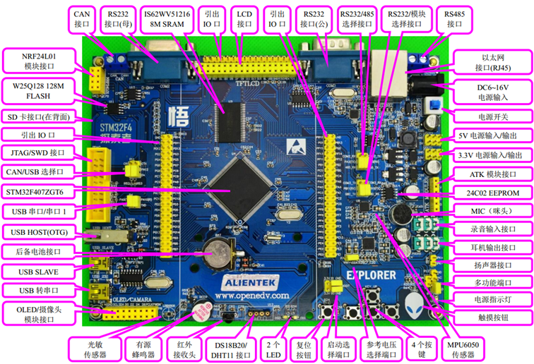

供电：

* 可以使用`DC6~16V`进行供电
* 在功耗不是很高的情况下，也可以使用`USB SLAVE`或`USB转串口`进行供电

## 第5讲 STM32初探-M4

### 1. M4特点：内核，低功耗，外设

#### 1.1 什么是STM32

* 新的基于ARM内核的32位MCU系列
  * 内核为`Cortex-M`内核
  * 标准的ARM架构
* 超强的体系结构
  * 高性能
  * 低电压
  * 低功耗
  * 创新的内核以及外设
* 简单易用、自由、低风险
* `Cortex-M4`采用`ARMv7-ME`架构
  * `ARMv7`架构定义了三大分工明确的系列
    * “A”系列：面向尖端的基于虚拟内存的操作系统和用户应用
    * “R”系列：针对实时系统
    * “M”系列：对微控制器
* `Cortex-M3`采用`ARMv7-M`架构，`Cortex-M0`采用`ARMv6-M`架构，`Cortex-A5/A8`采用`ARMv7-A`架构，传统的`ARM7`系列采用的是`ARMv4T`架构

#### 1.2 Cortex内核

##### 1.2.1 STM32和ARM的发展：

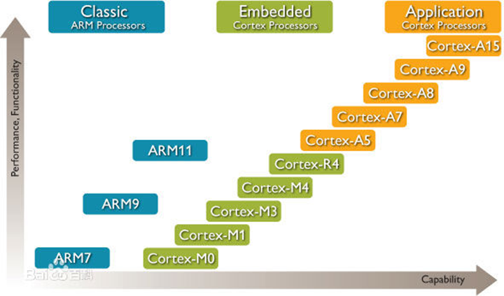

##### 1.2.2 `Cortex-M4`内核的介绍

略

#### 1.3 `Cortex-M`内核对比

略

#### 1.4 `Cortex-M4`低功耗设计

略

#### 1.5 `Cortex-M4`更高级的外设

略

### 2. STM32芯片家族

#### 2.4 STM32命名规则

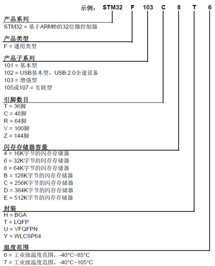

### 3. 总结

略

## 第6讲 STM32芯片解读

参考资料

* `STM32F4数据手册`：`STM32F407ZGT6.pdf`
* `STM32F4中文手册`：`STM32F4xx中文参考手册.pdf`
* `开发板原理图`：`Explorer STM32F4_Vxx_SCH.pdf`

### 1. 芯片的资源

#### 1.1 芯片内部资源

通过`芯片选型手册`可查看芯片的内部资源

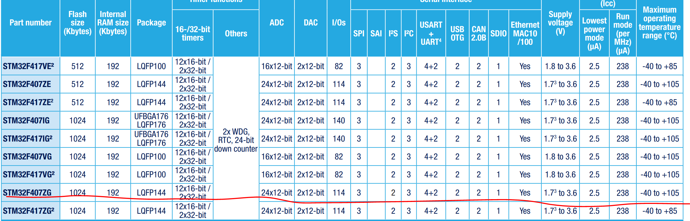

`STM32F407ZGT6`资源描述

* 内核
  * 32位高性能`ARM Cortex-M4`处理器
  * 时钟：高达`168M`，实际还可以超频一点点
  * 支持FPU(浮点运算)和DSP指令
* IO口：
  * `STM32F407ZGT6`:144引脚 114个IO
    * 大部分IO口都耐5V(模块通道除外)
    * 支持调试：SWD和JTAG，SWD只要2根数据线
* 存储容量器：1024k FLASH，192K SRAM
* 时钟、复位和电源管理：
  * 1.8~3.6V电源和电压
  * 上电复位，掉电复位和可编程的电压监控
  * 强大的时钟系统
    * 4~26M的外部高速晶振
    * 内部16MHz的高速RC震荡器
    * 内部32KHz低速RC振荡器，看门狗时钟
    * 内部锁相环（PLL，倍频），一般系统时钟都是外部或者内部高速时钟经过PLL倍频后得到
    * 外部低速32.768K的晶振，主要做RTC时钟源
* 低功耗：
  * 睡眠、停止和待机三种低功耗模式
  * 可用电池为RTC和备份寄存器供电
* AD:
  * 3个12为AD(多达24个外部测量通道)
  * 内部通道可用于内部温度测量
  * 内部参考电压
* DA:
  * 2个12为DA
* DMA:
  * 16个DMA通道，带FIFO和突发支持
  * 支持外设：定时器、ADC、DAC、SDIO、I2S、SPI、I2C和USART

* 定时器：多达17个定时器
  * 10个通用定时器（TIM2和TIM5是32位）
  * 2个基本定时器
  * 2个高级定时器
  * 1个系统定时器
  * 2个看门狗定时器
* 通信接口：多达17个通信接口
  * 3个I2C接口
  * 6个串口
  * 3个SPI接口
  * 2个CAN 2.0
  * 2个USB OTG
  * 1个SDIO

### 2. 芯片的内部结构

参考资料：数据手册`STM32F40ZGT6.pdf`第17页

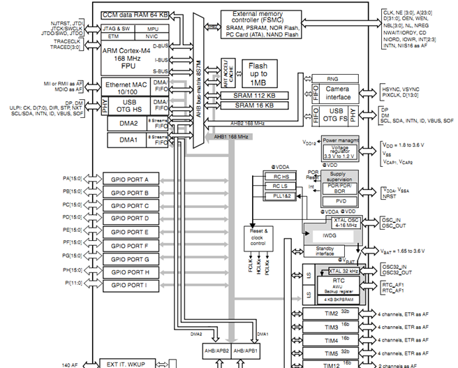

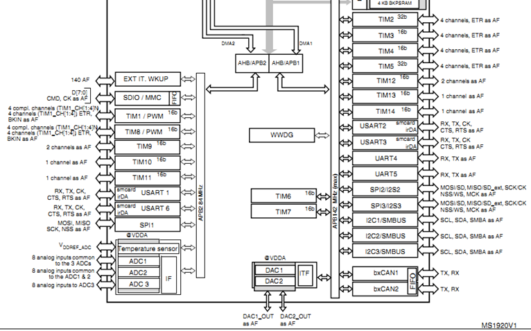

### 3. 芯片引脚和功能怎么对应

查看数据手册引脚功能表，可以知道引脚的对应功能：

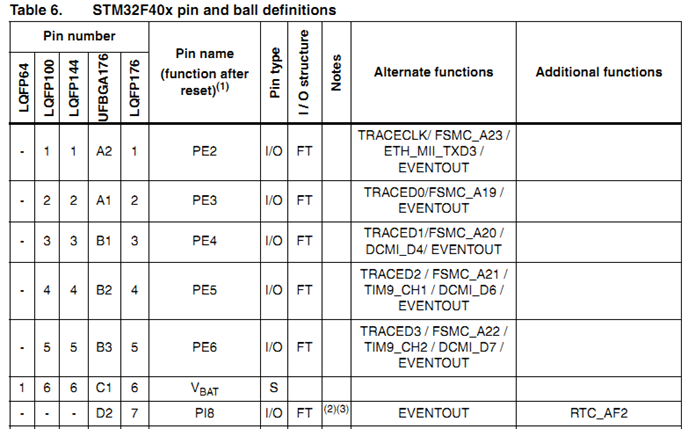

### 4.`STM32F4`最小系统设计

* STM32最小系统--看原理图
  * 供电
  * 复位
  * 时钟：外部晶振（2个）
  * Boot启动模式选择
  * 下载电路（串口/JTAG/SWD）
  * 后背电池

## 第7讲 开发环境搭建

### 1 MDK软件安装

### 2. USB串口驱动安装

`探索者F4 资料盘(A盘)\6，软件资料\1，软件\CH340驱动(USB串口驱动)_XP_WIN7共用\SETUP.EXE`

### 3.  JLINK驱动安装 

`探索者F4 资料盘(A盘)\6，软件资料\1，软件\JLINK驱动\Setup_JLinkARM_V415e.exe`

## 第8讲 程序下载方法1：ISP串口下载

### 1. 硬件连接

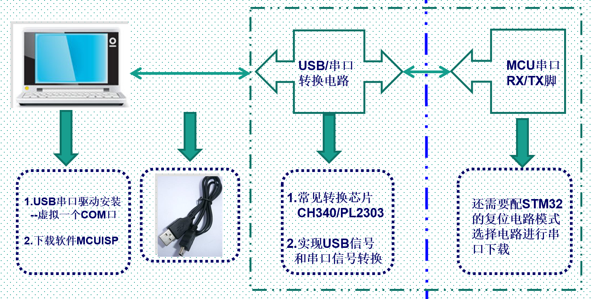

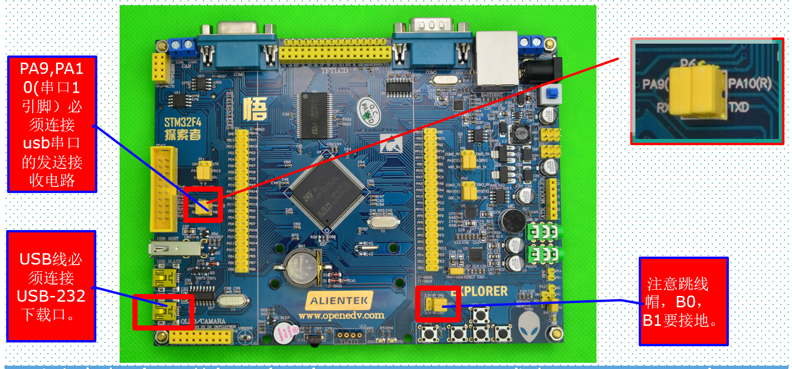

特别注意：

STM32的ISP下载，只能使用串口1，也就是对应串口发送接收引脚PA9、PA10。不能使用其他串口（例如串口2：PA2、PA3）来进行ISP下载。

 ### 2. 一键下载方法

环境准备：CH340驱动安装（参考环境准备视频）

下载工具配置：mcuips(FlyMcu)

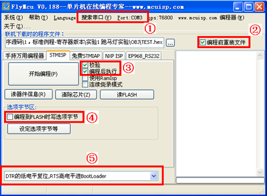

1. 搜索串口，选择虚拟出来的USB串口：

   `COMx:空闲USB-SERIAL CH340`

2. 勾选上“编程前重装文件”

3. 勾选上：“校验”以及“编程后执行”

4. 选项字节的“编程到FLASH时写选项字节” 不要勾选

5. 左下方：选择第四个

   DTR的低电平复位，TRS高电平进bootloader

注意：波特率不要选太高，不能超过76800

### 3. STM32启动模式

#### 3.1 STM32启动模式

STM32直接通过两个引脚Boot0和Boot1设置启动模式：

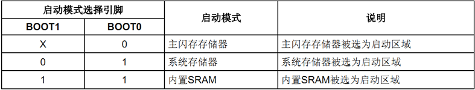

参考资料：

* M3 《STM32中文参考手册V10》2.4小节 表6

* M4《STM32F4中文参考手册》2.4小节 表3

#### 3.2 ISP下载一般步骤：

* Boot0接3.3V，Boot1接GND
* 按复位按键，实现下载

#### 3.3 程序执行的一般步骤：

* mcuisp/flymuc勾选“编程后执行 ”，发送命令直接从FLASH启动
* Boot0接GND，Boot1接任意，按一次复位

#### 3.4 一键下载原理：

一键下载电路，则利用串口的DTR和RTS信号，分别控制STM32的复位和B0，配合上位机软件（mcuisp），设置：DTR的低电平复位，RTS高电平进BootLoader，这样，B0和STM32的复位，完全可以由下载软件自动控制，从而实现一键下载。

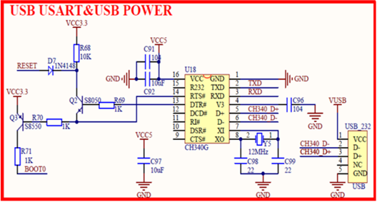

#### 3.5 不使用一键下载，CH340参考电路

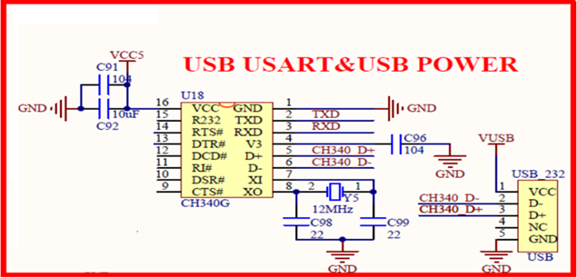


## 第9讲 程序下载方法2：JLINK程序下载

参考资料：

* 《STM32F4开发指南--库函数版本》 3.4.2小节 JLINK下载与调试
* `1，ALIENTEK XX开发板入门资料/JLINK问题汇总_Vxx.pdf`

### 1. JLINK与开发板硬件连接

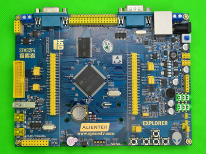

### 2. JLINK下载配置过程

下载环境：

* JLINK驱动
* MDK5安装

MDK软件上配置JLINK

### 3. 下载常见问题

参考：`JLINK问题汇总_Vxx.pdf`

## 第10讲 新建基于固件库的工程模板

### 1. 新建STM32F4工程模板

#### 1.1 库函数和寄存器的区别：

本质上是一样的。

* 可以在库函数模板里面，直接操作寄存器，因为官方库相关头文件有寄存器定义。
* 但是不能在寄存器模板调用库函数，因为没有引入库函数相关定义。

必须对寄存器有一定的了解，才能找到问题，因为调试代码，底层只能查看寄存器相关配置。

#### 1.2 新建工程模板

* 开发环境：MDK5

* 固件库版本：V1.4(F4专用)

  `探索者F4 资料盘(A盘)\8，STM32参考资料\1，STM32F4xx固件库\stm32f4_dsp_stdperiph_lib\STM32F4xx_DSP_StdPeriph_Lib_V1.4.0`

* 参考资料：`STM32F4开发指南-库函数版本_V1.1.pdf` `第3.3.2节 新建工程模板`

**新建工程模板**

**1. 在Template目录下新建5个文件夹**

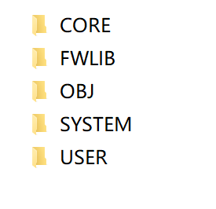

**2. 打开Keil，新建工程**

* 点击Keil的菜单：`Project –>New Uvision Project`
* 将目录定位到刚才建立的文件夹Template之下的USER子目录
* 工程取名为Template之后点击保存，我们的工程文件就都保存在USER文件夹下

**3. 选择对应的固件库**

接下来会出现一个选择Device的界面，来选择芯片的型号，定位到`STMicroelectronics->STM32F4 Series->STM32F407->STM32F407ZG`（一定要安装对应的器件包才会显示这些内容）

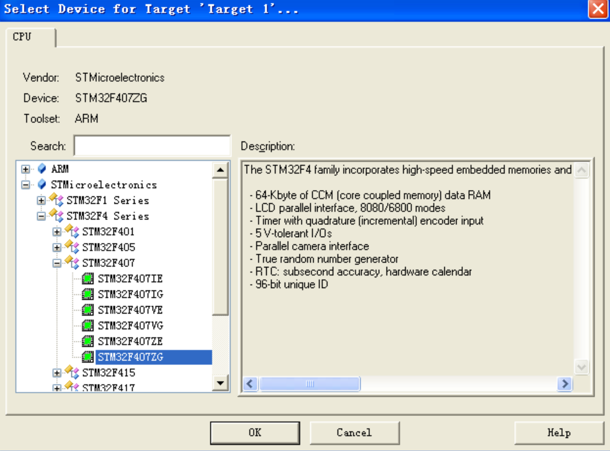

弹出的界面cancel就可以了

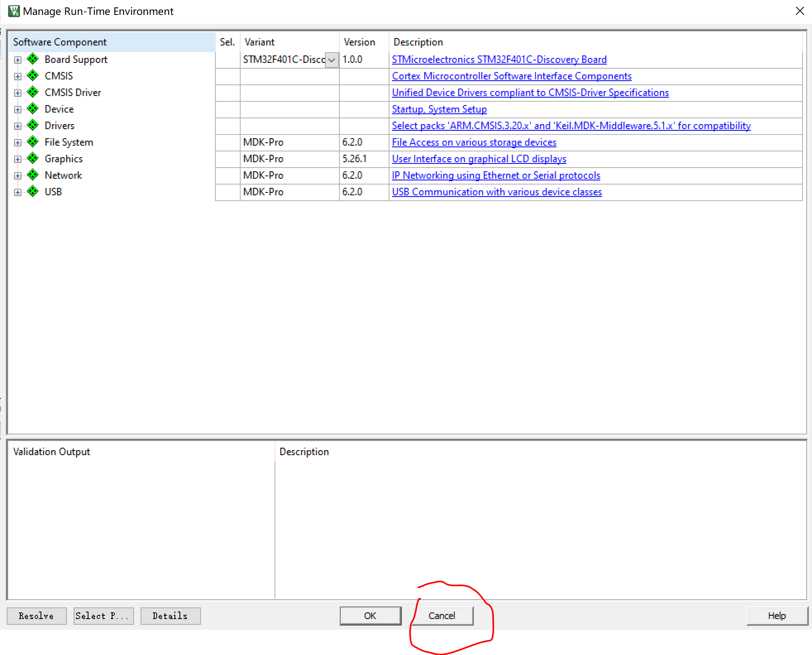

**4. 观察USER目录**

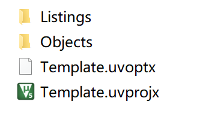

* `Template.uvprojx`

  是工程文件，不能删除

* `Listings`和`Objects`

  是MDK自动生成的文件夹，用于存放编译过程产生的中间目录。这里，我们把两个文件夹删除，我们会在下一步骤中新建一个OBJ文件夹，来存放编译中间文件。（不删除这两个文件夹也没关系，只是我们不用它而已）

**5. 将官方固件包里的源码文件复制到工程目录FWLib文件夹下面**

将固件库包目录`stm32f4_dsp_stdperiph_lib\STM32F4xx_DSP_StdPeriph_Lib_V1.4.0\Libraries\STM32F4xx_StdPeriph_Driver`下的`src`、`inc`文件夹拷贝到我们刚才建立的`FWLib`文件夹下面


**6. 将固件库包里面相关的启动文件复制到工程目录CORE之下**

* 打开固件库包目录`stm32f4_dsp_stdperiph_lib\STM32F4xx_DSP_StdPeriph_Lib_V1.4.0\Libraries\CMSIS\Device\ST\STM32F4xx\Source\Templates\arm`，将文件`startup_stm32f40_41xxx.s`复制到CORE目录下面，然后定位到

* 定位到目录`stm32f4_dsp_stdperiph_lib\STM32F4xx_DSP_StdPeriph_Lib_V1.4.0\Libraries\CMSIS\Include`,将4个头文件复制到CORE目录下：

  * `core_cm4.h`
  * `core_cm4_simd.h`
  * `core_cmFunc.h`
  * `core_cmInstr.h`

  复制完后的CORE目录如下：

  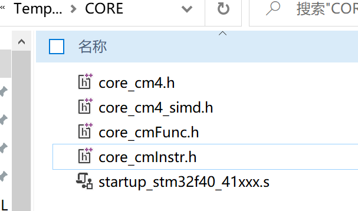

**7. 复制工程模板需要的一些其他头文件和源文件到工程中**

* 复制目录`stm32f4_dsp_stdperiph_lib\STM32F4xx_DSP_StdPeriph_Lib_V1.4.0\Libraries\CMSIS\Device\ST\STM32F4xx\Include`下的2个头文件到USER目录下

  * `stm32f4xx.h`
  * `system_stm32f4xx.h`

  这两个头文件是`STM32F3`工程非常关键的两个头文件（后续课程会讲解）

* 复制目录`stm32f4_dsp_stdperiph_lib\STM32F4xx_DSP_StdPeriph_Lib_V1.4.0\Project\STM32F4xx_StdPeriph_Templates`下的5个文件到USER目录下：

  * `main.c`
  * `stm32f4xx_conf.h`
  * `stm32f4xx_it.c`
  * `stm32f4xx_it.h`
  * `system_stm32f4xx.c`

* 相关文件复制完之后的USER目录入下图所示

  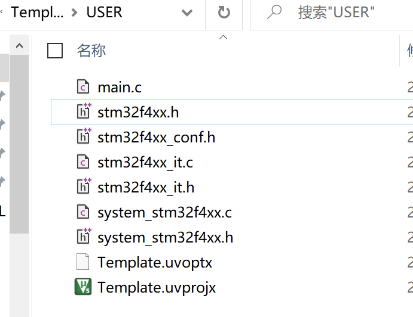

**8. 将前面复制的固件库相关文件加入到我们的工程中**

右击Target1，选择`Manage Project Items`，如下图所示：

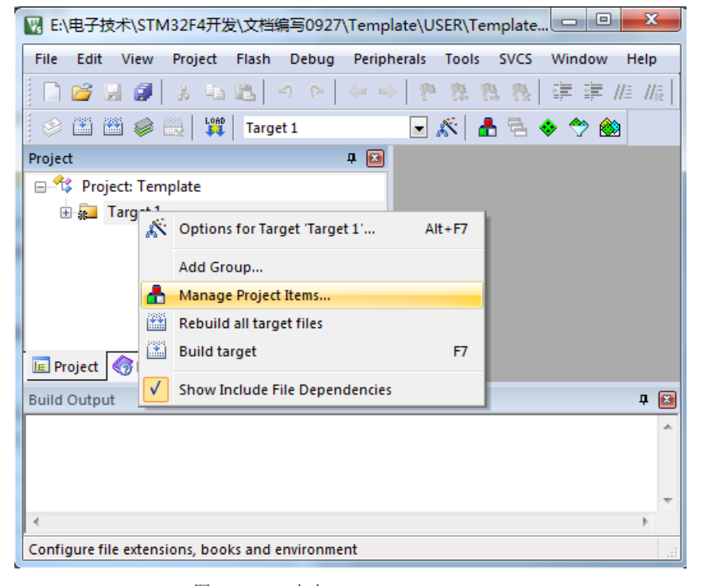

**9. 修改工程名并建立分组**

* `Project Targets`一栏：将Target名字修改为Template

* `Groups`一栏：

  * 将`Source Group1`删除
  * 建立三个`Groups`:
    * USER
    * CORE
    * FWLIB
  * 点击OK

  修改完如下图所示：

  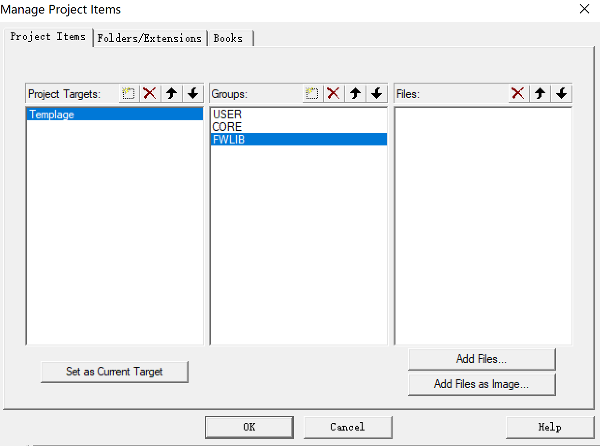

**10. 往Group里面添加需要的文件**

右击`Template --> Manage Project Items --> 选择需要添加文件的Groups`

* `FWLIB`

  * 操作：`选择FWLIB --> Add Files --> 定位目录\FWLIB\src --> 全选（Ctrl+A） -->Add --> Close`

    操作完之后，可以看到如下图所示

    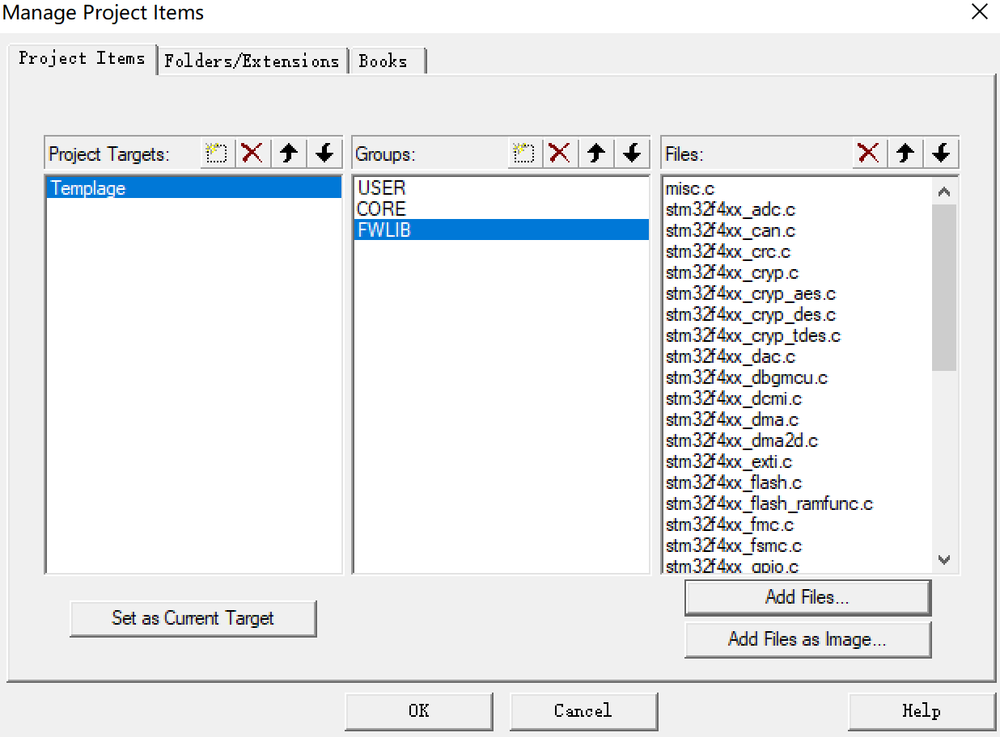

  * 删除`stm32f4xx_fmc.c`

    这个文件比较特殊，它时STM32F42和STM32F43系列才用到。

  * 说明：如果只用到了其中的某个外设，可以不添加其他外设的库文件。例如只用到`GPIO`就可以只添加`stm32fxx_gpio.c`而其他的可以不用添加。这里我们选择全部添加进来时为了后面方便，不用每次添加（坏处时编译起来较慢）。

* `CORE`

  `CORE`需要添加的文件为：

  * `startup_stm32f40_41xxx.s`（默认添加的文件类型为`.c`，需要选择文件类型为`All files`才能看到这个文件）

    添加完之后如下图所示

    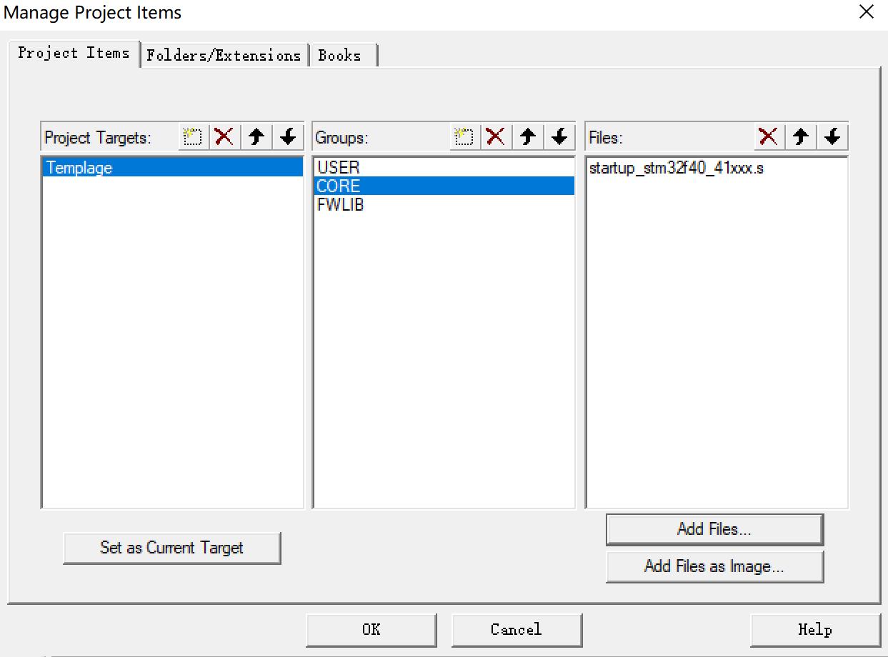

* `USER`

  `USER`需要添加的文件为

  * `main.c`

  * `stm32f4xx_it.c`

  * `system_stm32f4xx.c`

    添加完之后如下图所示：

    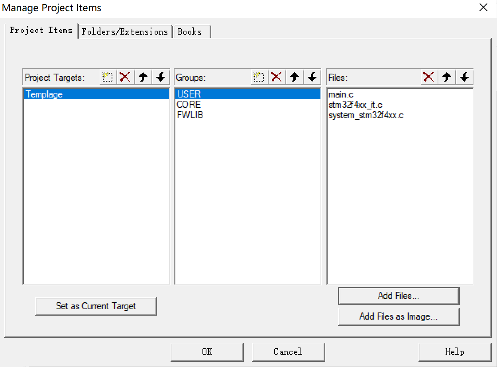

**12. 设置头文件存放路径**

操作如下图所示：

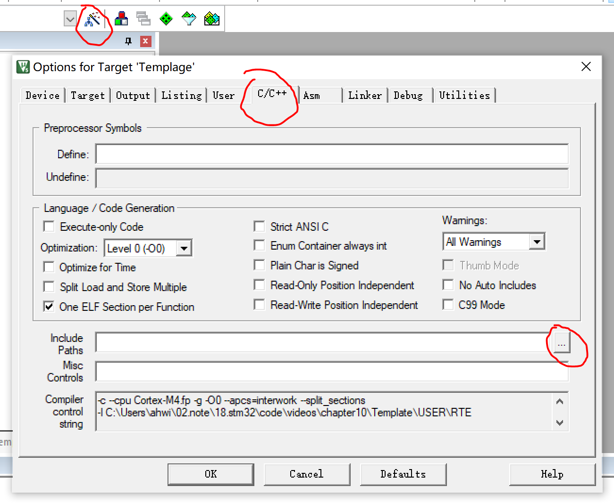


**13. 添加全局宏定义标识符**

添加`STM32F40_41xxx,USE_STDPERIPH_DRIVER`到选项`Define`中

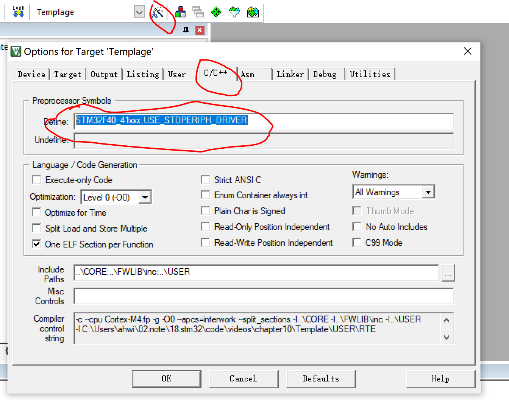

**14. 选择编译中间文件的存放目录**

* 步骤：`选择魔术棒-->选择Output-->点击Select Folder for Objects... --> 选择OBJ目录`。
* 勾选如下的下个选项。
  * `Debug Information`
  * `Create HEX File`：选项要求编译之后生成HEX文件
  * `Browse Information`：选项方便查看工程中的一些函数变量定义

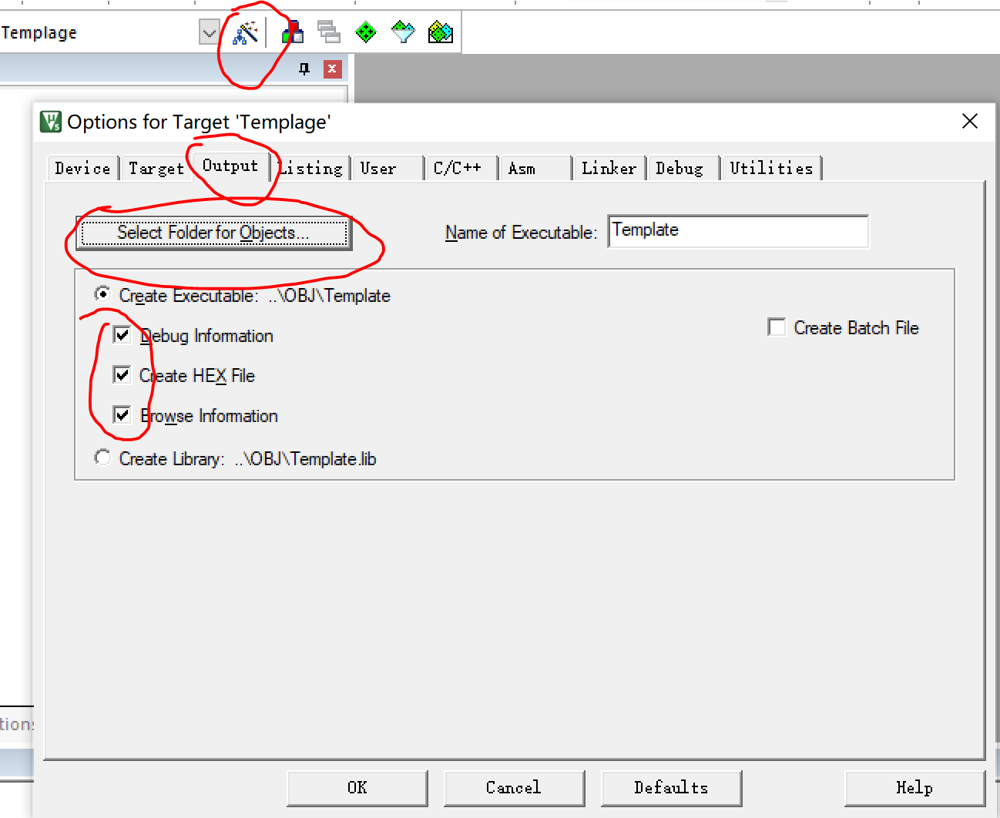

**15. 往工程里面添加代码**

* 往`main.c`里面添加代码（可以从`实验0 Template工程模板中拷贝`）：

  ```c
  #include "stm32f4xx.h"
  
  void Delay(__IO uint32_t nCount);
  
  void Delay(__IO uint32_t nCount)
  {
    while(nCount--){}
  }
  
  int main(void)
  {
  
    GPIO_InitTypeDef  GPIO_InitStructure;
    RCC_AHB1PeriphClockCmd(RCC_AHB1Periph_GPIOF, ENABLE);
  
    GPIO_InitStructure.GPIO_Pin = GPIO_Pin_9 | GPIO_Pin_10;
    GPIO_InitStructure.GPIO_Mode = GPIO_Mode_OUT;
    GPIO_InitStructure.GPIO_OType = GPIO_OType_PP;
    GPIO_InitStructure.GPIO_Speed = GPIO_Speed_100MHz;
    GPIO_InitStructure.GPIO_PuPd = GPIO_PuPd_UP;
    GPIO_Init(GPIOF, &GPIO_InitStructure);
  
    while(1){
  		GPIO_SetBits(GPIOF,GPIO_Pin_9|GPIO_Pin_10);
  		Delay(0x7FFFFF);
  		GPIO_ResetBits(GPIOF,GPIO_Pin_9|GPIO_Pin_10);
  		Delay(0x7FFFFF);
  	
  	}
  }
  ```

* 将`USER`分组下面的`stm32f4xx_it.c`文件内容清空。

  或者删除其中的32行对应的`main.h`头文件的引入，以及144行`SysTick_Handler`函数内容，如下图所示：

  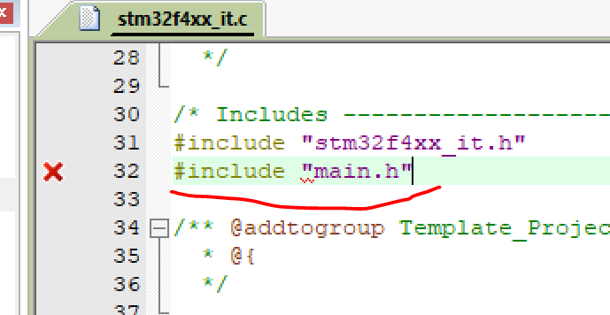

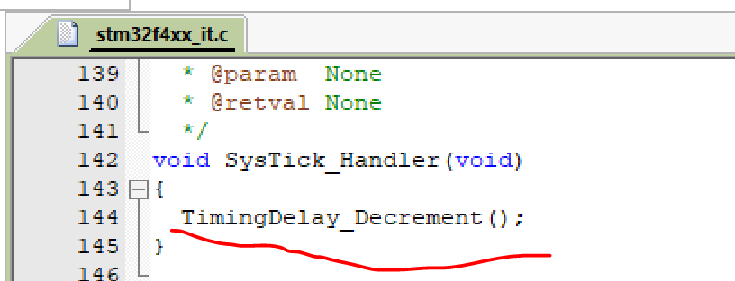

**16 编译工程**

可以看到无编译错误和警告

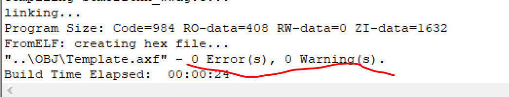

**17. 烧录hex文件**

可以参考`3.4小节`的内容，将hex文件下载到开发板，会发现两个led灯不停的闪烁

**18. 修改系统时钟的配置**

* 修改`System_stm32f4xx.c`文件，把PLL第一级分帧系数M修改为8，这样达到主时钟频率168MHz。(详细原因会在4.3小节讲解)

  

* 修改`stm32f4xx.h`的外部时钟`HSE_VALUE`值为`8MHz`，因为我们的外部高速时钟用的晶振为`8M`，修改方法如下图：

  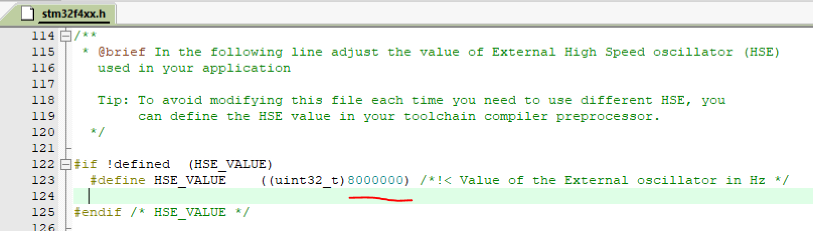

**19. 添加正点原子编写的公共库**

经过上面的步骤，工程模板已经建立完成，但在`ALIENTEK`提供的实验中都有一个`SYSTEM`文件夹，下面有3个子目录分别为`sys`、`usart`、`delay`，存放的时每个实验要用到的公共库，该代码由`ALIENTEK`编写（在第5章STSTEM文件夹会有详细的讲解）。下面将其引入到工程中：

* 拷贝`实验0 Template工程模板\SYSTEM`下的文件夹到`SYSTEM`目录下

* 将这`SYSTEM`文件夹里面的三个子目录下的源文件加入到工程中，同时将头文件加入到PATH中

  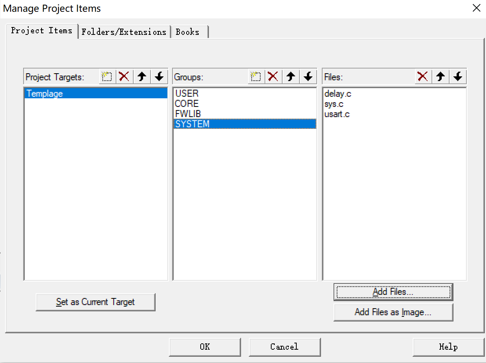

  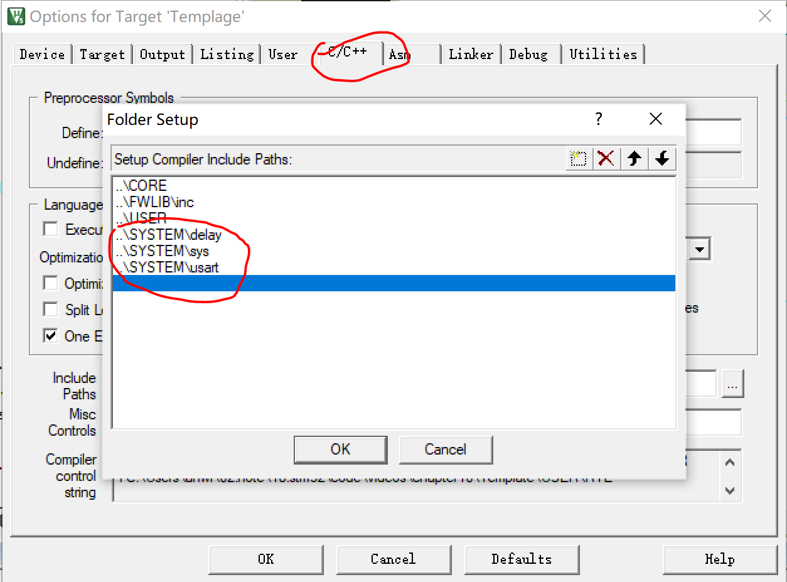

**20. 测试`SYSTEM`文件夹里面的函数**

修改`main.c`的内容，测试`SYSTEM`文件夹里面的一些头文件和函数

修改后`main.c`的内容如下：

```c
#include "stm32f4xx.h"
#include "usart.h"
#include "delay.h"

int main(void)
{
	u32 t=0;
	uart_init(115200);
	delay_init(84);
	
  while(1){
    printf("t:%d\r\n",t);
		delay_ms(500);
		t++;
	}
}
```


### 2. STM32F4固件库包简介

视频没讲

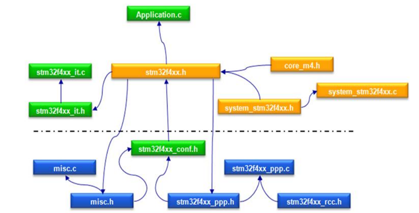

## 第11讲 新建工程模板--基于寄存器

略过

## 第12讲 GPIO工作原理

### 1. GPIO基本结构和工作方式

#### 1.1 GPIO基本结构

**参考资料**

* 探索者STM32F4开发板：

  《STM32F4开发指南-库函数版本》-第六章 跑马灯实验6.1小节

* STM32F4xx官方资料：

  《STM32F4xx中文参考手册》-第7章 通用IO

  芯片数据手册

**引脚说明**

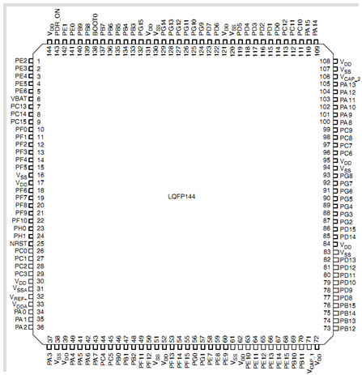

STM32F407ZGT6的引脚：

* 一共有7组IO口，每组IO口有16个IO，一共16*7=112个IO （GPIOA,GPIOB）
* 外加2个PH0和PH1一共114个IO口

**引脚复用**

STM32的大部分引脚除了当GPIO使用外，还可以复用为外设功能引脚（比如串口），这部分知识会在后面说明。

#### 1.2 GPIO工作方式

* 4种输入模式
  * 输入浮空
  * 输入上拉
  * 输入下拉
  * 模拟输入
* 4种输出模式
  * 开漏输出（带上拉或者下拉）
  * 开漏复用功能（带上拉或者带下拉）
  * 推挽式输出（带上拉或者下拉）
  * 推挽式复用功能（带上拉或者下拉）
* 4种最大输出速度
  * 2MHZ
  * 25MHZ
  * 50MHZ
  * 100MHZ

8种工作模式的区别：`STM32八种IO口模式区别.pdf`


### 2. GPIO寄存器说明

### 3. STM32F4xx GPIO引脚说明


# 洋桃补习班（为0基础的初学者补足基础知识）

## 第1讲 ARM内核、RISC、32位

### ARM内核

介绍ARM系列

### RISC

RISC：精简指令集

### 32位

ARM处理器本身是32位的处理器
