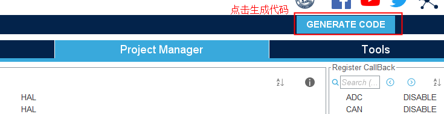

学习资料：

* 野火资料汇总：https://doc.embedfire.com/products/link/zh/latest/mcu/stm32/ebf_stm32f407_batianhu_v1_v2/download/stm32f407_batianhu_v1_v2.html
* STM32 HAL库开发实战指南--基于野火F4系列开发板：https://doc.embedfire.com/mcu/stm32/f4/hal_general/zh/latest/
* 视频：`https://www.bilibili.com/video/BV18X4y1M763`

## 第9讲 使用STM32CubeMX 新建工程

1. 设置固件包的安装位置

2. 有三种方式新建工程，我们这边选择第一种：

   

3. 在弹出的框中输入芯片型号，并双击芯片型号：

   

   

4. 初始化LED灯引脚：PB0、PB1、PB5：

   

   点击引脚：选择输出模式：

   

   PB1和PB5也配置成输出模式，芯片左侧栏中会显示相应的引脚配置：

   

   配置具体GPIO具体配置：

   

5. 配置`SYS`的`Debug`选项为`Serial Wire`

   

6. 其他窗口介绍（这边不需要配置）：

   a. 可选中间件：

   

   b. 也可导入丰富的组件：

   

   

7. 时钟配置：这边先使用默认即可：

   

8. 工程配置：

   

   

   下载固件库包：`Help --> Manage embedded software packages`

   

   选择相应的固件库包下载即可：

   

9. 配置代码的生成规则：

   

   

10. 点击生成代码：

    

11. 打开工程：

    

12. 编译工程：

    可能会报编译器不可用

    

    选择相应的编译器版本即可：

    

**用户手册**

https://www.st.com/zh/development-tools/stm32cubemx.html#documentation

stm官方提供了软件操作的用户手册（在软件下载页面里）

