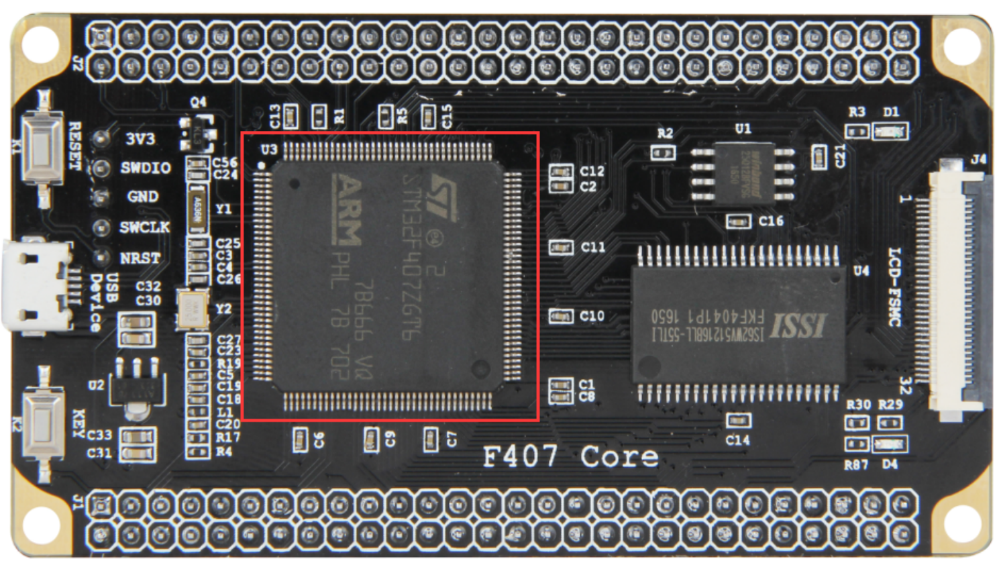

# 野火F407开发板-霸天虎视频

## 初级篇

### 第5章 初识STM32

#### STM32命名方法

野火F407霸天虎和正点原子用到都是STM32F407ZGT6芯片

STM32的命名方法：


更详细的命名方法见下图：


#### 选择合适的MCU

了解了 STM32 的分类和命名方法之后，就可以根据项目的具体需求先大概选择哪类内核的 MCU:

* 普通应用，不需要接大屏幕的一般选择`Cortex-M3`内核的F1系列
* 如果要追求高性能，需要大量的数据运算，要做图形界面的则选择`Cortex-M4`内核的F407系列

明确了大方向之后，接下来就是细分选型：

* 先确定引脚，引脚多的功能就多，价格也贵，具体 得根据实际项目中需要使用到什么功能，够用就好
* 选择 FLASH 大小， 相同引脚数的MCU会有不同的FLASH大小可供选择。

#### 如何分配原理图IO

在画原理图之前，一般要先把引脚分类好，才开始画原理图，具体的分类见下表：


#### 如何寻找IO的功能说明

从官方的数据手册可以找到每个IO的功能说明，有两个官方资料经常用到：

* 参考手册（Reference manual）
* 数据手册（Data Sheet）

两者的区别如下表所示：


一句话概括：数据手册主要用于芯片选项和设计原理图时参考，参考手册主要用于在编程的时候查阅外设的功能和寄存器说明。

> 官方的两个文档可以在这里找到：http://www.stmcu.org/document/list/index/category-150
>
> 也可以在光盘资料里面找到

在数据手册中，有关引脚定义的部分在`Pinout and pin description`小节中，具体定义的解读如下：


#### 开始分配原理图IO

这里用的MCU型号为STM32F407ZGT6，封装为LQFP144：

* 在数据手册中找到对应封装的引脚定义
* 根据引脚序号，一个个复制出来，整理成excel表
* 整理方法按照上面的`如何分配原理图IO`的引脚类型进行分配（可参考`STM32F407ZGT6管脚汇总.xlsx`）
* 分配之后就开始画原理图

#### PCB在哪里打样

设计好原理图，画好PCB之后，需要把板子做出来，进行软硬件联调。

PCB打样推荐嘉立创。

### 第6章 什么是寄存器

本章参考资料：《STM32F4xx中文参考手册》、《STM32F4xx英文数据手册》

> 学习本章时，配合《STM32F4xx中文参考手册》“存储器和总线架构”、"嵌入式FLASH接口"及"通用I/O（GPIO）"章节一起阅读，效果更佳，特别是涉及到寄存器说明的部分

#### 6.1 寄存器

学习STM32时两种编程方式：

* 寄存器编程
* 固件库编程

#### 6.2 STM32芯片外观

开发板中使用的芯片是 144pin 的 STM32F407ZGT6



芯片正面是丝印：

* ARM：表示该芯片使用的是 ARM 的内核
* STM32F429IGT6：芯片型号
*  后面的字应该是跟生产批次相关
* 最下面的是ST的LOGO

芯片四周是引脚：

* 左下角的小圆点表示1脚，然后从1脚起按照逆时针的顺序排列（所有芯片的引脚顺序都是逆时针排列的）

* 开发板中把芯片的引脚引出来，连接到各种传感器上，然后在STM32上编程（实际就是通过程序控制这些引脚输出高电平或者低电平）来控制各种传感器工作，通过做实验的方式来学习STM32芯片的各个资源。

开发板是一种评估板，板载资源非常丰富，引脚复用比较多，力求在一个板子上验证芯片的全部功能。


#### 6.3 芯片里面有什么

STM32 芯片已经是已经封装好的成品：主要由内核和片上外设组成。

STM32F407采用的是Cortex-M4内核，内核即CPU，由ARM公司设计。

* ARM 公司并不生产芯片，而是出售其芯片技术授权。
* 芯片生产厂商 (SOC) 如ST、TI、Freescale，负责在内核之外设计部件并生产整个芯片，这些内核之外的部件被称为核外外设或片上外设。如GPIO、USART（串 口）、I2C、SPI 等都叫做片上外设。

具体见图`STM32芯片架构简图`


* 芯片内核和外设之间通过总线矩阵来连接，其中主控总线有8条，被控总线有7条，具体见图`STM32F407xx器件的总线接口`

* 总线矩阵用于主控总线之间的访问仲裁管理，仲裁采用循环调度算法。

* 总线之间交叉的时候如果有个圆圈则表示可以通信，没有圆圈则表示不可以通信。

  > 比如 S0:I总线只有跟M0、M2和M6这三根被控总线交叉的时候才有圆圈，就表示S0只能跟这三根被控总线通信。
  >
  > 从功能上来理解，I总线是指令总线，用来取指，指令指的是编译好的程序指令。我们知道STM32有三种启动方式，从FLASH启 动（包含系统存储器），从内部SRAM启动，从外部RAM启动，这三种存储器刚好对应的就是M0、M2和M6这三条总线。

图`STM32F407xx器件的总线接口`


#### 6.4 存储器映射

在图`STM32F407xx器件的总线接口`中，连接被控总线的是FLASH、RAM和片上外设，<font color=red>这些功能部件共同排列在一个4GB的地址空间内</font>。我们在编程时，操作的整数这些功能部件。

##### 6.4.1 存储器的映射

存储器本身不具有地址信息，它的地址是由芯片厂商或用户分配，给存储器分配地址的过程就称为**存储器映射**，具体见图`STM32F407存储器映射`。

> 如果给存储器再分配一个地址就叫做存储器重映射


###### 6.4.1.1 存储器区域功能划分

在这4GB的地址空间中，ARM已经粗线条的平均分成了8个块，每块512MB，每个块也都规定了用途，具体分类见表格`存储器功能分类`。

> 每个块的大小都有 512MB，不一定用得完，都是只用了其中的一部分而已。
>
> 4GB地址空间：地址线有32根，2^32=4GB


在这8个Block中，3个比较重要的块：

* Block0：设计成内部FLASH
* Block1：设计成内部RAM
* Block2：设计成片上的外设

下面介绍这3个Block里面的具体区域的功能划分

**存储器Block0内部区域功能划分**

Block0主要用于设计片内的FLASH，我们使用的 STM32F407ZGT的FLASH为1MB。

Block0内部区域的功能划分具体见表格`存储器Block0内部区域功能划分`：


**存储器Block1内部区域功能划分**

Block1用于设计片内的SRAM。F407内部SRAM的大小为128KB，其中SRAM1为112KB、SRAM2为16KB.

Block1内部区域的功能划分具体见表格`存储器Block1内部区域功能划分` ：


**存储器Block2内部区域功能划分**

Block2用于设计片内的外设。

根据外设的总线速度不同，Block被分成：

* APB
  * APB1
  * APB2
* AHB
  * AHB1
  * AHB2

> 还有一个AHB3包含了Block3/4/5，AHB3包含的3个Block用于扩展外部存储器，如SRAM，NORFLASH和 NANDFLASH等。

具体见表格`存储器Block2内部区域功能划分`：


#### 6.5 寄存器映射

TODO

### 第9章 自己写库--构建库函数雏形

本章参考资料：《STM32F4xx中文参考手册》、《STM32F4xx英文数据手册》

STM32的寄存器都是32位的。

#### 9.1 什么是STM32固件库

固件库是指“STM32 标准函数库”，它是由ST公司针对STM32提供的函数接口，即API (Application Program Interface)，开发者可调用这些函数接口来配置STM32的寄存器，使开发人员得以脱离最底层的寄存器操作，有开发快速，易于阅读，维护成本低等优点。

库开发方式与直接配置寄存器方式的区别见图`固件库开发与寄存器开发对比图 `：


#### 9.2 为什么采用库来开发及学习

#### 9.3 实验：构建库函数雏形

略

### 第10章 认识STM32固件库

接下来简单分析下ST官方的固件库的组成部分

#### 10.1 CMSIS标准及库层次关系

ARM与芯片厂商建立了CMSIS标准(Cortex MicroController Software Interface Standard)：用来解决相同内核、不同片上外设的差异导致软件兼容问题。

CMSIS层位于硬件层与操作系统或用户层之间，提供了与芯片生产商无关的硬件抽象层，可以为接口外设、实时操作系统提供简单的处理器软件接口，屏蔽了硬件差异，这对软件的移植是有极大的好处的。

STM32的库，就是按照CMSIS标准建立的。

CMSIS标准，实际是新建了一个软件抽象层，具体见见图`CMSIS 架构`：


CMSIS 标准中最主要的为CMSIS核心层，它包括了：

* 内核函数层：其中包含用于访问内核寄存器的名称、地址定义，主要由ARM公司提供
* 设备外设访问层：提供了片上的核外外设的地址和中断定义，主要由芯片生产商提供

##### 10.1.1 库目录文件简介

> STM32 标准库可以从官网获得，也可以直接从本书的配套资料得到。本书讲解的例程全部采用1.8.0库文件。

打开固件库`STM32F4xx_DSP_StdPeriph_Lib_V1.8.0`:


* Libraries：文件夹下是驱动库的源代码及启动文件。
* Project：文件夹下是用驱动库写的例子和工程模板。
* Utilities：包含了基于ST官方实验板的例程，以及第三方软件库，如emwin图形软件库、fatfs文件系统。
* MCD-ST Liberty…：库文件的License说明。 
*  Release_Note.html：库的版本更新说明。

* stm32f4xx_dsp_stdperiph…：库帮助文档，这是一个已经编译好的HTML文件，主要讲述如何使用驱动库来编写自己的应用程序。

在使用库开发时，我们需要把libraries目录下的库函数文件添加到工程中，并查阅库帮助文档来了解ST提供的库函数，这个文档说明了每一个库函数的使用方法。

进 入Libraries文件夹看到：关于内核与外设的库文件分别存放在CMSIS和STM32F4xx_StdPeriph_Driver文件夹中。

先看看CMSIS文件夹：


其中用得最多的两个文件夹：

* Device
* Include

TODO：剩下的待编写

### 第11章 新建工程--库函数版

略

### 第12章 GPIO输出--使用固件库点亮LED

#### 硬件连接（正点原子）


TODO：剩下的待编写

### 第15章 启动文件详解

参考资料：

* 《STM32F4xx中文参考手册》第10章 中断和事件
* MDK中的帮助手册--ARM Development Tools：用来查询ARM的汇编指令和编译器相关的指令

#### 15.1 启动文件简介

启动文件是由汇编编写，是系统上电复位后第一个执行的程序。主要做了以下工作：

* 初始化堆栈指针  `sp=_initial_sp`
* 初始化PC指针 `=Reset_Handler`
* 初始化中断向量表
* 配置系统时钟
* 调用C库函数`_main`初始化用户堆栈，从而最终调用main函数去到C的世界

#### 15.2 查找ARM汇编指令

启动代码涉及到：

* Cortex内核的指令（参考《CM3权威指南CnR2》第4章：指令集）

* ARM的汇编指令（参考：`MDK->Help->Uvision Help`中搜索到相关指令）

  以指令EQU为例，检索如下：

  

检索出来的结果较多，只需看`Assembler User Guide`部分即可。

如下列出启动文件使用到的ARM汇编指令（该列表详细从上述文档检索而来）：

> 为了方便，把两个编译器相关的指令`WEAK`和`ALIGN`也放了进来


#### 15.3 启动文件代码讲解

##### 15.3.1 Stack--栈


上述代码作用：开辟栈的大小为0X00000400（1KB），名字为STACK

栈的作用：用于局部变量、函数调用、函数形参等的开销。

栈的大小不能超过内部SRAM的大小。

> 如果编写的程序比较大，定义的局部变量很多，那么就需要修改栈的大小。如果程序出现莫名其妙的错误并进入了硬fault的时候，需要考虑是不是栈不够大。

指令详解：

* EQU：宏定义的伪指令，相当于等于。类似与C中的define。
* AREA：告诉汇编器汇编一个新的代码段或者数据段。
  * STACK表示段名，这个可以任意命名；
  * NOINIT表示不初始化
  * READWRITE 表示可读可写
  * ALIGN=3，表示按照2^3对齐，即8字节对齐

* SPACE：用于分配一定大小的内存空间，单位为字节。这里指定大小等于`Stack_Size`。
*  标号`__initial_sp`紧挨着SPACE语句放置，表示栈的结束地址，即栈顶地址，栈是由高向低生长的。

##### 15.3.2 Heap堆


上述代码作用：开辟堆的大小为0X00000200（512 字节），名字为HEAP

* `__heap_base` 表示对的起始地址
* `__heap_limit` 表示堆的结束地址

堆是由低向高生长的，跟栈的生长方向相反。

堆的作用：用来动态内存的分配，像malloc() 函数申请的内存就在堆上面。这个在 STM32 里面用的比较少。


* PRESERVE8：指定当前文件的堆栈按照8字节对齐。

* THUMB：表示后面指令兼容THUMB指令。

  > THUBM 是ARM以前的指令集，16bit，现在 Cortex-M 系列的都使用 THUMB-2 指令集，THUMB-2 是32位的，兼容16位和32位的指令，是 THUMB 的超集。

##### 15.3.3 向量表


作用：定义一个数据段，名字为RESET，可读。并声明` __Vectors`、`__Vectors_End`和 `__Vectors_Size` 这三个标号具有全局属性，可供外部的文件调用。

* EXPORT：声明一个标号可被外部的文件使用，使标号具有全局属性。如果是IAR编译器，则使用的是 GLOBAL这个指令。

**向量表的作用：**

当内核响应了一个发生的异常后，对应的异常服务例程 (ESR) 就会执行。为了决定 ESR 的入口 地址，内核使用了“向量表查表机制”。这里使用一张向量表。向量表其实是一个 WORD（32 位 整数）数组，每个下标对应一种异常，该下标元素的值则是该 ESR 的入口地址。向量表在地址空 间中的位置是可以设置的，通过 NVIC 中的一个重定位寄存器来指出向量表的地址。在复位后， 该寄存器的值为 0。因此，在地址 0 （即 FLASH 地址 0）处必须包含一张向量表，用于初始时的 异常分配。要注意的是这里有个另类：0 号类型并不是什么入口地址，而是给出了复位后 MSP 的 初值。


* `__Vectors `为向量表起始地址，`__Vectors_End`为向量表结束地址，两个相减即可算出向量表大小。

* 向量表从FLASH的0地址开始放置，以4个字节为一个单位，地址0存放的是栈顶地址，0X04存放的是复位程序的地址，以此类推。
* DCD：分配一个或者多个以字为单位的内存，以四字节对齐，并要求初始化这些内存。在向量表中，DCD分配了一堆内存，并且以ESR的入口地址初始化它们。

##### 15.3.4 复位程序


定义一个名称为`.text `的代码段，可读。


复位子程序是系统上电后第一个执行的程序，调用SystemInit函数初始化系统时钟，然后调用C库函数`_mian`，最终调用main函数去到C的世界。

* WEAK：表示弱定义，如果外部文件优先定义了该标号则首先引用该标号，如果外部文件没有声明也不会出错。这里表示复位子程序可以由用户在其他文件重新实现，这里并不是唯一的。 
* IMPORT：表示该标号来自外部文件，跟C语言中的EXTERN关键字类似。这里表示 SystemInit 和 `__main`这两个函数均来自外部的文件。

* SystemInit() 是一个标准的库函数，在`system_stm32f4xx.c`这个库文件总定义。主要作用是配置系统时钟，这里调用这个函数之后，F429的系统时钟配被配置为180M。
* `__main`是一个标准的C库函数，主要作用是初始化用户堆栈，最终调用main函数去到C的世界。

LDR、BLX、BX 是 CM4 内核的指令，可在《CM3 权威指南 CnR2》第四章--指令集里面查询到


##### 15.3.5 中断服务程序

在启动文件里面已经帮我们写好所有中断的中断服务函数，不过这些函数都是空的，真正的中断复服务程序需要我们在外部的C文件里面重新实现，这里只是提前占了一个位置而已。

如果开启了某个中断而没有实现中断服务函数，那中断发生时，程序会跳转到启动文件允许写好的空的中断服务函数中，并且在这个空函数中无限循环，即程序就在这里死循环。


B：跳转到一个标号。这里跳转到一个‘.’，即表示无线循环。

##### 15.3.6 用户堆栈初始化


ALIGN：对指令或者数据存放的地址进行对齐，后面会跟一个立即数。缺省表示4字节对齐。


* 首先判断是否定义了` __MICROLIB` 

  * 如果定义了这个宏则赋予标号 `__initial_sp（栈顶地址）`、 `__heap_base（堆起始地址）`、`__heap_limit（堆结束地址）`全局属性，可供外部文件调用。有关这个宏我们在 KEIL 里面配置，具体见图使用微库 。然后堆栈的初始化就由C库函数`_main`来完成。

    

  * 如果没有定义` __MICROLIB`，则插入标号`__use_two_region_memory`，这个函数需要用户自己实现，具体要实现成什么样，可在KEIL的帮助文档里面查询到，具体见图`use_two_region_memory`函数：

    

    然后声明标号`__user_initial_stackheap`具有全局属性，可供外部文件调用，并实现这个标号的内 容。

* IF,ELSE,ENDIF：汇编的条件分支语句，跟C语言的if ,else 类似

* END：文件结束

### 第16章 RCC--使用HES/HSI配置时钟

参考资料：《STM32F4xx中文参考手册》RCC章节

RCC：reset clock control 复位和时钟控制器。

本章主要讲解：时钟部分，特别是着重理解时钟树。

#### 16.1 RCC主要作用--时钟部分

主要内容：

* 设置系统时钟SYSCLK
* 设置AHB分频因子（决定HCLK等于多少）
* 设置APB2分频因子（决定PCLK2等于多少）
* 设置APB1分频因子（决定PCLK1等于多少）
* 设置各个外设的分频因子
* 控制AHB、APB2和APB1这3条总线时钟的开启、控制每个外设的时钟的开启

对于SYSCLK、HCLK、PCLK2、PCLK1这四个时钟的配置一般是：HCLK=SYSCLK=PLLCLK=168M，PCLK2=HCLK/2=84M，PCLK1=HCLK1/2=84M，PCLK1=HCLK/4=42M。

> 这个时钟配置也是库函数的标准配置

#### 16.2 RCC框图剖析--时钟树

以库函数中系统时钟设置函数`SetSysClock()`为主线，来分析时钟树。

该函数的作用：利用HSE把时钟设置为HCLK=SYSCLK=PLLCLK=168M，PCLK2=HCLK/2=84M，PCLK1=HCLK/4=42M。

如下图所示：代码流程对应图中的黄色部分并以数字的大小顺序标识：


##### 16.2.1 系统时钟

###### 16.2.1.1 HSE高速外部时钟信号

HSE是高速的外部时钟信号：

* 可由有源晶振或无源晶振提供
  * 当使用有源晶振时，时钟从`OSC_IN`引脚进入，`OSC_OUT`引脚悬空
  * 当使用有源晶振时，时钟从`OSC_IN`和`OSC_OUT`进入，并且要配谐振电容
* 频率为4~26MHZ不等

* HSE我们使用25M的无源晶振

**HSE发生故障时系统的处理情况：**

如果我们使用HSE或HSE经过PLL倍频之后的时钟作为系统SYSCLK，当HSE故障时，不仅HSE会被关闭，PLL也会被关闭，此时高速的内部时钟信号HSI会作为备用的系统时钟，直到HSE恢复正常，HSI=16M。

###### 16.2.1.2 锁相环

PLL的主要作用：对时钟进行倍频，然后把时钟输出到各个功能部件。

PLL有两个（均由HSE或HSI提供信号）：

* 主PLL
  * 两路时钟输出：
    * 第一个输出时钟PLLCLK用于系统时钟，F407里面最高是168M
    * 第二个输出用于USB、OTG、TS的时钟（48M）
* 专用的PLL2
  * 时钟输出：用于生成精确的时钟，给I2S提供时钟

**时钟流程**


HSE或者HSI经过PLL时钟输入分频因子M（2~63）分频后，成为VCO的时钟输入，VCO的时钟必须在1~2M之间

>  我们选择HSE=25M作为PLL的时钟输入，M设置为25，那么VCO输入时钟就等于1M。

VCO输入时钟经过VCO倍频因子N倍频之后，成为VCO时钟输出，VCO时钟必须在192~432M之间。

> 我们配置N为 336，则VCO的输出时钟等于336M。如果要把系统时钟超频，就得在VCO倍频系数N这里做手脚。PLLCLK_OUTMAX = VCOCLK_OUTMAX/P_MIN =432/2=216M，即F407最高可超频到216M。

VCO 输出时钟之后有三个分频因子：

* PLLCLK分频因子p
  * p可以取值 2、4、6、8, 我们配置为2，则得到PLLCLK=168M。
* USB OTG FS/RNG/SDIO 时钟分频因子Q
  * Q可以取值 4~15，但是USB OTGFS 必须使用48M，Q=VCO输出时钟336/48=7。
* 分频因子 R（F446 才有，F407 没有）。

> 有关PLL的配置有一个专门的RCC PLL配置寄存器`RCC_PLLCFGR`，具体描述看手册即可。

PLL 的时钟配置经过，稍微整理下可由如下公式表达：

* `VCOCLK_IN = PLLCLK_IN / M = HSE / 25 = 1M` 
* `VCOCLK_OUT = VCOCLK_IN * N = 1M * 336 = 336M` 
* `PLLCLK_OUT=VCOCLK_OUT/P=336/2=168M`
* `USBCLK = VCOCLK_OUT/Q=336/7=48M`

###### 16.2.1.3 系统时钟SYSCLK

系统时钟来源可以是：（具体由时钟配置寄存器`RCC_CFGR`的SW位配置）

* HSI
* PLLCLK
* HSE

> 我们这里设置系统时钟：SYSCLK=PLLCLK=168M

###### 16.2.1.4 AHB总线时钟HCLK

AHB总线时钟（即HCLK）：由系统时钟SYSCLK经过AHB预分频器分频之后得到。

* 分频因子可以是：1、2、4、8、16、64、128、256、512中的一个

  具体由时钟配置寄存器`RCC_CFGR`的HPRE位设置

* 片上大部分外设的时钟都是经过HCLK得到

  至于AHB总线上的外设的时钟设置为多少，得等到我们使用该外设的时候才设置，这里只需粗线条的设置好AHB的时钟即可，我们设置为1分频，即HCLK=SYSCLK=168M

###### 16.2.1.5 APB2总线时钟PCLK2

APB2总线时钟PCLK2：由HCLK经过高速APB2预分频器得到。

* 分频因子可以是：1、2、4、8、16中的一个

  具体由时钟配置寄存器`RCC_CFGR`的PPRE2位设置

* PCLK2属于高速的总线时钟，片上高速的外设就挂载到这条总线上，比如GPIO、USAR1、SPI1等

  > 至于APB2总线上的外设的时钟设置为多少，得等到使用外设的时候才设置，我们这里只需粗线条的设置好APB2的时钟即可。我们这里设置为2分频，即PCLK2=HCLK/2=84M

###### 16.2.1.6 APB1总线时钟PCLK1

APB1总线时钟PCLK1：由HCLK经过低速APB预分频器得到

* 分频因子可以是：1、2、4、8、16

  具体由时钟配置寄存器`RCC_CFGR`的PPRE1位设置

* PCLK1属于低速的总线时钟，最高为42M，片上低速的外设就挂载到这条总线上，比如USART2/3/4/5、SPI2/3、I2C1/2等。

  > 至于APB1总线上的外设的时钟设置为多少，得等到使用外设的时候才设置，我们这里只需粗线条的设置好APB1的时钟即可。我们这里设置为4分频，即PCLK1=HCLK/4=42M

###### 16.2.1.7 设置系统时钟函数

上面的6个步骤对应的系统时钟库函数具体见`代码清单：RCC-1`

> 为方便阅读，已把跟407不相关的代码删除，把英文注释翻译成中文，并把代码标上了序号，总共6个步骤。
>
> 该函数是直接操作寄存器的，有关寄存器部分请参考数据手册的RCC的寄存器描述部分。

TODO：代码清单：`RCC-1 设置系统时钟库函数`

```c
void SetSysClock()
{
    __IO uint32_t StartUpCounter = 0, HSEStatus = 0;
  
    /* 使能 HSE */
    RCC->CR |= ((uint32_t)RCC_CR_HSEON);
 
    /* 等待 HSE 启动稳定 */
    do
    {
        HSEStatus = RCC->CR & RCC_CR_HSERDY;
        StartUpCounter++;
    } while((HSEStatus == 0) && (StartUpCounter != HSE_STARTUP_TIMEOUT));

    if ((RCC->CR & RCC_CR_HSERDY) != RESET)
    {
        HSEStatus = (uint32_t)0x01;
    }
    else
    {
        HSEStatus = (uint32_t)0x00;
    }

    // HSE 启动成功
    if (HSEStatus == (uint32_t)0x01)
    {
        // 调压器电压输出级别配置为1，以便在器件为最大频率
        // 工作时使性能和功耗实现平衡
        RCC->APB1ENR |= RCC_APB1ENR_PWREN;
        PWR->CR |= PWR_CR_VOS;

        // 设置 AHB/APB2/APB1 的分频因子
        /* HCLK = SYSCLK / 1*/
        RCC->CFGR |= RCC_CFGR_HPRE_DIV1;

        /* PCLK2 = HCLK / 2*/
        RCC->CFGR |= RCC_CFGR_PPRE2_DIV2;

        /* PCLK1 = HCLK / 4*/
        RCC->CFGR |= RCC_CFGR_PPRE1_DIV4;

        // 配置主PLL的时钟来源，设置M,N,P,Q
    	RCC->PLLCFGR = PLL_M | (PLL_N << 6) | (((PLL_P >> 1) -1) << 16) |
                   (RCC_PLLCFGR_PLLSRC_HSE) | (PLL_Q << 24);


        /* 使能主 PLL */
        RCC->CR |= RCC_CR_PLLON;

        /* 等待 PLL 稳定 */
        while((RCC->CR & RCC_CR_PLLRDY) == 0)
        {
        }
    
        // 配置FLASH预取指，指令缓存，数据缓存和等待状态
        FLASH->ACR = FLASH_ACR_PRFTEN | FLASH_ACR_ICEN |FLASH_ACR_DCEN |FLASH_ACR_LATENCY_5WS;

        // 当PLL稳定之后，把PLL时钟切换为系统时钟SYSCLK
        RCC->CFGR &= (uint32_t)((uint32_t)~(RCC_CFGR_SW));
        RCC->CFGR |= RCC_CFGR_SW_PLL;

        // 读取时钟切换状态位，确保PLLCLK被选为系统时钟
        while ((RCC->CFGR & (uint32_t)RCC_CFGR_SWS ) != RCC_CFGR_SWS_PLL);
        {
        }
    }
    else
    { 
          // HSE启动出错处理
    }
}
```

##### 16.2.2 其他时钟

通过对系统时钟设置的讲解，整个时钟树我们已经把握的有六七成，剩下的时钟部分我们讲解几个重要的。

###### 16.2.2.1 RTC时钟

RTCCLK时钟：

* 时钟源可以是：

  * HSE 1MHZ（HSE由一个可以编程的预分频器分频）
  * LSE时钟
  * LSI时钟

* 选择方式

  编程RCC备份域控制寄存器（`RCC_BDCR`）中的`RTCSEL[1:0]`位和RCC时钟配置寄存器（`RCC_CFGR`）中的`RTCPRE[4:0]`位。所做的选择只能通过复位备份域的方式修改。

  > 我们通常的做法是由LSE给RTC提供时钟，大小为32.768KHZ。
  >
  > LSE由外接的晶体谐振器产生，所配的谐振电容精度要求高，不然很容易不起震。

###### 16.2.2.2 独立看门狗时钟

独立看门狗时钟由内部的低速时钟LSI提供，大小为32KHZ。

###### 16.2.2.3 I2S时钟

I2S时钟可由外部的时钟引脚`I2S_CKIN`输入，也可由专用的PLLI2SCLK提供，具体的由RCC 时钟配置寄存器(`RCC_CFGR`) 的I2SSCR位配置。

>  我们在使用I2S外设驱动W8978的时候，使用的时钟是PLLI2SCLK，这样就可以省掉一个有源晶振。

###### 16.2.2.4 PHY以太网时钟

F407要想实现以太网功能，除了有本身内置的MAC之外，还需要外接一个PHY芯片。

常见的PHY 芯片有：

* DP83848
  * 支持 MII 和 RMII 接口
* LAN8720
  * 只支持 RMII 接口
* 异同点：
  * 使用RMII接口的好处是使用的IO减少了一半，速度还是跟MII接口一样。
  * 当使用RMII接口时，PHY芯片只需输出一路时钟给MCU即可，如果是MII接口，PHY芯片则需要提供两路时钟给MCU

> 野火F407开发板用的是RMII接口，选择的PHY芯片是LAB8720。

###### 16.2.2.5 USB PHY时钟

* F407的USB没有集成PHY
* 要想实现USB高速传输的话，必须外置USB PHY芯片
* 常用的芯片是USB3300。

* 当外接USB PHY芯片时，PHY芯片需要给MCU提供一个时钟。
* 外扩USB3300会占用非常多的IO，跟SDRAM和RGB888的IO会复用的很厉害

> 鉴于USB高速传输用的比较少，野火F407霸天虎就没有外扩这个芯片。

###### 16.2.2.6 MCO时钟输出

MCO（microcontroller clock output，微控制器时钟输出引脚）：主要作用是可以对外提供时钟，相当于一个有源晶振。

* F407中有两个MCO，有PA8/PC9复用所得。

* 相关配置：

  * MCO1所需的时钟源通过RCC时钟配置寄存器 (`RCC_CFGR`) 中的`MCO1PRE[2:0]`和`MCO1[1:0]`位选择。

  * MCO2所需的时钟源通过RCC时钟配置寄存器 (`RCC_CFGR`) 中的`MCO2PRE[2:0]`和`MCO2`位选择。

  * 有关MCO的IO、时钟选择和输出速率的具体信息如下表所示：

    

#### 16.3 配置系统时钟实验

##### 16.3.1 使用HSE

一般情况下都是使用 HSE，然后HSE经过PLL倍频之后作为系统时钟。

F407系统时钟最高为168M，这个是官方推荐的最高的稳定时钟，也可以超频，超频最高能到216M。

如果我们使用库函数编程：

* 当程序来到main函数之前，启动文件：`startup_stm32f40xxx.s`已经调用`SystemInit()`函数把系统时钟初始化成168MHZ
* `SystemInit()`在库文件：`system_stm32f4xx.c`中定义。
* 如果我们想把系统时钟设置低一点或者超频的话，可以修改底层的库文件，但是为了维持库的完整性，我们可以根据时钟树的流程自行写一个。

##### 16.3.2 使用HSI

当HSE直接或者间接（HSE经过PLL 倍频）的作为系统时钟的时候，如果HSE发生故障，不仅HSE会被关闭，连PLL也会被关闭，这个时候系统会自动切换HSI作为系统时钟，此时SYSCLK=HSI=16M，如果没有开启CSS和CSS中断的话，那么整个系统就只能在低速率运行， 这是系统跟瘫痪没什么两样。

如果开启了CSS功能的话，那么可以当HSE故障时，在CSS中断里面采取补救措施，使用HSI重新设置系统频率为168M，让系统恢复正常使用。但这只是权宜之计，并非万全之策，最好的方法还是要采取相应的补救措施并报警，然后修复HSE。临时使用HSI只是为了把损失降低到最小，毕竟<font color=red>HSI较于HSE精度还是要低点</font>。

在F407中，无论是使用HSI还是HSE都可以把系统时钟设置为168M，因为HSE或者HSI在进入PLL倍频的时候都会被分频为1M之后再倍频。

##### 16.3.3 硬件设计

* RCC（单片机内部资源，不需要外部电路）
* LED一个（通过LED闪烁的频率来直观的判断不同系统时钟频率对软件延时的效果）

##### 16.3.4 软件设计

编写两个RCC驱动文件，`bsp_clkconfig.h`和`bsp_clkconfig.c`，用来存放RCC系统时钟配置函数。

###### 16.3.4.1 编程要点

1、开启HSE/HSI，并等待HSE/HSI稳定

2、设置AHB、APB2、APB1的预分频因子 

3、设置PLL的时钟来源，设置VCO输入时钟分频因子`PLL_M`，设置VCO输出时钟倍频因子`PLL_N`，设置PLLCLK 时钟分频因子`PLL_P`，设置OTG FS,SDIO,RNG 时钟分频因子`PLL_Q`。 

4、开启PLL，并等待PLL稳定 

5、把PLLCK切换为系统时钟SYSCLK

6、读取时钟切换状态位，确保PLLCLK被选为系统时钟

###### 16.3.4.2 代码分析

代码参考`code\yehuo\chapter16\rcc`

`bsp_clkconfig.c`函数介绍：

* `void user_SetSysClock(uint32_t m, uint32_t n, uint32_t p, uint32_t q);`

  配置使用HSE作为系统时钟源（使用寄存器的方式）

* `void HSE_SetSysClock(uint32_t m, uint32_t n, uint32_t p, uint32_t q);`

  配置使用HSE作为系统时钟源（使用库函数的方式）

* `void HSI_SetSysClock(uint32_t m, uint32_t n, uint32_t p, uint32_t q);`

  配置使用HSI作为系统时钟源（使用库函数的方式）

* `void MCO1_GPIO_Config(void);`

  MCO1 输出PLLCLK，配置相关引脚

* `void MCO2_GPIO_Config(void);`

  MCO2 输出PLLCLK，配置相关引脚

## 高级篇


### 28. LCD 液晶显示

#### 第1节 液晶显示器简介

#### 第2节 显示器控制原理

#### 第3节 4.5寸液晶屏简介

本节参考资料：

* 零死角玩转STM32 第28.3节
* `B盘/28-LCD--液晶显示/参考资料/1-原理图`
  * `4.5寸液晶模块原理图.pdf`
* `B盘/28-LCD--液晶显示/参考资料/3-数据手册`
  * `ILI9806G-Data Sheet for all ...`

##### 1. 4.5寸触摸屏实物

实验板标配的4.5寸电阻触摸液晶屏，分辨率为`854*480`，见图`实验板标配的4_5寸电阻触摸屏`


* 图中标号3部分是液晶屏幕的整体，通过引出的排针或FPC排线接入
* 标号1为液晶触摸面板
  * 液晶触摸模板由触摸屏和触摸模板组成，这是两个独立的部件，生产厂商把这两个部件贴在了一起，形成整体。
  * 触摸面板引出的信号线引入到GT5688芯片，该芯片会对触摸信号进行采集并简化信号输出给外部控制器。
  * 液晶面板内部包含了一个型号为ILI9806G的液晶控制器芯片（由于集成度高，所以图中无法看见），该液晶控制器使用8080接口与单片机通讯，图中液晶面板引出的FPC信号线即8080接口（RGB接口已在内部直接与ILI9806G相连），且控制器中包含由显存，单片机要把显示的数据通过引出的8080接口发送到液晶控制器，这些数据会被存储到它内部的显存中，然后液晶控制器不断把显存的内容刷新到液晶面板，显示内容。
* 标号2为PCB底板部分
  * 它主要包含了液晶屏的电压控制电路
  * PCB底板与液晶触摸面板通过FPC排序座连接，然后引出到排针，方便与实验板的母线连接，也可以使用FPC接口与核心板连接。

##### 2. ILI9806G液晶控制器简介

本液晶屏内部包含有一个液晶控制芯片ILI9806G，它的内部结构非常复杂，见图ILI9806G控制器内部框图 。


* 该芯片最主核心部分是位于中间的 GRAM(Graphics RAM)，它就是显存
  
  * GRAM 中每个存储单元都对应着液晶面板的一个像素点。
* GRAM右侧各种模块共同作用把GRAM存储单元的数据转化成液晶面板的控制信号，使像素点呈现特定的颜色，而像素点组合起来则成为一幅完整的图像。

* 框图的左上角为 ILI9806G 的主要控制信号线和配置引脚

  根据其不同状态设置可以使芯片工作在不同的模式，如

  * 配置每个像素点的位数是8、16还是24位
  * 可配置使用SPI接口、8080 接口还是RGB接口与MCU进行通讯
  * MCU通过SPI、8080接口或RGB接口与ILI9806G进行通讯，从而访问它的控制寄存器 (CR)、地址计数器 (AC)、及GRAM。

* 在GRAM的上侧还有一个LED控制器 (LED Controller)

  * LCD为非发光性的显示装置，它需要借助背光源才能达到显示功能，LED控制器就是用来控制液晶屏中的 LED 背光源。

##### 3. 液晶屏的信号线及8080时序

ILI9806G 控制器的通讯方式：

* 由`IM[3:0]`信号线决定
* 本身支持SPI及8080通信方式
* 本示例中液晶屏出厂前已配置好为8080通讯方式（内部已连接好硬件电路），使用16根数据线的RGB565格式且背光 LED 引 脚不与ILI9806G相连，而是直接引出到排针供外部控制器控制。

内部硬件电路连接完，剩下的其它信号线被引出到FPC排线，最后该排线由PCB底板引出到排针，排针再与实验板上的 STM32芯片连接，引出的排针信号线见图液晶屏引出的信号线 。


这些信号线的说明见表液晶屏引出的信号线说明：


>  这些信号线即 8080 通讯接口，带 X 的表示低电平有效，STM32 通过该接口与 ILI9806G 芯片 进行通讯，实现对液晶屏的控制。

通讯的内容主要包括

* 命令：指对ILI9806G的控制指令，MCU可通过8080接口发送命令编码控制ILI9806G的工作方式，例如复位指令、设置光标指令、睡眠模式指令等等

  > 具体的指令在 《ILI9806G-Data Sheet.pdf》数据手册均有详细说明

* 显存数据：即各个像素点的RGB565内容

写命令时序图见下图`使用8080接口写命令时序`：


* 第一阶段：传输命令

  * 写命令时序由片选信号`CSX`拉低开始

  * 对数据/命令选择信号线`D/CX`也置低。

    低电平表示写入的是命令地址 (可理解为命令编码，如软件复位命令：0x01)，

  * 以写信号WRX为低，读信号 RDX 为高表示数据传输方向为写入

  * 同时，在数据线 `D[23:0](或 D[15:0]) `输出命令地址

* 第二阶段：传输命令的参数：

  * `D/CX `要置高电平，表示写入的是命令数据.

    > 命令数据是某些指令带有的参数，如复位指令编码为0x01，它后面可以带一个参数，该参数表示多少秒后复位 (实际的复位命令不含参数，此处只是为了讲解指令编码与参数的区别)

  * `WRX`为低，`RDX`为高，同时在数据线输出数据

当需要把像素数据写入GRAM时，过程很类似，把片选信号`CSX`拉低后，再把数据/命令选择信号线`D/CX`置为高电平，这时由 `D[23:0]`传输的数据则会被ILI9806G保存至它的GRAM中。


#### 第4节 使用STM32的FSMC模拟8080时序原理

ILI9806G的8080通讯接口时序可以由STM32使用普通I/O接口进行模拟，但这样效率太低， STM32提供了一种特别的控制方法——使用FSMC接口实现8080时序。

##### 1. FSMC简介

STM32的FSMC外设可以用于控制扩展的外部存储器，而MCU对液晶屏的操作实际上就是把显示数据写入到显存中，与控制存储器非常类似，且8080接口的通讯时序完全可以使用FSMC外设产生，因而非常适合使用FSMC控制液晶屏。

FSMC外设的结构见图：`FSMC结构图`


控制LCD时，使用FSMC的`NOR/PSRAM`模式，与前面控制SRAM稍有不同，控制SRAM使用的是模式A，而<font color=red>控制LCD使用的是`NOR FLASH`一样的模式B</font>。

我们重点分析框图中`NOR FLASH`控制信号线部分，如下表所示：`表 FSMC控制NOR_FLASH的信号线`


在控制LCD时，使用的是类似异步、地址与数据线独立的`NOR FLASH`控制方式，所以实际上CLK、NWAIT、NADV引脚并没有使用到。

`FSMC NOR/PSRAM`中的模式B的写时序见图：`FSMC写NOR_FLASH的时序图`


* 根据STM32对寻址空间的地址映射，地址`0x6000 0000 ~0x9FFF FFFF`是映射到外部存储器的，而其中的`0x6000 0000 ~0x6FFF FFFF`则是分配给`NOR FLASH`、`PSRAM`这类可直接寻址的器件。
* FSMC工程流程：
  * 当FSMC外设被配置成正常工作，并且外部接了`NOR FLASH`时，若向`0x60000000`地址写入数据如0xABCD
  * FSMC 会自动在各信号线上产生相应的电平信号，写入数据。
  * FSMC 会控制片选信号NE1选择相应的NOR芯片
  * 然后使用地址线`A[25:0]`输出0x60000000
  * 在NWE写使能信号线上发出低电平的写使能信号
  * 而要写入的数据信号0xABCD则从数据线`D[15:0]`输出，然后数据就被保存到`NOR FLASH`中了

##### 2. 用FSMC模拟8080时序

下图为NOR模式B时序与8080时序的对比图：


对比`FSMC NOR/PSRAM`中的模式B时序与ILI9806G液晶控制器芯片使用的8080时序可发现，这<font color=red>两个时序是十分相似的 (除了FSMC的地址线A和8080的D/CX线</font>，可以说是完全一样)。

下表对比两种时序的引脚：`表FSMC的NOR与8080信号线对比`


对于 FSMC 和 8080 接口：

* 前4种信号线都是完全一样的
* FSMC的地址信号线`A[25:0]`与8080的数据/命令选择线`D/CX`有区别

**使用FSMC的地址线模拟8080接口的`D/CX`信号线**

* <font color=red>把FSMC的A0地址线 (也可以使用其它A1/A2等地址线)与ILI9806G芯片8080接口的`D/CX`信号线连接</font>

  * 当A0为高电平时(即`D/CX`为高电平)，数据线`D[15:0]`的信号会被 ILI9806G 理解为数值
  * 当A0为低电平时(即`D/CX`为低电平)，传输的信号则会被理解为命令

*  FSMC会自动产生地址信号

  * 当使用FSMC向0x6xxx xxx1、0x6xxx xxx3、0x6xxx xxx5…这些奇数地址写入数据时，地址最低位的值均为1，所以它会控制地址线`A0(D/CX)`输出高电平

  * 若向0x6xxx xxx0 、0x6xxx xxx2、0x6xxx xxx4… 这些偶数地址写入数据时，地址最低位的值均为0，所以它会控制地址线A0(D/CX)输出低电平

  * 见表`使用FSMC输出地址示例`

    

有了这个基础，只要配置好FSMC外设，然后在代码中利用指针变量，向不同的地址单元写入数据，就能够由 FSMC 模拟出的8080接口向ILI9806G写入控制命令或GRAM的数据了。

> 注意：在实际控制时，以上地址计算方式还不完整，还需要注意HADDR内部地址与FSMC地址信号线的转换，关于这部分内容在代码讲解时再详细举例说明。

#### 第5节 FSMC控制相关的结构体

##### 1. NOR FLASH时序结构体

控制FSMC使用`NOR FLASH`存储器时主要是配置：

* 时序寄存器
* 控制寄存器

利用ST标准的时序结构体以及初始化结构体可以很方便地写入参数

NOR FLASH时序结构体的成员如下：

```c
typedef struct
{
	uint32_t FSMC_AddressSetupTime; /* 地址建立时间，0-0xF个HCLK周期 */
	uint32_t FSMC_AddressHoldTime; /* 地址保持时间，0-0xF个HCLK周期 */
	uint32_t FSMC_DataSetupTime; /* 地址建立时间，0-0xF个HCLK周期 */
	uint32_t FSMC_BusTurnAroundDuration;/* 总线转换周期,0-0xF个HCLK周期，在NOR FLASH*/
	uint32_t FSMC_CLKDivision;/* 时钟分频因子,1-0xF，若控制异步存储器，本参数无效 */
	uint32_t FSMC_DataLatency; /* 数据延迟时间，若控制异步存储器，本参数无效 */
	uint32_t FSMC_AccessMode; /* 设置访问模式 */
}FSMC_NORSRAMTimingInitTypeDef;
```

下面仅列出控制NOR FLASH时使用模式B用到的结构体成员说明：

* `FSMC_AddressSetupTime`

  本成员设置地址建立时间，即FSMC读写时序图FSMC写`NOR FLASH`的时序图中的ADDSET值，它可以被设置为`0-0xF`个HCLK周期数，按STM32标准库的默认配置，HCLK的时钟频率为168MHz，即一个HCLK周期为`1/168`微秒。

* `FSMC_DataSetupTime`

  本成员设置数据建立时间，即FSMC读写时序图FSMC写`NOR FLASH`的时序图中的DATAST值，它可以被设置为 `0-0xF`个HCLK周期数。

* `FSMC_AccessMode`

  本成员设置存储器访问模式，不同的模式下FSMC访问存储器地址时引脚输出的时序不一样，可选`FSMC AccessMode A/B/C/D`模式。控制异步`NOR FLASH`时使用B模式。

##### 2. FSMC初始化结构体

FSMC控制NOR FLASH相关的结构体：

```c
typedef struct
{
	uint32_t FSMC_Bank; /* 设置要控制的 Bank 区域 */
	uint32_t FSMC_DataAddressMux; /* 设置地址总线与数据总线是否复用 */
	uint32_t FSMC_MemoryType; /* 设置存储器的类型 */
	uint32_t FSMC_MemoryDataWidth; /* 设置存储器的数据宽度 */
	uint32_t FSMC_BurstAccessMode; /* 设置是否支持突发访问模式，只支持同步类型的存储器*/
	uint32_t FSMC_AsynchronousWait; /* 设置是否使能在同步传输时的等待信号，*/
	uint32_t FSMC_WaitSignalPolarity; /* 设置等待信号的极性 */
	uint32_t FSMC_WrapMode; /* 设置是否支持对齐的突发模式 */
	uint32_t FSMC_WaitSignalActive; /* 配置等待信号在等待前有效还是等待期间有效 */
	uint32_t FSMC_WriteOperation; /* 设置是否写使能 */
	uint32_t FSMC_WaitSignal; /* 设置是否使能等待状态插入 */
	uint32_t FSMC_ExtendedMode; /* 设置是否使能扩展模式 */
	uint32_t FSMC_WriteBurst; /* 设置是否使能写突发操作*/
	/* 当不使用扩展模式时，本参数用于配置读写时序，否则用于配置读时序 */
	FSMC_NORSRAMTimingInitTypeDef* FSMC_ReadWriteTimingStruct;
	/* 当使用扩展模式时，本参数用于配置写*/
	FSMC_NORSRAMTimingInitTypeDef* FSMC_WriteTimingStruct;
}FSMC_NORSRAMInitTypeDef;
```

下面只列出与NOR FLASH模式B相关的一些结构体成员的说明：

* `FSMC_Bank`

  本成员用于选择FSMC映射的存储区域，它的可选参数以及相应的内核地址映射范围见下表：

  

* `FSMC_MemoryType`

  本成员用于设置要控制的存储器类型，它支持控制的存储器类型为SRAM、PSRAM以及NOR FLASH(`FSMC_MemoryType_SRAM/PSRAM/NOR`)。

* `FSMC_MemoryDataWidth`

  本成员用于设置要控制的存储器的数据宽度，可选择设置成8或16位(`FSMC_MemoryDataWidth_8b/16b`)。

* `FSMC_WriteOperation`

  这个成员用于设置是否写使能(`FSMC_WriteOperation_ Enable /Disable`)，禁止写使能的话FSMC只能从存储器中读取数据，不能写入。

* `FSMC_ExtendedMode`

  本成员用于设置是否使用扩展模式 (`FSMC_ExtendedMode_Enable/Disable`)

  * 在非扩展模式下，对存储器读写的时序都只使用`FSMC_BCR`寄存器中的配置，即下面的`FSMC_ReadWriteTimingStruct`结构体成员；
  * 在扩展模式下，对存储器的读写时序可以分开配置
    * 读时序使用`FSMC_BCR`寄存器
    * 写时序使用 `FSMC_BWTR`寄存器的配置，即后面的`FSMC_WriteTimingStruct`结构体成员。

* `FSMC_ReadWriteTimingStruct`

  本成员是一个指针， 赋值时使用上一小节中讲解的时序结构体`FSMC_NORSRAMInitTypeDef`设置，当不使用扩展模式时，读写时序都使用本成员的参数配置。

* `FSMC_WriteTimingStruct`

  本成员也是一个时序结构体的指针，只有当使用扩展模式时，本配置才有效，它是写操作使用的时序。

对本结构体赋值完成后，调用`FSMC_NORSRAMInit`库函数即可把配置参数写入到`FSMC_BCR`及`FSMC_BTR/BWTR`寄存器中。


#### 第6节 FSMC-液晶显示实验

##### 1. 硬件设计

TODO

##### 2. 软件设计

###### 2.1 编程要点

1. 初始化通信使用的目标引脚及端口时钟
2. 使能FSMC外设的时钟
3. 配置FSMC为异步NOR FLASH模式以仿真8080时序
4. 建立机制使用FSMC向液晶屏发送命令及数据
5. 发送控制命令初始化液晶屏
6. 编写液晶屏的绘制像素点函数
7. 利用描点函数制作各种不同的液晶显示应用

###### 2.2 代码分析

**液晶LCD硬件相关宏定义**

根据硬件的连接，把FSMC与液晶屏通信使用的引脚号、引脚源以及复用功能映射都以宏封装起来。

着重关注代码中以下引脚，它们会决定STM32要使用什么内存地址来控制与液晶屏的通信：

* 液晶屏`LCD_CS`、`LCD_RS(DC引脚)`
* FSMC存储区选择引脚`FSMC_NE`
* 地址信号`FSMC_A`的编号

**初始化FSMC的GPIO**

利用上面的宏，编写FSMC的GPIO引脚初始化函数。


* FSMC引脚都初始化为复用推挽输出模式
* 背光BK引脚、液晶复位RST信号引脚则初始化为普通的推挽输出模式

**配置FSMC的模式**

TODO

该函数主要是把FSMC配置成异步NOR FLASH使用的模式B，使用该方式模拟8080时序控制液晶屏

执行流程如下：

* 初始化FSMC时钟

  使用库函数`RRC_AHBPeriphClockCmd`使能FSMC外设的时钟

* 时序结构体赋值

  * 对时序结构体`FSMC_NORSRAMTimingInitTypeDef`赋值
    * 地址建立时间`FSMC_AddressSetupTime`(即ADDSET的值)
    * 数据建立时间`FSMC_DataSetupTime`(即DATAST的值)成员的配置

    只有上面两个配置有效，其他异步NORFLASH没有使用到的成员值全部配置为0即可

    这些成员值使用的单位为：1个HCLK的时钟周期，而HCLK的时钟频率为168M，对应每个时钟周期为`1/168`微秒。

  * 由`图ILI9806时序参数说明图`以及`ILI9806G的时序参数要求`中的ILI9806G时序参数说明及要求大致可得知ILI9806G的：

    * 写周期最小`twc = 30ns`
    * 读周期最小`trdl + trod = 45 + 20 = 65ns`（对于都周期表中有参数要求trcfm和trc分别为450ns及160ns，但经过测试并不需要遵照它们的指标要求）

    

    

  * 计算时间：

    结合ILI9806G的时序要求和FSMC的配置图，代码中按照读写要求至少30ns来计算：

    配置结果为ADDSET=1及DATST=4，把时间单位1/168微秒（即1000/168纳秒）代入，因此读写周期的时间被配置为：

    读周期：`trc =((ADDSET+1)+(DATST+1)+2) *1000/168 = ((4+1)+(4+1)+2)*1000/168 =
    71ns`

    写周期：`twc =((ADDSET+1)+(DATST+1)) *1000/168 = ((1+4)+(4+1))*1000/168 = 60ns`

    <font color=red>注：这里带入的ADDSET的值好像不对</font>

    所以把两个参数值写道FSMC后，它控制的读写周期都比ILI9806G的最低要求值大。（经测试，这两个参数值也可以适当减小）

* 配置FSMC初始化结构体

  主要包括存储映射区域、存储器类型以及数据线宽度等，这些是根据外部电路设置的

  * 设置存储区域`FSMC_Bank`

    由于硬件连接到`FSMC_NE3`和`NOR/PSRAM`相关引脚，所以对应到存储区域`Bank1SRAM3`,对应的基地址为`0X6800 0000`

  * 存储器类型`FSMC_MemoryType`

    使用异步NOR FLASH模式模拟8080时序，所以`FSMC_MemoryType`设置为`FSMC_MemoryType_NOR`

  * 数据线宽度`FSMC_MemoryDataWidth`

    根据硬件的数据线连接，配置为16位宽`FSMC_MemoryDataWidth_16b`

  * 写使能`FSMC_WriteOperation`

    配置为使能，只有使能了才能正常使用FSMC向外部存储器写入数据

  * 扩展模式以及写时序`FSMC_ExtendedMode`

    在本例中不使用扩展模式

  * 其他

    其他结构体成员与异步NOR FLASH控制不相关，都被设置为Disable了

**计算控制液晶屏时使用的地址**

初始化完FSMC后，即可使用类似扩展外部SRAM中的读取方式：通过访问某个地址，由FSMC产生时序与外部存储器通讯，进行读写。

类似的，当访问特定地址时，FSMC会产生相应的模拟8080时序，控制地址线输出要访问的内存地址，使用数据信号线接收或发送数据，其它片选信号NE、读使能信号NOE、写使能信号NWE辅助产生完整的时序

如下图`FSMC与8080端口连接简图`：

FSMC产生的这些信号会被ILI9806G接收，并且使用其中一根`FSMC_Ax`地址控制命令/数据选择引脚RS(即D/CX)。

<font color=red>需要重点理解下当STM32访问什么地址时，对应的`FSMC_Ax`引脚会输出高电平表示传输的是数据，或者输出低电平表示传输的是命令。</font>


<font color=red>计算地址的过程：</font>

* 本工程中使用的是`FSMC_NE3`作为`8080_CS`片选信号，所以地址范围为`0X6800 0000 ~ 0X6BFF FFFF`

* 本工程中使用`FSMC_A0`地址线作为命令/数据选择线RS信号，所以在以上地址范围内，再选择出使得`FSMC_A0`输出高电平的地址，即可控制表示数据，选择出使得`FSMC_A0`输出低电平的地址，即可控制表示命令。
  * 要使`FSMC_A0`地址线为高电平，实质是输出地址信号的第0位为1即可，使用`0X6800 0000~0X6BFF FFFF`内的任意地址，作如下运算：

    设置地址的第0位为1：`0X6800 0000 |= (1«0) = 0x6800 0001`

  * 要使`FSMC_A0`地址线为低电平，实质是输出地址信号的第0位为0即可，使用`0X6800 0000~0X6BFF FFFF`内的任意地址，作如下运算：

    设置地址的第0位为0：`0X6800 0000 &= ~ (1«0) = 0x6800 0000`

  * 以上方法计算的地址还不完全正确，STM32内部访问地址时使用的是内部HADDR总线，它是需要转换到外部存储器的内部AHB地址线，它是字节地址（8位），而存储器访问不都是按字节访问，因此连接到存储器的地址线依存储器的数据宽度有所不同，下图为`HADDR与FSMC地址线的说明`

    

    <font color=red>在本工程中使用的是16位的数据访问方式，所以HADDR与`FSMC_A`的地址线连接关系会左移一位</font>，如 `HADDR1`与`FSMC_A0`对应、`HADDR2`与`FSMC_A1`对应。因此，当`FSMC_A0`地址线为1时，实际上内部地址的第1位为1，`FSMC_A1`地址线为 1时，实际上内部地址的第2位为1。同样地，当希望`FSMC_A0`地址输出高电平或低电平时，需要重新调整计算公式：

    *  要使`FSMC_A0`地址线为高电平，实质是访问内部HADDR地址的第 (0+1) 位为1即可，使用`0X6800 0000~0X6BFF FFFF`内的任意地址，作如下运算：

      使`FSMC_A0`地址线为高电平：`0X6800 0000 |= (1«(0+1)) = 0x6800 0002`

    * 要使`FSMC_A0`地址线为低电平，实质是访问内部HADDR地址的第 (0+1) 位为0即可，使用`0X6800 0000~0X6BFF FFFF`内的任意地址，作如下运算：

      使`FSMC_A0`地址线为低电平：`0X6800 0000 &= ~ (1«(0+1)) = 0x6800 0000`

    根据最终的计算结果，总结如下：当STM32访问内部的`·0x6800 0002`地址时，FSMC自动输出时序，且使得与液晶屏的数据/命令选择线 RS(即D/CX) 相连的`FSMC_A0`输出高电平，使得液晶屏会把传输过程理解为数据传输；类似地，当STM32访问内部的`0X68000000`地址时，FSMC自动输出时序，且使得与液晶屏的数据/命令选择线RS(即 D/CX) 相连的`FSMC_A0`输出低电平，使得液晶屏会把传输过程理解为命令传输。

TODO：代码

**向液晶屏写入初始化配置**

这个初始化过程中发送的代码及参数主要是配置了液晶屏的上电过程、显示屏的伽玛参数、分辨率、像素格式等内容，这些配置主要由液晶屏生产厂家提供，此处不作详细说明，关于命令及参数可以查询《ILI9806G 数据手册》获知，在该文档中搜索命令代码即可方便定位到相应的说明。例如，要查找代码中的0xCF命令说明，在文档中搜索 “CFh”即可，见图 CFh 命令的部分说明。

TODO：代码

**设置液晶显示窗口**

**发送像素数据**

**绘制单个像素点**

**绘制矩形**