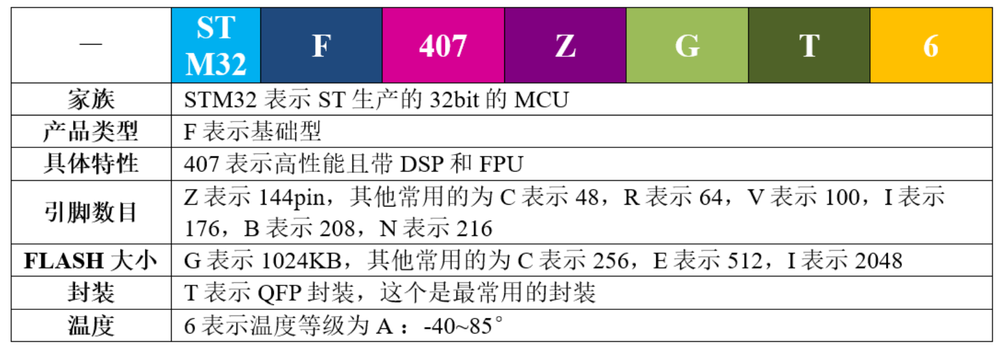
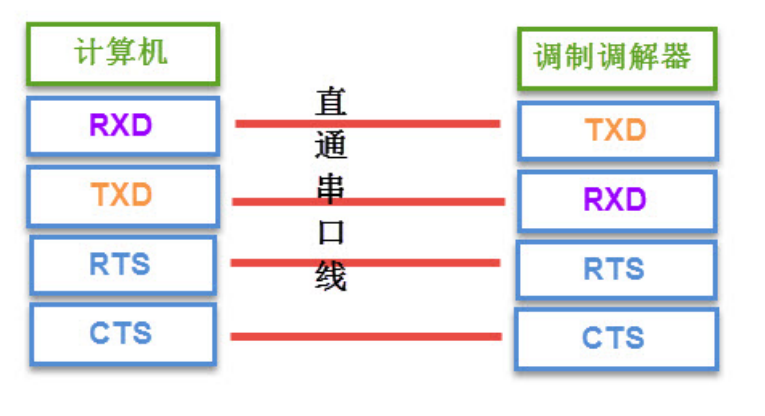
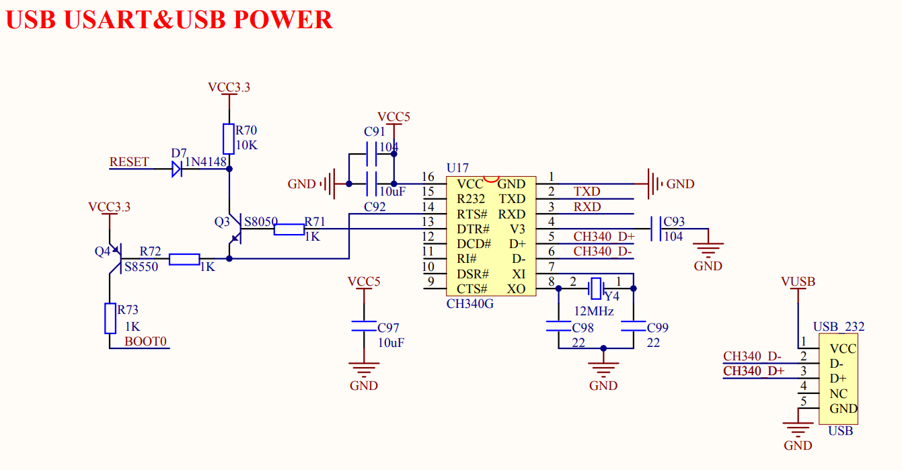
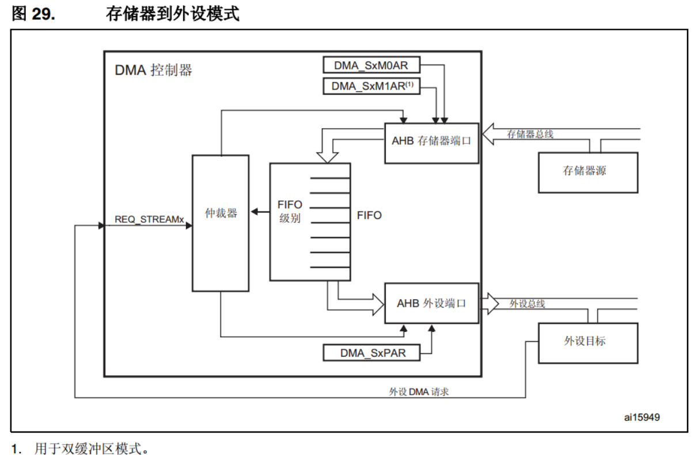
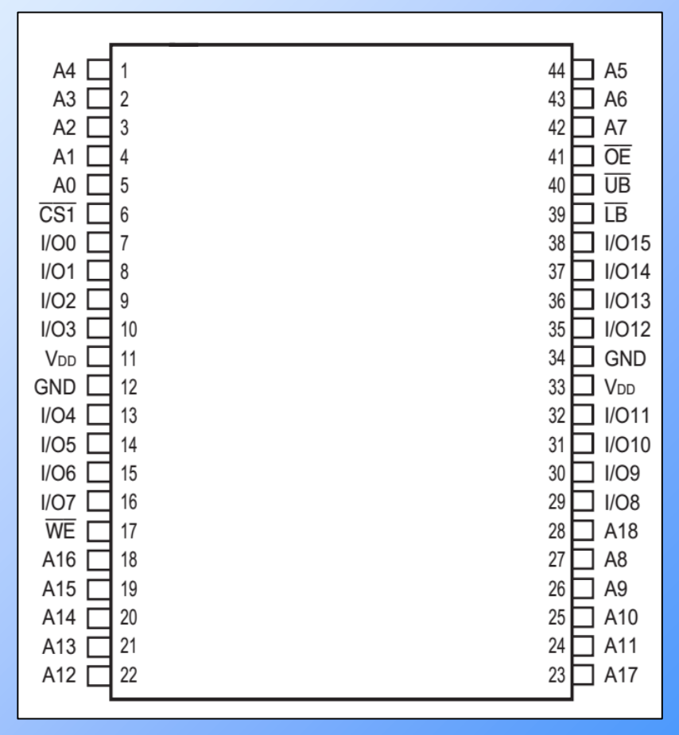
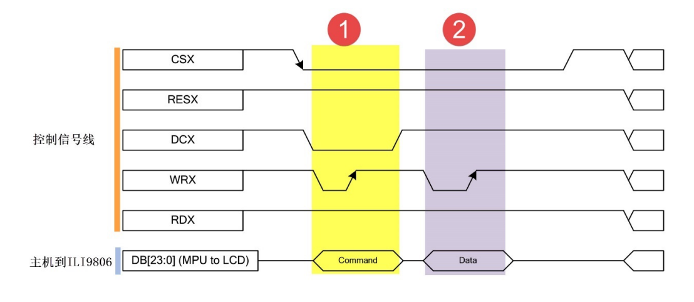

# 野火F407开发板-霸天虎视频

## 初级篇

### 第5章 初识STM32

#### STM32命名方法

野火F407霸天虎和正点原子用到都是STM32F407ZGT6芯片

STM32的命名方法：



更详细的命名方法见下图：


#### 选择合适的MCU

了解了 STM32 的分类和命名方法之后，就可以根据项目的具体需求先大概选择哪类内核的 MCU:

* 普通应用，不需要接大屏幕的一般选择`Cortex-M3`内核的F1系列
* 如果要追求高性能，需要大量的数据运算，要做图形界面的则选择`Cortex-M4`内核的F407系列

明确了大方向之后，接下来就是细分选型：

* 先确定引脚，引脚多的功能就多，价格也贵，具体 得根据实际项目中需要使用到什么功能，够用就好
* 选择 FLASH 大小， 相同引脚数的MCU会有不同的FLASH大小可供选择。

#### 如何分配原理图IO

在画原理图之前，一般要先把引脚分类好，才开始画原理图，具体的分类见下表：


#### 如何寻找IO的功能说明

从官方的数据手册可以找到每个IO的功能说明，有两个官方资料经常用到：

* 参考手册（Reference manual）
* 数据手册（Data Sheet）

两者的区别如下表所示：


一句话概括：数据手册主要用于芯片选项和设计原理图时参考，参考手册主要用于在编程的时候查阅外设的功能和寄存器说明。

> 官方的两个文档可以在这里找到：http://www.stmcu.org/document/list/index/category-150
>
> 也可以在光盘资料里面找到

在数据手册中，有关引脚定义的部分在`Pinout and pin description`小节中，具体定义的解读如下：


#### 开始分配原理图IO

这里用的MCU型号为STM32F407ZGT6，封装为LQFP144：

* 在数据手册中找到对应封装的引脚定义
* 根据引脚序号，一个个复制出来，整理成excel表
* 整理方法按照上面的`如何分配原理图IO`的引脚类型进行分配（可参考`STM32F407ZGT6管脚汇总.xlsx`）
* 分配之后就开始画原理图

#### PCB在哪里打样

设计好原理图，画好PCB之后，需要把板子做出来，进行软硬件联调。

PCB打样推荐嘉立创。

### 第6章 什么是寄存器

本章参考资料：《STM32F4xx中文参考手册》、《STM32F4xx英文数据手册》

> 学习本章时，配合《STM32F4xx中文参考手册》“存储器和总线架构”、"嵌入式FLASH接口"及"通用I/O（GPIO）"章节一起阅读，效果更佳，特别是涉及到寄存器说明的部分

#### 6.1 寄存器

学习STM32时两种编程方式：

* 寄存器编程
* 固件库编程

#### 6.2 STM32芯片外观

开发板中使用的芯片是 144pin 的 STM32F407ZGT6


芯片正面是丝印：

* ARM：表示该芯片使用的是 ARM 的内核
* STM32F429IGT6：芯片型号
*  后面的字应该是跟生产批次相关
* 最下面的是ST的LOGO

芯片四周是引脚：

* 左下角的小圆点表示1脚，然后从1脚起按照逆时针的顺序排列（所有芯片的引脚顺序都是逆时针排列的）

* 开发板中把芯片的引脚引出来，连接到各种传感器上，然后在STM32上编程（实际就是通过程序控制这些引脚输出高电平或者低电平）来控制各种传感器工作，通过做实验的方式来学习STM32芯片的各个资源。

开发板是一种评估板，板载资源非常丰富，引脚复用比较多，力求在一个板子上验证芯片的全部功能。


#### 6.3 芯片里面有什么

STM32 芯片已经是已经封装好的成品：主要由内核和片上外设组成。

STM32F407采用的是Cortex-M4内核，内核即CPU，由ARM公司设计。

* ARM 公司并不生产芯片，而是出售其芯片技术授权。
* 芯片生产厂商 (SOC) 如ST、TI、Freescale，负责在内核之外设计部件并生产整个芯片，这些内核之外的部件被称为核外外设或片上外设。如GPIO、USART（串 口）、I2C、SPI 等都叫做片上外设。

具体见图`STM32芯片架构简图`


* 芯片内核和外设之间通过总线矩阵来连接，其中主控总线有8条，被控总线有7条，具体见图`STM32F407xx器件的总线接口`

* 总线矩阵用于主控总线之间的访问仲裁管理，仲裁采用循环调度算法。

* 总线之间交叉的时候如果有个圆圈则表示可以通信，没有圆圈则表示不可以通信。

  > 比如 S0:I总线只有跟M0、M2和M6这三根被控总线交叉的时候才有圆圈，就表示S0只能跟这三根被控总线通信。
  >
  > 从功能上来理解，I总线是指令总线，用来取指，指令指的是编译好的程序指令。我们知道STM32有三种启动方式，从FLASH启 动（包含系统存储器），从内部SRAM启动，从外部RAM启动，这三种存储器刚好对应的就是M0、M2和M6这三条总线。

图`STM32F407xx器件的总线接口`


#### 6.4 存储器映射

在图`STM32F407xx器件的总线接口`中，连接被控总线的是FLASH、RAM和片上外设，<font color=red>这些功能部件共同排列在一个4GB的地址空间内</font>。我们在编程时，操作的整数这些功能部件。

##### 6.4.1 存储器的映射

存储器本身不具有地址信息，它的地址是由芯片厂商或用户分配，给存储器分配地址的过程就称为**存储器映射**，具体见图`STM32F407存储器映射`。

> 如果给存储器再分配一个地址就叫做存储器重映射


###### 6.4.1.1 存储器区域功能划分

在这4GB的地址空间中，ARM已经粗线条的平均分成了8个块，每块512MB，每个块也都规定了用途，具体分类见表格`存储器功能分类`。

> 每个块的大小都有 512MB，不一定用得完，都是只用了其中的一部分而已。
>
> 4GB地址空间：地址线有32根，2^32=4GB


在这8个Block中，3个比较重要的块：

* Block0：设计成内部FLASH
* Block1：设计成内部RAM
* Block2：设计成片上的外设

下面介绍这3个Block里面的具体区域的功能划分

**存储器Block0内部区域功能划分**

Block0主要用于设计片内的FLASH，我们使用的 STM32F407ZGT的FLASH为1MB。

Block0内部区域的功能划分具体见表格`存储器Block0内部区域功能划分`：


**存储器Block1内部区域功能划分**

Block1用于设计片内的SRAM。F407内部SRAM的大小为128KB，其中SRAM1为112KB、SRAM2为16KB.

Block1内部区域的功能划分具体见表格`存储器Block1内部区域功能划分` ：


**存储器Block2内部区域功能划分**

Block2用于设计片内的外设。

根据外设的总线速度不同，Block被分成：

* APB
  * APB1
  * APB2
* AHB
  * AHB1
  * AHB2

> 还有一个AHB3包含了Block3/4/5，AHB3包含的3个Block用于扩展外部存储器，如SRAM，NORFLASH和 NANDFLASH等。

具体见表格`存储器Block2内部区域功能划分`：


#### 6.5 寄存器映射

TODO

### 第8章 使用寄存器点亮LED灯

STM32F4IGT6 芯片有144个引脚, 有GPIOA~GPIOG共7组GIPO，每组16个引脚。

#### 8.2 GPIO 框图剖析


##### 保护二极管

引脚的两个保护二极管可以防止引脚外部过高或过低的电压输入，当引脚电压高于V DD_FT时，上方的二极管导通，当引脚电压低于V ss时，下发的二极管导通，防止不正常电压引入芯片导致芯片烧毁。

> 尽管有这样的保护，并不意味着STM32的引脚能直接外接大功率驱动器件，如直接驱动电机，强制驱动要么电机不转，要么导致芯片烧坏，必须要加大功率及隔离电路驱动。

##### 上拉/下拉电阻

通过`上拉/下拉寄存器GPIOx_PUPDR`控制引脚的上、下拉及浮空状态。

* 开启上拉时，引脚为高电平

  STM32的内部上拉是“弱上拉”，既通过此上拉输出的电流是很弱的，如要求大电流还是需要外部上拉。

* 开启下拉时，引脚为低电平

* 浮空模式(既不上拉也不下拉)

  直接用电压表测量其电压为1点几伏，这是个不确定值。（通常会选择给引脚设置上下拉模式，使它有个默认状态）
  
  

> GPIO 引脚线路经过两个保护二极管后，向上流向“输入模式”结构，向下流向“输出模式”结构。

##### P-MOS 管和 M-MOS管

P-MOS管和M-MOS管组成的单元电路结构使GPIO具有了“推挽输出”和“开漏输出”两种模式。

**推挽输出模式**

该模式的等效电路如下所示：


> 所谓的推挽输出模式，是根据这两个MOS管的工作方式来命名的。

在该结构中：

* 输入高电平时，经过反向后，上方的P-MOS管导通，下方的N-MOS管关闭，对外输出高电平
* 输入低电平时，经过反向后，N-MOS管导通，P-MOS管关闭，对外输出低电平

当引脚高低电平切换时，两个管子轮流导通，P管负责灌电流，N管负责拉电流，使其负载能力和开关速度都比普通的方式有很大的提高。

推挽输出的低电平为0伏，高电平为3.3伏。

**开漏输出模式**

该模式的等效电路如下：


在开漏输出模式时，上方的P-MOS管完全不工作。

* 控制输出0伏，低电平，则P-MOS管关闭，N-MOS管导通，使输出接地。

* 控制输出为1（它无法直接输出高电平）时，则P-MOS和N-MOS管都关闭，所以引脚既不输出高电平，也不输出低电平，为高阻态。为正常使用时必须外接上拉电阻。

  > 它具有"线与"特性：若有很多个开漏模式的引脚连接到一起时，只有当所有引脚都输出高组态时，才由上拉电阻提供高电平，此高电平的电压为外部上拉电阻所接电源的电压。若其中一个引脚为低电平，线路就相对于短路接地，使得整条线路都为低电平，0伏。

**使用场景**

* 推挽输出模式一般应用在输出电平为 0 和 3.3 伏而且需要高速切换开关状态的场合。在 STM32的应用中，除了必须用开漏模式的场合，我们都习惯使用推挽输出模式。

* 开漏输出一般应用在 I2C、SMBUS 通讯等需要“线与”功能的总线电路中。除此之外，还用在电平不匹配的场合，如需要输出 5 伏的高电平，就可以在外部接一个上拉电阻，上拉电源为 5 伏，并且把 GPIO 设置为开漏模式，当输出高阻态时，由上拉电阻和电源向外输出 5 伏的电平，具体见图 *STM32_IO* 对外输出 5V 电平：

   

##### 输出数据寄存器

* 上面提到的双MOS管结构电路的输入信号，是由GPIO `输出寄存器GPIOx_ODR`"提供的。通过修改该寄存器可以修改GPIO引脚的输出电平。
* `置位/复位寄存器GPIOx_BSRR`可以通过修改`输出寄存器`的值从而影响电路的输出。

##### 复用功能输出

“复用”是指 STM32 的的其它片上外设对GPIO引脚进行控制，此时GPIO引脚用作该外设功能的一部分。

从其它外设引出来的"复用功能输出信号"与GPIO本身的数据寄存器都连接到双MOS管结构的输入中，通过图中的梯形结构作为开关切换选择。

##### 输入数据寄存器

看GPIO结构框图的上半部分，它是GPIO引脚经过上、下拉电阻引入的，它连接到施密特触发器，信号经过触发器后，模拟信号就转化为0、1的数字信号，然后存储在`输入数据寄存器GPIOx_IDR`中，通过读取该寄存器就可以了解GPIO引脚的电平状态。

##### 复用功能输入

与“复用功能输出”模式类似，在“复用功能输入模式”时，GPIO 引脚的信号传输到 STM32 其它片上外设，由该外设读取引脚状态。

##### 模拟输入输出

* 当 GPIO 引脚用于 ADC 采集电压的输入通道时，用作“模拟输入”功能，此时信号是不经过施密特触发器的，因为经过施密特触发器后信号只有 0、1 两种状态，所以 ADC 外设要采集到原始的模拟信号，信号源输入必须在施密特触发器之前。
* 当 GPIO 引脚用于 DAC 作为模拟电压输出通道时，此时作为“模拟输出”功能，DAC 的模拟信号输出就不经过双 MOS 管结构了，在 GPIO 结构框图的右下角处，模拟信号直接输出到引脚。

* 当 GPIO 用于模拟功能时 (包括输入输出)，引脚的上、下拉电阻是不起作用的，这个时候即使在寄存器配置了上拉或下拉模式，也不会影响到模拟信号的输入输出。

##### GPIO工作模式总结

由GPIO的结构决定了GPIO可以配置成以下模式：

###### 输入模式（上拉/下拉/浮空）

* 在输入模式时，施密特触发器打开，输出被禁止。
* 数据寄存器每隔1个 AHB1 时钟周期更新一次，可通过输入数据寄存器 GPIOx_IDR 读取 I/O 状态。其中 AHB1 的时钟如按默认配置一般为180MHz。

* 用于输入模式时，可设置为上拉、下拉或浮空模式。

###### 输出模式（推挽/开漏，上拉/下拉）

在输出模式中，输出使能：

* 推挽模式时，输出数据寄存器`GPIOx_ODR`可控制I/O输出高低电平
* 开漏模式时，输出数据寄存器可控制I/O输出高阻态或低电平

* 输出速度可配置，有 2MHz25MHz50MHz100MHz 的选项。

  >  此处的输出速度即 I/O支持的高低电平状态最高切换频率，支持的频率越高，功耗越大，如果功耗要求不严格，把速度设置成最大即可。

此时施密特触发器是打开的，即输入可用，通过`输入数据寄存器 GPIOx_IDR`可读取 I/O 的实际状态。

输出模式中上下拉电阻的影响：

* 当 GPIO 引脚用于输入时，引脚的上/下拉模式可以控制引脚的默认状态。

* 但当 GPIO 引脚用于输出时，引脚受 ODR 寄存器（数据输出寄存器）影响（推挽模式时，ODR配置高电平和下拉时是否有影响待考究）。

  > ODR配置低电平时，上拉不会改变引脚电平状态，只会小幅提高电流输出能力，引脚输出低电平
  >
  > TODO： ODR配置高电平时，下拉会不会影响引脚电平，这个待实验测试。

* ODR 寄存器对应引脚位初始化后默认值为 0，引脚输出低电平，此时上拉能小幅提高电流输出能力。

用于输出模式时，可使用上拉、下拉模式或浮空模式。但在输出模式时引脚电平会受到ODR 寄存器影响，当ODR 寄存器对应引脚的位为 0，即引脚初始化后默认输出低电平，所以在这种情况下，上拉只起到小幅提高输出电流能力，但不会影响引脚的默认状态。

###### 复用功能（推挽/开漏，上拉/下拉）

* 复用功能模式中，输出使能，输出速度可配置，可工作在开漏及推挽模式，但是输出信号源于其它外设，输出`数据寄存器 GPIOx_ODR` 无效
* 输入可用，通过输入`数据寄存器可获取 I/O` 实际状态，但一般直接用外设的寄存器来获取该数据信号。
* 用于复用功能时，可使用上拉、下拉模式或浮空模式。同输出模式，在这种情况下，初始化后引脚默认输出低电平，上拉只起到小幅提高输出电流能力，但不会影响引脚的默认状态。

###### 模拟输入输出

模拟输入输出模式中，双 MOS 管结构被关闭，施密特触发器停用，上/下拉也被禁止。其它外设通过模拟通道进行输入输出。


**GPIO 寄存器的参数配置**


##### 相关寄存器

###### GIPO 端口模式寄存器(GPIOx_MODER)(x=A..I)
GPIO port mode register
32位有效
00:输入（复位状态）
01:通用输出模式
10:复用功能模式
11:模拟模式

###### GPIO 端口输出类型寄存器(GPIOx_OTYPER)(x=A..I)
GPIO port output type register
16位有效
0:输出推挽(复位状态)
1:输出开漏

###### GPIO 端口输出速度寄存器(GPIOx_OSPEEDR)(x=A..I)
GPIO port output speed register
32位有效
00:  2MHz(低速)
01: 25MHz(中速)
10: 50MHz(快速)
11: 30 pF时为100MHz(高速)(15pF时为80MHz输出(最大速度))

###### GPIO 端口上拉/下拉寄存器(GPIOx_PUPDR)(x=A..I)
GPIO port pull-up/pull-down register
32位有效
00:无上拉或下拉
01:上拉
10:下拉
11:保留

###### GPIO 端口置位/复位寄存器(GPIOx_BSRR)(x=A..I)
GPIO port bit set/reset register
32位有效 
位31:16
    0: 不会对相应的ODRx位执行任何操作
    1: 对相应的ODRx位进行复位
位15:0
    0: 不会对相应的ODRx位执行任何操作
    1: 对相应的ODRx位进行置位


### 第9章 自己写库--构建库函数雏形

本章参考资料：《STM32F4xx中文参考手册》、《STM32F4xx英文数据手册》

STM32的寄存器都是32位的。

#### 9.1 什么是STM32固件库

固件库是指“STM32 标准函数库”，它是由ST公司针对STM32提供的函数接口，即API (Application Program Interface)，开发者可调用这些函数接口来配置STM32的寄存器，使开发人员得以脱离最底层的寄存器操作，有开发快速，易于阅读，维护成本低等优点。

库开发方式与直接配置寄存器方式的区别见图`固件库开发与寄存器开发对比图 `：


#### 9.2 为什么采用库来开发及学习

#### 9.3 实验：构建库函数雏形

略

### 第10章 认识STM32固件库

接下来简单分析下ST官方的固件库的组成部分

#### 10.1 CMSIS标准及库层次关系

ARM与芯片厂商建立了CMSIS标准(Cortex MicroController Software Interface Standard)：用来解决相同内核、不同片上外设的差异导致软件兼容问题。

CMSIS层位于硬件层与操作系统或用户层之间，提供了与芯片生产商无关的硬件抽象层，可以为接口外设、实时操作系统提供简单的处理器软件接口，屏蔽了硬件差异，这对软件的移植是有极大的好处的。

STM32的库，就是按照CMSIS标准建立的。

CMSIS标准，实际是新建了一个软件抽象层，具体见见图`CMSIS 架构`：


CMSIS 标准中最主要的为CMSIS核心层，它包括了：

* 内核函数层：其中包含用于访问内核寄存器的名称、地址定义，主要由ARM公司提供
* 设备外设访问层：提供了片上的核外外设的地址和中断定义，主要由芯片生产商提供

##### 10.1.1 库目录文件简介

> STM32 标准库可以从官网获得，也可以直接从本书的配套资料得到。本书讲解的例程全部采用1.8.0库文件。

打开固件库`STM32F4xx_DSP_StdPeriph_Lib_V1.8.0`:


* Libraries：文件夹下是驱动库的源代码及启动文件。
* Project：文件夹下是用驱动库写的例子和工程模板。
* Utilities：包含了基于ST官方实验板的例程，以及第三方软件库，如emwin图形软件库、fatfs文件系统。
* MCD-ST Liberty…：库文件的License说明。 
*  Release_Note.html：库的版本更新说明。

* stm32f4xx_dsp_stdperiph…：库帮助文档，这是一个已经编译好的HTML文件，主要讲述如何使用驱动库来编写自己的应用程序。

在使用库开发时，我们需要把libraries目录下的库函数文件添加到工程中，并查阅库帮助文档来了解ST提供的库函数，这个文档说明了每一个库函数的使用方法。

进 入Libraries文件夹看到：关于内核与外设的库文件分别存放在CMSIS和STM32F4xx_StdPeriph_Driver文件夹中。

先看看CMSIS文件夹：


其中用得最多的两个文件夹：

* Device
* Include

TODO：剩下的待编写

### 第11章 新建工程--库函数版

略

### 第12章 GPIO输出--使用固件库点亮LED

#### 硬件连接（正点原子）


TODO：剩下的待编写

### 第15章 启动文件详解

参考资料：

* 《STM32F4xx中文参考手册》第10章 中断和事件
* MDK中的帮助手册--ARM Development Tools：用来查询ARM的汇编指令和编译器相关的指令

#### 15.1 启动文件简介

启动文件是由汇编编写，是系统上电复位后第一个执行的程序。主要做了以下工作：

* 初始化堆栈指针  `sp=_initial_sp`
* 初始化PC指针 `=Reset_Handler`
* 初始化中断向量表
* 配置系统时钟
* 调用C库函数`_main`初始化用户堆栈，从而最终调用main函数去到C的世界

#### 15.2 查找ARM汇编指令

启动代码涉及到：

* Cortex内核的指令（参考《CM3权威指南CnR2》第4章：指令集）

* ARM的汇编指令（参考：`MDK->Help->Uvision Help`中搜索到相关指令）

  以指令EQU为例，检索如下：

  

检索出来的结果较多，只需看`Assembler User Guide`部分即可。

如下列出启动文件使用到的ARM汇编指令（该列表详细从上述文档检索而来）：

> 为了方便，把两个编译器相关的指令`WEAK`和`ALIGN`也放了进来


#### 15.3 启动文件代码讲解

##### 15.3.1 Stack--栈


上述代码作用：开辟栈的大小为0X00000400（1KB），名字为STACK

栈的作用：用于局部变量、函数调用、函数形参等的开销。

栈的大小不能超过内部SRAM的大小。

> 如果编写的程序比较大，定义的局部变量很多，那么就需要修改栈的大小。如果程序出现莫名其妙的错误并进入了硬fault的时候，需要考虑是不是栈不够大。

指令详解：

* EQU：宏定义的伪指令，相当于等于。类似与C中的define。
* AREA：告诉汇编器汇编一个新的代码段或者数据段。
  * STACK表示段名，这个可以任意命名；
  * NOINIT表示不初始化
  * READWRITE 表示可读可写
  * ALIGN=3，表示按照2^3对齐，即8字节对齐

* SPACE：用于分配一定大小的内存空间，单位为字节。这里指定大小等于`Stack_Size`。
*  标号`__initial_sp`紧挨着SPACE语句放置，表示栈的结束地址，即栈顶地址，栈是由高向低生长的。

##### 15.3.2 Heap堆


上述代码作用：开辟堆的大小为0X00000200（512 字节），名字为HEAP

* `__heap_base` 表示对的起始地址
* `__heap_limit` 表示堆的结束地址

堆是由低向高生长的，跟栈的生长方向相反。

堆的作用：用来动态内存的分配，像malloc() 函数申请的内存就在堆上面。这个在 STM32 里面用的比较少。


* PRESERVE8：指定当前文件的堆栈按照8字节对齐。

* THUMB：表示后面指令兼容THUMB指令。

  > THUBM 是ARM以前的指令集，16bit，现在 Cortex-M 系列的都使用 THUMB-2 指令集，THUMB-2 是32位的，兼容16位和32位的指令，是 THUMB 的超集。

##### 15.3.3 向量表


作用：定义一个数据段，名字为RESET，可读。并声明` __Vectors`、`__Vectors_End`和 `__Vectors_Size` 这三个标号具有全局属性，可供外部的文件调用。

* EXPORT：声明一个标号可被外部的文件使用，使标号具有全局属性。如果是IAR编译器，则使用的是 GLOBAL这个指令。

**向量表的作用：**

当内核响应了一个发生的异常后，对应的异常服务例程 (ESR) 就会执行。为了决定 ESR 的入口 地址，内核使用了“向量表查表机制”。这里使用一张向量表。向量表其实是一个 WORD（32 位 整数）数组，每个下标对应一种异常，该下标元素的值则是该 ESR 的入口地址。向量表在地址空 间中的位置是可以设置的，通过 NVIC 中的一个重定位寄存器来指出向量表的地址。在复位后， 该寄存器的值为 0。因此，在地址 0 （即 FLASH 地址 0）处必须包含一张向量表，用于初始时的 异常分配。要注意的是这里有个另类：0 号类型并不是什么入口地址，而是给出了复位后 MSP 的 初值。


* `__Vectors `为向量表起始地址，`__Vectors_End`为向量表结束地址，两个相减即可算出向量表大小。

* 向量表从FLASH的0地址开始放置，以4个字节为一个单位，地址0存放的是栈顶地址，0X04存放的是复位程序的地址，以此类推。
* DCD：分配一个或者多个以字为单位的内存，以四字节对齐，并要求初始化这些内存。在向量表中，DCD分配了一堆内存，并且以ESR的入口地址初始化它们。

##### 15.3.4 复位程序


定义一个名称为`.text `的代码段，可读。


复位子程序是系统上电后第一个执行的程序，调用SystemInit函数初始化系统时钟，然后调用C库函数`_mian`，最终调用main函数去到C的世界。

* WEAK：表示弱定义，如果外部文件优先定义了该标号则首先引用该标号，如果外部文件没有声明也不会出错。这里表示复位子程序可以由用户在其他文件重新实现，这里并不是唯一的。 
* IMPORT：表示该标号来自外部文件，跟C语言中的EXTERN关键字类似。这里表示 SystemInit 和 `__main`这两个函数均来自外部的文件。

* SystemInit() 是一个标准的库函数，在`system_stm32f4xx.c`这个库文件总定义。主要作用是配置系统时钟，这里调用这个函数之后，F429的系统时钟配被配置为180M。
* `__main`是一个标准的C库函数，主要作用是初始化用户堆栈，最终调用main函数去到C的世界。

LDR、BLX、BX 是 CM4 内核的指令，可在《CM3 权威指南 CnR2》第四章--指令集里面查询到


##### 15.3.5 中断服务程序

在启动文件里面已经帮我们写好所有中断的中断服务函数，不过这些函数都是空的，真正的中断复服务程序需要我们在外部的C文件里面重新实现，这里只是提前占了一个位置而已。

如果开启了某个中断而没有实现中断服务函数，那中断发生时，程序会跳转到启动文件允许写好的空的中断服务函数中，并且在这个空函数中无限循环，即程序就在这里死循环。


B：跳转到一个标号。这里跳转到一个‘.’，即表示无线循环。

##### 15.3.6 用户堆栈初始化


ALIGN：对指令或者数据存放的地址进行对齐，后面会跟一个立即数。缺省表示4字节对齐。


* 首先判断是否定义了` __MICROLIB` 

  * 如果定义了这个宏则赋予标号 `__initial_sp（栈顶地址）`、 `__heap_base（堆起始地址）`、`__heap_limit（堆结束地址）`全局属性，可供外部文件调用。有关这个宏我们在 KEIL 里面配置，具体见图使用微库 。然后堆栈的初始化就由C库函数`_main`来完成。

    

  * 如果没有定义` __MICROLIB`，则插入标号`__use_two_region_memory`，这个函数需要用户自己实现，具体要实现成什么样，可在KEIL的帮助文档里面查询到，具体见图`use_two_region_memory`函数：

    

    然后声明标号`__user_initial_stackheap`具有全局属性，可供外部文件调用，并实现这个标号的内 容。

* IF,ELSE,ENDIF：汇编的条件分支语句，跟C语言的if ,else 类似

* END：文件结束

### 第16章 RCC--使用HES/HSI配置时钟

参考资料：《STM32F4xx中文参考手册》RCC章节

RCC：reset clock control 复位和时钟控制器。

本章主要讲解：时钟部分，特别是着重理解时钟树。

#### 16.1 RCC主要作用--时钟部分

主要内容：

* 设置系统时钟SYSCLK
* 设置AHB分频因子（决定HCLK等于多少）
* 设置APB2分频因子（决定PCLK2等于多少）
* 设置APB1分频因子（决定PCLK1等于多少）
* 设置各个外设的分频因子
* 控制AHB、APB2和APB1这3条总线时钟的开启、控制每个外设的时钟的开启

对于SYSCLK、HCLK、PCLK2、PCLK1这四个时钟的配置一般是：HCLK=SYSCLK=PLLCLK=168M，PCLK2=HCLK/2=84M，PCLK1=HCLK/4=42M。

> 这个时钟配置也是库函数的标准配置

#### 16.2 RCC框图剖析--时钟树

以库函数中系统时钟设置函数`SetSysClock()`为主线，来分析时钟树。

该函数的作用：利用HSE把时钟设置为HCLK=SYSCLK=PLLCLK=168M，PCLK2=HCLK/2=84M，PCLK1=HCLK/4=42M。

如下图所示：代码流程对应图中的黄色部分并以数字的大小顺序标识：


##### 16.2.1 系统时钟

###### 16.2.1.1 HSE高速外部时钟信号

HSE是高速的外部时钟信号：

* 可由有源晶振或无源晶振提供
  * 当使用有源晶振时，时钟从`OSC_IN`引脚进入，`OSC_OUT`引脚悬空
  * 当使用有源晶振时，时钟从`OSC_IN`和`OSC_OUT`进入，并且要配谐振电容
* 频率为4~26MHZ不等

* HSE我们使用25M的无源晶振

**HSE发生故障时系统的处理情况：**

如果我们使用HSE或HSE经过PLL倍频之后的时钟作为系统SYSCLK，当HSE故障时，不仅HSE会被关闭，PLL也会被关闭，此时高速的内部时钟信号HSI会作为备用的系统时钟，直到HSE恢复正常，HSI=16M。

###### 16.2.1.2 锁相环

PLL的主要作用：对时钟进行倍频，然后把时钟输出到各个功能部件。

PLL有两个（均由HSE或HSI提供信号）：

* 主PLL
  * 两路时钟输出：
    * 第一个输出时钟PLLCLK用于系统时钟，F407里面最高是168M
    * 第二个输出用于USB、OTG、TS的时钟（48M）
* 专用的PLL2
  * 时钟输出：用于生成精确的时钟，给I2S提供时钟

**时钟流程**


HSE或者HSI经过PLL时钟输入分频因子M（2~63）分频后，成为VCO的时钟输入，VCO的时钟必须在1~2M之间

>  我们选择HSE=25M作为PLL的时钟输入，M设置为25，那么VCO输入时钟就等于1M。

VCO输入时钟经过VCO倍频因子N倍频之后，成为VCO时钟输出，VCO时钟必须在192~432M之间。

> 我们配置N为 336，则VCO的输出时钟等于336M。如果要把系统时钟超频，就得在VCO倍频系数N这里做手脚。PLLCLK_OUTMAX = VCOCLK_OUTMAX/P_MIN =432/2=216M，即F407最高可超频到216M。

VCO 输出时钟之后有三个分频因子：

* PLLCLK分频因子p
  * p可以取值 2、4、6、8, 我们配置为2，则得到PLLCLK=168M。
* USB OTG FS/RNG/SDIO 时钟分频因子Q
  * Q可以取值 4~15，但是USB OTGFS 必须使用48M，Q=VCO输出时钟336/48=7。
* 分频因子 R（F446 才有，F407 没有）。

> 有关PLL的配置有一个专门的RCC PLL配置寄存器`RCC_PLLCFGR`，具体描述看手册即可。

PLL 的时钟配置经过，稍微整理下可由如下公式表达：

* `VCOCLK_IN = PLLCLK_IN / M = HSE / 25 = 1M` 
* `VCOCLK_OUT = VCOCLK_IN * N = 1M * 336 = 336M` 
* `PLLCLK_OUT=VCOCLK_OUT/P=336/2=168M`
* `USBCLK = VCOCLK_OUT/Q=336/7=48M`

###### 16.2.1.3 系统时钟SYSCLK

系统时钟来源可以是：（具体由时钟配置寄存器`RCC_CFGR`的SW位配置）

* HSI
* PLLCLK
* HSE

> 我们这里设置系统时钟：SYSCLK=PLLCLK=168M

###### 16.2.1.4 AHB总线时钟HCLK

AHB总线时钟（即HCLK）：由系统时钟SYSCLK经过AHB预分频器分频之后得到。

* 分频因子可以是：1、2、4、8、16、64、128、256、512中的一个

  具体由时钟配置寄存器`RCC_CFGR`的HPRE位设置

* 片上大部分外设的时钟都是经过HCLK得到

  至于AHB总线上的外设的时钟设置为多少，得等到我们使用该外设的时候才设置，这里只需粗线条的设置好AHB的时钟即可，我们设置为1分频，即HCLK=SYSCLK=168M

###### 16.2.1.5 APB2总线时钟PCLK2

APB2总线时钟PCLK2：由HCLK经过高速APB2预分频器得到。

* 分频因子可以是：1、2、4、8、16中的一个

  具体由时钟配置寄存器`RCC_CFGR`的PPRE2位设置

* PCLK2属于高速的总线时钟，片上高速的外设就挂载到这条总线上，比如GPIO、USAR1、SPI1等

  > 至于APB2总线上的外设的时钟设置为多少，得等到使用外设的时候才设置，我们这里只需粗线条的设置好APB2的时钟即可。我们这里设置为2分频，即PCLK2=HCLK/2=84M

###### 16.2.1.6 APB1总线时钟PCLK1

APB1总线时钟PCLK1：由HCLK经过低速APB预分频器得到

* 分频因子可以是：1、2、4、8、16

  具体由时钟配置寄存器`RCC_CFGR`的PPRE1位设置

* PCLK1属于低速的总线时钟，最高为42M，片上低速的外设就挂载到这条总线上，比如USART2/3/4/5、SPI2/3、I2C1/2等。

  > 至于APB1总线上的外设的时钟设置为多少，得等到使用外设的时候才设置，我们这里只需粗线条的设置好APB1的时钟即可。我们这里设置为4分频，即PCLK1=HCLK/4=42M

###### 16.2.1.7 设置系统时钟函数

上面的6个步骤对应的系统时钟库函数具体见`代码清单：RCC-1`

> 为方便阅读，已把跟407不相关的代码删除，把英文注释翻译成中文，并把代码标上了序号，总共6个步骤。
>
> 该函数是直接操作寄存器的，有关寄存器部分请参考数据手册的RCC的寄存器描述部分。

TODO：代码清单：`RCC-1 设置系统时钟库函数`

```c
void SetSysClock()
{
    __IO uint32_t StartUpCounter = 0, HSEStatus = 0;
  
    /* 使能 HSE */
    RCC->CR |= ((uint32_t)RCC_CR_HSEON);
 
    /* 等待 HSE 启动稳定 */
    do
    {
        HSEStatus = RCC->CR & RCC_CR_HSERDY;
        StartUpCounter++;
    } while((HSEStatus == 0) && (StartUpCounter != HSE_STARTUP_TIMEOUT));

    if ((RCC->CR & RCC_CR_HSERDY) != RESET)
    {
        HSEStatus = (uint32_t)0x01;
    }
    else
    {
        HSEStatus = (uint32_t)0x00;
    }

    // HSE 启动成功
    if (HSEStatus == (uint32_t)0x01)
    {
        // 调压器电压输出级别配置为1，以便在器件为最大频率
        // 工作时使性能和功耗实现平衡
        RCC->APB1ENR |= RCC_APB1ENR_PWREN;
        PWR->CR |= PWR_CR_VOS;

        // 设置 AHB/APB2/APB1 的分频因子
        /* HCLK = SYSCLK / 1*/
        RCC->CFGR |= RCC_CFGR_HPRE_DIV1;

        /* PCLK2 = HCLK / 2*/
        RCC->CFGR |= RCC_CFGR_PPRE2_DIV2;

        /* PCLK1 = HCLK / 4*/
        RCC->CFGR |= RCC_CFGR_PPRE1_DIV4;

        // 配置主PLL的时钟来源，设置M,N,P,Q
    	RCC->PLLCFGR = PLL_M | (PLL_N << 6) | (((PLL_P >> 1) -1) << 16) |
                   (RCC_PLLCFGR_PLLSRC_HSE) | (PLL_Q << 24);


        /* 使能主 PLL */
        RCC->CR |= RCC_CR_PLLON;

        /* 等待 PLL 稳定 */
        while((RCC->CR & RCC_CR_PLLRDY) == 0)
        {
        }
    
        // 配置FLASH预取指，指令缓存，数据缓存和等待状态
        FLASH->ACR = FLASH_ACR_PRFTEN | FLASH_ACR_ICEN |FLASH_ACR_DCEN |FLASH_ACR_LATENCY_5WS;

        // 当PLL稳定之后，把PLL时钟切换为系统时钟SYSCLK
        RCC->CFGR &= (uint32_t)((uint32_t)~(RCC_CFGR_SW));
        RCC->CFGR |= RCC_CFGR_SW_PLL;

        // 读取时钟切换状态位，确保PLLCLK被选为系统时钟
        while ((RCC->CFGR & (uint32_t)RCC_CFGR_SWS ) != RCC_CFGR_SWS_PLL);
        {
        }
    }
    else
    { 
          // HSE启动出错处理
    }
}
```

##### 16.2.2 其他时钟

通过对系统时钟设置的讲解，整个时钟树我们已经把握的有六七成，剩下的时钟部分我们讲解几个重要的。

###### 16.2.2.1 RTC时钟

RTCCLK时钟：

* 时钟源可以是：

  * HSE 1MHZ（HSE由一个可以编程的预分频器分频）
  * LSE时钟
  * LSI时钟

* 选择方式

  编程RCC备份域控制寄存器（`RCC_BDCR`）中的`RTCSEL[1:0]`位和RCC时钟配置寄存器（`RCC_CFGR`）中的`RTCPRE[4:0]`位。所做的选择只能通过复位备份域的方式修改。

  > 我们通常的做法是由LSE给RTC提供时钟，大小为32.768KHZ。
  >
  > LSE由外接的晶体谐振器产生，所配的谐振电容精度要求高，不然很容易不起震。

###### 16.2.2.2 独立看门狗时钟

独立看门狗时钟由内部的低速时钟LSI提供，大小为32KHZ。

###### 16.2.2.3 I2S时钟

I2S时钟可由外部的时钟引脚`I2S_CKIN`输入，也可由专用的PLLI2SCLK提供，具体的由RCC 时钟配置寄存器(`RCC_CFGR`) 的I2SSCR位配置。

>  我们在使用I2S外设驱动W8978的时候，使用的时钟是PLLI2SCLK，这样就可以省掉一个有源晶振。

###### 16.2.2.4 PHY以太网时钟

F407要想实现以太网功能，除了有本身内置的MAC之外，还需要外接一个PHY芯片。

常见的PHY 芯片有：

* DP83848
  * 支持 MII 和 RMII 接口
* LAN8720
  * 只支持 RMII 接口
* 异同点：
  * 使用RMII接口的好处是使用的IO减少了一半，速度还是跟MII接口一样。
  * 当使用RMII接口时，PHY芯片只需输出一路时钟给MCU即可，如果是MII接口，PHY芯片则需要提供两路时钟给MCU

> 野火F407开发板用的是RMII接口，选择的PHY芯片是LAB8720。

###### 16.2.2.5 USB PHY时钟

* F407的USB没有集成PHY
* 要想实现USB高速传输的话，必须外置USB PHY芯片
* 常用的芯片是USB3300。

* 当外接USB PHY芯片时，PHY芯片需要给MCU提供一个时钟。
* 外扩USB3300会占用非常多的IO，跟SDRAM和RGB888的IO会复用的很厉害

> 鉴于USB高速传输用的比较少，野火F407霸天虎就没有外扩这个芯片。

###### 16.2.2.6 MCO时钟输出

MCO（microcontroller clock output，微控制器时钟输出引脚）：主要作用是可以对外提供时钟，相当于一个有源晶振。

* F407中有两个MCO，有PA8/PC9复用所得。

* 相关配置：

  * MCO1所需的时钟源通过RCC时钟配置寄存器 (`RCC_CFGR`) 中的`MCO1PRE[2:0]`和`MCO1[1:0]`位选择。

  * MCO2所需的时钟源通过RCC时钟配置寄存器 (`RCC_CFGR`) 中的`MCO2PRE[2:0]`和`MCO2`位选择。

  * 有关MCO的IO、时钟选择和输出速率的具体信息如下表所示：

    

#### 16.3 配置系统时钟实验

##### 16.3.1 使用HSE

一般情况下都是使用 HSE，然后HSE经过PLL倍频之后作为系统时钟。

F407系统时钟最高为168M，这个是官方推荐的最高的稳定时钟，也可以超频，超频最高能到216M。

如果我们使用库函数编程：

* 当程序来到main函数之前，启动文件：`startup_stm32f40xxx.s`已经调用`SystemInit()`函数把系统时钟初始化成168MHZ
* `SystemInit()`在库文件：`system_stm32f4xx.c`中定义。
* 如果我们想把系统时钟设置低一点或者超频的话，可以修改底层的库文件，但是为了维持库的完整性，我们可以根据时钟树的流程自行写一个。

##### 16.3.2 使用HSI

当HSE直接或者间接（HSE经过PLL 倍频）的作为系统时钟的时候，如果HSE发生故障，不仅HSE会被关闭，连PLL也会被关闭，这个时候系统会自动切换HSI作为系统时钟，此时SYSCLK=HSI=16M，如果没有开启CSS和CSS中断的话，那么整个系统就只能在低速率运行， 这是系统跟瘫痪没什么两样。

如果开启了CSS功能的话，那么可以当HSE故障时，在CSS中断里面采取补救措施，使用HSI重新设置系统频率为168M，让系统恢复正常使用。但这只是权宜之计，并非万全之策，最好的方法还是要采取相应的补救措施并报警，然后修复HSE。临时使用HSI只是为了把损失降低到最小，毕竟<font color=red>HSI较于HSE精度还是要低点</font>。

在F407中，无论是使用HSI还是HSE都可以把系统时钟设置为168M，因为HSE或者HSI在进入PLL倍频的时候都会被分频为1M之后再倍频。

##### 16.3.3 硬件设计

* RCC（单片机内部资源，不需要外部电路）
* LED一个（通过LED闪烁的频率来直观的判断不同系统时钟频率对软件延时的效果）

##### 16.3.4 软件设计

编写两个RCC驱动文件，`bsp_clkconfig.h`和`bsp_clkconfig.c`，用来存放RCC系统时钟配置函数。

###### 16.3.4.1 编程要点

1、开启HSE/HSI，并等待HSE/HSI稳定

2、设置AHB、APB2、APB1的预分频因子 

3、设置PLL的时钟来源，设置VCO输入时钟分频因子`PLL_M`，设置VCO输出时钟倍频因子`PLL_N`，设置PLLCLK 时钟分频因子`PLL_P`，设置OTG FS,SDIO,RNG 时钟分频因子`PLL_Q`。 

4、开启PLL，并等待PLL稳定 

5、把PLLCK切换为系统时钟SYSCLK

6、读取时钟切换状态位，确保PLLCLK被选为系统时钟

###### 16.3.4.2 代码分析

代码参考`code\yehuo\chapter16\rcc`

`bsp_clkconfig.c`函数介绍：

* `void user_SetSysClock(uint32_t m, uint32_t n, uint32_t p, uint32_t q);`

  配置使用HSE作为系统时钟源（使用寄存器的方式）

* `void HSE_SetSysClock(uint32_t m, uint32_t n, uint32_t p, uint32_t q);`

  配置使用HSE作为系统时钟源（使用库函数的方式）

* `void HSI_SetSysClock(uint32_t m, uint32_t n, uint32_t p, uint32_t q);`

  配置使用HSI作为系统时钟源（使用库函数的方式）

* `void MCO1_GPIO_Config(void);`

  MCO1 输出PLLCLK，配置相关引脚

* `void MCO2_GPIO_Config(void);`

  MCO2 输出PLLCLK，配置相关引脚

### 第17章 STM32中断应用概览

参考资料：

* 《STM32F4xx中文参考手册》第十章 中断和事件
* 《ARM Cortex-M4F技术参考手册》4.3章节：NVIC和4.4章节：SCB--4.4.5的AIRCR

#### 17.1 异常类型

F407搭载了一套异常响应系统，支持为数众多的系统异常和外部中断。

中断类型：

* 系统异常（10个），体现在内核水平
* 外部中断（82个），体现在外设水平

除个别异常的优先级被锁死外，其他异常的优先级都是可编程的。

`IRQn_Type`结构体包含了F4系列全部的异常声明（在stm32f4xx.h中）

**F407系统异常清单**


**F407外部中断清单**


#### 17.2 NVIC简介

NVIC：嵌套向量中断控制器，控制着整个芯片中断相关的功能，它跟内核紧密耦合，是内核里面的一个外设。

> 芯片厂商在设计芯片的时候会对Cortex-M4内核里面的NVIC进行裁剪。
>
> STM32的NVIC是Cortex-M4的NVIC的一个子集。

##### 17.2.1 NVIC寄存器简介

NVIC寄存器映射参考《ARM Cortex-M4F技术参考手册》--4.3.11：NVIC寄存器映射

NIVC结构体定义（`core_cm4.h`中）

```c
typedef struct
{
  __IO uint32_t ISER[8];	// 中断使能寄存器              
  uint32_t RESERVED0[24];
  __IO uint32_t ICER[8];	// 中断清除寄存器              
  uint32_t RSERVED1[24];
  __IO uint32_t ISPR[8];    // 中断使能悬起寄存器
  uint32_t RESERVED2[24];
  __IO uint32_t ICPR[8];	// 中断清除悬起寄存器
  uint32_t RESERVED3[24];
  __IO uint32_t IABR[8];    // 中断有效位寄存器
  uint32_t RESERVED4[56];
  __IO uint8_t  IP[240];    // 中断优先级寄存器（8Bit wide）
  uint32_t RESERVED5[644];
  __O  uint32_t STIR;       // 软件触发中断寄存器
}  NVIC_Type;
```

一般只用下面三个寄存器：

* ISER：用来使能中断
* ICER：用来失能中断
* IP：用来设置中断优先级

##### 17.2.2 NVIC中断配置固件库

`core_cm4.h`还提供了NVIC的一些函数，这些函数遵循CMSI规则，Cortex-M4的处理器都可以使用，具体如下：


> 这些库函数编程时用得较少，甚至基本都不用。
>
> 在配置中断的时候还有更简洁的方法，参考中断编程小节。

#### 17.3 优先级的定义

##### 17.3.1 优先级定义

NVIC有个专门的寄存器：中断优先级寄存器`NVIC_IPRx`（在F407中，x=0...981）用来配置外部中断的优先级。

IPR宽度为8bit，原则上每个外部中断可配置优先级为0~255，数值越小，优先级越高。

F407只使用了高4bit，如下所示：


* 这4bit又被分组成抢占优先级和子优先级。
* 如果有多个中断同时响应，抢占优先级高的就会抢占抢占优先级低的优先得到执行，如果抢占优先级相同，就比较子优先级。如果抢占优先级和子优先级都相同的话，就比较他们的硬件中断编号，编号越小，优先级越高。

##### 17.3.2 优先级分组

优先级分组由内核外设SCB的应用程序中断及复位控制寄存器AIRCR的PRIGROUP[10:8]位决定。

F407分为5组，具体如下：（主优先级=抢占优先级）


设置优先级分组可调用库函数`NVIC_PriorityGroupConfig()`实现。

有关NVIC中断相关的函数都在库文件misc.c和misc.h中

`中断优先级分组库函数`

```c
/**
* @brief  配置中断优先级分组：抢占优先级和子优先级
* 形参如下：
* @arg NVIC_PriorityGroup_0: 0 bits for 抢占优先级                              
							 4 bits for 子优先级
* @arg NVIC_PriorityGroup_1: 1 bits for 抢占优先级                               
							 3 bits for 子优先级
* @arg NVIC_PriorityGroup_2: 2 bits for 抢占优先级
                             2 bits for 子优先级
* @arg NVIC_PriorityGroup_3: 3 bits for 抢占优先级
                             1 bits for 子优先级
* @arg NVIC_PriorityGroup_4: 4 bits for 抢占优先级
*                            0 bits for 子优先级
* @note 如果优先级分组为0，则抢占优先级就不存在，优先级就全部由子优先级控制
* @retval None
*/
void NVIC_PriorityGroupConfig(uint32_t NVIC_PriorityGroup)
{
  /* Check the parameters */
  assert_param(IS_NVIC_PRIORITY_GROUP(NVIC_PriorityGroup));
  
  // 设置优先级分组
  SCB->AIRCR = AIRCR_VECTKEY_MASK | NVIC_PriorityGroup;
}
```


#### 17.4 中断编程

配置每个中断的时候一般有3个编程要点：

* 使能外设某个中断，这个具体由每个外设的相关中断使能位控制。比如串口有发送完成中断，接收完成中断，这两个中断都由串口控制寄存器的相关中断使能位控制。

* 初始化`NVIC_InitTypeDef`结构体，配置中断优先级分组，设置抢占优先级和子优先级，使能中断请求。

  NVIC 初始化结构体：

  ```c
  typedef struct {
  	uint8_t NVIC_IRQChannel; // 中断源
  	uint8_t NVIC_IRQChannelPreemptionPriority; // 抢占优先级
  	uint8_t NVIC_IRQChannelSubPriority; // 子优先级
  	FunctionalState NVIC_IRQChannelCmd; // 中断使能或者失能
  } NVIC_InitTypeDef;    
  ```

  * `NVIC_IROChannel`：用来设置中断源，不同的中断中断源不一样，且不可写错，即使写错了程 序不会报错，只会导致不想要中断。具体的成员配置可参考`stm32f4xx.h`头文件里面的`IRQn_Type`结构体定义，这个结构体包含了所有的中断源:

    ```c
    typedef enum IRQn {
    	//Cortex-M4 处理器异常编号
    	NonMaskableInt_IRQn = -14,
    	MemoryManagement_IRQn = -12,
    	BusFault_IRQn = -11,
    	UsageFault_IRQn = -10,
    	SVCall_IRQn = -5,
    	DebugMonitor_IRQn = -4,
    	PendSV_IRQn = -2,
    	SysTick_IRQn = -1,
    	//STM32 外部中断编号
    	WWDG_IRQn = 0,
    	PVD_IRQn = 1,
    	TAMP_STAMP_IRQn = 2,
        
    	// 限于篇幅，中间部分代码省略，具体的可查看库文件 stm32f4xx.h
        
    	CRYP_IRQn = 79,
    	HASH_RNG_IRQn = 80,
    	FPU_IRQn = 81,
    } IRQn_Type;
    ```

  * `NVIC_IRQChannelPreemptionPriority`：抢占优先级，具体的值要根据优先级分组来确定，具体参考表格优先级分组真值表。

  *  `NVIC_IRQChannelSubPriority`：子优先级，具体的值要根据优先级分组来确定，具体参考表格优先级分组真值表 。 

  * `NVIC_IRQChannelCmd`：中断使能（ENABLE）或者失能（DISABLE）。操作的是`NVIC_ISER`和`NVIC_ICER`这两个寄存器。

* 编写中断服务函数

启动文件`startup_stm32f40xx.s`中我们预先为每个中断都写了一个中断服务函数，只是这些中断函数都是为空，为的只是初始化中断向量表。

实际的中断服务函数都需要我们重新编写，中断服务函数我们统一写在`stm32f4xx_it.c`这个库文件中。

> 关于中断服务函数的函数名必须跟启动文件里面预先设置的一样，如果写错，系统就在中断向量表中找不到中断服务函数的入口，直接跳转到启动文件里面预先写好的空函数，并且在里面无限循环，实现不了中断。

#### 17.5 补充说明

后续其他例程的某个外设配置过程的自定义函数如`NVIC_Configuration()`分别执行了`NVIC_PriorityGroupConfig()` 配置中断优先级分组，`NVIC_Init(&NVIC_InitStructure)`配置结构体赋值的将要设置的中断向量和其优先级，注意这里的`NVIC_PriorityGroupConfig`是整个程序中只需要设置一次。

若重复调用相当于对中断相关寄存器重复赋值多次取最后一次赋值，并且从代码布局逻辑说,`NVIC_PriorityGroupConfig`适合放在`main()`函数中。

### 第18章 EXTI--外部中断/事件控制器

参考资料：

* 《STM32F4xx中文参考手册》系统配置控制器以及中断和事件章节

#### 18.1 EXTI简介

外部中断/事件控制器 (EXTI) ：

* 管理了控制器的 23 个中断/事件线
* 每个中断/事件线都对应有一个<font color=red>边沿检测器</font>，可以实现输入信号的上升沿检测和下降沿的检测。
* EXTI可以实现对每个中断/事件线进行单独配置，可以单独配置为中断或者事件，以及触发事件的属性。

#### 18.2 EXTI功能框图

`EXTI功能框图`：


>  可以看到很多在信号线上打一个斜杠并标注“23”字样，这个表示在控制器内部类似的信号线路有23个。

EXTI两大部分功能（这两个功能从硬件上就有所不同）：

* 产生中断（对应上图的红色部分）
* 产生事件（对应上图的绿色部分）

**产生中断的线路**

* 编号1是输入线，EXTI控制器有23个中断/事件输入线，这些输入线可以通过寄存器设置为任意一个 GPIO，也可以是一些外设的事件，这部分内容我们将在后面专门讲解。输入线一般是存在电平变化的信号。 
* 编号2是一个边沿检测电路，它会根据上升沿触发选择寄存器 (`EXTI_RTSR`) 和下降沿触发选择寄存器 (`EXTI_FTSR`) 对应位的设置来控制信号触发。边沿检测电路以输入线作为信号输入端，如果检测到有边沿跳变就输出有效信号1给编号3电路，否则输出无效信号0。而`EXTI_RTSR`和`EXTI_FTSR`两个寄存器可以控制器需要检测哪些类型的电平跳变过程，可以是只有上升沿触发、只有下降沿触发或者上升沿和下降沿都触发。
* 编号3电路实际就是一个或门电路，它一个输入来自编号2电路，另外一输入来自软件中断事件寄存器 (`EXTI_SWIER`)。`EXTI_SWIER`允许我们通过程序控制就可以启动中断/事件线，这在某些地方非常有用。我们知道或门的作用就是有”就为 1，所以这两个输入随便一个有有效信号1就可以输出1给编号4和编号6电路。
* 编号4电路是一个与门电路，它一个输入编号3电路，另外一个输入来自中断屏蔽寄存器 (EXTI_IMR)。与门电路要求输入都为 1 才输出1，导致的结果如果`EXTI_IMR`设置为0时，那不管编号3电路的输出信号是1还是 0，最终编号4电路输出的信号都为0；如果`EXTI_IMR`设置为1时，最终编号4电路输出的信号才由编号3电路的输出信号决定，这样我们可以简单的控制`EXTI_IMR`来实现是否产生中断的目的。编号4电路输出的信号会被保存到挂起寄存器(`EXTI_PR`)内，如果确定编号4电路输出为1就会把`EXTI_PR`对应位置1。
* 编号5是将`EXTI_PR`寄存器内容输出到NVIC内，从而实现系统中断事件控制。

**产生事件的线路**

产生事件线路是在编号3电路之后与中断线路有所不同，之前电路都是共用的。

* 编号6电路是一个与门，它一个输入编号3电路，另外一个输入来自事件屏蔽寄存器 (`EXTI_EMR`)。如果`EXTI_EMR`设置为0时，那不管编号3电路的输出信号是1还是 0，最终编号6电路输出的信号都为 0；如果`EXTI_EMR`设置为1时，最终编号6电路输出的信号才由编号3电路的输出信号决定，这样我们可以简单的控制`EXTI_EMR`来实现是否产生事件的目的。 
* 编号7是一个脉冲发生器电路，当它的输入端，即编号6电路的输出端，是一个有效信号1时就会产生一个脉冲；如果输入端是无效信号就不会输出脉冲。
* 编号8是一个脉冲信号，就是产生事件的线路最终的产物，这个脉冲信号可以给其他外设电路使用，比如定时器TIM、模拟数字转换器ADC等等。 

**中断与事件的不同点**

* 产生中断线路目的是把输入信号输入到NVIC，进一步会运行中断服务函数，实现功能，这样是软件级的。
* 产生事件线路目的就是传输一个脉冲信号给其他外设使用，并且是电路级别的信号传输，属于硬件级的。 

<font color=red>EXTI是在APB2总线上的，在编程时候需要注意到这点。</font>

#### 18.3 中断/事件线

EXTI有23个中断/事件线：

* 每个GPIO都可以被设置为输入线，占用EXTI0~EXTI15
* 另外7根用于特定的外设事件

表`EXTI中断/事件线`：


通过SYSCFG外部中断配置寄存器`SYSCFG_EXTICRx（x为1~4）`选择EXTI0~EXTI15使用哪个GPIO作为输入源。

如下使用`SYSCFG_EXTICR1`寄存器中的`EXTI0[3:0]`位来设置：


#### 18.4 EXTI初始化结构体详解

标准库函数对每个外设都建立了一个初始化结构体，比如：

* `EXTI_InitTypeDef`，结构体成员用于设置外设工作参数
* 并由外设初始化配置函数`EXTI_Init()`调用，这些设定参数将会设置外设相应的寄存器，达到配置外设工作环境的目的。

初始化结构体和函数定义在`stm32f4xx_exit.h/.c`中：

`EXTI初始化结构体`：

```c
typedef struct {
	uint32_t EXTI_Line; // 中断/事件线
	EXTIMode_TypeDef EXTI_Mode; // EXTI 模式
	EXTITrigger_TypeDef EXTI_Trigger; // 触发事件
	FunctionalState EXTI_LineCmd; // EXTI 控制
} EXTI_InitTypeDef;
```

* `EXTI_Line`：EXTI中断/事件线选择，可选EXTI0~EXTI22
* `EXTI_Mode`：EXTI模式选择，可选为产生中断（`EXTI_Mode_Interrupt`）或者产生事件（`EXTI_Mode_Event`）
* `EXTI_Trigger`：EXTI边沿触发事件，可选位上升沿触发（`EXTI_Trigger_Rising`）、下降沿触发（`EXTI_Trigger_Falling`）或者上升沿和下降沿都触发（`EXTI_Trigger_Rising_Falling`）
* `EXTI_LineCmd`：控制是否使能EXTI线，可选使能EXTI线（ENABLE）或禁用（DISABLE）

#### 18.5 外部中断控制实验

通过按键触发中断，在中断函数中控制LED等的亮灭。

相关代码：

* 创建两个文件`bsp_exti.c`和`bsp_exti.h`来存放EXTI驱动程序以相关宏定义
* 中断服务函数放在`stm32f4xx_it.h`中

编程要点：

1. 初始化LED的GPIO
2. 开启按键GPIO时钟和SYSCFG时钟
3. 配置NVIC（配置中断优先级分组、中断优先级设置）
4. 配置按键GPIO为输入模式
5. 将按键GPIO连接到EXTI源输入
6. 配置按键EXTI中断/事件线
7. 编写EXTI中断服务函数

详细代码查看：工程`chapter18\exti`

### 第19章 SysTick--系统定时器

参考资料：

* 《ARM Cortex-M4F技术参考手册》--4.5章节 SysTickTimer(STK) 和 4.48章节SHPRx，其中STK这个章节有SysTick的简介和寄存器的详细描述
* 源码：SysTick属于CM4内核的外设，有关寄存器的定义和部分库函数都在`core_cm4.h`这个头文件中实现。

#### 19.1 SysTick简介

SysTick系统定时器：

* 属于CM4内核中的一个外设，内嵌在NVIC中
* 24bit的向下递减的计数器，每计数一次的时间位1/SYSCLK（SYSCLK一般配置为168M）
* 当`数值寄存器`的值递减到0时，系统定时器就产生一次中断，然后重新把`数值寄存器`的值设置为`重装载寄存器`的值，以此循环往复。
* 所有基于CM4内核的单片机都具有这个系统定时器（因为SysTick属于CM4内核的外设）
* 系统定时器一般用于操作系统，用于产生时基，维持操作系统的心跳

#### 19.2 SysTick寄存器介绍

SysTick功能框图：


SysTick--系统定时器有4个寄存器，使用SysTick产生定时的时候，只需要配置前3个寄存器，最后一个寄存器不需要使用。


#### 19.3 SysTick定时实验

实验内容：利用SysTick产生1s的时基，LED以1s的频率闪烁。

##### 19.3.1 硬件设计

SysTick属于单片机内部的外设，不需要额外的硬件电路，只需一个LED灯即可。

##### 19.3.2 软件设计

* 创建两个文件`bsp_SysTick.c`和`bsp_SysTick.h`文件来存放SysTick驱动程序
* `stm32f4xx_it.c`存放中断服务函数

###### 19.3.2.1 编程要点

1. 设置重装载寄存器的值
2. 清除当前数值寄存器的值
3. 配置控制与状态寄存器

###### 19.3.2.2 代码分析

**SysTick配置库函数：**

```c
__STATIC_INLINE uint32_t SysTick_Config(uint32_t ticks)
{
 	// 不可能的重载值，超出范围
	if ((ticks - 1UL) > SysTick_LOAD_RELOAD_Msk) { return (1UL); } 
    
    // 设置重装载寄存器
	SysTick->LOAD  = (uint32_t)(ticks - 1UL);                       
    
    // 设置中断优先级
	NVIC_SetPriority (SysTick_IRQn, (1UL << __NVIC_PRIO_BITS) - 1UL);
    // 设置当前数值寄存器
	SysTick->VAL   = 0UL;                                           
    
    /* 设置系统定时器的时钟源等于AHBCLK(即168M)
     * 使能定时器中断
     * 使能定时器
     */
	SysTick->CTRL  = SysTick_CTRL_CLKSOURCE_Msk |
				   SysTick_CTRL_TICKINT_Msk   |
				   SysTick_CTRL_ENABLE_Msk;                         
	return (0UL);  
}
```

调用库函数`SysTick_Config()`配置系统定时器：

* 形参ticks用来设置重载载寄存器的值，最大不能超过2^24-1
* 设置中断优先级
* 配置系统定时器的时钟等于AHBCLK（即168M）
* 使能定时器和定时器中断

在`SysTick_Config()`调用了`NVIC_SetPriority()`来设置中断优先级：

该函数在`core_m4.h`中

```c
__STATIC_INLINE void NVIC_SetPriority(IRQn_Type IRQn, uint32_t priority)
{
  if((int32_t)IRQn < 0) {
    SCB->SHP[(((uint32_t)(int32_t)IRQn) & 0xFUL)-4UL] = (uint8_t)((priority << (8 - __NVIC_PRIO_BITS)) & (uint32_t)0xFFUL);
  }
  else {
    NVIC->IP[((uint32_t)(int32_t)IRQn)]               = (uint8_t)((priority << (8 - __NVIC_PRIO_BITS)) & (uint32_t)0xFFUL);
  }
}
```

* 因为SysTick属于内核外设，跟普通函数的中断优先级有些区别，并没有抢占优先级和子优先级的说法。

* 在STM32F407中，内核外设的中断优先级由内核SCB这个外设的寄存器：SHPRx （x=1.2.3）来配置。有关SHPRx寄存器的详细描述可参考《Cortex-M4 内核编程手册》4.4.8 章节。

* 在系统定时器中，配置优先级为 (`1UL « __NVIC_PRIO_BITS) - 1UL`)，其中宏 `__NVIC_PRIO_BITS `为4，那计算结果就等于15，可以看出系统定时器此时设置的优先级在内核外设中是最低的。

**SysTick初始化函数**

```c
/**
 * @brief   启动系统滴答定时器 SysTick
 * @param   无
 * @retval  无
*/
void SysTick_Init(void)
{
    /* SystemFrequency / 1000       1ms中断一次
     * SystemFrequency / 100000     10us中断一次
     * SystemFrequency / 1000000    1us中断一次
     */
    if(SysTick_Config(SystemCoreClock / 1000))
    {
        /* Capture error */
        while(1);
    }
}
```

中断时间的计算：

SysTick 定时器的计数器是向下递减计数的，计数一次的时间`T(DEC)=1/CLK(AHB)`

即`1/168M`，如果设置重装载值为168则中断一次时间为168/168M=1us，<font color=red>不过1us的中断没啥意义，整个程序的中心都花在进程中断上了，根本没有时间处理其他的任务。</font>

**SysTick定时函数（需要中断函数配合）**

```c
/**
 * @brief us延时程序，1ms为一个单位
 * @param
 * @arg mTime: Delay_ms(1) 则实现延时1ms
 * @retval 无
*/
void Delay_ms(__IO u32 mTime)
{
    TimingDelay = mTime;

    while(TimingDelay != 0);
}
```

配合的中断函数

```c
void SysTick_Handler(void)
{
    TimingDelay_Decrement();    
}
```

**另一种定时函数（不需要中断函数配合）**

```c
void SysTick_Delay_ms(__IO u32 mTime)
{
    uint32_t i;
    /* SystemFrequency / 1000       1ms  定时器到期一次(CRTL位 16 置 1)
     * SystemFrequency / 100000     10us 定时器到期一次(CRTL位 16 置 1)
     * SystemFrequency / 1000000    1us  定时器到期一次(CRTL位 16 置 1)
     */
    SysTick_Config(SystemCoreClock/1000);

    for(i=0; i<mTime; mTime++)
    {
        // 当计数器的值减小到0的时候，CRTL寄存器的位 16 会置 1
        while(!((SysTick->CTRL)&(1<<16)));
    }

    // 关闭 SysTick定时器
    SysTick->CTRL &= ~SysTick_CTRL_ENABLE_Msk;
}
```


### 第21章 USART--串口通讯

参考资料：《STM32F4xx中文参考手册》 USART章节

#### 21.1 串口通讯协议简介

通讯协议主要分为两层：

* 物理层：规定通讯系统中具有机械、电子功能部分的特性，确保原始数据在物理媒体的传输。
* 协议层：主要规定通讯逻辑，统一收发双方的数据打包、解包标准。

##### 21.1.1 物理层

串口通讯的物理层有很多标准及变种，我们主要介绍`RS-232`标准。

`RS-232`标准主要规定了：

* 信号的用途
* 通讯接口
* 信号的电平标准

`RS-232`标准的串口通讯结构图：


* 两个通讯设备的`DB9`接口通过串口信号线建立起来
* 串口线使用`RS-232标准`传输数据信号
* `RS-232`电平标准不能被控制器直接识别，需转成`TTL电平标准`

###### 1. 电平标准

串口通讯可分为`TTL标准`及`RS-232标准`，见表`TTL电平标准与RS232电平标准`


图`RS-232与TTL电平标准下表示同一个信号`


###### 2. `RS-232`信号线

`RS-232`串口标准常用于计算机 路由器及调制解调器(MODEN,俗称"猫")之间的通讯。

设备被分为：

* 数据终端设备DTE（计算机、路由）
* 数据通讯设备DCE（调制解调器）

下图为`电脑主板上的COM口及串口线`


接线口：

* 公头（计算机一般引出的为公头）
* 母头（调制解调器设备中引出的一般为母头）

下图为`DB9标准的公头及母头接法`及表`DB9信号线说明`


上表中的是计算机端的DB9公头标准接法（调制解调器端的DB9母头收发信号一般与公头相反）。

两个通讯设备之间的收发信号（RXD和TXD）应交叉相连。

下图为`计算机及调制解调器的信号线连接`



在目前的其他工业控制使用的串口通讯中，一般只使用RXD、TXD及GND三条信号线，直接传输数据信号，其他信号线则被剪裁掉。

##### 21.1.2 协议层

通讯双方的数据包格式要约定一致才能正常收发数据。

串口通讯协议层规定的数据包内容：

* 起始位
* 主体数据
* 校验位
* 停止位

下图为`串口数据包的基本组成`


###### 1. 波特率

串口异步通讯中由于没有时钟信号，所以两个设备之间需要约定好波特率，即每个码元的长度，以便对信号进行接码。

上图中用虚线分开的每一格代表一个码元。

常见的波特率为4800、9600、115200等。

###### 2. 通讯的起始位和停止位

串口通讯的一个数据包从起始信号开始，直到停止信号结束。

* 起始信号由一个逻辑0的数据位表示。
* 停止位可由0.5、1、1.5或2格逻辑1的数据位表示。

###### 3. 有效数据

起始位后是主体数据内容（有效数据），长度通常为5、6、7、8位长。

有效数据之后有一个可选的数据校验位。

校验方法有：

* 奇校验（odd）：有效数据和校验位中“1”的个数为奇数。
* 偶校验（even）：有效数据和校验位中“1”的个数为偶数。
* 0校验（space）：校验位总为“0”。
* 1校验（mark）：校验位总为“1”。
* 无校验（noparity）：数据包中不包含校验位。

#### 21.2 STM32的USART简介

STM32芯片的串口通讯有两种：

* USART(Universal Synchronous Asynchronous Receiver and Transmitter) 即通用同步异步收发器，可以灵活地与外部设备进行全双工数据交换。
* UART(Universal Asynchronous Receiver and Transmitter) 在USART基础上裁剪掉了同步通信功能，只有异步通信

简单区分同步和异步通信：是否需要对外部提供时钟输出，平时用的串口通信基本都是UART。

USART相关信息：

* 满足外部设备对工业标准 NRZ 异步串行数据格式的要求
* 使用了小数波特率发生 器，可以提供多种波特率
* 支持局域互连网络 LIN、智能卡 (SmartCard) 协议与 lrDA(红外线数据协会) SIR ENDEC规范
* 支持使用 DMA，可实现高速数据通信
* 输出的是 TTL 电平信号，若需要 RS-232 标准的信号可使用 MAX3232 芯片进行转换

#### 21.3 USART功能框图


##### 1. 功能引脚

* `TX`：发送数据输出引脚。

* `RX`：接收数据输入引脚。

* `SW_RX`：数据接收引脚，只用于单线和智能卡模式，属于内部引脚，没有具体外部引脚。

* `nRTS`：请求以发送 (Request To Send)，n 表示低电平有效。

  如果使能 RTS 流控制，当 USART 接收器准备好接收新数据时就会将 nRTS 变成低电平；当接收寄存器已满时，nRTS 将被设置为高电平。该引脚只适用于硬件流控制。

* nCTS：清除以发送 (Clear To Send)，n 表示低电平有效。

  如果使能 CTS 流控制，发送器在发送下一帧数据之前会检测 nCTS 引脚，如果为低电平，表示可以发送数据，如果为高电平则在发送完当前数据帧之后停止发送。该引脚只适用于硬件流控制。

* SCLK：发送器时钟输出引脚。这个引脚仅适用于同步模式。

`STM32F407ZGT6 芯片的 USART 引脚`


STM32F407ZGT6 有6个串口：

* 有四个 USART
* 两个 UART（只是异步传输功能，所以没有 SCLK、nCTS 和 nRTS 功能引脚）

时钟频率：

* USART1 和 USART6 的时钟来源于APB2总线时钟，其最大频率为84MHz
* 其他四个的时钟来源于APB1总线时钟，其最大频率为42MHz

##### 2. 数据寄存器

数据寄存器 (`USART_DR`)：

* 只有低9位有效

  第9位数据是否有效要取决于 USART控制寄存器 1(`USART_CR1`) 的M位设置

  * 当M位为0时表示8位数据字长
  * 当M位为1表示9位数据字长，我们一般使用8位数据字长。

* `USART_DR`实际是包含了两个寄存器（包含了已发送的数据或者接收到的数据）：

  * 一个专门用于发送的可写TDR（当进行发送操作时，往 `USART_DR` 写入数据会自动存储在 TDR 内）
  * 一个专门用于接收的可读RDR（当进行读取操作时，向 `USART_DR` 读取数据会自动提取 RDR 数据）

  > TDR 和 RDR 都是介于系统总线和移位寄存器之间。串行通信是一个位一个位传输的，发送时把 TDR 内容转移到发送移位寄存器，然后把移位寄存器数据每一位发送出去，接收时把接收到的每一位顺序保存在接收移位寄存器内然后才转移到 RDR。

##### 3. 控制器

USART 有：

* 控制发送的发送器
* 控制接收的接收器
* 唤醒单元
* 中断控制等等

使用USART之前需要向`USART_CR1`寄存器的UE位置1使能USART。

通过`USART_CR1`的M位控制发送或接收数据字长为8位或9位。

###### 3.1 发送器

当选择8位字长、1个停止位时，见下图`字符发送时序图 `：


当发送使能位TE置1之后

* 发送器开始会先发送一个空闲帧 (一个数据帧长度的高电平)
* 接下来就可以往`USART_DR`寄存器写入要发送的数据
* 在写入最后一个数据后，需要等待USART状态寄存器 (`USART_SR`) 的TC位为1，表示数据传输完成
* 如果`USART_CR1`寄存器的TCIE位置1，将产生中断。

发送数据时，编程的时候几个比较重要的标志位：


> 注：表格中的TXIE应该为TCIE(传输完成中断使能)

停止位长短：通过USART控制器2（`USART_CR2`）的`STOP[1:0]`位控制。

###### 3.2 接收器

如果将`USART_CR1`寄存器的RE位置 1，使能USAR 接收

* 使得接收器在R 线开始搜索起始位。
* 在确定到起始位后就根据RX线电平状态把数据存放在接收移位寄存器内。
* 接收完成后就把接收移位寄存器数据移到RDR内，并把`USART_SR`寄存器的RXNE位置1
* 同时如果`USART_CR2`寄存器的RXNEIE置1的话可以产生中断。

在接收数据时，几个比较重要的标志：


<font color=red>过采样：</font>为得到一个信号真实情况，需要用一个比这个信号频率高的采样信号去检测，称为过采样。这个采样信号的频率大小决定最后得到源信号准确度，一般频率越高得到的准确度越高，但为了得到越高频率采样信号越也困难，运算和功耗等等也会增加，所以一般选择合适就好。

`USART_CR1`寄存器的 OVER8 位用来选择不同的采样采样方法：

* 设置为1采用8倍过采样，即用8个采样信号采样一位数据
* 设置为0采用16倍过采样，即用16个采样信号采样一位数据

<font color=red>检测起始位：</font>USART的起始位检测需要用到特定序列。如果在RX线识别到该特定序列就认为是检测到了起始位。起始位检测对使用16倍或8倍过采样的序列都是一样的。该特定序列为：1110X0X0X0000， 其中 X 表示电平任意，1 或 0 皆可。

采样过程见图 8 倍过采样过程 。使用第 4、5、6 次脉冲的值决定该位的电平状态。


见图 16 倍过采样过程 。使用第 8、9、10 次脉冲的值决定该位的电平状态。


##### 4. 小数波特率生成

波特率指数据信号对载波的调制速率，它用单位时间内载波调制状态改变次数来表示，单位为波特。

波特率越大，传输速率越快。

USART 的发送器和接收器使用相同的波特率。计算公式如下：


* fPLCK 为 USART 时钟
* OVER8 为`USART_CR1`寄存器的OVER8 位对应的值
* USARTDIV 是一个存放在波特率寄存器 (`USART_BRR`) 的一个无符号定点数。
  * `DIV_Mantissa[11:0]` 位定 义 USARTDIV 的整数部分
  * `DIV_Fraction[3:0]` 位定义 USARTDIV 的小数部分
  * `DIV_Fraction[3]` 位只有在OVER8 位为0时有效，否则必须清零。

##### 5. 中断控制

USART有多个中断请求事件，见下表：


#### 21.4 USART初始化结构体

##### 1. USART 初始化结构体


* `USART_BaudRate`：波特率设置。一般设置为 2400、9600、19200、115200。标准库函数会根据设定值计算得到`USARTDIV`值，并设置`USART_BRR`寄存器值。 
* `USART_WordLength`：数据帧字长，可选8位或9位。它设定`USART_CR1`寄存器的 M 位的值。 如果没有使能奇偶校验控制，一般使用8数据位；如果使能了奇偶校验则一般设置为9数据位。
* `USART_StopBits`：停止位设置，可选 0.5个、1个、1.5个和2个停止位，它设定`USART_CR2`寄存器的`STOP[1:0]`位的值，一般我们选择1个停止位。 
* `USART_Parity`：奇偶校验控制选择，可选`USART_Parity_No(无校验)`、`USART_Parity_Even(偶 校验)` 以及 `USART_Parity_Odd(奇校验)`，它设定 `USART_CR1` 寄存器的PCE位和PS位的值。 
*  `USART_Mode`：USART模式选择，有`USART_Mode_Rx`和`USART_Mode_Tx`，允许使用逻辑或运算选择两个，它设定`USART_CR1`寄存器的RE位和TE位。
* `USART_HardwareFlowControl`：硬件流控制选择，只有在硬件流控制模式才有效，可选有
  * 使能RTS
  * 使能CTS
  * 同时使能RTS和CTS
  * 不使能硬件流

##### 2. USART 时钟初始化结构体


* `USART_Clock`：同步模式下SCLK引脚上时钟输出使能控制，可选禁止时钟输出 (`US_ART_Clock_Disable`) 或开启时钟输出 (`USART_Clock_Enable`)；如果使用同步模式发送，一般都需要开启时钟。它设定`USART_CR2`寄存器的CLKEN位的值。 
* `USART_CPOL`：同步模式下SCLK引脚上输出时钟极性设置，可设置在空闲时SCLK引脚为低电平 (`USART_CPOL_Low`) 或高电平 (`USART_CPOL_High`)。它设定`USART_CR2`寄存器的CPOL位的值。 
* `USART_CPHA`：同步模式下SCLK引脚上输出时钟相位设置，可设置在时钟第一个变化沿捕获数据 (`USART_CPHA_1Edge`) 或在时钟第二个变化沿捕获数据。它设定`USART_CR2`寄存器的CPHA位的值。`USART_CPHA`与`USART_CPOL`配合使用可以获得多种模式时钟关系。 
* `USART_LastBit`：选择在发送最后一个数据位的时候时钟脉冲是否在SCLK引脚输出，可以是不输出脉冲 (`USART_LastBit_Disable`)、输出脉冲 (`USART_LastBit_Enable`)。它设定`USART_CR2`寄存器的LBCL位的值。

#### 21.5 USART1接发通信实验

USART 只需两根信号线即可完成双向通信，对硬件要求低。

在硬件设计时，注意还需要一根“共地线”。

##### 1. 硬件设计

**野火的硬件：**


为利用USART实现开发板与电脑通信，需要用到一个USB转USART的 IC，我们选择CH340G芯片来实现这个功能，CH340G 是一个USB总线的转接芯片，实现USB转USART、USB 转 IrDA 红外或者USB转打印机接口，我们使用其USB转USART功能。

**正点原子的硬件：**




#### 21.6 编程要点

1. 使能RX和TX引脚GPIO时钟和USART时钟
2. 初始化GPIO，并将GPIO复用到USART上
3. 配置USART参数
4. 配置中断控制器并使能USART接收中断

5. 使能USART
6. 在USART接收中断服务函数实现数据接收和发送


### 第22章 DMA-直接存储器访问

#### 1. DMA简介

DMA（Data Memory Access）直接存储器访问

DMA1: `P->M, M->P`  这里的M指SRAM

DMA2:`P->M, M->P, M(可以当作外设，表示内部的FLASH)->M`  （其他M指SRAM）

#### 2. DMA功能框图讲解


##### 2.1 流

流：是数据传输的的一条链路，每个DMA控制器由8条独立的数据流，每次传输的数据量最大为65535，如果数据的单位为字，那一次可以传输256KB（65536*4/1024=256）

##### 2.2 通道

通道：每个数据流有8个通道选择，每个通道对应不同的DMA请求。

**通道+流：**


> 当使用M->M时，可以选择任意的数据流/通道，但是控制器只能使用MDA2


##### 2.3 仲裁器

多个DMA请求一起来，怎么办？

1. 软件阶段：配置`DMA_SxCR`：PL（优先级）位

   > 00: 低 01:中 10:高 11非常高

2. 硬件阶段：数据流编号小的优先级大

<font color=red>同一个数据流只能使用一个通道，同一个DMA控制器可以使用多个数据流。</font>

##### 2.4 FIFO

FIFO：源和目标之间的一个数据中转站。

* 每个数据流有4字FIFO，阈值级别有1/4、1/2、3/4或满，由`DMA_SxFCR:FTH 位`设置

* 在开启FIFO的时候，直接模式要禁止，设置`MA_SxFCR:DMDIS 位`。

  > 在存储器到存储器传输的时候会自动启动FIFO模式，软件禁止不了。

**FIFO阈值与突发配置**

数据如何打包传输？是一次传一个字节，还是一次传2个字节等，需要设置`突发配置`

阈值级别：`DMA_SxFCR:FTH`；突发配置：`DMA_SxCR:MUBRST`


可以把`节拍`理解成`MSIZE`

> 比如：
>
> 选择：MSIZE=字节，FIFO级别为`1/2`，MBURST为`4个节拍的2次突发`：
>
> 则此时FIFO可以存`4 * (1/2)`个字，即2个字，4个节拍就是4个字节，2次突发就是发送两次，刚好为`4*2`=8个字节=2个字。

 <font color=red>FIFO只要启动了突发传输，中间就不能被中断。因为要确保传输效率和数据的准确性。</font>

##### 2.5 M/P接口、编程接口


**外设到存储器**


**存储器到外设**



**存储器到存储器**


#### 3. DMA初始化结构体讲解


* `DMA_Channel`： DMA 请求通道选择，可选通道 0 至通道 7，每个外设对应固定的通道`DMA_SxCR:CHSEL[2:0]`。 
* `DMA_PeripheralBaseAddr`： 外设地址， `DMA_SxPAR`。 
* `DMA_Memory0BaseAddr`：存储器 0 地址，`DMA_SxM0AR`。 
* `DMA_DIR`：传输方向选择，可选外设到存储器、存储器到外设以及存储器到存储器，`DMA_SxCR :DIR[1:0]` 
* `DMA_BufferSize`：设定一次传输的数据个数，`DMA_SxNDTR `。 
* `DMA_PeripheralInc`：外设地址是否递增， `DMA_SxCR :PINC`。 
* `DMA_MemoryInc`：存储器地址是否递增，`DMA_SxCR :MINC`。
* `DMA_PeripheralDataSize`： 外设数据宽度，可选字节(8 位)、半 字(16 位)和字(32位)，`DMA_SxCR :PSIZE[1:0]`。
* `DMA_MemoryDataSize`：存储器数据宽度，可选字节(8 位)、半字 (16 位)和字(32位)，`DMA_SxCR :MSIZE[1:0]`。 
* `DMA_Mode`：DMA传输模式选择 ，可选一次传输或者循环传输， `DMA_SxCR :CIRC`位的值。在存储器到存储器模式的时候，只能是一次传输，即`DMA_Mode_Normal`模式。 
* `DMA_Priority`：优先级，非常高、高、中和低，`DMA_SxCR :PL[1:0]` 。
* `DMA_FIFOMode`： FIFO 模式使能，`DMA_SxFCR :DMDIS`。在存储器到存储器传输的时候，FIFO自动开启，软件禁止不了。 
* `DMA_FIFOThreshold`： FIFO 阈值选择，1/4、1/2、 3/4 和满，`DMA_SxFCR :FTH[1:0]`。 
* `DMA_MemoryBurst`：存储器突发模式选择，单次模式、 4 节拍、 8 节拍、16 节拍，`DMA_SxCR :MBURST[1:0]`。 
* `DMA_PeripheralBurst`：外设突发模式选择，单次模式、 4 节拍、 8 节拍、16 节拍，`DMA_SxCR :PBURST[1:0]`

**编程时需要用到的固件库函数**

1. 初始化DMA的寄存器到复位状态

   `DMA_DeInit(DMA_Stream_TypeDef* DMAy_Streamx);`

2. DMA初始化函数 

   `void DMA_Init(DMA_Stream_TypeDef* DMAy_Streamx,  DMA_InitTypeDef* DMA_InitStruct);`

3. DMA使能函数

   `DMA_Cmd(DMA_Stream_TypeDef* DMAy_Streamx,  FunctionalState NewState);`

#### 4. 实验设计

两个实验：

1. M to M：FLASH to SRAM，把内部FLASH 的数据传输到内部的SRAM。
2. M to P：SRAM to 串口，同时LED灯闪烁，演示DMA传数据不需要占用CPU。

##### 4.1 实验1：M To M

**编程要点：**

1. 在FLASH中定义好要传输的数据，在SRAM中定义好用来接收FLASH数据的变量。 

2. 确定使用DMA2，哪个数据流，哪个通道？然后定义成宏，方便修改。 

3. 初始化DMA，主要是配置DMA初始化结构体。 

   > 参考《STM32F4XX参考手册》9.3.17 流的配置过程

4. 编写数据比较函数。
5. 编写main函数

##### 4.2 实验2：M To P 编程要点

1. 初始化串口
2. 配置DMA初始化结构体。 
3. 编写主函数（开启串口发送DMA请求）。

### 第24章 I2C--读写EEPROM

本章参考资料：

* 《STM32F4xx 参考手册》
* 《STM32F4xx 规格书》
* 库帮助文档 `stm32f4xx_dsp_stdperiph_lib_um.chm`
* 《I2C总线协议》

#### 1. I2C协议简介

I2C 通讯协议(Inter－Integrated Circuit)是由Philips公司开发的， 由于它引脚少，硬件实现简单，可扩展性强，不需要USART、CAN等通讯 协议的外部收发设备，现在被广泛地使用在系统内多个集成电路(IC)间的通 讯。

> STM32的硬件I2C经常会有问题，因为它为了规避专利的问题，导致使用方法比较特别，容易出现问题。所以在使用时通常用软件I2C的方式。

##### 1.1 I2C物理层的特点


* 它是一个支持多设备的总线。“总线”指多个设备共用的信号线。 在一个I2C通讯总线中，可连接多个I2C通讯设备，支持多个通讯主机及多个通讯从机。

* 一个I2C总线只使用两条总线线路，一条双向串行数据线(SDA) ，一条串行时钟线 (SCL)。数据线即用来表示数据，时钟线用于数据收发同步。

* 每个连接到总线的设备都有一个独立的地址，主机可以利用这个地址进行不同设备之间的访问。

* 总线通过上拉电阻接到电源。当I2C设备空闲时，会输出高阻态，而当所有设备都空闲，都输出高阻态时，由上拉电阻把总线拉成高电平。

  > STM32输出类型有 输出推挽和输出开漏两种
  >
  > 当输出推挽时，高电平时，则引脚输出3.3V；低电平时，则引脚输出0V
  >
  > 当输出开漏时，高电平时，是一种电阻无穷大的状态；低电平时，则引脚输出0V

  > I2C要求设备输出都配置为开漏输出，当设备空闲时，输出高电平（也就是高阻态），相当于和总线断开了，此时测量总线电压为3.3V(假设电压接的是3.3V)。如果输出0V，就会把总线拉低。
  >
  > 这实际上就是我们数电里面的"线与"状态。（不了解可以搜索看看）

*  多个主机同时使用总线时，为了防止数据冲突，会利用仲裁方式决定由哪个设备占用总线。
*  具有三种传输模式：标准模式传输速率为100kbit/s ，快速模式为400kbit/s ，高速模式下可达3.4Mbit/s，但目前大多I2C设备尚不支持高速模式。

* 连接到相同总线的 IC 数量受到总线的最大电容400pF限制 。

  > 电容会阻止电压快速变化，电感会阻止电流快速变化。

##### 1.2 I2C的协议层

I2C的协议层定义了通讯的起始和停止信号、数据有效性、响应、仲裁、时钟同步和地址广播等环节。

###### 1. I2C基本读写过程


###### 2. 通讯的起始和停止信号


* 当 SCL 线是高电平时 SDA 线从高电平向低电平切换，这个情况表示通讯的起始。 
* 当 SCL 是高电平时 SDA 线由低电平向高电平切换，表示通讯的停止。 
* 起始和停止信号一般由主机产生。

###### 3. 数据有效性

I2C使用SDA信号线来传输数据，使用SCL信号线进行数据同步。 SDA数据线在SCL的每个时钟周期传输一位数据。


* SCL为高电平的时候SDA表示的数据有效，即此时的SDA为高电平时表示数据“1”，为低电平时表示数据“0”。 
* 当SCL为低电平时，SDA的数据无效，一般在这个时候SDA进行电平切换，为下一次表示数据做好准备。

###### 4. 地址及数据方向

* I2C总线上的每个设备都有自己的独立地址，主机发起通讯时，通过 SDA信号线发送设备地址(SLAVE_ADDRESS)来查找从机。设备地址可以是7位或10位。 
* 紧跟设备地址的一个数据位R/W用来表示数据传输方向，数据方向位为 “1”时表示主机由从机读数据，该位为“0”时表示主机向从机写数据。


###### 5. 响应

I2C的数据和地址传输都带响应。响应包括“应答(ACK)”和 “非应答(NACK)”两种信号。


传输时主机产生时钟，在第9个时钟时，数据发送端会释放SDA的控制权，由数据接收端控制SDA，若SDA为高电平，表示非应答信号 (NACK)，低电平表示应答信号(ACK)。

#### 2. STM32的I2C特性及架构

**软件模拟协议：**

使用CPU直接控制通讯引脚的电平，产生出符合通讯 协议标准的逻辑。 

**硬件实现协议：**

由STM32的I2C片上外设专门负责实现I2C通讯协议， 只要配置好该外设，它就会自动根据协议要求产生通讯信号，收发数据并缓存起来，CPU只要检测该外设的状态和访问数据寄存器，就能完成数据收发。这种由硬件外设处理I2C协议的方式减轻了CPU的工作，且使软件设计更加简单。

STM32的I2C外设可用作通讯的主机及从机，支持100Kbit/s和400Kbit/s的速率，支持7位、10位设备地址，支持DMA数据传输，并具有数据校验功能。

##### 2.1 STM32的I2C架构剖析


###### 1. 通讯引脚

STM32芯片有多个I2C外设，它们的I2C通讯信号引出到不同的GPIO引脚上，使用时必须配置到这些指定的引脚，以《STM32F4xx规格书》为准。


###### 2. 时钟控制逻辑

SCL线的时钟信号，由I2C接口根据时钟控制寄存器(CCR)控制，控制的参数主要为时钟频率。

* 可选择I2C通讯的“标准/快速”模式，这两个模式分别I2C对应100/400Kbit/s的通讯速率。 
* 在快速模式下可选择SCL时钟的占空比，可选Tlow/Thigh=2或 Tlow/Thigh=16/9模式。 
* CCR寄存器中12位的配置因子CCR，它与I2C外设的输入时钟源共同作用，产生SCL时钟。STM32的I2C外设输入时钟源为PCLK1。

**计算时钟频率**


###### 3. 数据控制逻辑

I2C的SDA信号主要连接到数据移位寄存器上，数据移位寄存器的数据来源及目标是数据寄存器(DR)、地址寄存器(OAR)、PEC寄存器以及SDA数据线。

* 当向外发送数据的时候，数据移位寄存器以“数据寄存器”为数据源，把数据一位一位地通过SDA信号线发送出去；
* 当从外部接收数据的时候，数据移位寄存器把SDA信号线采样到的数据一位一位地存储到“数据寄存器”中。

###### 4. 整体控制逻辑

整体控制逻辑负责协调整个I2C外设，控制逻辑的工作模式根据我们配置的“控制寄存器(CR1/CR2)”的参数而改变。

在外设工作时，控制逻辑会根据外设的工作状态修改“状态寄存器(SR1 和SR2)”，只要读取这些寄存器相关的寄存器位，就可以了解I2C的工作状态。

##### 2.2 STM32的I2C通讯过程

使用I2C外设通讯时，在通讯的不同阶段它会对“状态寄存器(SR1 及SR2)”的不同数据位写入参数，通过读取这些寄存器标志来了解通讯状态。

###### 1. 主发送器


<font color=red>可使用STM32标准库函数来直接检测这些事件的复合标志，降低编程难度。</font>

* 控制产生起始信号(S)，当发生起始信号后，它产生事件“EV5”，并会对 SR1寄存器的“SB”位置1，表示起始信号已经发送；
* 发送设备地址并等待应答信号，若有从机应答，则产生事件“EV6”及 “EV8”，这时SR1寄存器的“ADDR”位及“TXE”位被置1，ADDR 为1 表示地址已经发送，TXE为1表示数据寄存器为空；
* 往I2C的“数据寄存器DR”写入要发送的数据，这时TXE位会被重置0，表示数据寄存器非空，I2C外设通过SDA信号线一位位把数据发送出去后，又会产生“EV8”事件，即TXE位被置1，重复这个过程，可以发送多个字节数据；
* 发送数据完成后，控制I2C设备产生一个停止信号(P)，这个时候会产生EV2 事件，SR1的TXE位及BTF位都被置1，表示通讯结束。

###### 2. 主接收器


* 起始信号(S)是由主机端产生的，控制发生起始信号后，它产生事件 “EV5”，并会对SR1寄存器的“SB”位置1，表示起始信号已经发送； 
* 发送设备地址并等待应答信号，若有从机应答，则产生事件“EV6”这 时SR1寄存器的“ADDR”位被置1，表示地址已经发送。
* 从机端接收到地址后，开始向主机端发送数据。当主机接收到这些数据后，会产生“EV7”事件，SR1寄存器的RXNE被置1，表示接收数据寄存器非空，读取该寄存器后，可对数据寄存器清空，以便接收下一次数据。此时可以控制I2C发送应答信号(ACK)或非应答信号(NACK)，若应答，则重复以上步骤接收数据，若非应答，则停止传输； 
* 发送非应答信号后，产生停止信号(P)，结束传输。

#### 3. I2C初始化结构体详解


* `I2C_ClockSpeed`

  设置I2C的传输速率，在调用初始化函数时，函数会根据我们输入的数值经过运算后把时钟因子写入到I2C的时钟控制寄存器CCR。而我们写入的这个参数值不得高于400KHz。 

  实际上由于CCR寄存器不能写入小数类型的时钟因子，影响到SCL的实际频率可能会低于本成员设置的参数值，这时除了通讯稍慢一点以外，不会对I2C的标准通讯造成其它影响。

* `I2C_Mode `

  选择I2C的使用方式，有I2C模式(`I2C_Mode_I2C` )和SMBus主、 从模式(`I2C_Mode_SMBusHost`、 `I2C_Mode_SMBusDevice` ) 。 I2C不需要在此处区分主从模式，直接设置`I2C_Mode_I2C`即可。

* `I2C_DutyCycle`

  设置I2C的SCL线时钟的占空比。该配置有两个选择，分别为低电平时间比高电平时间为2:1 (`I2C_DutyCycle_2`)和16:9  (`I2C_DutyCycle_16_9`)。 其实这两个模式的比例差别并不大，一般要求都不会如此严格， 这里随便选就可以了。

* `I2C_OwnAddress1`

  配置STM32的I2C设备自己的地址，每个连接到I2C总线上的设备都要有一个自己的地址，作为主机也不例外。地址可设置为7位或10位(受下面 I2C_AcknowledgeAddress成员决定)，只要该地址是I2C总线上唯一的即可。 STM32的I2C外设可同时使用两个地址，即同时对两个地址作出响应，这个结构成员`I2C_OwnAddress1`配置的是默认的、OAR1寄存器存储的 地址，若需要设置第二个地址寄存器OAR2，可使用 `I2C_OwnAddress2Config`函数来配置，OAR2不支持10位地址。

* `I2C_Ack_Enable`

  配置I2C应答是否使能，设置为使能则可以发送响应信号。一般配置为允许应答(`I2C_Ack_Enable`)，这是绝大多数遵循I2C标准的设备的通讯要求，改为禁止应答(`I2C_Ack_Disable`)往往会导致通讯错误。

* `I2C_AcknowledgeAddress`

  选择I2C的寻址模式是7位还是10位地址。这需要根据实际连接 到I2C总线上设备的地址进行选择，这个成员的配置也影响到`I2C_OwnAddress1`成员，只有这里设置成10位模式时， `I2C_OwnAddress1`才支持10位地址。

<font color=red>配置完这些结构体成员值，调用库函数`I2C_Init`即可把结构体的配置写入到寄存器中。</font>

#### 4. I2C--读写EEPROM实验

EEPROM芯片：`AT24C02`

实验：

1. 使用STM32硬件I2C操作EEPROM
2. 使用GPIO模块I2C协议操作EEPROM（暂时略过，参考视频`I2C-读写EEPROM（第10节 代码讲解）`）
3. 存储各种类型的数据（暂时略过，参考视频`I2C-读写EEPROM（第11节 存储各种类型的数据）`）

##### 1. STM32硬件I2C操作EEPROM

**EEPROM介绍**

* 野火硬件：

  

  

* 正点原子硬件：

  


7位地址+1位读写位

* 读写位：0 写; 1 读
* 7位地址：高4位固定位 1010 b，低3位由A0/A1/A2信号线的电平决定  （正点原子这3位都接地，所以地址为0xA0 最后一位由读写位决定）
* EEPROM wp引脚：具有写保护功能，高电平时禁止写入数据 低电平时可写入数据，此处直接接地，不使用写保护功能

**编程要点：**

1) 配置通讯使用的目标引脚为开漏模式
2) 使能 I2C 外设的时钟；
3) 配置 I2C 外设的模式、地址、速率等参数并使能 I2C 外设；
4) 编写基本 I2C 按字节收发的函数；
5) 编写读写 EEPROM 存储内容的函数；
6) 编写测试程序，对读写数据进行校验。

**代码分析：**

初始化I2C的GPIO

配置I2C的模式

向EEPROM写入一个字节的数据

多字节写入及状态等待

EEPROM的页写入

快速写入多字节

从EEPROM读写数据

main函数


### 第25章 SPI--读写串行FLASH

#### 1. SPI协议简介

SPI协议是由摩托罗拉公司提出的通讯协议(Serial Peripheral  Interface)，即串行外围设备接口，是一种高速全双工的通信总线。它被广泛地使用在ADC、LCD等设备与MCU间，要求通讯速率较高的场合。

##### 物理层的特点


* SS：从设备选择信号线，常称为片选信号线，也称为NSS、CS

  每个从设备都有独立的这一条SS信号线， 本信号线独占主机的一个引脚，即有多少个从设备，就有多少条片选信号线。I2C 协议中通过设备地址来寻址、选中总线上的某个设备并与其进行通讯；而SPI协议中没有设备地址，它使用SS信号线来寻址， 当主机要选择从设备时，把该从设备的SS 信号线设置为低电平，该从设备即被选中， 即片选有效，接着主机开始与被选中的从设备进行SPI通讯。所以SPI通讯以SS线置低电平为开始信号，以SS线被拉高作为结束信号。

* SCK (Serial Clock)：时钟信号线，用于通讯数据同步。

  它由通讯主机产生，决定了通讯的速率， 不同的设备支持的最高时钟频率不一样， 如STM32的SPI时钟频率最大为fpclk/2，两 个设备之间通讯时，通讯速率受限于低速设备。

* MOSI (Master Output， Slave Input)： 主设备输出/从设备输入引脚。

  主机的数据从这条信号线输出，从机由这条信号线读入主机发送的数据，即这条线上数据的方向为主机到从机。

* MISO(Master Input,，Slave Output)： 主设备输入/从设备输出引脚。

  主机从这条信号线读入数据，从机的数据由这条信号线输出到主机，即在这条线上数据的方向为从机到主机。

##### SPI的协议层

SPI协议定义了通讯的起始和停止信号、数据有效性、时钟同步等环节。

###### 1. SPI基本通讯过程


###### 2. 通讯的起始和停止信号


* 标号`1`处，NSS信号线由高变低，是SPI通讯的起始信号。NSS是每个从机各自独占的信号线，当从机检在自己的NSS线检测到起始信号后，就知道自己被主机选中了，开始准备与主机通讯。 
* 在图中的标号`6`处，NSS信号由低变高，是SPI通讯的停止信号，表示本次通讯结束，从机的选中状态被取消。

###### 3. 数据有效性


* SPI使用MOSI及MISO信号线来传输数据，使用SCK信号线进行数据同步。 MOSI及MISO数据线在SCK的每个时钟周期传输一位数据，且数据输入输出是同时进行的。

###### 4. CPOL/CPHA及通讯模式


*  时钟极性CPOL是指SPI通讯设备处于空闲状态时，SCK信号线的电平信号 (即SPI通讯开始前、 NSS线为高电平时SCK的状态)。
  * CPOL=0时， SCK 在空闲状态时为低电平
  * CPOL=1时，则相反
* 时钟相位CPHA是指数据的采样的时刻
  * 当CPHA=0时，MOSI或MISO数据线上的信号将会在SCK时钟线的“奇数边沿”被采样。
  * 当CPHA=1时，数据线在SCK的“偶数边沿”采样。

由CPOL及CPHA的不同状态，SPI分成了四种模式，主机与从机需要工作在相同的模式下才可以正常通讯，实际中采用较多的是“模式0”与“模式3”（两个模式采样时刻都在上升沿）。


#### 2. STM32的SPI外设简介

STM32的SPI外设可用作通讯的主机及从机。

* 支持最高的SCK时钟频率为`fpclk/2` (STM32F407型号的芯片默认fpclk2为84MHz，fpclk1为42MHz)， 完全
* 支持SPI协议的4种模式
* 数据帧长度可设置为8位或16位
* 可设置数据 MSB先行或LSB先行
* 它还支持双线全双工(前面小节说明的都是这种模式)、 双线单向以及单线模式。

##### 2.1 STM32的SPI架构剖析


###### 1. 通讯引脚

STM32芯片有多个SPI外设，它们的SPI通讯信号引出到不同的GPIO引脚上，使用时必须配置到这些指定的引脚，以《STM32F4xx规格书》为准。


* 其中SPI1、SPI4、SPI5、SPI6是APB2上的设备，最高通信速率达42Mbtis/s
* SPI2、SPI3是APB1上的设备，最高通信速率为21Mbits/s
* 其它功能上没有差异

###### 2. 时钟控制逻辑

SCK线的时钟信号，由波特率发生器根据“控制寄存器CR1” 中的BR[0:2]位控制，该位是对fpclk时钟的分频因子，对fpclk的分频结果就 是SCK引脚的输出时钟频率。


<font color=red>其中的fpclk频率是指SPI所在的APB总线频率，APB1为fpclk1，APB2为fpckl2。</font>

###### 3. 数据控制逻辑

SPI的MOSI及MISO都连接到数据移位寄存器上，数据移位寄存器的数据来源于接收缓冲区及发送缓冲区。

* 通过写SPI的“数据寄存器DR”把数据填充到发送缓冲区中。 
* 通过读“数据寄存器DR”，可以获取接收缓冲区中的内容。 
* 其中数据帧长度可以通过“控制寄存器CR1”的“DFF位”配置成8位及16位模式；
* 配置“LSBFIRST位”可选择MSB先行还是LSB先行。

###### 4. 整体控制逻辑

* 整体控制逻辑负责协调整个SPI外设，控制逻辑的工作模式根据“控制寄存器 (CR1/CR2)”的参数而改变，基本的控制参数包括前面提到的SPI模式、波特率、LSB先行、主从模式、单双向模式等等。 
* 在外设工作时，控制逻辑会根据外设的工作状态修改“状态寄存器(SR)”，只要读取状态寄存器相关的寄存器位，就可以了解SPI的工作状态了。除此之外，控制逻辑还根据要求，负责控制产生SPI中断信号、DMA请求及控制NSS信号线。 
* 实际应用中，一般不使用STM32 SPI外设的标准NSS信号线，而是更简单地使用普通的GPIO，软件控制它的电平输出，从而产生通讯起始和停止信号。

###### 5. 通讯过程


* 控制NSS信号线，产生起始信号(图中没有画出)； 
* 把要发送的数据写入到“数据寄存器DR”中，该数据会被存储到发送缓冲区；
* 通讯开始，SCK时钟开始运行。MOSI把发送缓冲区中的数据一位一位地传输出去；MISO则把数据一位一位地存储进接收缓冲区中；
* 当发送完一帧数据的时候，“状态寄存器SR”中的“TXE标志位” 会被置1，表示传输完一帧，发送缓冲区已空；类似地，当接收完一帧数据的时候，“RXNE标志位”会被置1，表示传输完一帧，接收缓冲区非空； 
* 等待到“TXE标志位”为1时，若还要继续发送数据，则再次往 “数据寄存器DR”写入数据即可；等待到“RXNE标志位”为1时， 通过读取“数据寄存器DR”可以获取接收缓冲区中的内容。

<font color=red>假如使能了TXE或RXNE中断，TXE或RXNE置1时会产生SPI中断信号， 进入同一个中断服务函数，到SPI中断服务程序后，可通过检查寄存器位来了解是哪一个事件，再分别进行处理。也可以使用DMA方式来收 发“数据寄存器DR”中的数据。</font>

#### 3. SPI初始化结构体详解

初始化结构体及函数定义在库文件`stm32f4xx_spi.h`和`stm32f4xx_spi.c`中


* `SPI_Direction`

  本成员设置SPI的通讯方向，可设置为：

  * 双线全双工 (`SPI_Direction_2Lines_FullDuplex`)
  * 双线只接收 (`SPI_Direction_2Lines_RxOnly`)
  * 单线只接收(`SPI_Direction_1Line_Rx`)
  * 单线只发送模式(`SPI_Direction_1Line_Tx`)

* `SPI_Mode`

  本成员设置SPI工作在主机模式(`SPI_Mode_Master`)或从机模式 (`SPI_Mode_Slave`)，这两个模式的最大区别为SPI的SCK信号线的时序，SCK 的时序是由通讯中的主机产生的。若被配置为从机模式，STM32的SPI外设将接受外来的SCK信号。

* `SPI_DataSize`

  本成员可以选择SPI通讯的数据帧大小是为8位(`SPI_DataSize_8b`)还是 16位(`SPI_DataSize_16b`)。

* `SPI_CPOL`和`SPI_CPHA`

  这两个成员配置SPI的时钟极性CPOL和时钟相位CPHA，这两个配置影响到SPI的通讯模式

  * 时钟极性CPOL成员，可设置为高电平(`SPI_CPOL_High`)或低电平 (`SPI_CPOL_Low`)。 
  * 时钟相位CPHA 则可以设置为`SPI_CPHA_1Edge`(在SCK的奇数边沿采 集数据) 或`SPI_CPHA_2Edge` (在SCK的偶数边沿采集数据) 。

* `SPI_NSS`

  本成员配置NSS引脚的使用模式，可以选择为硬件模式 (SPI_NSS_Hard )与软件模式(SPI_NSS_Soft )。

  * 在硬件模式中的SPI片选信号由SPI硬件自动产生
  * 软件模式则需要亲自把相应的GPIO端口拉高或置低产生非片选和片选信号

  > 实际中软件模式应用比较多。

* `SPI_BaudRatePrescaler`

  本成员设置波特率分频因子，分频后的时钟即为SPI的SCK信号线的时钟频率。这个成员参数可设置为fpclk的2、4、6、8、16、32、64、128、256分频。

* `SPI_FirstBit`

  所有串行的通讯协议都会有MSB先行(高位数据在前)还是LSB先行(低位数据在前)的问题，而STM32的SPI模块可以通过这个结构体成员，对该特性编程控制。

* ` SPI_CRCPolynomial`

  这是SPI的CRC校验中的多项式，若我们使用CRC校验时，就使用这个成员的参数(多项式)，来计算CRC的值。

<font color=red>配置完这些结构体成员后，要调用`SPI_Init`函数把这些参数写入到寄存器中，实现SPI的初始化，然后调用`SPI_Cmd`来使能SPI外设。</font>

#### 4. 阅读`W25Q128.pdf`文档


##### FLASH控制指令

第一个字节是指令代码。MSB先行。

(还有挺多内容没记录，暂时略过)

#### 5. SPI--读写串行FLASH实验


## 高级篇

### 第27章 FSMC--扩展外部SRAM

#### 01. SRAM控制原理

STM32控制器芯片内部有一定大小的SRAM及FLASH作为内存和程序存储空间，但当程序较大，内存和程序空间不足时，就需要在STM32 芯片的外部扩展存储器了。STM32F407ZE系列芯片可以扩展外部SRAM用作内存。 

给STM32芯片扩展内存与给PC扩展内存的原理是一样的，只是PC上一般以内存条的形式扩展，而且内存条实质是由多个内存颗粒(即 SDRAM芯片)组成的通用标准模块，而STM32扩展时，直接直接与SRAM芯片连接。

##### SRAM芯片

型号为IS62WV51216的SRAM芯片外观



**SRAM芯片的内部功能框架**


**SRAM信号线**


SRAM的控制比较简单，只要控制信号线使能了访问，从地址线输入要访问的地址，即可从I/O数据线写入或读出数据。

**SRAM的存储矩阵**


SRAM内部包含的存储阵列，可以把它理解成一张表格，数据就填在这张表格上。和表格查找一样，指定一个行地址和列地址，就可以精确地找到目标单元格， 这是SRAM芯片寻址的基本原理。这样的每个单元格被称为存储单元，而这样的表则被称为存储矩阵。

**地址译码器、列I/O及I/O数据电路、控制电路**


**地址译码器** 把N根地址线转换成`2^N`根信号线，每根信号线对应一行或一列存储单元，通过地址线找到具体的存储单元，实现寻址。 

本实例中的SRAM比较小，没有列地址线，<font color=red>它的数据宽度为16位，即一个行地址对应2字节空间</font>，框图中左侧的`A0-A18`是行址信号，19根地址线一共可以表示`2^19=2^9 x1024=512K`行存储单元，所以它一共能访问`512Kx16`bits大小的空间。访问时，使用`UB#`或`LB#`线控制数据宽度。

**控制电路** 主要包含了片选、读写使能以及上面提到的宽度控制信号UB#和 LB#。利用CS2或CS1#片选信号，可以把多个SRAM芯片组成一个大容量的内存条。 OE#和WE#可以控制读写使能，防止误操作。

##### SRAM的读写流程

对SRAM进行<font color=red>读数据</font>时，它各个信号线的时序流程如下：


对SRAM进行<font color=red>写数据</font>时，它各个信号线的时序流程如下：


**SRAM的读写流程**

读写时序的流程很类似，过程如下：

1. 主机使用地址信号线发出要访问的存储器目标地址；
2.  控制片选信号CS1#及CS2#使能存储器芯片； 
3. 若是要进行读操作，则控制读使能信号OE#表示要读数据，若进行写操作 则控制写使能信号WE#表示要写数据； 
4. 使用掩码信号LB#与UB#指示要访问目标地址的高、低字节部分；
5. 若是读取过程，存储器会通过数据线向主机输出目标数据，若是写入过程， 主要使用数据线向存储器传输目标数据。

**SRAM的读写时序参数**


#### 02. STM32的FSMC特性及架构

##### FSMC简介

STM32F4系列芯片使用FSMC外设来管理扩展的存储器，FSMC 是Flexible Static Memory Controller的缩写，译为灵活的静态存储控制器。 它可以用于驱动包括SRAM、NOR FLASH以及NAND FLSAH类型的存储器，不能驱动如SDRAM这种动态的存储器而在STM32F429系列的控制器中，它具有FMC外设，支持控制SDRAM存储器。

##### FSMC框图剖析


**通讯引脚**

由于控制不同类型存储器的时候会有一些不同的引脚，看起来有非常多，其中地址线`FSMC_A`和数据线`FSMC_D`是所有控制器都共用的。


**SRAM信号线**

其中比较特殊的`FSMC_NE`是用于控制SRAM芯片的控制信号线， STM32具有`FSMC_NE1/2/3/4`号引脚，不同的引脚对应STM32内部不同的地址区域。

例如，当STM32访问`0x68000000-0x6BFFFFFF`地址空间时， `FSMC_NE3`引脚会自动设置为低电平，由于它连接到SRAM的`CE#`引脚，所以 SRAM的片选被使能，而访问`0x60000000-0x63FFFFFF`地址时，`FSMC_NE1` 会输出低电平。当使用不同的`FSMC_NE`引脚连接外部存储器时，STM32访问SRAM的地址不一样，从而达到控制多块SRAM芯片的目的。

**存储器控制器**

上面不同类型的引脚是连接到FSMC内部对应的存储控制器中的。 NOR/PSRAM/SRAM设备使用相同的控制器，NAND/PC卡设备使用相同的控制器，不同的控制器有专用的寄存器用于配置其工作模式。

控制SRAM的有`FSMC_BCR1/2/3/4`控制寄存器、 `FSMC_BTR1/2/3/4`片选时序寄存器以及`FSMC_BWTR1/2/3/4`写时序寄存器。 每种寄存器都有4个，分别对应于4个不同的存储区域，各种寄存器介绍如下：

* `FSMC_BCR`控制寄存器可配置要控制的存储器类型、数据线宽度以及信号有效极性能参数。 
* `FMC_BTR`时序寄存器用于配置SRAM访问时的各种时间延迟，如数据保持时间、地址保持时间等。 
* `FMC_BWTR`写时序寄存器与`FMC_BTR`寄存器控制的参数类似，它专门用于控制写时序的时间参数。

**时钟控制逻辑**

FSMC外设挂载在AHB总线上，时钟信号来自于HCLK(默认168MHz)，控制器的同步时钟输出就是由它分频得到。例如，NOR控制器的`FSMC_CLK`引脚输出的时钟，它可用于与同步类型的SRAM芯片进行同步通 讯，它的时钟频率可通过`FSMC_BTR`寄存器的CLKDIV位配置，可以配置为HCLK的1/2或1/3，也就是说，若它与同步类型的SRAM通讯时，同步时钟最高频率为84MHz。本示例中的SRAM为异步类型的存储器，不使用同步时钟信号，所以时钟分频配置不起作用。

##### FSMC的地址映射

FSMC连接好外部的存储器并初始化后，就可以直接通过访问地址来读写数据。

FSMC访问存储器的方式与`I2C EEPROM`、`SPI FLASH`的不一样， 后两种方式都需要控制I2C或SPI总线给存储器发送地址，然后获取数据；在程序里，这个地址和数据都需要分开使用不同的变量存储，并且访问时还需要使用代码控制发送读写命令。

而使用FSMC外接存储器时，其存储单元是映射到STM32的内部寻址空间的；在程序里，定义一个指向这些地址的指针，然后就可以通过指针直接修改该存储单元的内容，FSMC外设会自动完成数据访问过程，读写命令之类的操作不需要程序控制。


图中左侧的是`Cortex-M4`内核的存储空间分配，右侧是STM32  FSMC外设的地址映射。可以看到FSMC的NOR/PSRAM/SRAM/NAND  FLASH以及PC卡的地址都在External RAM地址空间内。 

正是因为存在这样的地址映射，使得访问FSMC控制的存储器时，就跟访问STM32的片上外设寄存器一样(片上外设的地址映射即图中左侧的 “Peripheral”区域)。 

<font color=red>FSMC把整个External RAM存储区域分成了4个Bank区域，并分配了地址范围及适用的存储器类型，如NOR及SRAM存储器只能使用Bank1的地址。</font>


在NOR及SRAM区域，<font color=red>每个Bank的内部又分成了4个小块，每个小块有相应的控制引脚用于连接片选信号</font>，如`FSMC_NE[4:1]`信号线可用于选择 BANK1内部的4小块地址区域，当STM32访问`0x68000000-0x6BFFFFFF`地址 空间时，会访问到Bank1的第3小块区域，相应的FSMC_NE3信号线会输出控制信号。

##### FSMC控制SRAM的时序

FSMC外设支持输出多种不同的时序以便于控制不同的存储器，它具有ABCD四种模式，下面我们仅针对控制SRAM使用的模式A进行讲解


当内核发出访问某个指向外部存储器地址时，FSMC外设会根据配置控制信号线产生时序访问存储器，上图中的是访问外部SRAM时FSMC外设的读写时序。 

<font color=red>以读时序为例，该图表示一个存储器操作周期由地址建立周期 (ADDSET)、数据建立周期(DATAST)以及2个HCLK周期组成。</font>在地址建立周期中，地址线发出要访问的地址，数据掩码信号线指示出要读取地址的高、 低字节部分，片选信号使能存储器芯片；地址建立周期结束后读使能信号线发出读使能信号，接着存储器通过数据信号线把目标数据传输给FSMC， FSMC把它交给内核。 

写时序类似，区别是它的一个存储器操作周期仅由地址建立周期 (ADDSET)和数据建立周期(DATAST)组成，且在数据建立周期期间写使能信号线发出写信号，接着FSMC把数据通过数据线传输到存储器中。


#### 03. FSMC控制SRAM的相关结构体

控制FSMC使用SRAM存储器时主要是配置时序寄存器以及控制寄存器，利用ST标准库的SRAM时序结构体以及初始化结构体可以很方便地写入参数。

* 时序结构体：FSMC_NORSRAMTimingInitTypeDef 
* 初始化结构体：FSMC_NORSRAMInitTypeDef

**FSMC时序结构体**

FSMC的SRAM时序结构体成员定义的都是SRAM读写时序中的各项时间参数，这些成员的的参数都与`FSMC_BRT`及`FSMC_BWTR`寄存器配置对应。


* `FSMC_AddressSetupTime`

  本成员设置地址建立时间，它可以被设置为0-0xF个HCLK周期数，按 STM32标准库的默认配置，HCLK的时钟频率为168MHz，即一个HCLK周期为 1/168微秒。

* `FSMC_AddressHoldTime `

  本成员设置地址保持时间，它可以被设置为0-0xF个HCLK周期数。

* `FSMC_DataSetupTime`

  本成员设置数据建立时间，它可以被设置为0-0xF个HCLK周期数。

* `FSMC_BusTurnAroundDuration`

  本成员设置总线转换周期，在NOR FLASH存储器中，地址线与数据线可以分时复用，总线转换周期就是指总线在这两种状态间切换需要的延时，防止冲突。控制其它存储器时这个参数无效，配置为0即可。

* `FSMC_CLKDivision`

  本成员用于设置时钟分频，它以HCLK时钟作为输入，经过`FSMC_CLKDivision` 分频后输出到`FSMC_CLK`引脚作为通讯使用的同步时钟。控制其它异步通讯的存储器时这个参数无效，配置为0即可。

* `FSMC_DataLatency`

  本成员设置数据保持时间，它表示在读取第一个数据之前要等待的周期数，该周期指同步时钟的周期，本参数仅用于同步NOR FLASH类型的存储器，控制其它类型的存储器时，本参数无效。

* `FSMC_AccessMode`

  本成员设置存储器访问模式，不同的模式下FSMC访问存储器地址时引脚输出的时序不一样，可选`FSMC_AccessMode_A/B/C/D`模式。一般来说控制SRAM时使用A模式。

这个`FSMC_NORSRAMTimingInitTypeDef` 时序结构体配置的延时参数， 将作为下一节的FSMC SRAM初始化结构体的一个成员。

**FSMC的SRAM初始化结构体**

FSMC初始化结构体，除最后两个成员是上一小节讲解的时序配置外， 其它结构体成员的配置都对应到`FSMC_BCR`中的寄存器位。


* `FSMC_Bank`

  本成员用于选择FSMC映射的存储区域，它的可选参数以及相应的内核地址映射范围见上面的表格

  

* `FSMC_DataAddressMux`

  本成员用于设置地址总线与数据总线是否复用 (`FSMC_DataAddressMux_Enable /Disable`)，在控制NOR FLASH时，可以地址总线与数据总线可以分时复用，以减少使用STM32信号线的数量。

* `FSMC_MemoryType`

  本成员用于设置要控制的存储器类型，它支持控制的存储器类型为SRAM、PSRAM以及NOR FLASH(`FSMC_MemoryType_SRAM/PSRAM/NOR`)。

* `FSMC_MemoryDataWidth`

  本成员用于设置要控制的存储器的数据宽度，可选择设置成8或16位 (`FSMC_MemoryDataWidth_8b /16b`)。

* `FSMC_BurstAccessMode`

  本成员用于设置是否使用突发访问模式 (`FSMC_BurstAccessMode_Enable/Disable`)，突发访问模式是指发送一个地址 后连续访问多个数据，非突发模式下每访问一个数据都需要输入一个地址，仅在控制同步类型的存储器时才能使用突发模式。

* `FSMC_AsynchronousWait`

  本成员用于设置是否使能在同步传输时使用的等待信号 (`FSMC_AsynchronousWait_Enable/Disable`)，在控制同步类型的NOR或 PSRAM时，存储器可以使用`FSMC_NWAIT`引脚通知STM32需要等待。

* `FSMC_WaitSignalPolarity`

  本成员用于设置等待信号的有效极性，即要求等待时，使用高电平还是低电平(`FSMC_WaitSignalPolarity_High/Low`)。

* `FSMC_WrapMode`

  本成员用于设置是否支持把非对齐的AHB突发操作分割成2次线性操作 (`FSMC_WrapMode_Enable/Disable`)，该配置仅在突发模式下有效。

* `FSMC_WaitSignalActive`

  本成员用于配置在突发传输模式时，决定存储器是在等待状态之前的一个数据周期有效还是在等待状态期间有效 (`FSMC_WaitSignalActive_BeforeWaitState/DuringWaitState`)。

* `FSMC_WriteOperation`

  这个成员用于设置是否写使能(`FSMC_WriteOperation_ Enable  /Disable`)，禁止写使能的话FSMC只能从存储器中读取数据，不能写入。

* `FSMC_WaitSignal`

  本成员用于设置当存储器牌突发传输模式时，是否允许通过NWAIT信 号插入等待状态(`FSMC_WaitSignal_Enable/Disable`)。

* `FSMC_ExtendedMode`

  本成员用于设置是否使用扩展模式 (`FSMC_ExtendedMode_Enable/Disable`)

  * 在非扩展模式下，对存储器读写的时 序都只使用FSMC_BCR寄存器中的配置，即下面的 `FSMC_ReadWriteTimingStruct`结构体成员；
  * 在扩展模式下，对存储器的读写时序可以分开配置，读时序使用`FSMC_BCR`寄存器，写时序使用`FSMC_BWTR`寄存器的配置，即下面的`FSMC_WriteTimingStruct`结构体。

* `FSMC_ReadWriteTimingStruct`

  本成员是一个指针，赋值时使用上一小节中讲解的时序结构体 `FSMC_NORSRAMInitTypeDef`设置，当不使用扩展模式时，读写时序都使用本成员的参数配置。

* `FSMC_WriteTimingStruct`

  同样地，本成员也是一个时序结构体的指针，只有当使用扩展模式时，本配置才有效，它是写操作使用的时序。

#### 04. FSMC--扩展外部SRAM的实验


### 第28章 LCD 液晶显示

#### 第1节 液晶显示器简介

#### 第2节 显示器控制原理

#### 第3节 4.5寸液晶屏简介

本节参考资料：

* 零死角玩转STM32 第28.3节
* `B盘/28-LCD--液晶显示/参考资料/1-原理图`
  * `4.5寸液晶模块原理图.pdf`
* `B盘/28-LCD--液晶显示/参考资料/3-数据手册`
  * `ILI9806G-Data Sheet for all ...`

##### 1. 4.5寸触摸屏实物

实验板标配的4.5寸电阻触摸液晶屏，分辨率为`854*480`，见图`实验板标配的4_5寸电阻触摸屏`


* 图中标号3部分是液晶屏幕的整体，通过引出的排针或FPC排线接入
* 标号1为液晶触摸面板
  * 液晶触摸模板由触摸屏和触摸模板组成，这是两个独立的部件，生产厂商把这两个部件贴在了一起，形成整体。
  * 触摸面板引出的信号线引入到GT5688芯片，该芯片会对触摸信号进行采集并简化信号输出给外部控制器。
  * 液晶面板内部包含了一个型号为ILI9806G的液晶控制器芯片（由于集成度高，所以图中无法看见），该液晶控制器使用8080接口与单片机通讯，图中液晶面板引出的FPC信号线即8080接口（RGB接口已在内部直接与ILI9806G相连），且控制器中包含由显存，单片机要把显示的数据通过引出的8080接口发送到液晶控制器，这些数据会被存储到它内部的显存中，然后液晶控制器不断把显存的内容刷新到液晶面板，显示内容。
* 标号2为PCB底板部分
  * 它主要包含了液晶屏的电压控制电路
  * PCB底板与液晶触摸面板通过FPC排序座连接，然后引出到排针，方便与实验板的母线连接，也可以使用FPC接口与核心板连接。

##### 2. ILI9806G液晶控制器简介

本液晶屏内部包含有一个液晶控制芯片ILI9806G，它的内部结构非常复杂，见图ILI9806G控制器内部框图 。


* 该芯片最主核心部分是位于中间的 GRAM(Graphics RAM)，它就是显存
  
  * GRAM 中每个存储单元都对应着液晶面板的一个像素点。
* GRAM右侧各种模块共同作用把GRAM存储单元的数据转化成液晶面板的控制信号，使像素点呈现特定的颜色，而像素点组合起来则成为一幅完整的图像。

* 框图的左上角为 ILI9806G 的主要控制信号线和配置引脚

  根据其不同状态设置可以使芯片工作在不同的模式，如

  * 配置每个像素点的位数是8、16还是24位
  * 可配置使用SPI接口、8080 接口还是RGB接口与MCU进行通讯
  * MCU通过SPI、8080接口或RGB接口与ILI9806G进行通讯，从而访问它的控制寄存器 (CR)、地址计数器 (AC)、及GRAM。

* 在GRAM的上侧还有一个LED控制器 (LED Controller)

  * LCD为非发光性的显示装置，它需要借助背光源才能达到显示功能，LED控制器就是用来控制液晶屏中的 LED 背光源。

##### 3. 液晶屏的信号线及8080时序

ILI9806G 控制器的通讯方式：

* 由`IM[3:0]`信号线决定
* 本身支持SPI及8080通信方式
* 本示例中液晶屏出厂前已配置好为8080通讯方式（内部已连接好硬件电路），使用16根数据线的RGB565格式且背光 LED 引 脚不与ILI9806G相连，而是直接引出到排针供外部控制器控制。

内部硬件电路连接完，剩下的其它信号线被引出到FPC排线，最后该排线由PCB底板引出到排针，排针再与实验板上的 STM32芯片连接，引出的排针信号线见图液晶屏引出的信号线 。


这些信号线的说明见表液晶屏引出的信号线说明：


>  这些信号线即 8080 通讯接口，带 X 的表示低电平有效，STM32 通过该接口与 ILI9806G 芯片 进行通讯，实现对液晶屏的控制。

通讯的内容主要包括

* 命令：指对ILI9806G的控制指令，MCU可通过8080接口发送命令编码控制ILI9806G的工作方式，例如复位指令、设置光标指令、睡眠模式指令等等

  > 具体的指令在 《ILI9806G-Data Sheet.pdf》数据手册均有详细说明

* 显存数据：即各个像素点的RGB565内容

写命令时序图见下图`使用8080接口写命令时序`：



* 第一阶段：传输命令

  * 写命令时序由片选信号`CSX`拉低开始

  * 对数据/命令选择信号线`D/CX`也置低。

    低电平表示写入的是命令地址 (可理解为命令编码，如软件复位命令：0x01)，

  * 以写信号WRX为低，读信号 RDX 为高表示数据传输方向为写入

  * 同时，在数据线 `D[23:0](或 D[15:0]) `输出命令地址

* 第二阶段：传输命令的参数：

  * `D/CX `要置高电平，表示写入的是命令数据.

    > 命令数据是某些指令带有的参数，如复位指令编码为0x01，它后面可以带一个参数，该参数表示多少秒后复位 (实际的复位命令不含参数，此处只是为了讲解指令编码与参数的区别)

  * `WRX`为低，`RDX`为高，同时在数据线输出数据

当需要把像素数据写入GRAM时，过程很类似，把片选信号`CSX`拉低后，再把数据/命令选择信号线`D/CX`置为高电平，这时由 `D[23:0]`传输的数据则会被ILI9806G保存至它的GRAM中。


#### 第4节 使用STM32的FSMC模拟8080时序原理

ILI9806G的8080通讯接口时序可以由STM32使用普通I/O接口进行模拟，但这样效率太低， STM32提供了一种特别的控制方法——使用FSMC接口实现8080时序。

##### 1. FSMC简介

STM32的FSMC外设可以用于控制扩展的外部存储器，而MCU对液晶屏的操作实际上就是把显示数据写入到显存中，与控制存储器非常类似，且8080接口的通讯时序完全可以使用FSMC外设产生，因而非常适合使用FSMC控制液晶屏。

FSMC外设的结构见图：`FSMC结构图`


控制LCD时，使用FSMC的`NOR/PSRAM`模式，与前面控制SRAM稍有不同，控制SRAM使用的是模式A，而<font color=red>控制LCD使用的是`NOR FLASH`一样的模式B</font>。

我们重点分析框图中`NOR FLASH`控制信号线部分，如下表所示：`表 FSMC控制NOR_FLASH的信号线`


在控制LCD时，使用的是类似异步、地址与数据线独立的`NOR FLASH`控制方式，所以实际上CLK、NWAIT、NADV引脚并没有使用到。

`FSMC NOR/PSRAM`中的模式B的写时序见图：`FSMC写NOR_FLASH的时序图`


* 根据STM32对寻址空间的地址映射，地址`0x6000 0000 ~0x9FFF FFFF`是映射到外部存储器的，而其中的`0x6000 0000 ~0x6FFF FFFF`则是分配给`NOR FLASH`、`PSRAM`这类可直接寻址的器件。
* FSMC工程流程：
  * 当FSMC外设被配置成正常工作，并且外部接了`NOR FLASH`时，若向`0x60000000`地址写入数据如0xABCD
  * FSMC 会自动在各信号线上产生相应的电平信号，写入数据。
  * FSMC 会控制片选信号NE1选择相应的NOR芯片
  * 然后使用地址线`A[25:0]`输出0x60000000
  * 在NWE写使能信号线上发出低电平的写使能信号
  * 而要写入的数据信号0xABCD则从数据线`D[15:0]`输出，然后数据就被保存到`NOR FLASH`中了

##### 2. 用FSMC模拟8080时序

下图为NOR模式B时序与8080时序的对比图：


对比`FSMC NOR/PSRAM`中的模式B时序与ILI9806G液晶控制器芯片使用的8080时序可发现，这<font color=red>两个时序是十分相似的 (除了FSMC的地址线A和8080的D/CX线</font>，可以说是完全一样)。

下表对比两种时序的引脚：`表FSMC的NOR与8080信号线对比`


对于 FSMC 和 8080 接口：

* 前4种信号线都是完全一样的
* FSMC的地址信号线`A[25:0]`与8080的数据/命令选择线`D/CX`有区别

**使用FSMC的地址线模拟8080接口的`D/CX`信号线**

* <font color=red>把FSMC的A0地址线 (也可以使用其它A1/A2等地址线)与ILI9806G芯片8080接口的`D/CX`信号线连接</font>

  * 当A0为高电平时(即`D/CX`为高电平)，数据线`D[15:0]`的信号会被 ILI9806G 理解为数值
  * 当A0为低电平时(即`D/CX`为低电平)，传输的信号则会被理解为命令

*  FSMC会自动产生地址信号

  * 当使用FSMC向0x6xxx xxx1、0x6xxx xxx3、0x6xxx xxx5…这些奇数地址写入数据时，地址最低位的值均为1，所以它会控制地址线`A0(D/CX)`输出高电平

  * 若向0x6xxx xxx0 、0x6xxx xxx2、0x6xxx xxx4… 这些偶数地址写入数据时，地址最低位的值均为0，所以它会控制地址线A0(D/CX)输出低电平

  * 见表`使用FSMC输出地址示例`

    

有了这个基础，只要配置好FSMC外设，然后在代码中利用指针变量，向不同的地址单元写入数据，就能够由 FSMC 模拟出的8080接口向ILI9806G写入控制命令或GRAM的数据了。

> 注意：在实际控制时，以上地址计算方式还不完整，还需要注意HADDR内部地址与FSMC地址信号线的转换，关于这部分内容在代码讲解时再详细举例说明。

#### 第5节 FSMC控制相关的结构体

##### 1. NOR FLASH时序结构体

控制FSMC使用`NOR FLASH`存储器时主要是配置：

* 时序寄存器
* 控制寄存器

利用ST标准的时序结构体以及初始化结构体可以很方便地写入参数

NOR FLASH时序结构体的成员如下：

```c
typedef struct
{
	uint32_t FSMC_AddressSetupTime; /* 地址建立时间，0-0xF个HCLK周期 */
	uint32_t FSMC_AddressHoldTime; /* 地址保持时间，0-0xF个HCLK周期 */
	uint32_t FSMC_DataSetupTime; /* 地址建立时间，0-0xF个HCLK周期 */
	uint32_t FSMC_BusTurnAroundDuration;/* 总线转换周期,0-0xF个HCLK周期，在NOR FLASH*/
	uint32_t FSMC_CLKDivision;/* 时钟分频因子,1-0xF，若控制异步存储器，本参数无效 */
	uint32_t FSMC_DataLatency; /* 数据延迟时间，若控制异步存储器，本参数无效 */
	uint32_t FSMC_AccessMode; /* 设置访问模式 */
}FSMC_NORSRAMTimingInitTypeDef;
```

下面仅列出控制NOR FLASH时使用模式B用到的结构体成员说明：

* `FSMC_AddressSetupTime`

  本成员设置地址建立时间，即FSMC读写时序图FSMC写`NOR FLASH`的时序图中的ADDSET值，它可以被设置为`0-0xF`个HCLK周期数，按STM32标准库的默认配置，HCLK的时钟频率为168MHz，即一个HCLK周期为`1/168`微秒。

* `FSMC_DataSetupTime`

  本成员设置数据建立时间，即FSMC读写时序图FSMC写`NOR FLASH`的时序图中的DATAST值，它可以被设置为 `0-0xF`个HCLK周期数。

* `FSMC_AccessMode`

  本成员设置存储器访问模式，不同的模式下FSMC访问存储器地址时引脚输出的时序不一样，可选`FSMC AccessMode A/B/C/D`模式。控制异步`NOR FLASH`时使用B模式。

##### 2. FSMC初始化结构体

FSMC控制NOR FLASH相关的结构体：

```c
typedef struct
{
	uint32_t FSMC_Bank; /* 设置要控制的 Bank 区域 */
	uint32_t FSMC_DataAddressMux; /* 设置地址总线与数据总线是否复用 */
	uint32_t FSMC_MemoryType; /* 设置存储器的类型 */
	uint32_t FSMC_MemoryDataWidth; /* 设置存储器的数据宽度 */
	uint32_t FSMC_BurstAccessMode; /* 设置是否支持突发访问模式，只支持同步类型的存储器*/
	uint32_t FSMC_AsynchronousWait; /* 设置是否使能在同步传输时的等待信号，*/
	uint32_t FSMC_WaitSignalPolarity; /* 设置等待信号的极性 */
	uint32_t FSMC_WrapMode; /* 设置是否支持对齐的突发模式 */
	uint32_t FSMC_WaitSignalActive; /* 配置等待信号在等待前有效还是等待期间有效 */
	uint32_t FSMC_WriteOperation; /* 设置是否写使能 */
	uint32_t FSMC_WaitSignal; /* 设置是否使能等待状态插入 */
	uint32_t FSMC_ExtendedMode; /* 设置是否使能扩展模式 */
	uint32_t FSMC_WriteBurst; /* 设置是否使能写突发操作*/
	/* 当不使用扩展模式时，本参数用于配置读写时序，否则用于配置读时序 */
	FSMC_NORSRAMTimingInitTypeDef* FSMC_ReadWriteTimingStruct;
	/* 当使用扩展模式时，本参数用于配置写*/
	FSMC_NORSRAMTimingInitTypeDef* FSMC_WriteTimingStruct;
}FSMC_NORSRAMInitTypeDef;
```

下面只列出与NOR FLASH模式B相关的一些结构体成员的说明：

* `FSMC_Bank`

  本成员用于选择FSMC映射的存储区域，它的可选参数以及相应的内核地址映射范围见下表：

  

* `FSMC_MemoryType`

  本成员用于设置要控制的存储器类型，它支持控制的存储器类型为SRAM、PSRAM以及NOR FLASH(`FSMC_MemoryType_SRAM/PSRAM/NOR`)。

* `FSMC_MemoryDataWidth`

  本成员用于设置要控制的存储器的数据宽度，可选择设置成8或16位(`FSMC_MemoryDataWidth_8b/16b`)。

* `FSMC_WriteOperation`

  这个成员用于设置是否写使能(`FSMC_WriteOperation_ Enable /Disable`)，禁止写使能的话FSMC只能从存储器中读取数据，不能写入。

* `FSMC_ExtendedMode`

  本成员用于设置是否使用扩展模式 (`FSMC_ExtendedMode_Enable/Disable`)

  * 在非扩展模式下，对存储器读写的时序都只使用`FSMC_BCR`寄存器中的配置，即下面的`FSMC_ReadWriteTimingStruct`结构体成员；
  * 在扩展模式下，对存储器的读写时序可以分开配置
    * 读时序使用`FSMC_BCR`寄存器
    * 写时序使用 `FSMC_BWTR`寄存器的配置，即后面的`FSMC_WriteTimingStruct`结构体成员。

* `FSMC_ReadWriteTimingStruct`

  本成员是一个指针， 赋值时使用上一小节中讲解的时序结构体`FSMC_NORSRAMInitTypeDef`设置，当不使用扩展模式时，读写时序都使用本成员的参数配置。

* `FSMC_WriteTimingStruct`

  本成员也是一个时序结构体的指针，只有当使用扩展模式时，本配置才有效，它是写操作使用的时序。

对本结构体赋值完成后，调用`FSMC_NORSRAMInit`库函数即可把配置参数写入到`FSMC_BCR`及`FSMC_BTR/BWTR`寄存器中。


#### 第6节 FSMC-液晶显示实验

##### 1. 硬件设计

TODO

##### 2. 软件设计

###### 2.1 编程要点

1. 初始化通信使用的目标引脚及端口时钟
2. 使能FSMC外设的时钟
3. 配置FSMC为异步NOR FLASH模式以仿真8080时序
4. 建立机制使用FSMC向液晶屏发送命令及数据
5. 发送控制命令初始化液晶屏
6. 编写液晶屏的绘制像素点函数
7. 利用描点函数制作各种不同的液晶显示应用

###### 2.2 代码分析

**液晶LCD硬件相关宏定义**

根据硬件的连接，把FSMC与液晶屏通信使用的引脚号、引脚源以及复用功能映射都以宏封装起来。

着重关注代码中以下引脚，它们会决定STM32要使用什么内存地址来控制与液晶屏的通信：

* 液晶屏`LCD_CS`、`LCD_RS(DC引脚)`
* FSMC存储区选择引脚`FSMC_NE`
* 地址信号`FSMC_A`的编号

**初始化FSMC的GPIO**

利用上面的宏，编写FSMC的GPIO引脚初始化函数。


* FSMC引脚都初始化为复用推挽输出模式
* 背光BK引脚、液晶复位RST信号引脚则初始化为普通的推挽输出模式

**配置FSMC的模式**

TODO

该函数主要是把FSMC配置成异步NOR FLASH使用的模式B，使用该方式模拟8080时序控制液晶屏

执行流程如下：

* 初始化FSMC时钟

  使用库函数`RRC_AHBPeriphClockCmd`使能FSMC外设的时钟

* 时序结构体赋值

  * 对时序结构体`FSMC_NORSRAMTimingInitTypeDef`赋值
    * 地址建立时间`FSMC_AddressSetupTime`(即ADDSET的值)
    * 数据建立时间`FSMC_DataSetupTime`(即DATAST的值)成员的配置

    只有上面两个配置有效，其他异步NORFLASH没有使用到的成员值全部配置为0即可

    这些成员值使用的单位为：1个HCLK的时钟周期，而HCLK的时钟频率为168M，对应每个时钟周期为`1/168`微秒。

  * 由`图ILI9806时序参数说明图`以及`ILI9806G的时序参数要求`中的ILI9806G时序参数说明及要求大致可得知ILI9806G的：

    * 写周期最小`twc = 30ns`
    * 读周期最小`trdl + trod = 45 + 20 = 65ns`（对于都周期表中有参数要求trcfm和trc分别为450ns及160ns，但经过测试并不需要遵照它们的指标要求）

    

    

  * 计算时间：

    结合ILI9806G的时序要求和FSMC的配置图，代码中按照读写要求至少30ns来计算：

    配置结果为ADDSET=1及DATST=4，把时间单位1/168微秒（即1000/168纳秒）代入，因此读写周期的时间被配置为：

    读周期：`trc =((ADDSET+1)+(DATST+1)+2) *1000/168 = ((4+1)+(4+1)+2)*1000/168 =
    71ns`

    写周期：`twc =((ADDSET+1)+(DATST+1)) *1000/168 = ((1+4)+(4+1))*1000/168 = 60ns`

    <font color=red>注：这里带入的ADDSET的值好像不对</font>

    所以把两个参数值写道FSMC后，它控制的读写周期都比ILI9806G的最低要求值大。（经测试，这两个参数值也可以适当减小）

* 配置FSMC初始化结构体

  主要包括存储映射区域、存储器类型以及数据线宽度等，这些是根据外部电路设置的

  * 设置存储区域`FSMC_Bank`

    由于硬件连接到`FSMC_NE3`和`NOR/PSRAM`相关引脚，所以对应到存储区域`Bank1SRAM3`,对应的基地址为`0X6800 0000`

  * 存储器类型`FSMC_MemoryType`

    使用异步NOR FLASH模式模拟8080时序，所以`FSMC_MemoryType`设置为`FSMC_MemoryType_NOR`

  * 数据线宽度`FSMC_MemoryDataWidth`

    根据硬件的数据线连接，配置为16位宽`FSMC_MemoryDataWidth_16b`

  * 写使能`FSMC_WriteOperation`

    配置为使能，只有使能了才能正常使用FSMC向外部存储器写入数据

  * 扩展模式以及写时序`FSMC_ExtendedMode`

    在本例中不使用扩展模式

  * 其他

    其他结构体成员与异步NOR FLASH控制不相关，都被设置为Disable了

**计算控制液晶屏时使用的地址**

初始化完FSMC后，即可使用类似扩展外部SRAM中的读取方式：通过访问某个地址，由FSMC产生时序与外部存储器通讯，进行读写。

类似的，当访问特定地址时，FSMC会产生相应的模拟8080时序，控制地址线输出要访问的内存地址，使用数据信号线接收或发送数据，其它片选信号NE、读使能信号NOE、写使能信号NWE辅助产生完整的时序

如下图`FSMC与8080端口连接简图`：

FSMC产生的这些信号会被ILI9806G接收，并且使用其中一根`FSMC_Ax`地址控制命令/数据选择引脚RS(即D/CX)。

<font color=red>需要重点理解下当STM32访问什么地址时，对应的`FSMC_Ax`引脚会输出高电平表示传输的是数据，或者输出低电平表示传输的是命令。</font>


<font color=red>计算地址的过程：</font>

* 本工程中使用的是`FSMC_NE3`作为`8080_CS`片选信号，所以地址范围为`0X6800 0000 ~ 0X6BFF FFFF`

* 本工程中使用`FSMC_A0`地址线作为命令/数据选择线RS信号，所以在以上地址范围内，再选择出使得`FSMC_A0`输出高电平的地址，即可控制表示数据，选择出使得`FSMC_A0`输出低电平的地址，即可控制表示命令。
  * 要使`FSMC_A0`地址线为高电平，实质是输出地址信号的第0位为1即可，使用`0X6800 0000~0X6BFF FFFF`内的任意地址，作如下运算：

    设置地址的第0位为1：`0X6800 0000 |= (1«0) = 0x6800 0001`

  * 要使`FSMC_A0`地址线为低电平，实质是输出地址信号的第0位为0即可，使用`0X6800 0000~0X6BFF FFFF`内的任意地址，作如下运算：

    设置地址的第0位为0：`0X6800 0000 &= ~ (1«0) = 0x6800 0000`

  * 以上方法计算的地址还不完全正确，STM32内部访问地址时使用的是内部HADDR总线，它是需要转换到外部存储器的内部AHB地址线，它是字节地址（8位），而存储器访问不都是按字节访问，因此连接到存储器的地址线依存储器的数据宽度有所不同，下图为`HADDR与FSMC地址线的说明`

    

    <font color=red>在本工程中使用的是16位的数据访问方式，所以HADDR与`FSMC_A`的地址线连接关系会左移一位</font>，如 `HADDR1`与`FSMC_A0`对应、`HADDR2`与`FSMC_A1`对应。因此，当`FSMC_A0`地址线为1时，实际上内部地址的第1位为1，`FSMC_A1`地址线为 1时，实际上内部地址的第2位为1。同样地，当希望`FSMC_A0`地址输出高电平或低电平时，需要重新调整计算公式：

    *  要使`FSMC_A0`地址线为高电平，实质是访问内部HADDR地址的第 (0+1) 位为1即可，使用`0X6800 0000~0X6BFF FFFF`内的任意地址，作如下运算：

      使`FSMC_A0`地址线为高电平：`0X6800 0000 |= (1«(0+1)) = 0x6800 0002`

    * 要使`FSMC_A0`地址线为低电平，实质是访问内部HADDR地址的第 (0+1) 位为0即可，使用`0X6800 0000~0X6BFF FFFF`内的任意地址，作如下运算：

      使`FSMC_A0`地址线为低电平：`0X6800 0000 &= ~ (1«(0+1)) = 0x6800 0000`

    根据最终的计算结果，总结如下：当STM32访问内部的`·0x6800 0002`地址时，FSMC自动输出时序，且使得与液晶屏的数据/命令选择线 RS(即D/CX) 相连的`FSMC_A0`输出高电平，使得液晶屏会把传输过程理解为数据传输；类似地，当STM32访问内部的`0X68000000`地址时，FSMC自动输出时序，且使得与液晶屏的数据/命令选择线RS(即 D/CX) 相连的`FSMC_A0`输出低电平，使得液晶屏会把传输过程理解为命令传输。

TODO：代码

**向液晶屏写入初始化配置**

这个初始化过程中发送的代码及参数主要是配置了液晶屏的上电过程、显示屏的伽玛参数、分辨率、像素格式等内容，这些配置主要由液晶屏生产厂家提供，此处不作详细说明，关于命令及参数可以查询《ILI9806G 数据手册》获知，在该文档中搜索命令代码即可方便定位到相应的说明。例如，要查找代码中的0xCF命令说明，在文档中搜索 “CFh”即可，见图 CFh 命令的部分说明。

TODO：代码

**设置液晶显示窗口**

**发送像素数据**

**绘制单个像素点**

**绘制矩形**

### 第29章 LCD--液晶显示中英文

本章字符编码说明参考网站：

https://home.unicode.org/

#### 01. 字符编码

**字符编码**

由于计算机只能识别0和1，文字也只能以0和1的形式在计算机里存储，所以我们需要对文字进行编码才能让计算机处理，编码的过程就是规定特定的01数字串来表示特定的文字，最简单的字符编码例子是ASCII码。

**ASCII编码**

在程序设计中使用ASCII编码表约定了一些控制字符、英文及数 字。它们在存储器中，本质也是二进制数，只是我们约定这些二进制数可以表示某些特殊意义，如以ASCII编码解释数字“0x41”时，它表示英文字符“A”。

**ASCII表**


ASCII码表分为两部分，第一部分是控制字符或通讯专用字符，它们的数字编码从0~31，它们并没有特定的图形显示，但会根据不同的应用 程序，而对文本显示有不同的影响。ASCII码的第二部分包括空格、阿拉伯 数字、标点符号、大小写英文字母以及“DEL（删除控制）”，这部分符号的数字编码从32~127，除最后一个DEL符号外，都能以图形的方式来表 示，它们属于传统文字书写系统的一部分。 

ASCII编码后来，计算机引进到其它国家的时候，由于他们使用的不是英语， 他们使用的字母在ASCII码表中没有定义，所以他们采用127号之后的位来表示这些新的字母，还加入了各种形状，一直编号到255。从128到255这些字符被称为ASCII扩展字符集。至此基本存储单位Byte(char)能表示的编号都被用完了。

**中文编码**

英文书写系统都是由26个基本字母组成，利用26个字母组可合出不同的单词，所以用ASCII码表就能表达整个英文书写系统。而中文书写系统中的汉字是独立的方块，若参考单词拆解成字母的表示方式，汉字可以拆解成部首、笔画来表示，但这样会非常复杂(可参考五笔输入法编码)，所以中文编码直接对方块字进行编码，一个汉字使用一个号码。 

中文编码由于汉字非常多，常用字就有6000多个，如果像ASCII编码表那样只使用1个字节最多只能表示256个汉字，所以我们使用2个字节来编码。

**GB2312标准**

我国首先定义的是GB2312标准。它把ASCII码表127号之后的扩展字符集直接取消掉，并规定小于127的编码按原来ASCII标准解释字符。 当2个大于127的字符连在一起时，就表示1个汉字，第1个字节使用 (0xA1- 0xFE) 编码，第2个字节使用(0xA1-0xFE)编码，这样的编码组合起来可以表示了7000多个符号，其中包含6763个汉字。在这些编码里，我们还把数学符号、罗马字母、日文假名等都编进表中，就连原来在ASCII里原本就有 的数字、标点以及字母也重新编了2个字节长的编码，这就是平时在输入法里可切换的“全角”字符，而标准的ASCII码表中127号以下的就被称为 “半角”字符。

下表说明了GB2312是如何兼容ASCII码的，当我们设定系统使用GB2312 标准的时候，它遇到一个字符串时，会按字节检测字符值的大小，若遇到连续两个字节的数值都大于127时就把这两个连续的字节合在一起，用GB2312解码，若遇到的数值小于127，就直接用ASCII把它解码。


**区位码**


在GB2312编码的实际使用中，有时会用到区位码的概念。GB2312编码对所收录字符进行了“分区”处理，共94个区，每区含有94个位，共8836个码位。而区位码实际是GB2312编码的内部形式，它规定对收录的每个字符采用两个字节表示， 第一个字节为“高字节”，对应94个区；第二个字节为“低字节”，对应94个位。所以它的区位码范围是：0101-9494。为兼容ASCII码，区号和位号分别加上0xA0偏移就得到GB2312编码。在区位码上加上0xA0偏移，可求得GB2312编码范围：0xA1A1 －0xFEFE，其中汉字的编码范围为0xB0A1-0xF7FE，第一字节0xB0-0xF7（对应区 号：16－87），第二个字节0xA1-0xFE（对应位号：01－94）。 

例如，“啊”字是GB2312编码中的第一个汉字，它位于16区的01位，所以它的区位码就是1601，加上0xA0偏移，其GB2312编码为0xB0A1。其中区位码为 0101的码位表示的是“空格”符。

**GBK编码**

据统计，GB2312编码中表示的6763个汉字已经覆盖中国大陆99.75%的使用 率，单看这个数字已经很令人满意了，但是不能因为那些文字不常用就不让它进入信 息时代，而且生僻字在人名、文言文中的出现频率是非常高的。 

为此我们在GB2312标准的基础上又增加了14240个新汉字(包括所有后面介绍的Big5中的所有汉字)和符号，这个方案被称为GBK标准。增加这么多字符，按照 GB2312原来的格式来编码，2个字节已经存储不下，我们的程序员修改了一下格式， 不再要求第2个字节的编码值必须大于127，只要第1个字节大于127就表示这是一个 汉字的开始，这样就做到兼容ASCII和GB2312标准了。

下图说明了GBK是如何兼容ASCII和GB2312标准的，当我们设定系统使用GBK 标准的时候，它按顺序遍历字符串，按字节检测字符值的大小，若遇到一个字符的值 大于127时，就再读取它后面的一个字符，把这两个字符值合在一起，用GBK解码， 解码完后，再读取第3个字符，重新开始以上过程，若该字符值小于127，则直接用 ASCII解码。


**GB18030**

随着计算机技术的普及，我们后来又在GBK的标准上不断扩展字符，这些标准被称为GB18030，如GB18030-2000、GB18030-2005等(“-”号后面的数字是制定标准时的年号)，GB18030的编码使用4个字节，它利用前面标准中的第2个字节未使用的“0x30-0x39”编码表示扩充四字节的后缀，兼容GBK、GB2312及ASCII标准。GB18030-2000主要在GBK基础上增加了“CJK(中日韩)统一汉字扩充A”的汉字。加上前面GBK的内容，GB18030-2000一共规定了27533个汉字（包括部首、部件等） 的编码，还有一些常用非汉字符号。 

GB18030-2005的主要特点是在GB18030-2000基础上增加了“CJK(中日韩) 统一汉字扩充B”的汉字。增加了42711个汉字和多种我国少数民族文字的编码（如 藏、蒙古、傣、彝、朝鲜、维吾尔文等）。加上前面GB18030-2000的内容，一共收录了70244个汉字。

**各标准对比说明**

GB2312、GBK及GB18030是汉字的国家标准编码，新版向下兼容旧版， 各个标准简要说明见下表，目前比较流行的是GBK编码，因为每个汉字只占用2个 字节，而且它编码的字符已经能满足大部分的需求，但国家要求一些产品必须支持GB18030标准。


**Big5编码**

在台湾、香港等地区，使用较多的是Big5编码，它的主要特点是收录了繁体字。而从GBK编码开始，已经把Big5中的所有汉字收录进编码了。即对于汉 字部分，GBK是Big5的超集，Big5能表示的汉字，在GBK都能找到那些字相应的编码，但他们的编码是不一样的，两个标准不兼容，如GBK中的“啊”字编码是 “0xB0A1”，而Big5标准中的编码为“0xB0DA”。

**unicode字符集和编码**

由于各个国家或地区都根据使用自己的文字系统制定标准，同一个编码在不同的标准里表示不一样的字符，各个标准互不兼容，而又没有一个标准能够囊括所有的字符，即无法用一个标准表达所有字符。国际标准化组织(ISO)为解决这一问题，它舍弃了地区性的方案，重新给全球上所有文化使用的字母和符号进行编号，对每个字符指定一个唯一的编号(ASCII中原有的字符编号不变)，这些字符的号码从0x000000到0x10FFFF，该编号集被称为Universal Multiple-Octet  Coded Character Set，简称UCS，也被称为Unicode。最新版的Unicode标准还包含了表情符号(聊天软件中的部分emoji表情)，可访问Unicode官网了解： http://www.unicode.org。

Unicode字符集只是对字符进行编号，但具体怎么对每个字符进行编码， Unicode并没指定，因此也衍生出了如下几种unicode编码方案(Unicode  Transformation Format)。

**UTF-32**

对Unicode字符集编码，最自然的就是UTF-32方式了。编码时，它直接对Unicode字符集里的每个字符都用4字节来表示，转换方式很简单，直接将字符对应的编号数字转换为4字节的二进制数。 由于UTF-32把每个字符都用要4字节来存储，因此UTF-32不兼容ASCII 编码，也就是说ASCII编码的文件用UTF-32标准来打开会成为乱码。


对UTF-32数据进行解码的时候，以4个字节为单位进行解析即可，根据编码可直接找到Unicode字符集中对应编号的字符。 UTF-32的优点是编码简单，解码也很方便，读取编码的时候每次都直接读4个字节，不需要加其它的判断。它的缺点是浪费存储空间，大量常用字符的编号只需要2个字节就能表示。其次，在存储的时候需要指定字节顺序，是高位字节存储在前(大端格式)，还是低位字节存储在前(小端格式)。

**UTF-16**

针对UTF-32的缺点，人们改进出了UTF-16的编码方式，它采用2字节或4字节的变长编码方式(UTF-32定长为4字节)。对Unicode字符编号在0到65535的 统一用2个字节来表示，将每个字符的编号转换为2字节的二进制数，即从0x0000到0xFFFF。而由于Unicode字符集在0xD800-0xDBFF这个区间是没有表示任何字 符的，所以UTF-16就利用这段空间，对Unicode中编号超出0xFFFF的字符，利用它们的编号做某种运算与该空间建立映射关系，从而利用该空间表示4字节扩展， 感兴趣的读者可查阅相关资料了解具体的映射过程。


UTF-16解码时，按两个字节去读取，如果这两个字节不在0xD800到 0xDFFF范围内，那就是双字节编码的字符，以双字节进行解析，找到对应编号的字符。如果这两个字节在0xD800到0xDFFF之间，那它就是四字节编码的字符， 以四字节进行解析，找到对应编号的字符。 UTF-16编码的优点是相对UTF-32节约了存储空间，缺点是仍不兼容ASCII码，仍有大小端格式问题。

**UTF-8**

UTF-8是目前Unicode字符集中使用得最广的编码方式，目前大部分网页文件已使用UTF-8编码，如使用浏览器查看百度首页源文件，可以在前几行HTML 代码中找到如下代码：

`<meta http-equiv=Content-Type content="text/html;charset=utf-8">`

其中“charset”等号后面的“utf-8”即表示该网页字符的编码方式UTF-8。

UTF-8也是一种变长的编码方式，它的编码有1、2、3、4字节长度的方式，每个Unicode字符根据自己的编号范围去进行对应的编码。它的编码符合以下规律：

* 对于UTF-8单字节的编码，该字节的第1位设为0(从左边数起第1位，即最高 位)，剩余的位用来写入字符的Unicode编号。即对于Unicode编号从0x0000  0000-0x0000 007F的字符，UTF-8编码只需要1个字节，因为这个范围Unicode编号的字符与ASCII码完全相同，所以UTF-8兼容了ASCII码表。
* 对于UTF-8使用N个字节的编码(N>1)，第一个字节的前N位设为1，第N+1位设为0，后面字节的前两位都设为10，这N个字节的其余空位填充该字符的 Unicode编号，高位用0补足


UTF-8解码的时候以字节为单位去看，如果第一个字节的bit位以0开头， 那就是ASCII字符，以单字节进行解析。如果第一个字节的数据位以“110”开头， 就按双字节进行解析，3、4字节的解析方法类似。

UTF-8的优点是兼容了ASCII码，节约空间，且没有字节顺序的问题，它直接根据第1个字节前面数据位中连续的1个数决定后面有多少个字节。不过使用UTF-8编码汉字平均需要3个字节，比GBK编码要多一个字节。

**BOM**

由于UTF系列有多种编码方式，而且对于UTF-16和UTF-32还有大小端的区分， 那么计算机软件在打开文档的时候到底应该用什么编码方式去解码呢？有的人就想到在文档最前面加标记，一种标记对应一种编码方式，这些标记就叫做 BOM(Byte Order Mark)，它们位于文本文件的开头，见下表。注意BOM是对 Unicode的几种编码而言的，ANSI编码没有BOM。


由于带BOM的设计很多规范不兼容，不能跨平台，所以这种带BOM的设计没有流行起来。Linux系统下默认不带BOM。

#### 02. 什么是字模


#### 03. 各种模式的液晶显示字符实验


## 疑问：

1. （第8章的疑问）推挽输出时，ODR配置高电平时，下拉会不会影响引脚电平，这个待实验测试