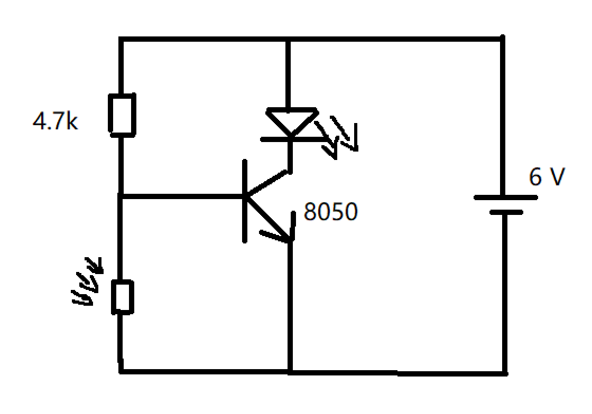
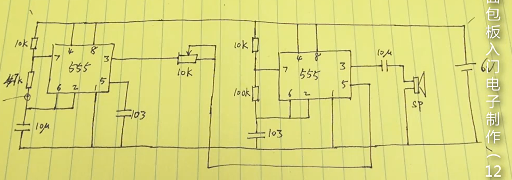
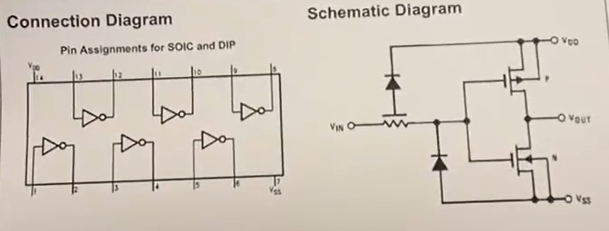

# 面包板入门电子制作

## 第1讲 简介

### 1. 本套视频的教学目的和特点

### 2. 套件中元器件的介绍及其在未来中的应用

## 第2讲 元器件探索

### 1. 通过探索性实验，发现面包板的内部结构

#### 面包板

面包板的每一个纵列是连同的


### 2. 使用所有元器件来实验，了解它们的电器特性

### 3. 发现各个元器件与LED串联时的变化关系

## 第3讲 LED灯实验

### 1. 研究各种LED灯的区别和特性

* 散光（草帽）

* 聚光（普通）

  

颜色不同的LED灯驱动电压可能不一样

* 红色 1.8V
* 绿色 1.8V
* 黄色 1.8V
* 蓝色 3V
* 白色 3V
* 草帽绿 3V

### 2. 利用LED不同的驱动电压制作电池电量指示灯

### 3. 完成用电位器控制两个LED灯交替闪烁的制作

## 第4讲 电路原理图

### 1. 电路原理图的基本概念

### 2. 套件中常用元器件的原理图画法

#### 电池


#### 电容

* 无极性电容

  

* 电解电容（有正负极）

  

#### 电阻

* 普通电阻

  

* 可变电阻

  

#### 三极管

* NPN

  

  

* PNP

  

#### 二极管

* 普通二极管

  

* 发光二极管

  

#### 开关

* 有锁定的开关

  

* 无锁的微动开关

  

#### 扬声器

* 喇叭

  

* 蜂鸣器

  

#### 芯片

* 普通芯片

  

* 放大器

  

* 反相器

  

#### 继电器


#### 电机


## 第5讲 三极管

### 1. 三极管的基础知识及原理

#### 三极管的两个功能：

* 开关

  小电流驱动大电流

* 放大

  可以将小的声音放大

串联两个电池变成6V的电路


#### “地”的作用：

* 不是指地球的大地

* 电路中所有接地的点需要接在一起

* 是指基准电平，是其他电压的参考点

* 为整个电路提供参考标准

* 接地的符号

  

  或者

  

### 2. 三极管制作简单控制开关

#### 常见型号：

* NPN型

  8050

  9013

  

  

* PNP型

  8550
  
  9012
  
  

#### 三极管的等效电路：

##### NPN的等效电路：


​	给b集施加一个电压就可以拨动该开关，让e和c连通

> NPN三极管类似上面的开关电路，给b极施加一个电压就可以使c和e导通

##### PNP的等效电路


b极低电平的时候，e、c导通，b极施加一个电压时，e、c是断开的

> 视频讲的PNP c到e是常闭的，但是导通需要b接地，所以b不接地时，c和e虽然是常闭的，但是没有导通

#### 制作一个三极管电路：

##### NPN型三极管

电路图：


实验：


##### PNP型三极管

电路图：

说明：以下电路虽然三极管的e、c的极接反了，但是该三极管只是当作开关使用，所以电路还是可以连通（如果当作放大电路使用就会出现问题）。把e、c对调，效果也是一样的


实验：


把e、c集对调的电路图：


实验：


### 3. 三极管制作正向和反向磁控开关

#### 正向磁控开关

干簧管不导通时，led灯不亮

干簧管导通时，led灯亮

电路图：


#### 反向磁控开关

干簧管不导通时，led灯亮

干簧管导通时，led灯不亮

电路图：


实验图：


### 4. 三极管制作触摸和信号感应开关

使用三极管放大电信号

原理图：


实验图：


> 小知识：
>
> 人体电阻大约在2千欧-20兆欧范围内。

## 第6讲 延时电路制作 

### 1. PN节的工作原理

### 2. 自激现象

上节课的多级放大电路，会有一个自激现象：触摸导线使led灯亮后，它就一直亮着。

自激现象：内部形成了闭环电路，使三极管一直处于导通状态。利用这一特性可以制作简单的触摸开关。

### 3. 学习电容在电路延时中的作用

1. 用导线把电容正负极短接可以快速放掉电容中的电量

2. 如何把延时时间加长或减短呢？
   * 方法1：改变电容值，电容容值越大，延时时间越长
   * 方法2：改变三极管b端的电阻值，电阻值越大延时时间越长

### 3. 使用电容制作延时触摸LED灯

通过在上一节的三极管触摸电路中加入电容来实现

### 4. 制作按键式延时开关LED灯


> 1. 当电阻值大于1M欧时，LED灯的亮度会有所减弱，尽量在1M欧之内调整电阻值
>
> 2. 电容值在小于1uF时，其充放电量较小，不适用于延时电路中
> 3. 1k欧的电阻只是为第2个三极管限流的与延时时间无关

## 第7讲（上/下） 光敏电路和声控电路

### 光敏电路

光敏电阻有光照射时阻值变小

**第一个电路：**


遮盖光敏电阻，灯会变暗一点。

> 注：灯只是暗一点，并没有熄灭。

**第二个电路**



有强光照射时，led不亮。不过我们的目的是向让led灯在有光的时候灭，无光的时候亮

> 4.7k电阻的阻值太小，不是很理想，要很强的光照射光敏电阻才能使LED灯熄灭。

**第三个电路**


有光时灭，无光时亮

> 47k是一个下拉电阻，如果阻值越大，把b极下拉到低电平的难度越大，此时b极只需要比较弱的电流就可以时三极管导通。比如，下拉电阻使用1k和47k比，使用1k下拉电阻时，需要更强的光照射光敏电阻，才能使三极管导通。


### 声控电路

该声控电路中的元器件是按3V电源设计的。

电容的作用：通交流，阻直流

三极管的放大状态：不截止、不饱和、Vc>Vb>Ve的时候放大

> 1. 三极管会有三种状态（三种状态是呈线性关系的）：截止、放大、饱和
>
> 2. 下图中的10k和1M电阻的阻值是要通过计算得出的，才能使三极管处于放大状态，一个条件是后面的那个电阻（10k）必须小于前面那个（1M），具体的阻值要通过计算，视频没有深入介绍。
> 3. 电容的作用是隔开偏置电阻部分的电压：4.7k电阻是一个偏置电阻，不能使它和后面的1M电阻和10k电阻互相影响，所以这边使用一个电容把他们断开了

电路图：


> 1. 套件中的话筒全名是"驻极体话筒"，是一种电容式的话筒结构，它可以产生一个电容变化。
>    * 通常话筒引脚连接到金属外壳的为负极，未接到外壳上的为正极
>
> 2. 交流电：随时间的变化，正负极会发生变化，比如家里的220v交流电，在正负220v之间，以50赫兹的频率交替变化。
>    * 交流电可以穿过电容（等同于导线）
>    * 直流电不能穿过电容（等同于断开）

## 第8讲 三极管放大原理

### 1. 三极管放大电路的原理距离、粗解、细解

以水龙头作比喻：


水龙头开关类似b极，只要在b极施加一个力，就可以打开水龙头，类似的只要给三极管的b极施加一个较小的电流就能使三极管导通。

#### 放大原理

放大一个放大交流信号（变化的波形），放大电路不能放大直流，那属于三极管开关电路的属性。

经典的放大电路图：


该电路图会把3v的信号放大成为12V的信号（时间上不是放大，而是通过较小的信号去控制较大的信号产生，从而达到放大的效果）

可以看到放大后的信号和原信号是反相的。

> 如何得到相位相同的波形呢？
>
> 再增加一个放大的三极管，让相反的波形变回来。

### 2. 使用2个三极管制作音频放大电路（扩音器）

下图为一个音频放大电路


上图的四个电阻的关系是:

* `a> b`
*  ` c>d` 

放大信号可能会有失真，具体的阻值需要通过测试得出最佳阻值。

> 因为整个电路功率较小，实验时出现破音失真的现象是正常的。
>
> 三极管的知识比较重要，需自己再去理解去原理。

## 第9讲 初识别芯片LM386

### 1. 芯片外观、引脚顺序、型号的识别方法

#### 引脚顺序

让豁口或圆点朝左侧，从左下角逆时针顺序开始计数，左下角为第一脚，逆时针累加到上一排左上角结束。

#### 芯片型号说明

比如386D的芯片 `386D JRC H025B`


* `386D`是一个型号
* `JRC`是生产厂家的名称缩写标注

> 不同厂家 同一型号的芯片的功能是一样的

#### 芯片功能

查看芯片手册

**芯片的内部结构：**


> 思考：这么多元器件是怎么压缩到一个小芯片中的呢？
>
> 芯片是在一个硅片上制作出的集成电路

**芯片的电器参数**


**芯片的性能参数图表**


**芯片的经典电路连接图**


放大电路在电路原理图中多画成三角形

**芯片的封装规则说明**


### 2. 使用2个三极管制作音频放大电路（扩音器）


> 输入端+ - 极可以反接，输出的相位则有改变
>
> 通过1 8 7脚来设置芯片的放大倍数和性能

上图是芯片手册里的`20倍增益的经典电路连接图`

我们利用这个电路图来做实验：

* 把音频输入端改成麦克风

手画一个电路图：


1. 在电源上并联大电容可以稳定电源，提升放大性能
2. 在1脚和8脚之间连接一个10uF的电容，7脚断开，可以提高放大倍数

> 1脚和8脚的电容连接为8脚出来是正极
>
> 麦克风旁边的电容我用的是4.7uF，视频没写，随便连接测试的

实物连接图：


> 小常识：啸叫 当麦克风靠近喇叭时会出现尖锐的嗡嗡声，这种现象就是"啸叫"


## 第10讲 时基NE55芯片介绍

### 1. 时基NE555芯片介绍

一款跟时间有关的芯片

以时间为基准的电路就是时基芯片

#### 芯片手册

**内部结构图：**


引脚：

* 1脚：GND
* 2脚：触发一个信号
* 3脚：输出，2脚触发时3脚输出一个高电平
* 4脚：复位
* 5脚：控制电压
* 6脚：阈值，用于结束触发状态
* 7脚：放电，为外部电容放电的，使达到循环时间的效果
* 8脚：VCC，接电源正极


### 2. NE555制作交替闪烁的LED灯电路

接下来制作下图的电路：


手画电路：


实物连接：


两个LED灯会交替闪烁

实验得知：

* 加大电容的容值，闪烁的频率会变慢。

* 加大7脚和2脚之间的阻值，闪烁频率也会变慢

* 加大4脚和7脚之间的阻值，在下面的LED灯会点亮较久，上面的led灯点亮时间较短

#### NE555是怎么通过电容电阻来延时的呢：


* 当2脚收到一个电平的时候即触发启动

* 当6脚收到一个电平低于阈值时则触发关断

* 4脚接VCC是让芯片保持在正常工作状态
* 当2脚触发时，7脚的三极管也会导通，使7脚接地，处于放电状态

查看具体电路：


6脚和2脚连接在一起，当输入电平高于某个值时触发开关，低于某个值时触发关断。

当接通电源时，电容开始充电，在电容充电的过程中，电容正极的电压会不断提升，2个电阻会使电容的提升变得缓慢，当电容电压提升到阈值的时候，2脚电平达到条件被触发，3脚输出。当进入触发状态时，7脚就被芯片内部接地了，使得电容里面的电不断输出，电压下降，下降到一定阈值时，触发6脚截止。截止时，7靠谱不放电了，电容又开始充电，如此反复循环。


## 第11集

### 1. 使用NE555接入扬声器产生音频

实验：

* 将上节电路中的47k电阻替换成电位器（套件中的电位器最大阻值为10k）

* 把下面的那个led灯替（3脚和GND之间的灯）换成喇叭

3脚在触发时输出高电平，截止时触发低电平

### 2. 使用NE555制作极简单的触摸灯开关


当触摸2脚时，LED灯开，当触摸6脚时，LED灯灭

> 实验发现不是很稳定

变换：在7脚处加入一个led灯


触摸6脚，7脚的LED灯亮，3脚的LED灯灭

触摸2脚，7脚的LED灯灭，3脚的LED灯亮

## 第12集
### 1. 使用NE555制作双音频报警电路



使用2片NE555制作交替双音频电路（2片NE555都是经典的时基频率电路）。

通过两个谐振，产生交替的两个音频信号。

> 双音频信号很常见，如救护车、消防车灯。

### 2. 介绍二极管及桥式整流电路


上图说明：

* 输入端可以正负极对换或者是交流电，输出端是上正下负的交流电

* DC表示直流电，AC表示交流电
* 4个二极管所组成的叫全桥整流电路，如上图所示
* 1个二极管所组成的叫半桥整流电路，电路中利用一个二极管来避免电源反接。

## 第13集
### 1. 介绍CD4017芯片的接口定义和功能


* 在CMOS芯片中Vss表示接地/电源负极

* 从Q0到Q9共有10个输出接口

* C0接口是进位输出，当Q0到Q9计数一个循环后C0输出一个脉冲信号。

* INH计数禁止控制，低电平时运行计数，为高电平时禁止计数。

* CP是计数输入（或时钟输入）接口

* CR 清零输入接口，输入一个脉冲时，回到Q0位输出

* VDD 表示电源正极 CD4017工作电压时3V到15V之间

> 知识点：
>
> 通常芯片的电源正负极接口会放置在芯片的左下角（负）和右上角（正）

### 2. 使用CD4017制作按键控制LED电路

补充知识：

* CD系列的芯片都属于CMOS电路

* CMOS是一种集成电路的工艺类型

* CMOS的输入端不能悬空，因为输入端的灵敏度非常高，只要一有风吹草动，马上就有波动变化，所以输入端需要全部接地或者高电平。

控制LED灯输出的电路图：


说明：

* 将不用的INH和CR接地

* 在CP端加10k的下拉电阻

* 按键抖动：

  问题：按键不稳定是由于按键本身的特性导致的，按键的振动让CP端多次计数，导致不稳定。

  解决方法：在按键的两端并联0.1uF的电容，可以滤除按键的振动干扰。电容是通交阻直的，振动引起的电流是个交流电，正好可以被电容吸收了（视频是说被电容短路吸收掉了，没看明白）

* 思考：怎么改动电路，使它形成5个LED的循环效果，而按正常的电路接法应该是10个LED的循环才对。

  将Q5的输出接到CR上既可实现5个LED的循环效果


## 第14集
### 1. CD4017与NE555组合成自动彩灯电路的实验

时基芯片NE555可自动给CD4017所需的计数脉冲

彩灯闪烁速度是由NE555端的电容、电阻来控制的

电路图如下所示：


### 2. 使用CD4017制作简单密码锁的原理及实验

制作一个简单密码锁：连续按1号按键多下才能使LED灯亮（达到开锁的效果），按其他按键就清零。


## 第15集
### 1. 使用CD4017制作简单密码锁的深入讲解

实现功能：按照顺序按出密码则开锁，按错则复位


原理：按下Q0按键，cp高电平，产生进位，接下来按下按键Q1，产生进位，如果按其他按键则没有效果。

如果想改变密码，可以把密码对应的按键按顺序接到Q0 Q1 ....  其他不需要的按键可以和复位按键并联接在一起。

### 2. 光敏电阻和LED是否自激发的启发性实验


思考：上面的二极管和光敏电阻是否会自激，导致电路一直导通，LED一直发亮。


## 第16集
### 1. 介绍CD4069六非门芯片的功能和引脚定义




* CD4069是一个基础的逻辑电路。

* CD4069芯片中由独立的6个非门电路。
* 三角形加一个圆圈是一个反相器（非门），三角形端是输入，圆圈端是输出。

* CD4069芯片工作电压是3V-15V
* 门电路还有着隔离和放大驱动的作用

#### 实验：使用一个或两个非门来测试LED灯的点亮

使用一个非门来控制LED灯，输入高电平，LED灯灭，输入低电平，LED灯亮。

使用两个非门来控制LED灯，输入高电平，LED灯亮，输入低电平，LED灯灭。

### 2. 使用CD4069制作自锁开关的原理及实验

实现效果：按一下LED一直点亮，再按一下熄灭。


> 实验中0.01u的电容换成473的电容

* 初始状态，按键未按下，电容是放完电（或一开始就没电）的状态，2号非门的输入端是低电平，1号和3号非门的输入端是高电平。

* 按下按键，电流从电容通过开始充电，在电容充电的瞬间，电容在电路中相当于短路状态，相当于1号非门的输入端接地，所以2号非门输入端是高电平，3号非门输入端是低电平、输出端是高电平，LED灯亮。
* 松开按键，此时电容的电已充满，相当于断开状态，2号非门的输入端保持高电平状态，输出端是低电平状态，通过100K的电阻返回1号非门的输入端，使得低电平得到保持，整个电路趋于稳定状态，LED灯保持点亮。
* 再次按下按键，电容开始放电，2号非门的输入端也是高电平的状态，此时会把1号非门的输入端拉高成高电平，所以1号非门输出低电平，3号非门输入高电平、输出低电平，LED灯灭。
* 按键松开，2号非门的输出端是高电平，通过100K电阻返回1号非门的输入端，保持高电平状态，电路趋于稳定，LED灯保持熄灭的状态。

> 整个电路最终状态取决于1号非门的输入电平。门电路具有隔离的作用，输出端的电压不会反过来作用到输入端。

## 第17集
### 1. 介绍CD4069制作闪烁电路的原理和实验

使用CD4069制作闪灯电路（方波脉冲输出）


* 假设没有电容那部分电路，初始状态下1号非门的输入为低电平，输出为高电平，高电平又会通过电阻那边的电路返回回去，把1号非门的输入拉高，1号非门输出端变为低电平，此时又会通过电阻那条回路又作用回去，把1号非门的输入拉低，如此反复，以极快的速度进行高低电平的切换。

  > 自己的输出送回到输入，形成自我反馈电路。

* 加入电容的电路，当1号非门输入低电平输出高电平时，1号非门输出端的高电平会通过电阻过来给电容充电，此时该线路上的电压（1号非门输入端）缓慢上升，达到一定的值时（超过2.8v会认为是高电平）会非门会判断为输入高电平，然后输出低电平，2号非门输入低电平，输出高电平，LED灯亮。此时电容开始放电，放到一定电压时，1号非门的输入端变成低电平，输出高电平，2号非门输入高电平，输出低电平，LED灯灭。

  > 利用电容充电、放电所具有的延时特性

### 2. 常用的电路形式

常用的电路形式：

* 单稳态：延时电路，按一下亮，过一会儿灭这种
* 双稳态：按一下开，按一下关，带自锁的
* 脉冲输出：像上面的电路灯闪烁，有个方波输出

## 第18集
### 1. 介绍CD4069制作放大电路的原理
### 2. 介绍CD4069制作声控LED灯电路

## 延展

### 三极管的开关特性

参考博客：https://zhuanlan.zhihu.com/p/143366794

## 其他

目录

```txt
# 第8集 
1. 三极管放大电路的原理距离、粗解、细解
2. 使用2个三极管制作音频放大电路（扩音器）

# 第9集
1. 芯片外观、引脚顺序、型号的识别方法
2. LM386芯片的功能、性能、经典电路的介绍
3. LM386芯片实作麦克风放大电路

# 第10集 
1. 时基NE555芯片介绍
2. NE555制作交替闪烁的LED灯电路

# 第11集
1. 使用NE555制作极简单的触摸灯开关
2. 使用NE555接入扬声器产生音频

# 第12集
1. 使用NE555制作双音频报警电路
2. 介绍二极管及桥式整流电路

# 第13集
1. 介绍CD4017芯片的接口定义和功能
2. 使用CD4017制作案件控制LED电路

# 第14集
1. CD4017与NE555组合成自动彩灯电路的实验
2. 使用CD4017制作简单密码锁的原理及实验

# 第15集
1. 使用CD4017制作简单密码锁的深入讲解
2. 光敏电阻和LED是否自激发的启发性实验

# 第16集
1. 介绍CD4069六非门芯片的功能和引脚定义
2. 使用CD4069制作自锁开关的原理及实验

# 第17集
1. 介绍CD4069制作闪烁电路的原理和实验

# 第18集
1. 介绍CD4069制作放大电路的原理
2. 介绍CD4069制作声控LED灯电路

# 第19集
1. 介绍CD4026及数码管的接口定义
2. 制作案件控制数码管计数器

# 第20集
1. 使用NE555和CD4026制作自动计数器
2. 制作个十百位自动计数器

# 第21集
1. 介绍三极管和电容组成的自激谐振电路原理
2. 制作自激谐振高音发生器电路

# 第22集
1. 用三极管制作双稳态开关的原理与制作

# 第23集
1. 用单按键控制双稳态开关的原理与制作

# 第24集
1. 制作声控双稳态LED灯开关

# 第25集
1，将NE555电路和三极管渐变电路组合
2，制作渐变亮度的LED呼吸灯
3，加入二极管制作突亮渐暗的警示灯

# 第26集
1，使用CD4069芯片制作超高倍信号放大器

# 第27集
1，介绍更多CD40及其他芯片
2，以CD4013为例讲解芯片的分析方法

# 第28集
1，介绍洞洞板和焊接工具
2，演示电路板焊接的过程

# 第29集
1，介绍其他电池的性能和使用
2，介绍强电控制用可控硅和继电器

# 第30集
1，对本套视频的理论总结并致谢
```

